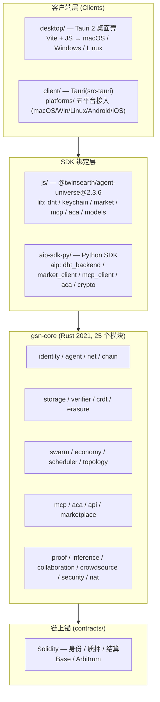
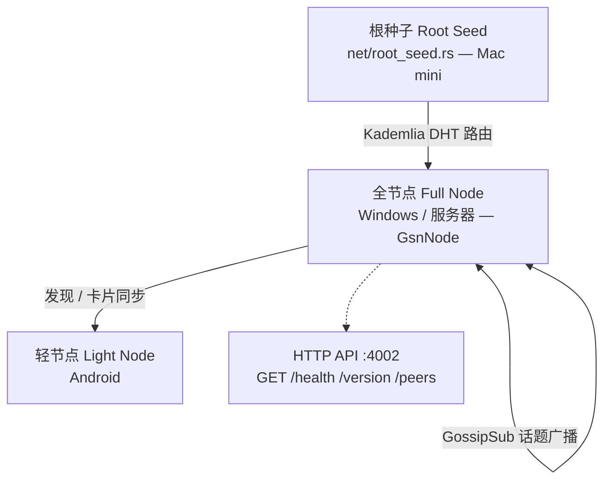
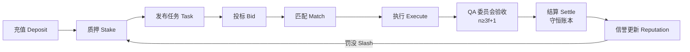

# Agent Universe v2.3.6 — 技术架构与系统框架

> 本文档基于仓库实际源码梳理（`gsn-core/src/`、`js/lib`、`aip-sdk-py/aip`、`client/`、`desktop/`、`contracts/`），逐项标注真实实现状态。
> 最后更新：v2.3.6。

## 1. 技术架构 & 系统框架

整体为「核心库 + 多语言绑定 + 跨端客户端」的分层结构：

- **核心库**：`gsn-core/`，模块声明见 `src/lib.rs`。
- **守护进程**：`src/bin/` + `src/node.rs`（`GsnNode`），命令行 `--listen/--port/--api-port`（缺值已做边界保护，退出码 1，不再 panic）。
- **多语言绑定**：Rust 经 `ffi/` 暴露；JS SDK 与 Python SDK 模块一一对应（dht / market / mcp / aca / crypto）。
- **跨端形态**：`desktop/`（Tauri 2，已出 macOS `.app`）、`client/`（Tauri + `platforms/` 五平台接入文档）。

## 2. 网络结构 & 安全机制

### 2.1 P2P 网络拓扑

| 组件 | 源码 | 端口 / 实现 |
|---|---|---|
| 节点 `GsnNode` | `net/libp2p_node.rs` | P2P **4001**、HTTP **4002**，已真实 `bind` |
| DHT `KademliaClient` | `net/dht.rs` | 分片 `shard_count`；当前**内存 HashMap**，未接 libp2p Kademlia |
| 广播 `GossipSub` | `net/gossip.rs` | pub/sub topic；当前**内存**实现 |
| 根种子 | `net/root_seed.rs` | Mac mini 引导配置 |
| HTTP API | `api/rest.rs` | `/`、`/health`、`/version`、`/peers`；`route()` 与传输解耦 |

### 2.2 安全机制

| 机制 | 源码 | 实现 |
|---|---|---|
| 身份 DID | `identity/did.rs` | `did:aip:<Ed25519 公钥>` |
| 密钥 / 签名 | `identity/keyring.rs`、`signer.rs` | Ed25519 密钥对 + 签名 |
| 行为评分 | `security/mod.rs` `SecurityEngine` | `report_behavior(SecurityFlag)` → `ban_node` / `is_banned` / `random_neighbors`（本地信誉，非加密沙箱） |
| BFT 容错 | `marketplace/qa_committee.rs` | **n ≥ 3f+1，法定人数 q = 2f+1**；`QaVote`/`QaDecision`，拜占庭下 stop/continue 裁决 |
| 结算守恒 | `marketplace/settlement.rs` | 不变量 `balance_sum = total_paid − total_slashed`，`total_paid ≤ total_budget`，`ConservationReport` 校验 |
| 任务信封 | `aca/envelope.rs` `TaskEnvelope` | `VerificationLevel`、`PrivacyRequirement`、`TaskPriority`、预算 / MCP tool 声明 |

## 3. 功能模块 & 产品功能

### 3.1 智能体市场闭环（marketplace/）

| 模块 | 源码 | 功能 |
|---|---|---|
| AgentCard | `marketplace/agent_card.rs` | 注册、能力标签、质押准入 |
| TaskSpec | `marketplace/task.rs` | 六字段校验 goal/context/done/todo/trace/owner |
| QA 委员会 | `marketplace/qa_committee.rs` | n≥3f+1 验收，整轮 equivocation 作废 |
| 信誉 | `marketplace/reputation.rs` | quality/speed/honesty/availability，不可转让 |
| 结算 | `marketplace/settlement.rs` | 充值→质押→发布→投标→匹配→完成→结算→罚没 |
| 证据 | `marketplace/evidence.rs` | verified / cpu-proto / unverified 分级 |

### 3.2 连接协议

- **MCP**（`mcp/`）：`McpServer` 支持 `register_tool` / `register_resource` / `register_prompt`，传输 `stdio.rs` + `sse.rs`。
- **ACA**（`aca/`）：`TaskEnvelope` 全链路（`envelope / crypto / receipt / verification`），带隐私要求与验证等级。
- **REST API**（`api/rest.rs` + `market_actor.rs`）：健康检查、版本、节点列表、市场动作。

### 3.3 支撑模块

`swarm` 群体智能、`economy` 信誉经济、`scheduler` 调度、`topology` 分层拓扑、`crdt` 状态同步、`erasure` 纠删码、`proof` + `chain/pocv` 可验证计算、`inference / collaboration / crowdsource`。

### 3.4 客户端产品

`desktop/` Tauri 正式包（内含 SDK，一键运行市场端到端演示：充值→质押→发布→投标→匹配→完成→结算→守恒校验）；`client/platforms/` 提供 macOS / Windows / Linux / Android / iOS 五平台接入。

## 4. 实现状态对照（工程诚实声明）

| 能力 | 状态 |
|---|---|
| gsn-daemon 编译 / 启动 / 参数解析 | 已落地（Rust 测试 144 项全绿） |
| 4001 / 4002 端口真实 bind | 已落地（`tokio::net::TcpListener`） |
| JS SDK 单测 | 已落地（8 项全绿） |
| BFT-lite / 结算守恒 / 信誉 | 进程内可测原型 |
| DHT / GossipSub | 内存数据结构，未接真实 libp2p |
| SQLite 持久化 | 未落地 |
| 链上合约（Base/Arbitrum）结算 | 未落地（`contracts/` 为定义，未部署主网） |

> 结论：核心库与市场闭环为**可运行、可测试的进程内原型**；P2P 网络与链上结算仍是骨架，需后续接 libp2p、SQLite 与主网合约。
