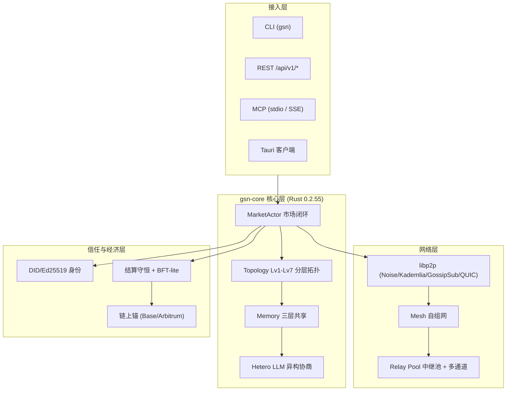

# Agent Universe v2.5.5 — 技术架构与系统框架

> **当前版本**：gsn-core `0.2.55` / npm `2.5.5`
> **发布日期**：2026-09-26
> **上一版本**：v2.5.4（Traversal，NAT 穿透）
> **本文档覆盖**：v2.4.0 ~ v2.5.5 全部架构演进，含三端（Mac mini / Windows / Linux 云 VM）跨网真机实测。

---

## 一、系统总览

Agent Universe（智能体宇宙）是一个**群众化的 AGI 路线**：去中心化的智能体共享与开源网络。核心理念是「**群体智能 = 网络结构的 Scaling Law**」——大模型 Scaling Law 解决了智能的有无，本项目在其上实现更多、更大、更强、可自我迭代的群体智能。



---

## 二、技术架构 & 系统框架（分层）

### L0 接入层

| 接口 | 入口 | 场景 |
|---|---|---|
| **CLI** | `gsn` 二进制（`version/identity/daemon/mcp/market`） | 命令行直接操控节点 |
| **REST** | `/api/v1/*`（市场端点）+ `/api/v1/network/*`（网络端点） | 软件间数据与能力交换 |
| **MCP** | `market_*` 18 个工具，stdio + HTTP/SSE 双传输 | AI 大模型安全调用市场能力 |
| **Tauri 客户端** | `client/`（Vite + Rust 壳） | macOS / Windows / Linux / Android GUI |

### L1 业务核心层（gsn-core）

| 模块 | 路径 | 职责 |
|---|---|---|
| 智能体市场 | `marketplace/` | 注册/发现/匹配/投标/结果/BFT 验证/结算/信誉 |
| 拓扑 | `topology/`（graph/layer/neighbor/router） | **Lv1–Lv7 分层拓扑**，扇入 ≤9、路由 ≤7 跳、降级回扁平 |
| 记忆 | `memory/`（agent/enhanced/flywheel/handoff/layered/shared_memory） | **三层记忆**：个体 / 群体 / 跨代；多模态检索、评价防污染、LRU 压缩 |
| 异构协商 | `collaboration/hetero_llm.rs` | 跨模型独立推理 → 评分 → 内部投票（BFT-lite） |
| 经济 | `economy/` | 信誉时间衰减、贡献证明、动态定价 |
| 调度 | `scheduler/` | 任务路由、负载均衡 |
| 沙箱 | `sandbox/`（docker/firecracker） | **Sandbox trait**：Docker 共享内核 / Firecracker microVM |

### L2 网络层

| 模块 | 路径 | 职责 |
|---|---|---|
| libp2p 节点 | `net/`（dht/gossip/libp2p_node/peer/root_seed） | Noise + Kademlia DHT + GossipSub + QUIC |
| Mesh 自组网 | `mesh/`（heartbeat/discovery/mesh/session） | 心跳三态、广播、嗅探、会话；临时 SN↔永久身份绑定 |
| 中继池 | `relay_pool/mod.rs` | **v2.5.5 核心**：中继节点池管理 + 多通道 |
| NAT | `nat/mod.rs` | NAT 类型检测与引导 |

### L3 信任与经济层

| 模块 | 路径 | 职责 |
|---|---|---|
| 身份 | `identity/`（did/keyring/signer） | DID、Ed25519、跨平台安全存储 |
| ACA | `aca/`（crypto/envelope/manifest/...） | 规范签名、manifest/message/receipt 加签可验 |
| 市场结算 | `marketplace/settlement.rs` | **结算守恒 O(1) 增量维护**：balance_sum = budget − slashed |
| 链上 | `chain/`（pocv） | PoCV 可验证计算、链上锚定 |

---

## 三、网络结构 & 安全机制（v2.5.5 重点）

### 3.1 Lv1–Lv7 分层拓扑（v2.4.1）

从 P2P 扁平结构改为**七层有界扇入**，应对通信墙：

```
Lv1 房间  ─┐
Lv2 楼宇   │  扇入 ≤ 9
Lv3 街区   │  边数 O(N·logN)（亚二次）
Lv4 城区   │  路由 ≤ 7 跳
Lv5 城市   │  任一不可达 → TopologyRouter 降级回扁平直连
Lv6 区域   │
Lv7 宇宙  ─┘
```

对应 P0b 结论：星型结构中心负载随 N 线性爆炸（增长指数 β=1），分层结构扇入有界（β=0），百万节点中心消息量从 **2097 万 → 9 条**。

### 3.2 Relay 节点池（v2.5.5）

**容量公式**：

| 项目 | 规则 |
|---|---|
| 初始上限 | 10,000 |
| 每月自动扩容 | +10,000 |
| 硬上限 | 运行年限 × 100,000 |
| 手动扩容 | `manual_bonus`（可增可减） |

> 运行 10 年 → 100 万；100 年 → 1000 万；1000 年 → 1 亿。

**中继四类（选择优先级）**：`dedicated`(0) > `self_hosted`(1) > `third_party`(2) > `general`(3)。

**自动维护**：每小时巡检一轮（DHT 随机发现 → probe 不健康候选 → 补齐多通道 → 清理 dead 节点）；启动后 8s 首轮；节点连续失败 3 次标记 `dead`；失效时按 DHT 候选与分类优先级自动重新分配。

### 3.3 多通道智能切换（方案 2/3/4）

| 方案 | 内容 | 状态 |
|---|---|---|
| 方案 2 | 改 NAT 环境（端口转发/DMZ/锥形 NAT） | 检测+引导持续完善 |
| 方案 3 | QUIC/UDP 打洞直连 | ✅ 真机验证 |
| 方案 4 | 多 relay 多通道同时在线同时通讯、智能切换（默认 3 条） | ✅ 真机 active=3 |

任一通道掉线/失败，`ensure_channels` 自动从健康池选节点补全到目标通道数（常量 `DEFAULT_PARALLEL_RELAYS = 3`）。

### 3.4 网络安全机制

- **传输加密**：libp2p Noise 握手，P2P 4001（TCP + QUIC/UDP）；
- **身份**：Ed25519 签名，`did:aip:<sha256(原始32字节公钥)前8字节>`；
- **BFT-lite 容错**：`n ≥ 3f+1`，equivocation 整轮作废，view change；
- **结算守恒**：`balance_sum = budget − slashed`，O(1) 增量、防重复支付；
- **沙箱隔离**：microVM（Firecracker）嵌套虚拟化，不共享宿主内核；
- **证据分级**：verified / cpu-proto / unverified 三级标签随数据流动。

---

## 四、功能模块 & 产品功能

### 4.1 大模型适配层（v2.4.8 ~ v2.5.1）

| 后端 | 文件 | 状态 |
|---|---|---|
| DeepSeek | `deepseek/`（adapter/protocol/recipe/tokenizer） | ✅ 提示词编码/token 编解码 |
| OpenAI | `llm/openai.rs` | ✅ Chat Completions |
| Gemini | `llm/gemini.rs` | ✅ 1M 上下文 |
| Anthropic | `llm/anthropic.rs` | ✅ Messages API |
| 豆包/火山方舟 | `llm/doubao.rs` | ✅ Seed 2.1，1024K |
| 国内六大 | `llm/domestic.rs` | ✅ Kimi/千问/智谱/MiniMax/混元/小米 |
| 网络路由 | `llm/network.rs` | ✅ 国内外分组、外网断自动降级 |

### 4.2 三层记忆体系（v2.4.2 ~ v2.4.6）

```
个体记忆（agent_memory）   ← 单智能体内部
   └── 群体记忆（shared_memory） ← 子网/全网共享
          └── 跨代记忆（layered + TraceLedger 哈希链）
                 └── 分层主体记忆（Lv1–Lv7 各层一份）
```

- **增强**：多模态标签/关键词/向量检索；记忆评价防污染（区分好坏经验）；LRU 压缩与遗忘；
- **交接**：TransferBundle 六字段（Goal/Context/Done/Todo/Trace/Owner）机械校验；
- **飞轮**：协同 → 经验 → 优化结构 → 再协同闭环。

### 4.3 网络 API（v2.5.5，前缀 `/api/v1/network`）

| 方法 | 路径 | 说明 |
|---|---|---|
| GET | `/info` `/peers` `/nat` `/relays` | 节点/中继池状态 |
| POST | `/bootstrap` | 主动拨号（`{"addr"}`） |
| POST | `/relay-listen` | 作为 relay 监听 |
| POST | `/relays/add` | 手动加入（`addr`,`class`） |
| POST | `/relays/remove` | 移除并关闭通道（`target`） |
| POST | `/relays/expand` | 手动扩容（`amount`） |
| POST | `/relays/discover` | 触发 DHT 发现 |
| POST | `/relays/ensure` | 立即补齐多通道 |

---

## 五、三端跨网真机实测（v2.5.5）

### 5.1 测试拓扑

| 节点 | 系统 | Peer ID | 监听 |
|---|---|---|---|
| Mac mini | macOS | `12D3KooWENBkBDh…UuwgNZ` | `/ip4/192.168.0.107/udp/4001/quic-v1` |
| TwinsEarth | Windows | `12D3KooWSJFk6…UqDV` | 对称 NAT（经 relay） |
| 云 VM | Linux | — | 企业代理组网 |

### 5.2 互见与掉线切换实测

| 阶段 | active 通道 | relay 池 | Mac↔Windows 互见 |
|---|---|---|---|
| 初始 | 3 | 3098 | — |
| Mac `bootstrap` 经共享 relay 拨号 | 3 | 3104 | **YES**（18s 后 peers 出现 Windows） |
| `remove` 148.113.166.44 | 2 | 3106 | — |
| `ensure` 补新 relay | 3（207.148.5.75） | 3106 | — |
| 最终 | 3（160.119.251.84） | 3108 | **YES（维持）** |

**结论**：
- 3 条 active relay 通道同时持有 reservation；QUIC 与 TCP 共存；
- remove 后 ensure **秒级**从健康池补新 relay、恢复 3 通道；
- 切换 relay 后跨网互见**不掉**（经剩余共享 relay 维持）；
- relay 池后台持续 discover 扩充（3104→3108）；
- 80s 多 relay 同时续期不断档、不累积。

### 5.3 已知边界

- DCUtR 对**对称型 NAT** TCP 打洞成功率低（Windows 实测 3 轮失败，属网络拓扑限制、非代码缺陷）；
- 第三方社区 relay 不保证长期在线，故由节点池自动发现与替换；
- 方案 2 的 NAT 类型精确判定与端口转发引导文本持续完善。

---

## 六、代码与测试基线

- **Rust 核心**：`gsn-core/`，`cargo build --release` / `cargo test`；
- **测试**：lib 单测 **61 passed**（含 relay_pool 10 个）、集成测试 **10 passed**；
- **Python SDK**：`aip-sdk-py/`，跨语言签名逐字节互验；
- **JS SDK**：`js/`，`@twinsearth/agent-universe`（公共 npm + jsDelivr CDN + GitHub Packages）；
- **客户端**：`client/`（Tauri 2，源码入库、安装包由 Release 构建产物分发）。

---

## 七、版本演进脉络

```
v2.4.0 Govern(CPU 治理/O(1)/Sandbox)
  → v2.4.1 Layer(Lv1-Lv7 分层拓扑)
  → v2.4.2/3 Memory(个体+群体+跨代三层)
  → v2.4.4 Memory+(检索/评价/压缩)
  → v2.4.5 Handoff(交接/审计/证据分级)
  → v2.4.6 Flywheel(群体智能飞轮)
  → v2.4.7 Hetero LLM(异构多模型协商)
  → v2.4.8/9 DeepSeek/OpenAI/Gemini/Anthropic
  → v2.5.0/1 豆包+国内六大
  → v2.5.2 Net Partition(网络分区降级)
  → v2.5.3 Mesh(自组网)
  → v2.5.4 Traversal(NAT 穿透)
  → v2.5.5 Relay Pool(中继池+多通道)  ← 当前
```

---

*Agent Universe · 智能体宇宙 —— 让科技造福全人类！*
