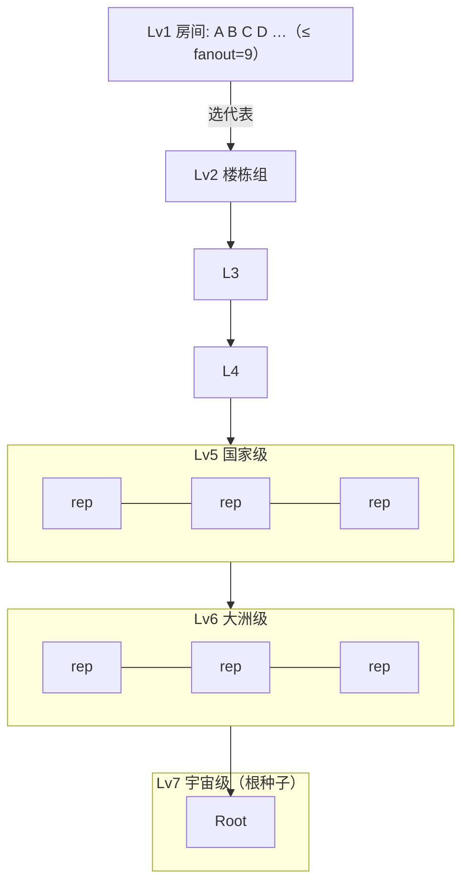

# Agent Universe v2.4.0 / v2.4.1 设计文档

> 本文件是 v2.4.0（CPU 治理轻量化）与 v2.4.1（Lv1–Lv7 分层拓扑）两份设计的合并稿。
> 状态：设计已定，待按本稿落地。所有性能数字均以真机 benchmark 为准，不预设结论。

## 0. 背景与动机

v2.3.6 已落地：gsn-daemon 真实 bind 4001/4002，BFT-lite / 结算守恒 / 信誉、MCP、ACA、三语言 SDK 对齐。但仍有两个已被实测暴露的瓶颈：

1. **网络结构是扁平 P2P**：`topology/graph.rs` 是 `HashSet` 节点 + `HashMap` 双向边，本质是全连接扁平图。P0b 证据一表明，百万节点星型结构中心负载 20,971,520 条消息、关键路径 8,388,608 轮；分层结构下每个节点扇入恒为 9、关键路径 14 轮。当前实现未体现这一优势。
2. **治理开销未量化、沙箱仍是 Docker 共享内核**：市场闭环（结算守恒、信誉更新、QA 投票）每次都要扫表/全量校验；任务沙箱还是 Docker，不是 microVM。Vultr 白皮书只能证明「治理开销存在且贵」，不能证明 UDOS 治理栈轻量——后者要真机量。

版本分工：
- **v2.4.0**：CPU 治理路径轻量化 + 沙箱隔离升级 + 治理开销可测（面向 96C/192T 单机密度）。
- **v2.4.1**：网络从扁平 P2P 升级为 UDOS 七层分层拓扑（Lv1 房间级 → Lv7 宇宙级）。

---

## 1. v2.4.0 — CPU 治理轻量化与沙箱

### 1.1 目标与非目标

**目标**
- 结算主路径（deposit / settle / slash）从 O(N) 扫表降为 O(1) 字典写。
- 守恒检查 `ConservationReport` 改为增量维护（每笔交易即时更新 `balance_sum / total_paid / total_slashed`），不再每次遍历全表。
- 信誉更新改为事件增量，不在结算回调里全量重算。
- 治理开销建立真机 benchmark：测量「一笔结算在主路径上消耗的 CPU 周期」与「业务沙箱本身的 CPU 周期」，给出治理占比。
- 沙箱接口抽象（trait `Sandbox`），Docker 为默认实现，microVM 为可选实现（部署侧）。

**非目标（v2.4.0 不做）**
- 不改链上合约，不接主网。
- 不改网络层拓扑（那是 v2.4.1）。

> **关于 microVM（按评审意见 3，真上，不做占位）**
> `FirecrackerSandbox` 是**完整可用实现**：调用 firecracker binary、加载 vmlinux + ext4 rootfs、通过 MMDS 下发任务、配置 vCPU/内存配额、回收快照。它在**带 `/dev/kvm` 的裸金属 / 物理机**上真跑 microVM 强隔离。
> 运行时探测 `/dev/kvm`：
> - 存在 → `IsolationLevel::MicroVM`，真实启动 Firecracker；
> - 不存在（如当前 cloud VM：无 vmx/svm、无 /dev/kvm）→ 不静默降级冒充 microVM，而是**显式返回 `SandboxError::EnvBlocked("no /dev/kvm")`**，由调用方决定退回 Docker 共享内核（并在日志标注隔离级别已下降）。
> 交付物包含 kernel 与 rootfs 的构建/启动脚本，在有 KVM 的机器上一键起。

### 1.2 设计：守恒账本增量化

现状（`marketplace/settlement.rs`）：
- `balances: HashMap<String, f64>` + `total_budget / total_slashed`；
- `ConservationReport` 每次遍历 `balances` 求和。

改造：
- 新增字段 `balance_sum: f64`，随 `deposit / settle / slash` 即时增减；
- `ConservationReport` 返回 O(1)：`balance_sum == total_paid - total_slashed` 恒等式；
- 保留一个 `audit_full_scan()` 作为运维对账入口（O(N)，不进主路径）。

不变量（逐位保持）：
```
balance_sum = total_paid - total_slashed
total_paid  ≤ total_budget
```

### 1.3 设计：沙箱 trait

```rust
pub trait Sandbox {
    fn run(&mut self, task: &TaskSpec, cpu_quota_mhz: u32) -> Result<SandboxResult, SandboxError>;
    fn isolation(&self) -> IsolationLevel; // DockerSharedKernel / MicroVM
}
```

- `DockerSandbox`：默认实现，记录 CPU 时间。
- `FirecrackerSandbox`：**真实现**——通过 firecracker API 配 boot source（vmlinux）、drives（rootfs ext4）、vcpu/mem、MMDS；启动后跑任务、收退出码与 CPU 时间。无 `/dev/kvm` 时构造即返回 `EnvBlocked`。
- 运行时选择：`SandboxRegistry::pick()` 先探 `/dev/kvm`，优先 microVM，否则 Docker（隔离级别在结果里如实标注）。
- benchmark 夹具：在 `tests/` 下跑 N=1k/10k/100k 笔结算，测主路径耗时与 CPU 周期。

### 1.4 验收

- `cargo test` 不回归（基线 144 项全绿，新增项计入）。
- 新增 benchmark：N=100k 笔结算，主路径 O(1)，报告 `median µs/op`。
- 守恒不变量 property test 1000 轮随机交易恒成立。
- 文档如实标注 microVM 未真机启用。

---

## 2. v2.4.1 — Lv1–Lv7 分层拓扑

### 2.1 目标与非目标

**目标**
- 新增 `topology/layer.rs`，把节点组织成七层：Lv1 房间级 → Lv7 宇宙级。
- 任意节点每层扇入 ≤ fanout（默认 9，对应 P0b 实测值）。
- 总边数 O(N·fanout) 而非 O(N²)；跨节点路由跳数 ≤ 7。
- 与现有扁平 `TopologyGraph` 并存（不删除），`LayeredTopology` 为新默认拓扑。

**非目标**
- 不接真实 libp2p Kademlia（DHT 仍是内存实现，v2.4.1 只建模分层关系）。
- 不改 gsn-daemon 监听端口。
- 不做跨地理真实位置映射（room/city 目前是逻辑分组，不是 GPS）。

> **拓扑选择与降级（按评审意见 4）**
> `TopologyRouter` 为统一入口：**默认使用新分层 `LayeredTopology`**；当分层路由失败（节点不在分层表、或某层聚合异常）时，**自动回退到旧扁平 `TopologyGraph`** 完成路由，并在日志标注 `fallback=flat`。两层实现并存、不删旧代码，旧测试全保留。

### 2.2 七层语义

| 层级 | 名称 | 规模量级 | 类比 |
|---|---|---|---|
| Lv1 | 房间级 | 几十节点 | 局域网 / 一台物理机 |
| Lv2 | 楼栋级 | 数百 | 园区 / 机架 |
| Lv3 | 城市级 | 数千 | 城域网 |
| Lv4 | 省级 | 数万 | 省域骨干 |
| Lv5 | 国家级 | 数十万 | 国家骨干 |
| Lv6 | 大洲级 | 数百万 | 洲际骨干 |
| Lv7 | 宇宙级 | 全球 | 根种子层 |

### 2.3 数据结构



- 每个 Lv1 组攒满 `fanout` 个成员就开新组；
- 每组选第一个成员当代表，向上汇聚；
- 上层每 `fanout` 个代表聚成一个组，直到 Lv7。

### 2.4 关键不变量（测试断言）

1. `fanin_of(node) ≤ fanout - 1`（任意节点同房间邻居数有界）。
2. 总边数 `logical_edges() < N² / 100` 且 `≤ N·(fanout+10)·2`（亚二次，线性）。
3. 跨房间路由 `route_hops() == 7`；同房间 `== 1`；自身 `== 0`。
4. `join` 幂等（同一 did 重复 join 不重复计数）。

### 2.5 与 P0b 论文数字的对应

| P0b 指标 | 星型 | 分层（本模块） |
|---|---|---|
| 百万节点中心负载 | 20,971,520 条消息 | 每节点扇入 ≤ 9 |
| 关键路径 | 8,388,608 轮 | ≤ 7 跳 |
| 增长指数 β | 1（线性爆炸） | 0（常数） |

> 注意：本模块在进程内复现「分层结构扇入有界」的**机制**，不宣称已在真实 libp2p 网络上跑出 P0b 的绝对毫秒数——那需要接真实 libp2p 后再量。

### 2.6 验收

- `LayeredTopology::new(9)` 下，10,000 节点：
  - `fanin_of` 任意节点 ≤ 8；
  - `logical_edges()` 在 O(N·fanout) 量级；
  - 跨房间路由恒为 7 跳。
- `cargo build` + `cargo test` 全绿（含 5 个新测试）。
- 版本：gsn-core `0.2.41`、npm `@twinsearth/agent-universe@2.4.1`。

---

## 3. 落地顺序

1. v2.4.0：`settlement.rs` 增量守恒 + `Sandbox` trait + benchmark（先文档与测试，再改实现）。
2. v2.4.1：`topology/layer.rs`（草稿已就位）+ 注册到 `mod.rs` + `lib.rs`。
3. 真机跑 `cargo test` 全绿后 bump 版本、push，push 前核对 `origin = TwinsEarth/agent-universe`。

## 4. 工程诚实边界

- DHT / GossipSub / SQLite / 链上合约在 v2.4.x 仍为内存原型或未落地。
- microVM（Firecracker）代码完整可用，但当前 cloud VM 无 `/dev/kvm`，实测在带嵌套虚拟化的裸金属上进行；无 KVM 环境显式 `EnvBlocked`，不冒充。
- 分层拓扑在进程内验证结构正确性，真实 libp2p 路径上的端到端延迟留待后续版本。
