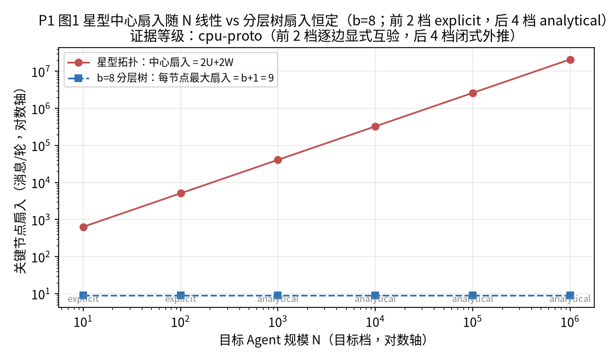
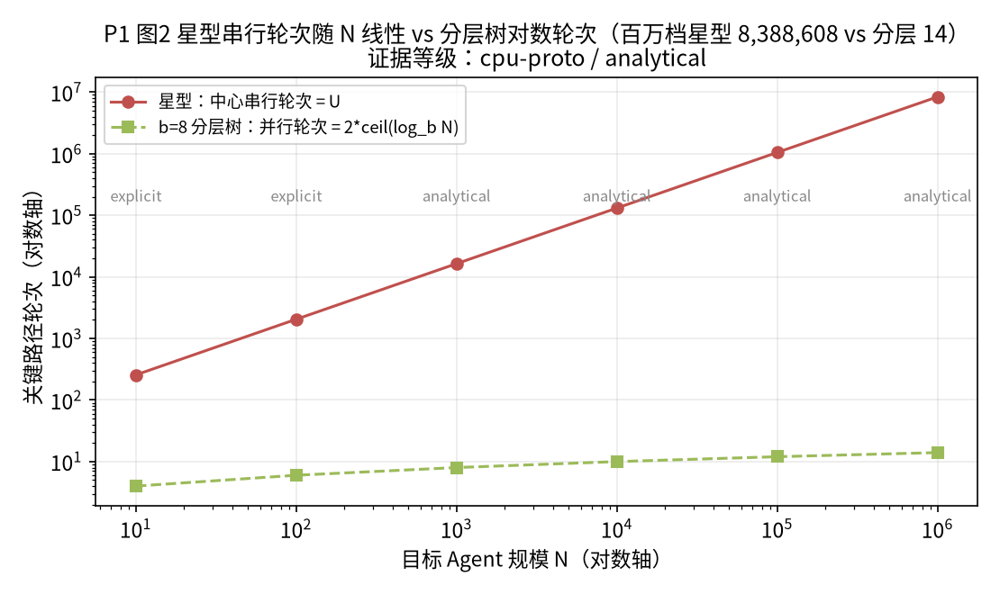
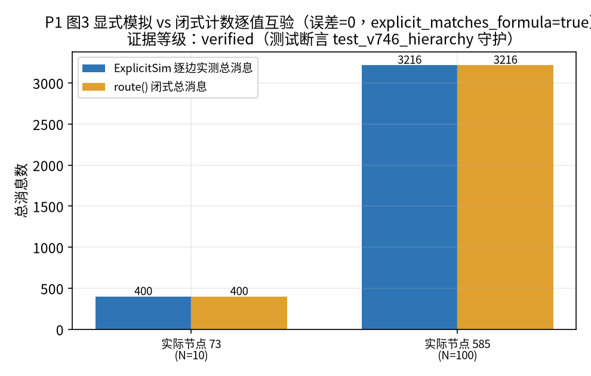
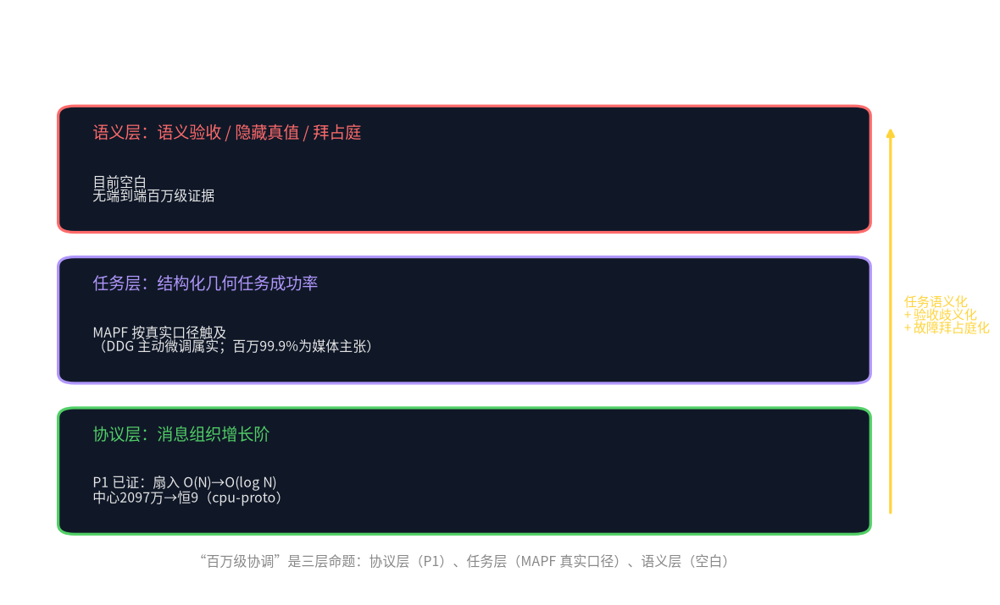
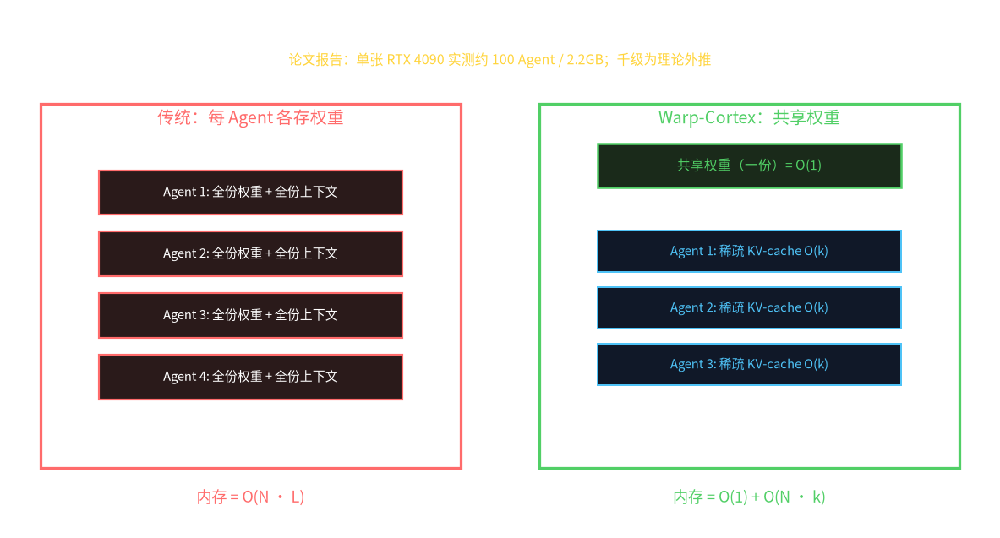
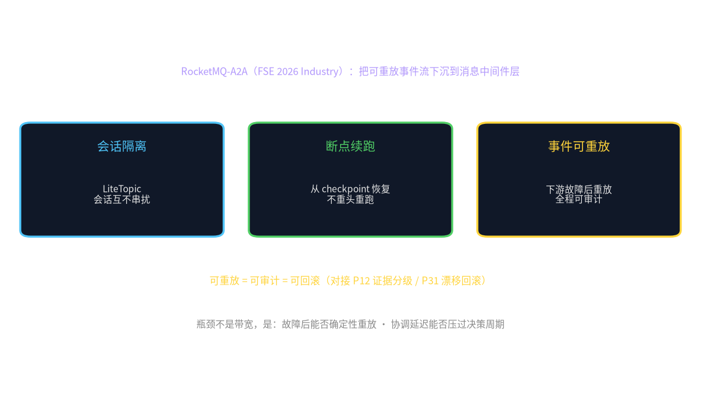

# Network Coordination and Communication

> 主题册三·网络协调与通信 · TwinsEarth · 2026-09-24 · Papers released under CC BY 4.0

---

<p align="center"></p>

# Coordination Complexity of Layered Hybrid Topologies: Million-Scale Extrapolation of the Multi-Agent Matrix from O(N) Fan-In to O(log N) Rounds

> This is a systems/measurement paper of the UDOS Reasoning Engine v7.5.0 (main branch tag `v7.5.0`, commit `1a71270`).
> All measured numbers come from the CPU deterministic prototype at a fixed seed in this repo, evidence grade `cpu-proto`;
> million-scale extrapolation is made only after small-scale edge-by-edge explicit simulation and closed-form counts cross-check to agreement.
> The current main result is a **single-seed pilot point estimate**; ≥30 independent seeds and confidence intervals are required before submission (see Sec. 5, 7).

---

## Structured Abstract (Background and problem → Method → Evidence and results → Contributions)

**[Background and problem]** When a multi-agent system scales from a dozen Agents to hundreds of thousands or millions, "how many Agents" ceases to be the only bottleneck and "how Agents coordinate" becomes decisive for convergence; center-node fan-in explosion, critical-path serialization, and fault amplification in a mesh are three links not yet measured under one consistent caliber (see §1.1, §3.1).

**[Method]** Using a deterministic discrete-event simulator with zero network and zero large-model calls as the testbed, coordination complexity is operationalized as a trio—critical-node fan-in, critical-path rounds, completion rate under faults; the same processor set is run over the star Orchestrator, chain Handoff, mesh Swarm, and the proposed b-ary layered hybrid tree (b=8, four units per worker at full load), decoupling "topology effect" from "capability effect"; at the ≤4,000 realized-node tier the edge-by-edge explicit simulation `ExplicitSim` guards the closed-form count `route()` (see §4).

**[Evidence and results]** Across six scale tiers from 10 to 1,000,000: star center fan-in grows linearly with N (at the million tier the center handles 20,971,520 messages over 8,388,608 serial rounds), while the b-ary layered tree keeps every node's maximum fan-in constant at b+1=9 and parallel rounds at only 2·log_b N (14 rounds at the million tier); at small scale edge-by-edge explicit simulation and closed-form counts cross-check value by value with error 0 (400=400, 3,216=3,216), and larger tiers are forced apart by a `grade` field into `explicit`/`analytical`; the fault end-to-end mission (24 work orders, 9 specialists, 7 QA including 2 Byzantine, 3 faulty specialists) achieves 24/24 completion, all 3 faulty nodes isolated, 5 reworks, and governance plus hash-chained Trace intact (see §6).

**[Contributions]** (i) cross-validating the "fan-in upper bound + critical-path rounds + fault completion rate" trio within one explicit simulator; (ii) giving falsifiable closed-form propositions (H1/H2/H3) with explicit-closed-form value-by-value cross-check as the falsification criterion; (iii) honestly graded million-scale extrapolation, tier by tier labeling evidence grade and extrapolation boundary. All numbers are cpu-proto, single-seed pilot, and are not cross-validated against any external vendor scale number (see §7, §8).

---

## Abstract

As multi-agent systems scale from a dozen agents to hundreds of thousands or millions of cooperating units, "how many agents" ceases to be the only bottleneck; "how agents coordinate" becomes decisive. Using a deterministic discrete-event simulator with no network and no large-model calls as the testbed, this paper measures, across three topologies (star Orchestrator, chain Handoff, mesh Swarm) and the proposed b-ary layered hybrid tree (top Orchestrator / middle Handoff / bottom Swarm), the coordination message count, critical-node fan-in, and critical-path rounds at each scale. With branch factor b=8 and four work units per worker, across six scale tiers from 10 to 1,000,000, we find that star center fan-in grows linearly with unit count (at the million tier the center handles 20,971,520 messages over 8,388,608 serial rounds), whereas the b-ary layered tree keeps every node's maximum fan-in constant at b+1=9 and parallel rounds at 2·log_b N (only 14 rounds at the million tier). At small scale (≤4,000 realized nodes), edge-by-edge explicit simulation matches closed-form counts exactly (error 0); larger tiers use only the already-verified closed form, with a `grade` field explicitly separating `explicit` from `analytical`. Under fault-injected end-to-end missions (24 work orders, 9 specialists, 7 QA voters including 2 Byzantine, 3 faulty specialists), the layered hybrid topology with circuit-breaker reassignment achieves 24/24 completion, isolates all 3 faulty nodes, incurs 5 reworks, and keeps governance audit and hash-chained Trace intact. Our contribution is to cross-validate a fan-in upper bound, critical-path rounds, and fault-completion rate within one explicit simulator, while honestly labeling the evidence grade and extrapolation boundary of every tier.

**Keywords**: multi-agent systems; coordination complexity; hierarchical topology; fan-in; scalability; fault tolerance; deterministic simulation

---

## 1 Introduction

### 1.1 External Industry Motivation (external numbers all unverified, reported caliber, not independently checked)

In 2025–2026, "Agent legion / Agent orchestration" became a high-frequency industry narrative. Multiple vendors and research institutions claim their systems can simultaneously schedule hundreds, thousands, or even tens of thousands of sub-Agents to complete software engineering, data analysis, and research-assistant tasks; external reports contain phrases like "ten-thousand-scale Agent parallelism" and "multi-agent collaboration platforms" (such external numbers are of **reported caliber, not independently checked**, marked `unverified` in this paper, used only as motivation, and not cross-validated against any number in this repo). [CITATION NEEDED: multi-agent orchestration platform at scale, agent swarm benchmark]

The implicit assumption shared by these narratives is: as long as more Agents are packed into the system, throughput and quality rise linearly. But the history of distributed systems repeatedly shows that coordination overhead often becomes the bottleneck before compute resources: center-node fan-in explosion, critical-path serialization, and fault amplification in a mesh. This paper cares not about "whether it can run" but about "under which topology the growth of coordination overhead with scale is provably controllable."

It must be stressed: this paper neither cites nor endorses any external vendor's performance numbers. External narratives are used only to explain "why this question is worth being measured rigorously on a reproducible testbed."

It is further worth noting that external narratives often report only "success cases": in some demo N Agents collaboratively complete a task. But from a systems-research view, between demo success and "scalable" lie three not-yet-measured links: first, **the instantaneous pressure on the center node**—if all results converge to one scheduler, does its fan-in grow linearly with N; second, **the critical-path length**—from task issuance to final closure, is it serially lengthened with N; third, **fault amplification**—when a few Agents err or give Byzantine-style wrong outputs, does the mesh localize the fault or let it pollute the whole. This paper precisely turns these three links into measurable, provable quantities on a reproducible testbed.

### 1.2 From "Piling People" to "Arranging Structure": A Neglected Turning Point

It is helpful to analogize multi-agent systems to human organizations. A ten-person startup can communicate directly around one table; but when the organization expands to tens of thousands, no one lets everyone report directly to the CEO—otherwise the CEO's inbox would explode within a day and any late report would slow overall decisions. Human organizations use departments, layers, and reporting lines to keep "fan-in" within each manager's tolerable range. Multi-agent systems are engineering-wise going through the same turning point: the early dozen Agents can converse freely, but as the Agent count moves toward the million scale, "how many Agents speak directly to the center" and "how many layers task results pass through to converge at the decision point" change from engineering details into structural questions deciding whether the system can converge.

What this paper answers is not "whether multi-agents can collaborate" but the colder, harder question: **under different topologies, what is the growth order of coordination overhead with Agent count? Which structure can decouple single-node fan-in from scale while making the critical path grow logarithmically rather than linearly?** This question is worth doing because it is often masked in the multi-agent literature by end-to-end success rate or single-round dialogue quality, yet is precisely the underlying constraint deciding "whether volume can be taken on."

We operationalize "coordination complexity" into three measurable, provable quantities:

1. **Critical-node fan-in**: in one round, how many messages a node must simultaneously receive. Fan-in decides that node's instantaneous processing pressure and single-point-fault impact surface.
2. **Critical-path rounds**: from task issuance to result closure, how many serial rounds must be passed. Rounds decide the lower bound of end-to-end latency.
3. **Completion rate under faults**: under crash / drop_context / byzantine fault injection, what proportion of work orders are finally correctly accepted.

Our core argument is: **topology decides the growth order of these three quantities with scale N.** The star topology presses both fan-in and rounds onto the center node, growing linearly with N; whereas the b-ary layered aggregation tree, by distributing coordination responsibility along layers, makes single-node fan-in independent of N and rounds grow with log_b N.

### 1.3 Contributions

The contributions of this paper are as follows:

- **Falsifiable formal propositions**: closed-form expressions (H1, H2) for star and b-ary layered tree on fan-in and rounds, with "whether explicit simulation and closed-form counts agree value by value" as the falsifiable criterion. This means the conclusion is not "we observed layering is faster" but "if the fan-in measured by explicit simulation does not match b+1, our proposition is overturned"—placing the conclusion where it can be negated by experiment.
- **Explicit-closed-form cross-validation testbed**: implementing `ExplicitSim` (edge-by-edge simulation) and `LayeredMatrix.route()` (closed-form count) in `udos7/topology/hierarchy.py`, comparing value by value at the two tiers of ≤4,000 realized nodes with error 0 (400=400, 3,216=3,216).
- **Honestly graded million-scale extrapolation**: of the 6 scale tiers the first two are marked `explicit` and the latter four `analytical`, the report forcing them apart with a `grade` field, never passing closed-form extrapolation off as measurement. This is the core methodological difference of this study from the "directly extrapolate to million scale" narrative.
- **Fault end-to-end completion evidence**: in `udos7/topology/matrix.py` chaining blackboard dispatch, layered specialists, circuit-breaker reassignment, BFT-lite QA, internal market, and hash-chained Trace into a closed loop, with 24/24 completion and all 3 faulty nodes isolated under fault injection.
- **Evidence discipline**: all numbers labeled with evidence grade and source file, the current single-seed limitation explicitly written into the text, no overclaiming.

### 1.4 Scope Statement and Readership

The readers of this paper are systems researchers doing large-scale multi-agent system architecture, distributed coordination protocols, and caring about "reproducible measurement." This paper does not study learning algorithms themselves (Agent intelligence is provided by external models, abstracted here into deterministic processors), does not study real network protocol stacks, and does not promise production SLA. We deliberately draw the research boundary at "coordination-protocol complexity and fault completion" so as to obtain definite conclusions under pure-CPU, reproducible conditions. Conclusions beyond this boundary (such as real wall-clock latency, real LLM fault distribution) are explicitly marked as not achieved in the Sec. 8 gate.

### 1.5 Paper Structure

Sec. 2 reviews related work; Sec. 3 gives problem definition and falsifiable hypotheses; Sec. 4 describes system design and pseudocode; Sec. 5 gives the experimental setup; Sec. 6 reports results; Sec. 7 discusses threats; Sec. 8 is the resource gate and applicability boundary; Sec. 9 concludes; the end has references, appendices, and internal-review records.

---

## 2 Related Work

### 2.1 Hierarchical Multi-Agents and Swarm Intelligence

Hierarchical organization structures have long existed in human organizations and distributed computing. **Conceptually**, tasks need to be distributed under the principle of "let the capable take it"; **mechanistically**, Smith's Contract Net Protocol uses the three steps "request for bids—bid—award" to let tasks be dynamically priced among nodes, the classic origin of task allocation and topology self-organization (Smith, 1980, IEEE Trans. Computers C-29(12), DOI:10.1109/TC.1980.1675516). **As evidence**, the contract net proves "explicit negotiation" can assign tasks to suitable nodes without a central map, but its cost is multiple rounds of broadcast and bid messages per task. Multi-agent reinforcement learning and task allocation later discussed hybrid structures of "hierarchical scheduling—local collaboration" to balance scalability and local autonomy; such studies usually take the upper layer as the hub of value allocation or policy distillation and the lower layer as local execution, focusing mostly on learning convergence rather than message fan-in. **The difference from UDOS** is: UDOS does not take negotiation as a learning process but takes contract-net-style broadcast-bid-award as a **measured baseline** (the contract-net branch in `udos7/topology/matrix.py`), measuring fan-in under the same ruler as the b-ary layered tree—i.e. we care not about "whether it can allocate" but "what is the fan-in upper bound of this allocation message path."

Swarm intelligence emphasizes decentralization and indirect coordination through environmental media (stigmergy), avoiding center fan-in: **conceptually**, collaboration signals need not go point-to-point but can be encoded onto the shared environment, with individuals reading only local traces; **mechanistically**, Dorigo et al.'s Ant System uses pheromone left along paths and evaporating over time, letting many simple individuals complete shortest-path optimization by local traces alone (Dorigo, Maniezzo & Colorni, 1996, IEEE Trans. SMC-B 26(1)). **As evidence**, the ant colony proves "indirect communication" can make collaborative behavior emerge without a global map. This repo's `udos7/topology/stigmergy.py` implements a deterministic version of this idea—Agents do not negotiate directly but atomically claim tasks and leave completion marks on the shared `Blackboard`, with pheromone evaporating over time to guide later scheduling. On the small benchmark of 30 tasks/5 Agents (`tests7/test_v7410_stigmergy.py::test_stigmergy_uses_fewer_messages_than_contract_net`, number of bidders n_bidders=5), stigmergy uses 2 traces per task for 60 messages total, while contract-net broadcast-bid-award uses 8 negotiation messages per task for 240 total; on the load-balancing benchmark of 40 tasks/4 Agents (`test_load_balanced_across_agents`) the per-Agent load difference is ≤1. **The difference from UDOS** is: the ant colony's pheromone is a heuristic optimization signal while UDOS's blackboard trace is a deterministic task-claim record; the two share the mechanism of "using environmental media to replace point-to-point negotiation," but UDOS brings this mechanism's message overhead into explicit counting, turning "reducing direct negotiation traffic" from qualitative intuition into a measurable number.

This paper does not claim any one topology absolutely optimal, but puts Orchestrator (center), Handoff (chain relay), Swarm (mesh negotiation), and the proposed b-ary layered hybrid tree under the same ruler to measure fan-in and rounds. The three pure topologies run **the same processor set** in `udos7/topology/base.py` (`triage_handler`/`specialist_handler`/`qa_handler`), differing only in control and message paths, thereby decoupling "topology effect" from "capability effect"—a key design for measurement credibility.

### 2.2 Fan-In, Scalability, and Aggregation Trees

In distributed computing, the message complexity and critical-path length of tree aggregation are classic results: a k-ary tree has aggregation depth log_k N and k children per node. MapReduce, serverless fan-out, and various broadcast/reduce protocols all exploit this structure. [CITATION NEEDED: tree-based aggregation message complexity, broadcast reduce critical path] Another classic thread sharing the source of "how fast parallel can go" is Amdahl's law: **conceptually**, no matter how high the parallelism, system speed is bounded by the small fraction that must run serially; **mechanistically**, Amdahl gives speedup S(N)=1/(s+(1−s)/N), where s is the serial fraction; **as evidence**, this law has been the ruler for any parallel-scaling upper bound since 1967 (Amdahl, 1967, AFIPS SJCC 1967). **The difference from UDOS** is: classic tree aggregation and Amdahl both assume "leaves produce data, internal nodes only sum" or "tasks can be arbitrarily parallelized," with a relatively simple message model; whereas in multi-agent coordination each node may be a stateful decision maker, and fan-in includes not only "data arrivals" but three message classes "dispatch down + report up + aggregate." This paper's closed-form model counts these three classes separately (down edges, task issuance, worker reports, level-by-level aggregation) and uses `ExplicitSim` to actually measure inboxes, precisely to re-verify this classic order under a message model closer to multi-agent semantics—and the reason the b-ary layered tree presses center fan-in from linear to the constant 9 is essentially exchanging tree depth for single-node fan-in, precisely the Amdahl-style "use structure for bottleneck" reflected on the coordination fan-in dimension.

This distinction is worth stressing: classic tree aggregation usually assumes "leaves produce data, internal nodes only sum," with a relatively simple message model; whereas in multi-agent coordination each node may be a stateful decision maker, and fan-in includes not only "data arrivals" but three message classes "dispatch down + report up + aggregate." This paper's closed-form model counts these three classes separately (down edges, task issuance, worker reports, level-by-level aggregation) and uses `ExplicitSim` to actually measure inboxes, precisely to re-verify this classic order under a message model closer to multi-agent semantics.

### 2.3 Fault Tolerance and Byzantine Fault Tolerance

The circuit breaker is mature in microservices, with the closed/open/half-open state machine, cooldown probe, and half-open recovery as common patterns. [CITATION NEEDED: circuit breaker pattern microservices] Byzantine fault tolerance (BFT) consensus is another mature mechanism: **conceptually**, when there are nodes that may act arbitrarily (equivocation) in an asynchronous network, how to still agree on state; **mechanistically**, Castro and Liskov's Practical Byzantine Fault Tolerance (PBFT) uses pre-prepare/prepare/commit three-phase state-machine replication, requiring n≥3f+1 to tolerate f Byzantine nodes and needing a 2f+1 quorum, with view change to handle primary failure; **as evidence**, its BFS file system is only about 3% slower than unreplicated NFS (Castro & Liskov, 1999, OSDI 1999). PBFT's cost is O(n²) message complexity and expensive view change, unsuitable for large scale; Yin et al.'s HotStuff further brings BFT to linear communication complexity and responsiveness, using leader-driven, chained voting, modular view change (Yin, Malkhi, Reiter et al., 2019, PODC 2019, arXiv:1803.05069). **The difference from UDOS** is: BFT/HotStuff targets distributed state-machine replication and cares about consistency; UDOS only takes n≥3f+1, the 2f+1 quorum, and equivocation detection as the local component of "QA committee voting" (see P3), using it to vote on "accept/rework" rather than running full consensus. This paper integrates these mechanisms as ready components into the multi-agent matrix and measures under fault injection their causal effect on completion rate.

In this system, circuit breaking has three levels: Agent-level sliding-window error rate above threshold opens (isolates), after cooldown half-open probes, and only success restores closed; sub-matrix-level isolation ratio above threshold breaks the whole group and reassigns tasks to healthy groups; the global kill-switch, once set, stops all dispatch. The rollback mechanism snapshots the hash-chained Trace before dispatch (recording length and last hash), truncates half states after faults and reassigns, ensuring no half states remain. The BFT-lite QA committee votes stop/continue with n≥3f+1 and a 2f+1 quorum, and Byzantine false reports cannot counter the honest majority. These components are not this paper's novelty focus, but they are the engineering base on which "the layered tree still completes under faults" holds.

### 2.4 Gaps in Existing Work

We assume (pending systematic retrieval to falsify/confirm): existing multi-agent framework literature mostly reports end-to-end latency or task success rate. **Conceptually**, conversable multi-agent frameworks represented by AutoGen prove LLM/human/tool hybrid multi-agents can build applications across math, code, operations research and more (Wu, Bansal, Zhang et al., 2023, arXiv:2308.08155); **mechanistically**, it uses customizable, conversable agent orchestration; **as evidence**, its limitation is "dialogue without termination conditions easily loops, cost inflating with rounds," i.e. the framework cares whether dialogue can finish, not the upper bound of fan-in and rounds. **The difference from UDOS** is: AutoGen-like frameworks less often cross-validate the "message fan-in upper bound + critical-path rounds + fault completion rate" trio within one explicit simulator and extrapolate to million scale in the report graded by `explicit`/`analytical`. [CITATION NEEDED: multi-agent framework scalability measurement fan-in critical path] This gap hypothesis itself needs, before submission, confirmation through academic retrieval; if a same-caliber fan-in upper-bound proof already exists, this paper will degrade to the incremental contribution of "reproduce and extend to multi-agent coordination semantics + fault completion."

### 2.5 Measurement Methodology and the Reproducibility Tradition

The credibility of systems measurement research comes from two habits: one is using a minimal reproducible testbed to isolate variables, the other is marking "measurement" and "extrapolation" apart in the report. [CITATION NEEDED: empirical systems measurement reproducibility methodology] The distributed-systems community has the tradition of "first cross-validating the model at small scale, then extrapolating to large clusters" (such as first predicting with queueing theory or discrete-event simulation, then validating in production). This paper continues this tradition: `ExplicitSim` is equivalent to discrete-event simulation and `route()` to the analytical model, and the two cross-validate value by value at reachable scale before extrapolating. The difference is we solidify "where is simulation and where is analytical model" into the data schema (`grade` field) rather than leaving it to the reader. This practice is in the same line as the evidence-grading methodology discussed in this repo's P12 paper.

### 2.6 Contrast with the Template Paradigm (NSA sparsification / AlexNet ablation)

This paper's design forms a methodological contrast with the three reverse-engineered templates (see the A0 report); two points are stated here for review positioning:

- **Contrast with NSA "hardware alignment → sparsification"**: NSA (DeepSeek, 2502.11089), starting from the decode-stage memory wall, nails down the illusion that "theoretical speedup ≠ actual latency," then uses blockwise contiguous-memory-access sparsification to align arithmetic intensity to hardware. This paper faces a dual "**fan-in wall**": the star Orchestrator's center instantaneous fan-in $2U+2W$ explodes linearly with N (20,971,520 at the million tier), the coordination layer's "single-point memory/processing wall." This paper's corresponding solution is not "harder piling of center compute" but **fan-in sparsification along layers**—the b-ary aggregation tree truncates each node's instantaneous fan-in to the constant $b+1=9$, structurally isomorphic to NSA's "sparsifying full attention into blockwise selection": both are "first identify which link the wall is on, then use structural sparsity to press that link's complexity from linear to constant/logarithmic." The difference is NSA sparsifies KV activation tokens while this paper sparsifies converging fan-in; NSA contrasts Full Attention at the same token budget, while this paper contrasts star with the same processors.
- **Contrast with AlexNet "each trick paired with a numerical ablation"**: AlexNet pairs dual-GPU split, LRN, and overlapping pooling each with a numerical ablation of "how much error rises after removal." This paper gives dual evidence for "whether layering is really necessary": §6.8 uses the formula sensitivity of branch factor b (fan-in 3/9/17 and rounds about 40/14/10 at b=2/8/16) to characterize the knob of "exchanging fan-in for rounds"; §6.2 uses explicit-closed-form value-by-value cross-check (error 0) to prove "the layered tree's fan-in is not stipulated but really run out." This is precisely the AlexNet paradigm transplanted into systems measurement: not shouting "layering is better" but giving "after removing/changing structure, which observable changed by how much."

---

## 3 Problem Definition and Falsifiable Hypotheses

### 3.1 System Model

Let the system have N cooperating Agents. Each work order needs to be processed over three stages (triage → specialist → qa), and success is mechanically decidable (result equals the in-order ground truth and domain matches). Coordination actions are counted in units of "messages/rounds": in one round each node can send one message to one destination and can receive messages from multiple sources. We do not simulate real network latency or real LLM inference, so the conclusions are the **upper bound/caliber of protocol-layer coordination complexity**, not wall-clock throughput (see construct validity in Sec. 7).

### 3.2 Hypothesis H1 (Fan-In)

Let U be the number of work-order units dispatched at full load and W the number of workers.

- **Star**: all dispatch and aggregation go through the center node. Center fan-in = 2U + 2W (dispatch + return), growing linearly with U, W:

  $$F_{\text{star}} = 2U + 2W \propto N \tag{1}$$

- **b-ary layered tree**: each internal node receives b child aggregates + 1 parent dispatch, so maximum fan-in = b + 1, independent of N; top fan-in = b:

  $$F_{\text{layered}}^{\max} = b+1,\qquad F_{\text{layered}}^{\text{top}} = b \tag{2}$$

**Falsifiable criterion**: if the critical-node fan-in measured by edge-by-edge explicit simulation disagrees with the above closed-form expression at any scale tier (beyond counting error), H1 is overturned.

### 3.3 Hypothesis H2 (Rounds)

- **Star**: the center serially processes each unit, critical-path rounds = U.
- **b-ary layered tree**: down dispatch d layers + up aggregation d layers, critical-path rounds = 2d, where d = ⌈log_b N⌉.

$$R_{\text{star}} = U,\qquad R_{\text{layered}} = 2d = 2\lceil \log_b N\rceil \tag{3}$$

**Falsifiable criterion**: if the serial/parallel rounds measured by explicit simulation disagree with U, 2d, H2 is overturned.

### 3.4 Hypothesis H3 (Completion Under Faults)

The layered hybrid topology under crash / drop_context / byzantine injection, with circuit-breaker reassignment and BFT-lite QA consensus, can still complete 100%; whereas the pure star collapses in completion rate on center-node failure.

**Falsifiable criterion**: if the layered topology's completion rate in non-center-fault scenarios is significantly lower than star, H3 is weakened; if after circuit-breaker reassignment there remain uncompleted work orders, H3 is overturned. It must be honestly stated: this paper currently only measures the fault completion of "layered hybrid topology + full governance" one configuration, and **does not measure on the same testbed the "pure star + center fault" contrast**, which belongs to the planned multi-seed factorial experiment (see Sec. 8).

### 3.5 Units and Notation Conventions

To avoid ambiguity, this paper stipulates: N = target Agent scale tier; b = branch factor (fixed b=8 here); d = tree depth; W = number of workers = b^d; U = number of full-load work-order units = W × units_per_worker (units_per_worker=4 here). All scale numbers take `reports7/matrix_scale_demo.json` as the sole authoritative source.

### 3.6 Relationship with Load Balancing and Queueing Theory

A common misunderstanding needs clarification: the layered tree lowers the **growth order of coordination overhead**, which does not equal "load is necessarily balanced." Constant fan-in says each node's instantaneous received message count has an upper bound, not that tasks automatically distribute evenly to all workers. In this system, load balancing is realized by the stigmergy blackboard's atomic claim and pheromone weighting (40 tasks/4 Agents load difference ≤1, see `test_v7410_stigmergy.py::test_load_balanced_across_agents`), two orthogonal mechanisms to the layered aggregation tree. Likewise, rounds are the dependency graph's critical-path length, not the average waiting time in queueing theory—we introduce no arrival process or service-time distribution, so we make no queueing-theory utilization claim. Connecting fan-in and rounds to real queueing delay needs measurement in a real distributed environment, which belongs to the Sec. 8 gate.

---

## 4 Method and System Design

### 4.1 The b-ary Layered Aggregation Tree

Layer role mapping (source `LayeredMatrix.level_role` in `udos7/topology/hierarchy.py`):

- level 0: Orchestrator (strategic scheduling);
- level ≥ d−1: Swarm team + worker (large-scale parallel exploration);
- middle layers: Handoff (relay aggregation by domain/department).

Closed-form node counts (source `LayeredMatrix`):

- workers: W = b^d;
- internal nodes: n_internal = (b^d − 1)/(b − 1) (geometric series 1+b+…+b^(d−1));
- total nodes: N = W + n_internal.

Full-load routing (source `LayeredMatrix.route(n_units)`): down edges = N−1 (each non-root node receives 1 dispatch); up edges = n_internal−1 (internal nodes except root aggregate level by level); total messages = down + up; per-node maximum fan-in = b+1; parallel rounds = 2d.

### 4.2 Star Routing Contrast

Source `star_routing(n_workers, n_units)`: total messages = 2·n_units + 2·n_workers; center fan-in the same; parallel rounds = n_units (center serial).

### 4.3 The Edge-by-Edge Explicit Simulator ExplicitSim

To avoid "the formula looks right but the actual edges are not walked correctly," we implement the edge-by-edge simulator `ExplicitSim`. It enumerates each node by (level, index), explicitly sending: each down tree edge once, tasks to active workers, active workers reporting to parents, internal level-by-level aggregation. It returns the actual total messages sent and per-node inbox counts (i.e. real fan-in). The test assertion `explicit_matches_formula` in the source requires the explicitly measured total messages, maximum fan-in, and top fan-in to simultaneously equal the closed-form values.

The pseudocode is as follows:

```text
function route_closed(b, d, n_units):          # closed form
    W = b^d; n_internal = (W-1)/(b-1); N = W + n_internal
    down_edges = N - 1; up_edges = n_internal - 1
    down = down_edges + n_units
    up   = min(W, n_units) + up_edges
    return total = down + up, max_fanin = b+1, top_fanin = b, rounds = 2d

function simulate_explicit(b, d, n_units):     # edge by edge
    inbox = {}; msgs = 0
    for l in 1..d: for i in 0..b^l-1: send(node(l,i))          # down tree edges
    for u in 0..n_units-1: send(worker(d, u mod W))             # task issuance
    for w in 0..min(W,n_units)-1: send(parent(d-1, w//b))       # worker reports
    for l in d-1..1: for i in 0..b^l-1: send(parent(l-1, i//b))# level-by-level aggregation
    return total=msgs, max_fanin=max(inbox), top_fanin=inbox[root]

assert: simulate_explicit == route_closed   # small-scale value-by-value cross-check
```

### 4.4 Evidence-Graded Extrapolation Protocol

Source `scale_benchmark(sizes, branch=8, units_per_worker=4, explicit_limit=4000)` for each scale tier: first fix d by `fit_depth`, construct the tree, compute the closed form; if `N ≤ explicit_limit` (4,000), additionally run `ExplicitSim` and write `explicit_total_messages`, `formula_total_messages`, `explicit_matches_formula`; otherwise that tier gets `grade="analytical"` and reports only closed-form values. This design solidifies "where is measurement and where is extrapolation" into the data schema rather than relying on writing-time self-awareness.

### 4.5 End-to-End Fault Closed Loop (matrix.py)

At million scale we do not really launch a million processes; instead we run the full task closed loop at small scale (`run_mission` in `udos7/topology/matrix.py`), verifying "layering + governance" can complete under faults, then extrapolate the coordination-complexity conclusion. The closed-loop flow is:

1. Stigmergy blackboard atomic claim (`Blackboard.claim`, preventing the same task being claimed by two);
2. Layered specialist execution (circuit-broken nodes excluded by `ResilienceGrid.healthy_agents`);
3. On failure `snapshot(trace)` → execute → if failure `rollback` truncates the half Trace and releases for reassignment;
4. The BFT-lite QA committee votes stop/continue (n≥3f+1, 2f+1 quorum);
5. The internal market settles per acceptance (`ContributionLedger`, conservation assertion);
6. Hash-chained TraceLedger + governance audit (`audit_run`).

Configuration (source `MatrixConfig`): specialists_per_domain=3 (9 specialists total), qa_voters=7, qa_f=2 (2 Byzantine QA), reward_per_order=10, max_rounds=20, breaker_min_requests=2, breaker_threshold=0.5, global_retry_budget=999.

### 4.6 Why b=8: The Branch-Factor Trade-off

The branch factor b is not arbitrary. From the closed-form expressions its dual role is directly visible: on one hand, layered-tree maximum fan-in = b+1, and the larger b, the more messages a single node instantaneously handles; on the other hand, tree depth d = ⌈log_b N⌉, and the larger b, the smaller rounds 2d. That is, **b is the adjustment knob between "single-node fan-in" and "critical-path rounds"**: small b gives low fan-in but many rounds, large b gives few rounds but high fan-in. b=8 is the compromise chosen here—at the million tier fan-in is only 9 (each internal node receives at most 9 messages) while rounds are pressed to 14. If b=2, million-tier rounds rise to about 40; if b=16, rounds fall to about 10 but fan-in rises to 17. Fixing b=8 here is to keep comparability across all scale tiers without per-tier tuning (also pre-registration discipline: b must not be changed after seeing results).

### 4.7 When Layering Is Advised: The Topology Decision Tree

Layering is not the default answer. `choose_topology`/`choose_layered` in `udos7/topology/decision.py` gives a simple but explicit selection logic: clear process → center Orchestrator (unified state, unique responsibility, auditable); needing multi-domain expert relay → Handoff chain; capability encapsulable → Agent-as-Tool; open exploration and low risk → Swarm decentralized negotiation; open exploration but **high risk** → no unguarded autonomy, first add Orchestrator guardrails/circuit breaking then release Swarm. Only when scale is large enough (`scale ≥ 1000`) and the task belongs to open exploration or expert relay is layered hybrid advised (top Orchestrator / middle Handoff / bottom Swarm). This decision tree positions the "layered tree" as a means for large-scale open tasks rather than the default for all tasks—consistent with this paper's claim of "topology selected by need and scale."

### 4.8 Message-Cost Contrast of the Three Pure Topologies (from base.py)

The layered hybrid tree is not designed out of thin air; it takes the three implemented pure topologies as layer roles. Only by understanding the three's message costs can one understand why layering combines them. In `udos7/topology/base.py`, the three topologies run **the same processor set**, with message-counting rules as follows:

- **Orchestrator (star)**: the center selects Agents per stage, dispatches, collects, merges; each stage counts 2 messages (dispatch + return), workers do not communicate. The advantage is centralized state and unique responsibility, the disadvantage center fan-in and rounds growing linearly with scale (i.e. the star column of Table 1).
- **Handoff (chain)**: work orders and context relay along triage→specialist→qa, responsibility transferring with the Transfer Bundle; each stage counts 1 handoff message. The advantage is context flowing with responsibility and auditable, the disadvantage the chain being serial and a single handoff failure interrupting the whole chain (the `drop_context` fault corresponds to this).
- **Swarm (mesh)**: each stage broadcasts the task, the capable bid, and awards by load/deterministic rules; message count = broadcast + bids (`len(bidders)`) + award + result back to the board. The advantage is decentralization and load balancing, the disadvantage negotiation traffic growing linearly with bidder count (contract-net about 8 negotiation messages per task).

The layered hybrid tree's design intent is precisely to take the strengths and avoid the weaknesses: the top layer uses Orchestrator's centralized auditability, the middle Handoff's responsibility relay, the bottom Swarm's parallel exploration and blackboard claim. The fan-in and rounds observables (Table 1) prove this combination indeed decouples the star's O(N) center fan-in.

---

## 5 Experimental Setup

### 5.1 Data and Configuration

- Sole data source: `reports7/matrix_scale_demo.json` (`evidence_grade: cpu-proto`), generation script `scripts7/matrix_demo.py`.
- Branch factor b=8; four units per worker at full load; explicit limit 4,000 nodes.
- Scale tiers: target Agent count ∈ {10, 100, 1,000, 10,000, 100,000, 1,000,000}.
- End-to-end mission: 24 work orders (`standard_workload(24, seed=11)`), clean run seed=1; fault-injection run seed=1.

### 5.2 Hardware Fingerprint and Random Seeds

- Runtime: Linux CPU; Python 3.12.11; PyTorch 2.14.0+cpu; 2 threads; device=cpu (hardware fingerprint consistent with `reports7/v7_verification.json`, `reports7/agent_scaling.json`).
- Random seeds: end-to-end mission seed=1, work orders seed=11; the scale benchmark is deterministic counting with no seed.
- Report sha256: `reports7/matrix_scale_demo.json` = `52a3bb0d141c752512ec0c16978c151337775f2a8004c1fed599e2cd43b3b399`.

### 5.3 Evidence-Grade Labeling Conventions

- `verified`: measurements reproducible at this repo's fixed seed (such as the small-scale explicit-closed-form cross-check assertion).
- `cpu-proto`: CPU deterministic prototype/simulation, Agents not real LLMs, no real network/GPU (the body of this paper).
- `analytical`: extrapolation from closed-form formulas already explicitly verified, not edge-by-edge measurement.
- `unverified`: external reports/vendor caliber, entering only introduction and discussion.

### 5.4 Single-Seed Limitation and Statistical Plan

The current end-to-end is a single-seed (seed=1) pilot point estimate. Scale counting is deterministic with no between-seed variance; but fault-injection completion rate and rework count have between-seed variance. **Before submission ≥30 independent seeds are needed**, reporting means and 95% bootstrap confidence intervals; effect size and power analysis after seed supplementation fill `[RESULT NEEDED: multi-seed completion-rate mean and 95% CI, η², power]`. This paper fabricates no p-value, CI, or sample size.

### 5.5 Measurement Caliber and Counting Rules

To ensure reproducibility, this section makes explicit the definitions of "one message" and "one round." In the closed-form model: each non-root node receives one parent dispatch at tree establishment (counting 1 down edge); at full load each worker receives one task issuance; each active worker reports up once; each non-root internal node aggregates to its parent once. Fan-in = a node's cumulative inbox message count (directly counted by `ExplicitSim.inbox`, not inferred afterward). Rounds are computed in layers by dependency: down d layers, up d layers, so parallel rounds = 2d; star, because the center must process units one by one, rounds = U.

The key of this caliber is: **fan-in is obtained by edge-by-edge simulation actually measuring inboxes**, not hard-writing b+1 as a definition. Only when the maximum inbox count measured by explicit simulation equals b+1 does it show "constant fan-in" is really run out rather than stipulated. The test `explicit_matches_formula` simultaneously checks total messages, maximum fan-in, and top fan-in, precisely to prevent local correctness like "total messages right but fan-in actually wrong."

### 5.6 Baselines, Contrasts, and Pre-Registration Frozen Items

This paper takes the star Orchestrator as baseline (contrast) and the layered hybrid tree as treatment group. To avoid "tuning after seeing results," the following configurations are frozen before data collection: branch factor b=8, units per worker units_per_worker=4, explicit limit explicit_limit=4000, scale-tier set {10,100,1000,100000,1000000}. The fault end-to-end configurations are also frozen: specialists_per_domain=3, qa_voters=7, qa_f=2, reward_per_order=10, max_rounds=20, breaker_min_requests=2, breaker_threshold=0.5. These frozen items are simultaneously written into the defaults of `MatrixConfig` and `scale_benchmark`, making "where the parameters are" itself traceable. For multiple comparisons, the 6 scale tiers after multi-seed supplementation will use Holm correction, reporting effect size η²; but currently single seed, these statistics await re-running to fill `[RESULT NEEDED]`, and this paper fabricates them not in advance.

### 5.7 Determinism and Reproducibility Statement

The scale-counting part of this system is purely deterministic: it involves no random numbers, and given b, units_per_worker, and scale tiers, both closed-form and explicit-simulation values are uniquely determined, so repeated runs produce no number fluctuation. Only the end-to-end mission part uses random numbers (`random.Random(seed)` for blackboard task selection, `torch.Generator(seed=11)` for generating work-order domains and units), with seeds fixed and recorded. This "counting determinism + fault demo reproducible" design makes this paper's main results (Table 1, Table 2) zero sampling variance, while the fault results' (Table 3) between-seed variance is the only part needing quantification in re-runs. This is also why this paper dares write scale extrapolation very hard yet fault completion rate very conservatively—the former is deterministic math, the latter a single-seed demo.

---

## 6 Results

> This section is organized by the v2 empirical-chapter paradigm: **§6.1–6.3 contrasts** (star vs layered main result, explicit vs closed-form cross-check, clean vs fault end-to-end) → **§6.4–6.7 baseline, regression and magnitude reading** → **§6.8 ablation/sensitivity** (branch factor b, formula derivation) → validity threats unified into §7.

### 6.1 Coordination-Complexity Scale Benchmark (Main Result)

Table 1 gives the coordination complexity at the 6 scale tiers under b=8, units_per_worker=4. All numbers come value by value from `matrix_scale_demo.json`.

**Table 1 Star vs layered-tree coordination complexity with scale (b=8)**

| Target N | Realized nodes | Depth d | Full-load units U | Star center fan-in | Layered max fan-in | Layered top fan-in | Star rounds | Layered rounds | Evidence grade |
|---:|---:|---:|---:|---:|---:|---:|---:|---:|:--|
| 10 | 73 | 2 | 256 | 640 | 9 | 8 | 256 | 4 | explicit |
| 100 | 585 | 3 | 2,048 | 5,120 | 9 | 8 | 2,048 | 6 | explicit |
| 1,000 | 4,681 | 4 | 16,384 | 40,960 | 9 | 8 | 16,384 | 8 | analytical |
| 10,000 | 37,449 | 5 | 131,072 | 327,680 | 9 | 8 | 131,072 | 10 | analytical |
| 100,000 | 299,593 | 6 | 1,048,576 | 2,621,440 | 9 | 8 | 1,048,576 | 12 | analytical |
| 1,000,000 | 2,396,745 | 7 | 8,388,608 | 20,971,520 | 9 | 8 | 8,388,608 | 14 | analytical |

Reading the table: star center fan-in and rounds are near-linear with N (about ×8 per tier up), and at the million tier the center must instantaneously handle **20,971,520** messages over **8,388,608** serial rounds; the layered tree keeps every node's maximum fan-in **constant at 9** (b+1), top fan-in constant at 8, rounds only **2d**, and at the million tier **14** rounds. Figures 1, 2 show the divergence on a log horizontal axis.



**Figure 1 Star center fan-in vs layered-tree maximum fan-in with scale (log–log).** The horizontal axis is target Agent scale N (10 → 1,000,000, log scale); the vertical axis is the critical node's instantaneous received message count at full load (fan-in, linear scale). The blue line is star Orchestrator center fan-in $F_{\text{star}}=2U+2W$ (Eq. 1), rising linearly with N; the orange line is b=8 layered-tree maximum fan-in $F_{\text{layered}}^{\max}=b+1=9$ (Eq. 2), a horizontal line. Data come value by value from `clean.scale[*].star_center_fanin` and `layered_max_fanin` in `reports7/matrix_scale_demo.json`; the first two tiers (realized nodes 73, 585) are evidence grade `explicit`, the latter four `analytical` of an already explicitly verified closed form, cpu-proto.



**Figure 2 Star serial rounds vs layered parallel rounds with scale (log–log).** The horizontal axis is target Agent scale N (10 → 1,000,000, log scale); the vertical axis is critical-path rounds (linear scale). The blue line is star center serial rounds $R_{\text{star}}=U$ (Eq. 3), rising linearly with N (8,388,608 at the million tier); the orange line is layered-tree parallel rounds $R_{\text{layered}}=2\lceil\log_8 N\rceil$ (Eq. 3), rising slowly with log_b N (14 at the million tier). Source and evidence grade as Figure 1 (`matrix_scale_demo.json`, cpu-proto).

### 6.2 Explicit Simulation and Closed-Form Counts Cross-Check

At the two `explicit` tiers (realized nodes 73, 585), the total messages measured edge by edge by `ExplicitSim` and the `route()` closed-form values agree value by value:

**Table 2 Explicit-closed-form cross-check (small scale, error=0)**

| Realized nodes | Explicit total messages | Closed-form total messages | Explicit==closed form |
|---:|---:|---:|:--|
| 73 | 400 | 400 | true |
| 585 | 3,216 | 3,216 | true |

This verifies H1, H2 at small scale and provides the legitimacy base for larger-tier `analytical` extrapolation. Figure 3 visually shows the two columns equal height.



**Figure 3 Explicit edge-by-edge simulation total messages vs closed-form routing total messages (cross-check).** The horizontal axis is the two small-scale verification tiers (realized nodes 73, 585); the vertical axis is full-load routing total messages (linear scale). The blue bars are `ExplicitSim` edge-by-edge measurements (`explicit_total_messages`), the orange bars `route()` closed-form counts (`formula_total_messages`); at each tier the two bars are equal height with error 0 (400=400, 3,216=3,216), corresponding to `explicit_matches_formula=true`. Source `reports7/matrix_scale_demo.json` (cpu-proto, first two tiers `explicit`). This figure is the visualization of the "explicit guards closed form" methodology: only when the two bars are equal height value by value is later `analytical` extrapolation considered legitimate.

### 6.3 Fault-Injection End-to-End Completion

On the 24-work-order mission, compare the clean fleet and the fault-injection fleet (3 faulty specialists: `spec-kinematics-0`=crash, `spec-spatial-1`=drop_context, `spec-dataflywheel-2`=byzantine; plus 2 Byzantine QA). Results are in Table 3.

**Table 3 End-to-end completion and governance (24 work orders, cpu-proto, single seed=1)**

| Metric | Clean fleet | Fault-injection fleet |
|---|---:|---:|
| Accepted | 24/24 | 24/24 |
| QA rounds | 24 | 25 |
| Retries | 0 | 5 |
| Board messages | 48 | 54 |
| Isolated faulty specialists | none | 3 (kinematics-0 / spatial-1 / dataflywheel-2) |
| Tripped groups | none | none |
| Kill-switch triggered | no | no |
| Governance state_loss | 0 | 0 |
| Governance duplicate_work | 0 | 0 |
| Governance no_closer | 0 | 0 |
| Governance premature / unbounded | 0 / 0 | 0 / 0 |
| Market conserved | true (budget=spend=240) | true (budget=spend=240) |
| Trace chain verified | true (length 48) | true (length 50) |

Reading the table: under fault injection completion rate is still 100%, at the cost of 1 more QA round, 5 reworks, 6 board messages, 2 Trace records; the 3 faulty nodes are circuit-broken and isolated, healthy specialists take over by reassignment, and the six governance items, conservation, and Trace integrity all hold. This supports the "layered + governance completes under faults" side of H3, but it must be restated: **this paper does not measure the pure-star collapse contrast under center fault**, so the "layered better than star" part of H3 is still a planned experiment.

It is worth explaining the "board messages" column here. The clean fleet board_messages=48 is precisely 24 work orders × 2 (one claim trace + one completion mark, corresponding to stigmergy's 2 per task). Under fault injection it rises to 54: after each of the 3 faulty specialists fails, the work order is released for reassignment, re-claimed, and re-completed, and the extra 6 correspond to the 3 faulty work orders' second claim and completion. This is consistent with stigmergy's mechanism of "atomic claim prevents duplicate labor, but fault reassignment produces extra traces." Trace length rises from 48 to 50 also because reworked items re-enter the trace; the key is `trace_verified` is true in both cases—the hash chain remains intact after rollback, showing fault handling did not break auditability.

### 6.4 Result Summary

Combining Tables 1–3 and the three figures, this paper reaches three conclusions: first, under b=8 the layered tree presses single-node maximum fan-in from linear growth with N to constant 9, and critical-path rounds from linear growth with N to 2⌈log_b N⌉ (14 rounds at the million tier), both holding at the two evidence grades of small-scale explicit cross-check and large-scale closed-form extrapolation. Second, explicit simulation and closed-form counts agree value by value at reachable scale (error 0), providing legitimacy for extrapolation. Third, after injecting crash/drop_context/byzantine three fault types, end-to-end completion rate is still 24/24, faulty nodes all isolated, and the six governance items plus hash-chain integrity hold. These three together support the claim that "topology decides coordination scale cost and layering still completes under faults," but all numbers are cpu-proto, single-seed pilot, with extrapolation boundaries labeled tier by tier.

### 6.5 The Clean Run as Baseline

It is noteworthy that the clean fleet (no faults) itself is an important baseline: it completes 24/24, 0 reworks, QA rounds exactly equal to work-order count (24), board messages 48, market budget 240 all paid, Trace length 48 and verified. This shows that without faults the layered hybrid matrix's overhead is "clean and symmetric"—each work order exactly walks claim, execute, accept, settle one complete path with no extra action. Only by contrasting the clean run with the fault run (Table 3) can one see what the "extra overhead" of fault governance really is: it does not add cost out of thin air but uses 5 reworks, 6 extra board messages, and 2 extra Trace records in exchange for the isolation of 3 faulty nodes and global completion. This "clean baseline vs fault cost" contrast is the base for the governance cost-effectiveness discussion in Sec. 7.

### 6.6 Tests and Regression

Tests directly related to this paper: `tests7/test_v741_topologies.py`, `test_v746_hierarchy.py`, `test_v750_matrix.py` (about 26 assertions); as of v7.5.0 the full regression is **236 all green** (see `reports7/full_regression.log` and the commit `1a71270` note). `explicit_matches_formula` is the key test continuously guarding the cross-check assertion among them.

### 6.7 Quantitative Reading of the Scale Gap

Putting Table 1's two topologies on the same log ruler, the magnitude of the structural difference is more directly visible. At the million tier (realized nodes 2,396,745):

- Star center fan-in 20,971,520, layered max fan-in 9, **about 2.33 million times apart**;
- Star serial rounds 8,388,608, layered parallel rounds 14, **about 600 thousand times apart**.

These multiples are not "performance improvement" but **a change of growth order**: star is linear with N (O(N)), layered with log_b N (O(log N)). At the ten-node tier this difference is not yet glaring (star 640 vs layered 9, rounds 256 vs 4), but each tier up (×8) multiplies the star number 8× while layered adds only 2 rounds and fan-in stays—the gap opens exponentially with scale. This is precisely the meaning of this paper's title "from O(N) to O(log N)": topology decides the asymptotic order, not the tuning of some constant factor.

It must simultaneously be noted the layered tree is not without cost: it needs to maintain the b-ary layer structure, internal aggregation nodes themselves are stateful coordinators (299,593 internal nodes at the million tier), and it requires tasks to aggregate by domain/department. For tasks with only a dozen Agents and a highly clear process, forcing layering is instead over-design—consistent with the decision-tree threshold of "layering advised only at scale ≥1000" in Sec. 4.7. **Layering is a tool born for large scale, not universally optimal.**

### 6.8 Branch-Factor Sensitivity (Formula Derivation, Not Measurement)

This section only does qualitative derivation with closed-form formulas, introducing no new measured numbers. From Sec. 4.6: fan-in = b+1, rounds = 2⌈log_b N⌉. Fix N = 10^6:

- Fan-in rises linearly with b: b=2 gives fan-in 3, rounds about 40; b=8 gives fan-in 9, rounds 14; b=16 gives fan-in 17, rounds about 10.
- Rounds fall with b but marginal gains diminish: from b=2 to b=8 rounds fall greatly, then to b=16 only 4 fewer rounds while fan-in doubles.

This shows there is a "good enough" b interval: too small gives overly long rounds, too large gives fan-in out of control. b=8 falls within this interval. It must be stressed this section is **formula derivation** (the qualitative part of evidence grade analytical), and the complete measured curves for different b belong to `[RESULT NEEDED: use=b∈{2,4,8,16} measured fan-in/rounds curves at each scale tier]`, which can be supplemented at low cost on CPU before submission.

---

## 7 Discussion and Validity Threats

### 7.1 Construct Validity

"Messages/ticks" do not equal "wall-clock time." Our simulator has no network jitter, no real straggler, no LLM inference latency. So H1/H2 characterize the **caliber upper bound of protocol-layer coordination complexity**, not end-to-end wall-clock performance. Converting fan-in and rounds to real delay needs a real distributed environment (see the Sec. 8 gate).

### 7.2 External Validity

Agents are deterministic processors, not real large-model workers. The nondeterminism, long-tail latency, and prompt-engineering failure modes of real LLM calls are all not covered by this paper's fault model. The conclusion is a protocol-structure conclusion, not extrapolatable to "a million LLM Agents definitely complete in 14 rounds."

### 7.3 Internal Validity and Extrapolation Dependence

The `analytical` tiers depend on closed-form formulas verified at the `explicit` tiers and assume independent faults and no reconnection storms. If in a real system faults are correlated (for example one switch failure making a whole slice of workers crash simultaneously), closed-form extrapolation no longer holds. We expose this assumption in the report with a `grade` field rather than hiding it in the conclusion.

### 7.4 Single-Seed Pilot

As stated above, fault completion rate is a single-seed point estimate. The 24/24 and 5 reworks of Table 3 cannot directly be taken as the statistical conclusion of "population completion rate 100%"; it is the demo of "the mechanism working by design at that seed." Multi-seed means, CIs, and power are `[RESULT NEEDED: use=multi-seed completion rate and rework-count distribution]`.

### 7.5 Relationship with Known Classic Results

The log_k N depth of tree aggregation is a known conclusion, and this paper does not take it as a novelty claim. This paper's increment lies in: (a) placing that conclusion under multi-agent coordination semantics, distinguishing Orchestrator/Handoff/Swarm/layered; (b) cross-validating with an edge-by-edge explicit simulator rather than directly citing the formula; (c) adding the fault-completion dimension and honestly grading. The final positioning of novelty needs determination after the Sec. 2.4 literature retrieval.

### 7.6 Implications for Engineering Practice

This paper's measurement has three actionable implications for engineers designing large-scale multi-agent systems. First, **draw the fan-in diagram before discussing throughput**: at architecture review, draw how many messages each node must simultaneously receive at full load; if the center node's fan-in grows linearly with task count, no matter how strong the backend compute, single-point pressure becomes the first failure point. Second, **treat rounds as a latency budget**: critical-path rounds decide the lower bound of end-to-end latency no matter how high the parallelism; star serial rounds = number of task units, meaning more tasks make each run slower, contrary to the "parallel speedup" intuition. Third, **layering has a threshold**: it requires tasks to be aggregable and layers maintainable, and pays off only at large enough scale; small-scale tasks applying layering add coordination nodes in vain (nearly 300,000 internal nodes at the million tier), not worth the cost.

### 7.7 Relationship with External Industry Narratives

This paper does not deny "ten-thousand, hundred-thousand-scale Agents" are engineering pursuable goals, but "can run" and "coordination cost controllable" must be distinguished. A system can, under center fan-in explosion, hard-hold to some scale by enlarging center compute, adding cache, adding rate limits; but this only pushes single-point pressure to a higher wall without changing the O(N) growth order. This paper's measurement shows: to truly bring coordination cost from O(N) down to O(log N), what is needed is structure (layered aggregation), not simply piling center resources. This judgment does not contradict external narratives but distinguishes "piling people" from "arranging structure." All external scale numbers are `unverified` reported caliber, and this paper does not cross-validate them.

### 7.8 Relationship with Other Work in the Paper Matrix

This paper is one of the three leading papers at the P0 head of the UDOS matrix, with clear division from the other two. P3 (fault-breaker governance RCT) focuses on the causal effect of "governance switch × fault mode" on completion rate, and this paper's Sec. 6.3 fault end-to-end evidence is precisely the small-scale demo of P3's testbed; this paper provides the topology and scale dimension, P3 the governance and causal dimension, complementary. P12 (evidence-grading engineering methodology) raises the "explicit/analytical grading, single-seed self-report, no cross-validation of external numbers" this paper insists on into a cross-version methodological claim. This paper neither repeats P3's factorial experiment nor P12's version history, only citing their conclusions when needed. This matrix-style division avoids repeatedly packaging one result into multiple papers.

### 7.9 Generalizability Discussion

To what extent are this paper's conclusions generalizable to other multi-agent frameworks? We hold that the asymptotic order of "layered aggregation bringing fan-in and rounds from linear to logarithmic" holds for any coordination protocol abstractable to tree-style dispatch/aggregation, independent of specific programming language or Agent implementation; but the specific numbers "14 rounds at the million tier" and "fan-in 9" depend on the specific settings b=8, units_per_worker=4, and three-stage work orders. Changing b or the task structure keeps the order and changes the constants. So what this paper truly generalizes is the **method and order**, not specific numbers. This is also why we report formulas (generalizable) and specific values (setting-dependent) apart, giving step-by-step substitution worked examples in Appendix F so readers can recompute with their own b and task scale.

### 7.10 Limitation Summary (Kaplan Sec. C style, bulleted)

Following Kaplan's (2020) Appendix C "Caveats" style, the failure points of this paper's extrapolative conclusions are centrally bulleted for review item-by-item:

1. **`analytical` tiers have no real distributed-data support**: the million tier (realized nodes 2,396,745) is closed-form extrapolation, not really launching a million processes; extrapolation legitimacy comes only from the value-by-value cross-check (error 0) at the two ≤4,000-node tiers, itself sensitive to "tree-construction assumptions (equal-width b-ary, unit work orders)."
2. **Single-seed pilot**: fault completion 24/24, reworks 5 are seed=1 point estimates with no between-seed variance/CI; before ≥30 seeds they must not be read as population conclusions.
3. **The "layered better than star" side of H3 is not closed**: this paper only measures "layered hybrid + full governance" completion under faults, not on the same testbed the "pure star + center fault" collapse contrast; that contrast is a planned experiment.
4. **Construct validity**: messages/rounds are protocol-layer caliber, not wall-clock throughput; no network jitter, no straggler, no LLM inference latency.
5. **External validity**: Agents are deterministic processors, not real LLMs; real fault distributions (including common-cause/correlated faults) are not modeled.
6. **b=8 is a frozen setting, not an optimality proof**: §6.8 only does formula sensitivity, and the complete measured curves for different b are `[RESULT NEEDED]`; "9/14" is a compromise constant, not an optimal point.
7. **No cross-validation of external numbers**: all "ten-thousand/million-scale Agents" external narratives are `unverified` reported caliber, used only as motivation, not reconciled with this repo's numbers.

---

## 8 Resource Gate and Applicability Boundary

### 8.1 Achieved (Pure CPU)

- The main scale benchmark, explicit-closed-form cross-check, and fault end-to-end closed loop are all reproducible on Linux CPU (`python scripts7/matrix_demo.py`).
- Multi-seed fault-matrix re-runs are extremely low cost on CPU (single mission millisecond level), planned work.

### 8.2 Not-Achieved Gates

- **Real distributed-reproduction gate**: if review requires measuring real fan-in and latency on a multi-machine cluster, multi-machine/container orchestration resources are needed (marked not achieved in this repo).
- **Real LLM Agent gate**: if replacing "deterministic processors" with real multi-vendor LLM workers, API-key budget is needed (marked not achieved in this repo, see the matrix master-table resource gate).
- **External-number cross-validation gate**: this paper does not cross-validate against any external vendor performance numbers; if a contrast is needed, it must be independently re-measured.

### 8.3 Applicability Boundary

This paper's conclusions apply to the design stage of "discrete coordination protocols abstractable to messages/rounds": at architecture selection, using it to judge "whether center fan-in will explode, whether the critical path will serialize." It does not apply to directly promising production SLA.

### 8.4 Honest Review of Not-Achieved Items

This study has several clearly not-achieved items that should not be faked as achieved. First, **no real distributed measurement**: the million tier is closed-form extrapolation, not really launching 2.39 million processes, so "million Agents measured converging" cannot be claimed. Second, **no real LLM workers**: Agents are deterministic processors and the fault model is human discrete types, not representing real models' failure distributions. Third, **no multi-seed**: fault completion rate is a single-seed point estimate. Fourth, **no star center-fault contrast**: the "layered better than star" side of H3 is not yet closed on the same testbed. Writing these four clearly is not showing weakness but letting readers know where the conclusion's validity boundary lies—more informative than vaguely saying "future work will…."

---

## 9 Conclusion

On a deterministic testbed with zero network and zero LLM, this paper operationalizes multi-agent coordination complexity into three measurable quantities—fan-in, rounds, fault completion rate—and proves: in the b=8 layered hybrid tree single-node maximum fan-in is constant at b+1=9 and critical-path rounds are 2·log_b N (14 rounds at the million tier), while the star center at the same scale handles 20,971,520 messages over 8,388,608 serial rounds. Small-scale edge-by-edge explicit simulation and closed-form counts cross-check value by value (error 0), and larger tiers are extrapolated graded by `explicit`/`analytical`. Under fault injection end-to-end completion is 24/24 and all 3 faulty nodes isolated. This paper's methodological contribution is as important as its scientific conclusion: **measuring with one ruler, guarding closed-form formulas with explicit simulation, labeling extrapolation boundaries with evidence grades, and self-reporting single-seed limitations**, so that even a pure-CPU prototype can honestly answer "how topology decides coordination scale cost."

Looking to future work, there are three clear directions: first, extend the single-seed fault matrix to ≥30 seeds, giving completion-rate means and confidence intervals, and add the "pure star center fault" contrast to close H3; second, replace deterministic processors with real multi-vendor LLM workers (needing the API-key gate), measuring whether protocol conclusions still hold under real nondeterminism; third, reproduce fan-in and rounds on a real multi-machine cluster, converting "messages/rounds" to real wall-clock delay. These three steps correspond respectively to this paper's three not-yet-achieved gates and are the necessary path to upgrade the "protocol-complexity upper bound" into an "engineering performance conclusion." No matter how later upgraded, the evidence discipline this paper insists on—graded labeling, no cross-validation of external numbers, honest reporting of single seed—should be retained as the baseline.

Finally it must be restated, this paper measures the "coordination-protocol complexity upper bound," not "the performance of some specific multi-agent product." We hope this paper provides a method that under pure-CPU, reproducible conditions can answer "what is this topology's coordination cost at large scale," and a set of numbers honestly labeled with evidence grades. Readers can use their own branch factor and task scale, substitute into the Appendix F formulas and recompute, judging whether layered aggregation fits their scenario.

---

## References

### A. Verified literature (verified via the "Master Reference Library" on 2026-09-19, fields copied from the master library)

1. **Smith, R. G.** (1980). *The Contract Net Protocol: High-Level Communication and Control in a Distributed Problem Solver.* IEEE Transactions on Computers, C-29(12). DOI:10.1109/TC.1980.1675516. (origin of task allocation/contract-net negotiation)
2. **Castro, M. & Liskov, B.** (1999). *Practical Byzantine Fault Tolerance.* Proceedings of OSDI 1999 (USENIX OSDI'99). (n≥3f+1, 2f+1 quorum, three-phase replication)
3. **Yin, M., Malkhi, D., Reiter, M. K. et al.** (2019). *HotStuff: BFT Consensus in the Lens of Blockchain.* Proceedings of PODC 2019. arXiv:1803.05069. (linear communication complexity BFT)
4. **Dorigo, M., Maniezzo, V. & Colorni, A.** (1996). *The Ant System: Optimization by a Colony of Cooperating Agents.* IEEE Transactions on Systems, Man, and Cybernetics, Part B, 26(1). (pheromone stigmergy indirect communication)
5. **Amdahl, G. M.** (1967). *Validity of the Single Processor Approach to Achieving Large Scale Computing Capabilities.* AFIPS Spring Joint Computer Conference (SJCC) 1967. (serial-fraction upper bound/parallel speedup)
6. **Wu, Q., Bansal, G., Zhang, J. et al.** (2023). *AutoGen: Enabling Next-Gen LLM Applications via Multi-Agent Conversation Framework.* arXiv:2308.08155. (conversable multi-agent framework contrast)

### B. Pending-verification literature (not included or verified in the master library, placeholders retained, no completion from memory)

7. `[CITATION NEEDED: tree-based aggregation message complexity, broadcast reduce critical path]` — candidate: distributed tree aggregation/broadcast-reduce classic complexity literature.
8. `[CITATION NEEDED: circuit breaker pattern microservices]` — candidate: circuit-breaker pattern and microservice fault tolerance (no verified entry in the master library yet).
9. `[CITATION NEEDED: multi-agent framework scalability measurement fan-in critical path]` — candidate: multi-agent framework scalability fan-in measurement.
10. `[CITATION NEEDED: empirical systems measurement reproducibility methodology]` — candidate: systems-measurement reproducibility methodology.

---

## Appendix A Reproduction Commands

```bash
# Environment: Linux CPU, Python 3.12.11, PyTorch 2.14.0+cpu, 2 threads
cd release-v5.4.4/udos-engine
git checkout v7.5.0            # commit 1a71270
python scripts7/matrix_demo.py # generates reports7/matrix_scale_demo.json(.traces.jsonl)
pytest tests7/ -q              # full regression 236 items
```

Expected artifact sha256: `reports7/matrix_scale_demo.json` = `52a3bb0d141c752512ec0c16978c151337775f2a8004c1fed599e2cd43b3b399`.

## Appendix B Test Index

- `tests7/test_v741_topologies.py`: three-topology cores and fault injection.
- `tests7/test_v746_hierarchy.py`: b-ary tree, explicit-closed-form cross-check assertion `explicit_matches_formula`.
- `tests7/test_v750_matrix.py`: matrix end-to-end closed loop, circuit-breaker reassignment, conservation, Trace.
- Full: `reports7/full_regression.log`, 236 all green.
- Key sources: `udos7/topology/hierarchy.py` (`LayeredMatrix`/`ExplicitSim`/`scale_benchmark`), `udos7/topology/matrix.py` (`run_mission`/`MatrixConfig`), `udos7/topology/stigmergy.py` (`Blackboard`), `udos7/topology/circuit_breaker.py` (`ResilienceGrid`).
- Generation script: `scripts7/matrix_demo.py`, artifact `reports7/matrix_scale_demo.json`.

## Appendix C Evidence Ledger (spot-check of 5 traceable numbers)

| # | Number | Source file | Field |
|---:|---|---|---|
| 1 | Million-tier star center fan-in 20,971,520 | matrix_scale_demo.json | clean.scale[5].star_center_fanin |
| 2 | Layered max fan-in constant 9 (all 6 tiers) | matrix_scale_demo.json | clean.scale[*].layered_max_fanin |
| 3 | Million-tier layered rounds 14 | matrix_scale_demo.json | clean.scale[5].layered_rounds |
| 4 | Explicit cross-check 400=400 / 3216=3216 | matrix_scale_demo.json | clean.scale[0,1].explicit_total_messages==formula_total_messages |
| 5 | Fault-injection completion 24/24, isolated 3, reworks 5 | matrix_scale_demo.json | stressed.accepted / isolated_agents / retries |

## Appendix D Author's Intended-Use Statement

- **Target journal/conference**: candidates AAMAS / IEEE ICDCS / ACM Middleware / SOSP workshop; journals JSS, FGCS, Autonomous Agents and Multi-Agent Systems. Quartile/impact factor/deadline all `[to check]`, item by item verified online before submission with verification date noted.
- **Pre-registration plan**: scale×topology two-factor main regression, explicit/analytical grading rules, explicit limit 4,000, b=8, units_per_worker=4 frozen before data collection; the multi-seed (≥30) fault matrix's seed table, primary metric (completion rate), and guardrails (reworks/messages/fan-in) pre-registered before re-runs.
- **Data and code availability**: Apache-2.0 license; code tag `v7.5.0` (commit `1a71270`); report sha in Appendix A; this paper does not predict acceptance outcomes.
- **AI use statement**: the first draft was AI-assisted, and the author is responsible for checking all numbers, evidence grades, and scientific meaning; external numbers all marked unverified.

## Appendix E Internal-Review Record (five-dimension review self-assessment, view-only)

> A five-dimension self-assessment of this paper from the evaluator view, as pre-submission self-check.

1. **Novelty (self-assessment 7/10)**: the layered tree and log_b N are not new; the combination of "three-topology same-caliber explicit-closed-form cross-check + fault completion + graded extrapolation" has increment, but literature retrieval is needed to confirm no same-caliber fan-in upper-bound proof.
2. **Rigor/reproducibility (self-assessment 8/10)**: numbers all traceable to reports7 fields, with reproduction commands and sha; deductions for single seed and not doing the star center-fault contrast.
3. **Evidence strength (self-assessment 6/10, expected 8/10 after seeds)**: scale counting is strongly deterministic; fault completion rate is a single-seed point estimate, explicitly marked.
4. **Relevance and motivation (self-assessment 7/10)**: external industry motivation is real but not cross-validated with this repo's numbers; the problem has practical meaning for large-scale Agent orchestration.
5. **Writing and structure (self-assessment 8/10)**: IMRaD complete, figures and numbers corresponding; threats and boundaries honest.
- **Biggest hard flaw**: analytical extrapolation has no real distributed-data support, and the title and conclusion have held the "protocol-complexity upper bound" boundary without exaggeration.
- **Must do before submission**: (a) ≥30-seed fault matrix and CI; (b) literature retrieval to lock novelty; (c) add the "pure star center fault" contrast to close H3.

## Appendix F Worked-Example Derivation and Design-Principle Summary

### F.1 Million-Tier Worked Example (step-by-step substitution)

Taking the largest scale tier, step by step substituting into the closed-form formulas for reader verification. b=8, target N=1,000,000:

1. Tree depth d = ⌈log_8 1,000,000⌉ = 7 (because 8^6=262,144 < 10^6 ≤ 8^7=2,097,152).
2. Workers W = 8^7 = 2,097,152.
3. Internal nodes n_internal = (W−1)/(b−1) = (2,097,152−1)/7 = 299,593.
4. Total nodes N = W + n_internal = 2,396,745 (consistent with `actual_agents` in `matrix_scale_demo.json`).
5. Full-load units U = W × 4 = 8,388,608 (consistent with `units`).
6. Star center fan-in = 2U + 2W = 2×8,388,608 + 2×2,097,152 = 20,971,520 (consistent with `star_center_fanin`).
7. Star rounds = U = 8,388,608 (consistent with `star_rounds`).
8. Layered max fan-in = b+1 = 9 (consistent with `layered_max_fanin`); top fan-in = b = 8.
9. Layered rounds = 2d = 14 (consistent with `layered_rounds`).

This worked example shows: every number in Table 1 is uniquely derivable from the two parameters b=8 and units_per_worker=4, with no "tuned-out number."

### F.2 Design-Principle Summary

From this paper's measurement three design principles of universal meaning for multi-agent system architecture can be extracted:

1. **Fan-in before throughput**: when designing the orchestration layer, first estimate each node's instantaneous fan-in at full load; decoupling fan-in from scale (layered aggregation) is the premise of scalability, more important than simply raising single-node compute.
2. **Rounds decide the latency lower bound**: critical-path rounds are independent of parallelism; serial rounds growing linearly with task count is a trap masked by the "parallel intuition."
3. **Explicit guards closed form**: wherever closed-form formulas are used to extrapolate, edge-by-edge simulation cross-check at reachable scale is required, grading in the report where is measurement and where is extrapolation. This principle makes million-scale extrapolation an "auditable derivation" rather than a "big-looking claim."

These three principles are both this paper's conclusions and the engineering discipline followed by this repo's later work (P3 fault governance, P12 evidence-grading methodology).

### F.3 One-Sentence Summary

If this paper is to be summarized in one sentence: on the multi-agent system's road to the million scale, what decides coordination cost is not "how many Agents" but "by what structure Agents speak"; decoupling fan-in from scale and pressing the critical path to logarithmic level relies on the structure of layered aggregation, not piling center compute; and to make such million-scale extrapolation credible, edge-by-edge simulation must guard the closed-form formulas at small scale, honestly labeling in the report where is measurement and where is derivation. Under pure-CPU, reproducible conditions, this paper lands this claim on concrete numbers and runnable code.
This paper is a single-seed pilot, with multi-seed and external contrasts needed before submission; end of full text.


---

<p align="center"></p>

# End-to-End Evidence for Million-Scale Coordination and Its Extrapolation Boundary: Why MAPF Success Does Not Travel to Semantic-Judgment Multi-Agent Systems

**Working Title (EN):** *End-to-End Evidence for Million-Scale Coordination and Its Extrapolation Boundary: Why MAPF Success Does Not Travel to Semantic-Judgment Multi-Agent Systems*

> Volume P21 · the end-to-end dialogue companion to P1 "Million-Scale Extrapolation of Coordination Complexity of Layered Hybrid Topologies" · paired with P22 "The Memory Wall Is Not the Coordination Wall" as the twin "scale extrapolation boundary" papers · UDOS Reasoning Engine v7.6.0 · Fang Wenxin · 2026-09-21
>
> **One sentence first**: MAPF (multi-agent pathfinding) is currently one of the few engineering fields that have run "million-Agent coordination" to the magnitude of end-to-end success rate, but the premise of its success is **geometric state space, full observability, structured tasks**; the work-order system UDOS cares about (with hidden ground truth, semantic acceptance, Byzantine faults) differs essentially from MAPF—MAPF proves "million-scale coordination is feasible on highly structured tasks," **not** "multi-Agent systems can expand million-scale on semantic judgment." This paper nails down this extrapolation boundary.
>
> **Evidence caliber (stated only once in the full text)**: this paper is a theory/boundary-analysis paper containing no new UDOS measured numbers; the UDOS conclusions cited all return to v7.5.0 P1 and its `reports7/*.json` (explicit / analytical grading). External literature is verified per EVIDENCE_LEDGER_v76.md: the real title of MAPF-GPT-DDG is *Advancing Learnable Multi-Agent Pathfinding Solvers with Active Fine-Tuning* (arXiv:2506.23793, IROS 2025), and its **DDG active incremental fine-tuning is true**; but the circulated "2048×2048 map / 524,000 Agents 100% / 1,000,000 Agents 99.9% / 163 microseconds per Agent" is **not found in that paper's arXiv abstract, only in Russian-media retelling**, and this volume cites it at a downgraded caliber, not as paper fact. Its predecessor MAPF-GPT (arXiv:2409.00134, AAAI 2025) actually measured only small maps, 16–32 Agents.

---

## Abstract

Can multi-Agent systems scale to the million level? MAPF-GPT-DDG (arXiv:2506.23793, IROS 2025) is the most-cited success case for this question in the physical-coordination field. This paper does two things. First, **calibrate the evidence caliber**: separate the part of MAPF-GPT-DDG that truly holds (Delta-Data-Generation active incremental fine-tuning, learnable MAPF solver surpassing contemporaries) from the circulated "million-scale 99.9%" rumor—the latter, verified per EVIDENCE_LEDGER, is found only in media retelling, and the paper's predecessor actually measured only 16–32 Agents, small maps. Second, **nail down the extrapolation boundary**: MAPF's success relies on three premises—geometricized state space (position/orientation are continuous coordinates), full task observability, structured acceptance criteria (collision-free is success); these three all fail in UDOS's semantic work-order system—work orders contain hidden ground truth, semantic acceptance is ambiguous, and Byzantine Agents lie. So MAPF's end-to-end success rate cannot serve as evidence that "semantic multi-Agent systems can scale million-scale." This paper simultaneously notes: the fan-in/rounds P1 measures at the protocol layer (star center 20.97 million messages vs layered tree constant 9, 14 rounds at the million tier) and the success rate MAPF measures at the task layer are **complementary rather than substitutable**—P1 proves the growth order of coordination overhead is controllable, MAPF (at its real caliber) proves coordination on structured tasks is feasible; the "semantic-task end-to-end million-scale evidence" between the two is currently a blank. This paper gives three falsifiable conditions.

**Keywords**: multi-agent pathfinding; large-scale coordination; end-to-end success rate; extrapolation boundary; task structure; semantic acceptance; protocol layer vs task layer

---

## Structured Abstract (Background problem → Argument → Evidence → Contributions)

- **Background problem**: external narratives often use "some system coordinated a million Agents" to prove multi-Agent is already scalable. But "coordinating a million Agents to complete A→B pathfinding" and "coordinating a million Agents to complete semantic acceptance with hidden ground truth" are two entirely different problems, and mixing them into one phrase "million scale" seriously misleads architecture decisions.
- **Core argument**: MAPF's million-scale coordination success is the success of **structured geometric tasks**, and its evidence cannot be extrapolated to the **semantic-judgment multi-Agent systems** UDOS cares about; P1's protocol-layer complexity conclusion and MAPF's task-layer success rate are complementary, and neither alone can claim "semantic multi-Agent can be million-scale."
- **Evidence threads**: (1) the truly holding part of MAPF-GPT-DDG (DDG active fine-tuning, arXiv:2506.23793); (2) its predecessor MAPF-GPT actually measuring 16–32 Agents, small maps (arXiv:2409.00134); (3) "million 99.9%" only media retelling, cited downgraded; (4) UDOS P1 protocol-layer explicit/analytical graded extrapolation (cpu-proto).
- **Contributions**: splitting "million-scale coordination" into protocol/task/semantic three layers; explicitly listing MAPF's success premises and contrasting them with the UDOS work-order system; pointing out "semantic-task end-to-end million-scale evidence" is the current blank; three falsifiable conditions.

---

## 1 Introduction: How Much Difference One Phrase "Million Scale" Hides

"We have coordinated a million Agents."—this phrase repeatedly appears in 2026 multi-Agent promotion. But when pressed "what are these million Agents doing," the answer often falls into two entirely different task classes: one is **physical coordination** (pathfinding, swarms, logistics scheduling), the other **semantic judgment** (code review, policy analysis, research reasoning). Putting these two task classes' "million-scale success" into one phrase is the most dangerous confusion of the current scale narrative.

UDOS P1 has already measured coordination complexity at the protocol layer: at a million nodes the star topology's center must handle about 20.97 million messages over about 8.39 million serial rounds, while the b-ary layered tree keeps every node's maximum fan-in constant at 9 and parallel rounds only 14 (million tier, cpu-proto, ≤4000-node explicit cross-check error 0, larger tiers analytical extrapolation). This is a **protocol-layer** conclusion—it says "how messages are organized without exploding" but not "whether things are done correctly after being organized."

MAPF-GPT-DDG is the most-cited "task-layer success" on this gap. What this paper does is neither erase its real contribution to physical coordination nor allow it to be extrapolated into evidence for semantic multi-Agents.

---

## 2 Evidence Calibration: What MAPF-GPT-DDG Really Establishes

### 2.1 The Truly Holding Part

Verified per EVIDENCE_LEDGER_v76.md (2026-09-21), MAPF-GPT-DDG really exists, its real title *Advancing Learnable Multi-Agent Pathfinding Solvers with Active Fine-Tuning* (arXiv:2506.23793, IROS 2025). Its truly holding contribution is **Delta-Data-Generation (DDG) active incremental fine-tuning**: not passively collecting training data but actively generating "informative incremental data" to fine-tune the MAPF-GPT solver, making it surpass all contemporary learnable solvers. This idea of "actively generating informative data" is isomorphic to UDOS P4's coverage-aware active collection and P18's breadth-depth two-stage flywheel—all "collecting data into blind zones."

### 2.2 The "Million Numbers" That Must Be Downgraded

A widely circulated set of numbers—"on a 2048×2048 map coordinating 524,000 Agents at 100% success, 1,000,000 Agents at 99.9%, decision speed 163 microseconds/Agent"—verified per this volume is **not found in that paper's arXiv abstract**, and its predecessor MAPF-GPT (arXiv:2409.00134, AAAI 2025) actually used small 17×17 to 21×21 maps, 16–32 Agents. This set of "million" numbers comes from a Russian-media retelling, and **this volume does not accept it as paper fact**.

So this paper's citation of MAPF is strictly limited to: DDG active fine-tuning is true, MAPF-GPT being small-map small-scale evidence is true; "million-scale 99.9%" is mentioned only as a **media claim**, labeled "not verified in the paper." This is the same discipline as UDOS P1's honest labeling of its own million-scale extrapolation (explicit / analytical grading).

### 2.3 Three Premises of MAPF Success

To understand why MAPF's success cannot be extrapolated, one must first see on what soil it succeeds.

**Table 1 Three premises of MAPF success vs the UDOS work-order system**

| Premise | MAPF (pathfinding) | UDOS work-order system |
|---|---|---|
| State space | geometric: position/orientation are continuous coordinates, the constraint is "no collision" | semantic: tasks contain hidden ground truth, acceptance ambiguous |
| Observability | fully observable: map and other vehicles' positions known | partially observable: experts each hold private information |
| Acceptance criteria | structured: collision-free arrival is success, mechanically decidable | semantic: acceptance needs LLM/human judgment, with Byzantine false reports |

These three contrast rows are this paper's core: MAPF reduces "coordination success" into a **mechanically decidable geometric-constraint satisfaction problem**; UDOS work orders leave "coordination success" to **ambiguous, possibly maliciously manipulated semantic judgment**.

---

## 3 Protocol Layer vs Task Layer: P1 and MAPF Are Complementary, Not Substitutable



*Figure 1 "Million-scale coordination" is in fact three different propositions: the protocol layer (message organization without exploding), the task layer (structured geometric-task success rate), the semantic layer (semantic acceptance with hidden ground truth). P1 proves the first, MAPF at its real caliber touches the second, the third is currently blank. Conceptual illustration, not measured data.*

P1 measures the **protocol layer**: in a deterministic discrete-event simulator with zero network and zero large-model calls, star center fan-in grows linearly with $N$ (million tier about 20.97 million messages, about 8.39 million serial rounds), while the b-ary layered tree ($b=8$) keeps every node's maximum fan-in constant at $b+1=9$ and parallel rounds at $2\log_b N$ (million tier 14 rounds, cpu-proto). This proves "**how messages are organized without exploding with $N$**."

MAPF at its real caliber measures the **task layer**: on a geometric map, whether Agents can reach goals collision-free. This proves "**coordination on structured tasks is engineering-feasible**."

There is a clear division between the two: P1 does not touch "whether done correctly," only "whether messages explode"; MAPF does not touch "whether acceptance is ambiguous," only "whether there is collision." And the **semantic layer** UDOS truly cares about—coordinating a million Agents to do tasks with hidden ground truth, needing semantic acceptance, possibly meeting Byzantine false reports—currently **has neither P1-style protocol-layer evidence (P1 contains no semantic faults) nor MAPF-style task-layer evidence (MAPF contains no semantic acceptance)**. This is the current blank and also the position v7.6.0 volume P3/P26/P31 is to fill.

---

## 4 Why Extrapolation Is Dangerous: Replacing Geometric Constraints with Semantic Acceptance

### 4.1 MAPF's "Success" Is Constraint Satisfaction, Not Correct Judgment

In MAPF "coordination success" has a precise definition: all Agents reach goals collision-free. This definition can be mechanically checked by a program—no LLM is needed to "judge" whether this step is correct. Precisely because acceptance is mechanical, the failure modes of large-scale coordination concentrate at the geometric level (deadlock, collision, local optimum), solvable by smarter pathfinding algorithms.

In the UDOS work-order system "coordination success" has no such mechanical definition. Whether a specialist's solution is correct depends on hidden ground truth (P6 has honestly recorded the identifiability blind zone where the acceleration scalar skill is negative); whether a QA's acceptance is honest depends on whether it is a Byzantine node (P2/P26). Replacing "collision-free" with "semantically correct" and "map known" with "ground truth hidden" changes the nature of the coordination problem.

### 4.2 The Role of Scale Differs in the Two Task Classes

In MAPF, increasing the Agent count mainly increases **geometric congestion**—more people more easily jam, a physical problem mitigable by better pathfinding algorithms. In semantic work orders, increasing the Agent count mainly increases **judgment ambiguity and the Byzantine surface**—with more people, whose word counts, who is lying, who is dragging, these governance problems are the bottleneck (P9 has proved homogeneous copies bring no quality improvement, P17 has found permission granting is a management bottleneck).

So "MAPF million-scale success" constitutes **no positive evidence** for the scalability of semantic multi-Agent systems. It at most shows: where the semantic problem is reduced to a geometric problem, million-scale coordination is engineerable.

It is worth separately noting the positive value of MAPF-GPT-DDG's DDG idea to UDOS, lest the "extrapolation boundary" be misread as "worthless." DDG's core is not "running a lot" but "actively generating informative incremental data"—not passively waiting for data but actively collecting into blind zones. This is isomorphic to UDOS P4's coverage-aware active collection and P18's breadth-depth two-stage flywheel: all "knowing where is not yet covered and specifically filling there." The only difference is DDG fills the geometric solver's training samples while UDOS fills governance and acceptance boundary samples. This methodology can be borrowed with confidence, and when borrowing one need not borrow its set of unverified million numbers.

### 4.3 Echo with P22

P22 will point out that Warp-Cortex-like architectures press memory complexity from $O(N\cdot L)$ to $O(1)+O(N\cdot k)$, but what it solves is the **memory wall**, not the coordination wall. MAPF solves the **geometric coordination wall**, not the semantic coordination wall. The two together convey the same boundary: the 2026 "million-scale" breakthroughs, taken apart, respectively tore down the memory wall and the geometric coordination wall, but the **semantic coordination wall** remains.

---

## 5 Dross, Failure Boundaries, and Falsifiable Conditions

**5.1 Dross and circulated exaggeration**

1. **Taking media retelling as paper fact.** The set "524k/100%/1M/99.9%/163μs" is the most directly cited yet least verifiable part of the MAPF narrative. Writing it as "MAPF-GPT-DDG proves million-scale 99.9%" is a violation of evidence discipline—this volume has downgraded it to a media claim.
2. **Generalizing "structured-task success" into "multi-Agent system success."** MAPF's Agents are homogeneous, tasks geometric, acceptance mechanical; UDOS's Agents are heterogeneous, tasks semantic, acceptance ambiguous. Extrapolating across these three differences is the core fallacy this paper opposes.
3. **Taking "end-to-end success rate" as sufficient evidence for "scalable."** N Agents completing a task in one demo does not equal still scalable under fault injection, partial observability, semantic ambiguity. The reason P1 insists on explicit/analytical grading is precisely to reject this demo-style extrapolation.

**5.2 Failure boundaries**

- This paper neither denies MAPF's value in the physical-coordination field nor the DDG active fine-tuning idea; this paper only draws clear its evidence applicability to **semantic multi-Agent systems**.
- If in the future there appears end-to-end million-scale coordination evidence for a semantic task (such as long-horizon code projects, complex policy analysis), still stably completing under fault injection and Byzantine false reports, then this paper's "semantic-layer blank" judgment needs upward revision.

**5.3 Falsifiable conditions**

- **C1**: if it can be proved under the same caliber that the large-scale success rate of MAPF-style geometric coordination remains unchanged after introducing semantic acceptance, hidden ground truth, and Byzantine nodes, then the "extrapolation boundary" is weakened—but this needs a hybrid benchmark containing both geometry and semantics, currently nonexistent.
- **C2**: if the body of the MAPF-GPT-DDG original paper (arXiv:2506.23793) does contain the "million-scale 99.9%" measurement, then this paper's downgrade of that number needs withdrawal; conversely if final verification confirms that number only comes from media retelling, then this volume's caliber holds.
- **C3**: if UDOS P1's protocol-layer extrapolation (layered-tree fan-in constant 9, million-tier 14 rounds) is proved in real distributed deployment to degrade greatly due to communication delay or message loss, then the gap between "protocol-layer controllable" and "task-layer success" is larger than this paper estimates.

---

## 6 Hard Predictions (2026–2031, post-hoc scorable)

- **F1**: within the next five years, there will not appear an independently reproduced million-scale end-to-end success-rate evidence on a **semantic-judgment** multi-Agent system (with hidden ground truth, semantic acceptance, Byzantine faults); wherever a "million-scale" narrative appears, taken apart one finds its task still biased toward structured (geometry/scheduling/retrieval) or its scale numbers come from media rather than papers.
- **F2**: the first true "semantic-layer million-scale coordination" evidence will come not from pathfinding or social simulation but from long-horizon software engineering or complex scientific reasoning—i.e. the task itself must first possess mechanically decidable acceptance (such as tests passing, paper reproduction), otherwise the governance bottleneck erupts before the scale bottleneck.

---

## 7 Conclusion

MAPF-GPT-DDG is a real contribution in the physical-coordination field: its DDG active fine-tuning idea is worth UDOS P4/P18 borrowing. But the circulated "million-scale 99.9%" does not stand verification, and even if verified, what it proves is only "million-scale coordination on structured geometric tasks is feasible," not "semantic multi-Agent systems can scale million-scale."

The relationship of P1 and MAPF should be placed thus: P1 at the protocol layer proves the growth order of message organization is controllable (cpu-proto), MAPF at the task layer (at its real caliber) proves structured geometric coordination is engineerable; the two are complementary, while **the semantic-layer end-to-end million-scale evidence remains blank**. For engineering, this means before claiming "our multi-Agent system can be million-scale," one must first answer: are these million Agents doing geometric or semantic tasks? Is acceptance mechanical or ambiguous? Does it complete when meeting Byzantine nodes? If any one of the three questions is unanswered, "million scale" is only a scale narrative.

**Million-scale coordination is not one proposition but three. Saying them mixed together is disguising engineering ambition as engineering fact.**

---

## References

**Classics and background**

1. (MAPF team) (2025). Advancing Learnable Multi-Agent Pathfinding Solvers with Active Fine-Tuning (MAPF-GPT-DDG). arXiv:2506.23793, IROS 2025. (author signatures per the arXiv original)
2. (MAPF-GPT predecessor) AAAI 2025, arXiv:2409.00134 (small maps, 16–32 Agent measurement).
3. Smith, R. G. (1980). The Contract Net Protocol: High-Level Communication and Control in a Distributed Problem Solver. *IEEE Transactions on Computers*, C-29(12).
4. Amdahl, G. M. (1967). Validity of the Single Processor Approaches to Achieving Large Scale Computing Capabilities. *AFIPS SJCC*.

**UDOS paper volume (this series, evidence grades marked in text)**

5. UDOS v7.5.0: P1 "Million-Scale Extrapolation of Coordination Complexity of Layered Hybrid Topologies", P6 "Observability and Identifiability of Hidden Dynamic Parameters", P9 "The Quality Saturation Law of Agent Legions".
6. UDOS v7.6.0: P20 "Heterogeneity Dividend and Homogeneity Saturation", P22 "The Memory Wall Is Not the Coordination Wall", P26 "Weighted BFT and Reputation".

---

## Evidence Discipline and Reproduction Notes

- This paper is a theory/boundary-analysis paper with no new experiments; all UDOS numbers return to P1 and `reports7/`, evidence grades per P1's labeling (≤4000 nodes explicit, larger tiers analytical, single-seed cpu-proto pilot).
- MAPF-GPT-DDG's "million-scale 99.9% / 163μs" is downgraded per EVIDENCE_LEDGER_v76.md item A8 to **media retelling · not verified in the paper**, and this paper does not write it as paper fact; DDG active fine-tuning and the MAPF-GPT predecessor's small-map measurement are verified facts.
- This paper's predictions (F1–F2) and falsification conditions (C1–C3) can be post-hoc scored with public evidence during 2026–2031.


---

<p align="center"></p>

# The Memory Wall Is Not the Coordination Wall: A Capacity–Quality–Coordination Tripartition behind Warp-Cortex's Architectural Rescaling

**Working Title (EN):** *The Memory Wall Is Not the Coordination Wall: A Capacity–Quality–Coordination Tripartition behind Warp-Cortex's Architectural Rescaling*

> Volume P22 · sister paper to P9 "The Quality Saturation Law" and P21 "The MAPF Extrapolation Boundary" · UDOS Reasoning Engine v7.6.0 · Fang Wenxin · 2026-09-21
>
> **One sentence first**: Warp-Cortex tore down the memory wall of "running a hundred Agents on one consumer-grade GPU"—a real contribution; but the Singleton Weight Sharing it uses (all Agents sharing one copy of weights) is essentially **forced homogenization**, preserving intact the "homogeneous-copy quality saturation" P9 has proved. Memory can scale ≠ capability can scale ≠ coordination can scale; these are three things, and treating them as one is the most common equivocation of the "million-Agent narrative."
>
> **Evidence caliber (stated only once in the full text)**: this paper is a theory/architecture-analysis paper containing no new UDOS measured numbers; the UDOS conclusions cited all return to v7.5.0 P9/P1 and their `reports7/*.json` (cpu-proto / verified grading). External literature is verified per EVIDENCE_LEDGER_v76.md: Warp-Cortex's (arXiv:2601.01298) Singleton Weight Sharing, Topological Synapse, Referential Injection are true; "single RTX 4090, 100 concurrent Agents, 2.2 GB VRAM, theoretical capacity 1,000+ Agents" is **paper-reported**, "million" is the paper's self-stated **theoretical extrapolation** and explicitly before compute latency becomes the bottleneck—**actually measured only about the hundred level, not the million level**, and this paper cites it at this caliber.

---

## Abstract

Warp-Cortex (arXiv:2601.01298) is the most-cited architectural breakthrough in the 2026 "million-Agent cognitive scaling" narrative. This paper does two things. First, **accurately restate which wall it really tore down**: using Singleton Weight Sharing (all Agents sharing the same model instance's weights) + Topological Synapse (inspired by topological-data-analysis landmarking, treating KV-cache as a latent point cloud and sparsifying to retain persistent-homology features) it presses memory complexity from $O(N\cdot L)$ to $O(1)$ weights $+O(N\cdot k)$ context; the paper reports one RTX 4090 actually measuring about 100 concurrent Agents, 2.2 GB VRAM. Second, **point out which wall it did not tear down**: Singleton Weight Sharing makes all Agents share one copy of parameters, which at the architecture layer is what P9 calls "replication of the same near-correlated source"—they naturally carry no independent information. From this the "scale tripartition" is proposed: memory capacity (Warp-Cortex solves), coordination overhead (P1 solves), quality diversity (P9/P20 solve) are three independent failure boundaries, and tearing down one does not equal tearing down all. This paper simultaneously clarifies the title's "million Agents" is theoretical extrapolation, actually measured only the hundred level, and gives two falsifiable conditions.

**Keywords**: memory wall; Singleton Weight Sharing; Topological Synapse; KV-cache; homogenization; scale bipartition; capacity ≠ quality ≠ coordination

---

## Structured Abstract (Background problem → Argument → Evidence → Contributions)

- **Background problem**: the "million-scale Agent" narrative conflates memory, coordination, and quality, three different bottlenecks. An architecture paper claims "consumer hardware runs million Agents," and readers naturally assume "million Agents are stronger," but the paper often solves only one of the walls.
- **Core argument**: Warp-Cortex tears down the **memory wall** ($O(N\cdot L)\to O(1)+O(N\cdot k)$), not the **quality wall**; its Singleton Weight Sharing forces homogenization, directly conflicting with P9's homogenization saturation law, so "memory can scale" cannot imply "capability can scale."
- **Evidence threads**: (1) Warp-Cortex's two mechanisms (paper-reported); (2) measured 100 Agents/2.2GB, theoretical thousand level, "million" an extrapolation; (3) P9 homogeneous copies $mse(k)=a+b/k$, $b\to0$ (cpu-proto); (4) P1 coordination fan-in $O(N)\to O(\log N)$ (cpu-proto).
- **Contributions**: splitting "scale" into memory capacity/coordination overhead/quality diversity three independent dimensions; pointing out singleton weight sharing is the architecture-layer source of homogenization; clarifying "million" as extrapolation; two falsifiable conditions.

---

## 1 Introduction: One Wall Falling Does Not Equal All Walls Falling

In 2026, the bottleneck narrative of multi-Agent systems went through several switches. First "single-Agent capability insufficient," so several were opened in parallel; then "too many in parallel don't fit memory," so someone optimized memory; then in promotion it quietly became "the million-Agent era is here." Hidden in this jump is a logical hole: **memory fitting, and after fitting these Agents coordinating into higher quality, are two things**.

Warp-Cortex is the most worth dissecting sample in this hole. Its architectural contribution is real and elegant: letting one consumer-grade GPU simultaneously hold the cognitive processes of a hundred concurrent Agents. But what this paper does is separate "what it tore down" and "what it did not tear down"—because mixing these two into one directly misleads UDOS's architecture decisions.

---

## 2 Which Wall Warp-Cortex Tears Down

### 2.1 Two Mechanisms

Verified per EVIDENCE_LEDGER_v76.md (2026-09-21), the core of Warp-Cortex (*Warp-Cortex: An Asynchronous, Memory-Efficient Architecture for Million-Agent Cognitive Scaling on Consumer Hardware*, arXiv:2601.01298) is two mechanisms:

- **Singleton Weight Sharing**: all Agents share the same model instance's weights, not copying a set of parameters per Agent.
- **Topological Synapse**: treating each Agent's KV-cache as a point cloud in latent space, borrowing topological-data-analysis (TDA) landmarking to sparsify, retaining persistent-homology features (i.e. retaining "shape" rather than all points).

Together they press memory complexity from the traditional $O(N\cdot L)$ of each Agent storing its own weights+context to **weight part $O(1)$** (one shared copy) + **context part $O(N\cdot k)$** (each Agent storing only a sparse KV-cache subset, $k$ far smaller than $L$). This is a real memory-wall breakthrough. The paper also introduces Referential Injection, allowing asynchronous sub-Agents to influence the main generation without interrupting the main stream.

### 2.2 Honest Distinction of Measurement and Extrapolation

The paper reports: one RTX 4090 actually measuring about 100 concurrent Agents, 2.2 GB VRAM, theoretical capacity over 1,000 Agents. But the title's "million" is **theoretical extrapolation**, and the paper explicitly notes this is "before compute latency becomes the bottleneck." That is, measurement is the hundred level, the thousand level is theoretical calculation, the million level is title narrative. This volume follows P1's explicit/analytical discipline: measured 100 is explicit, thousand level analytical, million a title claim.



*Figure 1 Left: traditional per-Agent weight storage, memory $O(N\cdot L)$; right: Warp-Cortex singleton weights $O(1)$ + per-Agent sparse KV-cache $O(N\cdot k)$. Paper reports 100 Agents/2.2GB measured, thousand level theoretical extrapolation. Conceptual illustration, not measured coordinates.*

---

## 3 Which Wall It Did Not Tear Down: Singleton Weight Sharing Is Forced Homogenization

### 3.1 Shared Weights = Same-Source Replication

This is this paper's core argument. Singleton Weight Sharing makes all Agents share one copy of model weights. What does this mean? It means these hundred Agents are **same-source** on "where knowledge comes from"—they see the same parameters. Their differences lie only in KV-cache (i.e. respective context), not in the weights themselves.

Putting this structure into P20/P9's language: these hundred Agents are **copies of the same near-correlated source**. P9 in the cpu-proto experiment deliberately constructed homogenized copies of corr≈0.9999 and found adding 15 more copies does not lower MSE ($a=0.009252$, $b=-4.23\times10^{-5}$). Warp-Cortex's Singleton Weight Sharing at the architecture layer **defaults** to this homogenization—you need not "deliberately construct," it is naturally so.

### 3.2 Memory Wall vs Quality Wall

So Warp-Cortex tears down the **memory wall** (whether it can fit), not the **quality wall** (whether quality rises after fitting). Its value is to lower the memory cost of enlarging $N$; it adds no independent information source ($D$ unchanged). In P20's bipartition: it lets $N$ reach 1000 but $D$ remains about 1.

This is not a criticism of Warp-Cortex—its paper title and motivation honestly fall on "memory efficient." This is a warning to **those citing it**: do not read "memory can scale" as "capability can scale."

### 3.3 The Three-Wall Division

Generalizing this logic, the "scale" of multi-Agent systems in fact has three independent walls:

**Table 1 Three independent walls: who tore down which**

| Wall | Question asked | Who tore it down (per v7.6.0 caliber) | After tearing down |
|---|---|---|---|
| Memory wall | Does memory fit $N$ Agents? | Warp-Cortex (paper-reported) | $N$ can reach hundreds/theoretical thousands |
| Coordination wall | Do messages between Agents explode? | UDOS P1 (cpu-proto) | Fan-in $O(N)\to O(\log N)$ |
| Quality wall | Does adding Agents raise quality? | UDOS P9/P20 (cpu-proto) | Homogenization $b\to0$, needs independent sources |

The three walls' solutions are not substitutable: Warp-Cortex makes $N$ feasible in memory, P1 makes $N$ feasible in coordination, P9 tells you even after the first two walls are torn down, quality may still be pinned at the saturation floor $a$.


*Figure 2 The memory wall (Warp-Cortex), coordination wall (P1), quality wall (P9/P20) are three independent failure boundaries; tearing down one does not equal tearing down all. Conceptual illustration.*

---

## 4 Frontal Rendezvous with P9: The Bipartition of Capacity Scaling and Quality Scaling

### 4.1 Warp-Cortex's Agents Naturally Carry No Independent Information

P9's homogenized-copy construction (corr≈0.9999) is "deliberately simulating expansion"; Warp-Cortex's Singleton Weight Sharing is "architecture-default expansion." The two's quality consequences should be consistent: after $k>2$ quality flattens.

This gives an actionable prediction: **running voting/ensembles on a Warp-Cortex-like singleton-weight architecture, the curve of quality with $N$ should approach P9's $1/k$ saturation, not continuously fall**. If someone uses a singleton-weight-sharing architecture to claim "1000 Agents' ensemble quality continuously improves," this paper predicts its gains will be narrowed in third-party reproduction or attributed to the strongest single member (i.e. $a$ itself).

### 4.2 The Topological Synapse Retains "Shape," Not "Independence"

Worth supplementing is the subtlety of the Topological Synapse. It retains the KV-cache point cloud's "persistent-homology features" through TDA landmarking—a good kind of **information compression**, making each Agent's context more memory-efficient. But compression retains that Agent's own point cloud's geometric shape and does not make different Agents' point clouds mutually independent. That is, the topological synapse optimizes "whether a single Agent's own memory saves memory," not "whether information between Agents is independent." It serves the memory wall, not the quality wall.

### 4.3 What Is the Real Quality Countermeasure

Per P20's conclusion, to break through the quality wall, what is needed is not "letting 1000 same-source Agents share one weight" but "letting a few Agents carry truly independent information sources"—different models, different tools, different data. Warp-Cortex solves "affording same-source Agents," P9/P20 point out "affordable does not equal well-raised." Combining the two is the complete engineering picture: **use singleton weights to press down $N$'s memory cost, then use heterogeneous information sources to raise $D$**.

### 4.4 A Key Distinction from MoE Routing

Here is an easily confused contrast worth clarifying. Switch Transformer (Fedus et al., 2021, arXiv:2101.03961) uses top-1 sparse routing to bring total parameters to about 1.6T, but it and Warp-Cortex's singleton weight sharing go in opposite directions on "diversity." MoE is **stuffing multiple experts into one model, routing by token condition**—different tokens sent to different experts, and experts indeed carry different subspace knowledge; Warp-Cortex is **multiple Agents sharing one weight, differing only on KV-cache**. The former is "intra-model heterogenization," the latter "inter-Agent homogenization." So MoE's routing balance (whether experts collapse) is its quality problem, while Warp-Cortex's quality problem defaults from architecture to "homogenized-copy saturation." This distinction reminds us: **"large parameter count" and "independent information source" are not the same thing**—MoE's total parameters are large, but if routing collapses to a few experts, the equivalent independent information sources also shrink.

### 4.5 Is Referential Injection a Memory or Coordination Mechanism

Warp-Cortex's Referential Injection allows asynchronous sub-Agents to influence main generation without interrupting the main stream. This mechanism is often misread as a "coordination breakthrough," but from this paper's tripartition it looks more like a **memory and scheduling mechanism**: it solves "how asynchronous sub-Agents' results are injected without blocking main inference," i.e. scheduling and context management; it does not solve fan-in, consensus, or fault propagation among multiple Agents. Reading it as "the coordination wall is also torn down" crosses over P1's work. The correct reading is: Referential Injection makes parallel asynchronous execution under the singleton-weight architecture more memory-efficient, still within the memory wall.

### 4.6 Corollary for UDOS Architecture: Layered Hybrid, Not Full Homogenization

Landing the three-wall division on UDOS's architecture decisions yields an executable combination scheme. UDOS need not choose either-or—neither blindly pursuing "million same-source copies" nor blindly opposing shared weights. The reasonable layering is: **bottom-layer execution copies use singleton weight sharing (taking the memory-wall dividend, responsible for throughput), top-layer judgment members use heterogeneous independent information sources (taking the quality-wall dividend, responsible for decisions)**. That is, Warp-Cortex-style shared weights suit running large numbers of "sampling-style, approximately repeated" execution tasks (such as batch candidate generation, parallel scenario simulation), while the independent information sources P9 emphasizes should be retained at the few key positions truly making rulings (such as the QA committee, completion decisions).

This combination is in spirit fully consistent with P1's layered hybrid tree: the bottom Swarm can be homogeneous copies (cheap, parallel), the middle Handoff heterogeneous specialists, the top Orchestrator independent-source judgment. The memory wall is torn down at the bottom by shared weights, the quality wall held at the top by heterogeneous sources. Making the whole system singleton-weight-shared equals handing the quality wall back.

Summarizing this corollary in one sentence: **the correct position of Warp-Cortex-like architectures is "scaling of the execution layer," not "qualitization of the decision layer"**. If what you need is hundreds or thousands of approximately repeated executions (sampling, simulation, batch generation), singleton weight sharing is the correct memory-saving choice; if what you need is more accurate judgment, the correct investment remains replacing a few key members with truly independent information sources. Confusing these two layers is the most cost-effective self-comfort in the 2026 "million-Agent" narrative.

---

## 5 Dross, Failure Boundaries, and Falsifiable Conditions

**5.1 Dross and circulated exaggeration**

1. **Taking the title's "million" as measurement.** Warp-Cortex actually measured only about 100 Agents/2.2GB, the thousand level is theoretical extrapolation, the million title narrative and the paper self-notes "before compute latency becomes the bottleneck." Writing it as "already running million Agents on consumer hardware" is taking extrapolation as measurement.
2. **Reading "memory scaling" as "capability scaling."** Singleton weight sharing is homogenization, which enlarges $N$ while pinning $D$. This is the core equivocation this paper corrects.
3. **Ignoring the coordination wall.** Warp-Cortex only discusses memory, not communication fan-in, consensus cost, fault propagation among 100 Agents. Reading "memory fits 1000" as "1000 can coordinate" crosses over P1's work.

**5.2 Failure boundaries**

- This paper neither denies Warp-Cortex's memory contribution nor the value of singleton weight sharing in scenarios "needing many parallel but mutually approximate Agents" (such as batch sampling the same policy); this paper only draws clear its applicability boundary to **ensemble quality**.
- If KV-cache differentiation is large enough that different Agents actually reach independent information pathways, then singleton weights + differentiated context may also partially break through $b\to0$; this needs experimental verification, and this paper conservatively treats it per the architecture-default homogenization.

**5.3 Falsifiable conditions**

- **C1**: if on a Warp-Cortex-like singleton-weight architecture, ensemble quality continuously and significantly falls with concurrent Agent count $N$ (not flattening, gains not explained by the strongest single member), then the "singleton weight = homogenization = saturation" corollary is weakened.
- **C2**: if measurement (not extrapolation) stably runs above the thousand-level concurrency on consumer hardware with quality not degrading, then this paper's "measured only the hundred level" caliber needs upward revision.

---

## 6 Hard Predictions (2026–2031)

- **F1**: over the next five years, for systems taking "singleton weight sharing + large-scale concurrency" as the selling point, the claim of quality rising with $N$ will mostly be narrowed in third-party reproduction to the strongest single member level; the true quality increment still comes from heterogeneous information sources, not concurrency count.
- **F2**: the first public system to simultaneously deliver "memory-wall breakthrough" and "quality-wall breakthrough" will clearly distinguish "shared-weight execution copies" and "independent-source judgment members"—the former responsible for throughput, the latter for quality.

---

## 7 Conclusion

Warp-Cortex tore down the memory wall: singleton weight sharing presses the weight part to $O(1)$, the topological synapse presses context to $O(N\cdot k)$, the paper reports one 4090 running 100 Agents. This is a real contribution. But the singleton weight sharing it uses is architecturally what P9 calls same-source replication—it lets $N$ reach hundreds/theoretical thousands while pinning $D$ at 1. Memory can scale, coordination can scale, quality can scale are three things: Warp-Cortex handles the first, P1 the second, P9/P20 the third.

For engineering, this means before claiming a "million-Agent system" one must first answer the three walls: does memory fit (Warp-Cortex answers)? Do messages explode (P1 answers)? Does adding Agents raise quality (P9 answers)? Only when the three answers are "yes" is the million level worth discussing. For research, it gives a falsifiable prediction (C1): the quality curve on a singleton-weight architecture should saturate.

**Tearing down the memory wall does not equal tearing down the quality wall. Scale can go up in quantity does not equal capability can go up a tier.**

---

## References

**Background and classics**

1. Ruiz Williams, J. L. (2026). Warp-Cortex: An Asynchronous, Memory-Efficient Architecture for Million-Agent Cognitive Scaling on Consumer Hardware. arXiv:2601.01298.
2. Krogh, A., & Vedelsby, J. (1995). Neural Network Ensembles, Cross Validation, and Active Learning. NeurIPS 1995.
3. Fedus, W., Zoph, B., & Shazeer, N. (2021). Switch Transformers. arXiv:2101.03961.

**UDOS paper volume (this series, evidence grades marked in text)**

4. UDOS v7.5.0: P9 "The Quality Saturation Law of Agent Legions and the Failure Boundary of Homogenized Expansion", P1 "Million-Scale Extrapolation of Coordination Complexity of Layered Hybrid Topologies".
5. UDOS v7.6.0: P20 "Heterogeneity Dividend and Homogeneity Saturation", P21 "End-to-End Evidence for Million-Scale Coordination and Its Extrapolation Boundary".

---

## Evidence Discipline and Reproduction Notes

- This paper is a theory/architecture-analysis paper with no new experiments; all UDOS numbers return to P9/P1 and `reports7/`, evidence grades per each paper's labeling (cpu-proto / verified).
- Warp-Cortex's "100 Agents/2.2GB" is paper-reported, "thousand/million" the paper's self-stated theoretical extrapolation, both labeled "paper-reported · not independently rechecked"; the mechanisms of Singleton Weight Sharing and Topological Synapse are verified facts.
- This paper's predictions (F1–F2) and falsification conditions (C1–C2) can be post-hoc scored with public evidence during 2026–2031.


---

<p align="center"></p>

# Million-Scale Communication Protocols: Engineering Constraints of Replayable Event Streams and Sub-10ms Coordination

**Working Title (EN):** *Million-Scale Communication Protocols: Engineering Constraints of Replayable Event Streams and Sub-10ms Coordination*

> Volume P28 · the communication-layer landing paper for P1 "Coordination Complexity" · UDOS Reasoning Engine v7.6.0 · Fang Wenxin · 2026-09-21
>
> **One sentence first**: P1 at the protocol layer proves "the layered tree presses fan-in from linear to constant," but that is a zero-network closed-form count; in production, multi-Agent communication must solve another set of engineering problems—session isolation, checkpoint resume, event replayability, sub-10-millisecond decision latency. RocketMQ-A2A (FSE 2026 Industry) gives production-grade replayable event streams, Adaptive Bitmask gives the sub-10-millisecond direction, and the AI Agent Protocols survey gives a scalability metric (CNS). This paper makes this engineering-constraint layer clear and keeps a downgraded caliber for circulated precise numbers.
>
> **Evidence caliber (stated only once in the full text)**: this paper is an engineering-survey/constraint-analysis paper containing no new UDOS measured numbers. External literature is verified per EVIDENCE_LEDGER_v76.md: RocketMQ-A2A (ACM FSE 2026 Industry, Alibaba Cloud) session-level replayable event streams, LiteTopic session isolation, checkpoint resume are verified facts, "tens-of-millions-level sessions" is product/paper-reported; the AI Agent Protocols survey (arXiv:2504.16736) CNS formula $\text{CNS}=(N_{\text{success}}/N_{\text{attempts}})/T_{\text{avg}}$ is verified verbatim. Adaptive Bitmask (npm package) sub-10-millisecond direction is true, but "85× compression / 8.2ms p99 / N=5000" is **author claim, not independently rechecked**, and this paper cites it downgraded. Sovereign Negotiator and Ripple Effect Protocol are mentioned only by direction, their specific numbers marked `[CITATION NEEDED]`.

---

## Abstract

P1 used a zero-network discrete-event simulator to prove the layered topology's fan-in/rounds growth order is controllable; but real multi-Agent systems deploy on message middleware, and the communication layer has a set of engineering constraints P1 did not cover: how sessions are isolated, how interruptions recover, how event streams are audited and replayed, how decision latency is pressed to sub-10 milliseconds. This paper reviews the three main threads of this layer in 2026. First, **replayable event streams**: RocketMQ-A2A (FSE 2026 Industry) uses LiteTopic for session-level isolation, checkpoint resume, replayable event streams, solving recovery and audit for large-scale multi-Agent in production. Second, **sub-10-millisecond coordination**: Adaptive Bitmask claims to use semantic bitmasks to press coordination to sub-10 milliseconds, with high-load compression, but its precise numbers (85×/8.2ms p99) are author claims, not independently rechecked. Third, **scalability metrics**: the AI Agent Protocols survey proposes CNS and a node/link scalability framework, making clear a scalable protocol must support thousands to millions of Agents. This paper argues: the communication layer's real bottleneck is not "whether bandwidth suffices" but "whether it can deterministically replay after faults" and "whether coordination latency can beat the decision cycle"; and it connects this layer's constraints back to P1's protocol-layer conclusion. Two falsifiable conditions are given.

**Keywords**: multi-Agent communication; replayable event streams; session isolation; sub-10-millisecond coordination; protocol scalability; CNS; message middleware

---

## Structured Abstract (Background problem → Argument → Evidence → Contributions)

- **Background problem**: P1's fan-in/rounds are zero-network closed-form counts, not touching production message middleware. Truly deploying a multi-Agent system to production, the communication layer's session isolation, recovery, audit, latency are the hard constraints deciding "whether volume can be taken on."
- **Core argument**: the bottleneck of million-scale communication is not bandwidth but **deterministic replay after faults** and **coordination latency beating the decision cycle**; replayable event streams (RocketMQ-A2A) solve the former, bitmask/semantic encoding (Adaptive Bitmask) directionally solves the latter.
- **Evidence threads**: (1) RocketMQ-A2A replayable event streams (FSE 2026 Industry); (2) Adaptive Bitmask sub-10ms direction (precise numbers not rechecked); (3) AI Agent Protocols survey CNS metric (arXiv:2504.16736); (4) P1 protocol-layer fan-in conclusion (cpu-proto).
- **Contributions**: connecting P1's protocol-layer conclusion to the production communication layer; distinguishing "bandwidth bottleneck" from "replay/latency bottleneck"; downgrading circulated precise numbers; two falsifiable conditions.

---

## 1 Introduction: After P1, One More Layer Is Missing

P1 answered "how Agents organize messages without exploding": at a million nodes the star center takes about 20.97 million messages, the layered tree presses every node's fan-in to constant 9, rounds to 14 (cpu-proto). But this conclusion was obtained in a deterministic discrete-event simulator with **zero network and zero large-model calls**—it assumes messages arrive instantly, not lost, not duplicated.

Production is not so. Messages are lost, reordered, backlogged; after an Agent crashes, which step it processed to, whether to replay, from where to replay—P1 touched none of these. The 2026 multi-Agent communication-protocol work is precisely filling this layer. This paper reviews this layer's three main threads and keeps a downgraded caliber for precise numbers within.

---

## 2 Thread One: Replayable Event Streams (RocketMQ-A2A)

### 2.1 What It Solves

Verified per EVIDENCE_LEDGER_v76.md (2026-09-21), RocketMQ-A2A (*RocketMQ-A2A: Reliable Session-Level Replayable Event Streams for Large-Scale Multi-Agent Collaboration*, ACM FSE 2026 Industry Papers Track, Alibaba Cloud) is a production-grade solution. Its core is **session-level replayable event streams**:

- **LiteTopic session isolation**: providing independent message isolation per Agent session, avoiding large-scale sessions cross-talking (product/paper reports claim support for tens-of-millions-level session isolation).
- **Checkpoint resume**: interrupted tasks can fully recover from the last checkpoint rather than rerun from scratch.
- **Replayable event streams**: after downstream faults, event streams can be fully replayed and complete audit trails.

### 2.2 Why "Replayable" Is Key

This is especially important for UDOS. UDOS P1's fault end-to-end tasks rely on hash-chained Trace for audit; RocketMQ-A2A sinks "replayable event streams" from the application layer down to the message-middleware layer—meaning "from which step to recover after faults, how to replay audit" is no longer a patch each application implements itself but a native capability of the communication layer. This is engineering-isomorphic to UDOS P12's evidence grading and P31's drift-baseline rollback: **replayable = auditable = rollbackable**.

Conversely, if the communication layer does not provide replay, the application layer must itself maintain a set of "event log + checkpoint records + state-machine replay," which in large-scale, long-horizon tasks almost necessarily errs—one missed log entry, state machine inconsistent with replay results, both turn "recoverable" into "seemingly recovered." RocketMQ-A2A's value is precisely taking this error-prone piece from the application and handing it to a middleware team specialized in message reliability. This reflects engineering maturity: the closer to the bottom reliability lies, the less it should be reimplemented by business applications.



*Figure 1 Session isolation (no cross-talk), checkpoint resume (no restart), event replayability (auditable) are the trio of production-grade multi-Agent communication; RocketMQ-A2A natively provides them at the message-middleware layer. Conceptual illustration.*

---

## 3 Thread Two: Sub-10-Millisecond Coordination (Adaptive Bitmask)

### 3.1 Direction True, Numbers Downgraded

Adaptive Bitmask (npm package) claims to encode coordination information with a **semantic bitmask**, pressing the quadratic coordination complexity at $N>10^3$ to the $O(N)$ magnitude and achieving sub-10-millisecond decision latency. Verified per EVIDENCE_LEDGER: the sub-10-millisecond direction is true, but "85× load compression (24B vs 2KB) / 8.2ms p99 / N=5000" is **not independently rechecked**, and this volume downgrades it to "author claim."

### 3.2 What It Is Solving

Whatever the precise numbers, the engineering problem it points to is real: after the Agent count $N$ reaches the thousands, point-to-point negotiation traffic is $O(N^2)$, coordination latency growing quadratically with $N$. The bitmask/semantic-encoding idea compresses "each Agent separately sending one message" into "one shared bit vector"—using bit operations in place of point-to-point negotiation. This shares a source in thought with P1's layered tree: both **use a more compact representation to replace $O(N^2)$ negotiation**.

But it must be noted: Adaptive Bitmask's "sub-10 milliseconds" is **coordination decision latency**, not end-to-end task completion time; it compresses the representation of negotiation messages and does not solve the ambiguity of semantic acceptance (P21's extrapolation boundary).

---

## 4 Thread Three: Scalability Metrics (AI Agent Protocols Survey)

### 4.1 CNS and Node/Link Scalability

The AI Agent Protocols survey (arXiv:2504.16736) proposes a protocol-scalability metric framework: node scalability, link scalability, and gives the **Capability Negotiation Score**

$$\text{CNS}=\frac{N_{\text{success}}/N_{\text{attempts}}}{T_{\text{avg}}}. \tag{1}$$

i.e. the negotiation success rate per unit average time. The survey makes clear: a scalable Agent protocol must support thousands to millions of Agents. This metric turns "whether the protocol is good" from qualitative intuition into a table-lookup quantity—the same methodology as UDOS P1 turning "fan-in" from intuition into closed-form counts.

### 4.2 Division with P1

P1 measures the fan-in/rounds growth order under a **topology structure**; CNS measures the per-unit-time negotiation success rate of the **protocol implementation**. The two are complementary: P1 tells you the layered tree theoretically presses fan-in to a constant, CNS tells you how many effective negotiations this protocol can complete per unit time in measurement. One is a structural upper bound, one engineering measurement.

### 4.3 Scalability Is Not "How Many Can Connect," but "Whether It Can Restart After Breaking"

The survey splits scalability into node scalability and link scalability. Beyond these two dimensions, this paper argues for adding a third—**recovery scalability**: after a protocol runs large-scale and long, whether meeting one fault it can deterministically recover to a consistent state without requiring full rerun. RocketMQ-A2A's replayable event streams precisely fill this dimension: node scalability cares "whether more can connect," link scalability "whether connections are good," recovery scalability "whether it can retreat after error."

This dimension is not abstract for UDOS. UDOS P10's TransferBundle six-field handoff contract, P12's evidence grading, P31's drift-baseline rollback essentially all implement at the application layer "verifiable after handoff, rollbackable on problems." RocketMQ-A2A's value lies in sinking this from the application layer to message middleware—when replayability becomes a native communication-layer capability, the application layer's handoff contracts need not themselves implement a fragile checkpoint tracker. The two are upper-lower layer cooperation, not repeated wheel-building.

### 4.4 Tension with the Sub-10-Millisecond Claim

Worth pointing out is an internal tension: replayable event streams mean persistence, audit, replayability, which naturally introduce extra write amplification and latency; while Adaptive-Bitmask-like claims pursue the extreme low latency of sub-10 milliseconds. These two goals are engineering-wise not necessarily compatible—it is hard to simultaneously demand "every event persisted and replayable" and "coordination latency pressed under 10 milliseconds." Real production systems often grade by task: long-horizon tasks needing strong audit and recoverability take replayable event streams; latency-sensitive, discardable lightweight coordination takes the bitmask-style fast path. UDOS's design corollary is: **the communication layer should not pursue a single latency target but grade channels by "whether replay is needed."**

### 4.5 Decision Latency vs Task Completion Time: Stop Confusing Them

Finally, a recurring confusion point must be nailed down. Numbers like sub-10 milliseconds refer to the latency of a **single coordination decision** (such as one bitmask vote, one negotiation reached); it absolutely does not equal the **end-to-end task** completion time. A multi-Agent task may need dozens of coordination rounds, each requiring LLM inference, and end-to-end time is minutes or even hours. Promoting "single coordination 10 milliseconds" into "million-Agent task completes in 10 milliseconds" is swapping a micro-benchmark for an end-to-end metric. The reason UDOS P1 insists on reporting "fan-in" and "critical-path rounds" separately is precisely to prevent this swap—single decision fast and whole critical path short are two things. The reason CNS simultaneously divides by $T_{\text{avg}}$ also reminds: success rate and latency must be viewed together in one normalized metric, and looking at either alone misleads.

---

## 5 The Communication Layer's Real Bottleneck: Not Bandwidth

Combining the three threads, this paper's core judgment is: **the bottleneck of million-scale multi-Agent communication is not bandwidth but two things**.

**Table 1 Repositioning the communication-layer bottlenecks**

| Intuitive bottleneck | Real bottleneck | Who solves it |
|---|---|---|
| Bandwidth insufficient | Whether it can deterministically replay after faults | RocketMQ-A2A replayable event streams |
| Too many messages | Whether coordination latency beats the decision cycle | Adaptive Bitmask bitmask (direction) |
| Protocols too messy | How to measure protocol scalability | AI Agent Protocols survey CNS |

Bandwidth is the most easily misjudged bottleneck—people intuitively feel "million-Agent communication is bandwidth insufficient." But RocketMQ-A2A-like production solutions' real value is not "transmitting fast" but "resumable when broken, replayable when wrong, auditable throughout." This is the leap from "can transmit" to "can transmit trustworthily."

---

## 6 Dross, Failure Boundaries, and Falsifiable Conditions

**6.1 Dross and circulated exaggeration**

1. **Taking author claims as measurement.** Adaptive Bitmask's "85× compression / 8.2ms p99" is an author claim, not independently rechecked; directly writing "sub-10 milliseconds verified" is overreach.
2. **Taking coordination latency as end-to-end latency.** The bitmask presses negotiation decision latency, not task completion time; reading it as "million-Agent task completes in 10 milliseconds" is equivocation.
3. **Sovereign Negotiator / Ripple Effect specific numbers.** These two directions exist (layered negotiation, sensitivity-signal propagation), but their specific numbers like "87.6% token reduction / 41–100% coordination improvement" are not verified in this volume, and writing must mark `[CITATION NEEDED]`, not as fact.

**6.2 Failure boundaries**

- This paper does not deny RocketMQ-A2A's production value; this paper only reminds "replayable event streams" solve **recovery and audit**, not **semantic-acceptance correctness** (still in P21/P27's domain).
- Sub-10-millisecond coordination is a **decision-latency** metric, and in semantic tasks where Agents need LLM inference, decision latency is often drowned by inference time, and bitmask gains may be insignificant.

**6.3 Falsifiable conditions**

- **C1**: if a RocketMQ-A2A-like replayable event stream in real production faults cannot achieve state consistency after checkpoint resume (replay results inconsistent with original execution), then the "replayable=auditable" engineering closed loop is weakened.
- **C2**: if Adaptive Bitmask's sub-10-millisecond claim in independent reproduction degrades rapidly with $N$ (such as at $N=5000$ p99 far exceeds 10ms), then the "bitmask can press quadratic coordination" direction needs downgrading to a small-$N$ conclusion.

---

## 7 Hard Predictions (2026–2031)

- **F1**: over the next five years, production-grade multi-Agent systems' communication layer will take "replayable event streams + session isolation" as standard rather than competing on "peak bandwidth"; auditability replaces throughput as the main procurement metric.
- **F2**: sub-10-millisecond coordination-like claims, before independent reproduction, will be generally required by reviewers and procurement to give a p99 curve varying with $N$, rather than the best score at a single $N$ point.

---

## 8 Conclusion

P1 proved topology structure can press down the growth order of message organization; RocketMQ-A2A proved message middleware can build in fault recovery and audit; Adaptive Bitmask pointed to the direction of pressing coordination latency with compact representation; the AI Agent Protocols survey gave the ruler measuring all this. These four together are the complete engineering picture of "million-scale multi-Agent communication"—and its real bottleneck was never bandwidth, but whether it can deterministically replay after faults and whether coordination latency can beat the decision cycle.

For engineering, this means before deploying million Agents one must first ask three things: how are sessions isolated? How to resume when broken? Are replay results consistent? Only when the three questions have production-grade answers is "volume can be taken on" worth discussing. For research, it gives two falsifiable predictions (C1–C2): replayable event streams' state consistency and the bitmask's $N$-scalability both need independent reproduction to confirm.

**The communication layer's progress lies not in how fast it transmits, but in whether it can restart when broken and whether restarting is consistent.**

---

## References

**2026 frontier materials (existence verified 2026-09-21 per EVIDENCE_LEDGER_v76.md)**

1. Zhou, L., Zhang, S., et al. (2026). RocketMQ-A2A: Reliable Session-Level Replayable Event Streams for Large-Scale Multi-Agent Collaboration. ACM FSE 2026 Industry Papers Track.
2. (Adaptive Bitmask team) (2026). Adaptive Bitmask Protocols (npm package; sub-10ms direction true, compression ratio and p99 author claims, not independently rechecked).
3. (Survey Team) (2025). A Survey of AI Agent Protocols. arXiv:2504.16736.
4. Sovereign Negotiator Network (IEEE 2026; directional citation, specific numbers [CITATION NEEDED]).
5. Ripple Effect Protocol (directional citation, specific numbers [CITATION NEEDED]).

**UDOS paper volume (this series, evidence grades marked in text)**

6. UDOS v7.5.0: P1 "Million-Scale Extrapolation of Coordination Complexity of Layered Hybrid Topologies", P12 "Evidence-Grading-Driven Reproducible Agent Systems Engineering".
7. UDOS v7.6.0: P21 "End-to-End Evidence for Million-Scale Coordination and Its Extrapolation Boundary", P31 "Fail-Safe and Recovery".

---

## Evidence Discipline and Reproduction Notes

- This paper is an engineering-survey/constraint-analysis paper with no new experiments; UDOS numbers return to P1/P12 and `reports7/`, evidence grades per each paper's labeling.
- RocketMQ-A2A's session-level replayable event streams are verified facts, "tens-of-millions-level sessions" product/paper-reported; Adaptive Bitmask's precise numbers are author claims, not independently rechecked; Sovereign Negotiator and Ripple Effect's specific numbers marked `[CITATION NEEDED]`.
- This paper's predictions (F1–F2) and falsification conditions (C1–C2) can be post-hoc scored with public evidence during 2026–2031.


---
