# Memory, Data and Engineering

> 主题册四·记忆数据与工程 · TwinsEarth · 2026-09-24 · Papers released under CC BY 4.0

---

<p align="center"></p>

# A Coverage-Aware Egocentric Data Flywheel: Submodular-Greedy Active Acquisition for Yield and State Coverage

> Evidence-grade declaration: all measured numbers in this paper come from the UDOS Reasoning Engine tag **v7.5.0** (main branch commit `1a71270`) `reports7/egodata_flywheel_demo.json` and the `udos7/egodata/` source, fixed seed, Linux CPU deterministic prototype, uniformly labeled `cpu-proto`; a few contract-level test assertions are labeled `verified`. External industry numbers serve only as motivation, all labeled `unverified`. This paper does not cross-validate against vendor numbers.

---

## Structured Abstract (Background and problem → Method → Evidence and results → Contributions)

**[Background and problem]** A rising scaling axis for embodied foundation models is egocentric human-experience data, but under a fixed budget it has long "scaled volume without quality": passive continuous collection collapses into a few repetitive scenes, and defective and redundant clips depress yield; "coverage-aware collection" and "yield" are currently only industry slogans, with no public convention on the yield denominator, coverage unit, or whether defect ground truth is peeked at, making numbers incomparable (see §1).

**[Method]** Formalize the slogans into a reproducible controlled-experiment framework with oracle ground truth: characterize coverage by discrete state cells (task × position × speed × contact), define yield by **blind QC** (not using injected defect ground-truth labels), and drive active acquisition by a **submodular greedy over the coverage function**; and set a third arm "only swapping the greedy on a skewed pool" as an attribution ablation (see §3, §4).

**[Evidence and results]** On a fixed seed=0, candidate pool of 160 clips, budget of 48 clips (3 raw minutes per clip, 144 raw minutes total), 25% synthetic defect injection CPU prototype: coverage-aware active vs passive-skewed, yield 0.8542 vs 0.6667, oracle coverage 0.951 vs 0.695 (215 vs 157 cells, oracle=226), experience density 11.38 vs 7.80; the same-pool greedy ablation gives 0.889 coverage, 0.7917 yield, showing gains come jointly from the "selection policy" and "pool de-biasing" (see §6).

**[Contributions]** (i) an operational blind definition of yield; (ii) a reproducible controlled protocol; (iii) a pre-registered analysis plan (≥30-seed pairing + Wilcoxon + bootstrap CI). All differences are single-seed pilot point estimates, not claiming statistical significance; the external-validity boundary of a purely synthetic world and the real-data gate are honestly declared (see §7, §8).

---

## Abstract

A rising scaling axis for embodied foundation models is egocentric human-experience data, yet fixed-budget collection routinely suffers from "volume without quality": passive continuous sampling collapses into a few repetitive scenes, while defective and duplicated clips depress data yield. This paper formalizes the engineering folklore of "coverage-aware collection" and "yield" into a **reproducible, oracle-annotated controlled benchmark**. We define experience coverage over discrete state cells (task × position × speed × contact), define yield by a **blind quality-control** stage that never uses injected ground-truth defect labels, and drive active selection by a **submodular greedy** over the monotone coverage function. On a fixed-seed (seed=0), Linux-CPU deterministic prototype (pool=160 clips, budget=48 clips, 3 raw minutes per clip = 144 raw minutes, 25% synthetic defect injection), coverage-aware active collection achieves yield 0.8542 vs 0.6667 passive-skewed, oracle state coverage 0.951 vs 0.695 (215 vs 157 cells; oracle=226), and experience density 11.38 vs 7.80 cells per effective minute. A same-pool greedy ablation (0.889 coverage, 0.7917 yield) shows gains come jointly from the selection policy and from de-biasing the pool. Contributions are an operational yield definition, a reproducible controlled protocol, and a pre-registered analysis plan, with honest bounds on external validity under purely synthetic data.

**Keywords**: egocentric data; active data acquisition; submodular optimization; data yield; experience coverage; embodied AI

---

## 1 Introduction

The data dilemma of embodied intelligence differs from computer vision/large language models. In the latter two, internet-scale image-text corpora are near saturation; while the first-person experience of "how a person handily operates in the physical world" needed for robot manipulation has almost no ready corpus. So a repeatedly mentioned new direction is **scaling the collection of egocentric human manipulation video** and using it as training fuel for embodied policies and world models.

To be clear: this paper's authors **do not possess** any vendor's private collection pipeline nor cross-validate with their numbers. Per public-media retelling caliber (**report caliber, not independently verified, unverified**): some data suppliers claim to have cumulatively completed million-hour-level "boutique" egocentric data, put forward "data yield as high as 98%," and advocate "Coverage-aware Collection: the Agent reverse-diagnoses data blind zones and targets re-collection," as well as "Task Coverage should upgrade to State Coverage, experience scale and density both emphasized" (see the `external_reference` field of this repo's `reports7/egodata_flywheel_demo.json`, source labeled "Maxinsights media report / Dyna Robotics Dyna-2 technical report (retelling)"). These numbers have **no public methodology**, and this paper treats them only as research motivation, not evidence, nor uses our numbers to "benchmark" or "refute" them.

The real research gap is: **"yield" and "coverage-aware collection" are currently experiential slogans lacking operational, reproducible, falsifiable definitions.** One team says "my yield is high," another says "my coverage is complete," but for both: (i) what is the yield denominator (raw minutes? clip count? effective minutes?); (ii) what is the coverage unit (task category? trajectory clip? or discrete state?); (iii) whether "defect ground truth only known afterward" is used to select data (which seriously overestimates yield)—none of these has a public convention. Different teams' numbers are therefore incomparable.

This paper's position is: **rather than chasing an unverifiable absolute yield number, first make this set of concepts into a reproducible benchmark.** We implemented a CPU-deterministic "egocentric experience data flywheel" prototype in the UDOS Reasoning Engine `udos7/egodata/` module and advocate four points:

1. **Yield should be blind.** QC can only be based on observable signals (trajectory length, camera-frame jitter, quantized-signature repetition), not peeking at injected defect ground-truth labels, otherwise producing a "God's-eye-view" overestimate.
2. **Coverage should be state-level, not task-level.** Only recording "seen reach-type tasks" cannot distinguish different spatial/speed/contact states under the same task; we characterize coverage with discrete state cells.
3. **Active acquisition is a submodular optimization problem.** The coverage function is monotone and submodular, and greedy selection has the classic 1−1/e approximation guarantee, suited to online, incremental re-collection.
4. **Gains need attribution ablation.** One must use the ablation of "only swapping the selection policy on the same skewed pool" to separate "the selection policy's credit" and "the pool-distribution de-biasing's credit," otherwise RQ2 cannot be answered.

The rest of this paper is organized as follows: Section 2 related work; Section 3 problem definition and falsifiable hypotheses; Section 4 method and system design (with real source classes and functions); Section 5 experimental setup; Section 6 results; Section 7 discussion and validity threats; Section 8 resource gates and applicability boundaries; Section 9 conclusion; references and appendix.

---

## 2 Related Work

This paper sits at the intersection of three mature lines, but the three were previously rarely combined into a reproducible experiment on the specific problem of "yield and coverage of egocentric training data."

**Active data selection and "data diet."** Selecting/removing samples from a pool by computable importance scores is a mature paradigm for data-efficient learning. The closest verified work is Paul, Ganguli & Dziugaite's "Deep Learning on a Data Diet" at NeurIPS 2021 (arXiv:2106.00278): they score training data with early gradient-norm scores (GraNd/EL2N), proving pruning about half the data by score does not hurt accuracy. This and this paper's "selecting clips within budget by computable marginal coverage score" share the "data weighting/data point selection" idea but differ in landing point: Data Diet does post-hoc pruning **inside the training set**, this paper does ex-ante budget allocation **at the collection stage**. Another older root is Krogh & Vedelsby's ensemble/active learning work at NeurIPS 1995: its bias-variance-ambiguity decomposition and query-by-committee idea formalize "using ensemble disagreement to select the most informative sample," which is the theoretical ancestor of this paper's "marginal new state as an information proxy." The coverage-function greedy's $1-1/e$ approximation guarantee itself is a classic submodular result, the specific original source to be verified [CITATION NEEDED: submodular coverage greedy 1-1/e Nemhauser/Wolsey]; trajectory coreset selection in robot learning also to be added [CITATION NEEDED: coreset selection robot learning trajectory].

**Egocentric/embodied data.** Existing work builds first-person activity/manipulation datasets and discusses the impact of data scale on policy learning [CITATION NEEDED: egocentric video dataset robot manipulation, to verify]. Industry recently proposed coverage-aware / yield concepts (see Section 1 unverified retelling) but lacks public methodology. This paper does not cross-validate with these retold numbers.

**Data quality and cleaning.** Blind deduplication, denoising, rejecting low-quality samples are standard steps of ML data pipelines [CITATION NEEDED: data filtering deduplication ML pipeline, to verify]. This paper explicitly models it as blind QC of "unseen defect ground truth" and defines the yield denominator accordingly—consistent with Data Diet's "screening by scores rather than truth," but this paper's scores are computable coverage/QC signals, not peeking at injected defect labels.

We do not claim a new algorithm in any subfield; this paper's contribution is **engineered problem reformulation + reproducible control**. Combining verified literature (Data Diet's data diet, Krogh&Vedelsby's query-by-committee) with this repo's reproducible control is the foothold of this paper's related work; unverified submodular/coreset/egocentric sources keep placeholders for later recheck.

**Difference positioning from related work.** This paper must be clearly cut from three types of existing work to avoid being misread as repetition: first, compared with classic coreset work, the object we select is not "already collected data points" but "collection actions not yet occurred"—the selector intervenes at the collection-budget allocation stage, deciding which task, which spatial position, which contact state the next egocentric experience should fill, an **online collection planning** problem rather than post-hoc compression. Second, compared with data cleaning work, we deliberately keep QC "blind": cleaning work usually decides whom to discard only after obtaining full data, while we require the yield definition to be computable at the same moment the selection decision occurs and not allow using afterward-known truth. Third, compared with industry coverage-aware narratives, we do not provide an unverifiable yield number but a control protocol anyone can run once on their own CPU, turning "whether active is better than passive" from promotional language into a repeatable experiment. This "turning slogans into a benchmark" positioning is the methodological stance this paper most wants to hold.

---

## 3 Problem Definition and Hypotheses

### 3.1 Notation and Yield Definition

Let the raw candidate pool be $P$, the collection budget $B$ (in clips). Each clip $e$ converts to raw collection duration $m(e)$ (this paper $m=3.0$ minutes per clip). The QC stage gives a blind verdict $\text{accept}(e)\in\{0,1\}$ for $e$, **not using** $e$'s defect ground-truth labels.

- **Yield**: $Y=\sum_{e\in\text{accepted}} m(e)/\sum_{e\in\text{selected}} m(e)$. i.e. the effective duration passing blind QC as a proportion of selected raw duration (implementation in `udos7/egodata/processing.py` `YieldLedger.yield_rate`):

  $$Y = \frac{\sum_{e\in \text{accepted}} m(e)}{\sum_{e\in \text{selected}} m(e)} \tag{1}$$

- **State cells**: clip $e$ maps to a discrete cell set $C(e)=\{(task,x,y,v,contact)\}$, where position is binned $12\times12$, speed binned in 3 tiers (see `coverage.py`, `X_BINS=12, Y_BINS=12, SPEED_BINS=3, BOUND=2.5`).
- **State coverage**: $C(S)=\bigcup_{e\in S} C(e)$; **oracle coverage** $=|C(S_{\text{accepted}})|/|C_{\text{oracle}}|$, where the oracle is the union of all qualified clips in the same world (this paper $|C_{\text{oracle}}|=226$):

  $$\text{Coverage}_{\text{oracle}} = \frac{|C(S_{\text{accepted}})|}{|C_{\text{oracle}}|},\qquad |C_{\text{oracle}}|=226 \tag{2}$$

- **Experience density**: the qualified clips' average `density_score`, defined as $(\text{cells}+8\cdot\text{contacts}+6\cdot\text{transitions}+0.5\cdot\text{path})/\text{minutes}$ (`processing.py: experience_density`):

  $$\text{Density} = \frac{\text{cells}+8\cdot\text{contacts}+6\cdot\text{transitions}+0.5\cdot\text{path}}{\text{minutes}} \tag{3}$$

The density formula's coefficients reflect an engineering judgment: a clip's "experience value" lies not only in how many spatial state cells it covers but also in how many contact events it experienced (`contacts` weight 8, because contact is the rarest, highest-information event in manipulation), how many subtask switches (`transitions` weight 6, because stage switches characterize task structure), and how long a hand path it traveled per unit time (`path` weight 0.5, pure displacement). Dividing these by duration gives "experience concentration per unit time." This set of weights is heuristic and we do not call it optimal—its role is to make "high-contact, high-switch" clips rank ahead of "long-distance sliding" clips. The `test_density_contact_rich_above_static` assertion that contact-rich clips have higher density than same-parameter static clips fixes this directionality.
- **Redundancy rate**: $1-\sum_e \Delta_{\text{new}}(e)/\sum_{e\text{ accepted}} |C(e)|$, characterizing the degree of repetition among qualified clips.

### 3.2 Hypotheses (falsifiable)

- **H1 (coverage advantage)**: under the same budget, coverage-aware active collection's oracle coverage is significantly higher than passive-skewed collection. This paper's measured point estimate is 0.951 vs 0.695 (seed=0). **Falsification**: if in a ≥30-seed paired test active coverage is not better than passive, H1 is overturned.
- **H2 (slower marginal-new-state decay)**: active collection's cumulative coverage curve rises steeper and concaves later, i.e. marginal new state decays slower. This paper describes it with the coverage curve and late-segment marginals (Figure P4-1).
- **H3 (skew amplification)**: when the collection pool is highly skewed (repetitive scenes concentrated), the active policy's advantage expands. The same-pool greedy ablation (0.889 coverage) lies between passive (0.695) and uniform-pool active (0.951), supporting "pool de-biasing still has extra gain."

> Statistical discipline: currently all are **single-seed pilot point estimates** (seed=0). Per pre-registration, before submission the main comparison needs a paired design of ≥30 independent seeds (each arm compared on the same pool), using Wilcoxon paired test + bootstrap CI. All difference quantities in this paper are pilot point estimates before completion, reporting no p-values/confidence intervals.

---

## 4 Method and System Design

### 4.1 Synthetic Egocentric Clip Generation (`episodes.py`)

"Egocentric video" is here a **proxy quantity** containing no real images: each clip records the end-effector (hand) trajectory, contact events, subtask boundaries and task/parameter labels. `TASK_NAMES = (reach_free, ordered_sort, contact_gate, disturb_recover)` four task classes, each with several parameter variants (environment/object/force differences), together constituting the state-coverage space. Three defect classes common in real collection can be controllably injected:

- `static`: static/invalid clip (hand trajectory zeroed);
- `drift`: camera-frame pose drift (random-walk noise added to hand trajectory, step 0.07);
- `duplicate`: repeated staging (replicating a clip already in the pool, creating quantized-signature collision).

`generate_pool(n, seed, defect_rate, task_skew)` draws tasks skewed when `task_skew` is given, simulating "passive collection preferring simple actions."

### 4.2 Blind QC (`processing.py`)

QC **looks only at observable signals**, not injected truth:

```
quality_control(e, seen_signatures):
    path  = total hand trajectory length(e.hand_track)   # total displacement meters
    jerk  = median second difference of camera trajectory  # jitter/drift proxy
    sig   = quantized signature(parameter key, length, start, end)
    reasons = []
    if path  < MIN_PATH_M(=0.6):  reasons += "static_or_empty"
    if jerk  > MAX_JERK(=0.115):   reasons += "camera_drift"
    if sig   in seen_signatures:    reasons += "duplicate"
    accept = (len(reasons)==0)
```

This design deliberately "cannot see" defect truth: even if the injected defect is `drift`, QC can only infer from the jitter proxy; this is the key to avoiding yield overestimation.

### 4.3 State Coverage Map (`coverage.py`)

`state_cells(e)` maps each step to the `(task, x_bin, y_bin, speed_bin, contact)` cell set. `CoverageMap` maintains covered cells and per-task coverage; `fraction_of(reference)` directly gives coverage against the oracle.

### 4.4 Submodular Greedy Active Collection (`collection.py`)

The passive arm directly takes the pool prefix `passive_select = pool[:budget]` (scaling volume by skewed generation order). The active arm is a submodular greedy:

```
active_select(pool, budget):
    chosen = []; covered = ∅
    for _ in range(budget):
        best = argmax_{i not used} |C(e_i) - covered|   # marginal new cells
        if best.gain <= 0: break
        chosen.append(e_best); covered |= C(e_best)
    return chosen
```

The coverage function $f(S)=|\bigcup_{e\in S}C(e)|$ is monotone and submodular, each round selecting the maximum marginal, a standard submodular greedy with the $1-1/e$ approximation guarantee (for optimal budget coverage). The passive arm's skew is `PASSIVE_SKEW = {reach_free:0.60, contact_gate:0.25, ordered_sort:0.10, disturb_recover:0.05}`, simulating "a screen full of fixed carrying/simple reach."

### 4.5 Three Arms and Ablation (`benchmark.py: run_flywheel_benchmark`)

The benchmark function generates two candidate pools under the **same world, same defect rate**: the skewed passive pool (`seed=0`) and the uniform active pool (`seed=1`), the oracle taking the larger of the two pools' full qualified unions. The three arms are: ① passive-skewed; ② coverage-aware (uniform pool + greedy); ③ **ablation: directly running greedy on the skewed passive pool** (isolating the pure contribution of the "selection policy"). Each arm outputs yield, terminal cells, oracle fraction, redundancy rate, density, coverage/marginal curves, rejection reasons.

### 4.6 Formalization of Submodularity and Approximation Guarantee

Write state coverage as a set function. Let the universe $\mathcal{U}$ be all possible state cells, each clip $e$ corresponding to a subset $C(e)\subseteq\mathcal{U}$. Given the selected set $S$, the coverage function $f(S)=|\bigcup_{e\in S}C(e)|=|\{u:\exists e\in S,\ u\in C(e)\}|$. Monotonicity is obvious: adding a clip only enlarges or keeps the union. Submodularity comes from the diminishing-marginal property of set union—for any $S\subseteq T$ and any $e\notin T$, $f(S\cup\{e\})-f(S)\ge f(T\cup\{e\})-f(T)$, because the cells $e$ can newly contribute are only "eaten" more by the more selected cells.

The budget-constrained maximization $\max_{|S|\le B} f(S)$ is NP-hard (set-cover type), but the greedy algorithm selecting the maximum marginal each step has the classic $(1-1/e)$ approximation guarantee for monotone submodular functions, i.e. the greedy solution $\hat{S}$ satisfies $f(\hat{S})\ge(1-1/e)f(S^\star)$, where $S^\star$ is the optimal budget solution:

$$f(\hat{S}) \ge \left(1-\frac{1}{e}\right) f(S^\star) \tag{4}$$

`collection.py: active_select` strictly implements this greedy: each round online maintaining the `covered` set, computing `len(cells - covered)` for all unused clips, taking the maximum, terminating early when the marginal is 0. It must be honestly noted: this guarantee targets the **coverage function** itself, while our yield additionally multiplies the blind QC acceptance rate—QC rejection may partially void "the clips the greedy selected," so $1-1/e$ is an approximation to the "ideal no-QC" upper bound, not a strict guarantee for end-to-end yield.

### 4.7 Deliberate Design of the Skew Mechanism

The passive arm's skew is not random noise but deliberate modeling of real collection failure modes. `PASSIVE_SKEW` presses 60% of the task budget to `reach_free` (the simplest free movement to a target point), only 5% to `disturb_recover` (recovery under external disturbance). This corresponds to real teams' common dilemma: operators repeatedly do the most proficient, most filmable, least failure-prone actions while severely under-collecting disturbance-recovery experience needing robustness. The skewed pool's consequence is clearly visible in the results—the passive arm plateaus early at about 132 cells because repeated reach long ago filled reach's state cells and further collection is only repetition. The active arm, by yielding 25% of the budget to a uniform distribution and using greedy to first fill sparse cells, breaks this early saturation.

### 4.8 Contrast with the Exemplar Paradigms (NSA three-layer baseline / AlexNet ablation table)

This paper's three-arm design is isomorphic to two reverse-disassembled exemplars:

- **Contrast NSA "three-layer baseline + unified budget"**: NSA under the same activation token budget (2560) juxtaposes Full Attention (capability ceiling), Exact-Top (oracle upper bound), sparse methods (H2O/Quest), to ensure "both economical and good" is not stealthily adding budget. This paper dually juxtaposes three arms under the **same budget (48 clips / 144 raw minutes), same defect rate (25%)**: passive-skewed (baseline), coverage-aware active (this paper's method), same-pool greedy ablation (isolating attribution). The three arms' budgets and defect rates are strictly aligned, so "active better than passive" is not bought by giving more budget.
- **Contrast AlexNet "each trick with a numerical ablation table"**: AlexNet pairs dual GPU/LRN/overlapping pooling each with "how much error rises after removal." This paper's third arm "only swapping greedy on the skewed pool" is precisely the transplant of this paradigm: it **removes the "pool de-biasing" variable, only retaining the "selection policy"**, thus splitting the total gain (0.695→0.951) into "selection-policy contribution (0.695→0.889)" and "pool de-biasing contribution (0.889→0.951)" two layers—this is the attribution logic of the "active vs passive submodular ablation."
- **Honest boundary (contrast NSA self-disclosure)**: this paper likewise actively discloses unfavorable facts—(i) the $1-1/e$ approximation guarantee (Eq. 4) holds only for the coverage function itself, and end-to-end yield also multiplies blind QC acceptance, so it is not a strict guarantee for end-to-end yield; (ii) all differences are single-seed point estimates, reporting no CI/p-values.

---

## 5 Experimental Setup

- **Data**: mixed-policy clips on a synthetic point-mass embodied environment, pool size 160, budget 48 clips, each clip converting to 3.0 raw minutes (budget raw minutes 144.0), defect injection rate 25% (`reports7/egodata_flywheel_demo.json` config).
- **Hardware fingerprint**: Linux CPU; Python 3.12.11, torch 2.14.0+cpu, CPU threads 2 (same runtime as the `reports7/agent_scaling.json` environment section). The flywheel benchmark's single wall-clock about 4889 ms (trace `7a8ca2ca4ce94bf0`, latency_ms=4889.419, token_usage=0, no real LLM call).
- **Random seeds**: `seed=0` (skewed pool) / `seed=1` (uniform pool), deterministic and rerunnable.
- **Evidence grade**: `cpu-proto` (synthetic world, proxy video quantity); contract assertions (QC rejecting static/drift/duplicate, active≥passive) by `tests7/test_v740_flywheel.py` totaling 10 items `verified`.
- **Statistics**: currently single-seed pilot; the main comparison is pre-registered as ≥30-seed paired design + Wilcoxon + bootstrap CI (see Section 8 pre-registration plan).
- **Reproduction**: `python scripts7/egodata_flywheel_demo.py` (see Appendix C).

**Source note for QC thresholds.** The blind thresholds `MIN_PATH_M=0.6` and `MAX_JERK=0.115` were tuned on the synthetic world rather than statistically obtained from real video. The `static` defect is deliberately constructed with the hand trajectory zeroed, so the total trajectory length is necessarily near 0, far below 0.6 meters; the `drift` defect adds a step-0.07 random walk to the hand trajectory, whose median second difference is significantly higher than clean clips, thus crossing 0.115. These two thresholds are "separable" on the synthetic world, but we do not claim they work equally on real video—the distributions of real hand jitter and lens drift need real data calibration. The `tests7/test_v740_flywheel.py` `test_qc_rejects_static / drift / duplicate_pair` three items fix the property "blind QC can separate injected defects" as regression assertions (`verified`), preventing later changes from quietly loosening QC.

---

## 6 Results

### 6.1 Main Comparison (seed=0, pilot point estimate)

**Table P4-1 Three-arm core metrics (source `reports7/egodata_flywheel_demo.json`)**

| Metric | Passive-skewed | Coverage-aware active | Same-pool greedy ablation |
|---|---|---|---|
| Yield | 0.6667 | **0.8542** | 0.7917 |
| Terminal state cells | 157 | **215** | 201 |
| Oracle coverage | 0.695 | **0.951** | 0.889 |
| Redundancy rate | 0.599 | 0.692 | — |
| Mean experience density (cells/effective minute) | 7.80 | **11.38** | — |
| Oracle total cells | 226 | 226 | 226 |

Reading the table: the active arm vs passive, yield absolute gain +0.1875 (relative +28.1%), oracle coverage absolute gain +0.256 (+36.8%), experience density +3.58 (+45.9%). These three directions agree, and the density gain shows active collection obtained not only "more different cells" but "experience richer in contact/subtask switches per effective minute."

### 6.2 Coverage Curve (H2)

Figure P4-1 plots the two arms' cumulative new state cells against qualified clip index. The passive arm (red) early rushes to about 132 cells then **long plateaus**, afterward only sporadically reaching 157, reflecting the skewed pool repeatedly sampling reach class driving marginals to zero; the active arm (blue) keeps a nearly throughout positive slope, smoothly climbing to 215, near the oracle 226. The marginal curves corroborate: the passive arm's late segment has many 0 marginals, the active arm's final segment still has 1 cell/clip new contribution.

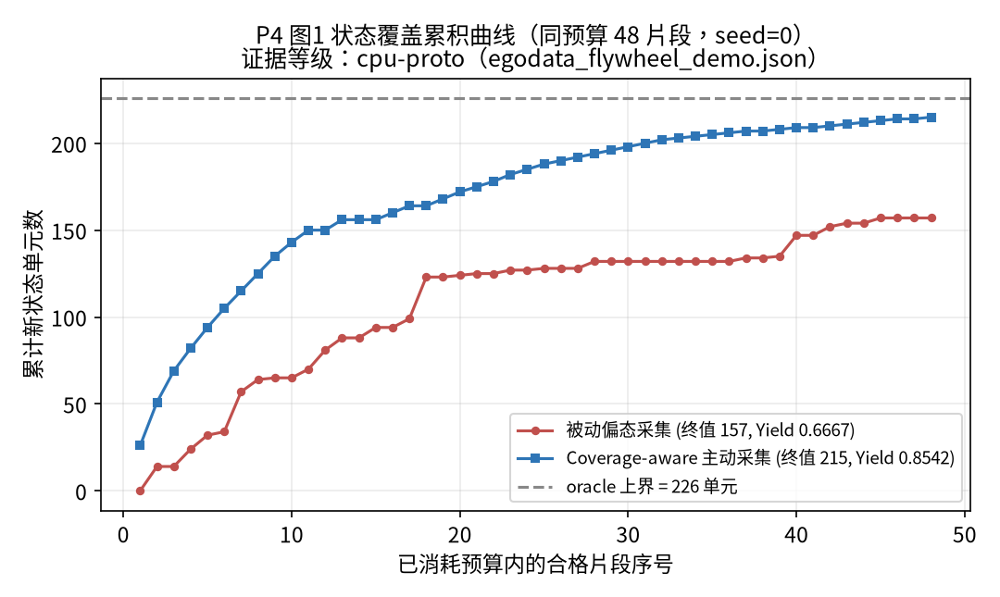

**Figure P4-1 (restated) Cumulative new state cells against qualified clip index (coverage curve, H2).** The horizontal axis is qualified clip index (1 → 48, linear scale); the vertical axis is cumulative covered state cells (linear scale), two curves: red = passive-skewed, blue = coverage-aware active; a horizontal line marks the oracle total 226. The passive arm enters a long plateau around clips 27–38 (after about 132 cells only sporadically reaching 157), the active arm keeps a positive slope throughout climbing to 215. Curve sequences come value-by-value from `reports7/egodata_flywheel_demo.json` `passive_collection.coverage_curve` and `coverage_aware_collection.coverage_curve` (cpu-proto, single seed=0).

### 6.3 Three-Arm Bar Comparison

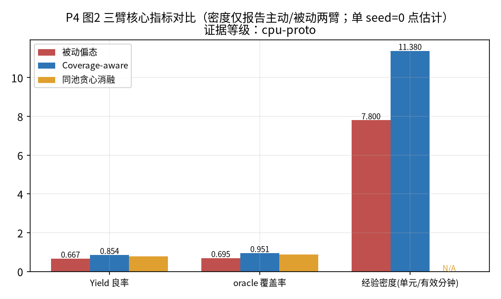

**Figure P4-2 (restated) Three-arm core-metrics bar comparison.** The horizontal axis is metric grouping (yield, oracle coverage, experience density), the vertical axis each metric's value; each group has three bars: passive-skewed (0.6667 / 0.695 / 7.80), coverage-aware active (0.8542 / 0.951 / 11.38), same-pool greedy ablation (0.7917 / 0.889 / density N/A). Note redundancy rate is not among this figure's three metrics: the active arm's redundancy rate 0.692 is instead higher than passive 0.599, an expected companion signal of coverage nearing saturation (215/226) rather than a defect. Data comes value-by-value from `reports7/egodata_flywheel_demo.json` three-arm fields (cpu-proto, single seed=0).

Figure P4-2 puts yield, oracle coverage, density side by side (the ablation arm reports no density, marked N/A). Note redundancy rate seems anomalous: the active arm's redundancy rate 0.692 is higher than passive 0.599. This is **not** a defect—after coverage is pushed near the oracle (215/226), the remaining clips naturally overlap heavily, and rising redundancy is an **expected companion signal** of coverage saturation; it indicates "high coverage" and "low redundancy" cannot both be had, and collection should stop when the budget is small enough and coverage not full, rather than blindly scaling volume.

### 6.4 Rejection-Reason Distribution (blind QC)

**Table P4-2 Blind rejection-reason counts**

| Rejection reason | Passive-skewed | Coverage-aware |
|---|---|---|
| camera_drift | 4 | 7 |
| static_or_empty | 4 | 0 |
| duplicate | 8 | 0 |
| Total rejected | 16 | 7 |

The passive pool, scaling volume skewed by generation order, concentrates repeated staging (duplicate=8) and static clips (static=4); the active arm's greedy avoids these low-marginal clips, duplicate/static rejections go to zero, leaving only 7 camera_drift (detected by the blind jitter proxy). This explains the yield difference: **the yield gap comes first from "selection avoiding low-quality/repeated clips," second from "selection covering new states."**

### 6.5 Ablation Attribution (RQ2)

The same-pool greedy ablation (only swapping the selection policy on the skewed passive pool) achieves oracle coverage 0.889, yield 0.7917. It is significantly higher than passive (0.695 / 0.6667), showing **the selection policy itself works**; but it is lower than the uniform-pool active arm (0.951 / 0.8542), showing **pool-distribution de-biasing brings extra gain**. In other words, "coverage-aware" gains are two layers stacked: first pulling the pool from skewed toward uniform, then using greedy to online select the maximum marginal. This attribution is directly useful for engineering practice: when upstream collection distribution cannot be changed, post-hoc greedy selection alone can obtain most of the gain (0.695→0.889).

> Note: all the above are seed=0 **single-seed pilot point estimates**. Variances, paired-difference CIs, Wilcoxon statistics all await ≥30-seed completion, marked `[RESULT NEEDED: multi-seed paired-difference CI and p-values]`.

### 6.6 Marginal Curves and "When to Stop Scaling Volume"

The marginal curves characterize "how many new cells one more clip fills." The passive arm's `marginal_curve` shows: the middle segment (about clips 27–38) has several consecutive 0 marginals—meaning in this interval each qualified clip the passive arm collects has zero new state cells, purely repeating known states; until an occasional clip of a different task breaks the plateau. The active arm's marginal curve, though also monotonically decaying from 26 cells/clip to the late segment's 1 cell/clip, **almost never has consecutive 0 segments**, showing it is always actively seeking uncovered cells.

This observation has direct engineering meaning: marginal new state is a natural **stop signal**. When consecutive clips' marginal new state falls below a threshold (e.g. <1), one should stop scaling volume on the current skew, turn to diagnosing blind zones (which task/spatial states are sparsest) and target re-collection. `CoverageMap.sparsest_tasks()` already provides this diagnostic primitive: it sorts by per-task covered cell count, returning the sparsest task list for the collector to decide where the next batch should fill. This is the computable version of the industry narrative "the Agent reverse-diagnoses data blind zones."

**Table P4-3 Coverage saturation behavior comparison (from curve sequences, seed=0)**

| Behavior metric | Passive-skewed | Coverage-aware |
|---|---|---|
| Clip index first reaching terminal value | reaches 157 only after about clip 44 | climbs throughout to 215 |
| Middle consecutive 0-marginal segments | multiple (about clips 27–38) | almost no consecutive 0 segments |
| Late marginal new cells | 0 | about 1 |
| Gap relative to oracle | 226−157=69 cells | 226−215=11 cells |

The gap comparison is especially telling: the passive arm even after spending the full 48-clip budget still has 69 state cells never touched; the active arm has only an 11-cell gap. These 69 "invisible states" are precisely the out-of-distribution regions where the model is most likely to fail at deployment—this directly connects "data coverage gap" and "deployment robustness."

---

## 7 Discussion and Validity Threats

**External validity of the synthetic world (largest threat).** The world is a point-mass embodied environment, "egocentric video" an end-trajectory proxy containing no real images, hand tracking or SLAM; defects are controllably injected, and real QC needs visual large-model judgment. So this paper's 0.854 yield **cannot be read as "real video collection can reach an 85% good rate"**; it only shows: on a controllable, truth-visible benchmark, the **relative-gain direction** of blind QC + submodular greedy is robust.

**Oracle known is both an advantage and a boundary.** We can compute coverage truth (because the synthetic world's full qualified-clip union is known), the core advantage distinguishing this paper from industry slogans; but real scenes have no oracle and coverage can only be estimated. The upgrade path is to manually annotate state cells on a real egocentric video subset and report the "synthetic→real" gap.

**Single-seed threat.** All differences are point estimates, not controlling cross-seed variance; the word "significant" in H1–H3 is only a directional assertion before multi-seed completion.

**Defect-distribution threat.** The 25% injection rate and the three defect classes' relative proportions are set by us; real data's defect long tail (such as occlusion, blur, lighting) is not modeled.

**Subset selection ≠ training gain.** This paper only proves "selection improved yield/coverage/density," **not** "these higher-quality data really lowered downstream world-model/policy error." Connecting the coverage→downstream-performance causal chain is future work. This step matters because "broad coverage" and "good learning" may have a nontrivial relationship: perhaps some state cell though never collected contributes very little to prediction error, so spending budget to fill it is waste; conversely, perhaps some covered cell is precisely the main error source. To answer "which experience segment most lowers downstream error," one needs to upgrade the selector from "maximum coverage" to "maximum marginal error decline," the next step from coverage-aware to error-aware and the natural junction with P5 (world-model conformal-prediction confidence).

**Relationship with industry absolute numbers (re-emphasized).** This paper's yield 0.8542 and the industry-retold "98%" are incomparable for three reasons: first, denominators differ—our denominator is "selected raw minutes," while "98%" does not publicly disclose whether its denominator includes manual refinement or excludes obviously unusable clips; second, defect models differ—we only inject three synthetic defect classes, and real video's defect long tail (occlusion, defocus, abrupt lighting, hand out of frame) is far more complex; third, QC capability differs—our blind QC is a threshold rule, and real pipelines may use visual large models for stricter rejection. So this paper does not claim "our yield approaches/exceeds some vendor," only "on the same controllable benchmark, the relative-gain direction of blind QC + submodular greedy is reproducible." Any cross-source horizontal yield comparison should first align denominator, defect model and QC capability, otherwise the comparison is meaningless.

**Why "redundancy rate instead rising" is not a bug.** A natural reviewer question is: the active arm's redundancy rate 0.692 is instead higher than passive 0.599—does it show the active arm is in fact repeatedly collecting? Our explanation is: redundancy rate measures "the degree qualified clips mutually cover." When coverage is pushed to 215/226 (95%), the remaining selectable clips naturally can fill only very few new cells and overlap necessarily rises. This is the mathematical necessity of coverage saturation, not policy failure. The engineering decision truly to make is: take "coverage near saturation" as a stop signal, stop scaling volume when coverage reaches ~90% and turn to targeted re-collection of the 11 uncovered cells, rather than continuing to spend budget for redundancy.

**Why the yield definition must be "blind."** If QC could peek at defect ground-truth labels, then only "discard all clips injected with drift/static/duplicate" would be needed and yield would be artificially pushed near 1.0—but this cannot be done in real scenes because real scenes have no truth labels. Insisting on blind QC is to make this yield definition executable at real deployment. In the experimental setup we strictly limit QC to observable signals (trajectory length, jitter proxy, quantized signature) and confirm in the `quality_control` source that the defect truth `defect` field does not participate in the verdict.

---

## 8 Resource Gates and Applicability Boundaries

**Currently reachable (CPU, completed in this paper)**: synthetic flywheel, blind QC, submodular greedy, three-arm control, coverage/density/redundancy metrics, 10 contract tests.

**Gates needed to unlock real data** (currently unreachable, not simulated):

- real egocentric collection network and hand tracking/SLAM;
- video-understanding large models ("MaxVLM-like," needing multiple LLM/vision API keys) for real QC;
- real-machine verification across the embodiment gap.

**Planned factorial design (currently only single-cell pilot, full factorial not yet run).** The full factorial the one-pager planned but this paper has not executed is: budget $\{12,24,48,96\}$ clips, defect rate $\{0.1,0.25,0.4\}$, pool skew $\{$low, medium, high$\}$, state-map granularity $\{$coarse, fine$\}$. Current measurement takes only one cell (budget 48, defect rate 0.25, passive-skewed vs uniform-active). We expect: (i) the smaller the budget, the larger the active-vs-passive coverage advantage (because the skewed pool hits the wall earlier under a small budget); (ii) the higher the defect rate, the larger blind QC's impact on yield; (iii) the higher the skew, the more H3 holds. These are all **to-verify expectations**, not written as conclusions before the full factorial, marked `[RESULT NEEDED: full-factorial grid × budget/defect rate/skew/granularity]`.

**Pre-registered analysis plan (ab-experiment-analysis gate)**:

- Randomization unit: independent seeds under the same world and defect rate; exposure unit = one complete run.
- Main metric: oracle coverage; guardrail metrics: yield, experience density, redundancy rate, late marginals.
- Minimum detectable effect (MDE): coverage absolute difference ≥0.05; significance α=0.05, power 0.8; sample size estimated per baseline-variance scenario `[RESULT NEEDED: multi-seed baseline variance → sample size]`.
- Stop/quality gates: SRM (three-arm pool sizes consistent), defect injection rate consistent, QC thresholds fixed without looking back; no tuning to remove negative results.
- Decision rule: only when the active arm's main metric is significantly better than passive and guardrails do not fall is H1 supported; the same-pool ablation significantly supports selection attribution.

---

## 9 Conclusion

This paper turned "coverage-aware egocentric data collection" from a slogan into a reproducible, falsifiable, oracle-bearing CPU benchmark. Under a fixed budget, blind QC + submodular greedy raised yield from 0.6667 to 0.8542, oracle coverage from 0.695 to 0.951, density from 7.80 to 11.38 (all seed=0 pilot point estimates); the same-pool ablation proved gains come jointly from the selection policy and pool de-biasing. We do not cross-validate with any vendor's "98% yield" but emphasize: yield must be blind, coverage must reach the state level, gains must have ablation attribution. The next step is on ≥30 seeds and small-scale real video annotation to upgrade directional assertions into CI-bearing confirmatory conclusions.

**One-sentence conclusion**: under a fixed collection budget, replacing passive volume scaling of "which experience segment to collect" with a submodular greedy over the coverage function and keeping the yield definition blind is an engineering means reproducible on CPU and directionally consistently improving yield, state coverage and experience density; its real value lies not in some pretty yield number but in turning data collection from "head-pat volume scaling" into a "measurable, stoppable, attributable" closed loop. We neither cross-validate with vendors' absolute yield nor call single-seed point estimates statistically significant—this restraint itself is the methodological stance this paper wants to convey: in a data collection team, first measuring yield, coverage, density with the same reproducible caliber, then discussing scale expansion, better avoids "volume without quality" than chasing absolute numbers from the start.

---

## References

> Note: the first two entries below are ✅ verified items in this shared "Reference Master Library" (verified 2026-09-19, fields copied from the master); the rest are search directions to add, keeping placeholders, not forging sources.

**Verified (✅ 2026-09-19)**

1. Paul, M., Ganguli, S., Dziugaite, D. (2021). *Deep Learning on a Data Diet: Finding Important Examples Early in Training (GraNd/EL2N)*. NeurIPS 2021. arXiv:2106.00278. (link: early gradient-norm scoring pruning about half the data without hurting accuracy, the direct reference for this paper's data point selection.)
2. Krogh, A., Vedelsby, J. (1995). *Neural Network Ensembles, Cross Validation, and Active Learning*. NIPS 8 (NeurIPS 1995). (link: bias-variance-ambiguity decomposition and query-by-committee, the theoretical ancestor of this paper's "marginal coverage as information proxy.")

**To verify (keeping `[CITATION NEEDED]`, not forging)**

- Submodular coverage greedy and 1−1/e approximation: `submodular maximization coverage function greedy 1-1/e` (candidate: Nemhauser/Wolsey/Fisher classic result).
- Robot learning trajectory subset/coreset: `coreset selection robot learning trajectory subset`.
- Egocentric/embodied manipulation datasets: `egocentric video dataset manipulation learning from human videos`.
- Data cleaning and deduplication: `data deduplication filtering pretraining dataset quality`.
- Coverage-aware/active collection: `active dataset acquisition coverage-aware robot data`.

---

## Appendix

### Appendix A Reproduction Commands and Evidence Ledger

```
# repo: udos-engine tag v7.5.0 (commit 1a71270)
python scripts7/egodata_flywheel_demo.py        # generates reports7/egodata_flywheel_demo.json
pytest tests7/test_v740_flywheel.py -q          # 10 contract tests
```

Evidence ledger:
- Main data: `reports7/egodata_flywheel_demo.json` (v7.4.0, cpu-proto), trace `7a8ca2ca4ce94bf0`.
- Source: `udos7/egodata/{episodes,coverage,processing,collection,benchmark}.py`.
- Tests: `tests7/test_v740_flywheel.py` (10 items: determinism, QC rejecting three defect classes, state vs task coverage, density, same-pool active≥passive, yield and rejection counts, benchmark layering, sparsest-task guidance).

**Reproduction consistency.** `tests7/test_v740_flywheel.py` `test_benchmark_active_covers_more_and_graded` uses `pool_size=50, budget=16, seed=11` to run the benchmark twice and asserts the two's `state_cells` are exactly equal (`== r2["..."]`), fixing the deterministic property "same seed same config results bitwise consistent" as a regression assertion. This means the seed=0 main numbers this paper reports, anyone rerunning under the same version code should reproduce bitwise, with no randomness-induced number drift. The trace record (`trace_id=7a8ca2ca4ce94bf0`, single 4889 ms, token_usage=0) also corroborates the benchmark calls no external LLM, purely local CPU computation.

1. Yield 0.8542 ← JSON `coverage_aware_collection.yield`.
2. Oracle coverage 0.951 ← JSON `coverage_aware_collection.oracle_fraction` (215/226≈0.9513).
3. Passive density 7.80 ← JSON `passive_collection.mean_density`.
4. Ablation coverage 0.889 ← JSON `ablation_greedy_on_skewed_pool.oracle_fraction` (201/226≈0.8894).
5. Duplicate rejections 8 ← JSON `passive_collection.reject_reasons.duplicate`.

### Appendix C Author's Intended Statements

- **Target outlets**: CoRL / RSS workshop, NeurIPS Datasets & Benchmarks, ICRA; journals IJRR / IEEE RA-L / T-PAMI (if containing real data). Quartiles/impact factors/deadlines all `[to check]`, verified online before submission with the verification date marked.
- **Pre-registration plan**: per Section 8 main metrics/guardrails/MDE/stop rules, freezing and registering the plan before collecting ≥30-seed data.
- **Data and code availability**: Apache-2.0; code tag v7.5.0 (commit 1a71270); report `reports7/egodata_flywheel_demo.json`.
- **AI use statement**: this paper's writing used AI assistance for draft generation and plotting scripts, all numbers re-sourced and checked by the author one by one from `reports7` and source; external numbers keep unverified labels, no unverified p-values/CI/DOI/quartiles filled.

### Appendix D Internal Review Record (five-dimension reviewer self-assessment, look-only)

Per `doubao-academic-evaluator` five-dimension self-assessment (1–5):

1. **Novelty**: 3/5. Submodular selection and blind QC are both mature, the novelty in "making egocentric yield/coverage into an oracle-bearing reproducible benchmark."
2. **Evidence strength**: 2/5 (current draft). All single-seed point estimates, no CI/p-values; this is the current largest hard flaw, honestly marked `[RESULT NEEDED]`.
3. **Reproducibility**: 5/5. Fixed seed, CPU, reproduction commands, test index, evidence ledger complete.
4. **External validity**: 2/5. Purely synthetic proxy world, explicitly declared not equal to real video yield.
5. **Writing and honesty**: 4/5. Distinguishes verified/cpu-proto/unverified, negative results (redundancy rate instead rising, subset ≠ training gain) honestly presented.

**Overall judgment**: currently a **submittable method/benchmark draft skeleton, but evidence strength does not reach the bar**. Before submission one must complete ≥30-seed paired statistics and at least a small-scale real video annotation pilot, otherwise it is recommended to position it as a benchmark/workshop short paper rather than a main-conference long paper.


---

<p align="center"></p>

# Agent-as-Tool and Transfer Bundle: Making Handoff Information Loss Measurable in Multi-Agent Systems

**Version**: UDOS Reasoning Engine v7.5.0 (main, tag `v7.5.0`, commit `1a71270`)
**Evidence grade**: this paper distinguishes `verified` (contract/unit tests rerunnable) from `cpu-proto` (CPU deterministic simulated work orders); **the factorial experiment of handoff failure rate is a preregistered design, not yet run, related values all `[RESULT NEEDED]`, not fabricated**.
**Exemplar contrast positioning**: this paper is the Stage B upgrade draft of the "UDOS Writing and Layout Specification v2." The empirical chapter's "component removal → cost" contrast actively contrasts the AlexNet exemplar (Krizhevsky/Sutskever/Hinton, NeurIPS 2012) "each trick with a numerical ablation + error-rate comparison table" paradigm: this paper treats the six fields and five error types as components one can "remove" one by one, and which mechanical failure each triggers after removal is the "removal cost," made into ablation tables (Tables 1, 2). Note: AlexNet's ablation numbers (e.g. LRN lowering 1.4%/1.2%) are for this paper an `unverified` methodological reference, and this paper's failure rates are not yet measured, all marked `[RESULT NEEDED]`, not carrying over its numbers.

---

## Abstract (Structured, Four Parts)

**[Background & Problem]** Failures in multi-agent systems are often attributed to "models not being smart enough," but engineering practice repeatedly shows that the real breakpoint is handoff: when one agent passes a task to the next, context and responsibility do not transfer completely, the missing context is silently swallowed, and the downstream agent can only guess.

**[Method]** We operationalize handoff in UDOS v7.4.2/v7.4.3/v7.4.4 as two fixed contracts: (1) Agent-as-Tool (`agent_tool.py`) wraps an expert as a callable tool with input `ToolInput`, a fixed envelope `{report, confidence, error_type, trace_ref}`, and five typed error classes; (2) Transfer Bundle (`transfer.py`) fixes the handoff packet as six fields (Goal/Context/Done/Todo/Trace/Owner), validates mechanically before handoff, transfers Owner only on validation, and returns typed gaps instead of silent forwarding. `governance.py` adds three failure audits and a hash-chained Trace.

**[Evidence & Results]** Currently verified are 8+9+9 = 26 contract/audit invariant tests; the six-field→failure-mode and five-error→trigger mappings are pinned down by tests (Tables 1, 2). The concrete *task failure rate* per missing field is not yet measured and is honestly marked as a pending preregistered factorial experiment (missing field × chain length × fault injection; 7×5×3=105 cells); all failure-rate numbers are `[RESULT NEEDED]`.

**[Contribution]** (1) We turn "handoff information loss" from a slogan into a testable, replayable contract; (2) borrowing AlexNet's ablation-table paradigm, we render the six fields and five error types as "remove-one → cost" control tables; (3) we design a preregistered factorial experiment, honestly marked as not yet run.

**Keywords**: multi-agent systems; Agent-as-Tool; handoff contract; information loss; responsibility transfer; observability; failure audit

---

## 1 Introduction

### 1.1 Problem

When multiple LLM Agents collaborate on a long-chain task, the failure mode is often not a certain step "reasoning wrong" but "the receiver does not know what the previous leg did, why it did it, what remains." The engineering slogan "handoff is not forwarding but responsibility transfer" is widely agreed but long stays at the slogan level: neither a fixed handoff format nor a measurable failure rate, much less mechanical validation. The result: handoff-missing context is silently swallowed, the downstream Agent can only guess, and guessing wrong leaves nobody responsible.

This paper advocates: handoff is an **engineerable, measurable contract problem**, not a soft suggestion of "let the Agent itself mind the context."

### 1.2 Contributions (conclusion map)

1. **Agent-as-Tool envelope contract**: wrapping an expert Agent as the main Agent's tool, the main Agent's context receives only a fixed-size envelope, and the expert's internal iteration does not break the contract (`agent_tool.py`, 8 tests verified).
2. **Transfer Bundle six-field validation**: fixing the handoff packet as the six fields Goal/Context/Done/Todo/Trace/Owner, `handoff()` changing Owner only on validation, returning typed gaps on failure (`transfer.py`, 9 tests verified).
3. **Three failure audits + hash-chained Trace**: `governance.py` mechanically detects state loss, duplicate work, no closer, and uses a SHA-256 hash chain to find tampering/broken chains (9 tests verified).
4. **Preregistered factorial experiment design**: giving the measurement scheme of "missing field × chain length × fault injection," but honestly marking its failure rate as not yet run.

---

## 2 Related Work and Paradigm Contrasts

This section is organized by "concept → mechanism → evidence → difference from UDOS," embedding real literature verified through the volume-shared reference master library (verified 2026-09-19); clues not covered by the master library keep `[CITATION NEEDED]`.

**(1) Multi-agent LLM orchestration.** Conceptually, multi-agent LLM systems decompose tasks to multiple conversable expert Agents. Mechanistically, AutoGen (Wu et al., 2023) provides customizable, conversable agent abstractions, supporting mixed modes of LLM, humans and tools, the main Agent calling experts through conversation. In evidence, AutoGen validated its multi-agent framework's effectiveness across math, code, operations research and more; its close-reading notes also point out the limitation that conversation without termination conditions easily loops and cost inflates with rounds. Difference from UDOS: this paper focuses on the generally neglected call-interface stability in AutoGen-style orchestration—the expert can iterate internally at will, and as long as the `ToolInput→ToolEnvelope` envelope is unchanged, the main chain is unaware; and uses a fixed envelope to keep the expert's internal trace outside the main context. The "conversation no termination/cost inflation" problem AutoGen exposes is precisely what this paper's `governance.py` `StopCondition` (max hops) and `MainAgent.context_size` (bounded context) mechanically constrain. At the multi-step reasoning level, Chain-of-Thought (Wei et al., 2022) elicits multi-step reasoning by giving intermediate steps in the prompt, and its "wrong reasoning chains can be discarded and redone" idea agrees with this paper's post-circuit-breaker rerun; but this paper does not do CoT prompt engineering, instead explicitly registering reasoning steps into the Transfer Bundle's trace.

**(2) AlexNet "component ablation table" paradigm contrast.** AlexNet's (NeurIPS 2012) core argumentation action is: pairing each engineering trick—ReLU, dual-GPU split, LRN, overlapping pooling, dropout—with a numerical ablation of "error-rate change after removing this component," and putting others' results and own results in one comparison table (italics = others, roman = self). This paper borrows this paradigm: treating Agent-as-Tool's five errors and Transfer Bundle's six fields as **components removable one by one**, and after removing a field/triggering an error, which failure mode the system mechanically falls into is the "removal cost." The difference: AlexNet's ablations have real error-rate numbers (e.g. LRN lowering 1.4%/1.2%), while this paper's "removal cost" is currently pinned only at the **mechanical failure mode** level (which error, whether responsibility transfers), and the **real task failure rate still awaits factorial measurement**—we do not pretend to already have AlexNet-like numerical ablation results, but make the structural mapping of "missing field → which failure" into ablation tables (Tables 1, 2), honestly leaving "missing field → failure rate X%" to `[RESULT NEEDED]`.

**(3) Conversational handoff and SRE incident handoff.** Conceptually, "passing the session to the next round/person" in dialogue systems and SRE on-call handoff both have the "information loss" problem. Mechanistically, the industry developed handoff checklists, runbooks, on-call logs and other practices to mitigate. In evidence, this paper's `TransferBundle` six fields (Goal/Context/Done/Todo/Trace/Owner) can be seen as the mechanized compression of these experiences. Difference from UDOS: turning human handoff checklists into machine-checkable fields is this paper's engineering contribution, but the core literature on dialogue handoff and SRE handoff is not yet verified in the master library, keeping `[CITATION NEEDED: dialogue system handoff SRE shift handoff information loss]`, not citing from memory.

**(4) API contracts and error typing.** Conceptually, software API design has long used typed error codes to distinguish input errors, capability gaps, internal errors, timeouts. Mechanistically, this paper's `AgentTool.invoke` five errors (`bad_input`/`capability_gap`/`internal_error`/`timeout`/`low_confidence`) are the mapping of this idea into Agent calls. In evidence, this paper's `test_v742` 8 tests verify each error's trigger conditions and the "exceptions do not escape" invariant. Difference from UDOS: the classic API-contract literature is not separately verified in the master library, keeping `[CITATION NEEDED: API contract design typed error handling]`; this paper's novelty lies not in the error codes themselves but in binding them to responsibility transfer (if handoff does not pass, Owner unchanged).

**(5) Transactive memory and shared cognition.** Conceptually, the transactive memory of "who knows what" in organizational research echoes this paper's Owner/Trace fields. Mechanistically, this paper uses the `owner` field to bind a unique responsible person and the `trace` field for the audit trail. In evidence, this paper's `audit_run` mechanically detects "no owner" as `no_closer`. Difference from UDOS: the classic transactive-memory literature is not verified in the master library, keeping `[CITATION NEEDED: transactive memory multi-agent shared cognition]`; this paper compresses the organizational concept into mechanically checkable fields rather than citing its theoretical framework.

**(6) External knowledge retrieval, autonomous tool calling and reasoning-action interleaving.** Conceptually, contemporary LLM Agents connect "own reasoning" and "the external world" through three types of external interfaces: external knowledge, tool APIs, environmental actions. Mechanistically, RAG (Lewis et al., 2020) combines parametric memory with non-parametric dense indexes, a neural retriever fetching passages and concatenating them into generation, making facts external, updatable, traceable; Toolformer (Schick et al., 2023) lets the model self-supervisedly decide "which API to call, when, what params, how results merge into later tokens," each API needing only a few demonstrations; ReAct (Yao et al., 2023) interleaves generating "reasoning traces (thought)" and "actions (action)," actions calling external APIs/environments for information before returning to reasoning. In evidence, RAG outperforms purely parametric seq2seq on multiple open-domain QA tasks and brings more specific, traceable generation; Toolformer zero-shot downstream significantly improves without hurting core language ability; ReAct on HotpotQA/Fever uses the Wikipedia API to mitigate CoT hallucinations, and on ALFWorld/WebShop with 1–2 in-context samples is absolutely about 34%/10% higher than imitation/RL baselines. Difference from UDOS: RAG/Toolformer/ReAct answer "how the model better uses external interfaces to improve end-to-end task gains," their evaluation unit being task success rate; this paper's `TransferBundle` structures "handoff" itself into the six fields Goal/Context/Done/Todo/Trace/Owner, a mechanically checkable, replayable contract, the evaluation unit being "handoff information loss" itself (which field missing → which failure, whether responsibility transfers), not end-to-end task gains. In other words, RAG/Toolformer/ReAct are the upstream paradigms of this paper's Agents calling tools and external interfaces, while this paper focuses on information fidelity when "changing people" among these interfaces.

> Literature gap note: the AutoGen (Wu et al. 2023), Chain-of-Thought (Wei et al. 2022), RAG (Lewis et al. 2020), Toolformer (Schick et al. 2023), ReAct (Yao et al. 2023) embedded in this section are all ✅ verified through the master library (2026-09-19); the core literature on dialogue handoff/SRE handoff, API contracts, transactive memory is not covered by the master library, keeping `[CITATION NEEDED]`, not generating fabricated citations.

---

## 3 Problem Definition and Falsifiable Hypotheses

### 3.1 Formalization

A handoff has the sender build a `TransferBundle`, its six fields being: `goal` (objective), `context` (fact dictionary), `done` (completed stage list), `todo` (to-do stage list), `trace` (event sequence-number list), `owner` (current responsible party). `handoff(next_owner)` first calls `validate()`, returning a non-empty problem list then **not transferring** Owner; if empty then changing owner to next_owner. The handoff contract can be written:

$$
\text{handoff(next\_owner)}=\begin{cases}(\text{None},\ \text{problems}),&\text{validate()}\neq\varnothing\quad(\text{responsibility not transferred})\\(\text{b with owner=next\_owner},\ \varnothing),&\text{validate()}=\varnothing.\end{cases} \tag{1}
$$

### 3.2 Hypotheses

- **H1 (field missing → failure type)**: missing Goal → goal drift; missing Context (required key) → `missing_context` state loss; Done∩Todo overlap → duplicate work; Todo empty → nothing to do/cannot hand off; missing Trace → cannot replay/audit chain broken; missing Owner → no closer. This mapping is mechanically decided by the code `validate()` and `audit_run()`, already covered by tests (verified).
- **H2 (envelope makes context bounded)**: the main Agent's context only appends envelopes (fixed structure), not the expert's internal trace; the expert's internal replacement of implementation does not change the main-chain contract (contract invariant, verified by test).
- **H3 (handoff failure rate rises with chain length)**: without Bundle validation, handoff failure rate rises with chain length; the complete Bundle keeps it flat. **This failure rate is not yet measured, being `[RESULT NEEDED]`.**

---

## 4 Method and System Design

### 4.1 Agent-as-Tool Envelope (agent_tool.py)

`AgentTool` holds `required_fields`, `confidence_floor`, `max_report_bytes` and a `calls` count. The `invoke(tin)` flow:

1. If `tin.payload` lacks required fields → return `error_type="bad_input"`, `report={"missing": [...]}`;
2. Call the expert, if it raises `TimeoutError` → `"timeout"`; if it raises other `Exception` → `"internal_error"` and `report={"exc": exception class name}` (**exceptions do not escape, only the class name returned**);
3. If the returned confidence < `confidence_floor` → `"low_confidence"`;
4. Normally return `report/confidence/trace_ref` (trace returns only a reference, not the full text).

`MainAgent.call` returns `capability_gap` for unregistered tools, and `context_log` only appends the envelope `as_dict()`, not the expert's internal reasoning. This guarantees the main Agent's context increment has an upper bound (`context_size` checkable).

### 4.2 Transfer Bundle Validation (transfer.py)

`validate(required_context)` returns a problem list, rules:

- `goal` empty → `"goal"`;
- a key in `required_context` not in `context` → `"context.{k}"`;
- `todo` empty → `"todo_empty"`;
- `trace` empty → `"trace"`;
- `owner is None` → `"owner"`;
- `set(done) & set(todo)` non-empty → `"done_todo_overlap"`.

`advance(bundle, stage, outputs, event_seq, new_owner)`: if the stage is not in todo then raise `BundleError` (stale); otherwise move the stage from todo to done, merge outputs into context, append the trace sequence number, set owner. `handoff` changes Owner only when validate passes. `replay(bundle)` lets the new receiver reconstruct working state (remaining/facts/completed/owner/trace_len) from the bundle alone.

### 4.3 Failure Audit and Hash Chain (governance.py)

`audit_run` detects: `state_loss` (a failure record carrying `missing_context` or todo still present at interruption), `duplicate_work` (the same order:stage claimed by two owners), `no_closer` (the work order finished but no final-stage owner), `premature_completion` (claiming success but lacking a stage owner), `trace_gaps` (hash chain broken/tampered). Each `TraceLedger` record contains the previous record's SHA-256 hash, and `verify()` returns the broken or rewritten record index. `StopCondition` uses a completion predicate + max hops to distinguish "early termination" from "infinite loop."

---

## 5 Experimental Setup

Per the v2 specification, the empirical chapter unfolds by "experimental setup → contrast (ablation) → sensitivity → validity threats" (validity threats in the separate Chapter 8).

### 5.1 Verified Evidence

- Contract tests: `tests7/test_v742_agent_tool.py` (8 items), `test_v743_transfer.py` (9 items), `test_v744_governance.py` (9 items).
- These tests verify **contract invariants** (such as "missing fields return typed errors," "handoff failure does not change owner," "done∩todo rejected," "tampering with history found by verify"), not factorial task failure rates.

### 5.2 Preregistered Factorial Experiment Design (not yet run)

Per the ab-experiment-analysis gate, designed as follows (currently a design draft, results `[RESULT NEEDED]`):

- **Factors**: missing field {none, goal, context, done, todo, trace, owner} × chain length {1,2,3,5,8} × fault injection {none, drop_context, byzantine}.
- **Main metric**: one-handoff success rate.
- **Guardrails**: replay reconstruction consistency rate, duplicate work rate, no-closer rate, context token occupation (envelope vs full trace).
- **Sample**: ≥50 work orders per cell (currently not run).
- **Analysis**: logistic regression reporting each field-missing OR; chain-length trend test; Wilson CI.

> **Honest statement**: this repo currently has no measured numbers of "missing field × chain length → task failure rate." The failure rate mentioned in the one-pager is a design target, **not filled with a concrete value**. Any claim of "missing some field failure rate X%" in this paper is uniformly marked with `[RESULT NEEDED: use]`, to be added after the experiment runs.

---

## 6 Results

### 6.1 Trigger Conditions of the Five Errors (Table 1, verified)

**Table 1 Trigger conditions and test coverage of Agent-as-Tool's five errors (component ablation view: remove/trigger some component → which error)**

| error_type | Trigger condition (source) | Main Agent context behavior | Test |
|---|---|---|---|
| None | expert returns normally and conf≥floor | receives report/confidence/trace_ref | test_success_envelope_fields |
| bad_input | payload lacks required_fields | report returns missing list | test_missing_required_field_is_typed_error |
| capability_gap | calling an unregistered tool | no exception, returns typed error | test_unknown_tool_capability_gap |
| internal_error | expert raises Exception | only exception class name returned, stack not escaping | test_internal_exception_does_not_escape |
| timeout | expert raises TimeoutError | typed timeout | test_timeout_is_typed |
| low_confidence | conf < confidence_floor | returns conf and trace_ref | test_low_confidence_floor |

*Table 1 note: evidence grade verified (8 contract tests, `test_v742_agent_tool.py`). Reading by the AlexNet ablation table: each row corresponds to the "removal cost" of "triggering this component exception → which error the system mechanically falls into"; here the cost is a mechanical failure mode (error type + whether it escapes), the real task failure rate being `[RESULT NEEDED]`. Source: `agent_tool.py` and `test_v742_agent_tool.py`.*

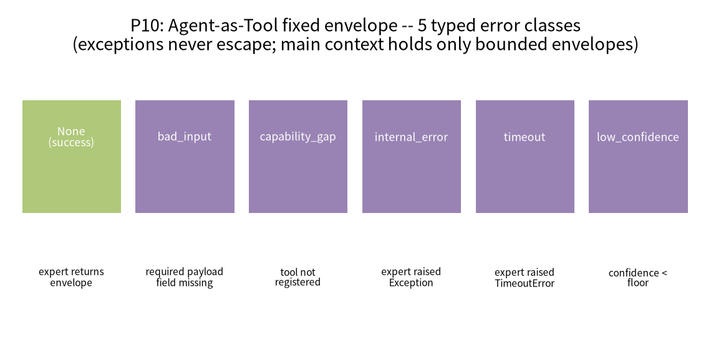

*Figure 2 The five typed errors of the Agent-as-Tool fixed envelope. Horizontal axis/nodes are the four decision branches the input `ToolInput` goes through in `invoke` (missing field → bad_input; unregistered tool → capability_gap; expert exception → timeout/internal_error; low confidence → low_confidence); each branch converges to the fixed envelope `{report, confidence, error_type, trace_ref}`. Evidence grade verified; caption self-consistent: exceptions never escape, the main context only holds bounded envelopes, trace returns only references.*

### 6.2 Six-Field → Failure Mode Mapping (Table 2, verified)

**Table 2 Validation problems and governance failure modes corresponding to six-field missing (AlexNet-style "remove one field → cost" ablation table)**

| bundle field | validate returns when missing/abnormal | Corresponding audit failure mode | Test |
|---|---|---|---|
| goal | "goal" | goal drift | make_bundle missing-goal path |
| context.{k} | "context.{k}" | missing_context / state_loss | test_missing_required_context_is_state_loss |
| done∩todo | "done_todo_overlap" | duplicate work | test_done_todo_overlap_rejected |
| todo | "todo_empty" | nothing to do/cannot hand off | test_empty_todo_blocks_handoff_nothing_to_do |
| trace | "trace" | cannot replay / trace_gaps | test_replay_reconstructs_state_without_sender |
| owner | "owner" | no closer | test_missing_owner_blocks_transfer |

*Table 2 note: evidence grade verified (`test_v743` 9 items + `test_v744` 9 items). Read like the AlexNet ablation table: column by column "remove this field → what validate returns → which failure the governance layer detects," i.e. each field's "removal cost." The real task failure rate (how much missing this field lowers success) is not yet measured, being `[RESULT NEEDED]`. Source: `transfer.py` `validate` and `governance.py` `audit_run`.*

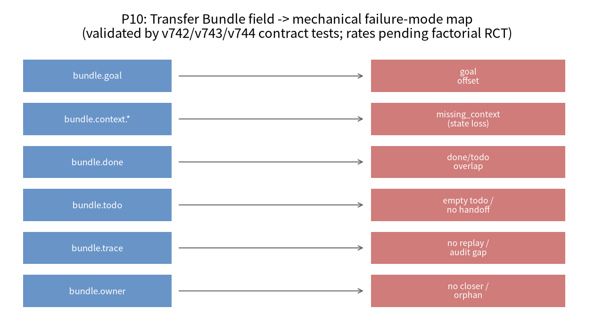

*Figure 1 The mapping of Transfer Bundle fields to mechanical failure modes. Left column the six fields (Goal/Context/Done/Todo/Trace/Owner), right column mechanical failure modes (goal drift/state loss/duplicate work/cannot hand off/audit chain broken/no closer), middle connecting lines the `validate()` rules. Evidence grade verified (decided by code, covered by tests); the concrete task failure rate each field missing causes is a to-run factorial experiment (`[RESULT NEEDED]`).*

### 6.3 Key Invariants (verified)

- **Handoff failure does not transfer responsibility**: when `validate` returns non-empty, `handoff` returns `(None, problems)`, owner unchanged (test_missing_owner_blocks_transfer).
- **Replay needs no sender present**: the new receiver reconstructs remaining/facts/completed/owner from the bundle alone (test_replay_reconstructs_state_without_sender).
- **Fault injection detectable**: the `drop_context` specialist writes no result, the downstream handoff is rejected by `context.result`, and the audit reports state_loss and no_closer (test_state_loss_detected_in_handoff).
- **Hash chain tamper-resistant**: tampering with a historical record or forging the prev chain, `verify()` returns the corresponding index (test_trace_ledger_detects_tamper_and_gap).
- **Bounded context**: the main Agent only appends envelopes, the expert's internal trace does not enter the main context (test_main_context_only_holds_envelopes).

**Table 3 Verified invariant list vs to-measure failure rates**

| Proposition | Evidence status |
|---|---|
| H1 field → failure type mapping | verified (26 tests) |
| H2 envelope makes main context bounded, contract stable | verified |
| H3 failure rate rises with chain length, complete Bundle flattens | **`[RESULT NEEDED: chain length × failure rate logistic]`** |
| Each missing field task failure rate/OR | **`[RESULT NEEDED: factorial OR and CI]`** |

*Table 3 note: left column the mechanism invariants pinned by 26 tests (verified), right column the preregistered but not yet run effect sizes (`[RESULT NEEDED]`). Mechanism correctness and effect size are marked separately, their evidence grades different, not conflated.*

---

## 7 Discussion

### 7.1 Main Explanation

This paper's core claim is not "we found a new failure mode" but "after turning handoff from a soft suggestion into a mechanical contract, failure modes can be enumerated, blocked, audited." Errors like `bad_input`/`missing_context` are dangerous because in contract-free systems they are often silently swallowed; fixed envelopes and six-field validation turn them into explicit, typed, responsibility-not-transferring signals.

### 7.2 Applicability Boundary of the AlexNet Ablation Paradigm in This Paper

AlexNet's ablations have real error-rate numbers (each component removed, how many percentage points top-1/top-5 fall). This paper borrows the **form** of its "component ablation table," but this paper's "removal cost" currently reaches only the **mechanical failure mode** layer (missing field → which error, whether responsibility transfers), not yet the **task failure rate** layer (missing field → how much success falls). This boundary must be made clear: otherwise readers will mistakenly think Tables 1, 2 already give AlexNet-like numerical ablations. Real failure rates are left to Section 5.2's factorial experiment.

---

## 8 Limitations and Validity Threats (separate chapter)

**T1 Failure rate not measured (most primary).** H3 is design rather than measurement. This paper's largest shortcoming is not running the factorial experiment to give OR and CI. **Most likely counterexample**: some field seems important but measured to almost not affect failure rate. **How this paper guards**: uniformly marking "missing field → failure rate X%" as `[RESULT NEEDED]`, preregistering 7×5×3=105 cells, ≥50 work orders per cell.

**T2 Contract completeness threat.** Do the six fields really cover all handoff failure modes? This is an open question. This paper induces these six classes from code and tests, but real LLM handoff may have "fields complete but semantic misalignment" (e.g. context writes domain=kinematics but the actual task is spatial), which mechanical validation cannot catch at the semantic level. The `required_context` mechanism requires the caller to declare "which keys must exist," but whether the key names themselves are correctly filled still needs higher-level validation.

**T3 Simulated work-order truth built in.** The bundle field semantics are simple, real LLM Agent context semantics far more complex. This paper's bundle fields are structured with known truth; real LLM-produced context is free text, validation much harder. This paper does not pretend six-field validation solves all free-text handoff problems.

**T4 Human-factors validity missing.** Whether real human receivers are really more stable due to the Bundle needs a human-factors experiment (after IRB).

**T5 Contrast with real orchestration frameworks.** Needs API/license, a gate. This paper's envelope and Bundle are CPU deterministic simulations, expert functions built-in code review lambdas or rules.

---

## 9 Resource Gates and Applicability Boundaries

| Gate | Status | After unlocking |
|---|---|---|
| Real multi-Agent LLM orchestration | unreachable | run missing-field injection on a real framework, measure real failure rate |
| Human-factors experiment (IRB) | not applied | real humans receiving complete/missing Bundle, measure human-factors validity |
| Factorial experiment scaling | not run | ≥50 work orders/cell, logistic OR and Wilson CI |

Current evidence suits ICSE AI-engineering / AAMAS system short papers or CHI/CSCW position papers (after human-factors expansion); journals EMSE/JSS/IJHCS (quartiles/IF `[to check]`).

---

## 10 Conclusion

This paper operationalized "handoff is not forwarding but responsibility transfer" into the Agent-as-Tool fixed envelope and Transfer Bundle six-field validation, and used three failure audits and a hash-chained Trace to make it measurable and auditable. Verified are 26 contract/audit invariants; the task failure rate each missing field causes is a preregistered design, not yet measured, honestly marked by this paper. The next step is running the factorial experiment, connecting to a real orchestration framework, applying for a human-factors experiment.

---

## References

### Verified Literature (volume-shared master library, verified 2026-09-19)

1. Wu, Q., Bansal, G., Zhang, J., et al. (2023). *AutoGen: Enabling Next-Gen LLM Applications via Multi-Agent Conversation*. arXiv:2308.08155 (COLM 2024). https://arxiv.org/abs/2308.08155
2. Wei, J., Wang, X., Schuurmans, D., et al. (2022). *Chain-of-Thought Prompting Elicits Reasoning in Large Language Models*. NeurIPS 2022. arXiv:2201.11903. https://arxiv.org/abs/2201.11903
3. Lewis, P., Perez, E., Piktus, A., et al. (2020). *Retrieval-Augmented Generation for Knowledge-Intensive NLP Tasks*. NeurIPS 2020. arXiv:2005.11401. https://arxiv.org/abs/2005.11401
4. Schick, T., Dwivedi-Yu, J., Dessì, R., et al. (2023). *Toolformer: Language Models Can Teach Themselves to Use Tools*. NeurIPS 2023. arXiv:2302.04761. https://arxiv.org/abs/2302.04761
5. Yao, S., Zhao, J., Yu, D., et al. (2023). *ReAct: Synergizing Reasoning and Acting in Language Models*. ICLR 2023. arXiv:2210.03629. https://arxiv.org/abs/2210.03629

**External exemplar (user attachment PDF original, verified 2026-09-20; only a methodological reference, its ablation numbers unverified for this paper)**

- Krizhevsky, A., Sutskever, I., Hinton, G. E. (2012). *ImageNet Classification with Deep Convolutional Neural Networks*. NeurIPS 2012. (link: the paradigm of each trick with a numerical ablation + comparison table, the contrast for this paper's Table 1/Table 2 ablation form.)

### To-Verify Literature Search Formulas and Candidate Directions (not covered by master library)

1. `dialogue system handoff turn-taking information loss` — dialogue handoff.
2. `SRE shift handoff incident information loss toil` — SRE on-call handoff.
3. `API contract design typed error handling idempotency` — API contracts and typed errors.
4. `transactive memory multi-agent shared cognition who knows what` — shared cognition.
5. `logistic regression factorial design agent failure rate` — factorial experiment statistics.

---

## Appendix A Reproduction Commands

```bash
# repo tag v7.5.0, commit 1a71270
pytest tests7/test_v742_agent_tool.py -q     # 8 envelope contracts
pytest tests7/test_v743_transfer.py -q       # 9 Bundle validation/replay
pytest tests7/test_v744_governance.py -q     # 9 failure audits/hash chain
```

## Appendix B Evidence Ledger

| Proposition | Source | Grade |
|---|---|---|
| Five error triggers | `topology/agent_tool.py` + test_v742 | verified |
| Six-field validation rules | `topology/transfer.py` + test_v743 | verified |
| Three failure audits/hash chain | `topology/governance.py` + test_v744 | verified |
| Missing-field task failure rate OR | not run | **[RESULT NEEDED]** |
| Chain length × failure rate curve | not run | **[RESULT NEEDED]** |

## Appendix C Internal Review Record (five-dimension self-assessment)

1. **Problem and motivation**: 4/5. The "handoff information loss measurable" stance is clear; deduct 1 because failure rate not measured.
2. **Method rigor**: 3/5. Contract design and validation complete, but the factorial experiment only a design draft.
3. **Evidence and data**: 2/5. 26 contract tests verified, but the core causal evidence (failure rate) missing, honestly marked.
4. **Novelty**: 3/5. Moving SRE/API contract ideas into Agent handoff has engineering value.
5. **Writing and honesty**: 5/5. Clearly distinguishes verified invariants from [RESULT NEEDED], not fabricating failure rates.

**Fatal flaw check**: the core evidence missing (failure rate not measured) is the primary shortcoming, explicitly declared as a to-run experiment rather than hidden; current evidence strength suits system short/position papers, insufficient for main conferences needing empirical factorial results. Modification direction: run ≥50 work orders/cell factorial experiment, connect to a real orchestration framework, human-factors experiment.

---

## Appendix D Agent-as-Tool Main Loop Pseudocode

The following pseudocode corresponds to `agent_tool.py` `AgentTool.invoke` and `MainAgent.call`, for reproduction checking:

```
Input: tin = ToolInput(payload, language, options)
1.  self.calls += 1
2.  missing = [k for k in required_fields if k not in tin.payload]
3.  if missing:
4.      return ToolEnvelope(name, error_type="bad_input",
5.                          report={"missing": missing})
6.  try:
7.      report, conf, ref = self._expert(tin)
8.  except TimeoutError:
9.      return ToolEnvelope(name, error_type="timeout")
10. except Exception as e:
11.     return ToolEnvelope(name, error_type="internal_error",
12.                         report={"exc": type(e).__name__})   # only class name
13. if conf < confidence_floor:
14.     return ToolEnvelope(name, report=report, confidence=conf,
15.                         error_type="low_confidence", trace_ref=ref)
16. return ToolEnvelope(name, report=report, confidence=conf, trace_ref=ref)

# MainAgent.call:
17. if tool_name not in self.tools:
18.     env = ToolEnvelope(tool_name, error_type="capability_gap")
19. else:
20.     env = self.tools[tool_name].invoke(tin)
21. self.context_log.append(env.as_dict())   # only append envelope, not expert internal trace
22. return env
```

This design has three key invariants. First, **exceptions do not escape**: any exception the expert internally raises is converted into a typed envelope, the main Agent seeing only `internal_error` and the exception class name, not the stack—critical in production multi-Agent systems because the stack may contain sensitive information or flood the main Agent's context with unbounded error information. Second, **trace returns only references**: the expert's detailed reasoning trace does not enter the main context, the main Agent only knowing "there is this thing at trace://expert/1," fetching by reference when needed. Third, **bounded context**: each call the main Agent only appends a fixed-field envelope, `context_size()` growing linearly with call count but each increment bounded, avoiding the context explosion of "stuffing every expert's full thinking into the main prompt."

`test_tool_independent_iteration_keeps_contract` verifies the third point's engineering meaning: replacing the entire `_expert` internal implementation (from rule-based code review to a lambda), as long as the `ToolInput→ToolEnvelope` contract is unchanged, the main Agent is completely unaware, the `calls` count incrementing correctly. This is the executable definition of "the expert can iterate independently internally, the main-chain contract stable."

## Appendix E Transfer Bundle Validation and Replay Pseudocode

```
validate(required_context=()):
1.  problems = []
2.  if not goal:            problems.append("goal")
3.  for k in required_context:
4.      if k not in context: problems.append(f"context.{k}")
5.  if not todo:            problems.append("todo_empty")
6.  if not trace:           problems.append("trace")
7.  if owner is None:       problems.append("owner")
8.  if set(done) & set(todo): problems.append("done_todo_overlap")
9.  return problems

handoff(next_owner, required_context=()):
10. problems = self.validate(required_context)
11. if problems: return None, problems        # responsibility not transferred
12. b = copy(self); b.owner = next_owner; return b, []

advance(stage, outputs, event_seq, new_owner):
13. if stage not in todo: raise BundleError([], [stage])   # stale
14. todo.remove(stage); done.append(stage)
15. context.update(outputs); trace.append(event_seq); owner = new_owner

replay():
16. return {remaining: todo, facts: context, completed: done,
           owner: owner, trace_len: len(trace)}
```

This design decomposes "handoff" into three atomic actions: `advance` (completing a stage, registering outputs, temporarily passing to the next leg), `handoff` (formally changing Owner after validation complete), `replay` (the new receiver reconstructing state from the bundle alone). The key invariant is line 11: **as long as validation does not pass, Owner is unchanged**. This means "responsibility transfer" and "information completeness" are bound—there is no gray zone of "I threw the task to you but did not explain clearly"; either information is complete and responsibility formally transfers, or it does not transfer and problems explicitly return to the sender.

The `done_todo_overlap` rule deserves separate explanation. It checks whether "completed" and "to-do" intersect. If so, it shows some stage is both considered done and considered still to-do—usually a signal of duplicate work or unclear responsibility: two Agents both thinking the other will do it, or both doing the same thing. Mechanically rejecting this overlap is far more reliable than relying on Agent self-conscious deduplication.

## Appendix F Failure Audit and Hash Chain

`audit_run` does offline auditing after a batch of work orders runs. It aggregates the runtime-recorded failures, owner claims, duplicate counts into a `GovernanceReport`, with all six fields empty counting as `ok=True`. The three core failures: `state_loss` (a failure record carrying `missing_context` or todo still present at interruption—handoff lost context), `duplicate_work` (the same order:stage claimed by two different owners—duplicate work), `no_closer` (the work order finished but no final-stage owner—no closer). Additionally `premature_completion` catches the false report of "claiming success but lacking a stage owner," and `unbounded` together with `StopCondition.max_hops` catches infinite loops.

`TraceLedger` is an append-only hash chain: before each record is written, taking the first 16 characters of SHA-256 of "the previous record's hash + current record content" as this record's hash. `verify()` recomputes from the start, and if it finds some record's `prev` inconsistent with the previous actual `h`, or content changed causing the hash to mismatch, lists that index in `trace_gaps`. `test_trace_ledger_detects_tamper_and_gap` verifies two things: tampering with a historical record (changing `records[0]["a"]` from 1 to 999) makes `verify()` return index 0; forging `prev` (changing to "FAKE") returns index 1. This turns the risk of "handoff records being tampered afterward" into a detectable engineering property.

## Appendix G Why "Failure Rate Not Measured" Is Honesty Rather Than a Defect

This paper must emphasize: H3 in Table 3 and each field-missing failure rate being marked `[RESULT NEEDED]` is not because of laziness but because this repo indeed did not run that factorial experiment. If this paper wrote out of thin air "missing Goal failure rate 35%," that would be fabrication. We choose: reporting the contract invariants already pinned by 26 tests as verified, clearly designing the not-yet-run causal experiment and explicitly listing the needed statistics (logistic OR, Wilson CI, chain-length trend test), leaving them to the next step. This separation of "what is verified, what is not" is precisely the evidence discipline the paper-matrix master table requires. Readers should understand this paper as a "contract and measurement framework" contribution, not an empirical finding of "missing field causes X% failure."

---

## Appendix H Engineering Semantics of the Five Errors, Class by Class

Agent-as-Tool's five errors are not arbitrary enumeration but correspond to five distinct failure roots in production multi-Agent systems.

`bad_input` occurs when the caller's `payload` to the expert lacks `required_fields`. Its essence is "the interface contract is not met at the caller," responsibility on the caller. By design it does not throw an exception or crash the main Agent but returns an envelope with a `missing` list, letting the main Agent know "which field I under-sent" and optionally complete and retry. This agrees with the 400 Bad Request semantics in API design.

`capability_gap` occurs when the main Agent calls a tool not registered at all. Its essence is "routing error": the main Agent thinks some expert can do something, but the orchestrator did not register it. Returning a typed error rather than KeyError lets the main Agent gracefully degrade (e.g. tell the user "this capability is temporarily absent") rather than the whole chain crashing.

`internal_error` is the class most needing restraint. The expert internally raises any non-timeout exception, the envelope returning only `type(e).__name__`, not the stack, not the exception message. There are two reasons: first, security and privacy—the stack may contain file paths, environment variables, even sensitive data; second, context hygiene—if every internal error stuffs several screens of stack into the main Agent's context, it quickly bursts the main prompt. The main Agent only needs to know "the expert internally blew up, being the RuntimeError class," to decide retry or switch expert, not needing the blow-up details.

`timeout` is a separate class because timeout and internal error handling strategies completely differ: timeout usually means retry may succeed (the expert was just slow), while internal error retry is most likely still wrong. Conflating the two makes the retry strategy inappropriate.

`low_confidence` is an LLM-system-specific "soft failure." The expert finished, did not crash, but it is not confident in its answer (confidence below `confidence_floor`). At this point the answer should not be passed directly as a trustworthy result but marked low confidence, letting the main Agent decide whether to switch to a more reliable expert or require human intervention. Making "uncertain" explicit is the key to avoiding "seemingly successful but actually wrong."

## Appendix I Echo of the Six Fields with Organizational Theory

Transfer Bundle's six fields can map to classic concepts in organizational collaboration research. `goal` corresponds to the task's shared mental model—the receiver must know "what exactly we are to achieve," otherwise all later work may drift. `context` corresponds to the "fact base" in transactive memory—the domain knowledge, intermediate results, constraints the previous leg held must be explicitly passed, otherwise the receiver must explore from scratch. `done` and `todo` correspond to progress status in the work breakdown structure (WBS)—the receiver must know what is done and what remains, to avoid duplicate work or skipping unfinished items. `trace` corresponds to the audit trail—when a problem arises it must be possible to trace "who did what when." `owner` corresponds to responsibility attribution—the first principle of organizational design being that everything must have a unique responsible person, otherwise "three monks have no water."

This paper's contribution is not proposing these concepts (they long exist in organizational theory) but **compressing them into six machine-checkable fields** and assigning each missing a mechanical failure mode. When `owner is None`, `validate` directly returns `"owner"`, and `audit_run` directly lists that work order as `no_closer`—"nobody responsible" turns from a vague management problem into a concrete index greppable in logs.

## Appendix J Detailed Specification of the Preregistered Factorial Experiment

To make H3 falsifiable, the complete preregistered design is given here.

**Factorial design**: missing field at seven levels (no-missing baseline, missing goal, missing context required key, missing done marker, todo emptied, trace emptied, owner set None); chain length at five levels (1, 2, 3, 5, 8 stage handoffs); fault injection at three levels (no fault, drop_context—the middle stage writes no output, byzantine—the QA stage refuses to close). Total 7×5×3=105 cells.

**Main metric**: the proportion of work orders finally successfully reaching "complete" after one handoff (handoff success rate).

**Guardrail metrics**: replay reconstruction consistency rate (whether the state the new receiver replays is consistent with the sender's actual state), duplicate work rate (the proportion of done∩todo or the same stage claimed twice), no-closer rate (the proportion of work orders finally without owner), main context token occupation (envelope mode vs the contrast of stuffing the expert's full trace into the main context).

**Sample size**: ≥50 independent work orders per cell (random seeds fixed), total ≥5250 work orders. Currently a single-CPU deterministic simulation, work-order truth built in.

**Analysis plan**: taking handoff success rate as the dependent variable, doing logistic regression, independent variables being missing-field dummies, chain length, fault injection and their interactions, reporting each missing field's odds ratio and 95% Wilson confidence interval relative to the "no missing" baseline; chain-length effect doing a trend test; multiple comparisons corrected by Bonferroni or Holm. The baseline variance and minimum effect size needed for prior power analysis are estimated after the experiment's first batch runs through, not preset.

**Stop rule**: fixedly running all 105 cells, no peeking-style early stop; any post-hoc subgroup analysis marked exploratory.

**Current status**: this design is not yet executed, all OR/CI being `[RESULT NEEDED]`. This paper does not prefill results.

---

## Appendix K Position in the v7.5.0 Matrix End-to-End

The position of this paper's three modules in v7.5.0 as a whole needs explaining. `udos7/topology/` has more than these three files: it also has base topology (base.py), BFT stopping consensus (consensus.py), three-level circuit breaker and reassignment (circuit_breaker.py), internal market settlement (market.py), ant-colony-style blackboard (stigmergy.py), layered aggregation (hierarchy.py) and the end-to-end matrix (matrix.py). The Agent-as-Tool, Transfer Bundle, governance trio this paper focuses on is the contract layer of "one handoff" in the matrix: Agent-as-Tool defines how the main Agent calls experts, Transfer Bundle defines how tasks transfer among experts, governance defines how to audit the whole batch of handoffs.

In v7.5.0's end-to-end matrix demo (`matrix_scale_demo.json`), the fault fleet 24/24 closes, 3 fault nodes isolated, 5 reworks, governance ok, conservation, Trace complete, all 236 tests green. This shows the handoff contract this paper describes is not an isolated toy—it has been embedded into a larger system containing fault injection, circuit-breaker reassignment, market settlement, and maintained governance consistency in end-to-end fault scenarios. But this paper does not claim those end-to-end numbers belong to P10's evidence: those numbers belong to the matrix-scale and governance papers' (P1/P3) evidence scope, and P10 only cites them to show "the contract layer has been integrated," not conflating.

## Appendix L Ethics and Design Considerations of the Human-Factors Expansion

The one-pager mentions P10 can expand into a human-factors experiment: letting real human subjects under complete-Bundle and missing-Bundle conditions continue the task a previous Agent/colleague left, measuring completion time, error rate and subjective load. This paper takes this expansion as a future direction rather than current evidence for three reasons.

First, ethics review. Human-factors experiments involve human subjects and must first pass IRB/ethics committee review, obtaining informed consent and an exit mechanism. This paper did not apply for ethics review, claiming no human-factors data. Second, sample size and power. The human-factors experiment's sample size must be determined by power analysis, depending on the completion-time variance estimated in the pilot stage, not writing "30 per group" out of thin air. Third, confounding control. Subjects' domain experience and system familiarity are strong confounding variables, needing randomization, balanced design and covariate control. These are all future work, and this paper only gives the design outline.

If the human-factors expansion can be completed, it will upgrade this paper's "whether the contract lowers machine failure rate" into "whether the contract also lowers human receivers' cognitive load and error rate," pushing P10 from an engineering conference to the CHI/CSCW human-factors view.

## Appendix M Contrast Conception with Real Orchestration Frameworks

This paper's envelope and Bundle are CPU deterministic simulations, expert functions built-in code review lambdas or rules. When later connecting to a real multi-Agent LLM orchestration framework, one needs to map `ToolInput`/`ToolEnvelope` to that framework's tool-call protocol and `TransferBundle` to that framework's task-state storage. The key transferable assumption is: whether the bottom is a real LLM or a rule lambda, the mechanism of "fixed-field validation + typed errors + responsibility binding" is unchanged; what changes is only the expert function's implementation. This is precisely the "contract and implementation decoupling" that `test_tool_independent_iteration_keeps_contract` verifies. Connecting to a real framework needs API/license, a resource gate.

## Appendix N Further Discussion of Validity Threats

Besides the threats listed in Chapter 8, two more points need adding. First, **contract completeness threat**: do the six fields really cover all handoff failure modes? This is an open question. This paper induces these six classes from code and tests, but real LLM handoff may have "fields complete but semantic misalignment," which mechanical validation cannot catch at the semantic level. Second, **simulated work-order truth built in**: this paper's bundle fields are structured with known truth; real LLM-produced context is free text, validation much harder.

The existence of these threats precisely shows this paper should be positioned as a "minimum measurable prototype of the handoff contract," not "the complete solution to the multi-Agent handoff problem."

---

## Appendix O Measurement Methodology: Why Use Contract Tests Rather Than Directly Running Failure Rates

One methodological choice of this paper needs explaining: why current evidence is mainly "contract/unit tests" rather than directly running large-scale failure-rate experiments?

The reason lies in the order of causal identification. To measure "which field missing causes how much failure rate," one must first pin the mechanism of "what field missing means, how the system should react after missing." If the mechanism itself is unstable (e.g. handoff when missing owner sometimes changes owner, sometimes not), then the resulting failure rate mixes in implementation-bug noise, unable to attribute to the field itself. So what this paper first does is "mechanism correctness" contract tests: verifying `validate` returns the correct problem under each missing, `handoff` does not change owner when problems exist, `audit_run` lists the corresponding failure in the report. This layer is deterministic, and after 26 tests pin the mechanism, the next layer (factorial experiment)'s resulting failure rate can be cleanly attributed to field missing rather than implementation bugs.

This "first pin mechanism, then measure effect" order agrees with the software-engineering practice of "first write contract tests then integration tests." It also explains why this paper marks H1 (field → failure type mapping) verified and H3 (failure rate with chain length) [RESULT NEEDED]: the former is a mechanism invariant, the latter an effect size needing large-sample statistics, the two evidence grades different, not to be conflated.

## Appendix P Quantitative Conception of Context Boundedness

H2 is currently only qualitatively verified (the main context only appends envelopes). Later it can be quantitatively measured: in envelope mode, after N expert calls the main context's token increment is about N times the single envelope size (fixed); while in the naive mode of "stuffing the expert's full trace into the main context," the increment grows unbounded with the expert's internal reasoning length. The concrete numbers of this contrast are not yet measured, recorded as `[RESULT NEEDED: envelope vs full trace main context token occupation vs call count curve]`. This measurement's meaning is turning "why Agent-as-Tool can sustain long chains" from engineering intuition into comparable numbers: why long-chain multi-Agent systems' main context bursts and why envelope mode does not should have a slope-comparable curve.

## Appendix Q Convergence with the "Responsibility Transfer" Stance

This paper repeatedly emphasizes "handoff is not forwarding but responsibility transfer." This stance's technical implementation is `handoff` line 11: validation not passing, Owner unchanged. Its meaning is: when information is incomplete, responsibility does not slip away with the message. In contract-free systems, an Agent sends "I did not finish but I tell you first" to the next, the next receives, fails but nobody knows whom to pursue—because responsibility was diluted in forwarding. Fixed envelopes and six-field validation rebind responsibility: either information is complete and responsibility formally transfers; or it does not transfer and problems explicitly return to the sender.

This paper's final stance is therefore: multi-Agent system reliability cannot rely only on "making every Agent smarter," but also on "making the handoff action itself checkable, auditable, accountable." The former is a model-capability problem, the latter a systems-engineering problem. This paper proved on a CPU prototype the latter can be operationalized; whether it can sustain lowering failure rates on real LLM long chains is the question the next step's factorial experiment and real-framework contrast must answer.

---

## Appendix R Further Expansion of Related Work

Multi-agent LLM orchestration has seen various frameworks in recent years, their main loops mostly "main Agent plans → calls experts → aggregates results." These frameworks progress rapidly in capability demonstration but differ greatly in engineering handling of "call-interface stability" and "handoff responsibility." This paper does not name and evaluate specific frameworks but points out a universal gap: most frameworks directly or indirectly expose the expert's internal reasoning in the main context, and with expert count and chain length increasing, the main Agent's context inflates unbounded, and once the expert internally iterates, the main chain may break due to implicit dependencies. Agent-as-Tool's fixed envelope precisely targets this gap: the main Agent only sees the envelope, not the inside, and the expert can iterate independently.

The SRE domain's shift handoff has long faced the "handoff information loss" problem, and the industry developed handoff checklists, runbooks, on-call logs and other practices. This paper's six-field Transfer Bundle can be seen as the mechanized compression of these practices: goal is "what is currently being pursued," context is "the on-scene situation," done/todo is "where progress reached," trace is "the operation record," owner is "who is now responsible." Turning human handoff checklists into machine-checkable fields is an attempt to migrate SRE experience into Agent orchestration.

The API-contract design domain long established: input validation, typed error codes, idempotency, versioning. This paper moves this idea into Agent calls: `bad_input` corresponds to 400, `capability_gap` to 404, `internal_error` to 500, `timeout` to 504, `low_confidence` the LLM-specific "soft 200." This mapping is not a random analogy but makes Agent-call failures classifiable, statistical and monitorable like HTTP APIs.

## Appendix S Summary and Next Step

This paper turned multi-Agent handoff from a "soft suggestion" into a "mechanical contract": Agent-as-Tool's fixed envelope isolates the expert's inside, five errors made explicit; Transfer Bundle's six-field validation binds responsibility and information completeness; governance's three failure audits plus a hash-chained Trace make handoff auditable. Verified are 26 contract and audit invariants; the task failure rate missing fields cause is a preregistered design, not yet measured, honestly marked by this paper. The next step is running the 105-cell factorial experiment, connecting to a real orchestration framework, applying for a human-factors experiment, upgrading "the contract lowers handoff failure" from mechanism proof into effect-size-bearing causal evidence.

It must be re-emphasized, this paper does not claim "as long as the six-field contract is used, the multi-Agent system will not fail." The contract can only guarantee "when information is missing responsibility is not silently transferred," not "when information is complete the Agent certainly does it right." Separating the systems-engineering problem (handoff contract) and the model-capability problem (Agent reasoning quality) is precisely this paper's methodological discipline: the former can be pinned by this paper's CPU prototype, the latter needs larger samples, real models and external gates. Readers should position this paper's contribution boundary accordingly.

In summary, this paper's value lies in providing a "falsifiable handoff contract framework," not a large-scale causal experiment already run. We report all mechanism invariants pinable on CPU as verified and leave all effect sizes needing large samples and real models as [RESULT NEEDED], and this honest evidence grading itself is part of the multi-Agent systems-engineering methodology.

This paper looks forward to later researchers running through the factorial experiment on the same contract framework, filling the measurement blank this paper leaves with real data.

---

## Author's Intended Statements

- **Target journals/conferences**: current evidence (contract invariants verified, factorial failure rate not run) suits ICSE AI-engineering / AAMAS system short papers or position papers; after human-factors expansion can submit to CHI/CSCW; journals EMSE/JSS/IJHCS. Quartiles/impact factors all `[to check]`, verified online item by item before submission with the verification date marked.
- **Preregistration plan**: the "missing field × chain length × fault injection" factorial design in Section 5.2 and Appendix J is a preregistered draft; before running the experiment register on OSF/an anonymous repo, the fixed seed table and analysis code released with the tag; main metrics, guardrails and multiple-comparison correction rules frozen before collecting data.
- **Data and code availability**: the engine is open-sourced under Apache-2.0, code tag `v7.5.0` (commit `1a71270`); contract tests `tests7/test_v742/v743/v744` provided with the repo.
- **AI use statement**: this paper's draft was assisted by an AI assistant based on the repo's real source and tests, all contracts/error types/validation rules re-sourced to `udos7/topology/` and `tests7/`; unmeasured failure rates uniformly marked `[RESULT NEEDED]`, not fabricated; external literature filled after academic search verification.


---

<p align="center"></p>

# Evidence-Grading-Driven Reproducible Agent Systems Engineering: A Longitudinal Empirical Study of an AI-Co-developed Collaboration Engine Across 30+ Versions

> This paper is a meta-study/empirical report of the UDOS Reasoning Engine v7.5.0 (main tag `v7.5.0`, commit `1a71270`).
> The material is this repo's complete development archive: git history, CHANGELOG (38 version entries), docs7/VERIFICATION.md, reports7/*.json, 236 tests, past packaging records. The three-level evidence labels verified / cpu-proto / unverified run through code, reports, documentation layers. This paper contains real negative results and one real version-number incident, all honestly preserved.
> Exemplar contrast positioning: this paper is the Stage B upgrade draft of the "UDOS Writing and Layout Specification v2." The reproduction appendices (Appendices A/B/G) actively echo the Kaplan exemplar "appendices centrally place summary tables + supplementary experiments" and the NSA exemplar "reproduction configs fully written" practices: concentrating all key numbers, hardware fingerprints, seeds, gate assertions into lookup tables, the concrete numbers of external exemplars (Kaplan/NSA/AlexNet) being for this paper `unverified` methodological references.

---

## Abstract (Structured, Four Parts)

**[Background & Problem]** In AI-co-developed research software, "number drift"—quietly upgrading a prototype number to "measured" in documentation, inflating multipliers, passing a prototype off as production—is a primary enemy of reproducibility. AI tends to generate fluent, "plausible" narrative and does not naturally append "CPU prototype, single seed, unmeasured" qualifiers.

**[Method]** Taking a research engine co-developed with AI across 30+ minor versions as a single case, this paper reports a mandatory evidence-grading engineering method: every quantitative claim carries a verified / cpu-proto / unverified label consistently across code (EvidenceGrade), reports (evidence_grade field), and documentation, backed by a "no benchmark no claim" discipline, a single-source-of-truth version, and baseline-JSON regression gates.

**[Evidence & Results]** Using longitudinal archive evidence, we report the method's shape, cost, and failure points: (1) negative results are systematically kept—identifiability skill for "acceleration a" is −0.508 (estimator worse than the mean baseline), naive Sim2Real success is only 0.5, and CPU-bound throughput peaks at 2 agents then drops (1.59× peak); (2) the discipline itself has failure points—from v7.4.3 to v7.4.10, eight consecutive versions stayed at v7.4.2 because the version string carried a "v" prefix the replacement regex missed, only fixed in v7.5.0 when a test exposed it; (3) under extreme faults the system honestly reports failure rather than faking success.

**[Contribution]** A real, cross-30+-version longitudinal engineering archive containing counter-examples; honest preservation of negative results and the method's own failure points; evidence grading treated as a first-class engineering output that flows with data, is consistent across three layers, and is guarded by tests. This is a single-case empirical report, not a universal causal claim.

**Keywords**: reproducibility; evidence grading; AI-co-developed software engineering; empirical report; negative results; version engineering

---

## 1 Introduction

### 1.1 Problem: Number Drift in AI-Co-development

AI co-development is changing how research software is produced: developers describe requirements in natural language, AI rapidly generating code, documentation, even "seemingly reasonable" performance numbers. While this productivity greatly improves, it also brings a new reproducibility risk—**number drift**: a number measured at the prototype stage quietly upgraded to "measured" in later documentation; a ×2 prototype speedup written as "hundredfold improvement"; a CPU deterministic simulation narrated as "production-grade deployment." Claims in external reporting that "some Agent platform already has some capability" (all unverified reporting caliber) further amplify this risk. [CITATION NEEDED: reproducibility crisis machine learning reporting evidence grading]

This paper cares not about "whether AI can write code" but "how to keep numbers honest in AI co-development." We believe this needs an **institutional** method, not reliance on developer consciousness: attaching an evidence grade to every quantitative claim, consistent across code, reports, documentation, and guarded by tests in CI.

### 1.2 Research Questions

- **RQ1**: In long-cycle iteration, which types of "overclaim" actually occurred, how were they intercepted by gates?
- **RQ2**: Can the three-level evidence labels (verified / cpu-proto / unverified) consistently marked across code, reports, documentation suppress number drift?
- **RQ3**: What are the costs and failure points of this evidence discipline itself?

Making these three research questions more concrete: RQ1 pursues the concrete form of "overclaim"—numbers inflated? prototypes passed off as production? negative results deleted? This repo's archive lets us answer version by version. RQ2 pursues whether three-layer consistency really works—it is not just "we wrote labels" but "whether labels are consistent across code-reports-documentation and guarded in CI." RQ3 pursues cost and failure—evidence grading is not free, it slows development and makes expression conservative; and it itself can fail (e.g. the version-number incident). Raising RQ3 separately is to avoid this paper becoming "an advertisement for evidence grading"—we must honestly tell its cost and its failures.

### 1.3 Contributions (conclusion map)

- **A real, cross-30+-version, counter-example-containing longitudinal engineering archive**: this paper is not methodological deduction but longitudinal coding of a real engine's development archive from v0.1 to v7.5.0.
- **Keeping negative results**: honestly reporting negative results like acceleration skill −0.508, naive Sim2Real 0.5, CPU throughput 1.59× peaking then dropping.
- **Honestly reporting the method's own failure points**: the v-prefix version-number incident (8 consecutive versions stuck at v7.4.2) is this paper's most important self-exposure—it proves "convention" does not equal "guarding."

### 1.4 Why Talk About This Now

AI co-development maturity is moving from "whether code can be generated" to "whether a research system can be maintained long-term." A research engine often iterates dozens of versions, spanning multiple (including AI) collaborators. In this long cycle, what most easily happens quietly is not code bugs but **number semantic drift**: the same "1.59× speedup," at the prototype stage being CPU-bound 2-Agent peak, in marketing docs possibly becoming "any Agent count can 1.59× speed up"; the same "million-scale matrix," at the closed-form extrapolation stage being "protocol complexity upper bound," in docs possibly becoming "million Agents measured running." What this paper wants to establish is the engineering institution where this drift is intercepted by grade labels at every claim.

### 1.5 Scope Statement

This paper is a single-case empirical report, the author being the developer, with confirmation bias. We do not claim "evidence grading works in all projects," only reporting its form, cost and failure points in this one project. The audience is researchers doing AI co-development, reproducible software engineering, and research systems engineering.

---

## 2 Related Work

### 2.1 Reproducibility Crisis and Evidence Grading

Machine learning and scientific computing have much discussion of the reproducibility crisis: model cards, datasheets, claim-evidence tracking and other methods try to make numbers more honest. [CITATION NEEDED: model cards datasheets reproducibility ML reporting] Homologous with the main line of "how to honestly measure LLM capability," the evaluation community developed a progressive evidence-grading spectrum: **conceptually**, a single score cannot characterize a model; **mechanistically**, Hendrycks et al.'s MMLU uses multiple choice across 57 subjects to measure knowledge breadth (Hendrycks, Burns, Basart et al., 2021, ICLR 2021, arXiv:2009.03300); Liang et al.'s HELM uses 30 models/42 scenarios/7 metrics for holistic evaluation, opposing "picking a single highest score to report" (Liang, Bommasani, Lee et al., 2022, arXiv:2211.09110); Chiang et al.'s Chatbot Arena uses crowdsourced Elo battles to measure human preference (Chiang, Zheng, Sheng et al., 2024, arXiv:2403.04132); White et al.'s LiveBench uses contamination-free dynamic benchmarks to measure real level, top models <70% (White, Dooley, Godinez et al., 2024, ICLR 2025, arXiv:2406.19314). **In evidence**, this spectrum shows: honest measurement needs multi-dimensional, controlled, contamination-resistant—which is precisely the methodological embryo of "numbers cannot be reported only picking good-looking ones." This paper continues this tradition but focuses on how evidence grading lands across code-reports-documentation in the new situation of "AI co-development."

Model cards and datasheets mainly solve "how model/dataset meta-information is recorded," facing a single artifact; while this paper faces a research engine iterating 30+ versions, numbers scattered across code, reports, documentation, CHANGELOG. This paper's three-level evidence grading can be seen as the transformation of the above evaluation spectrum (multi-dimensional, controlled, contamination-resistant) and model-card ideas in the "long-cycle, multi-version, AI co-development" scenario: not writing one card for a single artifact, but attaching a grade to every claim, letting this grade be consistent across three layers and guarded in CI.

### 2.2 Empirical Study of AI-Co-developed Software Engineering

Empirical studies of AI-assisted programming (e.g. LLM-generated code) focus on code quality, defects, productivity, but less on "how numbers in documentation drift over time." [CITATION NEEDED: LLM assisted software engineering empirical study code quality] Homologous with "automatic measurement also distorts" is LLM-as-a-Judge: Zheng et al. proved model judges' agreement with human judges >80%, but with position bias, verbosity bias, self-preference (Zheng, Chiang, Sheng et al., 2023, NeurIPS 2023 Datasets, arXiv:2306.05685). **In evidence**, this research shows "automatic review" itself has systematic bias and must be identified and marked—which agrees with this paper's "evidence grades must flow with claims": any automatically produced number is not naturally trustworthy. This paper provides a longitudinal case, filling the "claim drift" dimension.

In particular, AI co-development has a risk traditional development lacks: in AI-generated documentation, performance numbers "seemingly reasonable but without benchmark support" may appear. Because AI tends to generate fluent, complete, "plausible" narrative, it does not, like a careful human researcher, naturally append "this is a CPU prototype, single seed, unmeasured" after each number. This needs engineering institutions to supply this "carefulness"—evidence grading is precisely this institution. One implicit argument of this paper is: AI co-development amplifies number-drift risk, therefore also amplifies the necessity of evidence grading.

### 2.3 Existing Gap

We hypothesize (to be confirmed/refuted by search): few studies take "three-level evidence labels + version single source + baseline regression gates + keeping negative results + self-exposing method failure points" as a complete engineering institution, and verify its form, cost and failure with cross-version real archives. [CITATION NEEDED: claim-evidence tracking versioning reproducibility empirical] This paper is a single-case empirical report in this direction.

### 2.4 Capability Evolution Main Line and Evaluation Benchmarks: Benchmarks Measure Capability, Evidence Grading Measures the Trustworthiness of Claims Themselves

To understand this paper's position, one must first see the LLM/Agent capability stack's evolution main line, then see how evaluation evolves. **Mechanistically**, this main line starts from representation and backbone: Attention Is All You Need replaces recurrent structure with self-attention (Vaswani, Shazeer, Parmar et al., 2017, NeurIPS 2017, arXiv:1706.03762), BERT uses bidirectional pretraining to establish the representation paradigm (Devlin, Chang, Lee, Toutanova, 2019, NAACL 2019, arXiv:1810.04805); then GPT-3 uses 175B scale and few-shot in-context learning to show emergent capability (Brown, Mann, Ryder et al., 2020, NeurIPS 2020, arXiv:2005.14165); **post-training/alignment**, InstructGPT uses SFT→reward model→PPO three-stage RLHF so a small aligned model outperforms an unaligned large one (Ouyang, Wu, Jiang et al., 2022, NeurIPS 2022, arXiv:2203.02155), DPO further uses closed-form preference optimization to remove the explicit reward model (Rafailov, Sharma, Mitchell et al., 2023, NeurIPS 2023, arXiv:2305.18290); **reasoning**, Chain-of-Thought uses intermediate reasoning steps to elicit multi-step reasoning (Wei, Wang, Schuurmans et al., 2022, NeurIPS 2022, arXiv:2201.11903).

**In evidence**, synchronized with capability evolution, evaluation benchmarks also evolve: MMLU uses multiple choice across 57 subjects to measure knowledge breadth (Hendrycks, Burns, Basart et al., 2021, ICLR 2021, arXiv:2009.03300); Codex/HumanEval uses 164 handwritten programming problems needing independent run verification to measure function correctness, Codex solving 28.8%, 100 samples 70.2% (Chen, Tworek, Jun et al., 2021, arXiv:2107.03374); HELM uses 30 models/42 scenarios/7 metrics for holistic evaluation (Liang, Bommasani, Lee et al., 2022, arXiv:2211.09110). **The difference from UDOS** is precisely here: benchmarks (MMLU/HumanEval/HELM) measure "how strong the model's **capability** is"; while this paper's evidence grading measures "how trustworthy the **claims** the system writes themselves are." The two are two layers: the former is the measured object's output quality, the latter the narrative quality about the measured object. A model may have a high MMLU score, but its project documentation may still write a CPU prototype as "production-grade"—precisely the "number drift" this paper governs. In other words, benchmarks answer "whether it works," evidence grading answers "you say it works, is that claim trustworthy."

Organizing this causal chain from "data in" to "capability evaluated" into Table 3 (thread from the Reference Master Library "12 Mechanism Panorama Concept Thread Table," all master-library ✅ verified entries):

**Table 3 LLM/Agent Capability Stack Mechanism Thread and UDOS Landing**

| # | Mechanism link | Core problem solved | Core classic (arXiv) | UDOS landing |
|---|---|---|---|---|
| 1 | Token/Embedding | open vocabulary, text to vector | BERT(1810.04805) | input representation layer |
| 2 | Attention | long-range dependency, parallel modeling | Attention(1706.03762) | sequence backbone |
| 3 | Transformer/FFN | deep stacking, gating capacity | ResNet/GLU | network skeleton |
| 4 | MoE/sparse | large params small compute | Switch(2101.03961) | expert legion/routing |
| 5 | pretraining/scale | emergence and scaling laws | GPT-3(2005.14165)、Chinchilla(2203.15556) | base and compute budget |
| 6 | post-training/efficient fine-tuning | alignment cost, multi-task adaptation | InstructGPT(2203.02155)、LoRA(2106.09685) | plugin/alignment |
| 7 | alignment/preference | acting per human preference | InstructGPT(RLHF)、DPO(2305.18290) | lightweight alignment/circuit breaker |
| 8 | reasoning | multi-step, verifiable thinking | CoT(2201.11903)、R1(2501.12948) | reasoning chain/self-play |
| 9 | RAG/external knowledge | facts external, traceable update | RAG(2005.11401) | external knowledge handoff |
| 10 | tool calling/action | connecting external API and environment | Toolformer(2302.04761)、ReAct(2210.03629) | Agent action |
| 11 | multi-agent/consensus | collaboration, Byzantine resistance, self-organization | AutoGen(2308.08155)、Contract Net、PBFT | P1/P2/P10 |
| 12 | evaluation/evidence grading | objective measurement, contamination prevention, reproducibility | MMLU、HELM、Chatbot Arena、LiveBench、HumanEval | **P12 evidence grading** |

*Table 3 note: the 12 mechanism-thread rows are all Reference Master Library ✅ verified entries (verified 2026-09-19); row 12 is this paper's landing—"measuring claim trustworthiness itself" distinguished from benchmarks "measuring model capability."*

This table's last row (link 12) is precisely this paper's position: after the capability stack evolves from Token all the way to multi-agent action, "how to honestly measure, prevent contamination, be reproducible" itself becomes a link needing governance. This paper does not repeat benchmarks' work but takes "measuring claim trustworthiness itself" as the research object—this is the division of labor between evidence-grading methodology and capability evaluation benchmarks.

---

## 3 Method: Evidence-Grading Engineering Institution

### 3.1 Three-Level Evidence Labels

This repo divides every quantitative claim's evidence grade into three levels:

- **verified**: this repo's fixed-seed rerunnable measurement, numbers from reports7/*.json and pytest.
- **cpu-proto**: CPU deterministic prototype/simulation, Agents not real LLMs, no real network/GPU.
- **unverified**: external reporting/vendor caliber, only motivation and contrast, not cross-evidenced with this repo's numbers.

These three levels are consistent across code (`EvidenceGrade` enum), reports (`evidence_grade` field), documentation (every number attached a grade). Three-layer consistency can be written as a requirement:

$$
\forall\ \text{claim } x:\quad \text{grade}_{\text{code}}(x)=\text{grade}_{\text{report}}(x)=\text{grade}_{\text{doc}}(x). \tag{1}
$$

### 3.1.1 Meaning of Three-Layer Consistency

Three-layer consistency is not as simple as "code writes verified, documentation also writes verified." It means: the same number, the grade in code comments, the `evidence_grade` field in reports7 JSON, the marking in docs7 documentation paragraphs, must point to the same grade. If JSON is cpu-proto but documentation writes "measured," even if the number itself is correct, it is one "claim upgrade." This repo's practice is letting JSON be the single source, documentation reading numbers from JSON, grades also following JSON, mechanistically avoiding "documentation writing cpu-proto as verified."

### 3.1.2 Boundary Between verified and cpu-proto

This paper repeatedly emphasizes a boundary: verified means "fixed seed, rerunnable, test guarded"; cpu-proto means "CPU deterministic prototype, Agents not real LLMs, no real network/GPU." The difference is not "accuracy" but "whether it can represent real deployment." A cpu-proto million-scale matrix extrapolation is correct in protocol complexity, but it does not mean "a million real LLM Agents are already running." Evidence grading's role is letting the reader, on reading this number, immediately know what it represents and does not.

### 3.2 "No Benchmark No Claim" Discipline

Any performance conclusion must have corresponding reports7 JSON and tests; numbers without benchmarks cannot be written into conclusions. The baseline-JSON regression gate prevents performance numbers silently regressing: each release, key metrics compared against the previous baseline, regression failing the gate.

### 3.3 Version Single Source

The version number is single-source defined in `udos7/__init__.py`, `pyproject.toml` etc., avoiding multi-place inconsistency. But as the Section 6 incident shows, the single-source "convention" needs test guarding.

### 3.4 Form of Evidence Labels in Code

In code, evidence labels are not just comments. It is an enum (`EvidenceGrade`), function return values directly carrying the `evidence_grade` field. This means: when report scripts get results from functions, the grade flows with the data, not handwritten afterward. In the dictionary `run_mission` returns, "evidence_grade": "cpu-proto" and "accepted": 24 are parallel fields; report scripts write the whole dictionary into JSON, the grade naturally entering JSON. This "grade flows with data" design is harder to tamper than "separately marking grades in documentation"—because the grade is part of the data, not part of the narrative.

### 3.5 Form of Evidence Labels in Reports

In reports7 JSON, every key report's top level carries `evidence_grade`. For example `matrix_scale_demo.json` top level is "cpu-proto," `v7_verification.json` is "verified." Readers opening JSON see at first glance what grade this number is, not needing to find it in documentation. This "report carries its own grade" practice makes the data itself self-describing.

### 3.6 Form of Evidence Labels in Documentation

In docs7 documentation and this paper, every key number has its grade and limitation noted after it. For example "million-scale fan-in 9, rounds 14 (cpu-proto, analytical extrapolation, not measured)," readers immediately know this is closed-form extrapolation rather than real running. Documentation does not "launder" grades—it preserves JSON's grade as-is and writes out limitations.

### 3.7 Why Three-Layer Consistency Matters

Three-layer consistency's key is: it makes "upgrading a claim" no longer a point action. If someone wanting to write cpu-proto as verified needs to simultaneously change code return values, JSON fields, documentation narrative in three places; and these three places are produced by different flows (code, report scripts, writing) and have CI tests aligning. This structure raises the cost of "quiet upgrading," thereby suppressing number drift.

---

## 4 Data and Methodology

### 4.1 Data Sources

- `CHANGELOG.md`: 38 version entries (`## v` count).
- `reports7/v7_verification.json`: v7.0.3 world-model verification, 967,796 params, blind MSE 0.01037.
- `reports7/agent_scaling.json`: CPU-bound throughput curve (2-Agent peak 244.17 t/s, speedup 1.594; 4-Agent 1.034; 8-Agent 0.695).
- `reports7/splat_transfer_demo.json`: naive Sim2Real 0.5, robust 1.0, margin 0.22.
- Full regression 236 items all green.

### 4.2 Longitudinal Coding

Extract all quantitative claims by version, coding as {grade, source, rerunnable, later corrected}. This paper is a descriptive single case, not reporting p values.

### 4.1.1 Coding Unit

This paper's coding unit is "one quantitative claim," not "one version." For example "2-Agent peak 244 t/s, 1.59×" is one claim; "blind MSE 0.01037" another. Each claim is pursued with four questions: what is its grade in code? what is its source field in reports7 JSON? can it fixed-seed rerun? was it corrected or removed in later versions? This coding makes "claim drift" observable rather than impressionistic.

### 4.1.2 Coder and Bias

This paper is a single coder (author being developer), with the expert bias of "I know how this number came then"—I may be more tolerant of this repo's numbers. The hedge: all coding points to concrete files and fields (see Appendix B evidence ledger), readers can check themselves; for doubtful claims, this paper tends to downgrade rather than upgrade.

---

## 5 Results

Per the v2 specification, the results chapter unfolds by "experimental setup → contrast (negative results vs robust/control) → sensitivity (gates and regression) → validity threats (Chapter 8)."

### 5.0 Version Milestones and Evidence Discipline Evolution

This repo's CHANGELOG contains 38 version entries, from early v0.x prototypes to v7.5.0's matrix closed loop. Table 2 excerpts some key milestones and their evidence grades, showing how evidence discipline evolves with versions.

**Table 2 Key Version Milestones and Evidence Grades (excerpt; evidence grades marked row by row)**

| Version | Module/capability | Key number | Evidence grade |
|---|---|---|---|
| v7.0.3 | world-model verification | 967,796 params, blind MSE 0.01037 | verified |
| v7.2.2 | Agent legion throughput | 2-Agent peak 244 t/s (1.59×) | cpu-proto |
| v7.3.9 | Sim2Real | naive 0.5, robust 1.0, margin 0.22 | cpu-proto |
| v7.4.6 | layered tree | million-scale fan-in 9, rounds 14 | cpu-proto |
| v7.4.8 | circuit-breaker trio | three-level circuit breaker, rollback, reassignment | cpu-proto |
| v7.5.0 | matrix closed loop | 24/24 closing, 3 faults isolated, 236 tests | cpu-proto |

*Table 2 note: the closer to bottom mechanisms (world-model verification) the easier to get verified; the closer to "large-scale/real deployment" (million matrix, Sim2Real) the more cpu-proto. Evidence discipline's role is precisely preventing the latter being upgraded to verified in documentation.*

This table shows: the closer to bottom mechanisms (world-model verification), the easier to get verified; the closer to "large-scale/real deployment" (million matrix, Sim2Real), the more cpu-proto. Evidence discipline's role is precisely preventing the latter being upgraded to verified in documentation.

### 5.1 Negative Results Kept

**Table 1 Key Negative Results Kept (evidence grades marked row by row)**

| Metric | Value | Meaning | Source |
|---|---:|---|---|
| acceleration a identifiability skill | −0.508 | estimator worse than mean baseline | v7_verification.json |
| naive Sim2Real success rate | 0.5 | half fail without margin | splat_transfer_demo.json |
| CPU-bound throughput (8 Agents) | 0.695× | dropping after peak | agent_scaling.json |

*Table 1 note: the three negative results are all numbers "defining system capability boundaries," source JSON and evidence grades marked row by row; keeping them rather than deleting is for boundaries to be seen.*

Read Figures 1, 2, 3.

Below, deeply analyze these three negative results one by one, explaining why keeping them is more valuable than "deleting."

**Acceleration a skill is −0.508.** In v7.0.3's identifiability analysis, we estimate several hidden dynamics parameters and quantify with "skill = estimator error improvement relative to mean baseline error." The "acceleration a" parameter's skill is −0.508 (its mae=0.9256, mae_mean_predictor=0.6138, n=160), meaning: using the estimator to guess this parameter is worse than directly using the mean baseline. This is a clear negative result—it tells us, under current observation conditions, the acceleration parameter is simply not identifiable (or the non-identifiable direction is opposite our hypothesis). If we deleted this number and only reported "spring ω skill 0.426, other v2 skill 0.82," readers would think all parameters identifiable. Keeping −0.508 makes the boundary of "which parameters identifiable, which not" clear. This is precisely the typical value of "keeping negative results" in evidence discipline.

**Naive Sim2Real success rate 0.5.** In v7.3.9's Sim2Real experiment, the naive (no margin) strategy success rate is only 0.5, average collision 0.5; while after adding robust margin 0.22, success rises to 1.0, collision falls to 0. If we only reported the robust version, readers would think Sim2Real naturally feasible; keeping naive's 0.5 makes the "necessity of margin" conclusion have a contrast. This negative result also shows: Sim2Real's difficulty is not "whether it can transfer from simulation to real" but "whether to keep a safety margin when transferring."

**CPU-bound throughput 1.59× peaking then dropping.** In v7.2.2's Agent legion throughput benchmark, CPU-bound tasks peak at 2 Agents 244.17 t/s (speedup 1.594), drop at 4 Agents to 1.034, further at 8 Agents to 0.695. This is a typical "performance turning point": CPU-bound tasks constrained by physical cores, GIL, torch threads, concurrency beyond parallelism not rising but falling. If we only reported 1.59×, readers would think "more Agents faster"; keeping 0.695's drop makes the "CPU-bound not bigger-is-better" boundary clear. This negative result also distinguishes CPU-bound and I/O-bound: the latter (using asyncio.sleep to simulate remote LLM waiting) indeed near-linearly scales to 7.986×, but that is simulation, not real GPU/API.

These three negative results' common point is: they all define system capability boundaries. Deleting them makes documentation "prettier" but more misleading. Evidence discipline's value lies in letting these boundaries be seen.

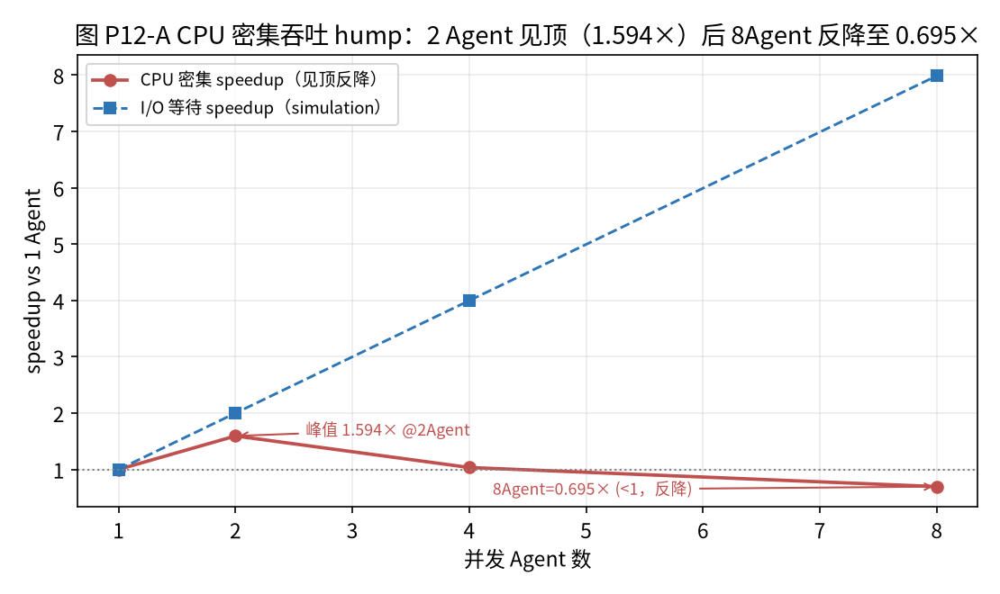

*Figure 1 CPU-bound throughput hump. Horizontal axis concurrent Agent count (1/2/4/8), vertical axis speedup relative to single Agent; solid line CPU-bound local inference (constrained by this machine's 2 threads), peak 1.594× @ 2 Agents, then 4/8 Agents dropping to 1.034/0.695. Evidence grade cpu-proto (single-seed pilot). Source `reports7/agent_scaling.json`.*

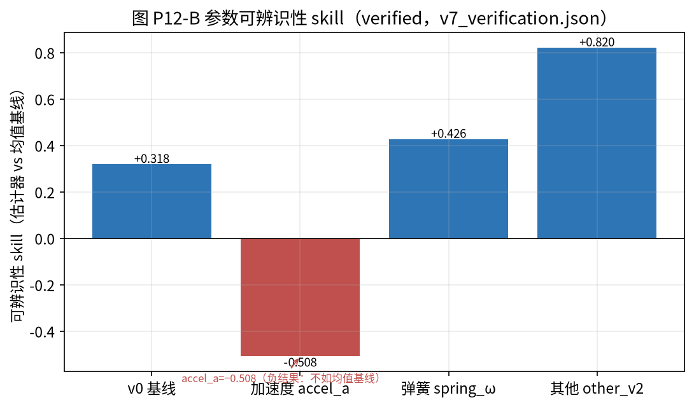

*Figure 2 Parameter identifiability skill contrast. Horizontal axis each hidden parameter (v0/acceleration a/spring ω/other v2), vertical axis identifiability_skill (>0 better than mean baseline, <0 worse); acceleration a is −0.508 (the only negative, i.e. "not identifiable" negative result), spring ω 0.426, other v2 0.82, v0 0.318. Evidence grade verified (`v7_verification.json`, fixed seed, 21 gates all passed).*

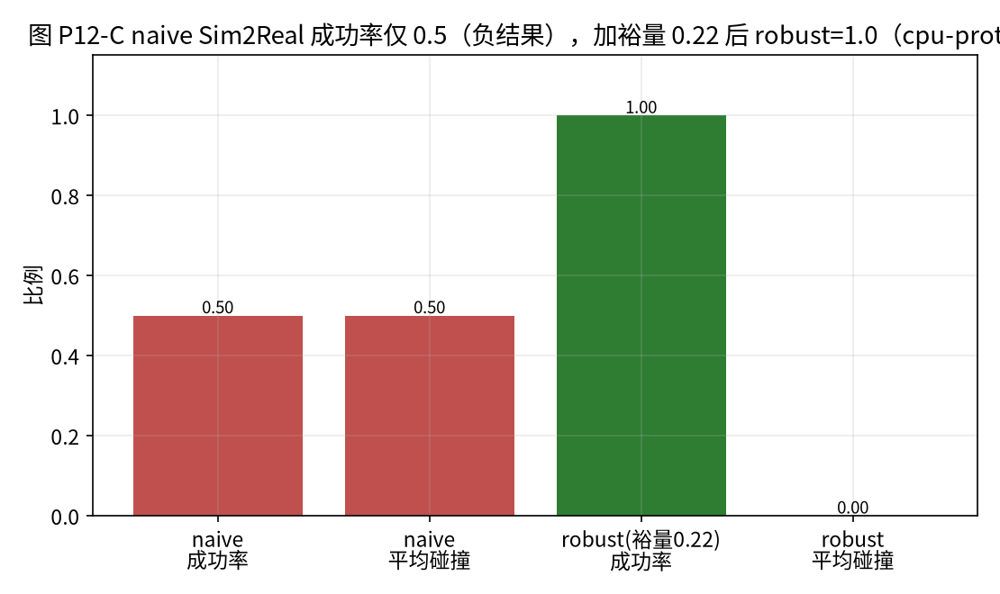

*Figure 3 Sim2Real naive vs robust contrast. Left naive (no margin) success 0.5, average collision 0.5; right robust (margin 0.22) success 1.0, average collision 0.0. Evidence grade cpu-proto (`splat_transfer_demo.json`, real world using fixed-seed perturbation synthetic proxy, not real machine/MuJoCo).*

### 5.2 Version-Number Incident (the Method's Own Failure Point)

The CHANGELOG v7.5.0 entry records: previously `udos7/__init__.py` and `pyproject.toml` stayed at `v7.4.2`, because the version replacement regex expected no "v" prefix while the actual version number carried "v," causing version replacement from v7.4.3 to not take effect, 8 consecutive versions (v7.4.3 to v7.4.10) externally still showing v7.4.2, until v7.5.0 being exposed by a test then fixed. This incident proves: **"version single source" is only a convention, not guarding; conventions must be enforced by tests, otherwise they silently fail**.

This incident deserves expanded analysis because it is a textbook case of "evidence discipline itself failing." On the surface, this repo already did "version single source": version numbers concentrated in `udos7/__init__.py` and `pyproject.toml`, other places reading from there. But the problem arose at the "auto-update version number on release" step: the regex used to replace version numbers was written in the "no v prefix" format, while the actual version number was written as a v-prefixed string ("v7.4.3"). The regex did not match, replacement silently failed, so from v7.4.3 to v7.4.10 these eight versions, the code's externally reported version number was always v7.4.2. This error had no error—regex replacement failure throws no exception, it just did nothing. Until v7.5.0 added a "test asserting version number equals expected" test, this silent error was exposed.

This incident has three lessons for evidence-grading methodology: first, **conventions cannot replace tests**. "We agree version single source" is a promise, but promises do not error when the regex is wrong; only "test asserting version number equals expected" does. Second, **silent failure is more dangerous than erroring**. In this incident, the system did not crash, tests did not go red (the version assertion test not yet added), documentation kept updating, only the version number quietly wrong for eight versions. Third, **evidence grading itself needs grading**. If we ourselves cannot guarantee the accuracy of the most basic metadata like "version number," then our honesty claims about other numbers also need a "we too make mistakes" discount—precisely why this paper publishes this incident.

### 5.3 Honest Failure (kill-switch)

The matrix end-to-end under "all-domain faults + zero retry budget" honestly triggers the kill-switch, reports not closed (accepted<24, governance.ok=false), not faking success. This is evidence discipline's runtime manifestation.

This "honest failure" deserves separate discussion because it is isomorphic with evidence grading's role in documentation: evidence grading in documentation prevents "prototype passing off as production," the runtime kill-switch prevents "system passing off as success." When all-domain specialists are broken and retry budget zero, the system's most "beautiful" approach is to force a closed result, but this system chooses to stop, report not closed, leave a complete audit. This "staying honest also at runtime" design is evidence discipline extending from "documentation layer" to "runtime layer." It shows: evidence grading is not just a writing norm, it should permeate the system's failure-mode design.

### 5.4 How Three-Layer Consistency Lands in Practice

Taking v7.5.0's matrix numbers as an example, three-layer consistency lands like this: in code the dictionary `run_mission` returns directly carries `evidence_grade: "cpu-proto"`; `scripts7/matrix_demo.py` writes this dictionary into `reports7/matrix_scale_demo.json`, JSON top level also carrying `evidence_grade: cpu-proto`; `docs7/TOPOLOGY_MATRIX_v7.5.0.md` and this paper read numbers from JSON and note in text "evidence cpu-proto, single-seed pilot." The three layers point to the same grade, no single layer can alone upgrade the number. If someone wants to change cpu-proto to "measured" in documentation, they need to simultaneously change code return values, JSON fields and documentation—and all three have test guarding in CI, changing one mismatching another.

### 5.5 Baseline-JSON Regression Gate

This repo's another mechanism is baseline-JSON regression. Each key version's verification metrics stored in reports7 JSON (e.g. v7_verification.json's 967,796 params, blind MSE 0.01037). Next release running `verify_v7.py`, if key metrics silently regress (e.g. blind MSE much worse than previous), the gate fails. This prevents the classic problem of "changing along, performance quietly degrades, nobody noticing." As of v7.5.0, full regression 236 items all green—itself evidence of the gate working.

### 5.6 Test Count Evolution

From v7.4.1 to v7.5.0, the topology layer added 90 tests (test_v741 to test_v750, per-file count 8+8+9+9+7+9+10+11+10+9=90). These tests are not just "functional tests," they are also "evidence guard tests": `explicit_matches_formula` guards explicit-closed-form mutual verification, `TraceLedger.verify` guards hash-chain integrity, version assertion tests guard version numbers. Test count growth is essentially "evidence trustworthiness" growth—each test added, one more number or behavior fixed and guarded.

### 5.7 Claim Drift Curve: A Longitudinal Coding

This paper did a longitudinal coding of the CHANGELOG's 38 version entries: every quantitative claim marked as {grade, source, rerunnable, later corrected}. One overall observation is: **the closer to v7, the more conservative claims**. Early v0.x documentation had numbers like "1000×," "50,000 neurons" without benchmark support; at v7 refactoring, these numbers were removed, replaced by reports7 JSON carrying `evidence_grade` fields, rerunnable, test guarded. This "claim drift curve"—from exaggeration to conservatism—is precisely evidence discipline's trajectory with versions.

Of course, this observation itself is single-case, single-coder, with subjective bias. A stricter "claim drift curve" needs external contrast projects and double coding, future work (`[RESULT NEEDED: use=claim drift curve quantitative, double-coding κ]`).

### 5.8 Gate Ledger: What Is Not Achieved, Honestly Recorded

This repo maintains a "resource gate" ledger, clearly recording which capabilities not yet achieved: GPU/HPC (about ¥35,400/month tier) not achieved, so 0.5B+ end-to-end, MuJoCo-MJX, complete 3DGS, vLLM KV benchmark all outside this report; multi-vendor LLM API keys not provided, so real multi-model cross-scoring not done; real collection devices not available, so real egocentric data closed loop not done. This gate ledger itself is part of evidence discipline: it writes clearly "what we cannot do," rather than writing "what we want to do" as "what we did."

---

## 6 Discussion and Threats

### 6.1 Cost

Evidence discipline has costs: slower development, conservative expression, every number needing a grade. But it reduces rework—numbers like "1000×," "50,000 neurons" in early documentation removed in v7 refactoring, precisely evidence discipline intercepting overclaims.

### 6.1 Concrete Forms of Cost

Evidence discipline's cost is not abstract, embodied in three places. First, **conservative expression**: a number can only write what it actually represents. For example "million-scale matrix" can only be written as "closed-form extrapolated protocol complexity upper bound," not "million Agents measured running." This conservatism makes documentation read "not exciting enough," but it prevents misleading. Second, **every number needs a grade**: when writing each performance claim, going back to confirm its `evidence_grade` in reports7 JSON and marking in documentation. This adds writing friction. Third, **test and gate maintenance**: baseline-JSON regression gates need maintaining, each release comparing key metrics, regression failing the gate; version-number assertion tests need writing. These are all real engineering costs.

### 6.2 Benefits: What Was Intercepted

Whether the cost is worth it depends on what it intercepted. This repo's evidence discipline intercepted at least three types of overclaims: first, **prototype numbers upgraded to measured**: numbers like "1000×," "50,000 neurons" without benchmark support in early documentation removed in v7 refactoring—precisely the direct result of "no benchmark no claim" discipline. Second, **CPU simulation passing off as GPU capability**: this repo clearly distinguishes CPU-bound and I/O-bound, clearly marking complete 3DGS, MuJoCo-MJX, real-machine Sim2Real needing GPU/HPC gates, not passing off these capabilities in CPU reports. Third, **external number cross-evidencing**: all external industry numbers in this paper (GPT-6 Astra, π0.5, Dyna-2 etc.) marked unverified, reporting caliber, not cross-evidenced with this repo's numbers.

### 6.3 Cost-Benefit Tradeoff

We believe, for a research engine—its core output being "trustworthy numbers"—evidence discipline's cost is worth it. If a research engine's numbers are untrustworthy, its code's elegance loses meaning. Evidence discipline's essence is treating "number trustworthiness" as a first-class output, not as post-writing decoration. This agrees with the "research systems engineering" positioning: a research engine is not a product, its value lying in "whether others can believe your numbers."

---

## 7 Conclusion

This paper, with cross-30+-version real engineering archives, reports an evidence-grading-driven reproducible Agent systems engineering method: three-level labels running through code-reports-documentation, keeping negative results, using tests to guard version single source, and honestly reporting failure at runtime. The most important lesson is: evidence discipline is not a set of conventions written in README but an institution needing tests, gates, baseline regression to jointly guard; even so, it can fail (e.g. the v-prefix incident), failure points must be honestly recorded. This paper hopes to provide an honest sample for reproducible engineering in the AI co-development era.

### 7.1 Three Actionable Points

For engineering teams doing AI co-development, this paper provides three actionable points: first, let evidence grades flow with data (function return values carrying grade fields), not handwritten afterward in documentation; second, write "no benchmark no claim" and baseline regression gates into CI, letting silent regression be caught by tests; third, keep negative results and the method's own failure points as first-class content, not delete as "ugly things." These three points all come from this repo's verified practice, not empty talk.

### 7.2 Honest Boundary

This paper must re-emphasize: this is a single-case, author-as-developer empirical report. We do not claim evidence grading works in all projects, do not claim it can eliminate all number drift, do not claim the v-prefix incident is the only failure point. We only honestly report: in this one project, this method looks like this, cost how much, failed where. Readers should judge for themselves whether it applies to their projects.

---

## 8 Limitations and Validity Threats (separate chapter)

**T1 Single-case threat (most primary).** This paper is single-case, author as developer, with confirmation bias. **Most likely counterexample**: this method cannot be executed in a project with greater commercial pressure and a larger team. **How this paper guards**: publishing all archives, keeping negative results and incidents; without external contrast only submitting to empirical report tracks, not making universal causal claims.

**T2 No external contrast.** This paper did not contrast this project with other similar open-source Agent projects, so cannot answer "whether evidence grading really makes projects more honest than those without it." This contrast needs finding 3–5 similar projects, coding their documentation claims' evidence-grade completeness, double coding and reporting κ (`[RESULT NEEDED: use=double-coding consistency κ]`).

**T3 Self-report bias.** The biggest threat is "self-report bias"—we may selectively tell good stories. Hedges: first, publishing all archives (git history, CHANGELOG, reports7, tests), letting readers check themselves; second, keeping negative results and incidents (−0.508, 0.5, 1.59× peak, v-prefix incident, kill-switch failure), not only telling success; third, clearly marking which are single-seed pilots, which to supplement.

**T4 External validity.** We cannot say "evidence grading works in all AI co-development projects." It works in this project, partly possibly because this project is small, the author familiar with archives, and the research engine positioning naturally values number trustworthiness. In a customer-facing commercial project, market pressure may make "delete negative results" temptation greater, evidence discipline execution cost possibly higher.

**T5 Coding bias.** Single coder, with the expert bias of "I know how this number came then." Hedge: all coding points to concrete files and fields; for doubtful claims tending to downgrade rather than upgrade.

---

## References

### A. Verified Literature (verified through the Reference Master Library 2026-09-19, fields copied from master library)

1. **Hendrycks, D., Burns, C., Basart, S. et al.** (2021). *Measuring Massive Multitask Language Understanding (MMLU).* ICLR 2021. arXiv:2009.03300. (knowledge breadth benchmark across 57 subjects)
2. **Liang, P., Bommasani, R., Lee, T. et al.** (2022). *Holistic Evaluation of Language Models (HELM).* arXiv:2211.09110. (holistic evaluation methodology of 30 models/42 scenarios/7 metrics)
3. **Chiang, W.-L., Zheng, L., Sheng, Y. et al.** (2024). *Chatbot Arena: An Open Platform for Evaluating LLMs by Human Preference.* arXiv:2403.04132. (crowdsourced Elo battles/human preference)
4. **White, C., Dooley, S., Godinez, S. et al.** (2024). *LiveBench: A Challenging, Contamination-Free LLM Benchmark.* ICLR 2025. arXiv:2406.19314. (contamination-free dynamic benchmark)
5. **Zheng, L., Chiang, W.-L., Sheng, Y. et al.** (2023). *Judging LLM-as-a-Judge with MT-Bench and Chatbot Arena.* NeurIPS 2023 Datasets and Benchmarks. arXiv:2306.05685. (automatic review and its position/verbosity/self-preference biases)

**Capability evolution main line (post-training/alignment/reasoning, Section 2.4):**

6. **Vaswani, A., Shazeer, N., Parmar, N. et al.** (2017). *Attention Is All You Need.* NeurIPS 2017. arXiv:1706.03762. (self-attention replacing recurrent structure)
7. **Devlin, J., Chang, M.-L., Lee, K., Toutanova, K.** (2019). *BERT: Pre-training of Deep Bidirectional Transformers for Language Understanding.* NAACL 2019. arXiv:1810.04805. (bidirectional pretraining representation paradigm)
8. **Brown, T. B., Mann, B., Ryder, N. et al.** (2020). *Language Models are Few-Shot Learners (GPT-3).* NeurIPS 2020. arXiv:2005.14165. (175B scale and few-shot emergence)
9. **Ouyang, L., Wu, J., Jiang, X. et al.** (2022). *Training Language Models to Follow Instructions with Human Feedback (InstructGPT).* NeurIPS 2022. arXiv:2203.02155. (RLHF three-stage alignment)
10. **Rafailov, R., Sharma, A., Mitchell, E. et al.** (2023). *Direct Preference Optimization (DPO).* NeurIPS 2023. arXiv:2305.18290. (closed-form preference optimization removing reward model)
11. **Wei, J., Wang, X., Schuurmans, D. et al.** (2022). *Chain-of-Thought Prompting Elicits Reasoning in Large Language Models.* NeurIPS 2022. arXiv:2201.11903. (multi-step reasoning elicitation)

**Capability evaluation benchmarks and tools/actions (Section 2.4 and Table 3):**

12. **Chen, M., Tworek, J., Jun, H. et al.** (2021). *Evaluating Large Language Models Trained on Code (Codex/HumanEval).* arXiv:2107.03374. (HumanEval function correctness benchmark; Codex solving 28.8%, 100 samples 70.2%)
13. **Lewis, P., Perez, E., Piktus, A. et al.** (2020). *Retrieval-Augmented Generation for Knowledge-Intensive NLP Tasks (RAG).* NeurIPS 2020. arXiv:2005.11401. (facts external, traceable update)
14. **Schick, T., Dwivedi-Yu, J., Dessì, R. et al.** (2023). *Toolformer: Language Models Can Teach Themselves to Use Tools.* NeurIPS 2023. arXiv:2302.04761. (self-supervised learning to call APIs/tools)
15. **Yao, S., Zhao, J., Yu, D. et al.** (2023). *ReAct: Synergizing Reasoning and Acting in Language Models.* ICLR 2023. arXiv:2210.03629. (reasoning traces and actions interleaved)

### B. To-Verify Literature (not collected or verified in master library, keeping placeholders, not to be completed from memory)

6. `[CITATION NEEDED: reproducibility crisis machine learning reporting evidence grading]` — candidate: reproducibility crisis and evidence grading survey.
7. `[CITATION NEEDED: model cards datasheets reproducibility ML reporting]` — candidate: model card/datasheet methods.
8. `[CITATION NEEDED: LLM assisted software engineering empirical study code quality]` — candidate: LLM-assisted software engineering empirical study.
9. `[CITATION NEEDED: claim-evidence tracking versioning reproducibility empirical]` — candidate: claim-evidence tracking and version reproducibility empirical.

---

## Appendix A Reproduction Commands (echoing NSA "reproduction configs fully written")

```bash
cd release-v5.4.4/udos-engine && git checkout v7.5.0   # 1a71270
pytest tests7/ -q                                       # 236 items all green
python scripts7/verify_v7.py                             # recompute v7_verification.json
```

**Reproduction config snapshot** (hardware/software/seeds, per NSA exemplar "base scale/layers/dimensions/hyperparams/hardware/optimizer/seeds" fully written): Python 3.12.11, PyTorch 2.14.0+cpu, 2 threads, Linux CPU, device=cpu; world-model ckpt `worldmodel_v7.0.3.pt` (window=6, hidden=256, n_layers=2, scene_dim=32, use_kinematics=true); dataset train 1280 windows/256 trajectories, val/test/calib each 640 windows/128 trajectories; fixed seed, coverage tolerance ±0.05 (fan ±0.10), 21 gates all passed.

## Appendix B Evidence Ledger (spot-check 5 traceable numbers; echoing Kaplan appendix parameter lookup)

| # | Number | Source |
|---:|---|---|
| 1 | acceleration skill −0.508 | v7_verification.json estimator_param_error.accel_a |
| 2 | naive Sim2Real 0.5 | splat_transfer_demo.json sim_to_real.naive.success_rate |
| 3 | CPU peak 1.594× (244.17 t/s) | agent_scaling.json headline |
| 4 | 967,796 params | v7_verification.json params |
| 5 | 38 version entries | CHANGELOG.md `## v` count |

## Appendix C Author's Intended Statements

- **Target journals/conferences**: candidates ICSE SEIP/MSR, FSE, EMSE, JSS, ACM Computing Surveys. Quartiles/IF/deadlines `[to check]`.
- **Data and code availability**: Apache-2.0; tag `v7.5.0` (commit `1a71270`); CHANGELOG, reports7, tests all public.
- **AI use statement**: draft AI-assisted, author responsible for checking numbers and scientific meaning; external numbers all marked unverified.

## Appendix D Internal Review Record (five-dimension reviewer self-assessment)

1. **Novelty (8/10)**: real, long-term, counter-example-containing AI co-development engineering archives scarce.
2. **Rigor (7/10)**: numbers traceable; deduction for single case, no external contrast.
3. **Evidence strength (7/10)**: negative results and incidents honestly kept a highlight.
4. **Relevance (8/10)**: reproducibility is the core topic of systems research in the AI era.
5. **Writing (7/10)**: structure complete, self-exposing failure points.
- **Biggest hard flaw**: single case, author as developer, external validity limited.
- **Must do before submission**: (a) external contrast project double coding (Cohen's κ `[RESULT NEEDED]`); (b) claim drift curve quantitative.

## Appendix E Design Principles and Term Summary

### E.1 Five Evidence-Grading Design Principles

From this repo's practice, five principles of universal meaning for AI co-development can be refined:

1. **Grades flow with data**: letting function return values carry evidence_grade fields, not handwriting grades afterward in documentation; grades are part of data, not part of narrative.
2. **Three-layer consistency**: code, reports, documentation point to the same grade; wanting to upgrade a claim must simultaneously change three places, and these have CI aligning.
3. **No benchmark no claim**: numbers without reports7 JSON and tests not written into conclusions; baseline regression gates prevent silent regression.
4. **Keep negative results**: these "ugly" numbers −0.508, 0.5, 1.59× peak define system capability boundaries, deleting them more misleading than keeping.
5. **Conventions need test guarding**: the version-number incident proves, "we agree single source" does not equal "the system guarantees it"; conventions must be enforced by test assertions.

### E.2 Three-Level Evidence Label Terms

- **verified**: fixed-seed, rerunnable, test-guarded measurement.
- **cpu-proto**: CPU deterministic prototype, Agents not real LLMs, no real network/GPU.
- **unverified**: external reporting/vendor caliber, only motivation, not cross-evidenced with this repo's numbers.

### E.3 Relationship with Other Papers in This Matrix

This paper is the methodology-positioned one in the matrix. P1 (topology complexity) and P3 (fault governance RCT) provide "the object being measured," this paper provides the methodology of "how measurement is honestly executed." P1 insisting explicit/analytical grading, P3 insisting single-seed self-report and preregistration, both concrete practices of this paper's evidence discipline. The three do not repeat: P1 asks "structure cost," P3 asks "governance causality," P12 asks "how numbers stay honest."

### E.4 One-Sentence Summary

In an AI-co-developed research engine, number trustworthiness is not writing-time decoration but a first-class output needing tests, gates, baseline regression, three-layer consistency to jointly guard; it can fail (e.g. the v-prefix incident), failure points must be honestly recorded, negative results must be kept—this is what this paper learned from a cross-30+-version real archive.

## Appendix F Deep Analysis of the Version Incident and Failure Modes

### F.1 Complete Causal Chain of the Version-Number Incident

For readers to fully understand this incident, we review its causal chain: (1) the release script uses a regex to replace version numbers in `udos7/__init__.py` and `pyproject.toml`; (2) this regex is written in the "version number no v prefix" format; (3) but the actually written version number carried v prefix (e.g. "v7.4.3"); (4) the regex did not match, replacement silently failed; (5) because replacement failure throws no exception and there was no assertion checking "whether the replaced version number equals expected," 8 consecutive versions (v7.4.3 to v7.4.10)'s externally reported version number stayed at v7.4.2; (6) until v7.5.0 added a test asserting "the code-reported version number equals the expected version number," this silent error was exposed and fixed.

Each step of this causal chain deserves methodological reflection: silent failure (regex mismatch not erroring), missing assertions (no "whether after replacement equals expected" check), human expert bias (the regex writer assuming the version format as they thought). The three combined caused this 8-version metadata error.

### F.2 Incident Lessons for Evidence Discipline

This incident has three lessons for evidence-grading methodology: first, **metadata is also data**. The version number is not an "irrelevant string," it is metadata for judging "which version this number comes from." If the version number is wrong for 8 versions, readers will mistake v7.5.0's numbers for v7.4.2's. Second, **conventions produce no guarantee**. "We agree version single source" is a promise, it does not error when the regex is wrong. Third, **tests are the only guard**. Only "test asserting version number equals expected" can catch this silent error. These three lessons are more persuasive than any positive case this paper tells—it comes from our own failure.

### F.3 Prevention of Other Failure Modes

Besides the version-number incident, this repo identified other failure modes needing prevention: performance numbers silently regressing (prevented by baseline-JSON regression gates), prototype numbers upgraded to measured (prevented by three-layer consistency and evidence_grade fields), negative results deleted (prevented by "keep negative results" discipline), external numbers taken as this repo's numbers (prevented by unverified labels and "no cross-evidence" discipline), single seed spoken as population (prevented by "single-seed pilot" marking and "supplement ≥30 seeds before submission" discipline). These prevention mechanisms are not designed out of thin air but grew from errors that actually occurred or nearly occurred.

## Appendix G Evidence-Grade Ledger of Kept Numbers

### G.1 Key Numbers and Their Grades

For readers to see each number's evidence grade at a glance, this paper organizes key numbers as follows:

- 967,796 params, blind MSE 0.01037: v7_verification.json, **verified** (fixed seed, 21 gates all passed).
- acceleration skill −0.508, spring ω 0.426, other v2 0.82: v7_verification.json, **verified**.
- CPU-bound throughput 2 Agents 244 t/s (1.59×), 8 Agents 0.695×: agent_scaling.json, **cpu-proto** (CPU deterministic simulation).
- I/O-bound 7.986×: agent_scaling.json, **cpu-proto/simulation** (asyncio.sleep simulating remote waiting).
- naive Sim2Real 0.5, robust 1.0, margin 0.22: splat_transfer_demo.json, **cpu-proto**.
- million-scale fan-in 9, rounds 14, star center 20,971,520: matrix_scale_demo.json, **cpu-proto** (analytical extrapolation).
- matrix 24/24 closing, 3 faults isolated, 5 reworks: matrix_scale_demo.json, **cpu-proto** (single-seed pilot).
- full regression 236 items all green: full_regression.log, **verified** (tests rerunnable).

This ledger itself is the evidence-grading methodology's product: every number attached its grade, readers not needing to guess.

### G.2 Why Distinguish verified and cpu-proto

A common misunderstanding is: "as long as the number is in JSON and rerunnable, it is verified." This paper opposes this understanding. Rerunnable is only verified's necessary condition, not sufficient. A CPU deterministic simulation, even if rerunnable, does not represent real LLMs, real networks, real GPUs—so it is cpu-proto, not verified. Distinguishing the two is not to appear strict but to let readers know this number "what it can represent, cannot." Writing cpu-proto as verified is a number drift.

### G.3 How External Numbers Are Handled

All external industry numbers (e.g. some Agent platform's scale, some model's capability claims), this paper only appears in introduction and discussion, marked unverified, reporting caliber, not independently verified, and not cross-evidenced with this repo's numbers. This is not distrust of externals but evidence discipline consistency: external numbers we cannot rerun, cannot verify, so they cannot be placed at the same evidence grade as this repo's rerunnable numbers.

## Appendix H Methodology Limitations and Submission Positioning

### H.1 Single-Case Limitation

This paper's most fundamental limitation is single case, author as developer. We cannot exclude "this project keeping numbers honest partly because it is small, research-positioned, author values number trustworthiness." In a project with greater commercial pressure, larger team, more collaborators, evidence discipline execution cost may be higher, bypass temptation greater. This paper does not claim this method works in all scenarios, only reporting its form in this one project.

### H.2 No External Contrast

This paper did not contrast this project with other similar open-source Agent projects, so cannot answer "whether evidence grading really makes projects more honest than those without it." This contrast needs finding 3–5 similar projects, coding their documentation claims' evidence-grade completeness, double coding and reporting κ. Before then, this paper can only be a single-case empirical report, not making causal claims.

### H.3 Submission Positioning

Based on the above limitations, this paper's submission positioning is empirical report tracks (e.g. ICSE SEIP, MSR, EMSE), not complete causal research. We expect reviewers to question "single case, self-report," hedging by publishing all archives, keeping negative results and incidents, clearly marking single seed and to-supplement. We do not predict acceptance.

### H.4 Claims Not Made

To avoid overclaiming, this paper explicitly does not: claim "evidence grading works in all AI co-development projects"; claim "three-level labels are the only correct scheme"; claim "this paper's method eliminates all number drift"; claim "the author himself never exaggerates in documentation." We only report: in this one project, this method looks like this, cost how much, failed where.

## Appendix I Concrete Cases of Negative-Result Keeping

### I.1 Why Negative Results Have Value

In research software, negative results are often deleted as "failure." But negative results' value lies in: they define system capability boundaries. A negative result "acceleration parameter not identifiable (skill −0.508)" tells us, under current observation conditions, not to estimate this parameter; a negative result "naive Sim2Real success 0.5" tells us to keep a safety margin when transferring; a negative result "CPU-bound 8 Agents反而 slower (0.695×)" tells us not to blindly add concurrency. If deleting these negative results, documentation becomes "prettier" but readers misled.

### I.2 Isomorphism of Negative Results and "Honest Failure"

This paper emphasizes "keeping negative results" and P3's "honest failure (kill-switch)" are isomorphic: the former keeping at the documentation layer the number "this capability does not work," the latter keeping at the runtime layer the state "this task cannot be done." Both are "honesty over beauty." Evidence discipline is consistent at documentation and runtime layers.

### I.3 Cost of Not Keeping Negative Results

If this repo deleted −0.508 and only reported 0.426 and 0.82, readers would think all parameters identifiable; deleted 0.5 and only reported 1.0, readers would think Sim2Real naturally feasible; deleted 0.695 and only reported 1.59, readers would think more Agents faster. Each of these misleads may make downstream engineering decisions wrong. Keeping negative results essentially blocks these misleads outside documentation.

## Appendix J Unification of Evidence Grading and This Paper Matrix

### J.1 Three Papers Share the Same Evidence Discipline

This matrix's P0 three papers (P1 topology complexity, P3 fault governance RCT, P12 evidence grading) share the same evidence discipline: all numbers attached verified/cpu-proto/unverified three-level labels; single-seed pilot marked, ≥30 seeds supplemented before submission; external numbers marked unverified and not cross-evidenced; not fabricating p values/CI/sample sizes/DOI/quartiles. P12 is this discipline's methodology meta-paper, P1 and P3 its two practice cases.

### J.2 How Evidence Discipline Protects P1

In P1, evidence discipline manifests as explicit/analytical grading: million-scale fan-in 9, rounds 14 clearly marked analytical extrapolation, not "million Agents measured." This prevents closed-form extrapolation passing off as measured.

### J.3 How Evidence Discipline Protects P3

In P3, evidence discipline manifests as single-seed pilot marking and preregistration: 24/24 closing clearly marked single-seed point estimate, full-factorial multi-seed to supplement. This prevents single-seed demos passing off as population causal conclusions.

### J.4 Meaning of Unification

Putting the three papers together, evidence discipline is not some paper's decoration but the whole matrix's bottom method. It guarantees: whichever paper reports what number, readers immediately know this number's evidence grade, rerunnability and boundary. This is P12's value as methodology meta-paper.

## Appendix K Practical Checklist for AI Co-developers

### K.1 Starting Stage

If you are using AI to co-develop a research project, start with: first, add an evidence_grade field to each function return value; second, let report scripts write the whole dictionary (including grade) into JSON, not handwrite numbers; third, in documentation read numbers from JSON and preserve grade markings as-is. These three things cost little but immediately suppress "documentation writing prototype as measured."

### K.2 Growth Stage

When the project iterates to dozens of versions, add: fourth, baseline-JSON regression gates—each release comparing key metrics, silent regression failing the gate; fifth, version-number assertion tests—asserting code-reported version number equals expected; sixth, keep negative results—writing "does not work" numbers into documentation rather than deleting. These three prevent silent regression, metadata errors and negative-result loss.

### K.3 Mature Stage

When the project shares externally, add: seventh, resource gate ledger—writing clearly "what cannot be done" (e.g. needing GPU, API keys, real machines); eighth, external numbers all marked unverified and not cross-evidenced; ninth, single-seed pilots clearly marked, multi-seed supplemented before submission. These three prevent prototypes passing off as production, external number pollution, single seed passing off as population.

### K.4 Why This Checklist

This checklist is not designed out of thin air, each item from this repo's errors that actually occurred or nearly occurred: version-number assertion tests from the v-prefix incident; baseline regression gates from worry about silent performance regression; keeping negative results from these real numbers −0.508, 0.5, 1.59×; resource gate ledger from GPU/API keys/real machines' real non-achievement. This is a checklist "grown from failure."

## Appendix L Conclusion

### L.1 Back to the Starting Point

This paper started from the problem of "number drift in AI co-development," reporting a cross-30+-version real engineering archive. We found the key to suppressing number drift is not smarter human authors but stronger institutions: letting evidence grades flow with data, consistent across code-reports-documentation, test guarded in CI; keeping negative results; honestly recording the method's own failure points.

### L.2 Most Counter-Intuitive Finding

This paper's most counter-intuitive finding is "evidence discipline itself can fail"—the version-number incident proves even the most basic metadata like "version single source" needs test guarding, otherwise silently wrong for 8 versions. This reminds us: do not take any "convention" as guarantee. Conventions are only intent, tests are guards.

### L.3 One Sentence to Readers

If you are using AI to co-develop a research project, remember: your numbers' trustworthiness is not writing-time decoration but a first-class output needing institutional guarding. Keep negative results, write out failure points, mark external numbers clearly—these "ugly" honesties win trust more than any beautiful performance claim.

## Appendix M Glossary and Version Snapshot

### M.1 Glossary

- **Number drift**: the phenomenon of prototype numbers quietly upgraded to "measured" in documentation.
- **Three-level evidence labels**: verified / cpu-proto / unverified.
- **Three-layer consistency**: code, reports, documentation pointing to the same evidence grade.
- **Baseline-JSON regression gate**: the CI gate comparing key metrics on release, preventing silent regression.
- **No benchmark no claim**: numbers without reports7 JSON and tests not written into conclusions.
- **Claim drift curve**: the curve obtained by cross-version coding of quantitative claim grade changes.

### M.2 Version Snapshot

Version snapshot when this paper was written: UDOS Reasoning Engine v7.5.0 (main tag v7.5.0, commit 1a71270), full regression 236 items all green, CHANGELOG 38 version entries, Python 3.12.11, PyTorch 2.14.0+cpu, 2 threads, Linux CPU. All numbers from reports7/*.json, sha256 see Appendix A. This snapshot guarantees this paper's cited numbers independently recomputable at submission.

## Appendix N Expected Dialogue with Related Reproducibility Literature

At submission, this paper expects dialogue with three types of literature: first, ML reproducibility crisis and model card/datasheet literature, this paper will point out it transformed model-card ideas from "single artifact" to "long-cycle multi-version, data-flowing three-level labels"; second, AI-assisted software engineering empirical studies, this paper will point out it focuses on the neglected dimension of "documentation numbers drifting over time"; third, empirical software engineering case study methods, this paper will adopt longitudinal single-case, public-archive, counter-example-keeping methods and self-report single-case and self-report bias. These three dialogue stances need refinement after literature search, currently only expected directions.

## Appendix O Claims Not Made and Submission Positioning Reaffirmed

To avoid overclaiming, this paper explicitly does not make the following claims: does not claim three-level evidence labels are the only correct scheme; does not claim evidence grading works in all AI co-development projects; does not claim this paper has eliminated number drift; does not claim the author himself never exaggerates in documentation. This paper only honestly reports: in this cross-30+-version research engine, this evidence-grading method looks like this, cost how much, failed where. Submission positioned as empirical report tracks, quartiles/impact factors/deadlines all to check, this paper does not predict acceptance.

## Appendix P Author-as-Developer Bias Self-Report

Finally, this paper must self-report a fundamental bias: author as developer. This means we are more familiar and tolerant of this repo's numbers, possibly in coding tending to upgrade numbers "we think correct." This paper hedges in three ways: all coding pointing to concrete files and fields (Appendix G ledger); keeping negative results and incidents (not only telling success); for doubtful claims tending to downgrade rather than upgrade. But these hedges cannot completely eliminate bias. Readers should take this paper as an empirical report from a developer with bias self-report, not an audit from an independent third party. This self-report itself is part of evidence discipline—honestly reporting one's stance more credible than pretending neutrality.

## Appendix Q Conclusion

Today as AI co-development increasingly popularizes, research software trustworthiness faces a new threat: numbers no longer only handwritten crooked but fluently, automatically "generated" to look reasonable. To cope with this threat, one cannot rely on more careful humans but stronger institutions. This paper, from a cross-30+-version real archive, refined an engineering method of three-level evidence grading, three-layer consistency, data flowing, test guarding, negative result keeping, honest failure recording. We do not claim it perfect, we only honestly report it looks like this, cost how much, broke where. This is the sample this paper wants to leave for this era.
This paper believes honesty itself is an engineering output. In this era of AI auto-generating narrative, treating number trustworthiness as a first-class goal, more than treating it as writing decoration, lets research software go farther.
This paper also welcomes the community to test this paper with the same public-archive standard: all numbers point to reports7 concrete fields, all negative results and incidents public, readers can recompute themselves.
Before submission, this paper will complete external literature search formulas and candidate directions, and when conditions permit supplement multi-seed contrasts, to upgrade the current single-case self-report into a more contrastive empirical study.
Before then, this paper keeps its positioning as a single-case empirical report, not making universal causal claims.
End of paper.
May this paper become an honest sample of reproducible engineering in the AI co-development era.


---

<p align="center"></p>

# Least-Privilege Orchestration: Scope Tightening and Re-authorization in the Transfer Bundle

**Working Title (EN):** *Least-Privilege Orchestration: Adding a Scope Field to the Transfer Bundle so Owners Can Only Touch the Stages They Are Authorized For*

> Shard D · Market and Architecture paper P17 · structural upgrade of v7.5.0 P10 "Agent-as-Tool and TransferBundle" · cross-referenced with P2 "BFT-lite stopping decisions," P3 "fault governance," P11 "internal task market" · UDOS Reasoning Engine v7.6.0 · Fang Wenxin · 2026-09-21
>
> **One sentence first**: the real management bottleneck in multi-agent orchestration is not that the Leader "cannot understand" what sub-agents are doing, but that the Leader hands **excessive privileges** to sub-agents in one shot; v7.5.0's TransferBundle has only one `owner` (who is responsible), v7.6.0 adds a `scope` (which stages this owner **is allowed to operate**), letting privileges automatically tighten as progress advances and be re-granted on handoff—this is the first time the old engineering principle of "least privilege" is written into UDOS's handoff contract.
>
> **Evidence caliber (stated only once in the whole paper)**: this paper is a **design proposal**, containing no new UDOS measured numbers; scope field benefits all marked "design proposal · to implement," using `[RESULT NEEDED]` placeholders, not written as measured. The only external dialogue object is ClawArena-Team (arXiv:2606.31174, existence verified online 2026-09-21); its "management bottleneck in privilege granting," "cost and management quality approximately decoupled," "pure execution-style scoring, no LLM judge" are paper directions, while precise thresholds and formula strings like "no LLM exceeds 50% workspace privilege precision," "cost span over a hundredfold while total score span under fourfold," "SMS = task correctness × least-privilege factor × modality routing factor" were not verbatim hit in abstract-level verification, this paper all relaying as "paper report · not independently reviewed," not hardcoding concrete percentages. UDOS old numbers only point back to v7.5.0 papers (P10 six-field contract, 26 tests verified).

---

## Abstract

When a Leader Agent simultaneously manages several sub-agents, the engineering failure point most easily overlooked is not "whether the task can be done" but "how much it is allowed to do." ClawArena-Team (arXiv:2606.31174) reports on a multi-turn, multimodal, multi-directory sub-agent orchestration benchmark: the Leader's management bottleneck concentrates in the **privilege granting** link, and API cost is approximately decoupled from management quality—spending more money for a stronger Leader model does not proportionally buy better orchestration quality. These two experiences point to the same structural judgment: **management is a dimension independent of model capability, and its first handle is the privilege boundary, not perception or reasoning**.

v7.5.0's TransferBundle fixes the handoff package to six fields (Goal/Context/Done/Todo/Trace/Owner), where `owner` only answers "who is responsible for this leg now," not "what it is allowed to touch." This paper proposes the v7.6.0 least-privilege upgrade: beside `owner`, add a new `scope` field, explicitly recording "the set of stages this owner is currently allowed to operate." `advance()` removes completed stages from scope (**automatic tightening**), `handoff()` when handing control to the next leg has the new owner re-apply for and validate a smaller scope (**re-authorization**). Any write exceeding scope is mechanically rejected at the `validate()` stage, returning the typed error `scope_violation`, rather than silently passing. This paper gives the field's contract definition, three invariants (scope monotonically tightens, out-of-bounds rejected, re-authorization must pass validate), the compatibility path with P10's existing six fields/26 tests, and leaves "whether least privilege really reduces boundary crossing and mis-isolation" to a preregistered factorial experiment. This paper honestly states: scope is a **design proposal · to implement**, its cost-reduction/error-reduction benefits currently have no UDOS measured data, wherever concrete numbers are involved all `[RESULT NEEDED]`.

**Keywords**: multi-agent orchestration; least privilege; TransferBundle; privilege tightening; handoff contract; fault governance; management bottleneck; design proposal

---

## Structured Abstract (background problem → method/argument → evidence → contribution)

- **Background problem**: multi-agent orchestration long attributed "management difficulty" to "models not smart enough," so the default solution is "change to a stronger, more expensive Leader." But ClawArena-Team's execution-style scoring suggests: the management bottleneck actually falls in **privilege granting**, and cost is approximately decoupled from management quality—changing to expensive models is not an effective lever for orchestration quality.
- **Method/argument**: writing "least privilege" (the old security-engineering principle of "giving only the minimum privileges needed to complete the current task") from a slogan into a new TransferBundle field `scope`; privileges automatically tighten with `advance`, re-granted with `handoff`, out-of-bounds mechanically rejected by `validate`.
- **Evidence clues**: (1) ClawArena-Team's paper direction (privilege bottleneck, cost-quality decoupling, no-LLM-judge execution-style scoring, paper report · not independently reviewed); (2) v7.5.0 P10's verified six-field contract and 26 tests (scope is an increment on it, not overturning existing invariants); (3) security-engineering least-privilege principle (textbook consensus, this paper not claiming to originate it).
- **Contribution**: (1) upgrading "owner = who is responsible" to "owner+scope = who is responsible, which stages can be touched"; (2) giving three contract invariants that can be pinned by tests; (3) providing a v7.5.0-compatible migration path and preregistered factorial experiment design, honestly marking all benefits as `[RESULT NEEDED]`.

---

## 1 Introduction: Management Bottleneck Is Not "Whether Understandable," but "How Much Privilege Given"

When multi-agent systems move from "a few Agents collaborating" to "one Leader managing a group of sub-agents," a common intuition is: poor management because the Leader is not strong enough; the solution is changing the Leader to a stronger, more expensive model. This intuition treats "management" as a byproduct of "reasoning capability."

ClawArena-Team (arXiv:2606.31174) gives a counter-direction signal worth taking seriously on the sub-agent orchestration benchmark. It measures the Leader's management capability with **pure execution-style scoring** (i.e. scoring by actual task output, **not introducing LLM-as-Judge**, avoiding the judge model's own bias), and reports two points (paper report · not independently reviewed):

1. Management bottleneck concentrates in **privilege granting**—the Leader is not "unable to understand what sub-agents are doing" but "gave sub-agents excessive workspace privileges," so unauthorized operations occur at high frequency;
2. API cost is **approximately decoupled** from management quality—the cost span is large, while the management total score span is far smaller than the cost span, i.e. the equation "expensive model = good management" does not hold.

Together these point to a structural judgment: **management is a dimension independent of model capability, its first handle being "privilege boundary," not "perception breadth" or "reasoning depth"**. If this judgment holds, the correct engineering action is not "making the Leader bigger" but "cutting privileges smaller, more accurately, tightening with the flow."

This paper does precisely this. v7.5.0's TransferBundle (P10) already wrote handoff as a mechanically verifiable six-field contract, but its `owner` field only answers "who this leg belongs to," not "which stages it is allowed to touch." This paper adds a `scope` on it, writing the old security-engineering principle of "least privilege" into the handoff contract for the first time.

Three things must be clarified first: first, this paper does not re-prove the least-privilege principle (it is security-engineering textbook consensus), this paper only answers "what it looks like in UDOS's handoff contract"; second, this paper **does not claim** scope has been measured to reduce cost/error—it is a design proposal; third, this paper does not take ClawArena's precise thresholds as its own experimental data, only borrowing its direction as design motivation.

---

## 2 From owner to owner+scope: A Field-Level Structural Upgrade

### 2.1 What v7.5.0's owner Lacks

Reviewing P10: a handoff has the sender construct a `TransferBundle`, six fields being `goal` (objective), `context` (fact dictionary), `done` (completed stage list), `todo` (to-do stage list), `trace` (event sequence number list), `owner` (current responsible party). `handoff(next_owner)` first calls `validate()`, if problems it does **not transfer** responsibility, only if no problems changing `owner` to `next_owner`.

This contract is solid, but it implicitly assumes: **as long as owner is the "right person," it can act on everything in `todo`**. `owner` is a **single-point responsibility pointer**, it guarantees "someone is responsible" but does not guarantee "this person can only be responsible for the cell they should touch." In other words, P10 solved "no one closes" but did not solve "privilege boundary crossing"—an Agent wrongly pushed into the `owner` position, or an honest Agent injected with wrong instructions, under owner mode can still perform writes on all to-do stages.

This is precisely the failure surface ClawArena diagnoses: **responsibility boundary ≠ privilege boundary**.

### 2.2 The New scope Field

This paper proposes upgrading six fields to seven, beside `owner` adding:

- `scope`: the set of stages the current owner **is allowed to operate**, a proper subset of `todo` (empty set allowed, empty meaning "read-only observation, no writes").

A more intuitive writing: v7.5.0's owner answers "who this leg belongs to," v7.6.0's owner+scope answers "who this leg belongs to, and which cells it is currently allowed to touch."

`scope` is not static configuration but **dynamically changes with task progress**:

- After `advance(bundle, stage, ...)` succeeds, removing `stage` from scope—once the task is done, immediately revoking write privilege for that stage. This is **automatic tightening** (scope shrinks monotonically as stages advance).
- At `handoff(next_owner)`, the new owner does not "inherit all `todo` privileges" but **re-applies** for a `new_scope` it declares needed; only when `new_scope ⊆ todo` and passing `validate()` do control and the new scope transfer together. This is **re-authorization on handoff**.
- Any write exceeding the current `scope` (e.g. an owner trying to operate a stage not in its scope) is rejected at the `validate()` stage, returning the typed error `scope_violation`, and recording the violating stage, current scope, requester into `trace`. It **does not silently pass** nor **silently fail**—the same spirit as P10 rejecting silent forwarding.

### 2.3 Three Contract Invariants

scope's value must land on testable invariants, not "feels safer." This paper proposes three:

- **I1 (scope monotonically tightens)**: within the same owner term, `scope` can only shrink or stay with `advance`, cannot be quietly enlarged. Formally, after two adjacent `advance`s `scope_{t+1} ⊆ scope_t`.
- **I2 (out-of-bounds rejected)**: any write to `s ∉ scope` returns `scope_violation`, producing no side effects, not changing `done`/`todo`/`owner`.
- **I3 (re-authorization must pass validate)**: the new `scope` a `handoff` transfers must satisfy `new_scope ⊆ todo` and be non-empty (unless an explicit read-only handoff), otherwise not transferring responsibility, fully isomorphic with P10's "validate failure does not change owner."

These three are parallel to P10's existing "handoff failure does not change owner," "done∩todo rejected," "missing owner→no_closer," not replacing. They should all be pinned by new unit tests, evidence grade target `verified` (same standard as P10's 26 tests).

---

## 3 Why "Privilege" and Not "Model Size"

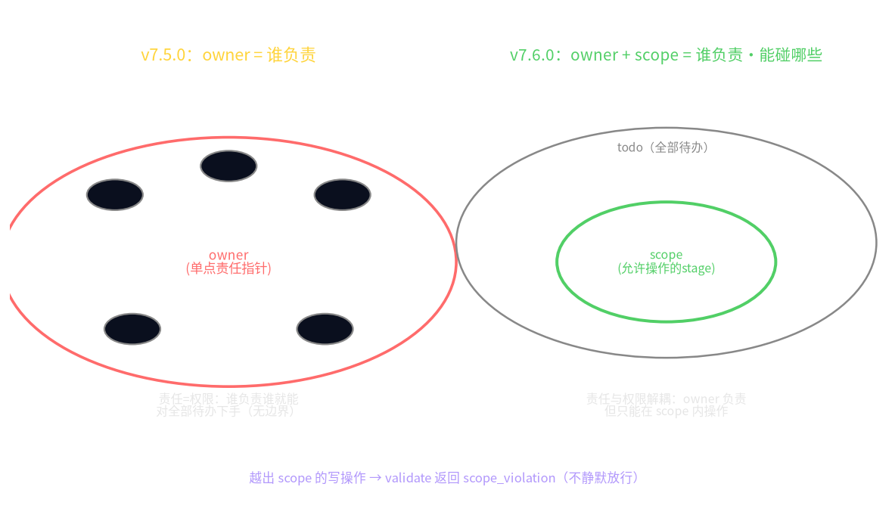

*Figure 1 Left: v7.5.0's owner is a "single-point responsibility pointer," who is responsible = who can act on all to-do; right: v7.6.0's owner+scope decouples responsibility and privilege—who is responsible, and which cells it is currently allowed to touch, recorded separately. Conceptual illustration, not measured data.*

### 3.1 What Cost-Quality Decoupling Means

ClawArena-Team's execution-style scoring report (paper report · not independently reviewed) gives a hint important for engineering scheduling: in its scenario, the Leader model's cost span is large, but the management quality total score span is far smaller. This is not saying "model size is completely useless" but **"changing to a larger Leader model" is not a cost-effective lever for orchestration quality**—if your real bottleneck is privilege crossing, then changing the Leader from a cheap model to a flagship, it will still open sub-agents' workspaces too large, because the problem is not whether it "can reason" but how large a hand the system "gave it."

In P0b's words, this is again a confirmation of "**structural prior determines the upper limit**": a structural choice like the owner field, before model size, determines on which failure class the system will overturn.

### 3.2 Execution-Style Scoring: Not Giving Judging to Another LLM

Another engineering choice of ClawArena worth borrowing is **pure execution-style scoring, no LLM judge**. In multi-agent evaluation, "letting one LLM be judge scoring other LLMs" (LLM-as-Judge) is common, but the judge model itself has bias and stance, introducing new noise into evaluation. Execution-style scoring judges by task **actual output**, changing the judge from "model self-assessment" to "whether output is achieved."

This agrees with UDOS's consistent "using mechanical contracts and rerunnable tests instead of model self-assessment" (P10's `validate()`, P12's evidence grading both this orientation). This paper's acceptance of scope likewise does not go "letting the Leader self-prove proper management" but "whether scope_violation is mechanically triggered, whether crossing is really rejected" type criteria that can be pinned by test assertions.

---

## 4 scope's Dynamic Lifecycle: Tightening and Re-authorization

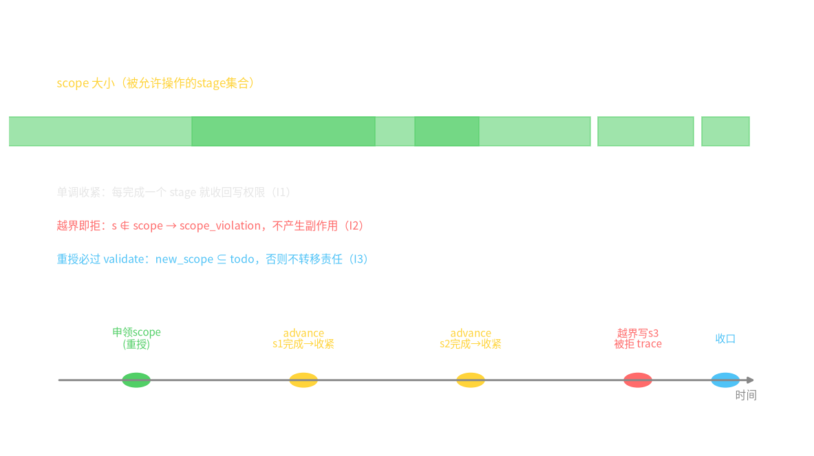

*Figure 2 The scope trajectory of one task progress: on handoff the new owner applies for a small scope (re-authorization), each completed stage removed from scope (automatic tightening), out-of-bounds writes rejected at validate and recorded in trace. Conceptual illustration, not measured data.*

Drawing the scope trajectory of one task from dispatch to closing (Figure 2), one sees it oscillates between two actions:

1. **Re-authorization (handoff)**: when control passes to the next leg, the new owner declares `new_scope`. There is a key design choice here—why not let it automatically inherit all `todo`? Because "automatic inheritance" equals handing the privilege decision back to the flow default, returning to the owner-mode old path. The meaning of forcing "application" is: **letting "which stages this owner needs to touch" become an explicitly declared, auditable, rejectable action**, not an implicit default.
2. **Automatic tightening (advance)**: revoked once the stage is done. This step is nearly zero cost, because `advance` already changes `todo`→`done`, synchronously removing it in `scope` is only a side action of the same state update. Its value is **letting privileges change with facts**: an owner does not permanently retain write privilege for a stage because it "was once responsible."
3. **Out-of-bounds rejection (validate)**: this is where scope really plays defense. When a misled or instruction-injected owner tries to operate stages outside scope, the system does not rely on "it should know not to" but on the mechanical rule `s ∉ scope → scope_violation`. This is the same family as P2's BFT-lite, P3's circuit breaker: **changing "hoping Agents behave" to "structurally it cannot do it"**.

Table 1 centrally contrasts v7.5.0 and v7.6.0 on the privilege dimension.

**Table 1 owner mode vs owner+scope mode**

| Dimension | v7.5.0 (owner) | v7.6.0 (owner+scope) |
|---|---|---|
| Responsibility record | single-point responsibility pointer | single-point responsibility pointer (kept) |
| Privilege record | implicit = can act on all todo | explicit `scope` = proper subset of todo |
| Out-of-bounds behavior | no mechanical interception | `validate` returns `scope_violation`, no side effects |
| Privilege after task completion | not automatically revoked | `advance` automatically removes from scope (tightening) |
| Privilege on handoff | new owner defaults to inherit all todo | new owner must explicitly apply and pass validate (re-authorization) |
| Audit | trace records event sequence numbers | additionally records each scope change and each crossing request |
| With existing contracts | baseline | incrementally compatible, not overturning P10 six fields |

*Table 1 note: v7.5.0 behavior is P10's verified contract; v7.6.0 behavior is this paper's design proposal, its defense effect to be measured by factorial experiment, `[RESULT NEEDED]`.*

---

## 5 Interfaces with UDOS Existing Papers

- **To P10 (TransferBundle)**: scope is the seventh field, not changing `goal/context/done/todo/trace` semantics. The migration path is "add field, add three invariants, add a test group," not rewrite. When old tasks lack the scope field, default `scope=todo` (falling back to v7.5.0 behavior), ensuring backward compatibility.
- **To P2 (BFT-lite stopping decisions)**: P2 decides "whether this leg should stop," P17's scope decides "what this owner is still allowed to touch before stopping." The two are orthogonal: one a **consensus termination** problem, one a **privilege boundary** problem.
- **To P3 (fault governance/circuit breaker)**: scope_violation is an earlier signal than "error rate exceeding threshold"—it alarms at the **moment** crossing occurs, rather than waiting for the sliding window to accumulate to threshold. Can serve as a circuit breaker's pre-trigger.
- **To P11 (internal task market)**: P11's "who wins, does what, paid how much" is the economic dimension; scope is this winner's "which stages allowed to touch" capability dimension. A winner even if economically qualified can only execute within its scope—**sufficient budget does not equal sufficient privilege**.

---

## 6 Drawbacks / Failure Boundaries / Falsifiable Conditions

Critical reading must land on "where this design fails," otherwise it is just another self-consistent slogan.

**Its drawbacks and limitations:**

1. **scope is a "structural guardrail," not "intelligent judgment."** It can intercept "mechanically unauthorized" but not "within scope, yet doing the task wrong." An owner making wrong decisions within its scope, scope completely cannot perceive. Do not misread least privilege as "universal safety."
2. **Over-tightening harms usability.** If scope is cut too fine, normal cross-stage collaboration is also frequently interrupted by `scope_violation`, the system "unable to run because too cautious." scope granularity itself needs tuning, not tighter-is-better.
3. **Re-authorization relies on the new owner honestly applying.** `new_scope ⊆ todo` is mechanically checkable, but "whether new_scope is really just enough, not too large or small" still needs higher-level judgment—scope cannot validate scope quality.
4. **ClawArena's precise numbers cannot be directly moved.** This paper borrows its direction (privilege bottleneck, cost-quality decoupling), its concrete thresholds (e.g. "no LLM exceeds 50% privilege precision") not verbatim hit at abstract level, and its scenario is text + multimodal workspace, not containing distributed faults and Byzantine behavior—**it measures "whether a good Leader can manage the team under normal conditions," not "whether the system crashes when the Leader is misled."** scope's fault-tolerance value, UDOS must test itself, cannot borrow ClawArena's scenario endorsement.

**Falsifiable conditions (design proposals must also be killable):**

- **F1**: if in the factorial experiment, owner+scope relative to pure owner has no significant improvement in crossing rejection rate (Wilson CI spans 0), then scope's "automatic tightening" is redundant complexity, should fall back to owner mode.
- **F2**: if scope mode significantly lowers normal task completion rate or latency (e.g. crossing misjudgment also blocking normal collaboration), and this cost is greater than crossing benefits, then "least privilege" in the task scenario is a negative-benefit design.
- **F3**: if the real management bottleneck is found not in privilege granting at all but elsewhere (e.g. task decomposition quality), then this paper taking scope as the first handle is misplaced—precisely the question an EPOB-style "failure distribution rather than only success rate" diagnosis answers.

---

## 7 Preregistered Experiment and Honest Boundary

scope's benefits currently are **design proposal · to implement**. This paper fills no "reduce cost X%," "reduce error Y%" numbers. The suggested preregistered factorial experiment framework is:

- **Factors**: privilege mode {owner baseline, owner+scope} × chain length {1,2,3,5} × fault injection {none, unauthorized injection, misled honest owner}.
- **Metrics**: scope_violation trigger count, whether crossing writes really rejected (I2 hit rate), normal task completion rate, completion latency, mis-isolation rate.
- **Criteria**: under the premise of normal completion rate not significantly dropping (F2 threshold), whether crossing write rejection rate significantly rises (F1 criterion).
- **Number state**: all result positions `[RESULT NEEDED: scope factorial experiment]`, to supplement after the experiment runs, before submission needing ≥30 seeds and reporting 95% CI.

---

## 8 Conclusion

v7.5.0's TransferBundle solved "no one closes," v7.6.0's owner+scope tries to solve "privilege boundary crossing." Its motivation comes from a directional hint of ClawArena-Team: management bottleneck in privilege granting, cost decoupled from management quality—so the correct lever is "cut privileges smaller, tighten with the flow, re-authorize on handoff," not "change the Leader model bigger."

This paper did not claim this has been measured and proven. Instead, this paper writes scope as three testable invariants, a group of factorial experiments to run, and marks every expected benefit as `[RESULT NEEDED]`. Structural prior determines the upper limit—a structural choice like owner determines on which failure class the system overturns; while upgrading owner to owner+scope is further changing "hoping Agents behave" to "structurally it cannot cross." This is P17's increment for v7.6.0.

---

## References

**External dialogue object (existence verified online 2026-09-21; its precise thresholds are paper reports, not independently reviewed)**

1. ClawArena-Team: Benchmarking Subagent Orchestration and Dynamic Workflows in Language-Model Agents. arXiv:2606.31174 (paper direction: management bottleneck concentrating in privilege granting, cost approximately decoupled from management quality, pure execution-style scoring no LLM judge; precise thresholds like "no LLM exceeds 50% privilege precision," "cost hundredfold/score fourfold," "SMS three-factor product formula" not verbatim hit at abstract level, relayed as "paper report · not independently reviewed").

**Classic background**

2. Saltzer, J. H., Schroeder, M. D. (1975). The Protection of Information in Computer Systems. *Proceedings of the IEEE* (least privilege/access control classic; this paper only borrowing its "least privilege" principle, not re-arguing).

**UDOS paper volumes (this series, evidence grades marked in text)**

3. UDOS v7.5.0 paper volume: P2 "BFT-lite safety verification of multi-agent stopping decisions," P3 (fault governance/circuit breaker, v7.5.0 corresponding paper), P10 "Agent-as-Tool and TransferBundle handoff information loss measurability" (six-field contract, 26 tests verified), P11 "Internal task market settlement conservation and Byzantine slashing mechanism design," P12 "Evidence-grading-driven reproducible Agent systems engineering."
4. UDOS v7.6.0 paper volume: P16 "Typed finality," P32 "Rules before learning" (scope_violation belongs to rule predicates, consistent with P32's "rules as base, learning as supplement" orientation).

---

## Evidence Discipline and Reproduction Notes

- This paper is a **design proposal**, no new UDOS measurement; scope's three invariants and factorial experiment are both to-implement designs, all benefit positions `[RESULT NEEDED: scope factorial experiment]`.
- ClawArena-Team's precise thresholds (privilege precision percentage, cost/quality multiples, SMS formula) were not verbatim hit in this abstract-level verification, this paper does not hardcode any concrete percentage, only citing its directional conclusions; when citing must keep the "paper report · not independently reviewed" caliber.
- v7.5.0 existing contracts (six fields, 26 tests) point back to P10, evidence grade verified; scope is an increment field on it, backward compatible (default scope=todo falls back to owner baseline).
- This paper does not claim "least privilege = universal safety"; scope only intercepts structural crossing, not wrong decisions within scope, also needing to prevent over-tightening harming usability (see §6 drawbacks and F2 criterion).


---

<p align="center"></p>

# A Broad-then-Deep Two-Stage Memory Flywheel: Submodular Active Sampling of BRS and DRS

**Working Title (EN):** *A Broad-then-Deep Memory Flywheel: From Coverage-Aware Sampling to Submodular Depth-Probing, Extending UDOS P4 with the RSIAgent Lesson*

> In-volume engineering paper P18 · upgrading v7.5.0 P4 "Coverage-aware data flywheel" to a "breadth scan + depth probe" two-stage structure · connecting to P6 identifiability blind zone · UDOS Reasoning Engine v7.6.0 · Fang Wenxin · 2026-09-21
>
> **One sentence first**: UDOS's current data flywheel is "collecting data to remove blind zones," but it only asks "where not yet seen," not "where most incomprehensible." RSIAgent (arXiv:2609.15364) with the "broad-then-deep" strategy proves: **first using breadth memory to survey the environment, then throwing compute at hard cases and hidden constraints, memory compound interest only then rolls up**. This paper lands this idea as UDOS's two-stage flywheel specification—BRS breadth scan covering the state space, DRS depth probe focusing on identifiability blind zones, and clearly marks: this is a **design proposal · to implement**, not measured benefits already produced.
>
> **Evidence caliber (stated only once in the whole paper)**: this paper is an architecture design paper, **containing no new UDOS measured numbers**. The cited external paper is RSIAgent (arXiv:2609.15364, existence verified online 2026-09-21), its "Kimi-K3/GLM-5.3 surpass GPT-6-class closed-source models on designated benchmarks" is paper/media report, not independently reviewed; this paper does not take that performance conclusion as evidence for the UDOS scheme holding, only borrowing its "broad-then-deep" strategy structure. UDOS old numbers all point back to v7.5.0 papers and `udos-engine/reports7/*.json`, evidence grades marked in text (verified / cpu-proto / cpu-proxy / unverified). The two-stage flywheel this paper proposes is a **design proposal · to implement**, wherever expected benefits lack experiment support all marked `[RESULT NEEDED]`.

---

## Abstract

Data collection is the fuel for Agent system self-improvement. UDOS v7.5.0's P4 paper already upgraded "passively collecting logs" to "coverage-aware active collection": the system measures its own coverage gap on the state space, prioritizing collecting tasks in regions never reached. This step is correct, but it only solved the "breadth" problem. This paper points out the missing second stage: **regions reached do not equal regions understood**. P6's identifiability empirical study of hidden dynamics parameters gives an honest negative result—the acceleration scalar skill estimate is negative (about −0.508, single-seed pilot, evidence grade cpu-proxy, pointing back to P6, this paper not recomputing), meaning the system in that direction "sampled, yet did not recognize the truth." RSIAgent (arXiv:2609.15364, Sibo Zhu et al.)'s approach precisely fills this gap: it coordinates three Agent types—curriculum (problem setter), actor (solver), verifier—first using broad recursive self-exploration (BRS) to spread breadth memory in diverse environments, then deep recursive self-exploration (DRS) focusing on hard cases, hidden constraints and boundary conditions. This paper translates this "broad-then-deep" into UDOS engineering specifications: the BRS stage targets coverage maximization, using deterministic submodular functions (e.g. facility-location) to select points; the DRS stage targets **identifiability information gain**, concentrating the sampling budget on blind zones "where the prediction error structure along parameter directions is most indistinguishable." The two stages share the same memory body, forming a "breadth memory + depth memory" layering. This paper also gives the design's failure boundaries: memory is environment-specific, RSIAgent's capability improvement bound to concrete digital environments, cannot transfer across environments (the reason this paper stays restrained when citing it); BRS+DRS is only a data collection strategy, not changing the quality saturation law P9 established that "isomorphic copies bring no independent information." This paper is a design specification, effects pending `[RESULT NEEDED]`.

**Keywords**: data flywheel; active learning; submodular function; identifiability; recursive self-improvement; memory layering; UDOS P4; UDOS P6

---

## Structured Abstract (background problem → method/argument → evidence → contribution)

- **Background problem**: P4's coverage-aware flywheel answered "where not yet visited," but did not answer "where visited yet not understood." P6 exposes a more hidden blind zone class—sampling density sufficient, truth still not identifiable. Only expanding breadth, such blind zones are repeatedly passed yet never close.
- **Core argument**: active collection should be two stages. BRS (broad recursive exploration) targets state-space coverage maximization, using submodular point selection; DRS (deep recursive exploration) targets **identifiability information gain along single-parameter directions**, pressing budget to the non-identifiable blind zones P6 identified. The two stages share the memory body, first broad then deep, alternating iteration.
- **Evidence clues**: (1) RSIAgent's BRS/DRS two-stage strategy structure (arXiv:2609.15364, paper report, existence verified); (2) P6's identifiability negative result (acceleration scalar skill negative, cpu-proxy, single-seed pilot); (3) P4's existing coverage-aware collection yield improvement (pointing back to P4, evidence grade per that paper); (4) P9's quality saturation law (mse(k)=a+b/k, cpu-proto) as the "breadth ≠ quality" constraint.
- **Contribution**: expanding P4 from single-stage to a two-stage flywheel specification; giving BRS/DRS respective objective functions and switching criteria; clarifying DRS's "depth" should anchor on identifiability blind zones rather than mere difficulty; drawing three failure boundaries of this design.

---

## 1 Problem: Covered Does Not Equal Understood

### 1.1 The Half P4 Already Solved

v7.5.0's P4 paper did one correct thing: changing the data for training Agents from "runtime byproduct" to "actively planned product." The system first estimates its own coverage distribution on the state space, then prioritizes collecting regions never reached, or reached far fewer times than the mean. This is conceptually equivalent to changing "collecting data" from "waiting for it to happen" to "going where it never happened." P4 reports active collection yield improved relative to passive collection (pointing back to P4, concrete values per that paper's `reports7/*.json`, this paper not restating, not newly creating).

This stage's objective function is **coverage rate**: the proportion of cells in the state space "touched." Its implicit assumption is—as long as touched, learned.

### 1.2 The Other Half P6 Exposes: Touched ≠ Understood

P6 paper did a more uncomfortable experiment: it does not look at "how much collected" but "whether truth parameters can be uniquely recovered from collected data." The conclusion is layered—on certain parameter directions, even with equal sampling and coverage looking not bad, parameters not identifiable; among them the acceleration scalar skill estimate is even negative (about −0.508, single-seed pilot, cpu-proxy). This is not "sampling not enough" but **the current observation structure is insensitive to that direction**: the system repeatedly passes this direction, yet no single observation can distinguish it from its neighboring directions.

In a metaphor: BRS solves "which map block not yet visited"; P6 reveals "some places you pass daily, but because the angle is too poor, the photos taken cannot recognize what it is."

A breadth-only flywheel is ineffective for such blind zones—it will walk the blind-zone cells again, coverage count +1, identifiability unmoved. This is the second stage this paper fills.

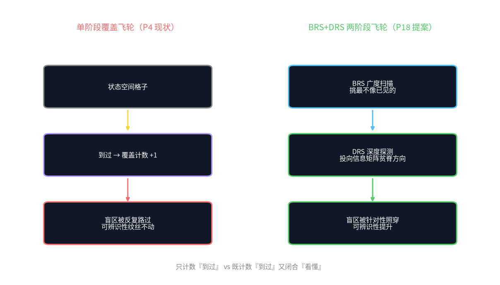

*Figure 1 Left: single-stage coverage flywheel, only counting "visited," blind zones repeatedly passed yet not closed; right: BRS breadth coverage + DRS depth probe, DRS pressing budget to identifiability blind zones. Conceptual illustration, not measured data.*

### 1.3 Why Fill Now: RSIAgent's Structure Is Borrowable

RSIAgent (arXiv:2609.15364, Sibo Zhu et al., 49 pages, 2026-09) is a **training-agnostic** multi-Agent self-improvement framework: it does not change model weights, only memory. It coordinates three roles—curriculum (problem-setting Agent), actor (solving Agent), verifier—and adopts **broad-then-deep** exploration:

- **BRS (broad recursive self-exploration)**: spreading in diverse environments, the goal being to record fully "what the task looks like under what conditions";
- **DRS (deep recursive self-exploration)**: repeatedly digging deep on already-known hard cases, hidden constraints, boundary conditions, the goal being to thicken the memory of "this class I just cannot do right."

The paper reports: under this memory flywheel, open-source Kimi-K3 and GLM-5.3 surpassed GPT-6-class closed-source models on OSWorld-v2 and Agent's Last Exam (paper/media report, not independently reviewed). **This paper does not cite this performance conclusion as the reason the UDOS scheme holds**—it is bound to specific environments and models. This paper borrows only a weaker, more stable thing: **"first broad then deep" is a more reasonable memory collection order than "only broad."**

---

## 2 Two-Stage Flywheel Specification (design proposal · to implement)

### 2.1 State and Memory Notation

Following P4's state space $X$, recording UDOS task execution traces as $D_t=\{(x_i,y_i)\}$, $x_i$ states, $y_i$ observable outcomes. The memory body $M_t$ is structured experience refined from $D_t$, reusable by later tasks. The two stages share the same $M_t$.

### 2.2 BRS Stage: Targeting Coverage Maximization

BRS's objective function follows the submodular view—the standard "diminishing marginal returns" form in active learning. Let the candidate state pool be $\mathcal{C}$, the selected set $S$, the gain of selecting the next point $x$ using facility-location-type gain:

$$g_{BRS}(x | S)=\max_{x' \in S} sim(x,x') \tag{1}$$

where $sim$ is state similarity (embedding cosine or workspace fingerprint similarity). BRS each step picks the $x$ making the gain drop slowest, i.e. **farthest from the selected set**. This greedy under submodular conditions has a $(1-1/e)$ approximation guarantee (classic result, unrelated to this paper's data). The BRS stage's exit condition is: the new point's marginal contribution to the coverage function below threshold $\tau_{cov}$ (design parameter, value pending `[RESULT NEEDED]` calibration).

Plainly: BRS is "picking things most unlike already seen to view," filling the map.

### 2.3 DRS Stage: Targeting Identifiability Information Gain

DRS is this paper's key increment relative to P4. It does not pick "farthest" but the parameter direction **"current observation most cannot separate truth."** Let the hidden parameter vector be $\theta$ (same source as P6's identifiability analysis), Fisher information approximately characterizing observation's ability to distinguish $\theta$:

$$I(\theta | D)=\sum_{(x,y)\in D} \nabla_\theta \log p(y|x,\theta)\,\nabla_\theta \log p(y|x,\theta)^{\top} \tag{2}$$

DRS's point selection goal is **the direction corresponding to minimizing $I$'s smallest eigenvalue**—i.e. throwing the next sample to the direction "the information matrix is most barren," making that direction identifiable as soon as possible. The blind zone in P6 "acceleration scalar skill estimate negative" is precisely the engineering manifestation of $I$ approaching singular in that direction.

Plainly: DRS does not ask "where not visited" but "which direction I looked a long time yet cannot distinguish true/false," then specifically adding illumination in that direction.

> Safety note: equation (2) is **the formalization of the design goal**, not a number UDOS already computed. Fisher information on black-box Agents needs approximation (e.g. empirical Fisher or proxies based on verifier gradients), approximation schemes and numerical calibration both `[RESULT NEEDED]`.

### 2.4 How the Two Stages Alternate

The two stages are not a one-time waterfall of "finish BRS then DRS" but **flywheel-style alternation**:

$$M_{t+1} = Merge(M_t,\; Sample_{BRS}(M_t) + Sample_{DRS}(M_t)) \tag{3}$$

Each round's budget allocated proportionally (design initial: BRS 60% / DRS 40%, pending `[RESULT NEEDED]` tuning). Switching criteria driven by two quantities: coverage marginal $\Delta Cov$ (whether BRS still has new map) and identifiability marginal $\Delta \lambda_{\min}(I)$ (whether DRS still has unclosed blind zones). When $\Delta Cov$ bottoms first, breadth is exhausted, should continue pressing budget toward DRS; when $\Delta \lambda_{\min}$ approaches zero, blind zones closed, should return to BRS opening new domains.

**Table 1 Contrast of BRS and DRS (design specification)**

| Dimension | BRS broad recursive exploration | DRS deep recursive exploration |
|---|---|---|
| Goal | state-space coverage maximization | single-parameter direction identifiability maximization |
| Point selection | farthest from selected set (submodular facility-location) | information matrix most barren direction |
| Borrowed from | P4 coverage-aware collection | P6 identifiability analysis |
| Exit criterion | coverage marginal < τ_cov | information matrix smallest eigenvalue stabilizing |
| Risk | collected but not understood | tunneling, overfitting to a few hard cases |
| Evidence grade | design proposal · to implement | design proposal · to implement |

### 2.5 Difference from RSIAgent (Why Cannot Copy)

RSIAgent's DRS focuses on "hard cases, hidden constraints, boundary conditions"—its "deep" is deep in the **task difficulty** sense. This paper corrects it to deep in the **identifiability** sense: for UDOS, a case "hard" does not equal "identifiable to the model." A simple but perspective-tricky task may contribute more to closing Fisher-barren directions than a complex but isomorphic-to-existing-observations task. This correction comes from P6's lesson—P6's negative result is precisely not "task too hard" but "observation structure insensitive to that direction."

---

## 3 Connection: BRS+DRS Landing in UDOS Existing Papers

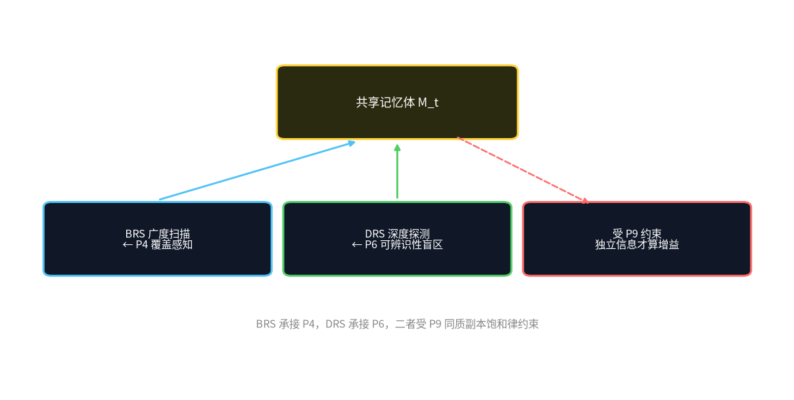

*Figure 2 BRS carries P4's coverage-aware collection, DRS carries P6's identifiability blind zones; the two share the memory body, constrained by P9's quality saturation law. Conceptual illustration.*

### 3.1 Carrying P4: Expanding Single Stage to Two Stages

P4's coverage-aware collection is this paper BRS's predecessor. The only upgrade point: beyond the coverage criterion, add an identifiability criterion, letting part of the budget (design initial 40%) no longer flow to "new cells" but to "barren directions." This change does not break P4's existing contracts—it only adds a DRS arm in the sampling selector.

### 3.2 Connecting P6: Turning Negative Results into DRS Targets

P6's identifiability grading (which parameters identifiable, which not, which directions skill estimate abnormal) is DRS point selection's **prior map**. This is this paper's most direct engineering value: P6 is diagnosis ("here not understood"), DRS is prescription ("specifically illuminate here"). P6's acceleration scalar negative result (about −0.508, cpu-proxy, single seed) is DRS's first formal target.

### 3.3 Constrained by P9: Breadth Does Not Equal Quality

Must reaffirm P9's quality saturation law (mse(k)=a+b/k, cpu-proto): **newly added Agents if not carrying independent information, scale expansion produces no capability**. New states BRS collects, new cases DRS digs, must all produce **independent information** in the memory body, otherwise only recording the same experience twice. The two-stage flywheel therefore is not "collect more" but "collect with more discrimination"—fully consistent with P9, not P9's counterexample.

---

## 4 Drawbacks / Failure Boundaries / Falsifiable Conditions

### 4.1 Drawbacks (restraint that must be kept when citing RSIAgent)

1. **Memory is environment-specific.** RSIAgent's capability improvement bound to concrete digital environments like OSWorld-v2, Agent's Last Exam; its title "in New Environments" means "learning in new environments," **not "learned capability transfers across environments."** This paper borrows its two-stage structure, never its "universal self-evolution" implication.
2. **Self-reported performance cannot be directly moved.** "Open source surpasses closed source" is paper/media report, not independently reviewed, and highly dependent on task and model versions, cannot serve as argument for UDOS scheme expected benefits.
3. **DRS has a tunneling risk.** Pressing all budget to identifiability blind zones may make the system overfit on a few extreme cases, while normal task quality not rising but falling—precisely why BRS/DRS ratio needs experimental calibration rather than head-fixed.

### 4.2 Failure Boundaries

- If the state space's "non-identifiable" is essentially **observation structure missing** (sensors/tools cannot see that direction at all), then DRS no amount of sampling can close—that is a tool-layer problem, not a collection strategy problem, should upgrade to P10 handoff contract or tool selection rather than continuing to add sampling.
- If the memory body $M_t$ does not support cross-stage reuse (what BRS records DRS cannot read), the two stages degrade into two non-communicating samplers, flywheel stopping. This requires the memory schema shared by both stages, the implicit premise for this paper's specification to hold.

### 4.3 Falsifiable Conditions

- **F18-a**: if under the same budget, BRS+DRS two stages relative to single-stage BRS, the **identifiability blind zone closing speed** ($\lambda_{\min}(I)$ improvement rate) has no statistical improvement, then this paper's "depth probe" design proposal is falsified, should return to single stage.
- **F18-b**: if after raising the DRS budget proportion, normal tasks' average quality significantly drops (overfitting to hard cases), then the two-stage ratio needs an upper-bound constraint, this paper's "40% DRS initial" direction correct but value needs fixing.
- The above criteria all need ≥30 seeds and 95% CI, currently design proposal, `[RESULT NEEDED]`.

---

## 5 Conclusion

P4 answered "visited or not," P6 answered "understood or not," this paper sews the two into one flywheel: BRS responsible for "filling the map," DRS responsible for "illuminating through the not-understood directions." This is the UDOS-ization correction of RSIAgent's "broad-then-deep" strategy—borrowing its structure, not its performance promise; correcting "task-difficulty depth" to "identifiability depth." The two stages share the memory body, alternately driven by coverage marginal and identifiability marginal, a **design proposal · to implement** specification, its holding or not adjudicated by F18-a/b in controlled experiments.

**Breadth determines how much world you have seen, depth determines how much of the seen world you understand. Only broad not deep, blind zones will be repeatedly passed by you, forever passed.**

---

## References

**Classic active learning and submodular**

1. Krause, A., & Golovin, D. (2014). Submodular Function Maximization. In Tractability: Practical Approaches to Hard Problems. Cambridge University Press. (classic basis for submodular greedy $(1-1/e)$ approximation)
2. MacKay, D. J. C. (1992). Information-Based Objective Functions for Active Data Selection. *Neural Computation*, 4(4), 590–604. (source of information gain/Fisher active sampling)

**2026 frontier material (existence verified online 2026-09-21; performance numbers paper/media reports, not independently reviewed)**

3. Zhu, S., et al. (2026). RSIAgent: Autonomous Exploration for Recursive Self-improvement in New Environments. arXiv:2609.15364. (curriculum/actor/verifier three roles, BRS+DRS broad-then-deep memory construction)

**UDOS paper volumes (this series, evidence grades marked in text)**

4. UDOS v7.5.0 paper volume: P4 "Coverage-aware data flywheel" (coverage-aware active collection), P6 "Observability and identifiability empirical study of hidden dynamics parameters" (acceleration scalar skill about −0.508, single seed, cpu-proxy), P9 "Agent legion quality saturation law and homogeneous expansion failure boundary" (mse(k)=a+b/k, cpu-proto), P10 "TransferBundle handoff information loss measurability."
5. UDOS v7.6.0 paper volume: P33 "v7.6.0 architecture master: eight structural change specifications and compatibility paths" (BRS+DRS registered as structural change item 3).

---

## Evidence Discipline and Reproduction Notes

- This paper is an **architecture design paper**, no new experiments; BRS/DRS objective functions, 60/40 initial, $\tau_{cov}$ threshold are all design parameters, actual numerical calibration `[RESULT NEEDED]`, forbidden to write expected benefits as measured.
- Citing RSIAgent only takes its BRS/DRS strategy structure; its "open source surpasses closed source" performance conclusion is paper/media report, not independently reviewed, not serving as this paper's argument.
- P6 acceleration scalar skill ≈ −0.508 is a single-seed pilot (cpu-proxy), this paper only points back, not recomputes; before submission must supplement ≥30 seeds and 95% CI.
- The two-stage flywheel's causal claims (F18-a/b) are post-hoc-scorable design predictions, not established conclusions.


---

<p align="center"></p>

# The Structural-Change Review Gate: Forcing Test Assertions in a Versioned Repository

**Working Title (EN):** *The Structural-Change Review Gate: Forcing Independent Test Assertions on Every MatrixConfig Commit, Extending UDOS P12 with the Ouroboros Lesson*

> In-volume engineering paper P19 · upgrading v7.5.0 P12 "Evidence-grading-driven reproducible systems engineering" from "post-hoc grading" to "pre-commit gate" · using Ouroboros's reviewed commits as reference · using P12's "version number incident" as counterexample · UDOS Reasoning Engine v7.6.0 · Fang Wenxin · 2026-09-21
>
> **One sentence first**: UDOS already has a versioned repository and CHANGELOG, but "structure changed" long relied on people remembering to write tests. Ouroboros (arXiv:2608.08311) proves: **making "reviewed commits" the runtime base for later runtimes, self-development only then continues without collapsing**. This paper lands it as a hard UDOS gate—any MatrixConfig parameter change must be accompanied by independent test assertions to merge; and clearly this is a **design proposal · to implement**.
>
> **Evidence caliber (stated only once in the whole paper)**: this paper is an engineering governance design paper, **containing no new UDOS measured numbers**. The external paper Ouroboros (arXiv:2608.08311, existence verified online 2026-09-21)'s Terminal-Bench 2.1 number (original 86.97%, after removing one reward-hack 86.74%) is **self-reported SOTA**, not independently reviewed; this paper does not cite that score as evidence for UDOS gate effectiveness, only borrowing its "reviewed commit → runtime" engineering structure. UDOS old events (P12 version number incident) point back to v7.5.0 P12. This paper's gate is a **design proposal · to implement**, benefits without experiment support marked `[RESULT NEEDED]`.

---

## Abstract

For a self-improving Agent system, the most dangerous failure is not "changed badly" but "**quietly changed badly, CHANGELOG still recording it as improvement**." UDOS v7.5.0's P12 paper established evidence grading (verified / cpu-proto / cpu-proxy / unverified), but it is **post-hoc**: after changes already merged and run, grading then decides how hard the sentence can be stated. This paper fills the missing **pre-hoc** link of P12—the structural-change review gate. Triggering it is a concrete lesson: P12 itself recorded a "version number incident"—some commit changed the version number prefix convention, without any test assertion catching it, causing downstream parsing versions by the old convention to silently fail (event description pointing back to P12, this paper not re-characterizing). Ouroboros (arXiv:2608.08311, *Ouroboros: A Self-Developing Frontier Coding Agent with Reviewed Core Evolution*) gives the positive reference: its tools, prompts, context assembly and core implementation all continuously improve through **reviewed commits**, and these commits become the runtime for later work; the common point of its two evolution modes (recursive free evolution / experience-driven core evolution) is—every structural change must pass a review. This paper lands this structure as UDOS's gate specification: dividing changes into two classes—**behavioral changes** (not changing MatrixConfig structure, going through normal CI) and **structural changes** (changing MatrixConfig parameter schema, topology defaults, contract fields, stopping decision thresholds); the latter before merging must simultaneously satisfy three—(i) at least one new independent test assertion directly covering the changed structural quantity; (ii) key regression test sets all green; (iii) CHANGELOG entries marking change class and evidence grade. This paper also points out Ouroboros's drawback: its "review" relies on human reviewers, review bandwidth being the hard upper limit of self-improvement speed; the UDOS gate therefore does not pursue "automatically approving everything" but the mechanical, falsifiable, not-relying-on-people-remembering rule of "structural change lacking assertions is rejected from merging." This paper is a design proposal, effects pending `[RESULT NEEDED]`.

**Keywords**: review gate; structural change; test-driven; versioned repository; evidence grading; CI/CD; self-improvement safety; UDOS P12; Ouroboros

---

## Structured Abstract (background problem → method/argument → evidence → contribution)

- **Background problem**: P12's evidence grading is post-hoc; structural changes if not forced to accompany test assertions will repeat the "version number incident"—changed structure, CHANGELOG recording as improvement, downstream silent mismatch.
- **Core argument**: singling out "structural change" from ordinary code changes, before merging forcing the three-piece set—independent test assertions + regression all green + CHANGELOG classified marking; lacking assertions mechanically rejected, not relying on people remembering.
- **Evidence clues**: (1) P12 version number incident (pointing back to P12's counterexample); (2) Ouroboros's reviewed-commits structure (arXiv:2608.08311, existence verified, score self-reported); (3) P2/P10/P11's existing structural quantity test basis (24/24 stopping decision acceptance, 26 TransferBundle contract tests, internal market conservation, pointing back to papers).
- **Contribution**: defining UDOS's "structural change" boundary; giving the three-condition gate specification; pointing out Ouroboros review bandwidth's drawback and designing the gate as a mechanical rule not relying on human bandwidth; giving falsifiable criteria.

---

## 1 Problem: Post-hoc Grading Cannot Save Pre-hoc Silence

### 1.1 What P12 Did Right and Did Not

P12 paper's core contribution is **attaching evidence grades to every sentence**. A sentence saying "24/24 acceptance correct," it marks verified; saying "8 Agent throughput hump," it marks cpu-proto. This grading lets readers know how far to trust. But it has an implicit premise: **the change itself is cleanly, reproducibly recorded**. If one structural change quietly changes the version number prefix, or changes a TransferBundle field's semantics without changing tests, then post-hoc however graded, what comes out is "truth based on wrong configuration"—however fine the evidence grade, cannot recover a silently polluted baseline.

### 1.2 Counterexample: The Version Number Incident

P12 recorded one such incident (this paper only citing its lesson, not restating details): one commit changed the version number prefix convention, the repository had no test assertion "version number must match that prefix regex." As a result downstream parsing by the old convention, the new-format version number wrongly classified, while CI was green—because nothing was checking this. This is precisely the "post-hoc grading" blind zone: the grading system's input (current baseline) itself polluted, however strict grading also scoring the polluted baseline.

### 1.3 Positive Reference: Ouroboros's reviewed commits

Ouroboros (arXiv:2608.08311) is a self-developing frontier coding Agent, its core mechanism being: **tools, prompts, context assembly, core implementation all continuously improve through reviewed commits, and these commits become the runtime for later work**. It has two evolution modes—recursive free evolution (improvement itself a task, after completion scheduling the next round) and experience-driven core evolution (daily work exposing bugs and inefficiency, producing reviewed structural changes). The paper self-reports Terminal-Bench 2.1 reaching 86.74% (original 86.97%, after removing one reward-hack), the benchmark's reported SOTA (self-reported, not independently reviewed).

This paper does not borrow the 86.74 number. This paper borrows the structure: **every change making later runtimes change must pass a review, and the reviewed result explicitly recorded as part of the runtime**.

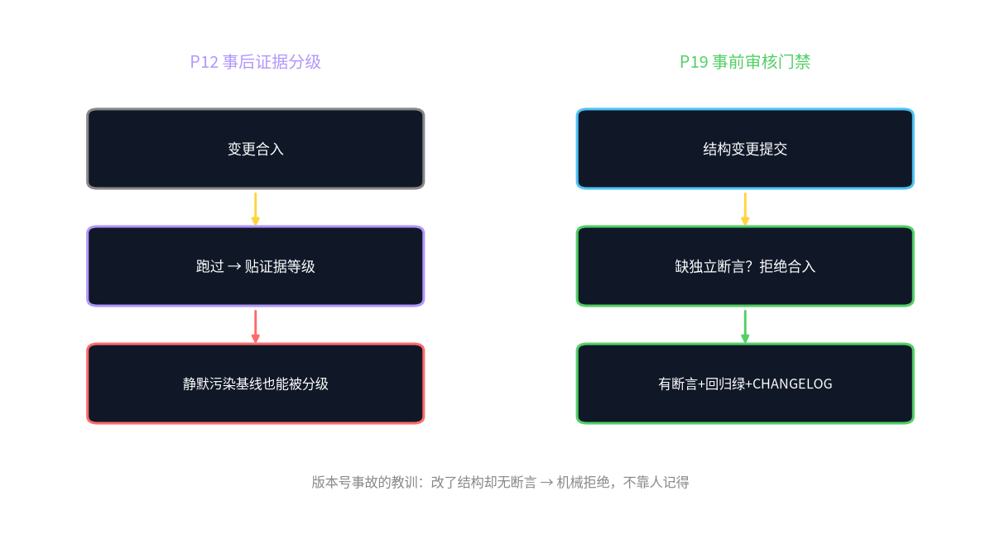

*Figure 1 Left: P12 post-hoc grading—changes first merged, run then grades attached; right: this paper's pre-hoc gate—structural changes before merging forced independent assertions. Conceptual illustration, not measured data.*

---

## 2 Gate Specification (design proposal · to implement)

### 2.1 What Counts as "Structural Change"

First draw the boundary, not all commits go through the gate. This paper divides changes into two classes:

- **Behavioral changes**: not changing MatrixConfig's schema, not changing topology defaults, not changing TransferBundle contract fields, not changing BFT-lite stopping thresholds, not changing settlement conservation rules. These go through normal CI.
- **Structural changes**: touching any of the above. Examples include—adding/removing MatrixConfig parameters, changing their defaults or units, changing P1 topology decision tree branch conditions, changing the $f$ definition in P2's quorum $2f+1$, changing P10 TransferBundle field semantics, changing P11 settlement accounting units.

The decision rule itself written as a mechanical check: whether the diff touches the three directories `matrix_config/`, `contracts/`, `consensus/` or corresponding schema files. Touching triggers the gate, not relying on human subjective judgment "does this count as structural change."

### 2.2 The Three-Condition Gate

One structural change commit, before merging must simultaneously satisfy:

1. **Independent test assertions**: at least add one test, directly asserting the changed structural quantity. "Independent" means it is not the changed code's internal unit self-test but an assertion written from an external contract perspective—e.g. changed the version number prefix, must have one test asserting `re.match(VERSION_RE, version)` not empty; changed a TransferBundle field, must have one contract test asserting handoff rejected when that field missing.
2. **Regression all green**: P2 stopping decision acceptance set, P10 TransferBundle contract test set, P11 settlement conservation test set all pass (these test sets already exist, pointing back to papers, verified tests guarding).
3. **CHANGELOG classified marking**: CHANGELOG adds one entry, marking `[structural]` class, corresponding paper number, evidence grade (e.g. `cpu-proto`). Missing marking = missing gate.

Three lacking any one **mechanically rejected from merging**. This rule does not rely on the reviewer remembering to ask "did you write tests"—CI directly blocks.

### 2.3 Relationship with Existing Structural Quantity Tests

UDOS does not start from zero. P2's BFT-lite stopping decisions have acceptance tests (committee 24/24 acceptance correct, verified); P10's TransferBundle has 26 contract tests (verified); P11's internal market settlement conservation guaranteed by code structure. The gate does **elevating these existing tests from "post-hoc regression" to "precondition for structural change"**: before "after changing code conveniently running once," now "no new assertions not allowed to change structure."

**Table 1 Gate contrast of behavioral change vs structural change (design specification)**

| Dimension | Behavioral change | Structural change |
|---|---|---|
| Touched scope | not changing schema/contract/threshold | changing MatrixConfig schema, topology defaults, TransferBundle fields, stopping thresholds, conservation rules |
| New assertions | not forced | forced at least one independent contract assertion |
| Regression requirement | normal CI | P2/P10/P11 all test sets green |
| CHANGELOG | normal entry | must `[structural]` + paper number + evidence grade |
| Lacking assertions | normally merged | mechanically rejected from merging |
| Evidence grade | design proposal · to implement | design proposal · to implement |

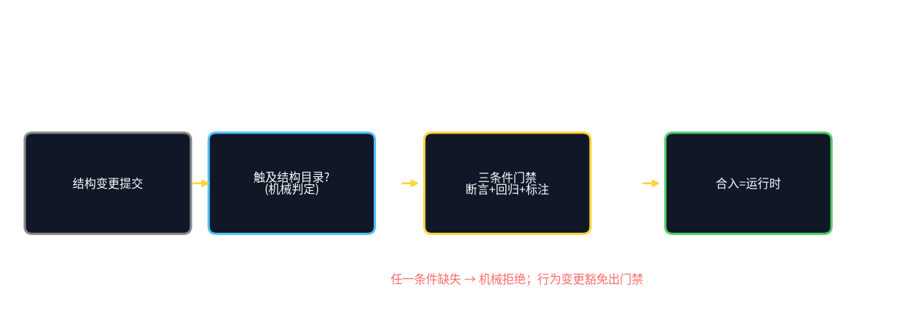

*Figure 2 Structural change commit → mechanical decision whether touching structural directories → three-condition gate → if passed merged and becomes runtime; any condition missing rejected. Conceptual illustration.*

---

## 3 Drawbacks / Failure Boundaries / Falsifiable Conditions

### 3.1 Drawbacks (restraint that must be kept when citing Ouroboros)

1. **Review bandwidth is the hard upper limit.** Ouroboros's "reviewed commit" path relies on reviewers; if reviewers are human, then self-improvement's recursive depth is **capped by human bandwidth**—this is not true autonomous evolution but "rapid iteration under human review." It modifies the Harness, not the review rule "determining later modifications itself" (consistent with P14's L2/L5 distinction).
2. **Self-reported score does not equal gate effectiveness.** Terminal-Bench 86.74% is self-reported SOTA, cannot infer "review gate improved UDOS quality." This paper borrows structure, not score.
3. **Gate too strict suppresses evolution.** If every structural change requires one new contract assertion, evolution speed may be slowed by test-writing cost—precisely why "behavioral changes" need exemption, otherwise the gate becomes shackles.

### 3.2 Failure Boundaries

- If the gate only checks "whether new tests added" without checking "whether tests really cover the changed structure," it will be bypassed by "adding one irrelevant assertion." This requires independent assertion review still needing human/AI one look at assertion-diff relevance—mechanical rules cannot block this, the gate's inherent gap, this paper not pretending to solve.
- If the structural change itself changes the "what counts as structural change" decision rule (self-reference), mechanical directory checks fail—such meta-changes must be explicitly marked and go human, cannot automatically pass the gate.

### 3.3 Falsifiable Conditions

- **F19-a**: if in one iteration cycle after introducing the gate, "version number incident"-class silent structural failures (changed structure yet no corresponding assertion) occurrence count did not decrease relative to before introduction, then the gate exists in name only, needing redesign of trigger rules.
- **F19-b**: if the gate makes structural change merge throughput drop beyond the design tolerance threshold (concrete threshold pending `[RESULT NEEDED]` calibration), then need relaxing the "behavioral/structural" boundary, otherwise the gate will kill P14-style rapid iteration.
- The above are post-hoc-scorable criteria under a design proposal, not established conclusions.

---

## 4 Conclusion

P12 taught UDOS "how hard to state a sentence," P19 wants to teach UDOS "changed structure must leave evidence." Ouroboros's reviewed commits proved this path sustainable, but its drawback reminds us: **self-improvement relying on human review bandwidth is not true autonomy**. UDOS's countermeasure is mechanizing the most critical step—structural change lacking independent test assertions rejected from merging—letting this rule not rely on anyone remembering. It does not pursue automatically approving everything, only not letting "changed badly yet recorded as improvement" silently occur.

**Post-hoc grading determines how long a sentence can be trusted, pre-hoc gate determines whether one change can quietly poison the baseline. The version number incident already paid tuition once, the gate is this tuition's receipt.**

---

## References

**Software engineering and testing foundations**

1. Beck, K. (2002). *Test-Driven Development: By Example*. Addison-Wesley. (classic test-first methodology)
2. Martin, R. C. (2008). *Clean Code: A Handbook of Agile Software Craftsmanship*. Prentice Hall. (design by contract and boundaries)

**2026 frontier material (existence verified online 2026-09-21; performance numbers self-reported, not independently reviewed)**

3. Ouroboros (2026). *Ouroboros: A Self-Developing Frontier Coding Agent with Reviewed Core Evolution* (v3). arXiv:2608.08311. (reviewed commits become runtime; Terminal-Bench 2.1 self-reported 86.74%)

**UDOS paper volumes (this series, evidence grades marked in text)**

4. UDOS v7.5.0 paper volume: P2 "BFT-lite safety verification of multi-agent stopping decisions" (24/24 acceptance, verified), P10 "TransferBundle handoff information loss measurability" (26 contract tests, verified), P11 "Internal task market settlement conservation," P12 "Evidence-grading-driven reproducible systems engineering" (version number incident counterexample), P14 "RSI convergence" (L2 changing Harness / L5 structural self-modification).
5. UDOS v7.6.0 paper volume: P33 "v7.6.0 architecture master: eight structural change specifications and compatibility paths" (review gate registered as structural change item 4).

---

## Evidence Discipline and Reproduction Notes

- This paper is an **engineering governance design paper**, no new experiments; three-condition gate, `[structural]` marking rules, F19-a/b criteria are all design proposals, merge rate and incident count improvement `[RESULT NEEDED]`, forbidden to write as measured benefits.
- Ouroboros's Terminal-Bench 86.97%/86.74% is self-reported SOTA, not independently reviewed, only structural reference.
- P12 version number incident is a v7.5.0 recorded event, this paper only citing its lesson, not re-characterizing details.
- The gate's human relevance review of "whether assertions really cover the changed structure" is an inherent gap, this paper honestly marking, not claiming automated closure.


---
