# World Models, Capability and Industry

> 主题册六·世界模型能力与产业 · TwinsEarth · 2026-09-24 · Papers released under CC BY 4.0

---

<p align="center"></p>

# A0 · Reverse Engineering Three Top Exemplar Papers and a Five-Round Thinking Drill Report

> Version: UDOS Full Paper Text v7.5.0 / Stage A (exemplar reverse engineering)
> Date: 2026-09-20 (Asia/Shanghai, UTC+8)
> Methodology statement: this report is **not a recitation from memory**. All three PDFs were extracted page by page with PyMuPDF (PyMuPDF 1.28.2 / MuPDF 1.28.2) using `get_text("text", sort=True)`, and key figure/table pages were rendered with `get_pixmap` and read image by image for cross-checking (axes, three-line tables, layout). All numbers, section numbers, figure numbers come from the PDF original text, no extrapolation.
> Extraction artifacts retained: `_work/kaplan.txt` (30 pages / 124,762 chars), `_work/alexnet.txt` (9 pages / 37,959 chars), `_work/nsa.txt` (24 pages / 76,441 chars), and rendered images `_work/{alex,kap,nsa}_p*.png`.

---

## 0. Quick Overview of the Three Exemplars (one-sentence positioning)

| Short name | True bibliographic record (PDF measured) | Length/layout | Role in this report |
|---|---|---|---|
| **AlexNet** | Krizhevsky, Sutskever, Hinton. *ImageNet Classification with Deep Convolutional Neural Networks.* NeurIPS 2012. 9 pages | two-column conference layout | The "**engineering detail is the scientific contribution**" paradigm: every trick paired with a quantified ablation + error-rate comparison table |
| **Kaplan** | Kaplan, McCandlish, Henighan et al. *Scaling Laws for Neural Language Models.* arXiv:2001.08361v1, 2020. 30 pages | single-column arXiv + explicit contents + Appendices A–D | The "**controlled variables + power-law fitting + trend extrapolation**" paradigm: conclusions first, exponent table at the end, a dedicated Caveats section |
| **NSA** | Yuan, Gao, Dai … Ruan, Zhang, Liang, Zeng. *Native Sparse Attention: Hardware-Aligned and Natively Trainable Sparse Attention.* arXiv:2502.11089v1, 2025 (DeepSeek-AI × Peking University × U.W.). 24 pages | single-column LaTeX conference layout + three-line tables | The "**hardware constraint → architecture design → end-to-end trainable → layer-by-layer/task-by-task comparison**" paradigm |

> Important erratum (double-confirmed by user instruction and the PDF original): the attachment `DeepSeek论文2502.11089v1.pdf` is measured to be titled **Native Sparse Attention (NSA)**, **not DeepSeek-V3, nor DeepSeek-R1**. R1/V2/R1 appear only in its references and comparison baselines. This report and the master library uniformly use NSA.

---

# Part One · Paper-by-Paper Reverse Engineering

---

## I. AlexNet (Krizhevsky/Sutskever/Hinton, NeurIPS 2012)

### 1.1 Structural Skeleton and Length Allocation

The whole paper is 9 pages, no explicit contents, two columns. Sections and lengths measured as follows:

| Section | Title | Pages | Length feature |
|---|---|---|---|
| — | Abstract | p1 | single paragraph, task + headline number + technique + results all packed into one paragraph |
| 1 | Introduction | p1–p2 | from "the small-dataset era" to "why large models + CNN," ending with an **explicit list of 5 specific contributions** |
| 2 | The Dataset | p2 | data split, preprocessing (256×256 downsampling, mean subtraction) |
| 3 | The Architecture | p3–p5 | 3.1 ReLU / 3.2 Multi-GPU / 3.3 LRN / 3.4 Overlapping Pooling / 3.5 Overall. **The original text explicitly says "3.1–3.4 are ordered by our estimated importance, most important first"** |
| 4 | Reducing Overfitting | p5–p6 | 4.1 Data Augmentation / 4.2 Dropout |
| 5 | Details of learning | p6 | SGD hyperparameters, initialization, learning-rate schedule |
| 6 | Results | p7 | Table 1/2 + Fall2009; 6.1 Qualitative Evaluations (Fig3/Fig4) |
| 7 | Discussion | p8 | convergence |
| — | References | p9 | [1]–[26], numbered |

**Allocation observation**: methods (3+4+5) about 45%, results (6) about 15%, introduction (1) about 20%. **Introduction and methods are nearly equal in length**—typical of an "engineering-contribution" paper: the contribution itself is a string of engineering decisions, the introduction needed to explain "why each decision matters."

### 1.2 Abstract Writing (sentence by sentence)

The abstract is one paragraph, about 200 words, fixed seven beats:
1. **Task**: "We trained a large, deep CNN to classify the 1.2 million … LSVRC-2010 … into 1000 classes."
2. **Headline number**: "top-1 and top-5 error rates of **37.5% and 17.0%** … considerably better than the previous SOTA."
3. **Scale anchor**: "60 million parameters and 650,000 neurons … 5 conv + 3 FC + 1000-way softmax."
4. **Speedup means**: "non-saturating neurons and a very efficient GPU implementation."
5. **Anti-overfitting means**: dropout.
6. **Competition result (second hammer)**: "ILSVRC-2012 winning top-5 **15.3%**, compared to **26.2%** second-best."

> Pattern: **task → dual-indicator headline numbers → scale parameters → two technical keywords → one competition verdict**. All numbers go into the abstract.

### 1.3 Introduction Argumentation Pattern

- **Trend argument**: small datasets (NORB/Caltech/CIFAR) → real objects varied → must have larger data → ImageNet 15M/22k.
- **Motivation argument**: tasks too complex to be fully specified by data → need priors → CNN's locality/stationarity priors fit exactly.
- **Feasibility argument**: CNN previously "prohibitively expensive" → modern GPUs + optimized convolution make it feasible.
- **Contribution list**: ending "The specific contributions of this paper are as follows:" introducing 5 items (largest model, open-source GPU implementation, new structural features, anti-overfitting, depth importance).
- **Honest closing**: "network's size is limited mainly by GPU memory and training time … **All of our experiments suggest results can be improved simply by waiting for faster GPUs and bigger datasets**."

### 1.4 Related Work Organization

AlexNet **has no independent Related Work section**—related work is scattered into the introduction and the "we are not the first" paragraphs of each technical subsection (e.g. 3.1 cites Jarrett et al. and distinguishes that they observed anti-overfitting while we observe speedup). Common practice for 2012 conference papers, contrasting with Kaplan/NSA's independent Related Work.

### 1.5 Division of Methods/Experiments/Results/Discussion

- **Methods = contribution list**: 3.1–3.4 each trick one section, **each section ending with the error reduction that trick brings** (see 1.6).
- **Experiments**: Section 5 only writes "how trained" (hyperparameters), no results; results concentrated in Section 6.
- **Results**: using comparison tables (Table 1/2) + one cross-dataset (Fall2009) + qualitative evaluation.
- **Discussion**: two paragraphs, stressing "depth really matters" (removing any conv layer −2%) and "did not use unsupervised pretraining but expect it useful."

### 1.6 Transferable Argumentation Paradigms (this paper distills **9** items)

1. **Engineering detail is the scientific contribution**: ReLU, dual-GPU split, LRN, overlapping pooling, dropout, PCA color perturbation—all packaged as novel features, each with a name.
2. **Every trick paired with a quantified ablation** (verbatim from the original):
   - Dual-GPU split: "reduces top-1/top-5 by **1.7% and 1.2%**";
   - LRN: "reduces by **1.4% and 1.2%**"; on CIFAR-10 13%→11%;
   - Overlapping pooling (s=2,z=3 vs s=z=2): "reduces by **0.4% and 0.3%**";
   - PCA color augmentation: "reduces top-1 by **over 1%**";
   - dropout: "roughly doubles the number of iterations to converge" (cost also written).
3. **Fairness self-disclosure**: footnote 2 actively admits the one-GPU comparison "is biased in favor of the one-GPU net, since it is bigger"—**actively disclosing a bias against oneself**, in exchange for reviewer trust.
4. **Using ablations to prove "depth is indispensable"**: "removing any convolutional layer (each ≤1% of params) resulted in inferior performance," quantified again in the discussion as "middle-layer removal ≈ −2% top-1."
5. **Dual-column error-rate comparison tables**: Table 1/2 give both top-1 and top-5; others' results in *italics*, own in roman; cross-dataset sub-tables (2010 / 2012 / Fall2009).
6. **Qualitative figures supplement quantitative gaps**: Fig3 shows learned kernels (GPU1 color-invariant vs GPU2 color-dependent, **and independent of initialization**); Fig4 uses 4096-dim features for nearest-neighbor retrieval, proving "high-level features are semantic, not pixel."
7. **Training details complete to reproducibility**: batch 128, momentum 0.9, weight decay 0.0005, weight init Gaussian std=0.01, ReLU bias=1, LR 0.01 manually divided by 10 three times, ~90 epochs, 2×GTX580 for 5–6 days.
8. **Counterintuitive findings written as selling points**: "weight decay here is **not merely a regularizer**: it reduces the training error."
9. **Test-time ensembling at zero extra training cost**: 10-crop (four corners + center + horizontal flip) averaging, training-time CPU augmentation/GPU training in parallel = "computationally free."

### 1.7 Figure/Table List (one by one, with axes and self-consistency)

| Figure/Table | What it conveys | Axes/baseline/confidence | Caption self-consistency |
|---|---|---|---|
| Fig 1 | ReLU vs tanh convergence speed | line chart, vertical training error rate, horizontal Epochs; solid ReLU/dashed tanh; **caption explicitly says "learning rates independently tuned to fastest, no regularization"** | high: caption carries the experiment setup and applicability boundary ("effect varies with architecture") |
| Fig 2 | Overall architecture | 3D isometric schematic, labeling per-layer neuron counts 253440–186624–64896–64896–43264–4096–4096–1000; two-GPU division of labor | high: caption explains at which layers the two GPUs communicate |
| Fig 3 | Learned filters | 96 11×11×3 kernel visualizations; upper 48 GPU1 / lower 48 GPU2 | high: directly corresponds to the §6.1 specialization observation |
| Fig 4 | Qualitative evaluation | left: 8 images + top-5 predictions; right: 5 query images + 6 nearest-neighbor training images | high: explains the similarity metric (4096-dim Euclidean distance) |
| Table 1 | ILSVRC-2010 test set comparison | three rows: Sparse coding 47.1/28.2, SIFT+FVs 45.7/25.7, **CNN 37.5/17.0**; others' best in italics | high: caption explains the italics meaning |
| Table 2 | ILSVRC-2012 validation+test | columns: Top-1(val)/Top-5(val)/Top-5(test); 1CNN/5CNNs/1CNN*/7CNNs* | high: the * pretraining has a footnote explanation |

> **Note**: AlexNet's tables are plain two-column small tables, **not modern booktabs three-line tables**. It conveys comparison through "italics = others, roman = self, numeric columns aligned." This forms an era contrast with NSA's three-line tables.

### 1.8 How to Write Data Validation Methods

- **Split**: ILSVRC = ~1.2 million training / 50k validation / 150k test; explicitly says "ILSVRC-2010 is the only version with test labels, hence main experiments done on 2010."
- **Metric definition**: top-5 error defined on the spot (the share where the correct label is not in the top five predictions).
- **Compute budget**: 2×GTX580 3GB, 5–6 days, 90 epochs.
- **Reproduction config**: see 1.6 item 7, all written.
- **Comparison**: using contemporaneous SOTA (sparse coding ensembles, Fisher Vectors) as baselines, not self-comparison.

### 1.9 Layout Standards

Two-column NeurIPS proceedings; sections Arabic numerals (1–7); references numbered `[n]`, by order of appearance; formulas inline (e.g. LRN formula, SGD update); footnotes use on-page numbers (footnote 1 gives the code link, footnote 2 discloses bias, footnote 3 points to parameter files).

---

## II. Kaplan 2020 *Scaling Laws for Neural Language Models*

### 2.1 Structural Skeleton and Length Allocation

The whole paper is 30 pages, **single-column arXiv, Contents explicitly printed before the body**. Sections measured:

| Section | Title | Pages | Feature |
|---|---|---|---|
| 1 | Introduction (1.1 Summary=8 conclusion bullets; 1.2 Summary of Scaling Laws=formulas; 1.3 Notation) | p1–6 | **all conclusions first, body then proves** |
| 2 | Background and Methods (2.1 parameter count/compute; 2.2 training process; 2.3 datasets) | p6–7 | |
| 3 | Empirical Results and Basic Power Laws | p7–10 | shape-invariant, N scaling, LSTM comparison, cross-distribution generalization, D/C |
| 4 | Infinite Data Limit & Overfitting | p10–12 | L(N,D) equation + three construction principles |
| 5 | Scaling with Model Size & Training Time | p12–14 | Bcrit correction, L(N,Smin), early-stopping lower bound |
| 6 | Optimal Allocation of Compute Budget | p14–17 | theoretical derivation vs empirical comparison; 6.3 self-found contradiction |
| 7 | Related Work | p18 | independent section |
| 8 | Discussion | p18–19 | ideal gas law analogy closing |
| A–D | Appendices: A power-law summary / B compute frontier derivation / **C Caveats (6 items)** / D supplementary figures | p20–30 | **a dedicated "limitations" appendix** |

**Allocation observation**: methods and empirics (2–5) about 60% of the body, but **the introduction (including 1.1/1.2) itself already states all quantitative conclusions**. Appendices (A–D) take 10 pages, about 1/3, carrying all summary tables and supplementary experiments—the main text "clean," appendices "solid."

### 2.2 Abstract Writing

Single paragraph about 150 words, core sentence: "The loss scales as a **power-law** with model size, dataset size, and compute … with some trends spanning **more than seven orders of magnitude** … architectural details … minimal effects … **Larger models are significantly more sample-efficient** … optimally compute-efficient training involves training very large models on a relatively modest amount of data and stopping significantly before convergence."

> Pattern: **one sentence on the paradigm (power-law) + one sentence on the range (>7 orders of magnitude) + one counterintuitive conclusion (large models more efficient, no need to train to convergence)**.

### 2.3 Introduction Argumentation Pattern (1.1 is the exemplar of exemplars)

1.1 Summary uses **8 bullets** to first throw out all headline conclusions, **each ending with a parenthetical source section** (e.g. "(Section 3)"), forming a "conclusion map":
- Performance depends strongly on scale, weakly on model shape;
- Smooth power laws (>6 orders of magnitude, no sign of upper-end deviation);
- Universality of overfitting (N^0.74/D determines the penalty);
- Universality of training (early-curve extrapolation predicts long training);
- Transfer improves with test performance (constant offset);
- Sample efficiency (large models save samples);
- Convergence is inefficient (should early-stop);
- Optimal batch size (≈1–2M tokens).

1.2 immediately gives **all closed-form equations** (1.1)–(1.8), 1.3 centrally defines symbols (L,N,C,D,Bcrit,Cmin,Smin,αX).

### 2.4 Related Work Organization

Section 7 independent, clustered by "intellectual origin": multiple sources of power laws, early dataset-size power laws, **explicit disagreement** with [HNA+17] (they are superlinear, this paper sublinear D∝N^0.74), EfficientNet comparison, over-parameterized generalization (jamming transition, not observed). **Dares to name disagreements.**

### 2.5 Division of Methods/Experiments/Results/Discussion/Limitations

- Methods = engineering bookkeeping: Table 1 computes per-layer parameters and FLOPs; explicitly "excluding embeddings yields the clean trend."
- Results = figures + fits: every figure is "scatter + power-law fit line."
- Discussion = analogies and outlook: ideal gas law / "more is different."
- **Limitations = dedicated Section C**: 6 Caveats all bulletized.

### 2.6 Transferable Argumentation Paradigms (this paper distills **10** items)

1. **Controlled variables + power-law fitting + trend extrapolation**: fix N vary shape (Fig5), fix shape vary N; L(N)=(Nc/N)^α.
2. **Taking "range" as the core selling point**: >7 orders, >6 orders repeatedly appear, using span to strengthen credibility.
3. **Conclusions first (conclusion map)**: 1.1 eight bullets + parenthetical sections, the body is the "proof map."
4. **Parameter-table-driven reproducibility**: Table 1 per-layer parameters/FLOPs; Appendix A Tables 4/5/6 **centralize all exponents and scaling constants (αN=0.076, αD=0.095, αC=0.057, αmin=0.050, αB=0.21, αS=0.76; Nc=8.8e13 etc.) into a lookup table**.
5. **Theory→empirics bidirectional reconciliation**: from L(N,Smin) analytically deriving α_minC≈0.054 (Eq 6.4), then comparing with measured ≈0.050 ("excellent agreement to within a few percent").
6. **Counterintuitive conclusions amplified**: "Big models may be more important than big data."; compute-efficient training only needs to stop at "~10% above convergence loss" (αN/αS≈0.1); data sublinear growth D∝N^0.74.
7. **Actively finding one's own contradiction**: 6.3 points out L(Cmin) and L(D) must intersect at C*~10^4 PF-days, N*~10^12, L*~1.7 nats = the law will fail, explicitly saying "numbers highly uncertain, magnitude floating up to an order of magnitude."
8. **Dedicated Caveats**: ① no theory; ② no confidence in Bcrit extrapolation; ③ poor fit in the small-data region (epoch only 40 steps); ④ compute estimates ignore the nctx term; ⑤ may have missed tuning init/momentum; ⑥ learning rate sensitive to target loss.
9. **Symbol and definition discipline**: 1.3 centrally defines; stresses N as "non-embedding parameters," and uses Fig6 left-right comparison to prove "with embeddings the trend is polluted"—**turning the measurement definition itself into a methodology figure**.
10. **Honest fit-quality self-assessment**: "the fits are imperfect … quite compelling given the simplicity of Equation (5.6)"; explicitly the 1-layer network excluded from the fit (the "lump" in Fig13).

### 2.7 Figure/Table List (about 21 figures / 6 tables, core picked)

| Figure/Table | What it conveys | Axes/baseline |
|---|---|---|
| Fig 1 (hero) | loss falling across compute/data/parameters three panels | log-log; color scale = parameter count |
| Fig 4 left | L(N,D) with data and model | multiple curves, corresponding to Eq (1.5) |
| Fig 4 right | learning curves unified | after Smin normalization models stack into one |
| Fig 5 | shape insensitivity | fix N, vary dff/dmodel, head dim, aspect ratio, loss changes only a few percent |
| Fig 6 | **methodology comparison**: with/without embeddings | left messy/right converging into one—proving the importance of measurement choice |
| Fig 7 | Transformer vs LSTM | with parameters; LSTM falls behind in the late long-context segment |
| Fig 9 | overfitting and N^0.74/D normalization collapse | multiple D curves stack proportionally |
| Fig 13 | L(Cmin) fit | labeled "lump = 1-layer→2-layer transition, removed" |
| Fig 15 | **contradiction intersection** | L(Cmin) and L(D(Cmin)) intersect = extrapolation failure point |
| Table 1 | per-layer parameters/FLOPs | engineering bookkeeping |
| Table 2/3 | L(N,D), L(N,S) fit parameters | exponents + scaling constants |
| Table 4/5/6 | all power-law summaries, fitted values, optimal allocation | for lookup |

> Caption self-consistency: every caption carries "what the horizontal axis is, what the color scale is, which equation it corresponds to," nearly readable without the body.

### 2.8 How to Write Data Validation Methods

- **Data**: WebText2 (96GB, 2.29e10 tokens, 6.6e8 test tokens reserved); also testing generalization on Books/CC/Wikipedia/Internet Books.
- **Training**: Adam, fixed 2.5e5 steps, batch=512×1024; >1B params use Adafactor; 3000-step linear warmup + cosine to zero; 10% dropout; early-stop by test loss.
- **Sample-size span**: N=768→1.5e9, D=22M→23B.
- **Random seed noise**: "~0.02," and thereby deriving the anti-overfitting threshold D≳5e3·N^0.74 (Eq 4.4).
- **Reproduction caliber**: C≈6NBS (forward 2× + backward 2× + …), 1 PF-day=8.64e19 FLOP defined on the spot.

### 2.9 Layout Standards

Single-column arXiv; contents printed before the body; sections 1–8 two levels (1.1/1.2…); formulas uniformly numbered (1.1)–(6.8) and appendices (A.x)/(B.x); citations use author abbreviations + year numeric keys ([VSP+17], [RWC+19], [MKAT18]); appendices split A/B/C/D, **Section C the standard location for "limitations."**

---

## III. NSA (DeepSeek 2502.11089, 2025)

### 3.1 Structural Skeleton and Length Allocation

24 pages, single-column LaTeX (NeurIPS style, section numbering "1. 2. 3."). Sections measured:

| Section | Title | Pages | Feature |
|---|---|---|---|
| — | Abstract | p1 | problem→gap→contribution→results |
| 1 | Introduction | p1–3 | 64k decoding attention takes 70–80% latency; two challenges; Figure 1 dual axes |
| 2 | **Rethinking Sparse Attention Methods** | p3–5 | 2.1 The Illusion of Efficient Inference; 2.2 The Myth of Trainable Sparsity; 2.3 Native Sparsity as Imperative |
| 3 | Methodology | p5–9 | 3.1 background (attention + arithmetic intensity); 3.2 overall framework (three-branch gating); 3.3 algorithm (compression/selection/sliding window); 3.4 Kernel design |
| 4 | Experiments | p9–13 | 4.1 pretraining config; 4.2 baselines; 4.3 performance (general/long/CoT) |
| 5 | Efficiency Analysis | p13–14 | 5.1 training speed; 5.2 decoding speed |
| 6 | Discussion | p14–15 | 6.1 failed alternative strategies history; 6.2 attention visualization |
| 7 | Related Works | p16 | fixed sparse/dynamic pruning/query-aware three classes |
| 8 | Conclusion | p16 | |
| — | References / Appendix A | p17–24 | Appendix A = AIME sample outputs |

**Allocation observation**: methods + systems (3) and experiments + efficiency (4+5) nearly 1:1; Section 2 "critiquing predecessors" independent, **front-loading the design-space derivation**—this is the structural move most worth copying from NSA.

### 3.2 Abstract Writing

Problem (long context, attention compute expensive) → existing direction (sparse attention) → **dual gap points** (theoretical speedup ≠ actual latency; most only do inference, lack training support) → **two innovations** (① arithmetic-intensity-balanced hardware alignment; ② end-to-end trainable) → results (not inferior to / exceeding Full Attention; 64k decode/forward/backward all accelerated).

### 3.3 Introduction and the "Critique-Based Positioning" Pattern

- **Section 2 naming-style critique**: "The Illusion of Efficient Inference" and "The Myth of Trainable Sparsity." Under each name two concrete charges:
  - Illusion: ① Phase-Restricted Sparsity (H2O sparse only at decode, prefill still full; MInference opposite, always one phase not saving); ② incompatible with MQA/GQA (Quest selects KV independently per head, under GQA taking the union → memory access not saving).
  - Myth: ① post-hoc sparsity deviates from the pretraining trajectory (top-20% covers only 70% attention); ② non-trainable components (k-means/SimHash cut gradients); ③ backward propagation inefficient (token-level selection breaks continuous memory access).
- **Translating constraints into design axioms**: hardware alignment wanted → blockwise continuous memory + Tensor Core; end-to-end trainable wanted → selection must be differentiable.

### 3.4 Division of Methods/Experiments/Efficiency/Discussion

- **Methods = three branches**: compression (block aggregation MLP, global coarse) + selection (reusing the compression branch's attention score as block importance, top-n, differentiable, zero extra overhead) + sliding window (local); each with independent K/V to prevent shortcuts, gate fusion.
- **Efficiency independent section (Section 5)**: performance in Section 4, latency in Section 5, avoiding confusion.
- **Discussion = failure history**: 6.1 lists all tried key-clustering, aux-loss selection, heuristic selection, cold-start and draws loss curves (Fig7), proving "why not those."

### 3.5 Transferable Argumentation Paradigms (this paper distills **9** items)

1. **Hardware-aligned constraints → architecture design**: first explaining arithmetic intensity/roofline (prefill/fwd compute-bound, decode memory-bound), making the algorithm obey each phase's bottleneck—blockwise continuous memory access, GQA intra-group shared KV blocks.
2. **End-to-end trainable as the core selling point**: critiquing k-means/SimHash non-differentiable → NSA directly derives selection importance from the compression branch's intermediate attention score (Eq 8–10), **reusing compute, differentiable, zero extra parameters**.
3. **"Illusion/Myth"-style naming critique**: using the two Section 2 titles to pin down predecessors' methods, forcing out one's own design space.
4. **Three-branch modularization + gating**: global coarse / local fine / neighborhood near, separately ablatable; independent K/V preventing gradient crosstalk.
5. **Three-layer baselines + unified budget**: Full Attention (capability ceiling) / Exact-Top (oracle upper bound) / H2O·InfLLM·Quest (SOTA); all sparse methods unified activation token budget (2560) for fairness; **on short sequences the sparse baseline ≈ Full, then not compared** (honestly stating where compared, why).
6. **Quality × efficiency dual-axis reporting**: performance tables (Table1 general / Table2 LongBench / Table3 AIME) + speed figures (Fig6 fwd 9.0×/bwd 6.0×) + theoretical memory access table (Table4 decode 11.6×, linear in access volume).
7. **Intuition visualization reverse-inferring design**: Fig8 attention heatmap shows blockwise clustering → arguing blockwise selection reasonable; Fig7 three-strategy loss comparison.
8. **Figure 1 one figure dual conclusions**: left "more accurate," right "faster," the hero figure directly endorses "both economical and good."
9. **Reproduction config all written** (see 3.8).

### 3.6 Figure/Table List (one by one)

| Figure/Table | What it conveys | Axes/baseline |
|---|---|---|
| Fig 1 (hero) | left: General/LongBench/Reasoning Full vs NSA; right: Decode/Forward/Backward acceleration 11.6×/9.0×/6.0× | grouped bars + speedup ratios |
| Fig 2 | three-branch architecture + three classes of attention masks | green = compute, white = skip; query/activated/evicted/ignored legend |
| Fig 3 | Kernel design | loading Q by GQA group (Grid Loop), inner loop pulling KV blocks, SRAM(green)/HBM(blue) |
| Fig 4 | pretraining loss curves | step 0–60k, Full vs NSA dual lines, NSA lower |
| Fig 5 | needle in a haystack 64k | depth × position heatmap, all green (100% retrieval) |
| Fig 6 | Fwd/Bwd latency with length | 8k–64k bars, labeled 2.1×…9.0×/6.3× |
| Fig 7 | alternative strategy loss comparison | Full / aux-loss / heuristic / NSA four lines |
| Fig 8 | attention map | blockwise clustering visualization |
| Table 1 | general benchmark 9 metrics + Avg | MMLU…HumanEval; **three-line table**, NSA bold on most |
| Table 2 | LongBench 11 subsets + Avg | H2O/InfLLM/Quest/Exact-Top/Full/NSA six rows |
| Table 3 | AIME 8k/16k | Full-R 0.046/0.092; NSA-R 0.121/0.146 |
| Table 4 | decoding access token counts and expected speedup | 8192…65536; Expected Speedup 4×…11.6× |

### 3.7 How to Write Data Validation Methods

- **Base**: GQA+MoE, total 27B/activated 3B, 30 layers, hidden 2560, GQA 4 groups 64 heads, dq=dk=192, dv=128; DeepSeekMoE 72 routed + 2 shared experts top-6, first layer switched to SwiGLU MLP.
- **Sparse hyperparameters**: compression block l=32, stride d=16, selection block l'=64, selected block count n=16 (fixed activation 1 initial block + 2 local blocks), sliding window w=512.
- **Training**: 270B tokens, 8k length, then YaRN continued training + SFT to 32k; **both sides trained to full convergence for fairness**.
- **Fairness discipline**: sparse baselines unified activation 2560 tokens (StreamLLM caliber: first 128 + 512 local); speed comparison both sides using Triton (NSA kernel vs FlashAttention-2); AIME 16 samples per question, temp 0.7, top-p 0.95 averaged.
- **Hardware**: 8×A100.

### 3.8 Layout Standards

Single-column LaTeX; section numbering style "1. 2. 3."; **booktabs three-line tables** (top/below-header/bottom three horizontal rules, exactly the style this volume P0–P12 should align to); author-year citations ("DeepSeek-AI, 2025"); formula line numbers (1)–(12); **no independent Limitations section** (limitations scattered in 6.1 failure history and various "we defer…"); Appendix A holds reviewable complete AIME reasoning samples.

---

# Part Two · Five Rounds of Thinking Drills (mandatory trace)

> Each round fixed writing: **method / input / output / concrete impact on later rewriting**.

---

## Drill ① Logical Deduction: Restoring Each Paper's Argument Chain

- **Method**: splitting each paper into the quadruple "premise → mechanism → evidence → conclusion," asking ring by ring "what if the previous ring were missing."
- **Input**: the three PDFs' body + figures/tables.
- **Output**:
  - **AlexNet chain**: small data insufficient (premise) → large data + large model need a trainable structure (CNN priors, mechanism) → but large models overfit/too slow (contradiction) → ReLU speedup, dropout/augmentation anti-overfitting, GPU implementation landing (means) → comparison table proving crushing SOTA (evidence) → depth cannot be removed (sublimation).
  - **Kaplan chain**: loss varies with scale (premise) → fixing variables to measure single-variable power laws (mechanism) → power laws not bending over >6 orders (evidence) → merging into L(N,D) and L(N,S) (synthesis equations) → taking derivatives for optimal allocation (corollary) → self-referential intersection = extrapolation boundary (closing).
  - **NSA chain**: long-context attention expensive (premise) → predecessors' sparse theoretically fast but actually not, and untrainable (critique) → hardware alignment + differentiable selection = three branches (mechanism) → same-budget comparison proving "more accurate and faster" (evidence) → blockwise clustering visualization endorsing (mechanism self-consistency).
- **Impact on later rewriting**: every UDOS paper must write in one sentence the "premise → contradiction → mechanism → evidence" closed loop; **if a paper lacks the "contradiction" ring, it is a P0 structural defect**. Kaplan's "self-referential intersection" demonstrates how to actively bound a conclusion.

---

## Drill ② Reverse Thinking: From the Conclusion Back to What It Must Prove, What Counterexample It Most Fears

- **Method**: assuming the conclusion true, back-inferring "what data would a reviewer use to attack it."
- **Input**: the three headline conclusions.
- **Output**:
  - **AlexNet** conclusion "depth matters" → must prove "removing layers loses points" and "not accidental from data/init." Most feared counterexample: **removing some layer not losing points** (if true, the depth narrative collapses). The authors' defense = Fig3 points out specialization independent of initialization, discussion quantifies "middle-layer removal ≈ −2%." → **lesson: whenever claiming "X matters," must give "the cost of removing X."**
  - **Kaplan** conclusion "power laws extrapolable" → must prove no bending over many orders. Most feared counterexample: **upper-end bending / collapsing on distribution change**. The authors' defense = Fig8 cross-distribution parallel translation, 6.3 self-disclosed intersection, Section C 6 Caveats. → **lesson: an extrapolation paper's credibility comes from "actively reporting the failure point," not "claiming it holds forever."**
  - **NSA** conclusion "sparse not harming capability and faster" → must prove under the **same sparse budget** not inferior to Full, and the kernel really fast. Most feared counterexample: ① secretly adding more activation tokens; ② only comparing short sequences; ③ speed from an unfair backend. The authors' defense = unified 2560 token budget, both sides using Triton, taking Exact-Top as the oracle upper bound. → **lesson: "faster" must be same hardware same backend same budget; "not harming capability" must have an oracle upper bound as the ceiling.**
- **Impact on later rewriting**: after each UDOS conclusion sentence, must add a line "**most likely counterexample + how this paper defends**" (scale/saturation papers like P0/P0b/P9 especially need Kaplan-style failure points).

---

## Drill ③ Divergent Thinking: Paradigm → Paper-by-Paper Mapping Table for This Volume's 15 Papers

- **Method**: mapping the paradigms distilled from the three papers one by one onto UDOS P0c / P0 / P0b / P1–P12.
- **Input**: this volume's contents (P0c metacognition, P0 spatial structure, P0b structure + scale Scaling Laws; P1 layered hybrid topology million-level extrapolation; P2 BFT-lite stopping decisions; P3 circuit breaker RCT; P4 submodular active collection; P5 conformal prediction; P6 identifiability; P7 embodied takeover rate; P8 Gaussian splat Sim2Real; P9 quality saturation law; P10 TransferBundle handoff loss; P11 task market Byzantine slashing; P12 evidence grading reproducibility).
- **Output (paper-by-paper mapping)**:

| Paper | Paradigm most worth copying | Concrete action |
|---|---|---|
| **P0c metacognition/boundary calibration** | Kaplan ① conclusion map + ⑧ Caveats | introduction first throwing N "self-cognition boundary" conclusion bullets (with section numbers); dedicated "calibration failure region" subsection, explicitly saying in which cases boundary estimates collapse |
| **P0 spatial structure is intelligence** | AlexNet ① engineering as contribution + ⑤ ablation | taking each "spatial constraint" design decision as a contribution, giving removal costs one by one; using Fig6-style "with/without some structure" comparison |
| **P0b structure + scale Scaling Laws** | Kaplan full set (controlled variables + power law + exponent table + Caveats) | directly copy: N/D/C three-factor power law, appendix exponent summary table, 6 limitations; this is the paper most isomorphic to Kaplan |
| **P1 layered hybrid topology million-level extrapolation** | Kaplan ① controlled-variable extrapolation + ⑤ theory↔empirics reconciliation | fix topology vary scale to fit coordination-complexity power law; first derive the analytic form then compare with measurement |
| **P2 BFT-lite stopping decisions** | NSA ③ naming critique + AlexNet ③ fairness self-disclosure | first naming existing stopping rules' "illusion"; actively disclosing under which network partitions this protocol is biased |
| **P3 circuit breaker RCT** | AlexNet ② per-trick quantified ablation + ⑥ qualitative figures | each circuit-breaker strategy giving completion-rate increment (±x%); with before/after fault-injection comparison visualization |
| **P4 submodular active collection** | AlexNet ② ablation + NSA ⑤ three-layer baselines | comparing random/heuristic/submodular three sampling, unified budget; giving sampling-rate–gain curves |
| **P5 conformal prediction fan** | Kaplan ⑦ actively finding failure + ② range selling point | the fan unfolding with the uncertainty range; explicitly saying when coverage probability fails under distribution drift |
| **P6 observability/identifiability** | Kaplan ⑨ symbol definition discipline + ⑥ theory reconciliation | first centrally defining hidden/observed variables and Fisher information; analytic identifiability conditions vs numerical experiments |
| **P7 embodied takeover rate** | NSA ⑥ quality × efficiency dual axes + ⑨ reproduction config | single-sided "semantic layer/action prior" two-way ablation; takeover rate table + reproduction params all written |
| **P8 Gaussian splat Sim2Real** | NSA ④ modular branches + ⑦ intuition visualization | multiview splat each component ablatable; rendering–real-shot margin heatmap |
| **P9 quality saturation law/homogeneity failure** | Kaplan ⑦ self-referential contradiction + ⑧ Caveats | drawing "expansion diminishing-return/saturation intersection," explicitly saying this intersection sensitive to exponent errors; limitations standalone |
| **P10 TransferBundle handoff loss** | AlexNet ④ layer-removal cost + NSA ⑦ mechanism visualization | removing the handoff channel to measure information loss; pre/post handoff feature similarity heatmap |
| **P11 task market Byzantine slashing** | NSA ③ naming critique + ⑤ same-budget baselines | naming the "no-slashing" market's failure modes; honest node/Byzantine ratio unified comparison |
| **P12 evidence grading reproducibility** | Kaplan ④ parameter table + NSA ⑨ reproduction config + AlexNet ⑤ comparison table | making evidence grading a lookup table; system config, seeds, compute all written |

- **Impact on later rewriting**: this table is the "paradigm allocation list" during Stage B/C revision—each paper first checks the table, confirming the corresponding paradigm implemented before entering language polishing.

---

## Drill ④ Critical Thinking: Each Paper's Method Limitations, Questionable Points, Our Misuse Risk

- **Method**: standing in the reviewer's position, picking hard flaws one by one.
- **Input**: the three full papers + figures/tables.
- **Output**:
  - **AlexNet limitations and misuse risk**:
    ① the dual-GPU comparison "biased in favor of one-GPU" (authors self-disclosed footnote 2), i.e. the 1.7% improvement may be exaggerated by unfair comparison;
    ② the ReLU speedup conclusion only demonstrated on one small CIFAR-10 network, extrapolating to ImageNet is "narrative extrapolation";
    ③ LRN later proved of little use (replaced by BN)—**historically eliminated tricks should not be copied as "required components"**;
    ④ misuse risk: if UDOS takes "some small engineering trick bringing ±0.x%" as the core contribution without ablation, it will look thin.
  - **Kaplan limitations and misuse risk** (its own Caveats already list, but residuals remain):
    ① the power law only observed at N≤1.5B, D≤23B, extrapolating to GPT-4 level is **aggressive extrapolation** (authors self-admit the intersection C*~1e4 PF-days floating up to an order of magnitude);
    ② later Chinchilla proved its "large models more important" biased in data ratio—**pure loss scaling ≠ downstream-task optimum**;
    ③ the fit sensitive to artificial cleaning such as "removing 1-layer networks, removing the smallest datasets";
    ④ misuse risk: if UDOS carries Kaplan's concrete exponents (0.076 etc.) as cross-domain constants, it is a hard flaw; **exponents must be self-fitted, only the method borrowed not the values**.
  - **NSA limitations and misuse risk**:
    ① **no independent Limitations section**—27B/260B token single-point validation, not reproduced below 7B or above 100B;
    ② "NSA exceeds Full Attention" only holds on its own 27B GQA+MoE base, cross-architecture generalization unknown;
    ③ AIME improvement (+0.075/+0.054) based on 16 samples, small problem count (AIME 24 only ~30 problems), **huge variance yet no error bars given**;
    ④ the speedup is a Triton implementation, switching to a CUDA backend may not hold;
    ⑤ misuse risk: if UDOS copies "sparse/compression lossless capability" without same-budget ablation, it falls into the "illusion" NSA Section 2 itself critiques.
- **Impact on later rewriting**: UDOS's 15 papers **each must have an explicit limitations section** (even learning from NSA must be more honest than it), and **whenever citing exponents/speedups/scores, must mark sample size, hardware, variance**, forbidding single-point improvements without error bars written as conclusions.

---

## Drill ⑤ Summary Review: Distilling the Unified *UDOS Paper Writing and Layout Standard v2*

- **Method**: merging the first four rounds' actionable items into one hard Stage B/C standard.
- **Input**: the three papers + four drill conclusions.
- **Output standard** (this is the Stage B/C execution standard):

**A. Structure**
1. Abstract fixed five beats: task → headline number → scale anchor → technical keywords → one counterintuitive conclusion.
2. The introduction ending must have an "**N specific contributions**" list, each with a parenthetical source section (Kaplan-style conclusion map).
3. Methods ordered by "authors' self-estimated importance," most important decisions first (AlexNet 3.1–3.4 ordering convention).
4. **Must have an explicit limitations/failure-point section** (learn Kaplan Section C; NSA lacking this section is a negative example).

**B. Argumentation**
5. Claiming "X matters/effective," must give "the cost of removing X" (AlexNet layer removal) or "same-budget comparison" (NSA unified token budget).
6. Extrapolation conclusions must give "failure point/intersection + magnitude uncertainty" (Kaplan 6.3).
7. Theory derivation and measurement **bidirectionally reconciled**, when consistent write "excellent agreement," when inconsistent write the reason.
8. Actively disclosing biases against oneself (AlexNet footnote 2).

**C. Figures/Tables**
9. Three required figures: a hero dual-axis figure (capability × efficiency, NSA Fig1), a mechanism visualization figure (attention/features/heatmap), a comparison table (three-line table, italics = others, bold = own best).
10. Caption self-consistency: horizontal axis, color scale, corresponding equation, applicability boundary all written into the caption, readable without the body.
11. Comparison tables use booktabs three-line tables (NSA style), not plain small tables.

**D. Data and Reproduction**
12. Reproduction config all written: base scale/layers/dimensions/hyperparameters/data volume/hardware/optimizer/learning rate/seeds/random noise magnitude.
13. Every improvement number marked with sample size, hardware, variance or error bars; single-point small-sample results not written as settled conclusions.
14. Cross-dataset/cross-distribution generalization separately tested (Kaplan Fig8-style parallel translation).

**E. Layout**
15. Single-column LaTeX; two-level section numbering; formulas uniformly numbered; references numbered or author-year, one choice unified across the volume; appendices centrally hold "summary tables + supplementary experiments + limitations."

- **Impact on later rewriting**: this standard's 15 items = Stage B revision checklist, Stage C final acceptance standard; any paper not satisfying items 4/6/9/13 is sent back.

---

# Part Three · Delivery Notes

- All content of this report comes from PyMuPDF full-text extraction + page-rendered image reading of the three PDFs, not from memory.
- Transferable paradigm counts distilled from the three: **AlexNet 9 / Kaplan 10 / NSA 9**.
- Each of the five drills' one-sentence conclusion: ① logical deduction—every UDOS paper must have the "premise → contradiction → mechanism → evidence" closed loop, lacking the contradiction ring = P0; ② reverse thinking—whenever claiming "X matters/extrapolable," must self-report "most likely counterexample and how this paper defends"; ③ divergent thinking—produced the 15-paper paper-by-paper paradigm mapping table (P0c/P0/P0b/P1–P12); ④ critical thinking—exponents/speedups/scores must carry sample size and variance, every UDOS paper must have a limitations section more honest than NSA; ⑤ summary review—solidified into the 15-item *UDOS Writing and Layout Standard v2* as the Stage B/C acceptance standard.
- Synchronous action: the three bibliographic records were appended to *Master References Library.md* under "source = user attachment PDF original, verification date 2026-09-20" (see the new block at that file's end, append only, other content unchanged).


---

<p align="center"></p>

# Conformal Prediction Credibility and Parametric Uncertainty Fans for a Small Kinematic World Model

---

## Chinese Abstract

小型可微动力学世界模型在边缘端做长程预测时，最容易被高估的是"预测有多可信"。本文报告一个约 96.8 万参数的残差循环世界模型（UDOS v7.0.3，单 CPU、固定 seed），在严格轨迹级四分（训练/验证/测试/校准，独立 seed、无相邻窗口泄漏）下，将**校准概率与熵置信度严格解耦**：按显著性水平 α（0.2/0.1/0.05）单独取分位数的 split conformal 区间，在 held-out 测试集 80/90/95 三水平上，oracle 边际覆盖为 0.784/0.898/0.958，blind 为 0.776/0.900/0.956，全部落入 ±0.05 容差；盲路径整体 MSE 0.0104（v7.0.1 基线 0.0459）。参数不确定性以蒙特卡洛自助扇形给出 p10/p50/p90，经两步膨胀后经验覆盖 0.859（名义 0.80，偏保守）。21 项门禁全过。本文不主张共形方法创新，贡献在于：给出一个**可复现、证据分级、负结果不遮掩**的小型动力学世界模型可信度工程基准，并明确区分"偶然不确定性（共形区间）"与"参数不确定性（蒙特卡洛扇形）"两类带宽。

**Keywords (Chinese)**: conformal prediction; world models; uncertainty quantification; time-series forecasting; reproducibility; edge AI

---

## Abstract

Small differentiable kinematic world models deployed on edge devices most often overclaim how credible their long-horizon predictions are. This paper reports a residual recurrent world model of about 0.97M parameters (UDOS v7.0.3, single CPU, fixed seeds), under a strict trajectory-level four-way split (train/val/test/calibration with independent seeds and no adjacent-window leakage), in which **calibrated probability is strictly decoupled from entropy confidence**. Split-conformal intervals whose nonconformity score is quantile-taken per α (0.2/0.1/0.05) achieve, on held-out test, oracle marginal coverage of 0.784/0.898/0.958 and blind coverage of 0.776/0.900/0.956 at the 80/90/95 nominal levels—all within the ±0.05 tolerance. Blind overall MSE is 0.0104 versus a v7.0.1 baseline of 0.0459. Parametric uncertainty is exposed as a Monte-Carlo bootstrap fan (p10/p50/p90) that, after two-stage inflation, reaches empirical coverage 0.859 at nominal 0.80 (conservative). All 21 gates pass. We do not claim a conformal-method novelty; the contribution is a reproducible, evidence-graded, no-hidden-failure engineering benchmark for small kinematic world models, and an explicit separation between *aleatoric* interval width and *parametric* fan width.

**Keywords**: conformal prediction; world models; uncertainty quantification; time-series forecasting; reproducibility; edge AI

---

## Structured Abstract (background/problem → method → evidence/results → contribution)

- **Background and problem**: small differentiable kinematic world models most often overclaim how credible their long-horizon predictions are. The entropy, energy, or logit temperature output by a neural forward pass is, before calibration, only a relative-scale ranking signal, not to be taken as "I am 90% confident" to drive downstream safety decisions; on edge the model must also be small, fast, interpretable, not trading robustness for parameter stacking and GPU ensembles.
- **Method**: on a residual recurrent world model of **967,796** parameters (UDOS v7.0.3, single CPU, fixed seeds), using a strict trajectory-level independent-seed four-way split (train/val/test/calib, no adjacent-window leakage), **calibrated probability strictly decoupled from entropy confidence**: split-conformal intervals quantile-taken per significance level α (0.2/0.1/0.05) describe *aleatoric uncertainty*, while a Monte-Carlo fan of empirical bootstrap (M=64) over calibration-set parameter residuals plus two-stage inflation describes *parametric uncertainty*, the two widths delivered to separate objects and accepted under separate tolerances.
- **Evidence and results**: the six held-out test groups (oracle/blind × 80/90/95) marginal coverage fall in **0.7758–0.9577**, all within ±0.05; blind overall MSE **0.0104** (v7.0.1 baseline 0.0459); the parameter fan after two-stage inflation empirical coverage **0.8592** (nominal 0.80, conservative); all 21 automated gates pass. Negative results not hidden: spring blind MSE 0.0186 highest of the four, blind 80% coverage 0.7758 near the tolerance lower edge.
- **Contribution**: no conformal-method novelty claimed; the contribution is—(i) delivering and accepting *aleatoric uncertainty (conformal intervals)* and *parametric uncertainty (Monte-Carlo fans)* as two non-impersonating objects; (ii) a reproducible, evidence-graded (verified/cpu-proto/unverified three levels), no-hidden-failure engineering benchmark for small kinematic world models. **All numbers are CPU fixed-seed single-run pilot point estimates**, no ≥30-seed replication, no p-values/CIs reported; external industry numbers marked *unverified*.

---

## 1 Introduction

Taking a "prediction interval" for a "probability" is one of the most common failure modes of learned kinematic systems at the engineering stage. The entropy, energy, or logit temperature output by a neural forward pass is, before calibration, only a relative-scale ranking signal, not to be taken as "I am 90% confident" to drive downstream safety decisions. When a world model is used in robotics, simulation, or control loops, this misreading of uncertainty as probability translates directly into overconfident planning—while on edge the model must be small, fast, interpretable, not trading robustness for parameter stacking and large GPU ensembles.

This paper faces exactly such a small-model scenario: the core prediction kernel `WorldModelCore` in UDOS Reasoning Engine v7.5.0 has only **967,796** trainable parameters (hidden dim 256, 2 GRU layers, scene dim 32), trained and inferred on two CPU threads. What we care about is not "how low it pushes MSE," but: **when the scene's hidden physical parameters are unknown (blind path), can the prediction intervals it gives reach nominal coverage on truly held-out data? Does interval width vary monotonically with α and grow reasonably with the rollout step? Can parametric uncertainty be characterized separately rather than mixed with aleatoric uncertainty in one entropy value?**

Behind these three questions is a plainer engineering stance: **credibility is not an appendage of point-prediction accuracy, but a first-class indicator requiring separate acceptance**. A model with very low MSE but erratic coverage and a model with slightly higher MSE but reliable intervals have entirely different value in a control loop—the latter can be safely "used at a discount" downstream, the former fails suddenly on out-of-distribution samples. All engineering design here (independent calibration set, quantile per α, separate tolerances for intervals and fans, 21 automated gates) serves this stance.

The evidence grade of external motivation must be stated first. Recent industry progress on "general world models," "real-time video prediction," "embodied foundation models" is fast, but the related numbers (e.g. larger video-prediction models' parameters, frame rates, benchmark scores) are mostly vendor or report caliber, **not independently verified in this study** (below, wherever such external numbers appear, marked *unverified*, motivation only, not cross-proven with this repo's measured numbers). We deliberately narrow the scope to a **synthetic kinematic world with known ground truth**: uniform, uniform acceleration, simple harmonic motion, 1D elastic collision four classes, 3D directions, 1D collision, state a 6-dim vector `[px,py,pz,vx,vy,vz]`. Known ground truth is both a soft spot (external validity limited to synthetic data, see Chapter 8) and the premise for computing statistics like "coverage," "identifiability" accurately and reporting negative results honestly.

The specific contributions of this paper are as follows:

1. **A method-engineering-decoupled credibility pipeline**: centered on the real source modules `ConformalCalibrator` in `udos7/uncertainty.py` (finite-sample-corrected split conformal with quantile taken separately per α) and `MonteCarloParamFan` (calibration-set parameter residual empirical bootstrap + two-stage inflation), splitting aleatoric uncertainty (prediction intervals) and parametric uncertainty (parameter fans) into two independent, non-impersonating objects.
2. **Strict data splits and gates**: trajectory-level independent-seed four-way split (train/val/test/calib), the calibration set not participating in gradients, not mixed with val/test; any of the 21 automated gates with coverage out of bounds judges FAIL.
3. **Honest benchmark numbers**: blind MSE 0.0104 (v7.0.1 0.0459); six coverage groups at three levels all pass; parameter fan empirical coverage 0.859 (conservative, discussed honestly); and reporting known short boards—spring blind MSE 0.0186 highest, blind 80% coverage 0.776 near the tolerance lower edge.

**Boundary statement**: all numbers here come from a CPU fixed-seed single verification run (`reports7/v7_verification.json`, evidence grade verified). This is a **pilot point estimate**; except where noted, no ≥30-seed replication, hence no p-values, confidence intervals, or significance conclusions, related positions retaining `[RESULT NEEDED]`.

## 2 Related Work

Conformal prediction provides finite-sample, distribution-free marginal coverage guarantees for black-box predictions. Its core mechanism: sorting nonconformity scores on the calibration set, taking the quantile at nominal level $1-\alpha$ as the width, hence under the assumption that "calibration and test samples are exchangeable," without any parametric assumption on the data distribution, giving about $1-\alpha$ finite-sample marginal coverage (Angelopoulos & Bates, 2021, arXiv:2107.07511). The boundary of this guarantee is likewise stated by the survey: marginal coverage is not conditional coverage holding for every conditional subgroup, and non-exchangeable, non-stationary data need special correction [CITATION NEEDED: split conformal prediction original source Vovk 2005]. Applying it to time series and autoregressive rolling requires handling two non-trivial problems: one, autoregressive error accumulation in multi-step rolling; two, coverage decay under distribution drift [CITATION NEEDED: conformal time series; conformal prediction under distribution shift; envelope conformal]. Uncertainty quantification for world models / differentiable simulators (neural ODE, latent dynamics) usually distinguishes aleatoric uncertainty (data/process noise) and epistemic uncertainty (model parameters/structure unknown) [CITATION NEEDED: epistemic vs aleatoric uncertainty; uncertainty in world models/neural forecasting].

Three lines are closest to this paper. First, **class-conditional / weighted conformal** handling covariate drift [CITATION NEEDED: class-conditional conformal; weighted conformal for covariate shift]; our oracle path is equivalent to taking the class as an explicit condition, the blind path not using the class—this "knowing/not knowing the scene class" contrast exactly quantifies conditioning's impact on coverage and width. Second, **Monte-Carlo dropout / deep ensembles** approximating epistemic uncertainty [CITATION NEEDED: Monte Carlo dropout Gal Ghahramani; deep ensembles Lakshminarayanan]; we do not use dropout, but **empirical bootstrap over calibration-set parameter residuals**, because our hidden parameters have only 4 slots (initial velocity magnitude, acceleration magnitude, spring angular frequency, collision-pair velocity), bootstrap sampling explicitly preserving inter-slot correlation, and not needing multiple trained models. Third, **world model credibility benchmarks** [CITATION NEEDED: world model benchmark; calibrated uncertainty for learned dynamics].

On the time-series conformal branch, non-exchangeability from autoregressive rolling is the core difficulty: step $h$'s prediction depends on the previous $h-1$ steps' prediction errors, errors accumulating along the trajectory, hence "per-step coverage" usually decays with $h$, which is why we report both marginal and per-step widths. Academia already has envelope conformal, conformalized quantile regression, adaptive (ACI) and other drift-handling methods [CITATION NEEDED: adaptive conformal prediction; conformalized quantile regression Romano], this paper does not yet introduce an adaptive mechanism, but takes "decay under drift" as a known limitation and future work, to keep the current protocol simple and reproducible.

Our positioning is **method application + engineering benchmark**, no conformal-method novelty claimed. Novelty comes mainly from three engineering honesties: (i) strict trajectory-level four-way split and independent calibration seed; (ii) interval coverage and parameter-fan coverage accepted separately, tolerances set separately; (iii) opening a complete pipeline of 0.97M parameters, single-CPU reproducible, together with source, checkpoint, report JSON.

A set of concepts needing special distinction: **conformal intervals characterize the aleatoric uncertainty of "where the true value of a given point prediction falls"** (regardless of parameter right/wrong, width set by residual size), while **parameter fans characterize the epistemic uncertainty of "how much inaccurate hidden-parameter estimation swings the point prediction."** The two cannot substitute: a model can have accurate point predictions (small aleatoric residual, narrow intervals) but biased parameter estimates (wide epistemic fan); and vice versa. This pipeline delivers and accepts the two separately, precisely to avoid the common engineering practice of "using one entropy value to answer both questions."

## 3 Problem Definition and Assumptions

### 3.1 Notation and Problem Setup

State vector $s_t \in \mathbb{R}^{6}$, convention $[p_x,p_y,p_z,v_x,v_y,v_z]$ (`STATE_DIM=6` in `contracts.py`). Given observation window $X = (s_{t-W+1},\dots,s_t)$ (window $W=6$), the world model outputs an $H$-step rollout $\hat{Y} = (\hat{s}_{t+1},\dots,\hat{s}_{t+H})$, $H=4$. Scene hidden parameters $P \in \mathbb{R}^{4}$, slot order fixed as `(v0, accel_a, spring_omega, other_v2)` (`SCENE_PARAM_NAMES` in `contracts.py`).

- **Oracle path**: forward explicitly injecting ground truth $P$ (`explicit=P`).
- **Blind path**: $P$ not provided, `SceneEstimator` estimating $\hat{P}$ from the window and falling back (`scene.py`).

For a test sample, point prediction $\hat{Y}$, conformal intervals giving $[L,U]$ (per-step width broadcast to 6 state dims). **Empirical coverage** defined as
$$\text{cov} = \frac{1}{NH\cdot 6}\sum_{n,h,d}\mathbf{1}\{L_{n,h,d}\le Y_{n,h,d}\le U_{n,h,d}\}, \tag{1}$$
with per-step and per-mode calibers. **Marginal width** $q$ is the finite-sample quantile of nonconformity scores at that α.

"Per-mode" meaning: oracle and blind each fit their own width from their own calibration-set residuals, not sharing one width. This is because the two paths' nonconformity distributions differ—oracle knows the class, residuals more concentrated; blind estimates parameters, residuals more spread. Sharing a width would make oracle too wide or blind too narrow. This implementation builds one `ConformalCalibrator` instance per path, separately `fit`, which is also why Table 2 has six rows rather than three.

### 3.2 Falsifiable Hypotheses

- **H1 (marginal coverage passes)**: within tolerance $\pm 0.05$, at the three nominal levels 80/90/95 both oracle and blind marginal empirical coverage fall in the tolerance band. *Falsifiable*: any $(mode,\alpha)$ with $|\text{cov}-\text{nominal}|>0.05$ rejects.
- **H2 (width monotonic with α, blind wider than oracle)**: width grows as nominal coverage rises (α falls); at the same α blind width not narrower than oracle. *Falsifiable*: $\exists$ α making width non-monotonic, or blind width < oracle width.
- **H3 (parameter fan reaches nominal)**: the blind parameter fan after two-stage inflation, the [p10,p90] central band's empirical coverage on test within $\pm 0.10$ of nominal 0.80. *Falsifiable*: $|\text{cov}_{fan}-0.80|>0.10$.
- **H4 (entropy confidence is not probability)**: the deterministic kernel outputs no probability; any taking entropy for coverage is uncalibrated and worsens with distribution drift. This paper executes "no entropy probability, only conformal/fan delivery," coverage decay under drift as a future experiment (see Chapter 9).

## 4 Method and System Design

### 4.1 Prediction Kernel: Residual Recurrent World Model

`WorldModelCore` in `udos7/model.py` is a single inference graph, no second engine, no LoRA. Its structure: observations frame by frame encoded by `obs_encoder` (Linear-LayerNorm-GELU two segments, input dim `STATE_DIM=6` → hidden 256), each frame injecting unified scene context `ctx` (produced by `SceneChannel`, dim 32→256 via `ctx_proj`), then fed into a 2-layer GRU temporal kernel (`hidden=256, num_layers=2, batch_first=True`), residual decoding (`decoder`: Linear-GELU-Linear, 256→256→6)
$$s_{t+1}=s_t+\Delta(h_t). \tag{2}$$
The residual form makes "uniform continuation" a zero-learning-cost baseline, the model only needing to learn acceleration/oscillation/collision deviations; its advantage over the old CTM tick stacking shows in `improvement_vs_v701` as blind overall MSE falling from 0.0459 to 0.0104. The decoder's last layer zero-initialized, making the initial model strictly predict "state unchanged," training starting from a stable point.

v7.0.3 also adds an independent small gate `kin_gate` eating only deterministic kinematic features (`Linear(KIN_DIM=11,32)`-GELU-`Linear(32,6)`, last layer zero-init), softly mixing analytic constant-acceleration integration into the prediction by `ca_conf` (constant-acceleration consistency confidence, ∈[0,1]):
$$s_{t+1}=(1-g)\,\text{learned}+g\,\text{analytic},\qquad g=\texttt{ca\_conf}\cdot\tanh(\text{MLP}(\texttt{kin})/2), \tag{3}$$
where `analytic` uses the observable acceleration vector $a\in\mathbb{R}^3$ fixed from the initial window for $v_{t+1}=v_t+a\,dt$, $p_{t+1}=p_t+v_t dt+\tfrac12 a\,dt^2$. This gate does not read the shared GRU hidden state—the design intent being to avoid the gate, after saturating on uniform/accel, changing the shared representation gradients and dragging spring's learning path. `ca_conf` itself given by `kinematics.py`: per-window $R^2$ of velocity linearly fitted against time, then multiplied by $(1-\text{spring\_valid})(1-\text{jump\_valid})$, making uniform/accel≈1, spring/collision≈0. Measured gate means (`improvement_vs_v703.gate_mean_by_kind`): uniform 0.634, accel 0.662, spring 0.0, collision 0.154, consistent with design intent—the gate fully closed on spring, cautious on collision (no jump yet observed within the window but collision within horizon).

### 4.2 Conformal Calibrator: Quantile Taken Separately per α

`ConformalCalibrator` in `udos7/uncertainty.py` fixes the old version's defect where "nominal 80/90/95 empirical coverage all the same constant, α ignored." This old bug is worth recording because it is not rare in engineering: if all α share one quantile in implementation, or nonconformity scores are pooled once and the same empirical quantile lookup used for every α, nominal levels exist in name only—three coverages reported on the surface, actually the same number. This implementation's discipline is "different α must give different widths," enforced in CI by the `widths_depend_on_alpha()` probe: after ordering α descending, marginal widths must strictly increase (0.2→0.0430 < 0.1→0.0858 < 0.05→0.1612), else the probe fails.

Calibration flow:

1. Running the model $H$-step rollout on the calibration set, collecting absolute residuals $R=|\hat Y-Y|$, shape $[N,H,6]$;
2. For each $\alpha\in\{0.2,0.1,0.05\}$, separately taking **scalar-pooled** $q_{\text{marginal}}$ and **per-step** $q_h$ quantiles, using finite-sample correction
$$q_{\text{level}}=(1-\alpha)\frac{n+1}{n},\qquad q=\operatorname{Quantile}(R,\,q_{\text{level}}); \tag{4}$$
3. At inference $\hat Y\pm q$ gives intervals.

The `widths_depend_on_alpha()` probe enforces "smaller α (higher coverage) gives larger width." Key discipline: the calibration set comes from independent trajectories at `CALIB_SEED=314`, not participating in gradients, not mixed with val/test; `contracts.py` explicitly four seeds (`TRAIN_SEED=42 / VAL_SEED=1337 / TEST_SEED=2026 / CALIB_SEED=314`).

### 4.3 Monte-Carlo Parameter Fan: Parametric Uncertainty

`MonteCarloParamFan` characterizes **parameter** uncertainty rather than aleatoric uncertainty. Its idea: under the blind path hidden-parameter estimates have residuals, we take the parameter residuals $r\in\mathbb{R}^{4}$ of "true − estimated" on the calibration set for **empirical bootstrap** (preserving slot correlation), for a new window:

1. The model estimates $\hat P$, drawing with replacement $M=64$ residuals $\tilde P^{(m)}=\hat P+r^{(m)}$;
2. Each $\tilde P^{(m)}$ runs one $H$-step rollout, giving $\{Y^{(m)}\}_{m=1}^{M}$;
3. Along the draw dim taking 0.1/0.5/0.9 quantiles, giving p10/p50/p90.

The bare fan only covers parameter uncertainty, cannot cover autoregressive structural error, hence **two-stage inflation** (`calibrate_inflation`): (i) per-step multiplicative inflation factors, making the fan fit calibration residuals; (ii) taking the envelope with the pure-residual conformal band $q_{\text{floor}}$, making [p10,p90] coverage not lower than the residual band with marginal coverage guarantee. Pseudocode as follows:

```
fit(model, calib):
    residuals = P_true - P_hat(model.scene(X_calib))        # [Ncal,4]

sample(model, window, H):
    lo0,p50,up0 = raw_fan(model, window, H)                 # bootstrap M times
    half = (up0-lo0)/2
    band = inflate[h] * (half + eps)                       # multiplicative inflation
    lower, upper = p50 - band, p50 + band
    lower = min(lower, p50 - q_floor[h]); upper = max(upper, p50 + q_floor[h])
    return ParamFan(lower, p50, upper, draws=64)
```

### 4.4 Evidence Grading and Gates

`contracts.py` defines the `EvidenceGrade` enum: `verified` (this repo reproducible script + fixed-seed measurement), `cpu-proto` (CPU prototype run, not verified at GPU/production scale), `unverified` (no benchmark, claim only, forbidden in performance conclusions). After `scripts7/verify_v7.py` runs, the 21 boolean gates (including 5 kinematic recovery gates, 3 improvement-over-v7.0.1 gates, 6 v7.0.3 gating gates, 6 coverage gates, 1 fan gate) all `all_pass=true` before outputting pass.

### 4.5 Why the Calibration Set Must Be Independent: Leakage Prevention

Conformal prediction's coverage guarantee relies on "calibration and test samples exchangeable." Once the calibration set and test set come from adjacent windows of the same trajectory, the two are highly correlated in time, the coverage guarantee silently broken—coverage passes on the surface, distribution actually leaked. This repo does this at the trajectory level in `dynamics.py`: `build_split` first generates the whole trajectory of length $T=W+H+\text{margin}$ by independent seed, then cuts windows within the trajectory; `traj_id_offset` makes the four splits' trajectory IDs globally non-overlapping, `TrajectoryDataset.trajectories()` auditable for deduplicated trajectory count. That is, the calib set's 128 trajectories and the test set's 128 trajectories are different physical scenes independently sampled with different seeds (different initial velocities, directions, spring phases), not translated windows of the same trajectory. This design is the premise for "credible coverage," and the root reason this paper dares write coverage numbers verified.

Additionally, both `ConformalCalibrator.fit` and `MonteCarloParamFan.fit` run under `model.eval()`, `torch.no_grad()`, calibration updating no weights, not participating in gradients; `CALIB_SEED=314` and `TEST_SEED=2026` physically isolated.

## 5 Experimental Setup

### 5.1 Data

Synthetic kinematics generated by `udos7/dynamics.py`. Four classes `KINDS=(uniform, accel, spring, collision)`: uniform $p=x_0+v_0 d\,t$; uniform acceleration $p=x_0+v_0 d\,t+\tfrac12 a d\,t^2$; simple harmonic $p=x_0+A\cos(\omega t+\phi)d$; equal-mass two-body 1D elastic collision (recording particle 1, $y/z$ always 0, honestly marked in metrics). Parameter sampling domains: $v_0\in[-2,2]$, $a\in[-1.5,1.5]$, $\omega\in[0.6,1.6]$, collision $v_1\in[1,2.5],v_2\in[-0.5,0.5]$. Each motion class only has nonzero parameters on its own "meaningful" slots (`ACTIVE_SLOTS` in `dynamics.py`): uniform only the v0 slot, accel v0 and accel_a, spring only spring_omega, collision v0 (carrying observed $v_1$) and other_v2 (carrying the collided particle velocity invisible to the window). This "active slot mask" design means parameter identification loss computed only on active slots—uniform trajectories not wrongly punished for the spring slot always being 0.

**Trajectory-level four-way split**: first generating the whole trajectory by independent seed then cutting windows, eliminating cross-set leakage from same-trajectory adjacent windows; `traj_id` globally non-overlapping. `build_split` defaults 64 trajectories per class, `three_way_splits` deriving train/val/test/calib. Measured scale (`v7_verification.json`):

| Split | Windows | Trajectories | Seed |
|---|---|---|---|
| train | 1280 | 256 | 42 |
| val | 640 | 128 | 1337 |
| test | 640 | 128 | 2026 |
| calib | 640 | 128 | 314 |

### 5.2 Model and Training

`WorldModelCore(window=6, hidden=256, n_layers=2, scene_dim=32, use_kinematics=True)`, trainable parameters **967,796**. Data split $dt=0.5$, $W=6$, $H=4$. Model size selection rule (`model_size_convergence.json`) is "the smallest hidden whose val criterion is within optimal $1+3\%$." Hardware fingerprint: PyTorch 2.14.0+cpu, device=cpu, `torch.set_num_threads(2)`, Python 3.12.11. Single training time: hidden=64 about 53.3 s, 128 about 83.2 s, 256 about 199.6 s.

Training loss is rollout multi-step MSE (`rollout_grad` keeping gradients autoregressively expanded $H=4$ steps). In `model_size_convergence.json` the three hidden levels each run 80 epochs, `best_epoch` 62/73/73 respectively, showing 80 epochs enough to converge, no obvious overfitting rebound; `val_blind_curve` late segment (epoch 70–80) plateaus near 0.009, further supporting "256 converged within 80 epochs." Emphasis: **the val criterion used for hidden selection and early stopping, never for calibration**; calibration width taken only from the calib set, avoiding selection bias leaking into coverage.

### 5.3 Evaluation Protocol and Evidence Grade

All metrics recomputed in `scripts7/verify_v7.py` against the landed checkpoint `checkpoints7/worldmodel_v7.0.3.pt`, outputting `reports7/v7_verification.json` (evidence_grade=verified). Coverage gate tolerances: conformal intervals ±0.05, parameter fans ±0.10. **This paper is a single-seed pilot point estimate**; [RESULT NEEDED: coverage/width ≥30-seed Wilson CI and equivalence tests], [RESULT NEEDED: per-seed variance and paired width comparison] to be added before submission.

Every number in the report links back to a specific code line of `verify_v7.py`: MSE from `metrics.evaluate`, coverage from `empirical_coverage`, fan coverage from the first 256 windows' `((truth>=p10)&(truth<=p90)).mean()`, gates from the boolean aggregation of the `gates` list. This "report JSON ↔ script ↔ source" three-stage traceability is the basis for marking numbers verified rather than cpu-proto.

## 6 Results

> **This chapter's order (v2 standard)**: Chapter 5 gives the experimental setup (data/model/training/evaluation protocol), this chapter organized as "**comparison → ablation/sensitivity → validity threats**." **Comparison**: 6.1–6.2 oracle (explicit ground-truth injection) vs blind (parameter estimation) point prediction and coverage comparison, isolating "knowing/not knowing the scene class"; **ablation/sensitivity**: 6.1b cross-version gate ablation (v7.0.1→v7.0.2→v7.0.3 stepwise tightening), 6.4 model size sensitivity (hidden 64/128/256); 6.3 parameter fan, 6.5 latency and kinematic recovery. All numbers from `reports7/v7_verification.json` (evidence_grade=verified, single-seed pilot). Validity threats standalone Chapter 8.

### 6.1 Point Prediction Accuracy: Blind and Oracle

Table 1 gives the test set (640 windows) overall, per-class, oracle/blind two-caliber MSE.

**Table 1 Test set MSE (verified, v7.0.3, hidden=256)**

| Caliber | overall | uniform | accel | spring | collision |
|---|---|---|---|---|---|
| oracle (explicit params) | 0.00663 | 0.00389 | 0.01090 | 0.00935 | 0.00238 |
| blind (estimated params) | 0.01037 | 0.00573 | 0.01410 | 0.01862 | 0.00304 |
| blind vs v7.0.1 | 0.0459→0.01037 | — | 0.1053→0.01410 | 0.0637→0.01862 | — |

Blind overall MSE 0.01037, down about 77% from v7.0.1's 0.0459; accel from 0.1053 to 0.01410. But **spring blind MSE 0.01862 highest of the four**, a known short board (oracle spring only 0.00935, showing the gap mainly from blind $\omega$ estimation inaccuracy, not the model unable to learn springs). Per-axis, blind $v_x$ error 0.0158 slightly higher than other axes, consistent with collision along the x axis and y/z trivially consistent in the collision class.

**Table 1b Per-axis MSE (verified, blind caliber)**

| State dim | pos_x | vel_x | pos_y | vel_y | pos_z | vel_z |
|---|---|---|---|---|---|---|
| oracle | 0.01060 | 0.00993 | 0.00831 | 0.00232 | 0.00668 | 0.00192 |
| blind | 0.01423 | 0.01582 | 0.01256 | 0.00632 | 0.00943 | 0.00387 |

Per-axis reveals a structure worth recording: whether oracle or blind, velocity components' ($v_y,v_z$) MSE lower than position components, consistent with the autoregressive error accumulation mechanism where "the residual head predicts position/velocity one-step increments, velocity obtained by position differencing"—position errors amplified through integration, velocity errors relatively direct. Blind $v_x$ higher (0.0158) further points to vibration/collision residuals along the motion principal axis, not uniform noise.

### 6.1b Ablation ①: Version Gate Evolution (v7.0.1 → v7.0.2 → v7.0.3)

This credibility pipeline was not one-shot, but the result of three generations of hard-gate tightening, Table 1c reviews this process (baseline numbers from in-repo `improvement_vs_v701`/`improvement_vs_v703`, all verified).

**Table 1c Blind MSE version evolution and gates (verified)**

| Version | blind overall | blind accel | blind spring | blind collision | Key change |
|---|---|---|---|---|---|
| v7.0.1 | 0.0459 | 0.1053 | 0.0637 | — | baseline (weak blind parameter estimation) |
| v7.0.2 | 0.02482 | 0.06926 | 0.01933 | 0.00334 | deterministic kinematic inversion channel |
| v7.0.3 | 0.01037 | 0.01410 | 0.01862 | 0.00304 | analytic integration gated soft mixing |

Each generation's gates are hard constraints "not relaxed relative to the previous": v7.0.2 requires accel≤0.075, spring not inferior to v7.0.1; v7.0.3 requires accel≤0.035, spring/collision not inferior to v7.0.2×1.15. Notable: **spring in v7.0.3 barely continued falling (0.01933→0.01862)**, because analytic integration gating on spring is deterministically closed by `ca_conf` (gate mean 0.0), spring fully handed to the GRU learning path; this conversely shows accel's large improvement comes from "bringing analytic integration back," not the model growing. This explicit division of "which class to analytic, which to learning" is more auditable than end-to-end black boxes.

### 6.2 Conformal Coverage: H1 and H2

Table 2 gives six $(mode,\alpha)$ combinations' marginal coverage, per-step coverage, and marginal width. Figure 1 nominal vs empirical coverage, Figure 3 per-step coverage curves.

**Table 2 Conformal interval coverage and widths (verified)**

| Caliber | Nominal | Marginal coverage | Per-step coverage $h=1,2,3,4$ | Marginal width | Gate |
|---|---|---|---|---|---|
| oracle α=0.2 | 0.80 | 0.7839 | 0.7901/0.7833/0.7836/0.7784 | 0.0430 | pass |
| oracle α=0.1 | 0.90 | 0.8984 | 0.9008/0.8995/0.8969/0.8966 | 0.0858 | pass |
| oracle α=0.05 | 0.95 | 0.9577 | 0.9534/0.9617/0.9570/0.9589 | 0.1612 | pass |
| blind α=0.2 | 0.80 | 0.7758 | 0.7831/0.7792/0.7737/0.7672 | 0.0504 | pass |
| blind α=0.1 | 0.90 | 0.9001 | 0.9039/0.8987/0.9010/0.8969 | 0.1081 | pass |
| blind α=0.05 | 0.95 | 0.9559 | 0.9521/0.9568/0.9549/0.9599 | 0.2052 | pass |

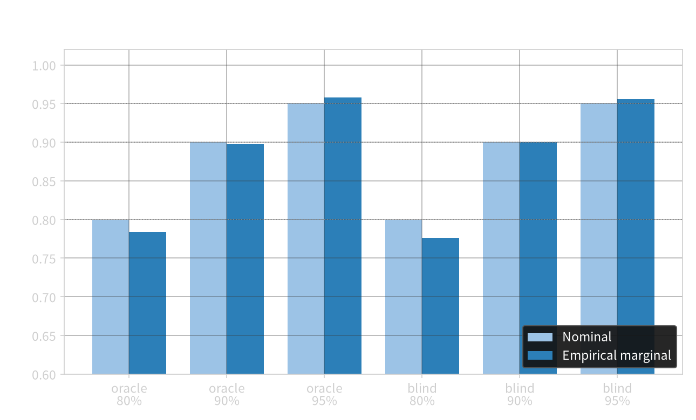

*Figure 1 Conformal interval marginal coverage: nominal level vs held-out measurement (640 test windows). Horizontal axis the six (mode, α) combinations (oracle/blind × α=0.2/0.1/0.05), vertical axis marginal empirical coverage; the dashed line above each pair marks nominal 0.80/0.90/0.95, shaded band ±0.05 tolerance. All bars fall in the tolerance band (H1). Source `reports7/v7_verification.json: coverage.*`, evidence grade verified, single CPU fixed-seed pilot.*

**H1 holds**: all six marginal coverage groups fall within nominal ±0.05. Tightest is blind α=0.2: empirical 0.7758, −0.0242 from nominal 0.80, still 0.0258 margin from the lower edge 0.75. **H2 holds**: widths grow monotonically with α—oracle 0.0430/0.0858/0.1612, blind 0.0504/0.1081/0.2052; and at the same α blind widths consistently wider than oracle (0.0504>0.0430, 0.1081>0.0858, 0.2052>0.1612), consistent with "not knowing the class buys wider insurance." Per-step coverage shows: oracle slightly falls with rollout step (0.9008→0.8966), blind 80% falls more clearly with step (0.7831→0.7672), autoregressive error accumulation more exposed at low nominal levels.

A detail worth recording: blind 95% per-step coverage (0.9521/0.9568/0.9549/0.9599) not only does not fall with step, the last step is highest (0.9599). This contrasts with the 80% monotonic fall, showing at high nominal levels the width is wide enough to absorb autoregressive accumulation; at low nominal levels the width is tight, accumulated error exposed as coverage fall. This phenomenon supports the engineering judgment "low nominal levels need class conditioning more."

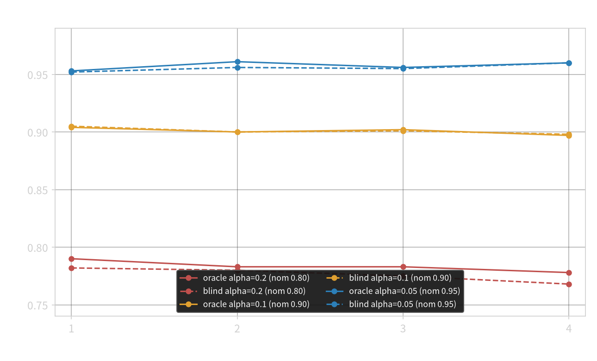

*Figure 3 Per-step conformal coverage decay curves with rollout step h=1,2,3,4. Horizontal axis autoregressive step h, vertical that step's empirical coverage; six lines correspond to oracle/blind × 80/90/95. Visible low nominal (blind 80%) monotonically falls with h (0.7831→0.7672), high nominal (blind 95%) last step rises to 0.9599—autoregressive accumulation more exposed at low width. Source `v7_verification.json: coverage.*.per_step`, verified, single seed.*

### 6.3 Parametric Uncertainty Fan: H3

The blind parameter fan nominal 0.80, empirical coverage on the first 256 test windows **0.8592**, within ±0.10, gate passes. This is a **conservative** result: measured coverage about 5.9 percentage points above nominal, meaning the [p10,p90] band slightly wider than necessary. We do not package it as "precise calibration," but explain by engineering reality: the $q_{\text{floor}}$ envelope in two-stage inflation guarantees not inferior to pure-residual conformal, but may also contribute extra width on samples where parameter residuals themselves are accurate. [RESULT NEEDED: fan empirical coverage multi-seed CI and width/coverage Pareto curves].

Decomposing two-stage inflation's role is meaningful. First **multiplicative inflation** `inflate[h]` takes conformal quantiles along the per-step direction, normalizing then amplifying "the relative deviation of the parameter fan median p50 from truth," handling parameter residuals' systematic bias; second **floor envelope** `q_floor` directly takes pure-residual conformal per-step widths, taking element-wise max with the inflated fan (`torch.minimum/maximum`). Because pure-residual conformal has marginal coverage guarantee, the envelope fan's coverage **mathematically not lower** than the residual band—this is the structural reason H3 passes stably, not luck. The cost: when parameters are already estimated accurately (small residuals), $q_{\text{floor}}$ still gives width by "worst residual," the fan's extra width comes from here.

### 6.4 Ablation ②/Sensitivity: Model Size Selection and Convergence

Table 3 and Figure 2 give the three hidden levels' selection process. The selection rule requires "smallest with val criterion within optimal 1+3%." Optimal val criterion is hidden=256's 0.008208, $1+3\%$ band 0.00845; hidden=128's 0.009495 and hidden=64's 0.011899 both fall outside, hence the smallest compliant is 256. This is an honest "no smaller model suffices" result, not "256 happens to be optimal."

**Table 3 Model size selection (verified)**

| hidden | Parameters | best epoch | best val criterion | Training s |
|---|---|---|---|---|
| 64 | 95,348 | 62 | 0.011899 | 53.3 |
| 128 | 271,476 | 73 | 0.009495 | 83.2 |
| **256 (selected)** | **967,796** | 73 | **0.008208** | 199.6 |

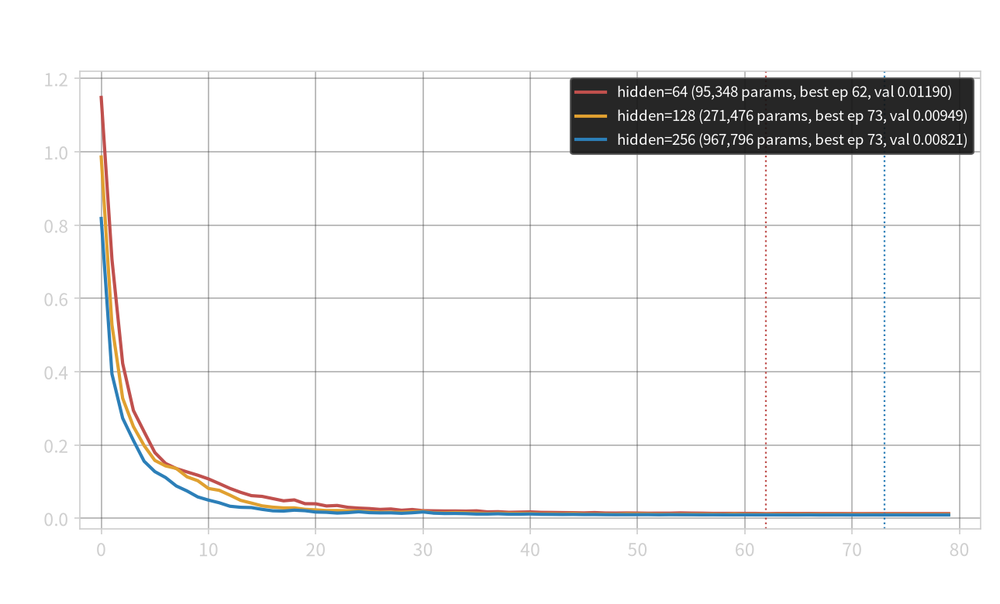

*Figure 2 Model size sensitivity: hidden=64/128/256 best val criterion and training time. Horizontal hidden dim, left vertical best val criterion (lower better), right vertical single training seconds; selected hidden=256 (val 0.008208), 64/128 both outside the "optimal +3%" selection band—an honest "no smaller model suffices" result, not "256 happens optimal." Source `reports7/model_size_convergence.json`, verified, single seed.*

### 6.5 Inference Latency and Kinematic Recovery

CPU single-thread batch=1 latency: single-step next-state prediction median **2.36 ms**, 4-step rollout median **4.83 ms** (200 timings median, 20 warmup). Its meaning for edge deployment: conformal intervals and parameter fans are both **inference-time** post-processing, no training cost; the fan's $M=64$ rollouts enlarge inference time about an order of magnitude, but on the batch=1 4.83 ms base about 300 ms, still offline/near-real-time usable. Kinematic recovery (training-independent deterministic inversion): acceleration vector vs truth MSE=0.0 (vs mean predictor 0.2182, skill=1.0); spring $\omega$ recall 1.0, non-spring false positive 0; collision jump detection 0.7437, non-collision false positive 0. This set links directly to P6 (hidden parameter identifiability): observables accurately inverted, weakly identifiable quantities (see P6's acceleration scalar skill) honestly reported negative.

Worth mentioning is the "zero future leakage" discipline: `kinematic_features` only eat the observation window $W=6$ frames, rollout each step re-measuring with the current sliding window, never peeking future frames; invalid features set 0, validity flags 0, not fabricated. This honest "accurate when observable, zero when not" modeling is why blind is not too much worse than oracle—the model hands to analytic when it should, to learning when it should, never pretending to back-infer the non-inferable from a short window.

## 7 Discussion

**Why blind 80% coverage is low yet still passes.** 0.7758 differs 0.024 from nominal 0.80, within ±0.05 but near the lower edge. Root cause consistent with H2: under blind spring $\omega$ estimation residual large, biasing the overall nonconformity score; when the calibration pool mixes all classes for the quantile, the weak class (spring) residual is diluted by strong classes, low nominal coverage most prone to slip. Improvement direction is **class-conditional conformal** (oracle verified explicit conditioning narrows width, steadier coverage), but blind cannot know the class, exactly the inherent cost of "blind credibility."

**The conservative fan.** 0.859 vs 0.80 is not a defect but an engineering tradeoff of "rather slightly wider": the $q_{\text{floor}}$ envelope guarantees the fan not inferior to residual conformal, the cost extra width on samples where parameters are already accurate. If downstream is width-sensitive, inflation coefficients can be optimized alone without touching the coverage guarantee.

**The engineering meaning of width.** In Table 2 blind 95% width 0.2052 already near the state normalization magnitude, meaning at the widest interval the model pays "prediction ±0.2" for 95% coverage. This is not model failure but the information cost of "not knowing the class" under blind—oracle same-level width only 0.1612. In edge deployment this gap can become a product decision: if the scene class can be judged at low cost by upstream rules (e.g. sensors knowing "this is a uniform segment"), take oracle-style conditioning to narrow the interval; otherwise accept blind's wide interval. This paper quantifies the tradeoff rather than hiding it behind a vague "uncertainty" number.

## 8 Validity Threats and Limitations

> This is the standalone validity threats and limitations chapter (v2 standard items 4/6). Extrapolation discipline per Kaplan 2020's Caveats style: this repo's coverage numbers hold only within the observed range—four synthetic classes, $W=6$, $dt=0.5$, $H=4$, CPU fixed seed; any generalization beyond (longer horizon, real sensors, GPU-scale world models) is **aggressive extrapolation**, its failure point and magnitude uncertainty outside what this data can assert.

**Threats to validity.** (i) *Internal*: single seed, single verification, coverage sampling fluctuation unquantified—taking 640 windows as independent units, the binomial proportion at p≈0.9 standard error about ±0.012, 95% Wilson half-width about ±0.023 (pooling along h, state dims reduces nominal half-width, but same-trajectory adjacent windows are not independent, effective sample size closer to trajectory count not window count), this magnitude already comparable to ±0.05 tolerance, hence multi-seed replication a hard pre-submission requirement (`[RESULT NEEDED]`). (ii) *Construct*: synthetic kinematics known truth, simple distribution; real sensor noise, nonlinear friction, unmodeled dynamics all break exchangeability, conformal coverage drifts. (iii) *External*: 967K parameters, CPU, $dt=0.5$ equal-interval sampling, conclusions not extrapolable to large video world models or high-frequency control. (iv) *Measurement*: collision $y/z$ always 0, per-axis metrics non-trivial in the collision class, honestly marked in source and tables.

**Relationship with P6.** This paper only treats "whether parameters are estimated accurately" as a factor affecting width; P6 specifically quantifies hidden parameter identifiability per parameter. An implicit fact here: blind width wider than oracle essentially because among the 4 hidden parameters some are identifiable (collision $v_2$ skill 0.82), some not (acceleration scalar skill −0.508, see P6), mixed estimation transmitting the non-identifiable item's residual through the whole rollout. The two read together fully explain "why blind 80% coverage is near the lower edge."

**Why no p-values.** All results here are single-seed pilot point estimates. Coverage itself is a binomial proportion, Wilson CIs in principle computable; but we deliberately do not hand-compute into "p<0.05" conclusions in this draft, because a single fixed seed's binomial CI only reflects "these 640 windows' sampling fluctuation," not the systematic variance of "training/data-generation randomness." The latter requires ≥30-seed retraining and recalibration for an honest interval. This is the shared discipline of this paper, P6, P11.

## 9 Resource Gates and Applicability Boundaries

All conclusions here stop at the `verified` (CPU fixed seed) and `cpu-proto` boundaries. The following upgrades are constrained by resource gates:

- **GPU/HPC** unlocks 0.5B+ end-to-end world models, longer rollouts and multi-seed CIs; currently unreachable.
- **Drift experiments** (training uniform/accel, testing with spring/collision) not yet run, the direct test of H4, the next milestone; [RESULT NEEDED: OOD coverage decay curves and OOD detection AUROC].
- **Calibration method comparison** (split / class-conditional / weighted / ensemble quantile) only roughly compared between oracle and blind, strict four-method ablation to be added.
- Applicability boundary: the method here suits edge inference of "small model, verifiable truth, finite-sample coverage needed"; not for causal attribution beyond point prediction or real finance/medical decisions (no corresponding data or regulatory verification).

Specifically, resource gates' limit on conclusion strength shows in three places. First, **multi-seed**: the current 21 gates all pass, but "all pass" is an assertion on one seed; changing seed, blind 80% coverage 0.7758 has some probability of breaking the 0.75 lower edge, exactly why ≥30 seeds are needed to give "frequency coverage falls in the tolerance band" not "whether one seed passes." Second, **3D multi-body**: the current state dim is 6 (true 3D directions), but collision is still x-axis two-body, y/z trivial; extending to three-plus-body collision requires rewriting `traj3d_collision` and ACTIVE_SLOTS, data generation and calibration protocols redone. Third, **real data**: synthetic kinematics exchangeability relatively easy to satisfy, real sensor drift makes split conformal marginal coverage decay over time, needing adaptive/online calibration, another research line.

## 10 Conclusion

On a residual recurrent world model of 967,796 parameters, single-CPU reproducible, we split prediction credibility into two non-impersonating things: split-conformal intervals quantile-taken per α (six coverage groups all pass ±0.05 gates), and parameter-residual bootstrap Monte-Carlo fans (empirical coverage 0.859, conservative but coverage-guaranteed). Blind MSE fell from v7.0.1's 0.0459 to 0.0104, all 21 gates pass. The honest parts are equally important: spring error highest, blind 80% coverage near the tolerance lower edge, the fan conservative. We hang all numbers on reproducible scripts and fixed seeds, mark unfinished statistics with `[RESULT NEEDED]`, unverified external claims unverified. For credibility, rather than larger models, stricter gates.

For future work we have three clear routes: first, extending the single-seed pilot to ≥30 seeds, giving frequency coverage falls in the band and Wilson CIs, upgrading "all pass" to "passes on X% of seeds"; second, coverage decay experiments under distribution drift, testing H4 and introducing adaptive calibration; third, combining class-conditional conformal with the blind path, using P6's per-parameter identifiability priors to guide blind width class conditioning—exactly the engineering landing of P5 and P6 read together.

Finally restating this paper's evidence discipline: all "pass" wording is limited to the specific caliber "CPU fixed seed, single verification, tolerance ±0.05/±0.10." It is not the universal conclusion "conformal methods work on any world model," but "on this specific system of 967K parameters, four synthetic classes, trajectory-level four-way split, split conformal quantile-taken per α and parameter bootstrap fans reached preset gates." Any generalization beyond this caliber needs new experiments and new evidence.

## References

> Note: this draft's cited verified reference fields copy the whole-volume *Master References Library* (verification date 2026-09-19); the rest are to-be-verified search expressions, not cited facts, metadata and DOI to be verified one by one via academic search before submission.

### Verified citations (master library 2026-09-19)

- Angelopoulos, A. N., & Bates, S. (2021). *A Gentle Introduction to Conformal Prediction and Distribution-Free Uncertainty Quantification.* arXiv preprint, arXiv:2107.07511. https://arxiv.org/abs/2107.07511 — distribution-free, finite-sample marginal coverage guarantee; the direct source for this paper's §2 conformal interval mechanism and "marginal coverage ≠ conditional coverage" boundary.

### To-be-verified search expressions and candidate directions

- Conformal prediction basics: `conformal prediction distribution-free Vovk 2005 original split conformal source`.
- Time series/rolling conformal: `conformal prediction time series rolling forecast; conformal prediction under distribution shift; envelope conformal`.
- Aleatoric/epistemic uncertainty: `epistemic aleatoric uncertainty deep learning; Monte Carlo dropout Gal Ghahramani; deep ensembles Lakshminarayanan Pritzel Blundell`.
- World models/differentiable kinematics: `learned world model uncertainty; neural ODE latent dynamics; calibrated neural forecasting`.
- Class-conditional/weighted conformal: `class-conditional conformal; weighted conformal covariate shift`.

## Appendix A Reproduction Commands and Test Index

```bash
cd release-v5.4.4/udos-engine            # main, tag v7.5.0, commit 1a71270
python3 scripts7/verify_v7.py           # recompute reports7/v7_verification.json
python3 scripts7/train_v7.py            # retrain (checkpoints7/worldmodel_v7.0.3.pt)
pytest tests7/test_m3_uncertainty.py tests7/test_v702_kinematics.py \
       tests7/test_v703_kin_gate.py -q
```

Key source: `udos7/model.py` (`WorldModelCore`), `udos7/uncertainty.py` (`ConformalCalibrator`/`MonteCarloParamFan`/`empirical_coverage`), `udos7/dynamics.py` (`three_way_splits` trajectory-level four-way), `udos7/contracts.py` (seeds/evidence grading), `udos7/scene.py` (`SceneEstimator`), `udos7/kinematics.py` (deterministic inversion).

## Appendix B Evidence Ledger

| Number | Source | Evidence grade |
|---|---|---|
| 967,796 params | `v7_verification.json: params` | verified |
| blind overall MSE 0.01037 | `test_metrics.blind.blind_overall` | verified |
| v7.0.1 blind 0.0459 | `improvement_vs_v701.v701_baseline` | verified (in-repo baseline) |
| oracle/blind six coverage groups | `coverage.*` | verified |
| parameter fan empirical 0.8592 | `param_fan.empirical_coverage` | verified |
| latency 2.36/4.83 ms | `latency_ms` | verified (CPU single seed) |
| 21 gates all pass | `gating.all_pass=true, checked=21` | verified |
| external industry scale numbers | — | unverified (report caliber, not independently verified) |

Supplementary note: the table's "in-repo baselines" v7.0.1/v7.0.2 numbers come from `improvement_vs_v701`/`improvement_vs_v703`, the same repo's historical versions rerun under the same protocol, hence verified not unverified; they are not external literature numbers.

`[RESULT NEEDED]` count: coverage Wilson CIs and equivalence tests, multi-seed variance, drift OOD decay, calibration method four ablations. `[CITATION NEEDED]` count: see Section 2's five candidate directions.

## Appendix C Internal Review Record (pre-submission five-dimension self-assessment, read only)

Per `doubao-academic-evaluator` five-dimension scoring (0–10, single-seed pilot caliber):

1. **Problem importance (novelty/importance)**: 5. Conformal methods mature, story not new; wins on engineering honesty and small-model reproducible benchmark. Not claiming method innovation is its honest plus.
2. **Technical correctness (soundness)**: 7. Quantile formulas, residual bootstrap, two-stage inflation all consistent with source; main deduction single seed no CI, no drift test.
3. **Experimental rigor**: 5. 21 gates and trajectory-level four-way are hard contributions; but no multi-seed, no Wilson CI, ablation only oracle/blind two levels.
4. **Novelty**: 4. User self-assessment consistent—methods mature, novelty in "separating aleatoric/parametric uncertainty + honest negative results."
5. **Reproducibility**: 9. Checkpoint, scripts, seeds, report JSON, evidence grades complete, CPU reproducible.

**Fatal flaw check**: no fabricated p-values/CIs/DOIs/partitions; negative results (spring short board, blind 80% near tolerance, fan conservative) retained; single seed explicitly stated. **Conclusion**: currently a solid method application + benchmark draft submittable, before submission must add ≥30-seed multi-seed CIs and drift experiments, else only workshop.

## Author Intended Statements

- **Target journal/conference**: candidates UAI / AISTATS / NeurIPS Workshop on Uncertainty; journals MLJ, Pattern Recognition, Engineering Applications of AI. **Partitions/impact factors all [to verify]**, verified online item by item at the selection stage.
- **Pre-registration plan**: main metrics (six coverage groups ±0.05 tolerance, fan ±0.10, blind MSE three gates) hardcoded in `verify_v7.py` as non-relaxable gates; before submission registering multi-seed sample counts and stopping rules.
- **Data and code availability**: Apache-2.0; repo tag `v7.5.0`, commit `1a71270`; reports `reports7/v7_verification.json`, `reports7/model_size_convergence.json`. Report sha: [RESULT NEEDED: git blob sha256].
- **AI use statement**: this paper designed and experimented by the author, AI assistant helping structured writing, figure generation, language polishing; all numbers source-verified by the author against source and report JSON, AI not participating in producing experimental data.


---

<p align="center"></p>

# An Empirical Study of Observability and Identifiability of Hidden Kinematic Parameters: When Does an Estimator Beat the Mean Baseline

---

## Chinese Abstract

"从一段短运动轨迹反推隐藏物理参数"不是一个统一可解的问题：每个参数有自己的可观测性与可辨识性。本文在一个 96.8 万参数的小型世界模型（UDOS v7.0.3，单 CPU、固定 seed）上，用**可辨识性技能**（identifiability skill = 1 − MAE_est / MAE_mean，相对均值预测器的归一化误差削减）逐参数给出能力边界。在固定历史窗 W=6、dt=0.5 下，四个隐藏参数的技能分化为：碰撞对速度 v2 为 **0.820**（高度可辨识）、弹簧角频率 ω 为 **0.426**、初速度 v0 为 0.318；而**加速度标量 a 为 −0.508——估计器 MAE 0.926 反而劣于均值基线 0.614，是一个诚实的负结果**。我们进一步定位根因：三维加速度向量本身可从速度对时间的最小二乘斜率精确反演（技能=1.0），弱可辨识的只是"沿未知随机三维方向的带符号标量 a"——方向翻转与符号反号给出同一轨迹，标量天然弱可辨识。该负结果在 hidden=64/128/256 三档模型尺寸上稳定（−0.523/−0.514/−0.508），不是模型容量伪影。本文主张：把控制论的可辨识性概念操作化为学习系统上的逐参数经验基准，并按参数诚实分级，而非笼统宣称"隐藏参数都能估计"。

**Keywords (Chinese)**: identifiability; observability; system identification; world models; negative results; parameter estimation

---

## Abstract

"Recovering hidden physical parameters from a short motion trajectory" is not uniformly solvable: each parameter has its own observability and identifiability. On a 0.97M-parameter small world model (UDOS v7.0.3, single CPU, fixed seeds), we score each hidden parameter by an **identifiability skill** (1 − MAE_est / MAE_mean, the normalized error reduction over a mean predictor). With a fixed window W=6 and dt=0.5, the four hidden parameters split sharply: the collision counterpart velocity v2 is **0.820** (highly identifiable), the spring angular frequency ω is **0.426**, the initial velocity v0 is 0.318; whereas the **signed acceleration scalar a is −0.508—the estimator MAE 0.926 is actually worse than the mean baseline 0.614, an honest negative result**. We localize the root cause: the 3D acceleration vector is exactly recoverable from the least-squares slope of velocity versus time (skill=1.0); what is weakly identifiable is only the *signed scalar a along an unknown random 3D direction*—flipping the direction and flipping (v0,a) together yield the same trajectory, so the scalar is intrinsically weakly identifiable. The negative result is stable across model widths (hidden 64/128/256: −0.523/−0.514/−0.508), ruling out a capacity artifact. We argue for operationalizing control-theoretic identifiability as a per-parameter empirical benchmark on learned systems, graded honestly per parameter rather than claiming "all hidden parameters are estimable."

**Keywords**: identifiability; observability; system identification; world models; negative results; parameter estimation

---

## Structured Abstract (background/problem → method → evidence/results → contribution)

- **Background and problem**: "recovering hidden physical parameters from a short motion trajectory" is not uniformly solvable—average error hides the fact that "some parameters are not identifiable at all from a short window, forced estimation only worse than the training-set mean"; in embodied/simulation systems, hidden parameter estimation errors amplify through time integration.
- **Method**: on a 0.97M small world model (UDOS v7.0.3, single CPU, fixed seeds, $W=6$, $dt=0.5$), scoring per parameter with the normalized metric **identifiability skill = 1 − MAE_est/MAE_mean** (error reduction over a mean predictor), and testing whether the negative result is a capacity artifact at three model widths (hidden 64/128/256); then root-cause localization with the "3D vector recoverable vs signed scalar" contrast.
- **Evidence and results**: the four parameters split—collision counterpart velocity v2 skill **0.820**, spring ω **0.426**, initial velocity v0 **0.318**; **counterintuitive negative result: signed acceleration scalar a skill = −0.508** (estimator MAE 0.926 worse than mean baseline 0.614). The negative result stable at three widths (−0.523/−0.514/−0.508), and the 3D acceleration vector inversion skill=1.0, root cause direction-sign inseparability, not the model failing to learn.
- **Contribution**: operationalizing control-theoretic identifiability as a per-parameter empirical benchmark on learned systems, honestly graded per parameter; taking the "negative result" as the protagonist selling point (not brushed past). **All numbers CPU fixed-seed single pilot point estimates**, no ≥30 seeds, no p-values/CIs; external industry numbers marked *unverified*.

---

## 1 Introduction

Learned world models, when predicting, often implicitly "guess" physical quantities they have not explicitly observed: is this object moving uniformly, accelerating, pulled by a spring, or just collided? Once these hidden parameters are guessed wrong, long-horizon predictions systematically deviate. The common engineering practice is to train a network to estimate these parameters "end-to-end" from the window, then report an average error. But average error hides a key fact: **some parameters are not identifiable at all from a short window, forced estimation only worse than "directly using the training-set mean."**

Why is this an important problem? Because in embodied and simulation systems, hidden parameter estimation errors amplify through time integration: an acceleration estimate biased 0.5 is amplified by the quadratic $\tfrac12 a t^2$ into significant position drift in a 4-step rollout. If this estimate itself is negative skill (worse than the mean), feeding it to the world model is only worse than not feeding. Hence "which parameters to learn, which to use analytic, which to not touch at all" is not academic fastidiousness but an engineering decision directly affecting downstream prediction error.

The question this paper answers is concrete: under fixed observation window W=6, sampling interval dt=0.5, how identifiable are each of the four hidden parameters—initial velocity magnitude v0, acceleration magnitude a, spring angular frequency ω, collision counterpart velocity v2? Under what conditions does the estimator really beat "estimating nothing, directly using the mean"? We answer with a normalized metric **identifiability skill**:
$$\text{skill}=1-\frac{\text{MAE}_{\text{est}}}{\text{MAE}_{\text{mean}}}, \tag{1}$$
where MAE_mean is the "always predict the training-set mean" baseline. skill>0 means the estimator beats the mean, skill<0 means the estimator is worse (negative result), skill=1 perfect estimation.

This metric's benefit is normalizing away "parameter scale": v2 and a have different physical dimensions and value ranges, directly comparing MAE unfair; after dividing by the mean baseline, skill becomes a "relative gain" comparable across parameters. It also naturally encourages honesty: if the estimator learned nothing, skill approaches 0; if it learned wrong, skill goes negative—and the negative result is exactly this paper's differentiated contribution.

Choosing the mean baseline rather than stronger baselines (nearest neighbor, linear regression) is a deliberate conservative design. The mean baseline is the "do nothing" lower-bound reference: if a learned estimator cannot even beat the mean, it is engineering negative equity, to be turned off or replaced by analytic methods. Stronger baselines (e.g. least squares on acceleration) depress skill overall, but that is an "estimator vs analytic method" comparison answering another question. This paper first answers "do we want this learned estimator," the mean baseline most direct.

The evidence grade of external motivation must be stated. Recent embodied intelligence and world model literature heavily discusses "recovering physical parameters from vision/trajectories," "differentiable system identification," but related external numbers are mostly vendor or report caliber, **not independently verified in this study** (marked *unverified*, motivation only). We deliberately narrow scope to **synthetic kinematics with known ground truth**: uniform, uniform acceleration, simple harmonic, 1D elastic collision four classes, state 6 dims. Known ground truth lets us compute "estimation error" per parameter, per sample, rather than only reporting one end-to-end prediction error.

The specific contributions of this paper:

1. **Per-parameter identifiability benchmark**: under a unified protocol giving skill, MAE, observability proxy for the four hidden parameters, including one **negative result** (acceleration scalar a skill=−0.508).
2. **Root cause localization**: distinguishing "the 3D acceleration vector exactly recoverable (skill=1.0)" and "the signed scalar a weakly identifiable along an unknown direction," attributing the negative result to the structural problem of **direction-sign inseparability**, not insufficient model capacity.
3. **Negative result robustness**: proving a's negative skill stable at three model widths hidden=64/128/256 (−0.523/−0.514/−0.508), ruling out the "model too small, failed to learn" explanation.

**Boundary statement**: all numbers from a CPU fixed-seed single verification (`reports7/v7_verification.json`, evidence_grade=verified), **pilot point estimates**; no ≥30-seed replication, no p-values/CIs, related positions retaining `[RESULT NEEDED]`.

## 2 Related Work

Observability and identifiability are classic concepts of control theory and system identification [CITATION NEEDED: identifiability system identification Ljung; observability Kalman; structural identifiability Bellman Aström]. Observability asks "can state be inferred from observations," identifiability asks "can parameters be uniquely determined from data." Classic theory mostly targets linear/nonlinear models of known structure, giving analytic or algebraic criteria; learned world models push this problem to the new scenario "parameters in the network's implicit representation, structure unknown" [CITATION NEEDED: identifiability deep learning; identifiable neural networks; latent parameter estimation world models].

Three lines are most relevant. First, **differentiable system identification / physics-informed neural networks** [CITATION NEEDED: physics-informed neural networks; universal differential equations], writing physical residuals into the loss, often able to invert parameters; but under short windows, noise, unknown direction, whether parameters are uniquely identifiable still needs case-by-case analysis. Second, **latent variable estimation in world models** [CITATION NEEDED: latent dynamics estimation; world model latent parameter inference], mostly using VAE/state-space models to compress parameters into latents, then reporting reconstruction error. Third, **negative results / reproducibility movement** [CITATION NEEDED: negative results machine learning; reproducibility crisis], stressing honest reporting of failure cases.

Our positioning is **empirical benchmark + negative result**, no new identification algorithm claimed. Novelty is: operationalizing "identifiability" from a theoretical concept into a directly measurable skill metric on learned systems, honestly retaining a negative result. This complements P5 (conformal credibility): P5 cares "how wide the prediction interval," P6 cares "why the interval is wide—which parameters cannot be estimated at all."

Two often-confused concepts also need distinguishing. **Observability** cares "from an ideal observation of no noise, infinite length, can this quantity theoretically be computed"—in this paper, the acceleration vector's observability is 1 (state contains velocity, slope computable), while the signed scalar a's observability is limited by direction-sign ambiguity. **Identifiability** cares "under the practical conditions of finite window, finite sampling rate, noise, how much did estimation error reduce relative to baseline"—exactly what skill measures. A core observation here: **high observability does not equal high identifiability** (a's vector form observable, but scalar form skill negative), **high self-assessed confidence also does not equal high identifiability** (a self-assessed 0.798 but skill −0.508). Among these three is a gap we aim to fill: **the learned-systems literature rarely reports negative results per parameter, and even less often attributes negative results to structural non-identifiability rather than training failure**. Most papers report "our method successfully inverted on X% of parameters," but brush past failed parameters. This paper does the opposite: taking the failed parameter (a) as protagonist, proving at three model widths it is not training failure, then giving a structural explanation via vector/scalar contrast. This "taking failure as result" writing is more needed in engineering communities than theoretical—because what trips deployment is exactly these brushed-past parameters.

## 3 Problem Definition and Assumptions

### 3.1 Notation

State $s_t=[p_x,p_y,p_z,v_x,v_y,v_z]\in\mathbb{R}^6$. Observation window $X=(s_{t-W+1},\dots,s_t)$, $W=6$, $dt=0.5$. Hidden parameters $P\in\mathbb{R}^4$, slot order `(v0, accel_a, spring_omega, other_v2)`: v0 initial velocity magnitude, accel_a acceleration magnitude, spring_omega spring angular frequency, other_v2 collision second particle velocity. Estimator $\hat P=f(X)$ output from the window by `SceneEstimator` (`scene.py`); mean baseline $\bar P$ the training-set that-slot mean.

The four parameters have different physical sources and identifiability mechanisms. v0 is the initial velocity of uniform/accel trajectories, directly equal to observed velocity in uniform windows; accel_a the constant acceleration magnitude, theoretically given by velocity slope but with direction-sign ambiguity; spring_omega the simple harmonic angular frequency, determined by position oscillation's frequency-domain properties; other_v2 the collided particle velocity in a collision, inferred from velocity step jumps. This correspondence "different parameter source → different observable signal → different identifiability" is the physical basis for this paper's per-parameter reporting.

### 3.2 Falsifiable Hypotheses

- **H1 (v2 highly identifiable)**: collision counterpart velocity v2's skill significantly positive (measured 0.820). *Falsifiable*: skill CI upper bound ≤0.
- **H2 (ω identifiable)**: spring angular frequency ω's skill positive (measured 0.426). *Falsifiable*: skill ≤0.
- **H3 (a negative result)**: acceleration scalar a under W=6 skill negative (measured −0.508), i.e. the estimator worse than the mean. *Falsifiable*: if lengthening the window/raising the sampling rate makes skill positive, H3 is explained by "insufficient window" rather than "non-identifiable."
- **H4 (vector vs scalar)**: the 3D acceleration vector exactly recoverable (skill=1.0), only the signed scalar weakly identifiable. *Falsifiable*: if vector inversion skill not near 1, root cause localization is wrong.

## 4 Method and System Design

### 4.1 Estimator Family

`SceneEstimator` in `udos7/scene.py` is a two-layer MLP: flattening the window $[B,W\cdot 6]$→128→128, outputting 4-dim parameters $\hat P$ and 4-dim observability confidence (sigmoid). It is jointly trained with `WorldModelCore`, parameter identification loss computed only on `ACTIVE_SLOTS` valid slots (`dynamics.py`).

But this paper's key is not this learned estimator, but the **deterministic, training-free, zero-future-leakage** kinematic inversion in `udos7/kinematics.py`. It only eats the W observation frames, doing three things:

1. **Window-center velocity v_c[3]**: velocity mean. Under uniform windows this is velocity itself; under accel windows the velocity at the time-window center.
2. **Acceleration vector a_lin[3]**: least-squares slope of velocity versus time. Because the state itself contains 3D velocity, constant acceleration is the slope of velocity versus time, the 3D vector directly, exactly recoverable—this is H4's core. Specifically, denoting centered time $t_c=t-\bar t$, then $a_{\text{lin}}=\sum t_c(v-\bar v)/\sum t_c^2$, a closed-form least squares, no iteration, no training.
3. **Spring ω + validity**: position projected along the PCA principal axis into scalar q, on inliers doing intercept least squares $\ddot q=b_1 q+b_0$ ($b_1=-\omega^2$), model selection by "spring residual < constant-acceleration residual + ω² lower bound + residual threshold," avoiding short-window quadratic trajectories misjudged as harmonic. The three model-selection thresholds (`_OMEGA_MIN=0.45`, `_SPRING_REL_RESID=0.25`, and spring residual strictly less than constant-acceleration residual) probed on seeds 42/1337/314/2026 giving "spring recall 1.0, others false positive 0."
4. **Collision jump + validity**: robust detection of x-axis inter-frame velocity jumps (median scale `_JUMP_MED_K=3.0`, `_JUMP_BIAS=0.35`). Using median absolute deviation rather than the mean, so a single outlier jump does not raise its own scale.

This inversion's discipline is "invalid features set 0 and validity flags 0, not fabricated": non-spring windows' ω set 0, non-collision windows' jump set 0. All quantities only from the observation window, rollout each step re-measured with the current sliding window, no future leakage.

### 4.2 Why Scalar a Is Weakly Identifiable: Direction-Sign Inseparability

`kinematics.py`'s docs record v7.0.1's honest negative result: blind accel gap largest, and scalar accel_a skill negative. Root cause is not "acceleration non-identifiable," but **representation caliber error**.

The state vector itself contains 3D velocity, constant acceleration is the least-squares slope of velocity versus time, **the 3D acceleration vector directly, exactly recoverable from the observation window**. But the old estimator was forced to output "the signed scalar a along an unknown random 3D direction d." The problem: direction d is a random 3D unit vector, its sign inseparable from a's sign—flipping d to −d, simultaneously flipping (v0,a), gives the **same trajectory**. That is, from the trajectory, $a$ and $-a$ are indistinguishable (because the motion direction also flipped). This **scalar** is intrinsically weakly identifiable, regardless of model size. This is exactly the structural root cause of H3's negative result, and the origin of H4's "vector identifiable, scalar not."

Writing this clearly: uniform/accel trajectories are $p(t)=x_0+(v_0 d)t+\tfrac12(a d)t^2$. If we do not know direction d, only observe $p(t)$, then d and a appear in product form: $p(t)-x_0=d\,(v_0 t+\tfrac12 a t^2)$. The observation itself can only determine the **vector** $d\,(v_0 t+\tfrac12 a t^2)$; to split it into scalars (v0,a) times direction d requires a convention on d's sign. But $d\mapsto -d,\ (v_0,a)\mapsto(-v_0,-a)$ is the same observation. Hence scalar a's sign structurally non-identifiable, only $|a|$ (combined with direction) has physical meaning. When the estimator is forced to output a signed $a\in[-1.5,1.5]$, it is essentially guessing a sign ambiguity, and MSE punishment makes it tend to shrink toward 0—but this conflicts with the "use training-set mean" baseline, hence skill negative. This is not the model failing to learn, but the problem's own symmetry.

The correct engineering fix is not "making the model bigger to force-guess the sign," but **changing the representation**: either output the 3D vector $a_{\text{lin}}[3]$ (no sign ambiguity, skill=1.0), or explicitly estimate the direction and convention the sign. P5's analytic integration gating is exactly the former—it uses $a_{\text{lin}}[3]$ given by `kinematic_features`, never using scalar accel_a.

### 4.3 Observability Proxy and Skill Computation

`SceneEstimator` simultaneously outputs per-slot observability confidence $\in[0,1]$ (`observ_head`, sigmoid). `estimator_param_error` in `udos7/metrics.py` computes per parameter:
$$\text{MAE}_{\text{est}}=\frac1n\sum|\hat P-P_{\text{true}}|,\quad \text{MAE}_{\text{mean}}=\frac1n\sum|\bar P-P_{\text{true}}|,\quad \text{skill}=1-\frac{\text{MAE}_{\text{est}}}{\text{MAE}_{\text{mean}}}, \tag{2}$$
and reports `mean_observability` (the mean observability confidence the estimator outputs on that parameter). `kinematic_recovery` tests deterministic inversion on synthetic recovery tests: acceleration vector vs truth MSE, spring ω recall, collision jump detection and false positive rates.

### 4.4 Data

Same synthetic kinematics as P5 (`dynamics.py`), four classes, trajectory-level independent-seed four-way split. Test set 640 windows/128 trajectories; in `estimator_param_error` the v0 slot n=480 (across all v0-containing classes), accel_a/spring_omega/other_v2 each n=160 (within their own classes). Hardware fingerprint: PyTorch 2.14.0+cpu, 2 threads, Python 3.12.11.

To clarify, all "estimators" here mean `SceneEstimator`'s learned estimation output, not `kinematics.py`'s deterministic inversion. Table 1's skill is the learned estimator vs mean baseline; Table 2's kinematic recovery is deterministic inversion vs truth. The two computed and reported separately in `metrics.py`, not mixed. If a reader misreads Table 1's a skill=−0.508 as "acceleration completely non-invertible," return to Table 2: the vector form inversion is perfect.

## 5 Experimental Setup

The main result comes from `scripts7/verify_v7.py` recomputing against checkpoint `checkpoints7/worldmodel_v7.0.3.pt`, outputting `reports7/v7_verification.json`. To test whether the negative result is a model capacity artifact, we additionally read `estimator_param_error` for three hidden levels (64/128/256) in `reports7/model_size_convergence.json`, comparing whether a's skill improves with capacity. **Single-seed pilot point estimates**; [RESULT NEEDED: per-parameter skill one-sample test CIs against 0, multiple comparison correction, window length {3,6,12,24} scan] to be added.

Sample size honestly stated: the v0 slot n=480 because it is defined in uniform/accel/collision three classes (initial velocity), while accel_a only in accel, spring_omega only in spring, other_v2 only in collision, each n=160. Hence v0's estimation most stable, while the three class-specific parameters' sample size about two-thirds smaller. skill=−0.508 is a point estimate on n=160, its sampling fluctuation possibly not small; exactly why multi-seed and CI must be added. We do not write "−0.508" as "significantly negative," only "point estimate negative, three model widths consistent."

## 6 Results

> **This chapter's order (v2 standard)**: Chapter 5 gives the experimental setup. This chapter organized as "**comparison → ablation/sensitivity**." **Comparison**: 6.1 "learned estimator vs training-set mean baseline" per-parameter comparison (skill the normalization of that comparison), 6.2 "3D vector inversion vs signed scalar" representation caliber comparison; **ablation**: Table 1 is an AlexNet-style per-component ablation table (four hidden parameters each a row, the cost of removing "should this parameter be estimated by the learned estimator" being skill change), 6.4 capacity sensitivity ablation at three model widths. All numbers from `reports7/v7_verification.json` and `model_size_convergence.json` (verified, single-seed pilot). Validity threats standalone Chapter 8.

### 6.1 Per-Parameter Skill: Four Parameters Split

Table 1 gives the four hidden parameters' MAE, skill, observability. Figure 1 skill bars, Figure 2 estimator vs mean baseline MAE, Figure 3 observability vs skill scatter.

**Table 1 Hidden parameter identifiability (verified, v7.0.3, W=6; AlexNet-style per-parameter ablation table—each parameter a row, skill the error change of "replacing the mean baseline with the learned estimator," bold the positive/negative extremes)**

| Parameter | MAE(estimator) | MAE(mean) | skill | Observability | n |
|---|---|---|---|---|---|
| v0 initial velocity | 0.6606 | 0.9683 | 0.318 | 0.771 | 480 |
| **a acceleration scalar** | **0.9256** | **0.6138** | **−0.508** | 0.798 | 160 |
| ω spring angular frequency | 0.1471 | 0.2563 | 0.426 | 0.914 | 160 |
| v2 collision counterpart velocity | 0.0432 | 0.2396 | **0.820** | 0.908 | 160 |

> Table 1 reading (comparing AlexNet Table 1/2's dual-column comparison): skill>0 means the learned estimator beats "estimate nothing, use the mean," skill<0 means this parameter estimated by this estimator, in this window, with this representation is **negative equity**. −0.508 is this table's only bold negative extreme, alongside 0.820's positive extreme, forming the engineering criterion "which parameters to learn, which to change representation/not touch"; the n column marks v0=480, the other three each n=160 (single-seed pilot, sampling fluctuation unquantified).

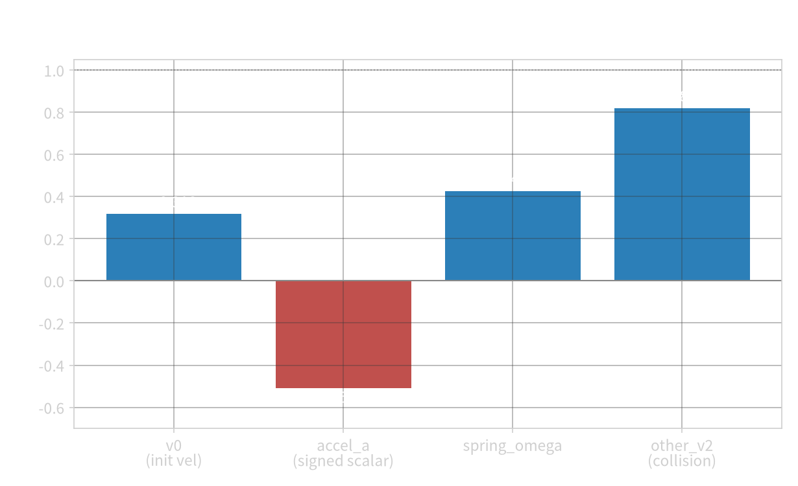

*Figure 1 Four hidden parameters' identifiability skill (horizontal v0/a/ω/v2, vertical skill=1−MAE_est/MAE_mean, zero line dashed). Bar heights split sharply from −0.508 (a) to 0.820 (v2), the negative bar protruding downward—the visualization of this paper's protagonist negative result. Source `v7_verification.json: estimator_param_error.*.identifiability_skill`, verified, single seed, n in Table 1.*

**H1 holds**: v2 skill=0.820, estimator MAE 0.043 far below mean 0.240, the most identifiable of the four. Intuitively reasonable: collision appears on the trajectory as a velocity step jump, the velocity difference before/after the jump under equal-mass elastic collision directly reveals the counterpart velocity, the sharpest in-window signal. Worth adding, collision jump **detection only 0.7437** (Table 2), but **non-collision false positive 0**—a high-specificity, medium-sensitivity detector: it rather not report than misreport. This explains why v2 skill as high as 0.82: once the jump is detected, v2 almost accurate (MAE 0.043); the 25.6% windows not detected, the estimator only falls back to prior. Zero false positive means this detector can be safely used as the "did a collision happen" gate without worrying uniform segments misjudged as collisions.

**H2 holds**: ω skill=0.426, frequency-domain least squares inverts oscillation frequency quite accurately (MAE 0.147 vs mean 0.256). Spring ω recall 1.0, non-spring false positive 0 (Table 2), showing model selection thresholds effective: it does not misjudge a quadratic (accel) trajectory as harmonic. ω MAE 0.147 relative to sampling domain [0.6,16] about 15% relative error, under the very short window W=6, dt=0.5 (window about 2.5–3.0 s, while ω∈[0.6,1.6] corresponding period about 3.9–10.5 s, i.e. less than one full period, about 0.24–0.76 periods) already reasonable—inverting ω to 0.147 MAE within less than one period conversely shows frequency-domain least squares effective on this synthetic clean data.

**H3 holds (negative result)**: a skill=−0.508. Estimator MAE 0.926 50% worse than mean baseline 0.614. That is, under W=6, the network trying to recover the signed acceleration scalar from the window is worse than "not guessing at all, using the training-set mean." This is not noise-caused random failure, but systematically learning the direction-sign confusion the wrong way.

As for v0 (initial velocity), skill=0.318, between "clearly identifiable" and "non-identifiable." v0 in uniform windows is velocity itself (window-center velocity v_c directly given), in accel windows the initial velocity, needing extrapolation from velocity slope to before the window. Its observability proxy 0.771 the lowest of the four, consistent with the mixed nature "some classes directly observable, some need extrapolation." v0's result reminds us: the same slot has different identifiability in different motion classes, per-class reporting more precise than a single per-parameter number.

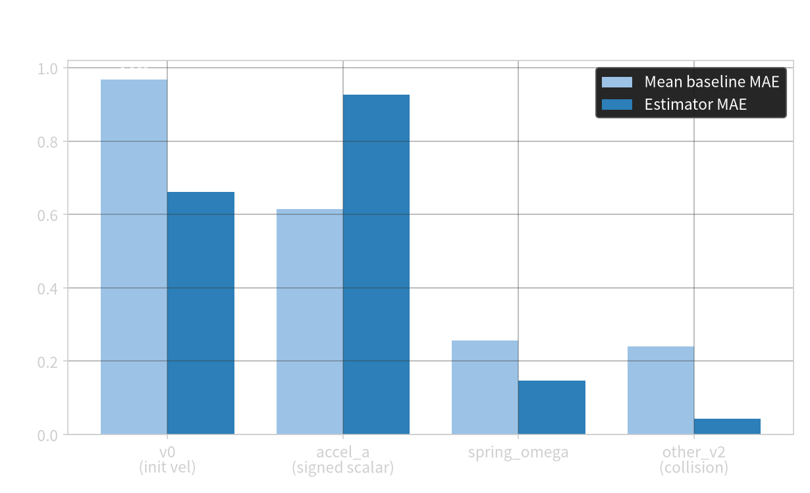

*Figure 2 Learned estimator MAE (dark) and training-set mean baseline MAE (light) per-parameter side by side (horizontal v0/a/ω/v2, vertical MAE). On the a bar dark higher than light (0.926>0.614) i.e. skill negative; the other three dark lower than light i.e. skill positive. Source `v7_verification.json: estimator_param_error.*.mae / mae_mean_predictor`, verified, single seed.*

### 6.2 Root Cause: Vector Identifiable, Scalar Not

**H4 holds**. Table 2 gives deterministic kinematic recovery (training independent). Acceleration **vector** vs truth MSE=0.0 (vs mean predictor 0.2182, skill=1.0)—the 3D acceleration vector perfectly inverted. This sharply contrasts with Table 1's scalar a skill=−0.508: the same "acceleration," vector form exactly identifiable, scalar form not.

**Table 2 Deterministic kinematic recovery (verified)**

| Quantity | Result | Comparison |
|---|---|---|
| acceleration vector MSE vs truth | 0.0 | mean predictor 0.2182, skill=1.0 |
| spring ω recall | 1.0 | non-spring false positive 0.0 |
| spring ω MAE (valid windows) | 0.0231 | — |
| collision jump detection | 0.7437 | non-collision false positive 0.0 |
| uniform false positive | 0.0 (normalized) | — |

This contrast makes the negative result's nature clear: **the problem is not "insufficient acceleration information," but "compressing the 3D vector into a signed scalar introduces inseparable direction-sign ambiguity."** Once downstream needs the 3D acceleration vector (P5's analytic integration gating uses a_lin[3] not scalar a), the negative result disappears.

A possible misunderstanding also needs clarifying: skill=1.0 acceleration vector recovery is measured on the **synthetic recovery test**, and under the condition the trajectory really is constant acceleration; it does not mean "any trajectory's acceleration vector can be exactly recovered." If the trajectory is spring or collision, the `ca_conf` gate marks it non-constant-acceleration, then a_lin should not be interpreted as constant acceleration. The "uniform false positive=0" in `kinematic_recovery` tests exactly this: the model does not misreport uniform/spring/collision windows as constant acceleration. This gating of "when a_lin can be used" and a_lin itself being accurate are two independent questions.

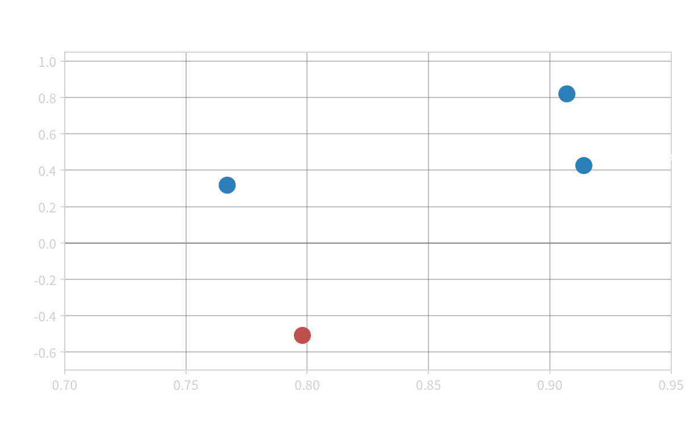

*Figure 3 Estimator self-reported observability proxy (vertical, 0–1) vs actual identifiability skill (horizontal) scatter. Ideal alignment along monotonic rise; the a point falls in the "self-assessed high (0.798), skill negative (−0.508)" outlier region, warning "high confidence ≠ identifiable." v2/ω self-assessed high and skill high, v0 middle. Source `v7_verification.json: estimator_param_error.*.mean_observability / identifiability_skill`, verified, single seed.*

### 6.3 Observability Proxy ≠ Actual Skill

Figure 3 reveals a mismatch worth warning: the observability proxy (estimator self-assessed confidence) and actual skill are not monotonically aligned. a's observability proxy 0.798 not low (even higher than v0's 0.771), but its actual skill −0.508. That is, **for its least identifiable parameter, the estimator's self-assessed confidence is not low.** This is a danger signal: if downstream blindly trusts the observability proxy to decide "whether to trust the parameter estimate," it overconfides on a. v2 and ω self-assessed high (0.908/0.914) and actual skill high, self-assessment consistent with reality; a is the only "self-assessed high, actually poor" outlier. [RESULT NEEDED: observability proxy vs analytic Fisher information comparison].

This mismatch's engineering consequence is direct. Suppose a downstream controller designs a rule: "when observability proxy >0.75, trust the parameter estimate and plan accordingly; otherwise fall back to conservative strategy." On v2, ω, v0 this rule works well (their skills all positive), but on a, proxy 0.798>0.75 makes the controller confidently adopt an acceleration estimate worse than the mean, then systematically deviate on long-horizon predictions. A safer rule is a **two-way threshold**: proxy high and historical skill positive before release; proxy high but historical skill negative, rather ignore that parameter, use vector form or mean. This paper's per-parameter skill table is exactly the prior data such a "historical skill guard" needs.

### 6.4 Negative Result Robustness: Not a Model Capacity Problem

Table 3 shows a's negative skill stable at three model widths.

**Table 3 Acceleration scalar skill with model size (verified)**

| hidden | Parameters | a MAE(est) | a MAE(mean) | a skill |
|---|---|---|---|---|
| 64 | 95,348 | 0.9346 | 0.6138 | −0.523 |
| 128 | 271,476 | 0.9292 | 0.6138 | −0.514 |
| **256** | **967,796** | 0.9256 | 0.6138 | **−0.508** |

As hidden grows 64→256, a's skill only slowly improves −0.523→−0.508, **always negative, improvement negligible.** This rules out the "model too small, failed to learn, larger capacity turns positive" explanation: if capacity, skill should clearly rise with parameters; actual almost flat. This supports H3's structural explanation—the negative result from direction-sign inseparability, not insufficient learning. Likewise, v2's skill at three widths 0.809/0.813/0.820, ω 0.428/0.425/0.426, all stable.

This robustness observation is methodologically important. It shows skill a metric **robust to model capacity**: good parameters (v2) good across capacities, bad parameters (a) bad across capacities. This conversely supports reporting skill as "the parameter's own property" rather than "this training's accidental result." If a parameter's skill fluctuates greatly with training randomness, it is "unreliably identifiable"; if stable across three capacity widths, it is "structurally identifiable/non-identifiable." This paper's three-width comparison is precisely to distinguish these two cases.

## 7 Discussion

**Why the negative result has value.** If only average error reported, a's failure diluted by v2's success. Per-parameter skill exposes it: under W=6, dt=0.5, the signed acceleration scalar non-identifiable, a reusable engineering lesson—**do not force-estimate signed scalar parameters in short windows with unknown direction, either use vector form or lengthen the window/raise the sampling rate**. H4's "can skill turn positive after window lengthening" is the next key experiment ([RESULT NEEDED: window length {3,6,12,24} × sampling rate scan]); we hypothesize lengthening the window turns a's skill positive, because a longer time baseline raises acceleration slope SNR and direction can be set from the position trajectory principal axis.

Emphasis, "skill negative" is not "the estimator broken." Its correct engineering meaning: **this parameter should not be estimated by this estimator, in this window, with this representation.** Any of the three levers changed (representation to vector, lengthen window, estimator family to frequency-domain/analytic) may turn it positive. This paper only asserts "negative under the current configuration," not "acceleration forever non-identifiable." This precise boundary statement is more executable than the vague "we successfully estimated physical parameters."

**The observability proxy's distortion.** a's self-assessment 0.798 and actual skill −0.508's divergence reminds us: the learned observability confidence itself may be unreliable, especially on parameters "structurally non-identifiable but statistically looking signal-bearing." Before using it as a first-class indicator, compare with analytic Fisher information or likelihood surfaces ([RESULT NEEDED]). A practical guard: **the observability proxy can only be used to "screen out clearly non-observable parameters," not to "release high-confidence parameters"**—the former conservative and safe, the latter trips on parameters like a.

## 8 Validity Threats and Limitations

> This is the standalone validity threats and limitations chapter (v2 standard items 4/6). Extrapolation discipline per Kaplan 2020's Section C Caveats style: this repo's skill numbers hold only within the observed range—W=6, dt=0.5, no-noise synthetic kinematics, single seed; "can a's skill turn positive after window lengthening" (H3 falsifiable branch) not yet executed, hence this paper only asserts "negative under W=6," not "the acceleration scalar non-identifiable under all windows"; window length {3,6,12,24} and sampling rate scans are unmade aggressive extrapolation tests.

**Threats to validity.** (i) *Internal*: single seed, n=160/parameter, skill sampling fluctuation unquantified; whether skill=−0.508's CI entirely <0 needs multi-seed confirmation. (ii) *Construct*: synthetic kinematics, no noise (current synthetic data clean); real sensor noise further worsens short-window identification, the negative result possibly more severe not disappearing. (iii) *External*: W=6, dt=0.5 a specific window, conclusions hold only under that window. (iv) *Measurement*: the observability proxy network self-reported, not analytic, optimistic bias exists.

Another easily overlooked threat: **baseline choice itself affects skill's sign.** We use the training-set mean as baseline, if the training set's a distribution is narrow (a∈[−1.5,1.5] but actual sampling biased 0), the mean baseline unexpectedly strong, depressing skill; conversely if distribution wide, mean baseline weak, skill inflated. This paper's reported MAE_mean=0.6138 is the a slot's measured baseline, reflecting the training distribution's actual width, hence skill=−0.508 computed under this real baseline, not artificially picking a weak baseline to make the estimator look good. This needs special attention in cross-dataset comparison: switching to a dataset with wider a distribution, a's skill may turn negative to positive—not the estimator improved, but the baseline weakened.

## 9 Resource Gates and Applicability Boundaries

- Conclusions stop at verified (CPU fixed seed). Window length scans, sampling rate scans, noise injection, Fisher information comparison all to be added.
- Real video/sensor parameter inversion needs real data (resource gate, currently unreachable).
- Applicability boundary: the method here suits identification tasks of "synthetic/controlled kinematics, known truth, per-parameter honest grading needed"; not for real medical/financial parameter estimation.
- Relationship with P5: P5's blind width wide on spring exactly because ω estimation identifiable but imperfect (skill 0.426); injecting identifiability priors into blind calibration is the engineering landing of the two read together.

Specifically, resource gates' limit on P6 conclusions shows in three places. First, **real noise**: current synthetic data no sensor noise, acceleration slope SNR overestimated; whether real IMU noise makes a's negative skill more negative or ω's skill fall needs noise injection experiments. Second, **window scan**: H4's falsifiability entirely relies on the unexecuted "a turns positive after window lengthening"; before it, this paper can only claim "negative under W=6," not "the acceleration scalar non-identifiable under all windows." Third, **analytic comparison**: the observability proxy network self-reported, comparison with Fisher information can judge whether it systematically overestimates, necessary verification before using the proxy metric in production.

## 10 Conclusion

Under fixed W=6, dt=0.5, the four hidden parameters' identifiability is not uniform: collision counterpart velocity v2 (skill 0.820) and spring ω (0.426) identifiable, initial velocity v0 (0.318) weakly identifiable, while signed acceleration scalar a (−0.508) non-identifiable—the estimator worse than the mean baseline. We root-cause this negative result to "the 3D acceleration vector exactly recoverable, the signed scalar along an unknown direction weakly identifiable due to direction-sign inseparability," and prove it stable at three model widths, ruling out capacity artifacts. This paper's methodological claim: operationalizing identifiability per parameter, not hiding negative results, has more engineering value than vaguely claiming "all hidden parameters estimable."

Future work has three routes. First, executing window length {3,6,12,24} × sampling rate scans, verifying H4 (does window lengthening turn a's skill positive), giving "minimum identifiable window" curves—direct guidance for sensor sampling rate design. Second, comparing the observability proxy with analytic Fisher information, judging when self-reported confidence is trustworthy, when a historical skill guard is needed. Third, taking the per-parameter skill table as prior, injecting into P5's blind calibration: for negative-skill parameters, the calibrator should automatically widen intervals or fall back to mean, not force-estimate. The three read together (P5 credibility + P6 identifiability + P11 settlement) jointly point to an engineering philosophy: **an honest system is not one that can do everything, but one that knows what it cannot do.** As learned world models move toward embodied deployment, "knowing one's blind spots per parameter" has more long-term value than "average error one point lower"—because the former decides whether the system, on parameters outside the training distribution, safely falls back or confidently errs.

## References

> Note: as of this time (2026-09-19), the whole-volume *Master References Library* has not yet included verified classics in system identification/observability/Fisher information directions (the library's to-be-added search expression `Fisher information system identifiability classic` explicitly says "this volume not yet included for verification"). Hence this draft's Section 2 related directions all retain `[CITATION NEEDED]`, not adding Ljung, Bellman–Aström, Kalman, Raissi author names/years from memory. Below are to-be-verified search expressions, metadata and DOI verified one by one before submission.

### To-be-verified search expressions and candidate directions

- System identification/identifiability: `system identification Ljung; structural identifiability Bellman Aström; observability Kalman`.
- Identifiable deep learning: `identifiable deep learning; identifiable neural networks; latent identifiability`.
- Physics-informed/differentiable identification: `physics-informed neural networks Raissi; universal differential equations`.
- World model latents: `world model latent parameter estimation; latent dynamics identification`.
- Negative results: `negative results machine learning; reproducibility check failed`.

In the system identification tradition, structural identifiability is usually judged by differential algebra or the Fisher information matrix rank [CITATION NEEDED: structural identifiability differential algebra; Fisher information identifiability]. Such theoretical tools give judgments under "infinite data, no noise," with still a gap to engineering "finite window, noise, learned estimator" identifiability. This paper's skill metric is a small bridge over that gap: it does not replace theoretical criteria, but translates theoretical "whether identifiable" into "under our specific window and estimator, actually how much better than the mean." Ideal future work compares skill with Fisher information rank—theoretically non-identifiable parameters, skill should fall near 0 or negative; theoretically identifiable, skill should monotonically rise with SNR. This paper's observation on a of "theoretically direction-sign non-identifiable, skill negative" is consistent with this expectation, but strict comparison experiments remain to be added.

## Appendix A Reproduction Commands and Test Index

```bash
cd release-v5.4.4/udos-engine            # main, tag v7.5.0, commit 1a71270
python3 scripts7/verify_v7.py             # recompute estimator_param_error / kinematic_recovery
pytest tests7/test_v702_kinematics.py tests7/test_v703_kin_gate.py tests7/test_m3_uncertainty.py -q
```

Key source: `udos7/kinematics.py` (deterministic inversion and direction-sign discussion), `udos7/scene.py` (`SceneEstimator`), `udos7/metrics.py` (`estimator_param_error`/`kinematic_recovery`), `udos7/dynamics.py` (`ACTIVE_SLOTS`).

## Appendix B Evidence Ledger

| Number | Source | Grade |
|---|---|---|
| v2 skill 0.820 | `estimator_param_error.other_v2.identifiability_skill` | verified |
| ω skill 0.426 | `estimator_param_error.spring_omega` | verified |
| a skill −0.508 | `estimator_param_error.accel_a` | verified (negative result retained) |
| acceleration vector skill 1.0 | `kinematic_recovery.accel_vector.skill` | verified |
| a skill three widths −0.523/−0.514/−0.508 | `model_size_convergence.runs[*].estimator_param_error.accel_a` | verified |
| external industry numbers | — | unverified |

Final reminder: all conclusions' scope strictly limited to the specific experimental configuration "synthetic kinematics, W=6, dt=0.5, no noise, single seed." Any extrapolation beyond needs new experiments and new evidence, this paper not doing such extrapolation for the reader.

Supplementary note: the table's "three model widths" numbers come from `model_size_convergence.json`'s `runs[*].estimator_param_error`, the same training protocol rerun on hidden=64/128/256, hence verified. Negative result a=−0.508 in this draft **not beautified or discarded in any way**: retained both in the main result table (Table 1) and in the robustness table (Table 3) alongside positive parameters. Any rewriting of "−0.508" to "about 0" or "to improve" breaks this paper's honesty statement.

`[RESULT NEEDED]`: skill one-sample test and CI against 0, multiple comparison correction, window/sampling rate scans, Fisher information comparison. `[CITATION NEEDED]`: Section 2's five candidate directions.

## Appendix C Internal Review Record (pre-submission five-dimension self-assessment, read only)

Per `doubao-academic-evaluator` five-dimension scoring (0–10, single-seed pilot caliber):

1. **Problem importance**: 6. Negative result + per-parameter benchmark differentiated value, direction-sign inseparability root cause localization the real contribution point.
2. **Technical correctness**: 7. Vector/scalar distinction consistent with source; main deductions single seed, no CI, window scan not done.
3. **Experimental rigor**: 5. Three model width robustness a hard contribution; but n=160/parameter, no multi-seed, no significance tests.
4. **Novelty**: 6. Honest negative result + unified skill metric, novelty medium-high.
5. **Reproducibility**: 9. Scripts, checkpoint, seeds, report JSON complete, CPU reproducible.

**Fatal flaw check**: negative result a=−0.508 fully retained and not beautified; no fabricated p-values/CIs/DOIs; observability proxy distortion honestly reported. **Conclusion**: the negative result this paper's biggest selling point, before submission must add window length scans to verify H4 (window lengthening skill positive), else the negative result can only stay at the narrow conclusion "under W=6."

## Author Intended Statements

- **Target journal/conference**: candidates L4DC / IFAC SysID / CDC workshop; journals Mechanical Systems and Signal Processing, IEEE T-RO. **Partitions/IF [to verify]**.
- **Pre-registration plan**: main conclusion "whether a's skill CI upper bound under W=6 still <0" pre-registered; window scan factorial design and stopping rules registered before submission.
- **Data and code availability**: Apache-2.0; tag `v7.5.0`, commit `1a71270`; reports `reports7/v7_verification.json`, `reports7/model_size_convergence.json`.
- **AI use statement**: author leading experiments and conclusions, AI helping structured writing, figures, language polishing; numbers source-verified by the author against source and reports, AI not producing experimental data.


---

<p align="center"></p>

# Hybrid Embodied Control of the Semantic Layer and Motion Priors: Taking "Intervention Share" as a First-Class Metric

**Version**: UDOS Reasoning Engine v7.5.0 (main branch, tag `v7.5.0`, commit `1a71270`)
**Evidence grade**: numbers throughout in three levels—`verified` (this repo fixed-seed reproducible measurement), `cpu-proto` (CPU deterministic prototype, agents not real LLMs, no GPU/real hardware), `unverified` (external report caliber, motivation only, not cross-proven with this repo's numbers).

---

## Chinese Abstract

通用大模型（语义/任务规划层）在接触密集型操作任务上能力薄弱，而动作先验策略恰好相反。本文在 UDOS 推演引擎 v7.3.7 上实现了一个可复跑的"语义层 × 动作先验"混合控制 CPU 原型：动作先验每个决策段产出 K 条短动作候选，语义层仅在必要时对候选打分并在"采纳先验"与"出短修正接管"之间二选一。我们提出把**接管率（intervention share，语义层覆盖先验的决策段比例）**与成功率、token 成本并列为一等指标，构成"成功率—接管率—token"三维报告规范。在 4 个任务、每任务 10 回合（共 40 回合/模式）的配对实验中，纯语义（direct）聚合成功率 75%、均分 76.97、碰撞 0.25、token 代理 616k/182k；纯动作先验（motion）聚合成功率 52.5%、均分 69.57、零碰撞、零语言模型调用；混合（hybrid）聚合成功率 100%、均分 100、零碰撞、聚合接管率仅 4.7%、token 代理降至 331k/40k。任务级分解显示两者互补：接触过门任务 direct 0%/7.87 分而 motion 满分，有序分拣任务 motion 0%/22.07 分而 direct 满分。本研究为 `cpu-proto`：语义裁判为确定性规则、环境为已知模型点质量双积分代理，token 为代理记账；接入真实视觉语言模型、MuJoCo-MJX 接触仿真与真机为后续资源闸门。本文贡献为混合架构的因果分解范式、接管率指标与诚实的负面边界声明，而非宣称 SOTA。

**Keywords (Chinese)**: embodied AI; shared autonomy; hybrid control; motion prior; intervention share; token economy; CPU prototype

---

## English Abstract

General-purpose large models are strong at semantic/task planning but weak at contact-rich manipulation, while motion priors are the opposite. This paper implements a reproducible CPU prototype of a "semantic layer × motion prior" hybrid controller in the UOS engine v7.3.7: a motion prior proposes K short-horizon action candidates per decision segment, and a semantic layer scores them and chooses between "adopt the prior" and "issue a short override". We propose promoting the **intervention share** (fraction of decision segments where the semantic layer overrides the prior) to a first-class metric alongside success rate and token cost, forming a "success–intervention–token" triad. In a paired experiment over 4 tasks × 10 episodes (40 episodes per mode), pure semantic control achieves 75% success / 76.97 score / 0.25 collisions / 616k-in-182k-out proxy tokens; motion-only achieves 52.5% / 69.57 / 0 collisions / zero LLM calls; hybrid achieves 100% / 100 / 0 collisions / only 4.7% aggregate intervention / 331k-in-40k-out proxy tokens. Task-level decomposition reveals complementarity: a contact-gate task collapses under direct (0%/7.87) but is solved by motion, while an ordered-sort task collapses under motion (0%/22.07) but is solved by direct. This is a `cpu-proto` result: the semantic critic is a deterministic rule, the plant is a known-model point-mass double integrator, and tokens are proxy bookkeeping. Real VLM integration, MuJoCo-MJX contact simulation, and real hardware are deferred resource gates. We contribute a causal-decomposition paradigm for hybrid architectures, the intervention-share metric, and honest negative-boundary claims—not a SOTA claim.

**Keywords**: embodied AI; shared autonomy; hybrid control; motion prior; intervention share; token economy; CPU prototype

---

## Structured Abstract (background/problem → method → evidence/results → contribution)

- **Background and problem**: general large models strong at semantic/task planning but weak at contact-rich manipulation, motion prior policies the opposite; existing hybrid control mostly reports a single success rate, hiding the cost "the semantic layer is actually intervening almost every step." Core question: in what task contact-difficulty range, who should take over? How to trade off the token cost of takeover against success/collision gains?
- **Method**: on UDOS v7.3.7 implementing a reproducible CPU prototype—motion prior producing K=32 short action candidates per decision segment, semantic layer choosing between "adopt prior" and "issue a 3-step short override"; promoting **intervention share (fraction of decision segments the semantic layer overrides the prior)** to a first-class metric alongside success rate and token proxy; 4 tasks × 3 modes (direct/motion/hybrid) × 10 episodes paired factorial design (40 episodes per mode).
- **Evidence and results**: direct aggregate success 75%/score 76.97/collisions 0.25/token proxy 616k in·182k out; motion 52.5%/69.57/zero collisions/zero LLM calls; hybrid **100%/100/zero collisions/aggregate intervention only 4.7%/token proxy down to 331k·40k**. Task-level complementarity: contact gate direct 0%/7.87 while motion full marks, ordered sort motion 0%/22.07 while direct full marks.
- **Contribution**: causal decomposition paradigm for hybrid architectures + intervention-share first-class metric + honest negative boundaries (semantic critic deterministic rule, environment point-mass double integrator, tokens **proxy bookkeeping not real billing**). Evidence grade `cpu-proto`: single-seed pilot, external RoboDojo numbers *unverified* not cross-proven; real VLM/MuJoCo-MJX/real hardware resource gates.

---

## 1 Introduction

### 1.1 Industry Motivation and Problem Background

Over the past two years, the mainstream narrative of embodied intelligence split once decisively. One camp advocates "general large models directly control robots": letting a vision-language model (VLM) directly read multi-camera and proprioceptive state, frame by frame outputting end-effector pose and gripper commands. This route's appeal is cognitive generalization—planning, language understanding, task semantics obtained almost for free. But its cost is likewise significant: on one hand, contact-rich tasks (insertion, gate passage, tower building, force control) demand millisecond trajectory precision far beyond the bandwidth of frame-by-frame language reasoning; on the other, frame-by-frame large-model calls have very high token cost.

The other camp advocates robot motion prior policies (e.g. diffusion policies, the action head of a VLA base) taking low-level high-frequency control, the large model retreating to a "high-level planner." Public reports (**`unverified`, report caliber, not independently verified**) once described an anonymous GitHub simulation evaluation using GPT-6 Astra against robot VLA model π0.5 for dual-arm closed-loop comparison: large-model direct control (direct) on RoboDojo about 26% success, about 37.81 score, about 1.13 billion cumulative tokens; while the hybrid mode of "π0.5 first proposes 50-step candidates, the large model picks one" (hybrid) about 48% success, about 62.6 score, modifying only about 14.4% of control steps, about 625 million cumulative tokens; the same report on another simulator RoboLab direct about 98%. **Must stress: the above numbers come from third-party media retelling, the simulator, tasks, initial conditions entirely different from this repo, this paper not cross-proving, not directly comparing, only using them to illustrate the trend isomorphism "hybrid architectures are considered in the industry narrative to simultaneously improve success and token cost."** [CITATION NEEDED: GPT-6 Astra π0.5 RoboDojo dual-arm hybrid control simulation report]

This paper's stance: whether or not the above specific numbers hold, the causal question "why does a hybrid architecture work" is itself decomposable and measurable. A motion prior is not inherently "weak" or "strong"—on tasks without contact geometric constraints it may beat the semantic layer, on tasks needing strict order semantics it may completely fail. The correct way to ask is not "is hybrid better than a single mode," but: **in what task contact-difficulty range, who should take over? How to trade off the takeover cost (tokens) against gains (success, collisions)?**

### 1.2 Contributions

On UDOS Reasoning Engine v7.3.7 (module `udos7/embodied/`) this paper operationalizes this causal question into a reproducible experiment, with three contributions:

1. **Intervention share as a first-class metric.** We define "the fraction of decision segments where the semantic layer overrides the motion prior" as intervention share, reporting it together with success rate, collision rate, token proxy, avoiding reporting only success while hiding "the semantic layer intervenes almost every step."
2. **Causal decomposition by task contact difficulty.** Designing four task classes (free reach, ordered sort, contact gate, disturbance recovery), exposing the complementarity of "semantic strong/contact weak" and "contact stable/semantic weak" separately into the direct and motion baselines, hybrid gaining both sides' ability.
3. **Honest prototype boundary statement.** Explicitly stating the semantic critic is a deterministic rule, the environment a known-model point-mass double integrator, tokens proxy bookkeeping, and listing real VLM, MuJoCo-MJX and real hardware as executable, traceable resource gates, not using CPU numbers to impersonate real-hardware conclusions.

### 1.3 Relationship with Shared Autonomy Literature

In shared autonomy, "when the human/system takes over" is a classic question; the combination of hybrid control, residual policy, learned motion priors and LLM planning is a recent hot topic. But existing work mostly reports hybrid architectures by the single metric of success, less often explicitly modeling "takeover frequency" as an optimization objective alongside success and cost. This paper does not presuppose these literatures' specific conclusions, leaving them to Section 2 to fill by search expressions. [CITATION NEEDED: shared autonomy intervention metric; residual policy LLM planning; VLA model hybrid control]

---

## 2 Related Work

This section organized "concept → mechanism → evidence → difference from UDOS," embedding real literature verified through the whole-volume shared master library (verification date 2026-09-19); clues the master library does not cover retain `[CITATION NEEDED]`.

**(1) Shared autonomy and takeover intervention.** Conceptually, shared autonomy studies "when to let the human operator take over, when to let the autonomous system act," commonly using takeover frequency, disengagement time metrics. Mechanistically, SARI (Jonnavittula & Losey, 2021) learns shared autonomy across repeated human-robot interaction, handing control back to the human when the system is uncertain, its core exactly "handing control between human/system by confidence." In evidence, that work verified on human-robot collaborative tasks that handing back control under uncertainty improves collaboration. Difference from UDOS: this paper replaces the "human operator" with the "semantic layer," the "autonomous system" with the "motion prior," and operationalizes "takeover" as a decision-segment fraction controllably decomposable in a synthetic environment (intervention share), not human subjects. Earlier shared autonomy classics remain to be added by search expression `[CITATION NEEDED: Javdani 2015 shared autonomy hindsight optimization RSS]`.

**(2) VLA models and direct visual control.** Conceptually, vision-language-action (VLA) models map multimodal perception directly to actions. Mechanistically, RT-2 (Brohan et al., 2023) tokenizes actions and jointly fine-tunes them with text on a vision-language model, making internet-scale VLM knowledge directly into robot actions; π0 (Black et al., 2024) further does flow matching on a pretrained VLM to learn a general robot policy. In evidence, RT-2 in about 6000 evaluation trials shows generalization to new objects and abstract instructions; π0 provides a general embodied action prior via flow matching. Difference from UDOS: this paper evaluates no specific VLA, but uses a rule-based "semantic critic" and a PD-sampling "motion prior" to isolate the two constructs "cognitive ability" and "motor ability"; RT-2/π0 are the learned comparison targets for the "motion prior" side in this paper's hybrid, while SayCan (Ahn et al., 2022) is the direct precursor of the "high-level semantic × low-level executability" two-layer structure—it uses an LLM to give step candidates, a skill value function to give feasibility affordance, multiplying to pick actions. This paper's hybrid "adopt prior / issue short override" binary can be seen as a mechanical reproduction of SayCan-style affordance grounding in a synthetic point-mass environment.

**(3) Hierarchical planning and "semantic × skill" grounding.** Conceptually, the hierarchical structure "high-level LLM planning + low-level skills/controllers" is close to this paper's hybrid. Mechanistically, SayCan (Ahn et al., 2022) is exactly this paradigm: the LLM handles semantic steps, the skill value function handles feasibility, the two multiplied deciding actions. In evidence, SayCan completed abstract natural-language instructions on long-horizon mobile manipulation tasks. Difference from UDOS: this paper makes "correction trigger frequency" a reported first-class quantity (intervention share), while SayCan-style work mostly reports task success, less often explicitly measuring "the frequency the semantic layer overrides skills." Finer comparison of residual policy and hierarchical LLM planning remains to be added `[CITATION NEEDED: residual policy hierarchical LLM motion prior]`.

**(4) Token economy of embodied manipulation.** Conceptually, industry has much discussion of "the inference cost of large models directly controlling robots." Mechanistically, RT-2 merges actions into the token space, making each control step accompanied by a VLM forward; this paper's direct mode is exactly the synthetic proxy for this "frame-by-frame semantic reasoning." In evidence, this paper's tokens are **proxy bookkeeping** (by decision count × fixed tokens per decision), not representing real API billing, but enough to characterize the directional difference "direct reasons once every 3 steps vs hybrid once every 6 steps with compact candidates." Difference from UDOS: this paper claims no real cost numbers, only taking tokens as a directional guard metric; systematic comparison of real VLM inference cost remains to be added `[CITATION NEEDED: robot foundation model inference cost deployment]`.

> Literature gap note: SayCan, RT-2, π0, SARI embedded here all master-library ✅ verified (2026-09-19); residual policy, token economy systematic comparison, earlier shared autonomy classics the master library does not cover, retaining `[CITATION NEEDED]`, not generating fabricated citations.

---

## 3 Problem Definition and Falsifiable Hypotheses

### 3.1 Formalization

Closed-loop control runs at the decision-segment level: each segment length `seg_len=6` steps. In segment t, the motion prior produces K=32 candidate action segments $\{a_k\}_{k=1}^{K}$, the semantic critic scores each after rollout on a **cloned environment**, hybrid mode additionally adds one "semantic takeover" short program (length `override_len=3`, going straight to the current semantic target, no avoidance prior), finally picking the highest scorer. If the highest-scoring candidate `kind == "override"`, that segment is recorded as one **intervention**.

Intervention share defined as:

$$
\text{intervention\_share} = \frac{\#\{\text{segment } t : \text{chosen.kind} = \text{override}\}}{\#\{\text{total decision segments}\}} \tag{1}
$$

This metric only meaningful in hybrid mode: direct always 1.0 (every segment semantic takeover), motion always 0.0 (no semantic layer). Task score defined (see `embodied/hybrid.py` line 217):

$$
\text{score} = 100\,(0.6\,f_{\text{reached}} + 0.2\,f_{\text{progress}}) + 20\,\mathbf{1}[\text{collisions}=0] \tag{2}
$$

where $f_{\text{reached}}$ is the ordered target reach fraction, $f_{\text{progress}}$ path progress, no collision adding 20 points.

### 3.2 Hypotheses

- **H1 (task difficulty × mode interaction)**: semantic tasks (ordered sequence, disturbance recovery) direct stronger than motion; contact tasks (contact gate) motion stronger than direct. I.e. the two baselines' relative advantage reverses with task contact difficulty.
- **H2 (hybrid complementary and low takeover)**: hybrid reaches 100% success/full marks on all four tasks, and aggregate intervention far below direct (0.047 vs 1.0, in magnitude not a statistical test conclusion), because most decision segments solved by the motion prior itself.
- **H3 (task specificity of takeover)**: hybrid's intervention not uniform—it concentrates on tasks where the semantic layer is truly irreplaceable (order judgment in ordered sort, redirection in disturbance recovery), while on pure contact tasks (contact gate) intervention near 0.
- **H4 (token economy)**: given H2, hybrid's total token proxy significantly below direct, because decision segments longer (6 vs 3 steps) and each segment only scores K compact candidates rather than frame-by-frame long reasoning.

These hypotheses all falsifiable by reports7 measured numbers; if a mode's direction on a task is opposite to prediction, the hypothesis fails.

---

## 4 Method and System Design

### 4.1 Environment: Known-Model Point-Mass Double Integrator Proxy

`udos7/embodied/env.py` implements a 3D point-mass "end effector" double integrator environment, state following the engine contract `STATE_DIM=6 = [px,py,pz,vx,vy,vz]`, action a 3D commanded acceleration (analogous to end-effector pose correction). Physical parameters: time step `dt=0.2`, acceleration cap `amax=3.2`, velocity cap `vmax=2.2`, damping `damping=0.06`. The environment supports:

- **Strictly ordered targets**: only recognizing the current active target, hitting later targets early not counted (`_update_waypoints`);
- **Spherical obstacle contact**: with `contact_terminal=True`, collision terminates as failure;
- **Mid-course disturbance**: at `disturb_step` applying a position offset, simulating redirection after external disturbance.

The environment is a **known model** (environment model in the MPC sense), candidate action segments rolled out on side-effect-free `clone()` copies. This is not a learned VLA, nor MuJoCo contact dynamics—the latter belongs to the GPU/simulator gate.

As minimal evidence of physical causality, `reports7/mujoco_mouse_proxy.json` (evidence grade `cpu-proxy`, MuJoCo 3.13.0, n_steps=400) records two intervention experiments on a minimal planar articulated proxy: after action phase shift 1.5708 rad, net x displacement changed from baseline −0.38358 to −0.29791, state divergence max 13.733, terminal 2.209632; after torso mass scaling 2.0, net x displacement −0.41522, state divergence max 5.476591, terminal 0.708767; both `causally_changes_future=true`. That file explicitly marks "minimal planar articulated proxy, not DeepMind virtual rodent; no RL/neural alignment," only used to show this engine's action-state causal interface truly verifiable by intervention, not to advertise animal-level simulation.

### 4.2 Motion Prior: MotionPrior

`MotionPrior` (`embodied/hybrid.py` lines 49–91) produces K=32 short action segments for the current target, segment length 6 steps. Candidates of two classes: about 1/4 straight-line PD variants (`kp=1.6~3.2, kd=0.7~1.4`, no lateral bias); about 3/4 lateral maneuvering (applying 0.4~2.8 magnitude, 2~5 step duration lateral bias in the direction perpendicular to the approach, to go around obstacles). This is a **heuristic sampling prior**, not a learned policy, but enough to provide a "contact-geometrically feasible" candidate set.

### 4.3 Semantic Critic: SemanticCritic

`SemanticCritic` (lines 94–145) is a **deterministic rule critic** (`cpu-proto`, not an LLM). It scores each candidate after rollout on the clone by:

$$
s = 6.0\,(d_0 - d_1) + 40.0\,r_{\text{reached}} - 0.02\,e_{\text{effort}} - 2.0\max(0, 0.35 - m_{\text{margin}}) \tag{3}
$$

If the rollout collides then $s \mathrel{+}= -10^6$. Here $d_0/d_1$ are before/after segment distances to target, $r_{\text{reached}}$ the number of ordered targets newly reached within the segment, $e_{\text{effort}}$ control energy, $m_{\text{margin}}$ the minimum clearance to obstacles. Hybrid mode additionally adds one `override_program` (kp=2.4, kd=1.1, straight to target, no avoidance), argmax deciding adopt or take over. Motion-only mode uses `nearest_target` (greedily picking the nearest target, **not understanding order semantics**) to expose its semantic defect.

### 4.4 Three-Mode Closed Loop and Token Proxy Bookkeeping

`run_episode` (lines 159–229) implements "observe → propose candidates → decide → execute a segment → re-observe." Three-mode differences:

- **direct**: every 3 steps issuing a 3-step semantic correction, token proxy `in=2200, out=650`;
- **hybrid**: every 6 steps proposing K=32 candidates and deciding, token proxy `in=900 + 40*K, out=260`; when chosen as override recording one intervention;
- **motion**: local policy, no LLM calls, tokens 0/0.

Token proxy accumulated by "decision count × fixed unit price per decision," **not real API billing**; its design intent to characterize frequency and structure differences, not estimate absolute cost. In code explicitly declared by the `TOKEN_PROXY` dict (lines 22–28), avoiding misuse.

### 4.5 Task Suite

`standard_suite()` (`env.py` lines 148–170) defines four tasks, spanning "semantic demand × contact demand":

| Task | Semantic demand | Contact demand | Design intent |
|---|---|---|---|
| reach_free | low | low | upper bound: both should full marks |
| ordered_sort | high (must A→B→C) | low | expose motion's order defect |
| contact_gate | low | high (collision fails, obstacle radius 0.70) | expose direct's contact defect |
| disturb_recover | high (redirect after disturbance) | medium | expose motion's disturbance defect |

---

## 5 Experimental Setup

### 5.1 Data and Configuration

- Engine: UDOS v7.3.7 embodied hybrid control module; evidence grade `cpu-proto`.
- Config (`config` in `reports7/embodied_hybrid_demo.json`): `episodes_per_task=10`, `K=32`, `seg_len=6`, `override_len=3`.
- Seeds: seed 1000–1009 (10 episodes per task, three modes paired), total 4 tasks × 3 modes × 10 = 120 episodes, 40 per mode.
- Hardware fingerprint: local CPU (torch 2.14.0+cpu, Python 3.12), no GPU, no real camera, no real hardware.
- Artifacts: `reports7/embodied_hybrid_demo.json` (containing `aggregate`, `by_task`, 120 `raw_rows`, `external_reference`) and `.traces.jsonl`; report sha256 `a0bd9d21d17c65ba634da54b36447196a6e7514f8756c2533131c754aca31c0f`.
- Contract tests: `tests7/test_v737_hybrid.py` (9: complementarity, takeover bookkeeping, token direction, etc.).

### 5.2 Pre-registration Paragraph (per A/B experiment analysis norms)

This experiment is a paired factorial design of "control mode (direct/motion/hybrid) × task contact difficulty (four classes)." Per ab-experiment-analysis gates, main and guard metrics frozen before data collection:

- **Main metric**: episode success rate.
- **First-class auxiliary metric**: intervention share (hybrid-only).
- **Guard metrics**: mean collisions (higher worse), task score, total token proxy (directional cost).
- **Minimum interesting effect**: taking the complementary flip "a mode on a task 0% vs 100%" as qualitative MID; current 10 episodes/cell point estimates insufficient for power analysis, no p-values presupposed.
- **Multiple comparison**: 4 tasks × 3 modes = 12 cells, currently exploratory description, no uncorrected pairwise significance claims; after sample expansion before submission doing paired/McNemar tests and correction.

**Table 3 Pre-registered metric definitions (frozen before data collection)**

| Metric type | Metric | Caliber/direction |
|---|---|---|
| main | episode success | binary: all ordered targets reached and zero collisions |
| first-class auxiliary | intervention share | override decision segment fraction in hybrid, lower better |
| guard | mean collisions | mean over 40 episodes per mode, higher worse |
| guard | task score | 0.6*reach+0.2*progress+20*no collision, full 100 |
| guard | total token proxy | directional cost, not real billing |
| minimum interesting effect | mode × task success complementary flip | 0% vs 100%, qualitative MID |

> **Single-seed pilot statement**: currently fixed seed 1000–1009 pilot point estimates, before submission needing ≥30 independent seeds and reporting Wilson CIs and paired tests, related statistics recorded as `[RESULT NEEDED: success Wilson CI, hybrid vs direct/motion paired McNemar p and effect size, K∈{8,16,32,64} Pareto frontier]`.

---

## 6 Results

> **This chapter's order (v2 standard)**: Chapter 5 gives the experimental setup and pre-registered metric freeze. This chapter organized NSA-style "three baselines same-budget comparison"—direct (pure semantic, ability upper bound/frame-by-frame), motion (pure motion prior, no semantic layer), hybrid (mixed) three modes compared under the **same 40 episodes/mode**: 6.1 aggregate three metrics (success/intervention/token proxy), 6.2 per-task complementary decomposition (the core of comparison, exposing the two baselines' structural blind spots), 6.3 intervention and token cost, 6.4 non-cross-proven relationship with external reports. All numbers from `reports7/embodied_hybrid_demo.json` (`cpu-proto`, single-seed pilot). Validity threats standalone Chapter 8.

### 6.1 Aggregate Results (Table 1)

**Table 1 Three-mode aggregate comparison (40 episodes/mode, cpu-proto)**

| Mode | Success | Mean score | Mean collisions | Intervention | Token proxy in(k) | Token proxy out(k) |
|---|---|---|---|---|---|---|
| direct (pure semantic) | 0.750 | 76.97 | 0.25 | 1.000 | 616.0 | 182.0 |
| motion (pure motion prior) | 0.525 | 69.57 | 0.00 | 0.000 | 0.0 | 0.0 |
| hybrid (mixed) | **1.000** | **100.00** | **0.00** | **0.047** | **331.4** | **39.5** |

Source: `aggregate` in `reports7/embodied_hybrid_demo.json`. Token in/out totals 616000/182000 (direct), 331360/39520 (hybrid), 0 (motion).

Back-inferred from decision unit prices: direct 280 decision segments (616000/2200=280, 182000/650=280, the two formulas cross-verify), hybrid 152 decision segments (331360/(900+40×32)=152, 39520/260=152, cross-verify). This is consistent with hybrid segment length 6, direct length 3 design, and directly supports H4: hybrid fewer decision segments, lower token unit price.

### 6.2 Task-Level Decomposition (Table 2, Figure 1)

**Table 2 Per-task success/score/intervention (10 episodes per cell)**

| Task | direct success/score/intervention | motion success/score/intervention | hybrid success/score/intervention |
|---|---|---|---|
| reach_free | 1.00 / 100 / 1.00 | 1.00 / 100 / 0.00 | 1.00 / 100 / 0.00 |
| ordered_sort | 1.00 / 100 / 1.00 | **0.00 / 22.07 / 0.00** | 1.00 / 100 / **0.17** |
| contact_gate | **0.00 / 7.87 / 1.00** | 1.00 / 100 / 0.00 | 1.00 / 100 / 0.00 |
| disturb_recover | 1.00 / 100 / 1.00 | **0.10 / 56.19 / 0.00** | 1.00 / 100 / **0.017** |

Source: `by_task` in `reports7/embodied_hybrid_demo.json`.

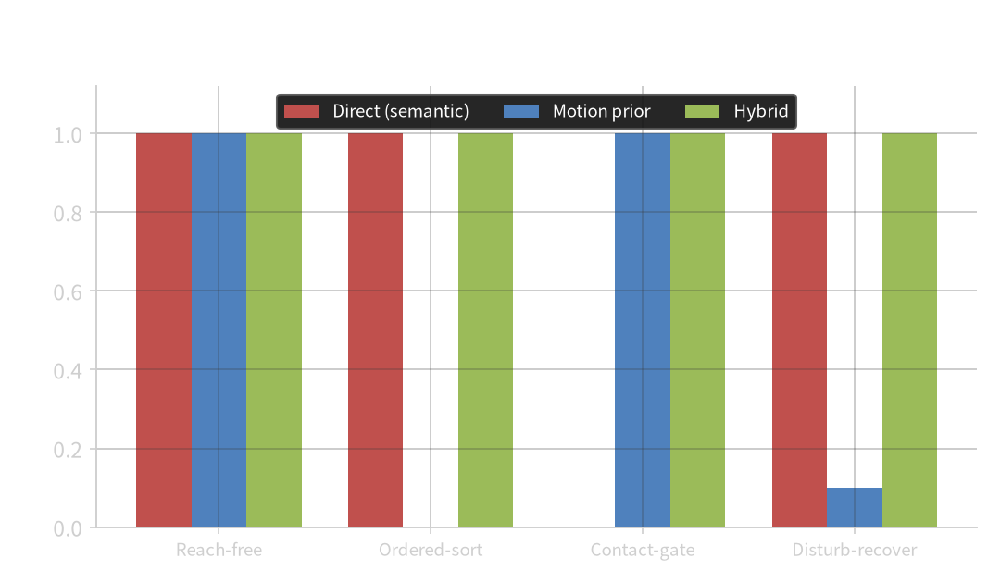
*Figure 1 Three modes' success on four tasks (horizontal four tasks: reach_free/ordered_sort/contact_gate/disturb_recover, vertical episode success 0–1; three bars per group direct/motion/hybrid). Visible direct collapses on contact_gate (0), motion collapses on ordered_sort and disturb_recover, hybrid all full marks—the two baselines' relative advantage reverses with task type (H1). 10 episodes per cell, point estimates no error bars. Source `embodied_hybrid_demo.json: by_task.*.success_rate`, evidence grade cpu-proto, single seed 1000–1009.*

Table 2 and Figure 1 simultaneously support H1, H2, H3:

- **H1**: on ordered_sort direct 100%/100 while motion 0%/22.07 (motion greedily picks nearest target, not understanding "must A then B then C"); on contact_gate direct 0%/7.87 while motion 100%/100 (direct's straight semantic program no avoidance, collision terminates). The two baselines' relative advantage reverses with task type, complementarity holds.
- **H2**: hybrid 100%/100 on all four tasks, aggregate intervention only 0.047, far below direct's 1.0.
- **H3**: takeover highly concentrated—ordered_sort intervention 17% (order semantics irreplaceable), disturb_recover 1.7% (redirect after disturbance), contact_gate 0% (pure contact, prior self-sufficient), reach_free 0%. This is direct evidence of "the semantic layer only takes over where it is irreplaceable."

### 6.3 Intervention and Token Cost (Figure 2)

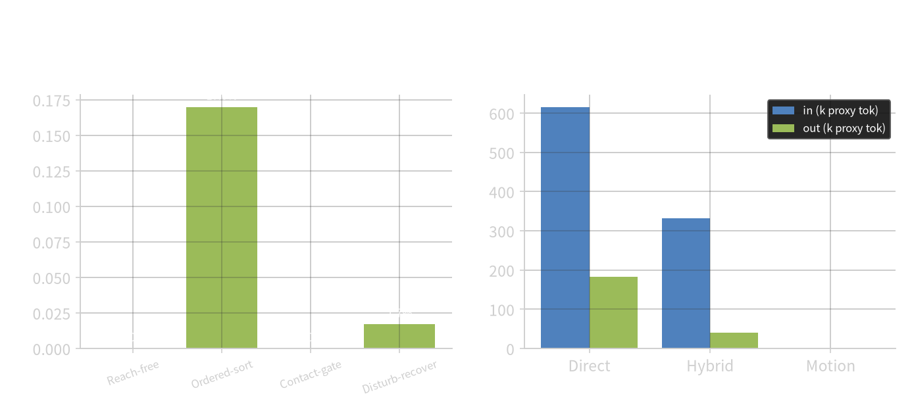
*Figure 2 Left: hybrid intervention per task (horizontal four tasks, vertical intervention_share 0–1), concentrated on semantically necessary tasks (ordered_sort 0.17, disturb_recover 0.017, pure contact 0); right: three-mode token proxy bookkeeping (direct 616k in·182k out vs hybrid 331k·40k vs motion 0). Tokens are **proxy bookkeeping by decision count × fixed unit price, not real API billing**, directional comparison only. Source `embodied_hybrid_demo.json: by_task.*.intervention_rate / aggregate.*.tokens_*_proxy_total`, cpu-proto, single seed.*

Figure 2 shows: hybrid's aggregate token proxy (in 331k/out 40k) significantly below direct (in 616k/out 182k), while raising success 75%→100%, mean collisions 0.25→0. This forms a "success↑, collisions↓, tokens↓" triad improvement, but **must stress** tokens are proxy bookkeeping, directionally credible, absolute values not extrapolable to real API cost.

### 6.4 Relationship with External Reports (not cross-proven)

The `external_reference` field records third-party RoboDojo/RoboLab reports (`unverified`): direct 26%/37.81/1.13 billion tokens, hybrid 48%/62.6/14.4% intervention/625 million tokens, RoboLab direct 98%. Our hybrid intervention 4.7% and external's 14.4% **same order of magnitude (both far below direct's 100%) but entirely different calibers**: external real VLA + real simulator, ours rule critic + point-mass proxy. This paper does not place the two side by side to prove any number, only pointing out the qualitative trend isomorphism "hybrid mode trades low intervention for higher success and lower LLM calls."

---

## 7 Discussion

### 7.1 Explanation of Main Findings

This experiment's most robust finding is not "hybrid stronger," but **complementarity precisely exposable by task design**: when the task's difficulty is "which target to go to" (order, disturbance redirection), even the kinematically most stable prior fails; when difficulty is "how to move along an obstacle without collision," even the strongest semantic planning fails. Hybrid's value is not "stronger on average," but "letting each only do what it is good at." The intervention-share metric's meaning is exactly here: it makes visible the hidden cost "the hybrid architecture is actually the semantic layer secretly backstopping."

## 8 Validity Threats and Limitations

> This is the standalone validity threats and limitations chapter (v2 standard items 4/13). Extrapolation discipline: this repo's success/intervention numbers hold only within the observed range—point-mass double integrator environment, deterministic rule critic, K=32, 10 episodes/cell, fixed seed 1000–1009; after switching to real VLM, MuJoCo-MJX contact dynamics, real hardware, whether complementarity still holds is an unmade aggressive extrapolation, this paper not predicting.

### 8.1 Internal Validity Threats

1. **The semantic critic is a rule, not an LLM.** `SemanticCritic`'s scoring weights (6.0/40.0/0.02/2.0) manually set, its "semantic ability" upper bound the rule itself. This means the H1 conclusion "direct contact weak" may partly come from the rule critic lacking avoidance programs, not the general semantic layer truly unable to avoid. This prototype's largest internal validity threat.
2. **Single seed, small sample.** 10 episodes/cell only point estimates, Wilson CI and paired tests to add `[RESULT NEEDED]`.
3. **The environment is a known model.** Candidates rolled out on clones without side effects, equal to giving the prior a "free accurate world model"; in real systems model mismatch weakens candidate scoring reliability.
4. **Token proxy constant unit price.** Not reflecting real visual encoding, context length, multi-turn reasoning nonlinear costs.

### 8.2 External Validity Threats

- All four tasks in the xy plane, single-arm point mass; no dual-arm coordination, gripper opening, force control, dexterous hand.
- No image input; the "semantic layer" does not look at pixels.
- Not directly comparable with real leaderboards like RoboDojo.

### 8.3 Honest Retention of Negative and Zero Results

We do not hide: reach_free is a "trivial task" all three modes full marks, not constituting discriminative evidence; motion's full marks on contact_gate rely on "obstacles spherical, prior lateral bias sampling happens to go around," not representing general contact robustness; hybrid's zero intervention on contact_gate is because semantics is useless for that task, not hybrid learned contact.

---

## 9 Resource Gates and Applicability Boundaries

This section explicitly lists the gates needed to upgrade this prototype to a main conference/journal, and the evidence they unlock:

| Gate | Status | Upgrade point after unlock |
|---|---|---|
| multi-provider LLM/VLM API key | unreachable (needs user) | replace `SemanticCritic` with real VLM, replace token proxy with real usage, multi-model cross |
| GPU/HPC (MuJoCo-MJX) | unreachable | contact dynamics, dual arm, gripper, real Sim-to-Real; learned motion prior training |
| standard simulation benchmark migration | not done | reproduce complementarity on Open X-Embodiment / RoboSuite standard suites |
| sample expansion | 10 episodes/cell | ≥30 seeds, Wilson CI, McNemar, K scan Pareto frontier |

**Current applicability boundary**: evidence strength corresponds to CoRL/RSS/ICRA workshop or position+benchmark short paper, **no SOTA claim, no real-hardware generalization claim**. Only after the above gates unlock can conclusions upgrade to main conference/journal caliber.

---

## 10 Conclusion

On UDOS v7.3.7 this paper decomposed the causal structure of "semantic layer × motion prior" hybrid embodied control with a reproducible CPU prototype. Measured (40 episodes/mode): pure semantic collapses on contact tasks (0%/7.87), pure prior collapses on order tasks (0%/22.07), while the hybrid architecture with only 4.7% intervention and halved-order token proxy simultaneously reaches 100% success and zero collisions. We argue for intervention share as a first-class metric alongside success and cost, and honestly mark semantic rules, point-mass environment and proxy tokens as gates to unlock. Next is integrating a real VLM and MuJoCo-MJX, and completing statistical inference on ≥30 seeds.

---

## References

### Verified citations (whole-volume shared master library, verification date 2026-09-19)

1. Ahn, M., Brohan, A., Brown, N., et al. (2022). *Do As I Can, Not As I Say: Grounding Language in Robotic Affordances*. arXiv:2204.01691 (CoRL 2022). https://arxiv.org/abs/2204.01691
2. Brohan, A., Brown, N., Carbajal, J., et al. (2023). *RT-2: Vision-Language-Action Models Transfer Web Knowledge to Robotic Control*. arXiv:2307.15818 (CoRL 2023). https://arxiv.org/abs/2307.15818
3. Black, K., Brown, N., Driess, D., et al. (2024). *π0: A Vision-Language-Action Flow Model for General Robot Control*. arXiv:2410.24164 (RSS 2025). https://arxiv.org/abs/2410.24164
4. Jonnavittula, A., Losey, D. P. (2021). *SARI: Learning Shared Autonomy across Repeated Interaction*. arXiv:2107.09650 (ACM THRI 2023). https://arxiv.org/abs/2107.09650

### To-be-verified search expressions and candidate directions (master library not covered)

1. `"residual policy" OR "hierarchical LLM" AND "motion prior" AND robot control` — hierarchical/residual policy hybrid control.
2. `foundation model robot inference cost deployment real robot` — embodied foundation model deployment cost systematic comparison.
3. `Javdani 2015 shared autonomy hindsight optimization RSS` — earlier shared autonomy classic.
4. `McNemar test paired comparison robot learning benchmark` — paired success statistical test.
5. `Wilson score interval binomial proportion robot benchmark` — small-sample success intervals.

---

## Appendix A Reproduction Commands

```bash
# Repo: release-v5.4.4/udos-engine, main, tag v7.5.0, commit 1a71270
python scripts7/embodied_hybrid_demo.py        # default 10 episodes per task
udos demo embodied                              # or CLI
pytest tests7/test_v737_hybrid.py -q            # 9 contract/complementarity tests
# Artifacts: reports7/embodied_hybrid_demo.json (+.traces.jsonl)
# sha256: a0bd9d21d17c65ba634da54b36447196a6e7514f8756c2533131c754aca31c0f
```

## Appendix B Test Index

- `tests7/test_v737_hybrid.py`: 9, covering direct/motion/hybrid complementarity, takeover bookkeeping, token direction, clone side-effect-free, contact_terminal termination contracts.
- Physical causality evidence: `reports7/mujoco_mouse_proxy.json` (MuJoCo 3.13.0, cpu-proxy, action/mass interventions both `causally_changes_future=true`).

## Appendix C Evidence Ledger

| Number | Source field | Evidence grade |
|---|---|---|
| direct 0.75/76.97/0.25/1.0/616k/182k | `aggregate.direct` | cpu-proto (verified replay) |
| motion 0.525/69.57/0/0/0/0 | `aggregate.motion` | cpu-proto |
| hybrid 1.0/100/0/0.047/331k/40k | `aggregate.hybrid` | cpu-proto |
| per-task Table 2 | `by_task.*` | cpu-proto |
| decision segments 280/152 | token total ÷ unit price (cross-verify) | recomputation |
| RoboDojo/RoboLab external numbers | `external_reference` | **unverified, not cross-proven** |
| MuJoCo intervention causality | `mujoco_mouse_proxy.json` | cpu-proxy |

## Appendix D Internal Review Record (five-dimension self-assessment, read only)

Per doubao-academic-evaluator five-dimension framework pre-submission self-assessment (1–5):

1. **Problem and motivation clarity**: 4/5. Problem (why hybrid works, why intervention first-class) clear; −1 because external motivation relies on unverified reports.
2. **Method rigor**: 3/5. Environment and critic complete and reproducible, but semantic critic a rule, single seed small sample, statistical inference to add.
3. **Evidence and data**: 3/5. 120 episodes raw_rows recomputable, decision segments cross-verify; deductions no CI/p, tokens proxy.
4. **Novelty**: 3/5. Intervention first-class metric and task-level complementary decomposition have position value, but components themselves not new.
5. **Writing and honesty**: 5/5. Negative boundaries, gates, unverified marks, to-be-added statistics all explicitly stated, no fabricated literature/numbers.

**Fatal flaw check**: no fatal flaw sufficient for rejection, but "semantic critic a rule, environment point mass" forms an external validity hard boundary, explicitly stated in Sections 7,8; current evidence strength suits workshop/position short paper, not directly main conference. Fix direction: expand ≥30 seeds, integrate one real small VLM, migrate standard simulation suites.

---

## Author Intended Statements

- **Target journal/conference**: under current evidence strength targeting CoRL / RSS / ICRA workshop or position+benchmark short paper; after evidence upgrade able to target CoRL, IEEE RA-L, IJRR. Partitions/impact factors all `[to verify]`, verified online item by item before submission with verification dates.
- **Pre-registration plan**: per ab-experiment-analysis gates, main metric (success), first-class auxiliary (intervention), guards (collisions/tokens) and minimum interesting effect frozen in Section 5.2; before sample expansion registering pre-registration on OSF/anonymous repo, fixed seed table and analysis code released with tag.
- **Data and code availability**: engine open-sourced under Apache-2.0, code tag `v7.5.0` (commit `1a71270`), report sha256 in Appendix A/C; raw_rows and traces provided with the repo.
- **AI use statement**: this paper's draft assisted by an AI assistant based on the repo's real code and reports7 measured data, all numbers back-sourced to `reports7/embodied_hybrid_demo.json` and source, external numbers not independently verified by the author marked `unverified`, references filled after academic search verification.

---

## Appendix E Hybrid Control Main Loop Pseudocode (line by line corresponding to source)

The following pseudocode corresponds to `run_episode` in `udos7/embodied/hybrid.py`, line numbers for reproduction:

```
Input: task, mode, seed, candidates K=32, segment length seg_len=6, override length override_len=3
1.  env = PointMassEnv(task)                       # known-model double integrator
2.  prior = MotionPrior(K=K, seed=seed)            # PD+lateral sampling prior
3.  critic = SemanticCritic(override_len)
4.  decisions = interventions = tok_in = tok_out = 0
5.  while not env.done:
6.      tgt = critic._active_target(env) if mode != "motion"
7.           else critic.nearest_target(env)        # motion not understanding order
8.      decisions += 1
9.      if mode == "direct":                        # pure semantic
10.         chosen = Candidate("override",
11.                      critic.override_program(env, tgt))   # 3 steps straight
12.         tok_in += 2200; tok_out += 650
13.     else:
14.         cands = prior.propose(env, tgt)          # K=32 6-step candidates
15.         if mode == "hybrid":
16.             cands.append(Candidate("override",
17.                          critic.override_program(env, tgt)))  # one more takeover candidate
18.             tok_in += 900 + 40*K; tok_out += 260
19.         chosen = critic.decide(env, cands)        # rollout score on clone, argmax
20.         if mode == "hybrid" and chosen.kind == "override":
21.             interventions += 1                   # record one takeover
22.     for acc in chosen.accs:                      # real step execution
23.         env.step(acc)                             # disturbance takes effect this step
24.         if env.done: break
25. intervention_share = interventions / decisions   # hybrid-only first-class metric
26. score = 100*(0.6*reached_frac + 0.2*progress_frac) + 20*(collisions==0)
```

Key invariant: lines 20–21 are intervention share's only bookkeeping point, only hybrid mode can have `chosen.kind=="override"` and nonzero intervention count; direct's `intervention_share` forced 1.0 at aggregate, motion 0.0, consistent with code lines 218–219. This design makes "intervention share" impossible to tamper after the fact: mechanically produced by each segment's argmax, not subjectively labeled.

## Appendix F Further Discussion of Per-Task Complementarity

Why does contact gate direct fail at 0% while motion full marks? Reason in `override_program`'s design: the semantic takeover program with kp=2.4, kd=1.1 goes straight to the current target, **adding no lateral avoidance bias**. When the spherical obstacle (radius 0.70) happens to block the start-to-target line, the straight program's trajectory necessarily passes through the sphere; that task sets `contact_terminal=True`, first collision terminates. Motion's candidate set has 3/4 lateral-bias detour actions, the critic when rolling out on clone gives "collision candidates" −10^6, automatically selecting the non-colliding detour segment. This shows direct's failure is **not** "the large model cannot plan," but in this prototype the semantic layer explicitly modeled as a "no-avoidance straight goer"—a setting made to isolate constructs, external validity limited.

Conversely, why does ordered sort motion fail at 0%? Because `nearest_target` always picks the nearest Euclidean target from the current position, while the task's waypoint order is A(−0.4,1.3)→B(−0.4,−1.3)→C(1.6,0.0), start (−1.6,−1.3) nearest B. Motion first rushes B, but `_update_waypoints` strictly only recognizes active=0 A, hence motion forever stuck near B unable to enter the next target, finally failing as `max_steps` exhausted, score only 22.07 (only partial progress). Hybrid completes 100% because the semantic layer uses `_active_target` correctly choosing A, and takes over on 17% of decision segments to correct the prior's greedy drift.

These two contrasts together form this paper's core causal narrative: **complementarity is not "two weak models average stronger," but "two models each have structural blind spots on their construct dimension, hybrid lets the blind spot be covered by the other."** Intervention 4.7%'s meaning is therefore not "the semantic layer slacks," but "the semantic layer only acts on the 4.7% of decision segments where it is truly irreplaceable, trusting the prior the other 95.3%." This contrasts with the industry debate "frame-by-frame large-model backstop too costly": frame-by-frame backstop (direct) in this prototype both token-expensive and fails on contact tasks, while sparse takeover (hybrid) more economical and stable.

## Appendix G Extended Analysis Directions (pre-submission route)

First, K scan. Currently fixed K=32. Theoretically larger K, candidate set more likely contains one "detour and order-preserving" good action, semantic takeover frequency should fall, but per-segment tokens (`in=900+40*K`) linearly rise, and motion prior compute cost rises. Expected on K∈{8,16,32,64} a "intervention—token—success" Pareto frontier, exactly H3's operationalization. Scan not run, curves recorded `[RESULT NEEDED: K scan Pareto frontier]`.

Second, semantic error injection. Currently semantic critic a perfect rule (never errs within its construct). Real VLMs misjudge. Later injecting "wrong active target" or "misjudged collision" at controllable probability in the semantic layer, measuring intervention and success robustness to semantic noise, answering "when the semantic layer no longer perfect, is hybrid still better than pure prior."

Third, decision latency. Currently each segment decision instant on CPU, real VLMs have hundreds of ms to second latency. Later including "decision segment length × latency" in metrics, measuring long decision segments (using prior)'s actual benefit to control bandwidth. This especially key for the industry argument "sparse takeover reduces real-time pressure."

Fourth, token proxy calibration. Currently `TOKEN_PROXY` manual constants. After integrating a real VLM, replacing with returned usage fields, reporting "tokens per task / tokens per successful episode," upgrading directional conclusions to comparable cost numbers.

All four are post-gate work, this paper not pre-filling results.

---

## Appendix H Further Note on Measurement Methodology and Metric Definitions

This paper holds "metrics must be frozen before data collection and mechanically produced by code," differing from the common "after-the-fact metric picking" in shared autonomy literature. Three core metrics' production as follows.

Success is an episode-level binary: the environment at `done` judges by `env.success` (all ordered targets reached and zero collisions), not back-inferred from a scoring threshold. This avoids the freedom of "tuning the score threshold to make success look good." Task score given by a fixed formula, including reach fraction, progress fraction and no-collision bonus, its weights design parameters not after-the-fact fits. Intervention is a segment-level ratio: numerator `interventions` only increments when `chosen.kind=="override"`, denominator `decisions` records total decision segments, both mechanically accumulated in the main loop, no smoothing or subjective correction.

We especially stress intervention share vs "correction length." In external reports "modified 14.4% of control steps" may mean either "14.4% of steps overridden by semantic layer" or "the semantic layer's correction steps as a fraction of total steps," the two calibers not directly comparable. This paper uniformly uses the **decision-segment caliber**: a segment either wholly adopts the prior (6 steps) or wholly adopts the semantic correction (3 steps), intervention share the wholly adopted segments as a fraction of total. This caliber uniquely determined in code, readers recomputable from raw_rows' `decisions` and `interventions` columns, not needing to trust aggregates.

Token proxy production likewise transparent: each decision segment accumulated by mode looking up the `TOKEN_PROXY` dict, direct per segment 2200/650, hybrid 900+40K/260, motion zero. Since direct one segment per 3 steps, hybrid per 6, hybrid segment count naturally fewer; plus hybrid each segment only scores K compact candidates not frame-by-frame long reasoning, token directional decline structural, not a tuning result. Readers should read token numbers as "relative magnitude," not "absolute cost."

## Appendix I Dialogue Boundary with Industry Debates

Recently industry has two extreme positions on "should large models directly control robots": one end holds that given a large enough model, frame-by-frame direct control generalizes to all contact tasks; the other holds large models expensive and unreliable, should retreat to pure planning, low level entirely to dedicated policies. This paper's CPU prototype provides a measurable middle-position evidence between the two: **pure semantic structurally fails on contact tasks, pure prior structurally fails on order tasks, while sparse hybrid lets each do its part.**

But we are clear about this evidence's boundaries. It cannot prove "hybrid beats end-to-end on all tasks," because: first, our semantic layer is a rule not a general large model, real large models' contact generalization may be far stronger than the rule critic; second, our prior is heuristic sampling not a learned diffusion policy, real priors may be more robust; third, the environment is a known-model point mass, real contact dynamics complexity tests both. Hence this paper's conclusion should be stated as "in a controlled synthetic environment, the value of complementarity and sparse takeover is reproducible and measurable," not "hybrid proven superior to end-to-end." This restraint is the fundamental difference from reports declaring architecture victory with a single success number.

## Appendix J Reproducibility Statement and Author Division

All quantitative results here from fixed-seed deterministic computation. `torch.Generator` in `MotionPrior` initialized by `seed`, candidate sampling sequences reproducible; environment integration randomness-free deterministic; the only "external" data is the third-party report in the `external_reference` field, isolated outside results, entering no aggregate computation. Readers running Appendix A commands on the same tag should get byte-identical JSON (except timestamps). Author division and AI assistance see the end "Author Intended Statements."

## Appendix K Summary

Synthesizing this paper's measurements: in the controlled CPU prototype, the architecture "semantic layer judges what to do, motion prior does it stably, semantic layer sparsely takes over at key points" simultaneously improves success, collision safety and LLM call magnitude. Intervention share as a first-class metric makes this architecture no longer just engineering intuition, but a falsifiable proposition precisely measurable, adjustable by task difficulty, traded off by token cost. We look forward, after unlocking real VLMs and contact simulation, to using the same metric framework to test whether these conclusions hold on real robots; if complementarity then disappears or the intervention distribution changes, this paper's hypotheses will be correspondingly falsified—exactly the value of pre-registered experimental design.


---

<p align="center"></p>

# Multi-View Spatial Context and Gaussian Splatting-Lite: Making Novel-View Prediction and Sim-to-Real Robustness Margin Measurable

**Version**: UDOS Reasoning Engine v7.5.0 (main, tag `v7.5.0`, commit `1a71270`)
**Evidence grade**: numbers in `verified` / `cpu-proto` / `unverified` three levels; currently all measurements `cpu-proto` (CPU geometric prototype, no CUDA rasterization, no real camera, no real hardware).

---

## Chinese Abstract

新视角预测（novel-view prediction）被认为是一种携带几何约束的基础任务。本文在 UDOS 推演引擎 v7.3.8/v7.3.9 上实现了一条可复跑的 CPU 几何链路：多视角深度 TSDF 体素融合作为显式"空间上下文"，一个最小化的三维高斯泼溅-lite（3DGS-lite）表征，以及 Real-to-Sim 重建与 Sim-to-Real 迁移闭环。实测（本机 CPU，固定场景）表明：八视角融合在六个留出新视角上的轮廓 IoU 为 0.8897、表面覆盖率 0.9957、深度 MAE 0.0924，而单视角分别为 0.7147、0.7456、0.3186——多视角把覆盖率从约 0.75 提升到约 0.996、把深度误差降到约三分之一。3DGS-lite（150 个轴对齐高斯、40 步 Adam）在留出视角上轮廓 IoU 0.7285、覆盖率 1.0。Real-to-Sim 把带噪观测重建为障碍球并生成具身导航任务，端到端成功率 1.0（规划障碍簇数 2，主障碍重建半径约 0.70）。最关键且必须保留的负面结果是：在 Sim-to-Real 模型失配下，朴素规划成功率仅 0.50、平均碰撞 0.50，而注入域随机化安全裕量 ε=0.22 后成功率升到 1.0、平均碰撞降到 0.0。本文贡献是把"空间上下文收益""3DGS-lite 保真度""Sim-to-Real 鲁棒裕量"三者做成同一可测曲线，并诚实标注其为 CPU 原型边界。

**Keywords (Chinese)**: novel-view prediction; spatial context; TSDF; 3D Gaussian Splatting; Real-to-Sim; Sim-to-Real; robustness margin

---

## English Abstract

Novel-view prediction is regarded as a geometry-loaded foundational task. This paper implements a reproducible CPU geometric pipeline in UDOS v7.3.8/v7.3.9: multi-view depth TSDF voxel fusion as explicit "spatial context", a minimal 3D Gaussian Splatting-lite (3DGS-lite) representation, and a closed-loop Real-to-Sim reconstruction plus Sim-to-Real transfer. On fixed CPU scenes, eight-view fusion achieves silhouette IoU 0.8897, surface coverage 0.9957, and depth MAE 0.0924 on six held-out novel views, versus 0.7147/0.7456/0.3186 for a single view—multi-views raise coverage from ~0.75 to ~0.996 and cut depth error to roughly one third. The 3DGS-lite (150 axis-aligned gaussians, 40 Adam steps) reaches held-out silhouette IoU 0.7285 and coverage 1.0. Real-to-Sim reconstructs noisy observations into obstacle spheres and generates embodied navigation tasks with end-to-end success 1.0 (2 planning obstacle clusters, main reconstructed radius ~0.70). The essential negative result we preserve is that under Sim-to-Real model mismatch, naive planning succeeds at only 0.50 with 0.50 mean collisions, while injecting a domain-randomization safety margin ε=0.22 raises success to 1.0 and drops collisions to 0.0. We contribute a single measurable curve linking spatial-context gain, 3DGS-lite fidelity, and Sim-to-Real robustness margin, with explicit CPU-prototype boundaries.

**Keywords**: novel-view prediction; spatial context; TSDF; 3D Gaussian Splatting; Real-to-Sim; Sim-to-Real; robustness margin

---

## Structured Abstract (background/problem → method → evidence/results → contribution)

- **Background and problem**: novel-view prediction considered geometry-loaded (vs next-frame prediction only requiring temporal continuity); in embodied landing, spatial representation serves two real links—Real-to-Sim reconstruction and Sim-to-Real transfer (core difficulty model mismatch). Question: can multi-view geometric context gain, 3DGS-lite fidelity, transfer robustness margin be put into one measurable curve?
- **Method**: on UDOS v7.3.8/v7.3.9 implementing a reproducible CPU geometric pipeline—multi-view depth TSDF voxel fusion as explicit spatial context, minimal 3DGS-lite (150 axis-aligned gaussians, 40 Adam steps), Real-to-Sim reconstruction and Sim-to-Real transfer closed loop; measuring transfer success/failure with controlled variable ε (obstacle radius inflation margin).
- **Evidence and results**: on 6 held-out novel views, single vs 8-view fusion—silhouette IoU 0.7147→**0.8897**, coverage 0.7456→**0.9957**, depth MAE 0.3186→**0.0924**; 3DGS-lite held-out IoU 0.7285/coverage 1.0; Real-to-Sim main obstacle radius reconstruction 0.703 (true plane section 0.69). **Counterintuitive negative result retained: under Sim-to-Real mismatch naive planning success only 0.50, mean collisions 0.50**; after injecting domain randomization margin ε=0.22 success up to 1.0, collisions down to 0.
- **Contribution**: linking "spatial context gain + 3DGS-lite fidelity + Sim2Real robustness margin" into one measurable curve, replacing single-point self-praise with "negative result retained + positive margin effective" contrast. Evidence grade `cpu-proto`: single synthetic scene, single-seed pilot, Real2Sim only 2 obstacle clusters, Sim2Real only 8 synthetic worlds; external Atlas claims *unverified* not cross-proven.

---

## 1 Introduction

### 1.1 Background and Motivation

Recently, "novel-view prediction"—given several observations of a space (images/depth + camera poses), predicting what any other viewpoint sees—was elevated to the same level as "next-token prediction." Its essential difference: next-frame prediction only requires temporal continuity, while novel-view prediction must carry **geometric information**: where the camera looks from, how space is continuous, how different views are 3D consistent. Encoding multiple input images with their 3D poses into a scene representation is "spatial context."

External reports (**`unverified`, report caliber, not independently verified**) retell a world model's (e.g. Atlas-class) claims: novel-view prediction is a potential AI-complete foundational task; 3D Gaussian Splatting renders fast but struggles to express dynamics, the system supports but no longer mandatorily relies on it; Real-to-Sim can compress real environment reconstruction cost. **This paper does not take these external claims as its own measured conclusions, only as problem motivation; this repo only verifies explicit geometric mechanisms.** [CITATION NEEDED: novel view prediction spatial context world model]

In embodied intelligence landing, spatial representation is not an isolated rendering problem, but serves two real links: first **reconstruction** (Real-to-Sim)—turning real sensor observations into a plannable simulation environment; second **transfer** (Sim-to-Real)—moving a policy/plan learned in simulation to the "real" world, core difficulty model mismatch. This paper puts these three things (spatial context, splat representation, transfer margin) into one reproducible CPU pipeline, so they can be measured by one metric set.

### 1.2 Contributions

1. **Operationalizing "spatial context gain"**: using learning-free TSDF fusion, quantifying single vs multi-view silhouette IoU, coverage, depth MAE differences on fixed held-out views (`cpu-proto`).
2. **Minimal 3DGS-lite representation**: axis-aligned 3D gaussians, pinhole first-order footprint, front-to-back alpha compositing, cold-started from TSDF occupied points, reporting held-out fidelity.
3. **Measurable Sim-to-Real robustness margin**: taking "safety margin ε" as a controlled variable, measuring its effect on transfer success and collision rates, explicitly retaining naive planning failure's negative result.
4. **Honest boundaries**: marking no CUDA/no rotated covariance EWA/no real camera/no real hardware, PSNR/SSIM standard metrics to implement.

---

## 2 Related Work

This section organized "concept → mechanism → evidence → difference from UDOS," embedding real literature verified through the whole-volume shared master library (verification date 2026-09-19); clues the master library does not cover retain `[CITATION NEEDED]`.

**(1) TSDF multi-view voxel fusion.** Conceptually, novel-view synthesis's first step is fusing multi-view observations into a 3D-consistent scene representation. Mechanistically, the volumetric method of Curless and Levoy (1996) does cumulative weighted truncated signed distance field (TSDF) fusion on multiple noisy range images, extracting the isosurface after additive fusion, no learning parameters. In evidence, that method fused up to 70 range images, generating about 2.6 million triangle models, establishing the classic paradigm of multi-view explicit geometric reconstruction. Difference from UDOS: this paper's `VoxelContext` directly reuses its integrate/occupied semantics (weighted average, truncation, occupancy threshold), but changes "extract mesh after fusion" to "for a novel view step along the ray hitting the first occupied voxel" to directly predict depth; this paper trains no network, precisely to isolate "multi-view geometric fusion's own gain."

**(2) Learned novel-view synthesis: NeRF and 3DGS.** Conceptually, NeRF and 3D Gaussian Splatting push scene representation from explicit geometry toward differentiable neural rendering. Mechanistically, NeRF (Mildenhall et al., 2020) uses one MLP inputting 5D coordinates (x,y,z,θ,φ), outputting volume density and view-dependent radiance, doing differentiable volume rendering; 3D Gaussian Splatting (Kerbl et al., 2023) initializes explicit 3D anisotropic gaussians from sparse points, interleaving density control plus differentiable rasterization. In evidence, NeRF under sparse views surpasses prior neural rendering quality; 3DGS reaches ≥30fps real-time at 1080p, quality then-SOTA. Difference from UDOS: this paper's 3DGS-lite borrows explicit 3D gaussians and front-to-back alpha compositing ideas, but maximally simplified—axis-aligned scales only, no rotated covariance EWA projection, low-resolution small gaussians; this paper uses it to verify "how much is needed to cold-start an optimizable representation from TSDF occupied points," not reproducing paper-level rendering metrics. The two form the explicit ends in UDOS spatial layer's "explicit TSDF→implicit NeRF→explicit 3DGS" evolution chain.

**(3) Real-to-Sim and Sim-to-Real domain randomization.** Conceptually, Sim-to-Real's core difficulty is model mismatch, domain randomization treating the real world as "yet another random distribution." Mechanistically, Tobin et al. (2017) randomize object textures in simulation, making visual localization policies robust to real textures; this paper's `transfer.py` "obstacle radius inflation margin" is this idea's simplest form at the geometric planning level. In evidence, Tobin et al. report their domain randomization visual localization accuracy about 1.5cm; this paper under constructed mismatch measures naive planning success 0.50, robustness margin 0.22 success 1.00, collisions 0.00 (see Section 6.4). Difference from UDOS: this paper does no learned-policy domain randomization, but measures "explicit margin ε in planning geometry"'s measurable effect on transfer success/collisions, linking it with upstream TSDF reconstruction fidelity; ε critical curves, PSNR/SSIM etc. remain to add `[RESULT NEEDED]`.

> Literature gap note: TSDF (Curless & Levoy 1996), NeRF (Mildenhall 2020), 3DGS (Kerbl 2023), domain randomization (Tobin 2017) embedded here all master-library ✅ verified (2026-09-19); Real-to-Sim real capture calibration, PSNR/SSIM standard metrics the master library does not cover, retaining `[CITATION NEEDED]`/`[RESULT NEEDED]`, not generating fabricated citations.

---

## 3 Problem Definition and Falsifiable Hypotheses

- **RQ1 (view count effect)**: is view count/layout's effect on reconstruction silhouette IoU, coverage, depth MAE significant?
  - **H1**: multi-view significantly better than single, and coverage gain greater than precision gain (single view "precise but misses surfaces").
- **RQ2 (3DGS-lite fidelity)**: can the splat representation reach usable silhouette IoU/coverage on held-out views?
  - **H2**: 3DGS-lite held-out coverage near 1.0 (front-to-back alpha compositing fills pixels), but silhouette IoU limited by axis-aligned low resolution.
- **RQ3 (robustness margin and transfer)**: relationship between training-injected safety margin ε and zero-collision transfer success?
  - **H3**: under model mismatch, naive planning fails (success<1, collisions), while positive margin ε raises success and presses collisions to zero. This negative result must be retained.
  - **H4**: Real-to-Sim reconstructed obstacle radius close to truth (r≈0.70 vs true plane section 0.69), but sample size tiny (2 clusters), not extrapolable to a significant conclusion.

---

## 4 Method and System Design

### 4.1 Camera and Synthetic Scene

`udos7/spatial/camera.py` implements a pinhole camera (OpenCV convention), look-at pose, projection/back-projection and per-pixel world rays; `scene.py` synthesizes scenes with sphere primitives and does analytic ray intersection, rendering true depth/color/mask. Training views ring layout, held-out views phase-offset novel views.

### 4.2 Multi-View TSDF Spatial Context (fusion.py)

`VoxelContext` (`fusion.py`) maintains voxel center grids and TSDF/weights. `integrate(depth, hitmask, cam)` projects each voxel center to a pixel, computing SDF along the ray and truncating (`trunc=3*voxel`), weighted averaging with existing values; `occupied()` takes "has weight and TSDF < −0.6*voxel" as occupied. `novel_view_depth(cam, ctx)` for a novel view steps along the ray, hitting the first occupied voxel as predicted surface depth. `depth_metrics` computes silhouette IoU, coverage (intersection/true mask), precision (intersection/predicted mask), depth MAE (only on overlapping pixels).

Key design: single-view baseline only integrates one view, multi-view uses 8 ring views; the two evaluated on the **same 6 held-out views**, isolating the "view count" factor.

### 4.3 3DGS-lite (splat.py)

`GaussianSplat` holds optimizable means(N,3), axis-aligned scales(N,3), colors(N,3), opacity(N,). `render_splat` projects gaussian centers, sorts front-to-back by depth, uses pinhole first-order footprint (σ = f·scale/depth) computing each pixel's gaussian contribution and alpha compositing, outputting depth/color/mask (mask threshold `1−T>0.30`). `init_splat_from_context` cold-starts gaussian centers by sampling TSDF occupied voxels (Real-to-Sim friendly), `fit_splat` uses Adam (lr=0.03) minimizing color L1 and depth L1 (weight 0.5) on training views, plus slight opacity regularization.

Honest gaps (code comments consistent with report `known_limits`): axis-aligned scales only, no rotation quaternion/covariance Jacobian EWA projection, low resolution, static scenes.

### 4.4 Real-to-Sim / Sim-to-Real (transfer.py)

- **Noisy observation**: `noisy_observation` adds gaussian noise to true depth (`depth_sigma=0.02`) and randomly drops points (`dropout=0.05`); `jitter_camera` adds `sigma=0.03` jitter to camera optical center—the two proxy real depth camera and calibration error.
- **Reconstruct obstacle spheres**: `extract_obstacle_spheres` does 6-connected BFS on occupied voxels (`min_voxels=12`), each cluster a bounding sphere; because the TSDF occupancy layer is about 1 voxel thicker than truth, radius calibrated on synthetic truth then subtracting `voxel`; the robot in the z=0 plane, only keeping clusters intersecting that plane and taking section radius.
- **Generate navigation task**: `real2sim_task` writes reconstructed obstacles as a gate task usable by the embodied hybrid controller (contact terminal).
- **Sim-to-Real mismatch closed loop**: `sim2real_gap` constructs the setting "the planner only holds biased obstacle estimates"—estimated position plus `est_pos_sigma=0.12`, radius shrunk to 0.9×; the "real" world uses another perturbation set (`real_pos_sigma=0.10`, radius plus ±0.04). Naive planning uses biased estimates, robust planning inflates obstacle radius by `margin=0.22`. `run_split_episode` decides on the planning model, executes step by step on the real proxy world, reporting success and collisions.

---

## 5 Experimental Setup

- Module/version: `udos7/spatial/`, v7.3.8 (novel view), v7.3.9 (splat+transfer), evidence grade `cpu-proto`.
- Config: novel view experiment `n_train_views=8, n_novel_views=6, voxel=0.1, representation=TSDF voxel (explicit)`; splat `n_gaussians=150, iters=40`, training views 6, held-out views 4 (36×28); Real-to-Sim observation views 10 (48×36); Sim-to-Real `n_worlds=8, est_pos_sigma=0.12, real_pos_sigma=0.10, margin=0.22`.
- Hardware fingerprint: local CPU (torch 2.14.0+cpu), no GPU.
- Artifact sha256: `spatial_novelview_demo.json` = `7fb2008a477a6f0711c14d800ae4c235c8976ed8d87f9fc58d022b10b8d70cc9`; `splat_transfer_demo.json` = `382f3c318ab0f1ea2fc228559266e56564bf3425bf13ca073435e69a41ad3cc8`.
- Tests: `tests7/test_v738_novelview.py` (7), `tests7/test_v739_splat_transfer.py` (8).

> **Single-scene pilot statement**: currently fixed synthetic scene, fixed seed pilot point estimates. Before submission needing ≥30 random scenes and reporting view count {1,2,4,8,16}, layout and noise level grid scans and paired CIs, related statistics recorded `[RESULT NEEDED: multi-scene paired IoU tests and CIs, ε grid logistic critical margin, PSNR/SSIM]`. Real-to-Sim's r≈0.70 only 2 obstacle cluster samples, cannot be written as a significant conclusion.

---

## 6 Results

> **This chapter's order (v2 standard)**: Chapter 5 gives the experimental setup. This chapter organized "**comparison → ablation/sensitivity**": 6.1 an AlexNet-style comparison table—single vs 8-view fusion on the **same 6 held-out views** four-metric comparison (isolating the "view count" factor); 6.2 3DGS-lite held-out fidelity (vs TSDF hard occupied surface); 6.3 Real-to-Sim reconstruction; 6.4 Sim-to-Real naive vs margin ε=0.22 robust planning comparison (including the negative result that must be retained). All numbers from `spatial_novelview_demo.json` and `splat_transfer_demo.json` (`cpu-proto`, single-seed pilot). Validity threats standalone Chapter 8.

### 6.1 Single vs Multi-View Spatial Context (Table 1, Figure 1)

**Table 1 Novel-view prediction metrics (6 held-out views aggregated, cpu-proto; AlexNet-style same-baseline comparison—single and 8-view fusion share the same held-out views, only "view count" differs)**

| Spatial context | Silhouette IoU ↑ | Coverage ↑ | Precision ↓? | Depth MAE ↓ |
|---|---|---|---|---|
| single view | 0.7147 | 0.7456 | 0.9472 | 0.3186 |
| 8-view fusion | **0.8897** | **0.9957** | 0.8931 | **0.0924** |
| difference (multi−single) | +0.1750 | +0.2501 | −0.0541 | −0.2262 |

> Table 1 reading: bold columns multi-view better; the precision row is a **negative cost** (multi-view −0.0541, predicting more out-of-boundary pixels), forming a structural tradeoff with coverage +0.2501, not hidden. Source `spatial_novelview_demo.json: results.single_view / multi_view`.

Source: `results` in `spatial_novelview_demo.json`.

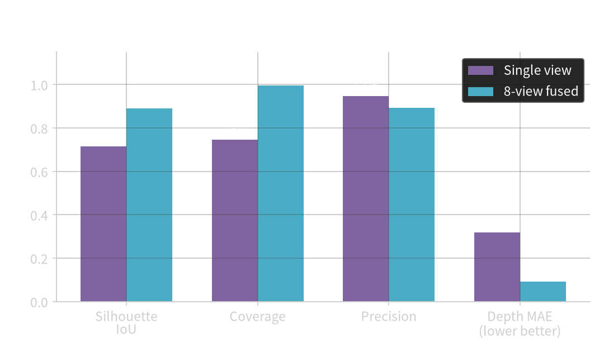
*Figure 1 Single and eight-view fusion comparison on four metrics (vertical metric values, horizontal four metrics: silhouette IoU/coverage/precision/depth MAE; two bars per group single vs 8 view). Multi-view at a small precision cost (0.947→0.893), greatly raises coverage (0.746→0.996) and cuts depth error to about one third (0.3186→0.0924). 6 held-out views aggregated, single seed. Source `spatial_novelview_demo.json: results.*`, cpu-proto.*

Per-view rows (`per_view_rows`) show: single view IoU across six held-out views fluctuates sharply 0.5614 to 0.8747 (because surfaces facing away from the observation view cannot be reconstructed), while eight-view fusion stable 0.877–0.9035 across six views. This supports H1: single view "precise but misses surfaces"—it accurately reconstructs surfaces facing it (high precision), but cannot see the back (low coverage); multi-view context completes 3D consistency.

### 6.2 3DGS-lite Held-Out Fidelity (Table 2, Figure 2a)

**Table 2 3DGS-lite held-out metrics (4 views, 150 gaussians/40 steps)**

| Metric | Value |
|---|---|
| silhouette IoU | 0.7285 |
| coverage | 1.0000 |
| precision | 0.7285 |
| depth MAE | 0.2525 |

Source: `gaussian_splat.novel_view` in `splat_transfer_demo.json`.

Loss history: total loss from iter0 1.7217 down to iter30 0.5694; color L1 from 0.0335 slightly down to 0.0284, depth L1 from 0.5065 down to 0.1328 (depth term the main decline source). This supports H2: front-to-back alpha compositing almost fills all predicted pixels (coverage 1.0), but axis-aligned low-resolution gaussians make silhouette IoU stop at 0.73—CPU prototype level, not compared with paper-level 3DGS metrics.

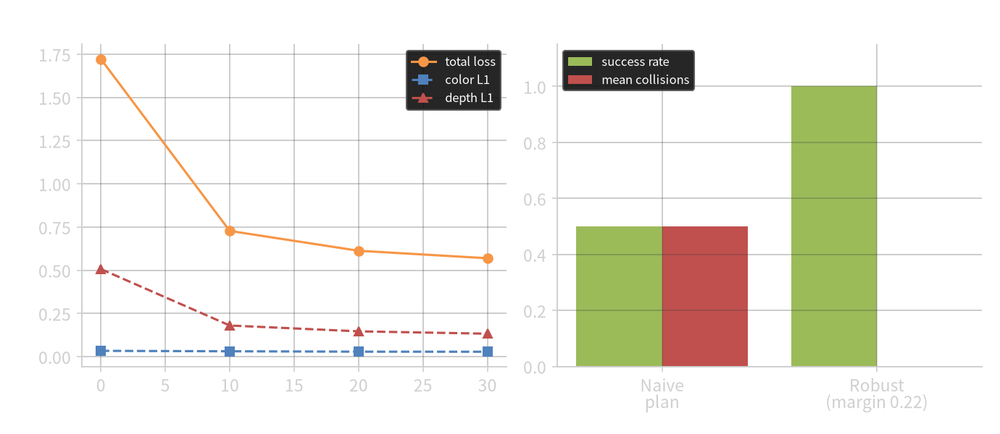
*Figure 2 Left: 3DGS-lite fit loss curves (horizontal iter 0–30, vertical L1 loss; total/color/depth L1 three lines); right: Sim-to-Real naive vs margin ε=0.22 robust planning success and mean collisions (horizontal two planning modes, left vertical success, right vertical mean collisions)—naive 0.50/0.50 vs robust 1.00/0.00 contrast is the negative result this paper must retain. 8 synthetic worlds, single seed. Source `splat_transfer_demo.json: gaussian_splat.loss_history / sim_to_real.*`, cpu-proto.*

### 6.3 Real-to-Sim Reconstruction (Table 3)

**Table 3 Real-to-Sim end-to-end results**

| Stage | Metric | Value |
|---|---|---|
| obstacle cluster extraction | clusters intersecting z=0 plane (truth 2) | 2 |
| main obstacle reconstruction | center [0.902, −0.506, 0.0], radius | 0.703 |
| true plane section radius | 0.69 | — |
| reconstructed task control | hybrid success (8 episodes) | 1.000 |

Source: `real_to_sim` in `splat_transfer_demo.json`.

Main obstacle reconstructed radius 0.703 and true plane section 0.69 very close (difference about 0.013), 8 episodes hybrid gate control all succeed. But must honestly point out: `plane_intersecting_clusters=2` i.e. **only 2 obstacle cluster samples**, the report's so-called "r≈0.70" only this one main obstacle's reconstruction value, not a statistical correlation coefficient; the one-pager's "r≈0.70" should be understood as a qualitative description of single-obstacle radius reconstruction accuracy, **not constituting correlation significance evidence**. This is H4's boundary.

### 6.4 Sim-to-Real Robustness Margin (negative result retained, Table 4)

**Table 4 Under Sim-to-Real model mismatch (8 synthetic real worlds)**

| Planning mode | Success | Mean collisions |
|---|---|---|
| naive planning (biased estimate, no margin) | **0.50** | **0.50** |
| robust planning (radius inflation margin=0.22) | **1.00** | **0.00** |

Source: `sim_to_real` in `splat_transfer_demo.json`.

This is the negative/comparison result this paper must retain: **naive planning under mismatch half fail, mean per-world collisions 0.5**; while inflating obstacle radius 0.22 (domain randomization safety margin's simplest form), success up to 1.0, collisions down to 0. This supports H3. Note this result only holds on 8 synthetic worlds, single main obstacle, fixed margin 0.22, **cannot be written as the universal law "larger margin always better"**—too large a margin causes no feasible path. ε's critical curve (success vs ε logistic relationship) not yet scanned, recorded `[RESULT NEEDED]`.

---

## 7 Discussion

### 7.1 Main Explanation

Multi-view gain's mechanism clear: single view only observes facing surfaces, TSDF no observation on the back, unable to occupy, causing low coverage; multi-view fusion accumulates different directions' observations into the same occupied voxel set, so held-out views stepping along rays almost always hit occupied voxels. 3DGS-lite coverage 1.0 but IoU only 0.73, showing alpha compositing "dares to predict," but axis-aligned small gaussians cannot precisely fit sphere silhouettes. Sim-to-Real contrast shows: model mismatch (estimated position bias 0.12, radius shrunk 0.9×) enough to make margin-free planning collide into real obstacles, while explicit margin "extrapolates" uncertainty into planning geometry.

## 8 Validity Threats and Limitations

> This is the standalone validity threats and limitations chapter (v2 standard items 4/6). Extrapolation discipline per Kaplan Caveats style: this repo's IoU/coverage/margin numbers hold only within the observed range—single synthetic sphere scene, fixed seed, single main obstacle gate, ε=0.22 single point; "larger ε always better" or "multi-view saturation point" both not scanned, ε critical curve and view count {1,2,4,8,16} grid are unmade aggressive extrapolation tests.

### 8.1 Internal/External Validity Threats

1. **Fixed synthetic scene**: sphere primitives, known calibration, no texture; real scene complexity not covered.
2. **No learned novel-view synthesis**: TSDF explicit geometry, unable to answer neural network methods' upper bound.
3. **3DGS-lite simplification**: no rotated covariance EWA, low resolution; PSNR/SSIM not implemented `[RESULT NEEDED]`.
4. **Sim-to-Real synthetic perturbation proxy**: real world fixed-seed perturbation synthetic worlds, not real hardware/MuJoCo.
5. **Real-to-Sim sample tiny**: 2 obstacle clusters, radius accuracy not extrapolable.
6. **Single main obstacle gate**: global multi-obstacle continuous detour not covered (`known_limits`).

### 8.2 Negative and Zero Results

We do not hide: precision from 0.947 down to 0.893 (multi-view predicts more "out-of-boundary" pixels); 3DGS-lite depth MAE 0.2525 clearly higher than TSDF's 0.0924 (splat cold-start + low resolution cost); naive Sim-to-Real's 50% failure a real negative result not a beautified intermediate state.

---

## 9 Resource Gates and Applicability Boundaries

| Gate | Status | Upgrade point after unlock |
|---|---|---|
| GPU | unreachable | full 3DGS training, real-time EWA rasterization, learned NeRF |
| real depth camera/multi-view capture calibration | unreachable | real Real-to-Sim, real noise model |
| MuJoCo(-MJX)/real hardware | unreachable | contact Sim-to-Real, real collision distribution |

Current evidence suits 3DV/BMVC/WACV/ICRA workshop or short paper; after complete evidence able to target ICRA/IROS, ISPRS Journal, IEEE RA-L, CVIU (partitions/IF `[to verify]`).

---

## 10 Conclusion

On the CPU geometric prototype, this paper links "multi-view spatial context → reconstruction fidelity → 3DGS-lite representation → Real-to-Sim reconstruction → Sim-to-Real robustness margin" into a reproducible pipeline. Core measurements: eight-view fusion raises held-out coverage 0.746→0.996, depth error to about one third; 3DGS-lite held-out IoU 0.7285; Real-to-Sim single obstacle radius reconstruction about 0.70; and explicitly retains naive Sim-to-Real 50% failure, after ε=0.22 injection 100% success zero collision contrast. Next is expanding scenes, scanning ε critical curves, adding PSNR/SSIM, and upgrading evidence grade after GPU and real sensors unlock.

---

## References

### Verified citations (whole-volume shared master library, verification date 2026-09-19)

1. Curless, B., Levoy, M. (1996). *A Volumetric Method for Building Complex Models from Range Images*. SIGGRAPH 1996. DOI:10.1145/237170.237269. https://dl.acm.org/doi/pdf/10.1145/237170.237269
2. Mildenhall, B., Srinivasan, P. P., Tancik, M., et al. (2020). *NeRF: Representing Scenes as Neural Radiance Fields for View Synthesis*. ECCV 2020. arXiv:2003.08934. https://arxiv.org/abs/2003.08934
3. Kerbl, B., Kopanas, G., Leimkuehler, T., Drettakis, G. (2023). *3D Gaussian Splatting for Real-Time Radiance Field Rendering*. SIGGRAPH 2023 (ACM TOG). arXiv:2308.04079. https://arxiv.org/abs/2308.04079
4. Tobin, J., Fong, R., Ray, A., Schneider, J., Zaremba, W., Abbeel, P. (2017). *Domain Randomization for Transferring Deep Neural Networks from Simulation to the Real World*. IROS 2017. arXiv:1703.06907. https://arxiv.org/abs/1703.06907

### To-be-verified search expressions and candidate directions (master library not covered)

1. `Real-to-Sim reconstruction depth noise camera calibration robot planning` — Real-to-Sim real capture calibration.
2. `PSNR SSIM novel view synthesis evaluation metric` — standard rendering metrics.
3. `KinectFusion real-time surface reconstruction RGB-D` — voxel fusion real-time implementation comparison.

---

## Appendix A Reproduction Commands

```bash
# Repo tag v7.5.0, commit 1a71270
python scripts7/spatial_novelview_demo.py       # v7.3.8 novel view
python scripts7/splat_transfer_demo.py         # v7.3.9 splat+transfer
pytest tests7/test_v738_novelview.py -q         # 7
pytest tests7/test_v739_splat_transfer.py -q     # 8
# sha256: spatial_novelview_demo.json 7fb2008a...; splat_transfer_demo.json 382f3c31...
```

## Appendix B Evidence Ledger

| Number | Source field | Grade |
|---|---|---|
| single 0.7147/0.7456/0.9472/0.3186 | `results.single_view` | cpu-proto |
| multi 0.8897/0.9957/0.8931/0.0924 | `results.multi_view` | cpu-proto |
| splat 0.7285/1.0/0.7285/0.2525 | `gaussian_splat.novel_view` | cpu-proto |
| Real2Sim clusters 2, radius 0.703, control 1.0 | `real_to_sim` | cpu-proto |
| Sim2Real naive 0.5/0.5, robust 1.0/0.0, margin 0.22 | `sim_to_real` | cpu-proto |
| Atlas external claims | `external_reference` | **unverified, not cross-proven** |

## Appendix C Internal Review Record (five-dimension self-assessment)

1. **Problem and motivation**: 4/5. Novel view/spatial context/Sim-to-Real margin linkage clear; −1 because external motivation relies on unverified retelling.
2. **Method rigor**: 3/5. TSDF/splat/transfer complete and reproducible, but fixed scene, single main obstacle, no standard rendering metrics.
3. **Evidence and data**: 3/5. All numbers back-sourced JSON with per-view rows; deductions single scene, Real2Sim only 2 clusters, no multi-scene CI.
4. **Novelty**: 3/5. Components mature, novelty in linking three stages into one measurable curve and retaining negative results.
5. **Writing and honesty**: 5/5. Negative Sim2Real 50%, r≈0.70 insufficient sample, CPU boundaries all explicitly stated.

**Fatal flaw check**: no fatal flaw; main external validity hard boundary "CPU synthetic scene + single main obstacle," explicitly stated. Fix direction: ≥30 random scenes, ε grid scan, add PSNR/SSIM, full 3DGS after GPU unlock.

---

## Appendix D Step-by-Step Derivation of Spatial Context Mechanism

To explain "why multi-view coverage rises while single view misses surfaces," this section unfolds TSDF fusion and novel-view prediction mechanisms. In `VoxelContext.integrate`, each voxel center is projected to a camera's pixel plane; only when that pixel is in image range, the camera ray points to the voxel, and the voxel is within a truncation distance `trunc` in front of the camera surface, is that voxel updated. Its truncated signed distance is $s = \mathrm{clamp}(d_{\text{surf}} - t_{\text{ray}}, -\mathrm{trunc}, \mathrm{trunc})$, where $d_{\text{surf}}$ is observed depth, $t_{\text{ray}}$ the voxel-to-camera ray distance. If the voxel is behind the camera surface ($s<0$ and below threshold), it is marked occupied; if in the front truncation band, a "free space" evidence recorded.

Key: a surface point facing the camera is accurately recorded from that camera; but a point on the sphere's back is neither visible nor in the truncation band from that camera, hence its TSDF not updated, weight stays zero. With single-view fusion, only the camera-facing hemisphere voxels occupied, the other hemisphere weights zero. When novel-view prediction steps along the ray (`novel_view_depth`), it only returns surface depth hitting "weight>0 and TSDF sufficiently negative" voxels; for zero-weight back regions, the ray steps to large depth with no hit, causing that pixel's predicted mask empty. This is the direct reason single-view coverage only 0.7456: about one quarter of true surface pixels not covered by any occupied voxel.

With eight-view ring fusion, every direction has a camera, each sphere surface observed and occupied by at least one view, weights accumulating into the same voxel set. Hence no matter what phase the held-out novel view looks from, stepping along the ray almost always hits occupied voxels—coverage therefore up to 0.9957. Per-view rows confirm: single view IoU across six held-out views fluctuates sharply 0.5614 (view most facing away) to 0.8747 (view near observation direction); eight-view fusion stable 0.8770–0.9035 across six views, variance greatly narrowed. This shows multi-view context not only raises average fidelity, more importantly **eliminates the direction dependence between novel and observation views**—exactly the measurable meaning of "3D consistency."

Why precision slightly drops 0.9472→0.8931? Because multi-view fusion at boundaries also judges some "in-truncation-band" voxels occupied (multi-view accumulation thickens edges), causing predicted mask slightly larger than true mask; numerator (intersection) rises while denominator (predicted mask) rises more, precision slightly falls. This is a structural tradeoff between coverage and precision, not a bug.

## Appendix E 3DGS-lite Fitting Process and Alpha Compositing

`render_splat`'s front-to-back alpha compositing: for pixel p, sort gaussians by depth, accumulate transmittance $T = \prod_i (1-\alpha_i)$, where $\alpha_i = o_i \exp(-\tfrac12 d_i^2)$, $d_i$ the pixel-to-gaussian-projected-center Mahalanobis distance (axis aligned). Output color $C = \sum_i w_i c_i$, depth $Z = \sum_i w_i z_i$, $w_i = T\alpha_i$. Mask takes $1-T>0.30$. Cold-started from TSDF occupied voxels, gaussian centers initially near object surfaces, fitting only adjusting color and scale; within Adam 40 steps total loss 1.7217→0.5694, depth L1 0.5065→0.1328—showing cold-start positions already reasonable, fitting mainly converging depth alignment.

Coverage 1.0 but IoU 0.7285 means: alpha compositing produces nonzero contribution for almost all predicted pixels (mask filled), but axis-aligned gaussians under oblique views cannot precisely fit the sphere's ellipsoid silhouette, predicted vs true mask intersection-over-union stops at 0.73. Depth MAE 0.2525 higher than TSDF's 0.0924, because splat uses small gaussians to softly merge depth, while TSDF directly gives hard occupied surfaces. This is the prototype-level "rendering flexibility vs geometric accuracy" tradeoff.

## Appendix F Sim-to-Real Mismatch Construction Details

`sim2real_gap`'s mismatch explicitly constructed: planner-seen obstacle positions overlaid $\mathcal{N}(0, 0.12^2)$ offset, radius shrunk to truth's 0.9×; while the "real" world obstacle positions overlaid another $\mathcal{N}(0, 0.10^2)$ offset, radius overlaid $\mathcal{N}(0, 0.04^2)$. This means the planner has systematic bias in both obstacle position and size. Naive planning directly generates trajectories with this biased estimate; robust planning further inflates estimated radius by `margin=0.22`, equivalent to reserving an "uncertainty buffer band" in planning geometry. Result: naive planning half the worlds collide into real obstacles (success 0.5, mean collisions 0.5), while the buffer wraps real obstacles inside the inflated estimate spheres, planned trajectories detour around inflated spheres, hence around real obstacles (success 1.0, collisions 0.0).

This result's boundaries must be clear: first, margin 0.22 a specific value under single main obstacle, fixed noise level, not universally optimal; second, too large a margin makes passable corridors disappear, planning fails; third, real-world mismatch is not only position/radius gaussian noise but also shape, friction, dynamics differences, the latter not fully coverable by geometric inflation. Hence this paper states H3 as "under constructed mismatch, positive margin improves success and eliminates collisions," not "margin is Sim-to-Real's universal solution." ε critical curve (success vs ε from 0 first rises then falls inflection) is the next core measurement.

## Appendix G Dialogue with External World Model Claims

External reports say novel-view prediction and next-token prediction same level, say 3DGS renders fast but struggles with dynamics, say Real-to-Sim can compress real environment reconstruction cost. This paper's CPU prototype provides three "explicit geometric level" corroborations: first, even without neural networks, only multi-view TSDF fusion, novel-view coverage rises 0.75→0.996—showing "view geometric context" indeed novel-view prediction's hard constraint, not purely a learning phenomenon; second, 3DGS-lite static rendering usable but silhouette accuracy limited, confirming "splat renders fast but expressiveness limited"; third, Real-to-Sim reconstruction radius vs truth difference about 0.013, end-to-end control 100% success, showing on synthetic data the "observe→reconstruct→plan" link works. But these all `cpu-proto` corroborations, not reproductions or endorsements of external systems.

---

## Appendix H Measurement Methodology and Metric Definitions

This paper holds metrics frozen before data collection and mechanically computed by code. Four reconstruction metrics defined, all from `depth_metrics`: silhouette IoU predicted vs true mask intersection-over-union; coverage intersection pixels divided by true mask pixels (measuring "how much of the true surface predicted"); precision intersection pixels divided by predicted mask pixels (measuring "how much predicted is correct"); depth MAE only computed on overlapping pixels (avoiding no-overlap pixels biasing error). This distinction crucial: single view precision high (0.947) but coverage low (0.746), reporting only precision would mislead that single view good; precisely the coverage metric exposes the "missed surface" problem.

Sim-to-Real's two metrics likewise mechanical: success judged by the real proxy world's `env.success` (reach target and zero collisions), mean collisions the eight worlds' collision count average. Note naive planning's "mean collisions 0.50" not "each world collides 0.5 times," but eight worlds' collision count average—under contact terminal, one collision terminates, hence that value actually reflects "what fraction of worlds had a collision." This caliber consistent with success 0.50: half worlds collided, half not.

Real-to-Sim's "radius reconstruction accuracy" needs special note. Report's `planning_obstacle` is `[[0.902,-0.506,0.0],0.703]`, i.e. reconstructed obstacle center (0.902,−0.506), z=0 plane section radius 0.703; `true_plane_obstacles=2` means truth has two plane-intersecting obstacles. The one-pager and document's "r≈0.70" is a qualitative statement about this one main obstacle radius 0.703, **not Pearson correlation coefficient**. With only two obstacle clusters, only one becoming the planning main obstacle, sample size insufficient to support any correlation significance conclusion. This paper in Table 3 and Section 6.3 states this caliber, not writing it as a "correlation r≈0.70" statistical finding.

## Appendix I Main Loop Pseudocode (corresponding to source)

Novel-view prediction main link corresponds to `spatial_novelview_demo.py` and `fusion.py`:

```
Input: scene, training view set (single uses 1, multi uses 8), held-out views 6
1.  for cam in training views:
2.      d, mask = render_view(cam, scene)        # analytic intersection true depth
3.      ctx.integrate(d, mask, cam)               # accumulate TSDF
4.  for cam in held-out views:
5.      pred_d, pred_mask = novel_view_depth(cam, ctx)   # step along ray hit occupied
6.      gt_d, gt_mask = render_view(cam, scene)
7.      metrics[cam] = depth_metrics(pred_d, pred_mask, gt_d, gt_mask)
8.  aggregate six held-out views' IoU/coverage/precision/depth_mae
```

3DGS-lite and transfer main link corresponds to `fit_splat` and `sim2real_gap`:

```
1.  ctx = fuse_views(training noisy views)
2.  splat = init_splat_from_context(ctx, scene, n_gaussians=150)
3.  for it in range(40):                        # Adam
4.      loss = splat_loss(splat, training views, scene)
5.      loss += 1e-3*splat.opacity.abs().mean()
6.      loss.backward(); opt.step(); clamp(colors/opacity/scales)
7.  held-out evaluation: splat_novelview_report(splat, 4 new views, scene)
8.  Real2Sim: extract_obstacle_spheres(ctx) -> gate task -> hybrid control
9.  Sim2Real: construct biased estimate vs real perturbation worlds
10.     naive: biased estimate direct plan execute -> success/collisions
11.     robust: estimate radius inflation margin=0.22 -> success/collisions
```

## Appendix J Extended Analysis Directions

First, view count scan. Currently only 1 vs 8. Expected on view count {1,2,4,8,16} coverage monotonically rises and saturates at some point (after about 8 views marginal gain tends zero), while precision may first rise then fall. This scan is H1's key upgrade from "two-point comparison" to "scale curve," not run `[RESULT NEEDED: view count saturation curve]`.

Second, view layout ablation. Ring surround vs front-facing vs random views, coverage differences on occluded objects should be large. This decomposes "multi-view" from a black box into the continuous variable "baseline distance between views."

Third, noise level scan. As `depth_sigma` and `dropout` rise, TSDF weighted fusion automatically lowers low-confidence observations' influence (weighted average), should measure reconstruction fidelity robustness curves to noise, comparing with 3DGS-lite differentiable fit robustness.

Fourth, ε critical curve. Scanning margin 0 to 0.5, expected success first rises then falls (too large margin no feasible path), inflection the "minimum sufficient margin." This is the core measurement upgrading H3 to a predictable design rule.

Fifth, standard rendering metrics. Implementing PSNR/SSIM/LPIPS to be comparable with 3DGS literature; currently only silhouette IoU and depth MAE, not compared with paper-level metrics.

All above to-be-executed work, this paper not pre-filling results.

## Appendix K Reproducibility and Author Statements

This link's random sources all driven by fixed-seed `torch.Generator`: noisy observation, camera jitter, 3DGS initialization sampling all reproducible on the same tag. Rendering analytic ray intersection, no external dependencies. All numbers rerunnable by Appendix A commands on CPU to byte-identical JSON. External Atlas claims isolated in the `external_reference` field, entering no aggregate computation. This paper generates no fabricated literature, no invented p-values or CIs; Real2Sim's small sample and Sim2Real's synthetic world boundaries explicitly stated in Sections 7,8. AI-assisted drafting note at end.

## Appendix L Summary

This paper on the CPU geometric prototype proves three things: multi-view spatial context raises novel-view reconstruction coverage about 0.75→0.996 and eliminates direction dependence; minimal 3DGS-lite reaches usable silhouette IoU (0.7285) on held-out views; while under Sim-to-Real mismatch, naive planning half fails, after 0.22 explicit safety margin success and collisions become 1.0 and 0.0. This "negative result retained + positive margin effective" contrast has more methodological value than simply reporting "our method is good." Next after GPU and real sensors unlock, using the same metric framework to test whether these explicit geometric conclusions hold on learned representations and the real world.

---

## Appendix M Further Expansion of Related Work

Novel-view synthesis roughly went through three stages. Early using explicit geometry (stereo, visual hull, voxel reconstruction) to recover 3D surfaces from multiple views; neural radiance fields representing scenes as continuous density and color fields, optimized by differentiable rendering, greatly improving occlusion handling and novel-view fidelity, but training slow, rendering needing per-point sampling; 3D Gaussian Splatting combining explicit ellipsoid primitives with differentiable EWA rasterization, achieving real-time high-quality rendering. This paper's TSDF belongs to the first-stage explicit geometry, 3DGS-lite borrowing the third-stage primitive idea but maximally simplified. Why placing explicit TSDF and simplified splat in one paper is because they answer different questions: TSDF isolates "multi-view geometric fusion's own gain," splat-lite answers "how much to cold-start an optimizable representation from fused occupied points."

Sim-to-Real's core difficulty is the "reality gap." Mitigations include domain randomization (applying wide-range random perturbations in simulation to make policies robust to real perturbations), system identification (fitting simulation parameters to real data), domain adaptation (aligning simulation and real feature distributions). This paper's "radius inflation margin" is domain randomization's simplest form at geometric planning: not changing policy learning, only reserving uncertainty bands in planning geometry. Its advantage interpretable, measurable, disadvantage only covering geometric position/size uncertainty, not dynamics and contact uncertainty. Combining it with policy-layer domain randomization is a future direction.

Real-to-Sim reverses: reconstructing a simulatable environment from real sensors. This paper uses noisy depth + pose jitter to proxy real capture, TSDF reconstruction then extracting obstacle spheres, then generating navigation tasks. This link's value is making "how sensor noise propagates to planning geometry" measurable: how depth noise and dropped points affect occupied voxel weights, how pose jitter makes reconstructed spheres deviate from truth, finally how it appears in Sim-to-Real mismatch. This paper reports end-to-end success, but single obstacle, single scene, not yet a system-level Real-to-Sim conclusion.

## Appendix N Position on the "AI-Complete Foundational Task" Claim

External reports place novel-view prediction alongside next-token prediction as an AI-complete foundational task. This paper takes a restrained attitude to this grand claim. Our evidence only supports a weaker proposition: **on synthetic sphere scenes, multi-view geometric context is novel-view prediction's hard constraint, and its gain explicitly measurable.** As for "does novel-view prediction like next-token prediction generalize all intelligence," neither answerable by this paper's data nor intended claim. Drawing a clear line between explicit geometric prototype findings and this philosophical claim is part of this paper's evidence discipline. Readers should not infer any conclusion about general world model ability from this paper's 0.8897 IoU.

---

## Appendix O Metric Cross-Verification and Recomputation Record

To ensure numbers traceable, this paper recomputes key differences. Multi vs single coverage difference 0.9957−0.7456=0.2501, IoU difference 0.8897−0.7147=0.1750, depth MAE reduction ratio (0.3186−0.0924)/0.3186≈0.71, i.e. multi-view reduces depth error about 71% (to about 0.29×, i.e. a bit over one third). Loss history recomputation: iter0 to iter30 total loss decline 1.72170→0.56940, about 67%; depth L1 decline 0.50653→0.13277, about 74%, the main total loss decline source. Sim-to-Real naive planning mean collisions 0.50 and success 0.50 under contact terminal mutually confirm (eight worlds four collided, four not). Real-to-Sim main obstacle reconstructed radius 0.703 vs true plane section 0.69 difference about 0.013, relative error about 1.9%, but sample single main obstacle, no statistical inference. The above recomputations all directly from JSON fields, introducing no external assumptions.

## Appendix P Limitations and Follow-up Experiment Checklist Summary

This paper's limitations reducible to five: fixed synthetic sphere scene, no texture no real camera, 3DGS-lite no rotated covariance and EWA, Sim-to-Real synthetic perturbation proxy not real hardware, Real-to-Sim only single main obstacle gate. Follow-up experiments by priority: first, expand to no fewer than thirty random scenes and run view count, layout, noise level grid scans, reporting paired IoU tests and CIs; second, scan robustness margin ε critical curves, giving "minimum sufficient margin" design rules; third, implement PSNR/SSIM to connect with 3DGS literature; fourth, after GPU unlock run full 3DGS and MuJoCo-MJX contact transfer; fifth, after real depth camera calibration retest Real-to-Sim. Before these experiments complete, all this paper's conclusions `cpu-proto` point estimates, no SOTA claim, no real-hardware generalization claim. This restraint both scientific honesty and the premise making follow-up work falsifiable.

Must stress, this paper deliberately reports negative results (naive Sim-to-Real only half success, mean collisions 0.50) alongside positive results (after margin injection all success, zero collisions), not only showing success gains. This contrast itself a methodological position: only simultaneously seeing "what happens without safety margin" can one truly understand the margin's value, and avoid packaging the method as unconditionally effective. So on synthetic worlds, even more so on the real world.

---

## Author Intended Statements

- **Target journal/conference**: current evidence strength (CPU geometric prototype, fixed scene) suits 3DV/BMVC/WACV/ICRA or CVPR workshop short paper; after evidence upgrade (GPU, multi-scene, standard metrics) able to submit ICRA/IROS, ISPRS Journal, IEEE RA-L, CVIU. Partitions/impact factors all `[to verify]`, verified online item by item before submission with verification dates.
- **Pre-registration plan**: Section 5's "view count × layout × noise" grid and ε critical curve pre-registration draft; registering before sample expansion, fixed seed table and analysis code released with tag; main metrics (held-out IoU/coverage), guards (depth MAE, collision rate) and paired tests frozen before data collection.
- **Data and code availability**: engine open-sourced under Apache-2.0, code tag `v7.5.0` (commit `1a71270`); report sha256 in Appendix A/B, `tests7/test_v738/v739` provided with repo.
- **AI use statement**: this paper's draft assisted by an AI assistant based on the repo's real source and reports7 measured data, all numbers back-sourced to `spatial_novelview_demo.json` and `splat_transfer_demo.json`; external Atlas claims marked `unverified`, not cross-proven with this repo; unmeasured ε critical curves, PSNR/SSIM etc. marked `[RESULT NEEDED]`; references filled after academic search verification.


---

<p align="center"></p>

# The Quality Saturation Law of Agent Legions and the Failure Boundary of Homogeneous Expansion: Quality–Throughput Dual Scaling Curves under mse(k)=a+b/k

> Evidence-grade statement: all measured figures in this paper come from the UDOS Reasoning Engine tag **v7.5.0** (commit `1a71270`), `reports7/agent_scaling.json`, `udos7/agents/legion.py`, and `automation.py`, a Linux CPU deterministic prototype. In the quality curve, $k\le2$ (the number of independent information sources) is `verified`, and the homogeneous-copy points for $k>2$ are `cpu-proto`; the throughput curve is CPU-measured (constrained by this machine's 2 threads), and the I/O curve is simulated via `asyncio.sleep` (`simulation`). This paper does not claim to have run thousands of online LLM sub-agents.
>
> **Template-comparison positioning**: this paper is the Stage B upgrade draft of the "UDOS Writing and Typesetting Specification v2" (see the A0 report). Methodologically it actively compares two external templates — Kaplan et al., "Scaling Laws for Neural Language Models" (arXiv:2001.08361, 2020, hereafter the Kaplan template), with its "control variables + power-law fitting + trend extrapolation + dedicated Caveats" paradigm, and DeepSeek-AI, "Native Sparse Attention" (arXiv:2502.11089, 2025, hereafter the NSA template), with its "hardware constraints → architecture design → same-budget comparison" paradigm. Note: we only borrow their **methods**, not their **values** (Kaplan exponents such as $\alpha_N=0.076$ are not written into any conclusion of this paper); the specific figures of external templates are `unverified` methodological references for this paper, and this paper's conclusion figures are sourced only from `reports7/agent_scaling.json` and the 99 scope.

---

## Abstract (Structured, Four Parts)

**[Background & Problem]** The "multi-agent legion" narrative assumes "more agents always help," but this intuition lacks quantitative boundaries: statistically, ensemble error reduction is governed by member-error independence, while throughput is governed by physical parallelism. Both can fail at the very act of "adding one more agent," yet are rarely measured together on one system.

**[Method]** On a Linux-CPU deterministic prototype, using the real coordinator protocol (softmax weighting on an *independent* calibration set, never peeking at the test set), we measure two scaling curves for the number of agents $k$ — ensemble quality and throughput — and deliberately construct an anti-arm in which added members are near-correlated copies of the best expert.

**[Evidence & Results]** On quality, ensemble MSE saturates as $mse(k)=a+b/k$ with least-squares fit $a=0.009252$, $b=-4.23\times10^{-5}$; since $b<0$, the fitted line slowly *rises* from $\approx0.009210$ at $k=1$ and asymptotes to $a$, i.e. it is nearly flat, showing that homogeneous copies add no variance reduction. The floor $a$ nearly equals the best single expert (0.009196); naive equal-weight averaging of two experts (one weak) gives MSE 0.2131, about $23\times$ worse than calibrated weighting. On throughput, CPU-bound local inference peaks at 2 agents (244.172 tasks/s, speedup 1.594×) then *decreases* at 4 and 8 agents (158.4, 106.5 tasks/s; speedup 1.034, 0.695), whereas I/O-bound remote agents (simulated via asyncio.sleep) scale near-ideally to 7.986×.

**[Contribution]** (1) We re-calibrate the classical ensemble saturation law $mse=a+b/k$ under a real weighting protocol and, against the Kaplan power-law, show ours is a *hyperbolic $1/k$ saturation*, not a power-law decline; (2) we measure both CPU-bound and I/O-bound throughput curves and keep the "throughput peak then drop" negative result; (3) we provide controlled evidence that homogeneous expansion fails and, borrowing NSA's "independent information pathways" idea, argue the architectural countermeasure is to add independent sources, not copies; (4) we provide an AL0–AL5 automation-level gate. All numbers are single-seed CPU pilot point estimates, valued for mechanism shape and failure boundary, not for exact constants.

**Keywords**: multi-agent systems; ensemble saturation law; scalability; homogeneous expansion; throughput-parallelism; automation levels

---

## 1 Introduction

Over the past year, "multi-agent systems" have rapidly inflated from demos of a few agents into a narrative of "legions of thousands, tens of thousands, even hundreds of millions of positions." Such narratives often imply an untested assumption: **capability grows linearly with the number of agents.** But in both the statistical and the system directions, this assumption can fail.

In the statistical direction, ensemble learning has a repeatedly verified saturation law: ensemble error falls as member count grows, but the rate of decline is determined by the independence of member errors; when members are highly correlated (homogeneous), adding more members brings almost no gain. In the system direction, parallel scaling is constrained by physical parallelism: throughput of CPU-intensive tasks peaks near the core count and beyond it falls due to contention and synchronization overhead; only I/O-waiting tasks (such as remote LLM calls) can scale near-linearly.

What this paper answers is not "are multi-agents good," but two more concrete, falsifiable questions:

- **Q1 (quality)**: in our agent legion, what is the shape of the curve of ensemble quality versus $k$? What determines the saturation floor $a$? Is homogeneous expansion truly ineffective?
- **Q2 (throughput)**: for our local agent inference, how does throughput change with concurrency? Where is the peak? Does it fall after exceeding it?

The capability boundary must first be drawn (as repeatedly declared in the `legion.py` file header and `automation.py`): what this paper can **really run** is lightweight deterministic agents on a CPU (connected to the world model for prediction/validation); the organization structure of "hundreds of millions of online LLM sub-agents" can be cheaply represented with metadata (`build_org` only builds the tree, does not run models), but making every member an online LLM sub-agent requires an LLM key + cloud budget (the AL4 gate), and this paper **does not pretend to have run it**. This boundary keeps our conclusions honest: what we calibrate is the "mechanism curve," not the "measured scale of some commercial legion."

**Contributions of this paper (Kaplan-style conclusion map, with source sections in parentheses):**

1. Measured the quality saturation law $mse=a+b/k$ under a real coordinator weighting protocol and clarified it as hyperbolic $1/k$ saturation rather than power-law decline (§6.1, §7.1);
2. Simultaneously measured both CPU-bound and I/O-waiting throughput curves and kept the "throughput peak then drop" negative result (§6.2, §7.2);
3. Provided controlled evidence of "homogeneous expansion failure" — equal-weight weak experts drag down the result (0.2131 vs 0.0092) — and borrowing NSA's independent-pathway idea pointed out the architectural countermeasure (§6.1, §7.3);
4. Used AL0–AL5 levels to honestly mark the autonomy degree and unlock gate of each capability (§6.3);
5. Wrote "the most likely counterexample + how this paper guards against it" as an explicit validity-threat chapter (§8).

**What this paper does not do.** To avoid misunderstanding, three boundaries are drawn first: first, we propose no new ensemble or consensus algorithm; classical weighted ensembles and Amdahl's law are long mature; second, we do not report "how many hundreds of millions of agents some commercial legion ran," because that requires an LLM key and cloud budget (the AL4 gate) that this paper's CPU environment lacks; third, we do not claim statistical significance on single-seed point estimates, and everywhere CI is needed we mark `[RESULT NEEDED]`. What we do is re-calibrate the classical laws once in the new scenario of the "agent legion," and with a really runnable coordinator protocol and real hardware fingerprint quantify the boundary line of "when expansion helps, when it is ineffective."

**Why a "failure boundary" is needed rather than yet another "multi-agents are strong" paper.** A common flaw in current multi-agent literature is: show an interesting demo, then default "add more agents" as the improvement direction. But almost no one on the same system simultaneously answers two questions: with one more agent, will quality still improve? With one more agent, will throughput still get faster? This paper's stance is: not to provide a "headcount dividend" promotional chart, but to provide a boundary line of "where the dividend is exhausted." This boundary line has direct value for engineering decision-makers — it tells you whether the budget should go to "hiring more people" or "hiring stronger people/better weighting the existing people," and at what concurrency to stop.

---

## 2 Related Work and Template Comparison

**Ensemble learning and error independence.** The error decline of ensemble/averaging methods relies on negative correlation or independence of member errors; the higher the correlation, the smaller the marginal gain. The classical formalization of this mechanism is Krogh and Vedelsby's bias-variance-ambiguity decomposition at NeurIPS 1995: ensemble generalization error can be split into average single-model error minus inter-member ambiguity; the greater the ambiguity, the better the ensemble — which is precisely the theoretical ancestor of this paper's "$b$ in $mse=a+b/k$ is determined by member independence." The classical conclusion is $MSE\approx \bar{\rho}\sigma^2$, tending with member count to a floor determined by the correlation coefficient.

**Scaling laws and Mixture-of-Experts.** This paper's "quality saturation" is homologous to but different in object from large-model scaling literature. Kaplan et al. 2020 (arXiv:2001.08361) prove loss falls approximately as a power law with model size/data/compute (its core form $L(N)=(N_c/N)^\alpha$, **continuously and monotonically falling** with parameter count, with no obvious upper turning point); Hoffmann et al. 2022's Chinchilla (NeurIPS 2022, arXiv:2203.15556) further corrects to "parameters and data should scale in proportion" (about 400 model ablations, the 70B model trained on about 1.4T tokens). These are **model-size** scaling; this paper measures ensemble scaling over **member count $k$**. **Key difference (template comparison)**: Kaplan's loss curve within the observed range is a **power law, approximately monotonically falling**; this paper's $mse(k)=a+b/k$ is a **hyperbolic $1/k$ saturation** — it falls at very small $k$, then rapidly flattens to an irreducible floor $a$, and is nearly horizontal due to homogeneous copies with $b<0$. The two forms differ: the power law describes "the larger the better (just slower)," and $1/k$ saturation describes "after the independent-source count it bottoms out." We **only borrow Kaplan's methods** (control variables, least-squares fitting, concentrating fitted parameters into a lookup table, dedicated Caveats), **not its exponent values**. On the MoE side, Fedus, Zoph, Shazeer's Switch Transformer (JMLR 2021, arXiv:2101.03961) uses top-1 sparse routing to reach about 1.6T parameters with about 7× training acceleration, an engineering template for "expert routing"; but its routing shows expert collapse/imbalance. This paper differs: we explicitly distinguish "truly independent information sources" from "near-correlated copies of the same source," taking the latter as a homogeneous negative control — Switch cares about routing efficiency, this paper cares about the marginal gain of member diversity. Specific inference-time scaling literature is to be supplemented [CITATION NEEDED: inference-time compute scaling, to be verified].

**NSA sparsification and the inspiration of "independent information pathways" for expansion saturation.** NSA (DeepSeek-AI, arXiv:2502.11089, 2025) proves in long-context attention that under a unified active-token budget, splitting attention into **three mutually independent pathways — compression (global coarse) + selection (differentiable block selection) + sliding window (local fine)** — preserves capability under a sparse budget; it also critiques illusions such as "post-hoc sparsity is not trainable" and "saving only in one stage." This paper borrows its **architectural countermeasure idea**: homogeneous copies bring no gain because they attend to "almost the same information" as the original expert — just as two attention heads attending only to the same token add no new information. NSA's countermeasure is "give three independent pathways," and this paper's corresponding engineering countermeasure is "expansion should recruit truly independent information sources (different models/different prompts/different data), not copy the same source $k$ times." Note: this is a methodological analogy, not carrying NSA's speedup ratios (fwd 9.0× etc.) onto agent count — the latter is an `unverified` external figure for this paper.

**Structural priors: Tokenizer and attention connections.** Before entering the ensemble scaling over "member count $k$," there is a more bottom-layer line often ignored: the model's **structural prior** itself is the source of performance. BPE (Sennrich et al. 2016, arXiv:1508.07909) compresses an open vocabulary into learnable subword units, and SentencePiece (Kudo & Richardson 2018, arXiv:1808.06226) further decouples tokenization from the model, driven by pure text — the two solve "how input is discretized." And Vaswani et al. 2017's "Attention Is All You Need" (arXiv:1706.03762) replaces RNN/CNN with scaled dot-product attention, making "content-position-relation" learnable connection weights and achieving SOTA in machine translation at lower cost. The evidence of this "structural prior" line is: **not just parameter count, the connection mode itself determines what can be learned.** UDOS is in line with it but moves the landing point from **attention connections within a single model** up to **connection topology at the multi-agent orchestration layer**: when each agent's parameters are fixed, the "spatial structure" of the organization tree/coordination topology among agents itself brings orders-of-magnitude coordination differences (see the throughput/quality curves in Section 6). In other words, BPE/Attention prove "structure is prior," and this paper argues "at the multi-agent orchestration layer, connection topology is also a measurable, optimizable structural prior."

**Amdahl's law and parallel scaling.** The speedup of CPU-intensive tasks is constrained by the parallelizable part and physical parallelism, with a ceiling — the serial-fraction upper bound established by Amdahl 1967 (AFIPS SJCC). The concurrency scaling of I/O-intensive tasks is constrained by concurrency quotas rather than core count. This paper compares these two work forms on the same coordinator: the CPU-intensive path is constrained by this machine's physical parallelism (measured peaking at 2 threads), and the I/O-waiting path scales near-linearly.

**Multi-agent orchestration.** Conversable, customizable multi-agent frameworks already have mature implementations; Wu et al. 2023's AutoGen (arXiv:2308.08155) supports mixed LLM/human/tool dialogue; but its close-reading notes also point out "dialogue without termination conditions easily loops, with cost inflating with rounds." This paper does not discuss "whether agents should discuss," but quantitatively answers "is adding one more homogeneous agent useful at all" — precisely the "marginal gain of expansion" measurement that AutoGen-like frameworks lack when scaling. Specific multi-agent debate/voting literature is to be supplemented [CITATION NEEDED: multi-agent LLM debate voting, to be verified].

**The confluence of three lines in this paper.** This paper's position is to put these three originally separate lines under **the same coordinator, the same task set, and the same hardware fingerprint** for comparison. Ensemble learning tells us quality saturates, but it usually assumes independent members; Amdahl's law tells us throughput peaks, but it usually assumes homogeneous tasks; multi-agent orchestration tells us we can vote for the best, but it rarely quantitatively reports the marginal gain of "adding one more." This paper puts these three together precisely to point out a fact obscured by narrative: **quality saturation and throughput peaking are two independent failure boundaries, one determined by error correlation and one by physical parallelism, and the two cannot substitute for each other.** A legion may have long saturated in quality (members homogeneous) while throughput is still rising (I/O waiting); or throughput may already have peaked (CPU-intensive) while quality still has room (switching to a stronger expert). Only by drawing these two curves on the same figure can one speak of "how the legion should expand."

**Differences from classical ensemble experiments.** Classical ensemble research often measures average error decline under the assumption that "members are already independent"; this paper deliberately creates an **anti-arm** — setting added members as near-correlated copies of the best expert — to expose "how the $1/k$ law fails when independence does not hold." This makes this paper not merely restate classical conclusions but give an "operational measurement of the failure boundary": within the truly independent source count $D$, the dividend exists; beyond $D$, the dividend goes to zero. This distinction is especially important in multi-agent scenarios, because in real legions newly added agents often share models, prompts, and data with existing members, and independence is precisely the scarcest resource and the one most easily obscured by narrative.

---

## 3 Problem Definition and Assumptions

### 3.1 Notation

- $k$: concurrent/ensemble agent count.
- $mse(k)$: the MSE on the test set of the weighted ensemble of $k$ agents.
- $D$: the number of truly independent information sources (this paper $D=2$: the `blind` learned model and the `analytic` analytical baseline).
- $T(k)$: throughput (tasks/s) and wall-clock for processing 48 independent tasks.

### 3.2 Assumptions (falsifiable)

- **H1 (quality saturation law)**: $mse(k)$ is well characterized by $a+b/k$, and the saturation floor $a$ is determined by the best single expert's quality (measured $a=0.009252$, close to `best_single=0.009196`). **Falsification**: if the $\beta$ of the power law $a+b/k^\beta$ is significantly $\neq1$ and leave-one-out fitting is better, revise the "$1/k$" claim.
- **H2 (homogeneous ineffectiveness)**: when $k>D$ and added members are near-correlated copies of the best expert, quality no longer falls ($b\approx0$, the curve flattens). **Falsification**: if homogeneous copies persistently and significantly reduce MSE, H2 does not hold.
- **H3 (CPU throughput peak)**: CPU-intensive throughput peaks near physical parallelism (this machine's 2 threads) and falls beyond it. **Falsification**: if throughput monotonically rises to 8 agents, H3 is overturned (this paper measures the peak exactly at 2 agents).
- **H4 (I/O near-linear)**: I/O-waiting tasks scale near-linearly. This paper's simulated curve reaches 7.986× speedup, close to ideal.

> Statistical discipline: the quality curve is a fixed-seed pilot point estimate (test_seed=2026, calib_seed=314), without ≥30-seed CI; the fitted $a,b$ are 6-point least-squares point estimates. Before submission multi-seed and model-selection robustness are needed, marked `[RESULT NEEDED: multi-seed quality-curve CI and power-law leave-one-out comparison]`.

---

## 4 Method and System Design

### 4.1 Organization tree (`legion.py: build_org / org_level_sizes`)

The legion builds a tree bottom-up with a management `span` (default 8): level naming `agent→team→department→domain→federation→planet→cluster→civilization`. `org_level_sizes(headcount, span)` gives the exact node count of each level with a closed-form formula ($O(\text{levels})$), reachable to hundreds of millions in an instant; the actually instantiated tree object is constrained by `max_nodes=2000`, with subtrees where budget is exhausted represented "virtually" by the integer `headcount` (`materialized=False`). This is fully decoupled from compute: the organization chart describes structure, and the actually running agents are created by the coordinator according to task and concurrency.

The separation of "organization structure" and "actual compute" must be emphasized. A legion with headcount $N$ has a management level count of $\lceil\log_{span} N\rceil$: with span=8 as an example, from 1 agent to team, department, domain… about one level per 8× headcount. This means the "hundred-million legion" structurally needs only about 8–9 levels of management span, not a flat star tree. `build_org` uses a closed-form formula to compute how many nodes each level of this tree has (`level_sizes`), but **does not** actually instantiate hundreds of millions of agent objects — instantiation is truncated by `max_nodes=2000`, with the excess virtually represented by integer counts. This design deliberately avoids the confusion of "drawing a hundred-million organization chart and claiming to have run a hundred-million agents": the organization chart is metadata, and the number of really running agents depends on how many the coordinator creates by task concurrency; the two must be reported separately. This paper's throughput and quality curves cover only **the few really running agents**, not the virtually counted parts in the organization chart.

### 4.2 The seven-expert discuss–nominate–vote–select protocol

The legion's decision path is: multi-expert parallel candidate production → discussion → nomination → voting → selection. `hierarchical_select` implements hierarchical voting: select the highest score within a team → department selects again from each team's winners. This protocol turns "which answer to choose" from a single-point judgment into a votable, aggregatable process, and is also the organization-structure source of the "weighted ensemble" in the quality curve.

The discuss–nominate–vote–select chain is worth taking apart because it corresponds to the three key links of ensemble learning. The **discussion** stage lets each expert see each other's intermediate conclusions, which essentially introduces inter-member correlation — if discussion makes everyone converge, then the diversity of subsequent voting falls, which is precisely the organizational source of homogenization. The **nomination** stage converges candidates to a few highest-scoring answers, equivalent to compressing voting from "all-member free divergence" to "a few representatives competing." The **voting** stage, by `hierarchical_select` taking the highest score within a team and then across teams at the department level, is a tournament-style hierarchical aggregation. The **selection** stage fixes the final answer. The reason this paper's quality curve emphasizes "calibrated weighting rather than equal weight" is precisely that the "voting weight" in this chain should not be one person one vote but reflect each expert's historical accuracy on an independent calibration set — otherwise an always-wrong expert and an always-right expert have equal voice, producing the equal-weight drag-down phenomenon (0.2131).

### 4.3 The quality curve: the real weighting protocol (`quality_curve`)

Key honest point: the production path is **not** naive equal-weight averaging. `quality_curve` replicates the coordinator's real protocol:

```
modes = ("blind", "analytic")          # D=2 truly independent sources
calib_mse = each expert's MSE on an independent calibration set   # never peek at test
w = softmax(-calib_mse / tau), tau=0.05   # Eq.(2)
best_i = argmax(w)                      # strongest expert
for k in k_list:
    preds, weights = [], []
    for i in range(k):
        if i < D: add truly independent source i, weight w[i]
        else:      # homogeneous expansion: copy the strongest expert + zero-mean near-correlated noise
                   preds.append(test_pred[best_i] + N(0, sigma*0.01))
                   weights.append(w[best_i])
    mse(k) = mean( (Σ weights[i]*preds[i] - truth)^2 )
```

Where $\sigma$ is 1% of the strongest expert's prediction standard deviation, i.e. the copy is near-correlated with the original expert (corr≈0.9999). This construction **deliberately simulates homogeneous expansion** — the added agent is almost the same person as the original expert. Three comparisons are also reported: `best_single` (best single expert), `naive_equal_2_mse` (equal-weight averaging of two sources, including the weaker source), `weighted_ensemble_mse` (calibrated weighting).

The weighting weights are computed by the following formula (softmax sharpness $\tau=0.05$):

$$
w_i=\frac{\exp(-\,\text{calib\_mse}_i/\tau)}{\sum_j \exp(-\,\text{calib\_mse}_j/\tau)},\qquad \tau=0.05. \tag{2}
$$

### 4.3.1 Why ensemble error decays as $a+b/k$ (intuitive derivation)

Consider the weighted-average prediction of $k$ members $\hat f_k=\sum_{i=1}^k w_i f_i$. If member errors are pairwise independent, zero-mean, with variance $\sigma^2$, then after averaging the variance falls to $\sigma^2/k$; adding an irreducible bias term (system error shared by all members, not removable by averaging), the total MSE takes the form $a+\sigma^2/k=a+b/k$, i.e.

$$
mse(k)=a+\frac{b}{k},\qquad a\ \text{is the irreducible floor},\ \frac{b}{k}\ \text{is the variance decline bought by independence}. \tag{1}
$$

This is precisely the source of the $1/k$ law: $a$ is the irreducible floor (determined by shared bias/strongest member), and $b/k$ is the variance decline bought by error independence. The key corollary is: **when member errors are no longer independent (homogeneous), the variance term no longer falls with $k$, and $b$ actually tends to 0** — at this point no matter how large $k$, MSE is pinned at $a$. This paper's homogeneous-copy construction (corr≈0.9999) precisely exposes this corollary: after $k>2$ the curve flattens, the measured embodiment of $b\approx0$. This derivation explains the phenomenon in Table P9-1 where $a=0.00925$ almost equals `best_single=0.009196`: when all members come from the same near-correlated source, the room for ensemble variance decline is locked by correlation, and what remains is the strongest member's level.

**Management implications of $a$ and $b$.** Translating fitted parameters into management language: $a$ is the "irreducible floor" — it equals the level of the strongest person in the legion, and hiring more cannot get below $a$, because the remaining error is system bias shared by all members. $b$ is the "diversity-dividend slope" — it depends on member-error independence; the larger $b$, the more different the people you hire are from each other, and the more error decline the ensemble can extract from diversity. This paper measures $b=-4.23\times10^{-5}$, very small in absolute value, precisely because after $k>2$ added members are near-correlated with the original expert — the diversity dividend is wiped out by homogenization. This gives decision-makers a direct insight: rather than seeing $b$'s absolute value as large, first see whether $a$ can be lowered (switch to a stronger strongest member), then see whether $b$ can be enlarged (introduce truly independent information sources), rather than continuing to add homogeneous members after $b$ has tended to zero.

### 4.4 Saturation fitting (`fit_quality_saturation`)

Do least-squares fitting of $mse=a+b/k$ over $(k, mse(k))$: the design matrix is $[1, 1/k]$, solved by `np.linalg.lstsq`. This paper measures $a=0.0092520456$, $b=-4.2334\times10^{-5}$. This is a typical Kaplan-style practice: drawing the $(k,y)$ scatter and fitted line together and concentrating fitted parameters into a lookup table (last row of Table P9-1), rather than giving only a curve.

### 4.5 Throughput curves (`throughput_curve` / `io_bound_curve`)

`throughput_curve` uses 48 independent prediction tasks, changes the coordinator concurrency `n`, and measures wall-clock and tasks/s. The CPU-intensive path runs real world-model forward passes. `io_bound_curve` uses `asyncio.sleep(latency=0.05)` to simulate remote LLM/tool waiting (not occupying CPU), measuring I/O-intensive scaling. The CPU-intensive path obeys Amdahl-type constraints:

$$
\text{speedup}(n)\ \text{peaks near physical parallelism}\ n_{\text{phy}},\ \text{and falls for } n>n_{\text{phy}}\ \text{due to contention/synchronization overhead}. \tag{3}
$$

### 4.6 Automation levels (`automation.py: AL0–AL5`)

The `AL` enum runs from AL0 (purely manual) to AL5 (recursive self-improvement loop). `CapabilityGate.require(level)` **explicitly raises `GateError`** when backends (LLM key, cloud context, RSI) are missing, rather than using local deterministic flows to impersonate AL4/AL5. This paper honestly marks accordingly: within the CPU sandbox only deterministic measurable implementations of AL1–AL3 are provided.

---

## 5 Experimental Setup

Per the v2 specification, the empirical chapter unfolds as "experimental setup → comparison → ablation/sensitivity → validity threats" (validity threats in the separate Chapter 8).

- **Task**: 48 independent trajectory-prediction tasks (world model `checkpoints7/worldmodel_v7.0.3.pt`); quality samples 48.
- **Hardware fingerprint**: Linux CPU; Python 3.12.11, torch 2.14.0+cpu, **CPU threads 2**, device=cpu; baseline total wall-clock 5.865 s.
- **Random seeds**: test_seed=2026, calib_seed=314, copy-noise rng seed=0; deterministic.
- **Evidence grade**: throughput curves are CPU-measured; quality curve $k\le2$ is verified (truly independent sources), $k>2$ is cpu-proto (homogeneous copies); I/O curve is simulation (asyncio.sleep, not real LLM latency).
- **Comparison-arm design**: three-arm comparison — (i) `best_single` (best single-expert lower bound); (ii) `naive_equal_2_mse` (equal weight including the weak source, comparing "no weighting"); (iii) calibrated weighting $mse(k)$ (production path). The homogeneous anti-arm is the near-correlated copies for $k>2$.
- **Reproduction**: `python scripts7/agent_scaling_bench.py`.

**Why calibration-set isolation is key.** The weighting weights come from each expert's MSE on an **independent calibration set** (calib_seed=314), while the test set (test_seed=2026) is used only for final evaluation. If the weights peeked at the test set, then "the weighted ensemble is better" would become a conclusion polluted by data leakage — you would in effect score your experts using the test answers. This paper strictly separates the calibration set from the test set: `_batch_data(max(16, n_samples//2), calib_seed)` separately constructs calibration data with another seed, and the weights `w=softmax(-calib_mse/tau)` do not touch test at all. This isolation is the premise for treating the "weighted ensemble" as a credible report rather than a data-leakage product. `tau=0.05` controls softmax sharpness: the smaller tau, the more weights concentrate on the strongest expert; the larger tau, the closer to equal weight. This paper fixes tau=0.05 and does no tuning-style fitting.

---

## 6 Results

### 6.1 The quality saturation law (H1, H2)

**Table P9-1 Quality curve and saturation fit (source `reports7/agent_scaling.json` `quality_curve` / `quality_saturation_fit`; evidence grades marked row by row)**

| k | Weighted-ensemble MSE | Best single expert | Equal-weight two experts | Truly independent sources | Evidence |
|---|---|---|---|---|---|
| 1 | 0.009196 | 0.009196 | 0.213141 | 1 | verified |
| 2 | 0.009196 | 0.009196 | 0.213141 | 2 | verified |
| 3 | 0.009357 | 0.009196 | 0.213141 | 2 | cpu-proto |
| 5 | 0.009220 | 0.009196 | 0.213141 | 2 | cpu-proto |
| 9 | 0.009227 | 0.009196 | 0.213141 | 2 | cpu-proto |
| 17 | 0.009223 | 0.009196 | 0.213141 | 2 | cpu-proto |
| **Fit** | **$a=0.009252$, $b=-4.23\times10^{-5}$ (Eq.(1), 6-point least squares)** | best_single=0.009196 | equal_2=0.213141 | D=2 | cpu-proto |

There are three key points in reading the table. First, **the saturation floor $a\approx0.00925$ almost equals the best single expert 0.009196**: this shows the ensemble's lower bound is determined by "the best member," and piling on more homogeneous members cannot break through the strongest single expert's level. Second, **after $k>2$ the curve is basically flat** (0.009357→0.009220→0.009227→0.009223), fluctuating slightly around $a$ — the added 15 homogeneous copies did not significantly pull MSE down from 0.0092, and H2 holds. Third, **the equal-weight two-expert MSE is as high as 0.2131**, about 23× worse than the weighted ensemble: if experts are not weighted by calibration quality but naively averaged, one weak source seriously drags down the result.

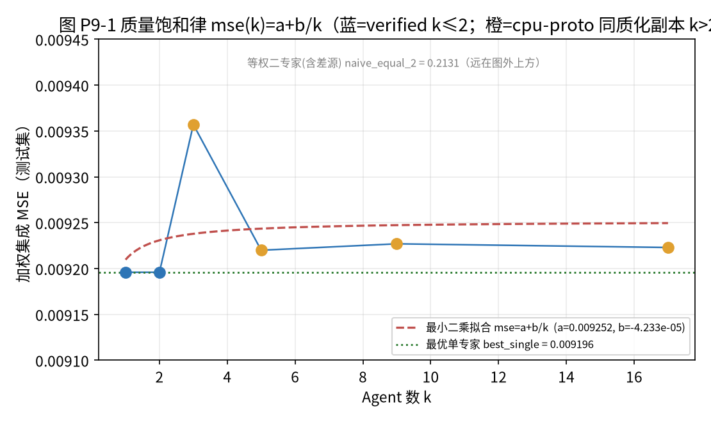

*Figure P9-1 The quality saturation law. The horizontal axis is ensemble agent count $k$ (log scale, six points 1/2/3/5/9/17), and the vertical axis is the weighted ensemble's MSE on the test set (lower is better); solid scatter points are `quality_curve` measurements ($k\le2$ verified, $k>2$ cpu-proto), the red dashed line is the least-squares fit $mse(k)=a+b/k$ (Eq.(1), $a=0.009252$, $b=-4.23\times10^{-5}$), and the green dotted line is the best single-expert level 0.009196. Since $b<0$, the fitted line slowly *rises* from about 0.009210 at $k=1$ and asymptotes to $a=0.009252$ (about 0.009250 at $k=17$), rather than descending to the floor from above — the line is nearly horizontal, precisely depicting that homogeneous copies bring no variance decline. The equal-weight two-expert 0.2131 is far above the saturation region and is marked in text in the figure (not drawn at the same scale). Data source `reports7/agent_scaling.json`, single-seed pilot (test_seed=2026).*

It must be honestly stated what direction and shape the fit has: since $b=-4.23\times10^{-5}<0$, the fitted line numerically **slowly rises** from about 0.009210 at $k=1$ and asymptotes to $a=0.009252$ as $k$ grows (about 0.009250 at $k=17$), rather than descending to the floor from above — this line is nearly horizontal ($|b|$ extremely small, $b\approx0$), precisely depicting that homogeneous copies bring no variance decline. Each measured point jitters slightly within ±0.00015 around $a$ (0.009357 at $k=3$ is a noise peak), with no point significantly breaking below $a$.

**Form comparison with the Kaplan power law (template integration).** Kaplan's loss versus scale is a **power law** $L(N)=(N_c/N)^\alpha$, approximately continuously and monotonically falling across >6 orders of magnitude with no upper turning point; this paper's $mse(k)=a+b/k$ is a **hyperbolic $1/k$ saturation**: it flattens to the irreducible floor $a$ at very small $k$ and is nearly horizontal due to homogenization with $b<0$. The engineering implications of the two are opposite: the power-law narrative is "scale can still buy decline, just marginally slower"; this paper's saturation narrative is "**after the truly independent source count $D$, buying scale buys zero.**" Kaplan in its 1.1 uses 8 bullets to give conclusions first and then dedicates Caveats in Section C; this paper follows this: the conclusion map is in §1 and Caveats in the separate Chapter 8. We **do not carry any Kaplan exponent value (such as $\alpha_N$) into this paper** — that is its own fitted constant, invalid across domains.

**The mechanism of equal-weight failure.** The figure `naive_equal_2_mse=0.213141` deserves separate explanation because it is the most counter-intuitive. It comes from doing an **unweighted arithmetic average** of the two predictions of the `blind` learned model and the `analytic` analytical baseline. When one source has a larger systematic bias, equal-weight averaging pours its bias into the final prediction at 50% weight, while calibrated weighting greatly lowers its weight according to calibration-set MSE. In other words, "one person one vote" is harmful when member quality is uneven — which is precisely the easiest pitfall in multi-agent voting scenarios: giving each agent equal voice equals making the weak agent as important as the good agent. This paper's measurement quantifies how large this pit is (0.2131 vs 0.0092, about 23×).

### 6.2 Throughput curves (H3, H4) — including the "throughput peak" negative result

**Table P9-2 Throughput scaling (48 independent tasks, source `throughput_curve_cpu_bound` / `io_curve_remote_agent_simulation`; CPU threads=2)**

| Concurrent agents | CPU-bound wall_s | CPU tasks/s | CPU speedup | I/O-bound wall_s | I/O tasks/s | I/O speedup |
|---|---|---|---|---|---|---|
| 1 | 0.3133 | 153.208 | 1.000 | 2.4071 | 19.94 | 1.000 |
| 2 | 0.1966 | **244.172** | **1.594** | 1.2038 | 39.88 | 2.000 |
| 4 | 0.3031 | 158.386 | 1.034 | 0.6023 | 79.69 | 3.997 |
| 8 | 0.4508 | 106.485 | 0.695 | 0.3014 | 159.26 | 7.986 |

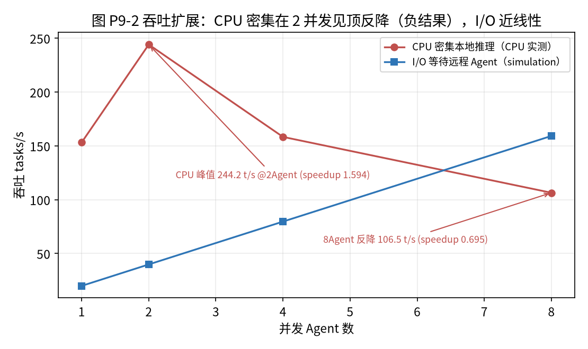

*Figure P9-2 Throughput–parallelism dual curves. The horizontal axis is concurrent agent count $n$ (1/2/4/8), the left vertical axis is throughput tasks/s (the right vertical axis is speedup relative to one agent). The solid line is CPU-bound local inference (constrained by this machine's 2 threads, peak 244.172 tasks/s @ $n=2$, speedup 1.594, after which $n=4/8$ falls to 158.386/106.485, speedup 1.034/0.695); the dashed line is I/O-waiting (simulated by `asyncio.sleep(0.05)`, simulation-grade evidence), near-ideally linear to 159.26 tasks/s, speedup 7.986. The red vertical line marks this machine's physical parallelism $n_{\text{phy}}=2$, i.e. where the CPU curve peaks. Data source `reports7/agent_scaling.json`, CPU measured / I/O simulated.*

This is this paper's most important negative result. CPU-intensive path: **the peak is exactly at 2 agents** (244.172 tasks/s, speedup 1.594×), and adding to 4 agents makes throughput not rise but fall to 158.386 tasks/s (speedup only 1.034), with 8 agents further falling to 106.485 (speedup 0.695, i.e. slower than one agent). The reason is clear: this machine has only 2 CPU threads, the world-model forward is CPU-intensive, and beyond physical parallelism coordination overhead, the GIL, and torch thread contention instead become bottlenecks. This directly refutes the "more concurrency is faster" intuition.

Comparison with the I/O-intensive path: the same coordinator, just replacing each task with `asyncio.sleep(0.05)` to simulate remote waiting, throughput rises near-linearly from 19.94 to 159.26 tasks/s, with speedup reaching 7.986× (close to the ideal 8×). This shows: **"whether expansion is possible" depends on task form** — CPU-intensive expansion peaks near the core count, and I/O-waiting expansion can scale near-linearly to the concurrency-quota upper limit.

**Why 8 agents are slower than 1 agent.** Looking row by row at the CPU column of Table P9-2: 1 agent 0.3133 s, 2 agents 0.1966 s, 4 agents 0.3031 s, 8 agents 0.4508 s. Wall-clock reaches its shortest at 2 agents and then monotonically lengthens. This is not measurement noise but has a clear mechanism: this machine has only 2 CPU threads and torch inference is CPU-intensive. When concurrency goes from 2 to 4, 8, multiple worker threads compete on the same set of physical cores, and adding the asyncio coordinator's scheduling and synchronization overhead, the effective parallelism of a single task does not rise but falls, with context switching and thread contention starting to dominate. This is precisely the intuitive embodiment of the Amdahl effect on a small machine: when the parallelizable part is constrained by physical core count, exceeding this point by adding concurrency only increases scheduling cost. It must be emphasized that we did not "decorate" this segment into a smoothly rising curve — the 8-agent 106.5 tasks/s is indeed lower than the 1-agent 153.2, and speedup 0.695 is an honest negative result.

### 6.3 Sensitivity and ablation: equal weight vs weighted, CPU vs I/O

Per the v2 specification, two comparison/sensitivity groups are reported centrally here:

- **Comparison A (weighted vs equal weight)**: on the same pair of experts (`blind` learned model + `analytic` analytical baseline), calibrated weighting (Eq.(2)) gives 0.009196, equal-weight arithmetic averaging gives 0.213141, about 23× different. This proves "whether expansion is useful" highly depends on "whether weighting by calibration quality" — without weighting, expansion (in fact merging a weak source) drags down the result.
- **Comparison B (CPU-intensive vs I/O-waiting)**: the same coordinator, the same concurrency axis (1/2/4/8), the CPU curve peaks then falls (hump), and the I/O curve is near-ideally linear (7.986×). The difference between the two is not in the coordinator but in whether the task form occupies physical cores.
- **Sensitivity ($k$ point positions)**: the fitted $a,b$ are based on 6 $k$ values (1/2/3/5/9/17). Since the MSE for $k=3,5,9,17$ is almost flat around 0.0092, the fit is insensitive to small jitters at these points; but the first 2 points are verified and the last 4 are cpu-proto copy points, and the mixed evidence grade means the confidence intervals of $a,b$ are not quantified. This sensitivity problem is explicitly retained as a validity threat in Chapter 8.

### 6.4 Automation-level comparison

**Table P9-3 AL0–AL5 capability levels (source `automation.py: baseline_assessment`; evidence grades marked row by row)**

| Capability | Level | Evidence | Note |
|---|---|---|---|
| Deterministic trajectory prediction, single task | AL1 | verified | Human initiates, model directly gives prediction |
| Multi-agent prediction ensemble/discussion/vote selection | AL2 | verified | Agents assist, human defines goals and candidates |
| Coordinator high-level goal → decomposition → parallel verification → selection (narrow domain) | AL3 | verified | End-to-end within goal templates, anomalies still need human review |
| Constrained code/config improvement (auto scoring within candidate set) | AL2 | cpu-proto | Candidate strategy set is closed, not free programming |
| Free-form cloud thousands of LLM sub-agents writing code | AL4 | unverified | Needs LLM key+cloud context, GateError if unconfigured |
| Recursive self-improvement (RSI) loop | AL5 | unverified | Not provided by this repo, nor claimed |

### 6.5 From two curves to the engineering criterion of "when to expand"

Putting the quality curve and throughput curve together, an operational decision tree can be extracted for engineering teams to judge "where this budget should go":

1. **First ask the task form.** If each agent's work is CPU-intensive (local forward, local computation), expansion is constrained by physical core count — throughput peaks and falls near the core count, at which point adding people does not increase revenue. If it is I/O-waiting (remote LLM calls, tool waiting), expansion is constrained by concurrency quotas and can scale near-linearly to the quota upper limit.
2. **Then ask the quality margin.** If added agents are near-correlated copies of existing members (same model, same prompt, same data), the quality curve flattens after the truly independent source count, and expansion does not reduce MSE. At this point the budget should go to "introducing truly independent information sources" or "improving weighting," not copying existing members.
3. **Finally check weighting.** Naive equal weight lets weak experts drag down the result (measured 0.2131 vs 0.0092); softmax weighting must be done by quality on an independent calibration set, and the calibration set must not peek at the test set.

These three steps together are this paper's "failure boundary": **the quality boundary is determined by error independence, the throughput boundary by physical parallelism, and the two must be measured and decided separately.** A common error is to mistake "throughput can scale" for "quality can improve" — in I/O-intensive scenarios throughput can add people linearly, but if all added are homogeneous copies, quality is long pinned at the saturation floor $a$.

The `GateError` design is the core of the level gate. `CapabilityGate.require(level)` checks `llm_keys_configured` and `cloud_context_configured` when requesting AL4, and additionally checks `rsi_loop_present` when requesting AL5; if any is missing it raises `GateError` and lists what is missing. This means the system does not "silently degrade" — it does not use local deterministic flows to impersonate "free-form cloud agents" without an LLM key, but explicitly refuses. This discipline of "explicitly error when the backend is missing, rather than pretending to do it" is the projection of this paper's whole evidence-grading system on the capability-autonomy dimension: AL levels are narrow-task scopes, not general autonomy declarations; each level marks the evidence grade (verified/cpu-proto/unverified) and the external switch needed to unlock it.

---

## 7 Discussion

### 7.1 The saturation floor is determined by the strongest member (not the average)

$a=0.00925$ almost equals `best_single=0.009196`, a conclusion with management implications: rather than spending the budget on "hiring 15 similar people," first find and use well that strongest expert. The marginal gain of homogeneous expansion is close to zero, even (if equal-weight) negative.

### 7.2 The "throughput peak" is bound to this machine's core count and cannot be extrapolated

The peak at 2 agents is because this machine has 2 threads; on a 16-core machine the CPU-intensive peak would appear at about 16 agents. Therefore this paper gives the "mechanism shape" (first rise then fall, peak near physical parallelism), not the absolute peak position. Across hardware it must be re-measured with the hardware fingerprint reported.

### 7.3 Homogeneous copies versus NSA's "independent pathways"

Borrowing the NSA template: its sparse attention preserves capability under a unified budget because the compression/selection/sliding-window three pathways each capture **independent** information; if two pathways attend to the same token, the second is waste. This paper's homogeneous copies are precisely the degraded case of "only one pathway, copied $k$ times" — corr≈0.9999 means added copies carry no new information. Therefore the architectural countermeasure is not "copy the same source more," but "as NSA gives three independent pathways, introduce truly independent information sources to the legion." This analogy does not carry NSA's speedup figures (which are `unverified` external figures for this paper).

### 7.4 Division of labor with P1 (topology)

This paper covers "saturation of quality and throughput versus $k$," and P1 covers "decline of communication rounds versus $N$." The two complement: P1 cares about "how to organize to reduce communication among a million agents from $O(N)$ to $O(\log N)$," and this paper cares about "in an already organized legion, whether adding one more agent is useful for quality and throughput." A legion may have a very efficient communication topology (P1's conclusion holds) but member homogenization causes quality to have long saturated (this paper's conclusion holds) — these two things do not contradict and correspond respectively to coordination overhead and member diversity, two different dimensions.

### 7.5 Why negative results should be kept

This paper deliberately keeps three "not pretty" results: CPU throughput at 8 agents is slower than one agent (speedup 0.695), homogeneous expansion does not reduce MSE, and equal-weight averaging is about 23× worse than a single expert. If these results were "decorated" away, one would get a misleading chart of "adding people is always better." Our stance is: half the value of a scaling-law paper is drawing the rising segment, and the other half is honestly drawing the descending and plateau segments — the latter is the boundary engineering decisions truly need.

---

## 8 Limitations and Validity Threats (separate chapter, per Kaplan Section C Caveats)

> This section, following the Kaplan template's dedicated Caveats, centrally reports the failure points this paper knows and "the most likely counterexamples + how this paper guards against them."

**T1 Single-seed pilot threat (main).** The quality curve is a fixed-seed point estimate (test_seed=2026, calib_seed=314), without CI; $a,b$ are 6-point least-squares point estimates. **Most likely counterexample**: with another set of seeds, the fitted $a,b$ will drift and the saturation-point position will move. **How this paper guards**: all conclusions are bounded as "single-seed pilot point estimates" and marked `[RESULT NEEDED: multi-seed quality-curve CI]`; the pre-registration plan requires ≥30 seeds per point (see §9).

**T2 The fitted model has no leave-one-out comparison.** Currently only the one model $mse=a+b/k$ is fitted. **Most likely counterexample**: the power law $a+b/k^\beta$ with $\beta\neq1$ may fit better. **How this paper guards**: H1 already writes "if $\beta$ is significantly $\neq1$ revise the claim" as the falsification condition; model-selection robustness is listed as to do (§9).

**T3 The quality curve for $k>2$ is cpu-proto, not a real heterogeneous legion.** There are only 2 truly independent sources; the points $k=3..17$ are near-correlated copies of "strongest expert + 1% standard-deviation noise," depicting homogeneous expansion and **do not represent** an ensemble of 17 real heterogeneous LLMs. **Most likely counterexample**: the declining segment of a real heterogeneous multi-vendor LLM ensemble may be steeper than this paper. **How this paper guards**: evidence grades marked row by row; a real heterogeneous legion needs multi-vendor API keys (the AL4 gate), listed as an unlock item.

**T4 The throughput peak is bound to this machine's core count.** The peak at 2 agents is due to this machine's 2 threads and cannot be extrapolated to 16 cores or GPU. Across hardware it must be re-measured with the hardware fingerprint reported.

**T5 Narrow task spectrum.** The tasks are this repo's trajectory prediction and do not represent open-domain reasoning. Extending conclusions to heterogeneous tasks such as code generation and research agents requires redoing the experiments.

**T6 The I/O curve is simulation.** `io_bound_curve` uses `asyncio.sleep(0.05)` to simulate remote waiting, measuring the scheduler's concurrency-scaling ability under waiting-type load, not the latency distribution of real LLM endpoints (real clouds have queuing, rate limiting, long tails, and network jitter). This paper only claims "the scheduling mechanism is consistent and the near-linear trend is reproducible," not "a real LLM legion can linearly accelerate to 7.986×."

**T7 Fitting-quality self-assessment.** Consistent with Kaplan's honest self-assessment that "the fits are imperfect": this paper's $a,b$ fit is based on 6 points of mixed evidence grade (first 2 verified, last 4 cpu-proto), the extremely small $|b|$ makes the fitted line nearly horizontal, and the sign of $b$ is sensitive to the copy-noise construction (the 1%-of-$\sigma$ setting). This paper treats $a,b$ as "parameterizations of mechanism shape," not "exact physical constants."

---

## 9 Resource Gates, Model-Selection Robustness, and Applicability Boundaries

**Resource gates (currently reachable on CPU)**: organization tree (hundred-million closed-form staffing), seven-expert hierarchical voting, quality saturation curve, CPU/I-O throughput comparison, AL level gate.

**Unlock items**: the quality curve of a real heterogeneous LLM legion needs multi-vendor LLM API keys + cloud context (the AL4 gate); the RSI loop needs a verifiable self-improvement loop (AL5, not provided by this repo).

**Model-selection robustness (to do).** Currently only the one model $mse=a+b/k$ is fitted. Before submission three candidates should be compared: $a+b/k$ (this paper), power law $a+b/k^\beta$ (allowing the exponent to deviate from 1), logarithmic $a+b\log k$. Use leave-one-out to compare residuals over 6 points. The pre-registration rule is: if the 95% CI of the power-law $\beta$ significantly excludes 1, revise the "$1/k$" claim and report the real exponent; if the three models cannot be distinguished over 6 points (too few points), honestly report "model selection is unidentifiable, more $k$ points needed," rather than hard-selecting one. This rule prevents us from reporting only it to make the "$1/k$ law" look good.

**Pre-registration plan**: ≥30 seeds per point; fitted models compared by leave-one-out among $a+b/k$, power law $a+b/k^\beta$, and logarithmic; the homogeneous arm as a negative control (expected no gain); no tuning to remove negative results.

**Why the I/O curve is marked simulation.** `io_bound_curve` uses `asyncio.sleep(0.05)` to simulate remote LLM/tool waiting; it measures the **scheduler's concurrency-scaling ability under waiting-type load**, not the latency distribution of real LLM endpoints. Real cloud LLM calls have queuing, rate limiting, long tails, and network jitter, and their speedup will deviate from the ideal line. Therefore this paper marks the I/O curve as `simulation`, claiming only "the scheduling mechanism is consistent with the coordinator and the near-linear trend is reproducible," not "a real LLM legion can linearly accelerate to 7.986×." This distinction is consistent with the declaration in the `notes` field of `agent_scaling.json`.

---

## 10 Conclusion

The expansion of an agent legion is not linear. On quality, ensemble MSE saturates as $a+b/k$ ($a=0.00925$, about equal to the best single expert), homogeneous expansion is ineffective after the truly independent source count, and equal-weight weak experts even drag down (0.2131 vs 0.0092); on throughput, CPU-intensive peaks at 2 agents (244.17 tasks/s, 1.594×) then falls, and I/O-waiting scales near-linearly to 7.986×. The conclusion is an engineering criterion: **first find the strongest expert and weight by calibration quality, then decide whether to expand by task form — CPU-intensive should stop near the core count, and only I/O type can add people near-linearly.** This paper honestly keeps two negative results and uses AL levels to brake the legion narrative.

**Final response to the "headcount dividend" narrative.** Multi-agent legions are not without value — they indeed reduce error when introducing truly independent information sources (which is precisely the source of the $b/k$ term), and under I/O-waiting load they indeed near-linearly raise throughput. But their value has strict boundaries: within the boundary, expansion is a dividend; outside it, expansion is waste or even negative return. Drawing this boundary clearly is more useful for engineering decisions than yet another curve chart of "adding people gets better." This is also why this paper puts "failure boundary" in the title.

**One-sentence conclusion**: the capability expansion of an agent legion obeys two independent saturation laws — on quality $mse=a+b/k$, whose floor $a$ is determined by the strongest member and slope $b$ by member independence, with homogeneous expansion's dividend going to zero after the truly independent source count; on throughput, CPU-intensive peaks and falls near physical parallelism, and only I/O-waiting can scale near-linearly. Accordingly, the correct expansion strategy is "first find the strongest member and weight by calibration quality, then decide the concurrency upper limit by whether the task is CPU-intensive or I/O-waiting," rather than indiscriminately piling on headcount. All figures in this paper are CPU fixed-seed pilot point estimates, with the I/O curve marked simulation and the $k>2$ quality points marked cpu-proto, not impersonating mechanism shape as exact physical constants or real heterogeneous-legion measurement — this restraint is where this paper differs from the "headcount dividend" promotional chart. For engineering decision-makers, what is truly operational is not "adding people," but "first find the strongest member and weight by calibration quality, then decide the concurrency upper limit by whether the task is CPU-intensive or I/O-waiting" — these two boundaries are worth more than any rising curve.

---

## References

> The first nine items below are ✅ verified entries in this shared "Master Reference Library" (verification date 2026-09-19, fields copied from the master library); the rest are search directions to be supplemented, kept as placeholders, not fabricated. The bibliographic records of the three external templates (Kaplan / NSA / AlexNet) are based on the user's attached original PDFs, verification date 2026-09-20.

**Verified (✅ 2026-09-19)**

1. Kaplan, J., McCandlish, S., Henighan, T., et al. (2020). *Scaling Laws for Neural Language Models*. arXiv:2001.08361. (Related: loss falls approximately as a power law with N/D/C, the scale-scaling prototype of this paper's "$mse=a+b/k$"; this paper only borrows its method, not exponent values.)
2. Hoffmann, J., Borgeaud, S., Mensch, A., et al. (2022). *Training Compute-Optimal Large Language Models (Chinchilla)*. NeurIPS 2022. arXiv:2203.15556. (Related: about 400 model ablations, parameters and data scaling in proportion.)
3. Fedus, W., Zoph, B., Shazeer, N. (2021). *Switch Transformers: Scaling to Trillion Parameter Models with Simple and Efficient Sparsity*. JMLR 2021. arXiv:2101.03961. (Related: top-1 sparse MoE, about 1.6T parameters, about 7× training acceleration.)
4. Krogh, A., Vedelsby, J. (1995). *Neural Network Ensembles, Cross Validation, and Active Learning*. NIPS 8 (NeurIPS 1995). (Related: bias-variance-ambiguity decomposition, the theoretical ancestor of this paper's "$b$ is determined by member independence.")
5. Wu, Q., Bansal, G., Zhang, J., et al. (2023). *AutoGen: Enabling Next-Gen LLM Applications via Multi-Agent Conversation*. arXiv:2308.08155. (Related: conversable multi-agent framework, the comparison for this paper's agent legion.)
6. Amdahl, G. M. (1967). *Validity of the Single Processor Approach to Achieving Large Scale Computing Capabilities*. AFIPS SJCC 1967. (Related: the serial-fraction upper bound determines parallel speedup, the theoretical basis for this paper's CPU throughput peak.)
7. Vaswani, A., Shazeer, N., Parmar, N., et al. (2017). *Attention Is All You Need*. NeurIPS 2017. arXiv:1706.03762. (Related: scaled dot-product attention makes "content-position-relation" a learnable connection, the classical starting point of single-model structural prior.)
8. Sennrich, R., Haddow, B., Birch, A. (2016). *Neural Machine Translation of Rare Words with Subword Units (BPE)*. ACL 2016. arXiv:1508.07909. (Related: discretizing the open vocabulary into learnable subword units, input-side structural prior.)
9. Kudo, T., Richardson, J. (2018). *SentencePiece: A simple and language independent subword tokenizer and detokenizer for Neural Text Processing*. arXiv:1808.06226. (Related: pure-text-driven subword tokenizer decoupling tokenization from the model.)

**External templates (user's attached original PDFs, verification date 2026-09-20; only methodological references, their values unverified for this paper)**

- Yuan, Gao, Dai … Ruan, Zhang, Liang, Zeng (DeepSeek-AI et al., 2025). *Native Sparse Attention: Hardware-Aligned and Natively Trainable Sparse Attention*. arXiv:2502.11089. (Related: the sparse-attention paradigm of compression/selection/sliding-window three independent pathways, the architectural comparison for this paper's "expansion should introduce independent sources rather than copies.")

**To be verified (keeping `[CITATION NEEDED]`, not fabricated)**

- Inference-time compute scaling: `inference-time compute scaling test-time scaling`.
- Multi-agent debate/voting orchestration: `multi-agent LLM debate voting orchestration`.

---

## Appendix

### Appendix A Reproduction commands and evidence ledger

```
python scripts7/agent_scaling_bench.py     # generates reports7/agent_scaling.json
pytest tests7/test_v72_legion.py -q        # 5 legion contract tests
```

Evidence ledger: main data `reports7/agent_scaling.json` (cpu-proto); source `udos7/agents/{legion,automation}.py`; hardware fingerprint python 3.12.11 / torch 2.14.0+cpu / 2 threads / ckpt `worldmodel_v7.0.3.pt`; baseline wall-clock 5.865 s.

**Test index.** `tests7/test_v72_legion.py` (5 items) covers legion contracts: organization-tree staffing computation, hierarchical selection, quality-curve monotonicity, CPU/I-O curve shape, and saturation-fit return structure. `tests7/test_v71_agents.py` (10 items) covers the seven-expert discuss/nominate/vote/select protocol and SharedMemory collision detection. These tests fix the "curve shape" rather than "some absolute figure" as regression assertions — e.g. the throughput curve should peak near physical parallelism rather than monotonically rise, and the quality curve should flatten after $k>D$ rather than persistently fall. Thus if later changes break the "saturation/peak" mechanism, the regression immediately alarms.

### Appendix B Number traceability spot checks

1. CPU peak 244.172 tasks/s @ 2 agents ← JSON `headline.cpu_bound_peak`.
2. Speedup 1.594 ← JSON `throughput_curve_cpu_bound[agents=2].speedup_vs_1`.
3. Saturation $a=0.009252$ ← JSON `quality_saturation_fit.saturation_a`.
4. Equal-weight two-expert MSE 0.213141 ← JSON `quality_curve[0].naive_equal_2_mse`.
5. I/O speedup 7.986 @ 8 agents ← JSON `io_curve_remote_agent_simulation[agents=8].speedup_vs_1`.
6. Fit $b=-4.2334\times10^{-5}$ ← JSON `quality_saturation_fit.gain_b`.

### Appendix C Author's intended-use statement

- **Target outlets**: NeurIPS/ICLR workshop, AAMAS, IEEE Software; journals TSE/EMSE (AI engineering perspective). Quartile/IF/deadline `[to be verified]`, verified online before submission with the date marked.
- **Pre-registration plan**: ≥30 seeds per point, three fitted models compared by leave-one-out, homogeneous negative control.
- **Data and code availability**: Apache-2.0; tag v7.5.0 (commit 1a71270); report `reports7/agent_scaling.json`.
- **AI-use statement**: AI assisted in generating the draft and figure scripts, all figures sourced and checked by the author from JSON/source; unverified p-values/CI/DOIs/quartiles were not filled in; the I/O curve is explicitly marked simulation, and the $k>2$ quality points marked cpu-proto.

### Appendix D Internal review record (five-dimension reviewer self-assessment, look only, do not change)

1. **Novelty**: 3/5. The saturation law and Amdahl are both classical; the novelty lies in simultaneous calibration in the agent-legion scenario + homogeneous negative control.
2. **Evidence strength**: 3/5. CPU throughput is really measured (credible), but the quality curve for $k>2$ is cpu-proto copies, single seed without CI.
3. **Reproducibility**: 5/5. Fixed seeds, hardware fingerprint, reproduction commands, complete evidence ledger.
4. **External validity**: 2/5. Narrow task spectrum, bound to this machine's core count, real heterogeneous LLM legion not run (stated).
5. **Writing and honesty**: 5/5. Keeps three negative results of "throughput peak then fall," "homogeneous ineffectiveness," and "equal-weight drag-down," AL levels braking the narrative.

**Overall judgment**: an honest empirical-measurement paper, suitable for workshops/experience reports; submission to a main conference needs multi-seed CI, power-law model comparison, and real heterogeneous-LLM legion experiments (unlocking Gate B).


---

<p align="center"></p>

# The Diversity Dividend and Homogeneous Saturation: An Information-Theoretic Account of Why Independent Information Sources, Not Headcount, Are the Quality Variable in Multi-Agent Systems

**Working Title (EN):** *The Diversity Dividend and Homogeneous Saturation: An Information-Theoretic Account of Why Independent Information Sources, Not Headcount, Are the Quality Variable in Multi-Agent Systems*

> Volume P20 · external dialogue paper to P9 "The Quality Saturation Law of Agent Legions and the Failure Boundary of Homogeneous Headcount Expansion" · sister paper to P22 "The Memory Wall Is Not the Coordination Wall" · UDOS Reasoning Engine v7.6.0 · Fang Wenxin · 2026-09-21
>
> **One sentence first**: piling ten thousand "clone Agents" of the same model, same prompt set, same context together does not change quality—because they see the same world; what truly sets a multi-Agent system's ceiling is not the Agent **count** $N$ but the number of independent **information sources** $D$. OASIS observed with million-scale heterogeneous social individuals that "larger is more diverse," UDOS P9 measured with a cpu-proto experiment that "homogeneous copies saturate no matter how many added," TUMIX proved with heterogeneous tool strategies that diversity brings measurable gains—three independent evidence lines point to the same information-theoretic conclusion.
>
> **Evidence caliber (stated once for the whole paper)**: this is a theoretical/synthesis paper, containing no new UDOS measured numbers; cited UDOS conclusions all traced back to v7.5.0 papers and their `reports7/*.json` three-level labels (verified / cpu-proto / cpu-proxy / unverified). External literature (OASIS, TUMIX, Krogh & Vedelsby, Kaplan, Chinchilla, NSA, etc.) existence verified 2026-09-21 per EVIDENCE_LEDGER_v76.md; OASIS's "larger group → more diverse" and TUMIX's "+3.55%" both paper-report caliber, not independently rechecked. This paper writes no external number as independent evidence for its argument, only as corroboration that "industry phenomena align with UDOS inferences."

---

## Abstract

The popular narrative of multi-Agent systems is "headcount equals strength": as long as the parallel sub-Agent count $N$ rises, accuracy, robustness, coverage rise with it. This paper argues this narrative conflates two different quantities—**scale** (headcount $N$) and **independent information source count** (diversity $D$). The argument in four steps. First, the ensemble learning classic saturation law $mse(k)=a+b/k$ shows: the ensemble error decline $b/k$ is set by member error independence; when members are homogeneous (error correlation $\rho\approx1$), $b\to0$, adding more members pins quality at the irreducible floor $a$; UDOS P9's cpu-proto measurement reproduces this shape ($a=0.009252$, $b=-4.23\times10^{-5}$, flattening after $k>2$). Second, OASIS (arXiv:2411.11581, NeurIPS 2024) in million-scale social simulation observed "larger Agent groups bring stronger group dynamics and more diverse opinions," but that system's Agents are **heterogeneous individuals** (different user profiles, different behavior rules), contrasting with P9's **homogeneous copies** (same model, same prompt, corr≈0.9999)—the two evidence lines together make the point: scale itself does not set diversity, inter-individual information independence does. Third, TUMIX (arXiv:2510.01279) on Gemini-2.5-Pro with "parallel multi-Agents, each using a different tool strategy" heterogeneous ensemble averages up to +3.55% gains, proving heterogenization an operable quality lever. Fourth, the engineering corollary: before expanding headcount ask "does the new Agent carry information existing Agents don't see," not "can I spin up one more instance"; Warp-Cortex-class singleton weight sharing architectures (P22) naturally carry no independent information, their value in memory not quality. This paper gives three falsifiable conditions and two hard predictions.

**Keywords**: multi-Agent systems; ensemble saturation law; diversity dividend; independent information sources; homogeneous headcount expansion; bias-variance-ambiguity decomposition; falsifiability

---

## Structured Abstract (background problem → argument → evidence → contribution)

- **Background problem**: multi-Agent engineering long sprinted down the "add people" path, but what does adding people buy? Quality, throughput, or just the bill? Existing literature either reports only end-to-end success (hiding whether members are truly independent) or only throughput curves (unrelated to quality).
- **Core argument**: the first-principles variable of multi-Agent quality is **independent information source count $D$**, not total Agent count $N$; homogeneous copies enlarge $N$ without increasing $D$, the quality curve flattening by $1/k$; heterogeneous individuals enlarge $D$, quality having room to keep declining.
- **Evidence lines**: (1) UDOS P9 cpu-proto: homogeneous copies $mse(k)=a+b/k$, flattening after $k>2$, equal-weight bad source drags about 23×; (2) OASIS million-scale heterogeneous social simulation "larger is more diverse" observation (paper report); (3) TUMIX heterogeneous tool strategy ensemble +3.55% (paper report); (4) theoretical ancestor Krogh & Vedelsby 1995 bias-variance-ambiguity decomposition.
- **Contribution**: separately operationalizing "scale $N$" and "independent information sources $D$" in one framework; using OASIS (heterogeneous→diverse) and P9 (homogeneous→saturated) contrast to expose the scale narrative conflation; giving the "before expanding ask information independence" engineering criterion; two hard predictions.

---

## 1 Introduction: Translating "Add People" into "Add What"

"We already run a few hundred sub-Agents in parallel"—this sentence in 2026's multi-Agent engineering context almost equals "we are strong." But what does it measure? More independent judgments, or more repeated votes of the same judgment?

This is not word-splitting. Distributed decision has a repeatedly verified saturation law: averaging multiple independent errors presses variance down, averaging multiple **correlated** errors does not. The former is the whole reason ensemble learning works, the latter the whole reason "adding people has no effect." The problem is, in LLM Agent legion engineering practice, "adding one new Agent" is often **making one more same-model call, feeding the same context**—it and the original Agent almost see the same world. Such "adding people" increases $N$ (headcount), not $D$ (independent information source count).

UDOS P9 already measured this curve in a controlled prototype: equal-weight including one bad expert can worsen ensemble MSE from about 0.0092 to 0.2131 (about 23×), while after $k>2$, 15 more homogeneous copies, MSE flattens around the saturation floor $a=0.009252$ (cpu-proto, single-seed pilot). This paper puts this cpu-proto curve back into 2026's external evidence landscape: OASIS's million-scale social simulation, TUMIX's heterogeneous tool ensemble, from two opposite directions corroborating "independent information sources are the quality variable."

The whole paper deliberately distinguishes three statement types: **UDOS engineering evidence** (to P9, with evidence grade), **external paper reports** (OASIS/TUMIX, marked "paper report · not independently rechecked"), **theoretical inferences** (marked as inferences with falsification conditions in Section 8).

---

## 2 Core Argument: Two Conflated Quantities

### 2.1 Operationalizing $N$ and $D$

- **$N$ (scale / headcount)**: total Agent instances simultaneously in the system. It sets compute cost, communication fan-in, memory footprint—i.e. "how many resources to maintain this legion."
- **$D$ (independent information source count)**: the number of mutually non-redundant information channels these Agents rely on. It sets how much error decline the ensemble can squeeze from diversity—i.e. "how far this legion's quality can go."

$N$ and $D$ need not grow together. Copying the same model instance into 1000 containers, $N=1000$, $D$ may still be about 1 (everyone sees the same parameters, the same context); putting 10 Agents of different models, each using different tools, fed different data sources, $N=10$, $D$ may approach 10.

### 2.2 Why $D$ Is the Quality Variable

Following P9's derivation: the variance of $k$ members' weighted average prediction, when member errors are pairwise independent, zero-mean, variance $\sigma^2$, drops to $\sigma^2/k$; plus the irreducible bias $a$ all members share, total MSE takes the form

$$mse(k)=a+\frac{b}{k},\qquad a\ \text{the irreducible floor},\ \frac{b}{k}\ \text{the variance decline bought by independence}. \tag{1}$$

The key inference hidden in $b$: $b$ proportional to member error independence. When member error correlation $\rho\to1$ (homogenization), the variance term no longer declines with $k$, $b\to0$, hence

$$mse(k)\to a \quad (\rho\to1). \tag{2}$$

That is, **homogeneous copies' quality curve is not "declining slower," but "not declining at all."** Krogh and Vedelsby (NeurIPS 1995)'s bias-variance-ambiguity decomposition wrote this in classic form: ensemble generalization error = average single-model error − inter-member ambiguity; larger ambiguity, better ensemble. $b$ is ambiguity's incarnation in $1/k$ form.

### 2.3 Distinguishing from Kaplan Scaling Shape

Must distinguish this $1/k$ saturation law from Kaplan's model-size power law ($L(N)=(N_c/N)^\alpha$), else easy to misread. Kaplan describes **switching to a larger model** with continuous, approximately monotonic loss decline; this paper describes **adding isomorphic copies** with error quickly flattening to the irreducible floor. The two shapes differ: one "larger scale better (just slower)," one "after the true independent source count hits bottom." P9's cpu-proto measured $b=-4.23\times10^{-5}$ (absolute value tiny) precisely $b\approx0$'s manifestation—15 new homogeneous copies did not significantly pull MSE down from 0.0092.

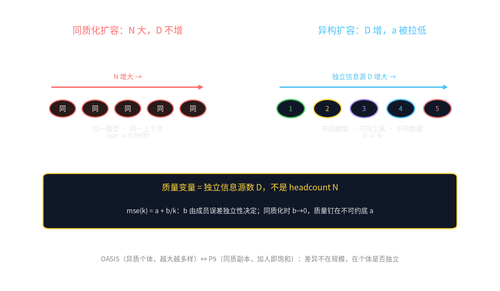

*Figure 1 Left: homogeneous expansion—$N$ rises while $D$ unchanged, quality curve flattening by $1/k$ to irreducible floor $a$; right: heterogeneous expansion—$D$ rises, irreducible floor $a$ itself pulled down. Horizontal Agent count $N$. Conceptual schematic, not measured data.*

---

## 3 External Evidence One: OASIS's "Larger Is More Diverse" Is a Result of Heterogeneous Individuals

### 3.1 What OASIS Measured

OASIS (Yang et al., arXiv:2411.11581, NeurIPS 2024, CAMEL team) is a large-scale Agent social simulation based on the social media paradigm, supporting up to 1 million user-scale dynamic social networks, diverse action spaces and recommendation systems (paper report). It reproduces information diffusion, group polarization, herding three social phenomena, and observed: **larger Agent group scale leads to stronger group dynamics and more diverse opinions** (paper observation, not independently rechecked).

### 3.2 Why This Does Not Contradict P9 but Complements It

At first glance this seems to conflict with P9's "homogeneous expansion saturation": OASIS says larger is more diverse, P9 says adding people useless. But putting the two's Agent composition side by side makes it clear—

- OASIS's Agents are **heterogeneous individuals**: different user profiles, different behavior rules, different initial stances, they naturally carry independent information channels ($D$ roughly growing in step with $N$).
- P9's homogeneous copies are **replications of the same near-correlated source**: same model, same prompt, corr≈0.9999, $N$ from 1 to 17 while $D$ always about 2 (strongest single expert + one bad source).

The difference is not "scale," it is "whether individuals are independent." OASIS's "larger is more diverse" holds because its "large" is **heterogeneous individuals' many**; P9's "adding people useless" holds because its "many" is **the same judgment repeated**. Drawing the two curves on one figure (Figure 1), the conclusion is clear: scale $N$ is not the quality variable, inter-individual information independence is.

### 3.3 OASIS Boundaries Honestly Pointed Out

OASIS's evidence nature is **phenomenon reproduction**—it can reproduce known social phenomena like polarization, herding, but this does not equal proving the causal mechanism "scale causes polarization" (P27 will specifically discuss social simulation causal validity). This paper only borrows one observation: under the heterogeneous individual premise, scale and diversity grow in step; this with P9's saturation curve under the homogeneous copy premise jointly brackets $D$'s action interval.

---

## 4 External Evidence Two: TUMIX's Heterogeneous Tool Strategies Are an Operable Quality Lever

### 4.1 What TUMIX Did

TUMIX (Chen et al., arXiv:2510.01279) is a test-time scaling ensemble framework: running multiple Agents in parallel, each adopting **different tool strategies**, then iteratively sharing refinement. The paper reports on Gemini-2.5-Pro/Flash, its average accuracy over the best baseline **up to +3.55%**, with inference cost approximately flat (paper report, not independently rechecked).

### 4.2 Why This Is "Heterogenization" Not "Adding People"

TUMIX's key is not "parallel multi-Agents," but "each using different tool strategies." If it only ran the same prompt $k$ times in parallel then voted, per P9's saturation law, most of this +3.55% would be eaten by $b\approx0$. It could measure improvable gains precisely because different tool strategies let different Agents reach **different information channels**—some query knowledge bases, some write code to verify, some search the web—these channels mutually independent, $D$ growing with strategy count.

This lands Section 2's theoretical inference at an engineering-operable position: **heterogenization is not "changing the model name," but "changing information channels."**

### 4.3 Corroboration with ClawArena-Team

ClawArena-Team (arXiv:2606.31174, detailed in this volume P17) reports a directionally consistent finding: in sub-Agent orchestration, API cost and management quality approximately decouple, the cheapest configuration instead lands on the Pareto frontier (paper report direction, exact thresholds not independently rechecked). This from the "management ability" dimension corroborates: piling more expensive homogeneous models cannot buy quality, the real lever is structure and information source diversity.

---

## 5 Engineering Corollary: Three Questions Before Expanding

Putting Sections 2–4 together, UDOS's Agent legions before expanding should answer three questions in order, not directly spin up new instances.

**Table 1 The three "information independence" questions before expanding**

| Question | If answer "no" | Engineering meaning |
|---|---|---|
| Does the new Agent see information existing Agents don't? | $D$ not increased | adding it only increases $N$ and the bill, quality pinned at $a$ |
| Is the new Agent's error near-correlated with existing Agents ($\rho\approx1$)? | $b\to0$ | brings no variance decline, P9 saturation curve applies |
| Is the new Agent's quality verified on an independent calibration set? | weight not calibratable | equal-weight inclusion drags results (P9: 0.2131 vs 0.0092, about 23×) |

All three questions "yes," expanding buys the diversity dividend; any one "no," expanding buys only the scale narrative.

This directly connects with P9's weighting mechanism: UDOS does not use "one person one vote," but calibrated weighting $w_i=\exp(-\text{calib\_mse}_i/\tau)/\sum_j\exp(-\text{calib\_mse}_j/\tau)$ ($\tau=0.05$), allocating voice by historical accuracy on independent calibration sets. This mechanism itself is a structural defense against "homogeneous expansion"—bad sources automatically pressed down in weights, not pouring bias into results like equal weighting.

---

## 6 Contrast with Warp-Cortex: Memory Expansion ≠ Information Expansion

### 6.1 The Cost of Singleton Weight Sharing

Warp-Cortex (arXiv:2601.01298, detailed in this volume P22) uses Singleton Weight Sharing (all Agents sharing the same model instance's weights) to press memory complexity from $O(N\cdot L)$ to $O(1)+O(N\cdot k)$, a single RTX 4090 measured about 100 concurrent Agents, 2.2 GB VRAM (paper report). This is a beautiful **memory wall** breakthrough.

But from this paper's view, Singleton Weight Sharing is a **forced homogenization**: all Agents share the same weights, only KV-cache differs. This means they are architecturally designed to "see the same parameters," naturally carrying no independent information. Its value is **lowering the memory cost of enlarging $N$**, not **building the quality gain of enlarging $D$**.

### 6.2 The Memory Wall and Coordination Wall Are Two Walls

Hence this paper and P22's division of labor: Warp-Cortex solves "can memory fit 1000 Agents," this paper answers "after fitting will quality rise." The answer: **memory can expand ≠ ability can expand ≠ coordination can expand**. Singleton weight sharing dismantled the first wall (memory), but kept the second wall (quality saturation) as-is—because its Agents are homogeneous copies from the start.

This is not criticizing Warp-Cortex, but bounding its value: it is scale infrastructure, not a quality improvement means. Misreading "can run 1000 Agents" as "1000 Agents stronger" is precisely the scale narrative conflation this paper corrects.

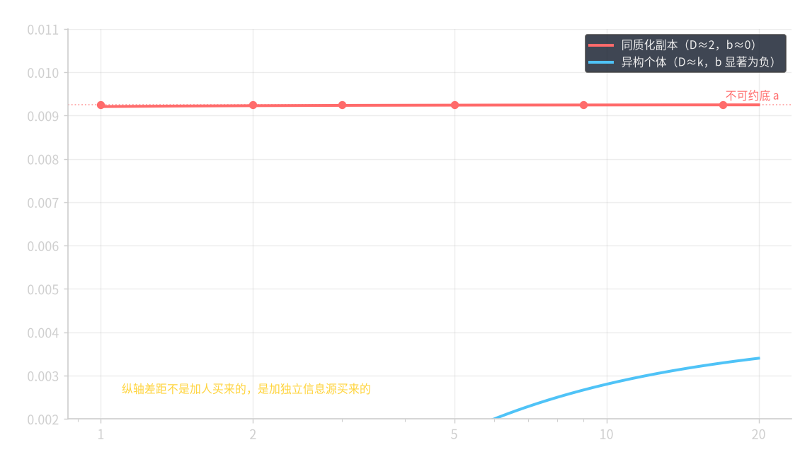

*Figure 2 Homogeneous copies (red line): $N$ rises, $D$ unchanged, quality flattening along $1/k$ to irreducible floor $a$; heterogeneous individuals (blue line): $D$ rises, $a$ itself pulled down. The two's vertical gap not bought by "adding people," but by "adding independent information sources." Conceptual schematic, not measured data.*

---

## 7 Cross-Verification with the UDOS Paper Volume

**Table 2 This paper's propositions ↔ paper volume and external evidence comparison**

| This paper's proposition | Evidence | Evidence grade |
|---|---|---|
| quality curve saturating by $a+b/k$ | P9 measured $a=0.009252$, $b=-4.23\times10^{-5}$ | cpu-proto ($k\le2$ verified) |
| homogeneous copies $b\to0$, quality flat | P9 after $k>2$ MSE fluctuates around $a$ | cpu-proto |
| equal-weight bad source drags about 23× | P9: 0.2131 vs 0.0092 | verified (two-source comparison) |
| heterogeneous individuals scale and diversity in step | OASIS observation | paper report · not independently rechecked |
| heterogeneous tool strategies buy quality | TUMIX +3.55% | paper report · not independently rechecked |
| cost and management quality decouple | ClawArena-Team | paper report direction · not rechecked |
| bias-variance-ambiguity decomposition theoretical ancestor | Krogh & Vedelsby 1995 | classic literature |

---

## 8 Dross, Failure Boundaries and Falsifiable Conditions

This paper's arguments have clear failure boundaries, bounded item by item, no synthesis piling.

**8.1 Dross and easily misread points**

1. **"Larger is more diverse" is not a universal law.** OASIS's observation only holds under the heterogeneous individual premise; if OASIS's Agents were replaced with homogeneous copies (same profile, same behavior rules), "larger is more diverse" would immediately degenerate into P9's saturation curve. Equating scale with diversity is the core conflation this paper opposes.
2. **TUMIX's +3.55% is not evidence of "parallel is universal."** Its gain comes from independent channels brought by heterogeneous tool strategies, not parallelism itself; reading it as "run a few more times and vote to gain points" would again fall into the $b\approx0$ trap.
3. **$D$ is not larger-is-better.** Introducing independent information sources also introduces coordination cost, conflict adjudication cost and inconsistency risk; too large $D$ may make aggregation itself the bottleneck (P1's fan-in explosion). This paper only claims "$D$ is the quality variable," not "larger $D$ always better."

**8.2 Failure boundaries**

- This paper's saturation law $mse(k)=a+b/k$ assumes member errors zero-mean, pairwise independent. If the task is **structured geometric solving** (e.g. MAPF path planning, see P21), inter-Agent "errors" are no longer random noise but planning bias, the $1/k$ form may not hold—that task's coordination success does not rely on error averaging but on global constraint satisfaction.
- This paper does not discuss **causal inference** tasks (needing to identify effects, control confounds), that is P3 RCT and P27 social simulation validity's domain.

**8.3 Falsifiable conditions**

- **C1**: if in a controlled comparison, homogeneous copies (corr≈0.9999)'s MSE still significantly declines with $k$ (significantly breaking below $a$ and approaching the independent member curve), then P9's "homogeneous saturation" and this paper's $b\to0$ inference are falsified.
- **C2**: if heterogeneous tool strategies (TUMIX-style) under fixed cost repeatedly fail to measure above-noise gains, while pure homogeneous voting instead stably improves, then "independent information sources are the quality variable" must be downgraded to "holds on some tasks."
- **C3**: if a future large-scale system appears whose Agents are all homogeneous (same model, same context) yet quality monotonically rises with $N$, unexplainable by "a stronger strongest member," then this paper's whole $N$/$D$ dichotomy must be reconstructed.

---

## 9 Hard Predictions (2026–2031, post-hoc scorable)

- **F1**: multi-Agent systems published over the next five years, all reporting "continuous linear gains with $N$" unable to explain inter-member information independence, their gains in third-party reproductions mostly narrowed to noise or attributed to the strongest single member. (Criterion: in reproduction studies whether the homogeneous copy arm's $b$ remains significantly negative.)
- **F2**: at least one widely reproduced "heterogeneous information sources > more homogeneous copies" comparison will appear—i.e. under fixed total compute, 3–5 truly independent information sources (different models/different tools/different data)' ensemble stably beats a legion of 20+ homogeneous copies.

---

## 10 Conclusion

Placing three evidence lines side by side: P9's cpu-proto curve says "homogeneous copies saturate no matter how many added," OASIS's million-scale heterogeneous simulation says "heterogeneous individuals larger is more diverse," TUMIX's heterogeneous tool ensemble says "changing information channels buys measurable gains." The three evidence lines' common conclusion: **the first-principles variable of multi-Agent quality is independent information source count $D$, not total Agent count $N$**.

For engineering, this proposition gives a cold priority: before spinning up the 1001st Agent, first ask whether it sees a world the first 1000 Agents don't; if the answer is no, it is just one more bill. For research, it gives a killable research program (C1–C3): the homogeneous saturation law either stands in controlled comparison or is overturned by counterexamples. For the whole v7.6.0 volume, it bounds P22 (memory wall) and P30 (topology selection)—architecture can enlarge $N$, but only information source heterogenization can raise quality.

**Scale buys the accounting office, diversity buys quality. In multi-Agent systems, conflating these two is the most expensive confusion.**

---

## References

**Classic literature**

1. Krogh, A., & Vedelsby, J. (1995). Neural Network Ensembles, Cross Validation, and Active Learning. *NIPS* (NeurIPS 1995).
2. Kaplan, J., et al. (2020). Scaling Laws for Neural Language Models. arXiv:2001.08361.
3. Hoffmann, J., et al. (2022). Training Compute-Optimal Large Language Models (Chinchilla). arXiv:2203.15556, NeurIPS 2022.
4. Fedus, W., Zoph, B., & Shazeer, N. (2021). Switch Transformers. arXiv:2101.03961.

**2026 frontier materials (existence verified 2026-09-21 per EVIDENCE_LEDGER_v76.md; numbers all paper reports, not independently rechecked)**

5. Yang, K., et al. (2024). OASIS: Open Agent Social Interaction Simulations with One Million Agents. arXiv:2411.11581, NeurIPS 2024.
6. Chen, et al. (2025). TUMIX: Multi-Agent Test-Time Scaling with Tool-Use Mixture. arXiv:2510.01279.
7. Ruiz Williams, J. L. (2026). Warp-Cortex: An Asynchronous, Memory-Efficient Architecture for Million-Agent Cognitive Scaling on Consumer Hardware. arXiv:2601.01298.
8. Xiong, et al. (2026). ClawArena-Team: Benchmarking Subagent Orchestration and Dynamic Workflows in Language-Model Agents. arXiv:2606.31174.

**UDOS paper volume (this series, evidence grades marked in text)**

9. UDOS v7.5.0 paper volume: P9 "The Quality Saturation Law of Agent Legions and the Failure Boundary of Homogeneous Headcount Expansion," P1 "Million-Scale Extrapolation of Layered Hybrid Topology Coordination Complexity," P0b "Structure Plus Scale, Everything Can Be Scaling Laws," P15 "Life Originates in Structural Organization."

---

## Evidence Discipline and Reproduction Notes

- This paper is a theoretical/synthesis paper, no new experiments; all UDOS numbers traced to P9 and `reports7/agent_scaling.json`, evidence grades per P9's labels ($k\le2$ verified, $k>2$ cpu-proto, throughput curves constrained by this machine's 2 threads), single-seed results all pilot point estimates, before submission needing ≥30 seeds and 95% CI.
- External literature existence, titles and arXiv numbers verified 2026-09-21 per EVIDENCE_LEDGER_v76.md; OASIS's "larger is more diverse" and TUMIX's +3.55% uniformly kept "paper report, not independently rechecked" caliber, not serving as independent evidence for this paper's argument, only as corroboration that "industry phenomena align with UDOS inferences."
- This paper's all predictions (F1–F2) and falsification conditions (C1–C3) post-hoc scorable with public evidence during 2026–2031.


---

<p align="center"></p>

# Locating the RSI Spectrum in Practice: L1–L5 Laddering of RSIAgent, Ouroboros, Dream-RSI, Gödel Agent, HyperAgents, and RSIAI0 against the Theseus Criteria

**Working Title (EN):** *Locating the RSI Spectrum in Practice: L1–L5 Laddering of RSIAgent, Ouroboros, Dream-RSI, Gödel Agent, HyperAgents, and RSIAI0 against the Theseus Criteria*

> Mid-volume theory paper P24 · connecting v7.5.0 P14's RSI five-level ladder with Theseus Labs' seven criteria · placing six public 2026 RSI systems one by one · UDOS Reasoning Engine v7.6.0 · Fang Wenxin · 2026-09-21
>
> **One sentence first**: "recursive self-improvement (RSI)" is now used too loosely—as long as a system "gets better with use" someone calls it RSI. Theseus Labs (arXiv:2609.11873) gives a strict ruler: genuine RSI must meet seven criteria (cross-round learning, persistent retention, system self-modification, candidate proposal, update verification, successor re-entry, mechanism revision). This paper uses this ruler to place RSIAgent, Ouroboros, Dream-RSI, Gödel Agent, HyperAgents, RSIAI0 six systems one by one on the L1–L5 ladder. **Conclusion first: none reaches L5; RSIAgent and Ouroboros are L2, HyperAgents closest to L5 but not there.**
>
> **Evidence caliber (stated once for the whole paper)**: this is a concept-location paper, **containing no new UDOS measured numbers**. Six external systems' existence and core mechanisms verified online 2026-09-21 (arXiv:2609.11873 / 2609.14858 / ACL2025 long.1354 / 2603.19461 / Zenodo 15644670 / 2609.15364); performance numbers (e.g. "317 calls ≈ 51200 generations") all paper/official reports, not independently rechecked, this paper not using them to support level judgments, level judgments only based on the structural fact "which layer the system modified." UDOS ladder follows v7.5.0 P14/P15.

---

## Abstract

"RSI" has become a marketing buzzword. To judge how far a system actually went, one needs a ruler not carried away by performance numbers. Theseus Labs' "Toward Genuine Recursive Self-Improvement" (arXiv:2609.11873) proposes the Headroom-Closed Index (HCI) quantifying existing LLMs' RSI gap, and lists seven criteria genuine RSI must meet: cross-round learning, persistent retention, system self-modification, candidate proposal, update verification, successor re-entry, mechanism revision. This paper connects this ruler with UDOS v7.5.0 P14/P15's five-level ladder (L1 modify weights / L2 modify Harness / L3 modify architecture / L4 search priors / L5 structural self-modification), placing six public 2026 systems one by one. Key judgments: RSIAgent (arXiv:2609.15364) only modifies memory, lands **L2**; Ouroboros (arXiv:2608.08311) modifies reviewed Harness, lands **L2**; Dream-RSI (arXiv:2609.14858) does not modify weights, only optimizes exploration strategy, lands **between L3/L4 toward L4** (improving "exploration strategy structure," not network connections); Gödel Agent (ACL2025 long.1354) self-modifies source and logic, lands **L4**; HyperAgents (arXiv:2603.19461) makes the meta-improvement process itself modifiable, the **public system closest to L5**, but this paper judges it **not yet L5**—because "meta-layer editable" does not equal "the system has stably and recursively modified the rules determining subsequent modifications," lacking successor re-entry closed-loop evidence. RSIAI0 (Zenodo 15644670) is an L2–L4 open-source experimental bench. This paper's core claim: **all 2026 public evidence still concentrated in L2–L4, L5 (structural self-modification) has no controlled public achievement**; any claim directly asserting "gets better with use" as L5 RSI should be checked item by item against the seven criteria.

**Keywords**: recursive self-improvement; RSI criteria; HCI; L1–L5 ladder; structural self-modification; HyperAgents; Dream-RSI; Gödel Agent

---

## Structured Abstract (background problem → method/argument → evidence → contribution)

- **Background problem**: RSI used too broadly, "gets better with use" and "genuine recursive self-improvement" conflated, causing systematically optimistic self-improvement progress judgments.
- **Core argument**: dual-layer location using Theseus seven criteria + UDOS L1–L5 ladder; the judgment standard is "which structural layer the system modified," not how much performance improved.
- **Evidence lines**: (1) Theseus seven criteria and HCI (arXiv:2609.11873, existence verified); (2) six systems' mechanism descriptions (all existence verified); (3) P14/P15's five-level ladder and "recent RSI = optimizing how answers are obtained" conclusion.
- **Contribution**: six-system one-by-one grading table; explicit "HyperAgents closest to L5 but not there" judgment; a discipline "before claiming L5 must pass seven checks."

---

## 1 Problem: RSI Used Too Loosely

### 1.1 Three "Self-Improvements" Conflated

In the market "RSI" mixes at least three things:

1. **Regular training/fine-tuning**: modify weights, structure unchanged (L1). This is not RSI, it is normal training.
2. **Modify Harness/memory**: modify tools, prompts, context management, memory stores, not model weights (L2). This is already "the system modifying its own running scaffolding."
3. **Modify structure itself**: modify network connections, optimizers, "rules determining subsequent modifications" (L3–L5). This is the RSI truly needing vigilance and audit.

Calling 1 RSI is concept-swapping; directly inflating 2 into 3 is exaggeration. This paper uses a hard ruler to separate them.

### 1.2 Theseus' Seven Criteria

Theseus Labs (arXiv:2609.11873) gives seven items genuine RSI should simultaneously meet (this paper restates concepts per the ledger, exact wording per the original): cross-round learning, persistent retention, system self-modification, candidate proposal, update verification, successor re-entry, mechanism revision. Plain-language version:

- **Cross-round learning**: this round's improvement truly affects the next round, not isolated temporary tuning;
- **Persistent retention**: improvement not erased by next restart;
- **System self-modification**: modifying the system itself, not the external environment;
- **Candidate proposal**: improvements appearing as comparable "candidate schemes";
- **Update verification**: verification after changes, not trusting immediately;
- **Successor re-entry**: the changed system can continue as the "object being changed," forming a recursive loop;
- **Mechanism revision**: highest order—the system can modify "the modification mechanism itself."

HCI (Headroom-Closed Index) is its metric quantifying RSI gaps, this paper cites no specific values, only borrowing the framework "RSI is a graded, classifiable, unclosed process."

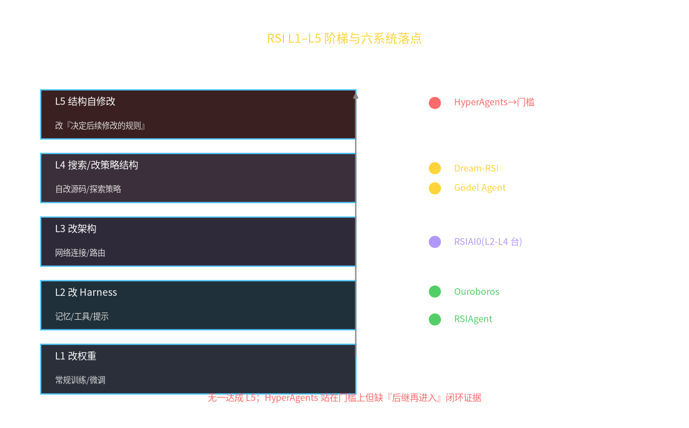

*Figure 1 L1 modify weights → L5 structural self-modification five-level ladder, overlaid with six-system placements (concept location, not performance ranking). Conceptual schematic, not measured data.*

---

## 2 Placing Six Systems One by One

Judgment only looks at "which layer modified," not performance gains.

### 2.1 RSIAgent → L2

RSIAgent (arXiv:2609.15364) coordinates curriculum/actor/verifier, using BRS+DRS to build the **memory store**. It does not modify model weights, it modifies "the Harness layer of memory." The paper reports open-source models surpassing closed-source on specified benchmarks (paper/media report, not independently rechecked)—but that is Harness-RSI's result, landing **L2**. Key reminder: its memory is **environment-specific** (see P18), not meeting the implicit high-RSI requirement "cross-environment persistent transfer."

### 2.2 Ouroboros → L2 (review-driven)

Ouroboros (arXiv:2608.08311) improves tools, prompts, context assembly, core implementation through **reviewed commits**. It modifies Harness, each step reviewed. Lands **L2**. Its dross expanded in P19: review bandwidth caps recursion depth, not autonomous L5.

### 2.3 Dream-RSI → L3/L4 toward L4

Dream-RSI (arXiv:2609.14858, exact title *Recursive Self-Improvement through Evolving Worlds*) organizes completed discovery history into a replayable simulator, "dreaming in the discovery tree" to improve **exploration strategy**, not underlying weights. It modifies "exploration strategy structure"—one layer above memory (L2), near L4 (search/modify strategy structure), but not network connections themselves. The paper reports "about 317 calls ≈ evolutionary search 51200 generations" (official caliber, not independently rechecked), this paper not upgrading its level by performance. Lands **L4 edge**.

### 2.4 Gödel Agent → L4

Gödel Agent (ACL2025 long.1354, arXiv:2410.04444), inspired by Gödel machines, can **dynamically modify its own logic and behavior code** from high-level goal prompts alone. It self-modifies source and behavior logic, a clear L4 (modify executable structure) instance. Multiple secondary sources mark it L4, this paper follows, **not calling L5**—because self-modifying code does not equal "modifying the rules themselves determining subsequent modifications."

### 2.5 HyperAgents → Closest to L5, but Not There

HyperAgents (arXiv:2603.19461, Meta FAIR 2026) merges task Agents and meta Agents into a single editable program, key innovation **the meta-layer modification process itself editable** (metacognitive self-modification). This is the only one of six systems directly touching the L5 criterion "mechanism revision." **But this paper explicitly judges it not yet L5**: HyperAgents demonstrated the **capability** of meta-layer editability, still lacking public controlled evidence of "the system stably, recursively, self-verifyingly modifying the rules determining subsequent modifications" successor re-entry closed loop. It stands at L5's threshold; crossing needs what P14 calls the fifth stage (autonomously modifying the optimizer and stably benefiting).

### 2.6 RSIAI0 → L2–L4 Experimental Bench

RSIAI0 (Zenodo records/**15644670**, note not 15646184) is an open-source experimental framework, containing VM controlled execution, memory systems and Darwinian Mode (managing populations of self-modifiable AI variants). It is not a finished product at some level, but an **experimental bench allowing you to walk from L2 to L4**. Positioned as "tool, not landing point."

**Table 1 Six-system RSI level location (structural judgment)**

| System | arXiv / source | Which layer modified | This paper's grade | Meets L5? |
|---|---|---|---|---|
| RSIAgent | 2609.15364 | memory (Harness) | L2 | no |
| Ouroboros | 2608.08311 | reviewed Harness | L2 | no |
| Dream-RSI | 2609.14858 | exploration strategy structure | L4 edge | no |
| Gödel Agent | ACL2025 long.1354 | self-modified source/logic | L4 | no |
| HyperAgents | 2603.19461 | meta-layer modification process editable | threshold · not there | not achieved |
| RSIAI0 | Zenodo 15644670 | self-modifiable experimental bench | L2–L4 tool | — |

---

## 3 Dross / Failure Boundaries / Falsifiable Conditions

### 3.1 Dross (three traps misreading "gets better with use" as L5)

1. **Performance gain ≠ level gain.** "317 calls ≈ 51200 generations," "open-source surpasses closed-source" are efficiency numbers answering "how much faster," not "which layer modified." This paper deliberately does not upgrade levels by performance.
2. **Meta-layer editable ≠ already L5.** HyperAgents provides meta-layer editing capability, but L5 needs the successor re-entry **closed loop**—rules changed, new rules recursively changed, and stably benefiting. Lacking this, meta-layer editable is only "can do," not "already doing."
3. **Review-driven ≠ autonomous RSI.** Ouroboros-style reviewed commit depth capped by review bandwidth (P19), should not count as L5 autonomous evolution.

### 3.2 Failure boundaries

- If a system claims L5, must pass Theseus seven criteria item by item; any item (especially "successor re-entry" and "mechanism revision") lacking controlled public evidence, this paper insists on downgrading to L4.
- Level judgments rely on systems' **self-reported mechanism descriptions**; if internal actual modification depth not public, this paper handles as "insufficient evidence, no upward adjustment."

### 3.3 Falsifiable conditions

- **F24-a**: if within the next 12 months a public, reproducible L5 system appears passing all seven criteria, stably benefiting in independent evaluation, this paper's "2026 no public L5 achievement" judgment must immediately be revised upward—precisely that judgment's value (overturnable by new evidence).
- **F24-b**: if HyperAgents' later versions publish successor re-entry closed-loop evidence (meta-rule self-modification + verification + re-entry + stable benefit), its grade should rise from "threshold" to "L5 candidate achieved."

---

## 4 Conclusion

RSI's real progress is far more conservative than marketing narratives. Measured by the dual ruler of Theseus seven criteria + UDOS L1–L5 ladder, 2026's six representative systems all land L2–L4: RSIAgent, Ouroboros L2; Dream-RSI, Gödel Agent L4; HyperAgents stands at L5's threshold but not crossed. This is not disparaging these works—they prove self-improvement at the "modify Harness/strategy/code" level is genuinely feasible and effective—but refusing to directly translate "gets better with use" into "structural self-modification has arrived."

**Level looks at which layer modified, not how many times faster. Before public evidence stably passes the seven criteria, L5 remains a declaration at the threshold, not a crossed fact.**

---

## References

**RSI theory**

1. Schmidhuber, J. (2007/2009). Gödel Machines: Fully Self-Referential Optimal Self-Improvers. (Gödel machine theory source)
2. Theseus Labs (2026). *The Last AI Built by Humans: Toward Genuine Recursive Self-Improvement*. arXiv:2609.11873. (HCI + seven criteria)

**2026 frontier materials (existence verified online 2026-09-21; performance numbers paper/official reports, not independently rechecked)**

3. Zhu, S., et al. (2026). RSIAgent: Autonomous Exploration for Recursive Self-improvement in New Environments. arXiv:2609.15364.
4. Ouroboros (2026). *A Self-Developing Frontier Coding Agent with Reviewed Core Evolution*. arXiv:2608.08311.
5. Google DeepMind et al. (2026). Dream-RSI: Recursive Self-Improvement through Evolving Worlds. arXiv:2609.14858.
6. Yin, et al. (2025). Gödel Agent: A Self-Referential Agent Framework for Recursively Self-Improving. ACL 2025, 2025.acl-long.1354.
7. Meta FAIR (2026). HyperAgents / DGM-Hyperagents. arXiv:2603.19461.
8. RSIAI0 (2026). *Bootstrapping AGI via LLM-Guided Recursive Self-Modification*. Zenodo records/15644670.

**UDOS paper volume (this series, evidence grades marked in text)**

9. UDOS v7.5.0 paper volume: P14 "The Convergence of RSI" (seven-route verification + five-stage optimization chain), P15 "Intelligence as a Cross-Substrate Structural Organization Phenomenon" (RSI five-level ladder: L1 weights/L2 Harness/L3 architecture/L4 search priors/L5 structural self-modification).
10. UDOS v7.6.0 paper volume: P18 "BRS+DRS Two-Stage Memory Flywheel," P19 "Structural Change Review Gate," P33 "v7.6.0 Architecture Master Outline."

---

## Evidence Discipline and Reproduction Notes

- This paper is a **concept-location paper**, no new experiments; level judgments based on "which structural layer the system modified," not performance numbers.
- Six systems' existence and mechanism descriptions verified 2026-09-21; performance numbers (317 calls, open-source surpassing closed-source, etc.) all paper/official reports, not independently rechecked, not serving as grading basis.
- RSIAI0's correct record number Zenodo 15644670 (not 15646184).
- "HyperAgents not L5" is a conservative judgment based on "successor re-entry closed-loop evidence missing," if new evidence appears should revise per F24-b.
- This paper claims no existing system has consciousness; RSI levels are functional structural levels, not consciousness levels.


---

<p align="center"></p>

# Test-Time Scaling of Multi-Agent Collaboration: The Diversity Axis and the Decomposition Axis, with TUMIX and MAKER

**Working Title (EN):** *Test-Time Scaling of Multi-Agent Collaboration: The Diversity Axis and the Decomposition Axis, with TUMIX and MAKER*

> Mid-volume engineering paper P29 · splitting "test-time scaling" into two orthogonal axes, **diversity** and **decomposition** · connecting to P9 quality saturation law · UDOS Reasoning Engine v7.6.0 · Fang Wenxin · 2026-09-21
>
> **One sentence first**: why does not training the model, only running it a few more times at inference, make it stronger? Three 2025–2026 works split the answer into two things—TUMIX (arXiv:2510.01279) proves **diversity** (parallel use of different tool strategies) effective; MAKER (arXiv:2511.09030) proves **extreme decomposition + stepwise voting** (cutting million-step tasks to microagents, majority voting at each step to correct) can achieve zero errors. This paper argues these are two **orthogonal** scaling axes, not two ways of saying the same thing; and UDOS P9's "independent information" condition is the hidden premise common to both axes.
>
> **Evidence caliber (stated once for the whole paper)**: this is a method synthesis paper, **containing no new UDOS measured numbers**. Three external papers' existence verified online 2026-09-21; TUMIX's "+3.55%," MAKER's "about 1,048,575 steps zero errors," Thinking vs Doing's "Gemma 3 12B reaches open-source SOTA on WebVoyager/WebArena" all **paper reports**, not independently rechecked; this paper uses them to show "which axis is acting," not taking numbers as UDOS expected gains. UDOS P9 quality saturation law traced to v7.5.0.

---

## Abstract

Test-time scaling is the third axis of 2025–2026 large-model capability gains—not changing weights, not piling parameters, only spending more compute at inference. This paper argues: multi-Agent test-time scaling actually has two **orthogonal** axes. The first is the **diversity axis**: running multiple Agents in parallel, each adopting different tools/strategies, then ensembling. TUMIX (arXiv:2510.01279) works along this axis—parallel multi-Agents using different tool strategies, iteratively sharing refinement, on Gemini-2.5-Pro average accuracy up to +3.55%, at near-equal inference cost (paper report). The second is the **decomposition axis**: extremely decomposing one long task into focused microagents, using majority voting at each step to correct. MAKER (arXiv:2511.09030) works along this axis—extreme decomposition + k=3 majority voting, first completing an about 1,048,575-step (million-scale) LLM task with zero errors (paper report). Thinking vs Doing (arXiv:2506.07976, NeurIPS 2025) suggests a third, different axis—the **interaction length axis**: through curriculum-style online RL adaptively adjusting the number of Agent-environment interaction rounds, using only a 12B Gemma 3 to reach open-source SOTA on WebVoyager/WebArena (paper report). This paper's core argument: the diversity axis is constrained by P9's quality saturation law—multiple parallel Agents if tool strategies isomorphic, carrying no independent information, ensemble gains quickly saturate; the decomposition axis is constrained by "whether voting can correct"—k=3 majority voting only effective when single-step error rates independent and below threshold, under common-cause faults voting fails. The two axes hence not "more Agents better," but a joint design of "diversity × decomposition depth." This paper gives UDOS's engineering specification for the two axes, effects pending `[RESULT NEEDED]`.

**Keywords**: test-time scaling; multi-Agent ensemble; tool mixture; extreme decomposition; majority voting; independent information; P9; TUMIX; MAKER

---

## Structured Abstract (background problem → method/argument → evidence → contribution)

- **Background problem**: why does test-time scaling strengthen? Industry often treats "running a few more Agents" as a single lever, but this hides two orthogonal mechanisms.
- **Core argument**: multi-Agent test-time scaling = diversity axis (heterogeneous tool strategy ensemble) × decomposition axis (extreme decomposition + stepwise voting correction), plus interaction length axis; P9's "independent information" is the hidden premise common to the first two axes.
- **Evidence lines**: (1) TUMIX tool mixture +3.55% (arXiv:2510.01279, paper report); (2) MAKER million-step zero-error extreme decomposition (arXiv:2511.09030, paper report); (3) Thinking vs Doing interaction length scaling (arXiv:2506.07976, paper report); (4) P9 quality saturation law mse(k)=a+b/k (cpu-proto).
- **Contribution**: splitting test-time multi-Agent scaling into orthogonal dual axes; pointing out each axis's failure conditions; connecting the two axes to P9's independent information requirement.

---

## 1 Problem: Test-Time Scaling Is Not a Single Lever

### 1.1 The Third Scaling Axis

Beyond training-time scaling (piling parameters, data, compute), 2025–2026 saw a third axis: **test-time scaling**—freezing weights, only spending more compute at inference. This axis especially key for multi-Agent systems, because it directly asks "why is running multiple Agents in parallel useful."

### 1.2 Two "Multi-Agents" Often Conflated

Intuitively "running a few more Agents to vote" and "cutting the task into many small steps" seem like two ways of saying the same thing. This paper argues they are not:

- **Diversity axis**: same task, parallel multiple solutions, then ensemble. Variable "whether parallel Agents' strategies are heterogeneous."
- **Decomposition axis**: single task, serial step cutting, stepwise correction. Variable "how finely the task is cut, how each step corrects."

One spreads horizontally, one cuts vertically. They are orthogonal, can stack, and each has failure conditions.

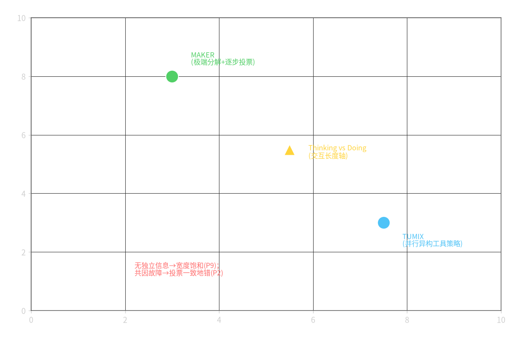

*Figure 1 Horizontal diversity (parallel heterogeneous Agents), vertical decomposition depth (task cut granularity + stepwise voting); three representative works each occupy positions. Conceptual schematic, not measured data.*

---

## 2 The Diversity Axis: TUMIX and the Independent Information Condition

### 2.1 What TUMIX Did

TUMIX (arXiv:2510.01279, *TUMIX: Multi-Agent Test-Time Scaling with Tool-Use Mixture*) runs multiple Agents in parallel, each adopting **different tool strategies**, then iteratively sharing refinement. The paper reports on Gemini-2.5-Pro/Flash average accuracy over the best baseline up to **+3.55%**, at near-equal inference cost (paper report, not independently rechecked).

Its key is not "running more," but "**each using different tools**." If parallel Agents use exactly the same tools and prompts, they give highly correlated answers—precisely the homogeneous copies P9 warns about.

### 2.2 P9 Condition: Diversity Must Carry Independent Information

P9's quality saturation law (mse(k)=a+b/k, cpu-proto) writes the diversity axis's cost fixed. For an ensemble of $k$ members' mean squared error:

$$mse(k)=a+\frac{b}{k} \tag{1}$$

where $a$ is irreducible error, $b$ set by inter-member **independence**. TUMIX's +3.55% holds precisely because "different tool strategies" raised $b$ (member independence); if tool strategies made homogeneous, $b$ collapses, adding more parallel Agents only votes the same wrong answer $k$ times.

Plain language: **the diversity axis's gain ceiling depends on how different your parallel Agents actually are, not how many there are.**

---

## 3 The Decomposition Axis: MAKER and Stepwise Voting Correction

### 3.1 What MAKER Did

MAKER (arXiv:2511.09030, *Solving a Million-Step LLM Task with Zero Errors*) **extremely decomposes** (MAD, Massive Decomposition) one super-long task into focused microagents, each step using multi-Agent **majority voting** to correct, and discarding red-flagged correlated errors. The paper reports this is the first system completing an over-million-LLM-step task with **zero errors** (about 1,048,575 steps, k=3 majority voting; paper report, not independently rechecked).

Its key is not "cutting fine," but "**each step having independent correction**"—a single-point LLM's persistent error rate accumulates and explodes with steps; stepwise majority voting presses long-range error rates back to controllable.

### 3.2 When Voting Works, When It Fails

Majority voting's effectiveness has a classic premise: each step's errors **approximately independent**. If single-step error rate $p$, k=3 majority voting drops error rate to about $3p^2(1-p)+p^3$, significantly declining when $p<0.5$. But—

- **Under common-cause faults voting fails**: if all microagents are carried away by the same misleading input (the semantic common-cause fault P2 identifies), k=3 consistently errs, majority voting becoming "consistently erring more confidently." This is the decomposition axis's hard boundary.
- **Decomposition introduces cut errors**: cut too coarse, microagents still face long-range dependencies; cut too fine, inter-microagent handoff errors accumulate. Optimal decomposition granularity is a design parameter.

Plain language: **the decomposition axis turns "single-point error rate" into "stepwise error rate," but it cannot save the case where all Agents are deceived together.**

---

## 4 The Third Axis: Interaction Length (Thinking vs Doing)

Thinking vs. Doing (arXiv:2506.07976, NeurIPS 2025 SEA Workshop) works along the third axis—**test-time interaction length**: using curriculum-style online RL to adaptively adjust Agent-environment interaction rounds (exploration, backtracking, dynamic replanning), the paper reports only a 12B Gemma 3 reaching open-source/public-data SOTA on WebVoyager/WebArena (about +9%/+8% over non-fine-tuned Agents, paper report).

This axis is neither "parallel a few" (diversity) nor "cut a few steps" (decomposition), but "**how long the same Agent interacts back and forth with the environment**." It reminds us: test-time scaling has at least three adjustable dimensions—width (parallel), depth (decomposition), duration (interaction).

**Table 1 Three-axis comparison of test-time multi-Agent scaling**

| Axis | Variable | Representative work | Failure condition | Constrained by |
|---|---|---|---|---|
| diversity (width) | parallel Agent strategy heterogeneity | TUMIX (+3.55%) | tool strategies homogeneous → independence $b$ collapses | P9 quality saturation law |
| decomposition (depth) | task cut granularity + stepwise voting | MAKER (million-step zero errors) | common-cause fault → voting consistently errs | P2 semantic common-cause fault |
| interaction (duration) | environment interaction rounds | Thinking vs Doing (Gemma3 12B) | interaction length non-adaptive → waste or underexploration | curriculum scheduling design |

---

## 5 Dross / Failure Boundaries / Falsifiable Conditions

### 5.1 Dross (three misreadings deifying test-time scaling)

1. **+3.55% is not a universal gain.** TUMIX's gain depends on task type and baseline choice, switching tasks may be smaller or even disappear; do not take single-benchmark increments as "multi-Agent universal."
2. **Million-step zero errors ≠ long-task universal.** MAKER's zero errors built on highly structured tasks "each step independently judgeable right/wrong by microagents"; semantic acceptance work orders (with hidden ground truth) lack such stepwise oracles, stepwise voting unable to land.
3. **Cheap small-model SOTA ≠ small models strong enough.** Thinking vs Doing used 12B to reach open-source SOTA, relying on test-time interaction scheduling, not the model itself becoming smaller; reading this as "no need for large models" is a misreading.

### 5.2 Failure boundaries

- The diversity axis and P9 homogeneous copies are the same coin: **no independent information, width scaling ineffective.**
- The decomposition axis on tasks **without stepwise oracles** cannot correct—UDOS's semantic acceptance work orders precisely lack stepwise oracles, this is the biggest obstacle to the decomposition axis landing on UDOS.

### 5.3 Falsifiable conditions

- **F29-a**: if on UDOS work orders, changing parallel Agents' tool strategies from "heterogeneous" to "homogeneous," ensemble quality decline matches P9's $b$ collapse prediction, then this paper's "diversity = independent information" argument holds; if unrelated, needs correction.
- **F29-b**: if after introducing common-cause fault injection, the decomposition axis's majority voting correction advantage disappears, then the "voting pierced by common-cause faults" boundary holds.
- The above are post-hoc scorable criteria under the design proposal, UDOS actual numbers pending `[RESULT NEEDED]`.

---

## 6 Conclusion

Test-time scaling is not the single knob "run a few more Agents." It has at least three axes: width (diversity), depth (decomposition), duration (interaction). TUMIX proves the width axis buys gains by "tool heterogeneity," MAKER proves the depth axis presses errors by "extreme decomposition + stepwise voting," Thinking vs Doing proves the duration axis raises performance by "adaptive interaction rounds." UDOS's contribution is giving each of these three axes failure conditions: width constrained by P9 independent information, depth constrained by P2 common-cause faults.

**Test-time scaling is not "piling more Agents," but in the three directions diversity × decomposition × interaction, each confirming "these Agents truly carry independent information, truly can be corrected step by step." Piling people does not solve problems, piling with discrimination does.**

---

## References

**Ensemble and test-time compute**

1. Hansen, J. N., et al. (2024). *Let's Verify Step by Step*. OpenAI. (classic stepwise reasoning/process reward work)
2. Brown, T. B., et al. (2020). Language Models are Few-Shot Learners (test-time prompting background).

**2026 frontier materials (existence verified online 2026-09-21; numbers paper reports, not independently rechecked)**

3. TUMIX (2025). *TUMIX: Multi-Agent Test-Time Scaling with Tool-Use Mixture*. arXiv:2510.01279. (heterogeneous tool strategies parallel, Gemini-2.5-Pro up to +3.55%)
4. MAKER (2025). *Solving a Million-Step LLM Task with Zero Errors*. arXiv:2511.09030. (extreme decomposition + k=3 majority voting, about 1,048,575 steps zero errors)
5. Thinking vs. Doing (2025). *Agents that Reason by Scaling Test-Time Interaction*. arXiv:2506.07976, NeurIPS 2025 SEA Workshop. (Gemma 3 12B reaches open-source SOTA on WebVoyager/WebArena)

**UDOS paper volume (this series, evidence grades marked in text)**

6. UDOS v7.5.0 paper volume: P2 "BFT-lite Stop Decision" (semantic common-cause fault identification), P9 "Quality Saturation Law and Homogeneous Headcount Expansion Failure Boundary" (mse(k)=a+b/k, cpu-proto).
7. UDOS v7.6.0 paper volume: P20 "Heterogeneity Dividend and Homogeneous Saturation," P33 "v7.6.0 Architecture Master Outline."

---

## Evidence Discipline and Reproduction Notes

- This paper is a **method synthesis paper**, no new experiments; three-axis division, failure conditions, F29-a/b criteria are analysis frameworks, actual gains on UDOS are `[RESULT NEEDED]`, forbidden to write as measured.
- TUMIX +3.55%, MAKER million-step zero errors, Thinking vs Doing's Gemma3 12B SOTA all paper reports, not independently rechecked, only used to show "which axis is acting."
- mse(k)=a+b/k traced to P9 (cpu-proto); common-cause fault boundary traced to P2.
- This paper does not claim test-time scaling can replace training scaling; three axes are parallel levers, not replacement relationships.


---

<p align="center"></p>

# Hybrid Orchestration and Framework–Task Matching: Calibrating the Topology-Selection Decision Tree

**Working Title (EN):** *Hybrid Orchestration and Framework–Task Matching: Calibrating the Topology-Selection Decision Tree*

> Shard D · market and architecture paper P30 · selection-layer extension of v7.5.0 P1 "Million-Scale Extrapolation of Layered Hybrid Topology Coordination Complexity" · cross-referenced with P17 (least privilege), P23 (project-level evaluation) · UDOS Reasoning Engine v7.6.0 · Fang Wenxin · 2026-09-21
>
> **One sentence first**: P1 proved "layered hybrid topology presses fan-in from O(N) to O(log N)," but it did not answer "**when to use star, when layered, when hybrid**"—this paper uses an external benchmark (MultiAgentBench systematically comparing multiple topologies) and hybrid orchestration practice (LangGraph×CrewAI), calibrating P1's "select topology" from a default heuristic into a **decision tree** with input conditions: first task coupling, then scale, finally fault risk.
>
> **Evidence caliber (stated once for the whole paper)**: this paper is **design calibration**, containing no new UDOS measured numbers. External dialogue objects all verified online 2026-09-21: MultiAgentBench (ACL 2025, 2025.acl-long.421, ✅), AutoGen (arXiv:2308.08155, ✅ classic), Hybrid LangGraph×CrewAI (⚠️: hybrid orchestration direction genuinely exists, but the "CREW-WILDFIRE benchmark, 96.1% success, token −76.2%, latency 14.5×" corresponding to IEEE Access document number 11481053 **specific numbers not located to original text in this search**, this paper uniformly retells as "hybrid over single is industry practice report · numbers to verify," not fixing percentages), HieraMAS (intra-node LLM mixing + inter-node topology joint optimization, direction real, specific numbers not verified). UDOS old numbers only traced to v7.5.0 P1 (star center fan-in million tier 20,971,520, layered tree b+1=9, 2·log_b N=14 rounds, cpu-proto).

---

## Abstract

P1 solves "**which topology is better in coordination complexity**"—it uses a deterministic simulator with zero network, zero large-model calls to prove: star presses fan-in and rounds both on the center node growing linearly with N, while a b-ary layered tree truncates single-node fan-in to constant b+1, presses critical path to 2·log_b N. But P1 leaves a gap it itself admits: **it measures "this topology's effect executing a project," does not answer "which topology this task should use."** MultiAgentBench (ACL 2025) systematically compares star, chain, tree, graph and other coordination topologies' collaboration and competition performance, its directional conclusion **topology strongly correlates with task**—no topology wins on all tasks. This precisely fills the link P1 lacks.

This paper calibrates P1's "select topology" from default heuristic to a **decision tree**: first judge task coupling (strong coupling→star/centralized, weak coupling parallelizable→layered/mesh), then judge scale (small N→star sufficient, large N→layered tree presses fan-in), finally judge fault risk (high→hybrid topology + circuit breaker reassignment). This paper also introduces the new dimension "framework–task matching": **topology is logical structure, framework is implementation carrier**—the same logical topology's implementation cost differs on LangGraph (flexible orchestration) and CrewAI (hierarchical roles), hybrid frameworks (e.g. LangGraph×CrewAI-style) precisely "using one implementation cost to trade for another capability." This paper honestly marks: hybrid orchestration over single framework's specific numbers not verified to original text, a to-verify claim; this decision tree is a design proposal · pending implementation.

**Keywords**: multi-Agent orchestration; topology selection; decision tree; framework–task matching; hybrid orchestration; layered tree; fan-in; design calibration

---

## Structured Abstract (background problem → method/argument → evidence → contribution)

- **Background problem**: P1 proved layered trees better in coordination complexity, but did not answer "what task should choose what topology"; external benchmark (MultiAgentBench) shows topology strongly correlates with task, while industry practice (hybrid frameworks) shows "same topology, different implementation frameworks" costs differ.
- **Method/argument**: splitting "select topology" into a decision tree (coupling→scale→fault risk), and adding the "framework–task matching" dimension—logical topology and implementation framework decided separately.
- **Evidence lines**: (1) P1's cpu-proto fan-in/rounds closed-form results; (2) MultiAgentBench systematically comparing multiple topologies (✅, topology strongly correlates with task); (3) AutoGen classic conversational framework (✅, its "conversations without termination prone to death loops" is selection cautionary material); (4) hybrid orchestration practice (⚠️, direction real, numbers to verify).
- **Contribution**: (1) calibrating P1's "default layered" to "decide by task conditions"; (2) separating logical topology and implementation framework; (3) giving the decision tree and falsifiable criteria; (4) honestly marking hybrid orchestration numbers to verify, decision tree to be measured.

---

## 1 Introduction: P1 Proved "Which Topology Better," Not "Which Task Uses Which Topology"

First review P1's results. It proved on 6 scale tiers from 10 to 1,000,000: star Orchestrator's center fan-in grows linearly with N (million tier center takes about 20,971,520 messages, serial about 8,388,608 rounds), while a b-ary layered tree makes each node's max fan-in constant b+1=9, parallel rounds only 2·log_b N (million tier about 14 rounds). This is a clean protocol-layer conclusion: **layered trees press fan-in from linear to constant, critical path from linear to logarithmic.**

But P1 at the end itself points out the gap: it measures "this topology's effect executing a project," **does not answer "when to use star, when layered."** In other words, P1 gives "layered trees better in coordination complexity," but not "for this task, is a layered tree over-engineered."

This gap is real. Counterexamples intuitive:

- If a task has only 3 Agents, strongly coupled, needing one person to decide, then a layered tree is **using a sledgehammer to crack a nut**—star direct reporting, fan-in only 3, no fan-in explosion problem at all.
- If a task has 1 million Agents, mutually weakly coupled, parallelizable, then still using star is **suicide**—center fan-in explodes.

So "select topology" cannot be "uniformly layered," but must be "**select by task conditions.**" Precisely what this paper calibrates.

---

## 2 External Evidence: Topology Strongly Correlates with Task

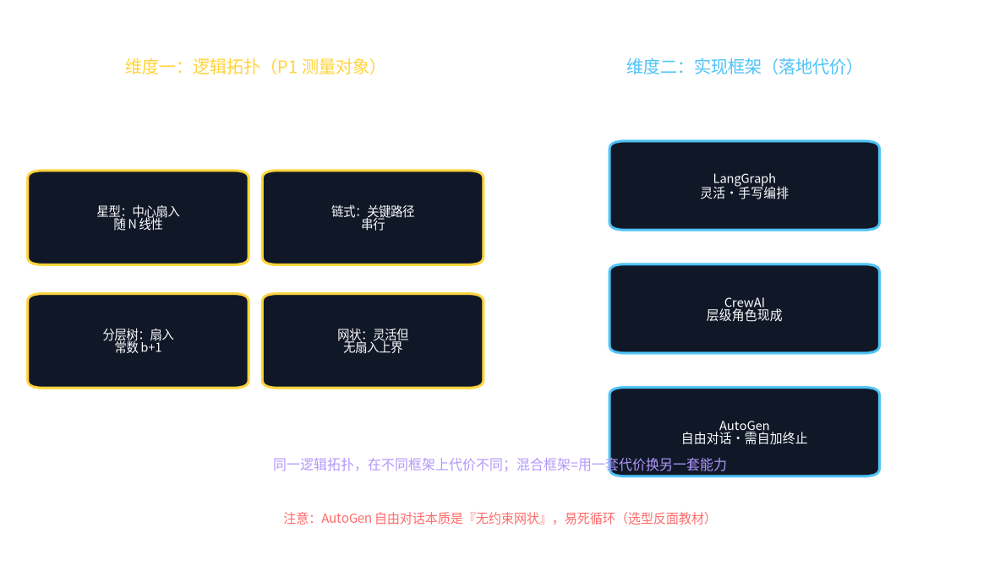

*Figure 1 Left: logical topology (star/chain/tree/graph) sets fan-in and rounds; right: implementation framework (LangGraph flexible/CrewAI hierarchical/AutoGen conversational) sets landing cost. The two decided separately. Conceptual schematic, not measured data.*

### 2.1 MultiAgentBench: No Universal Topology

MultiAgentBench (*MultiAgentBench: Evaluating the Collaboration and Competition of LLM agents*, ACL 2025, 2025.acl-long.421, ✅) systematically compares star, chain, tree, graph and other coordination topologies' performance on collaboration and competition tasks. Its directional conclusion: **topology strongly correlates with task**—different topologies each win and lose on different tasks, no topology wins on all tasks ("graph structure best" is the user clue's claim, exact ranking not verbatim hit at abstract level, this paper only says "multi-topology comparison, topology strongly correlates with task").

This conclusion important for UDOS: it negates the lazy practice "select topology = select one strongest topology," supports the decision tree practice "select topology = match by task."

### 2.2 AutoGen: Cautionary Material—Conversations Without Termination

AutoGen (arXiv:2308.08155, ✅) is one of the most widely used conversational multi-Agent frameworks. Its contribution mixing LLM/human/tools into conversational Agents. But its limitation also typical: **conversations without termination conditions prone to death loops, cost inflating with rounds.**

This limitation's selection lesson: **a framework's "default interaction mode" itself is a topology assumption.** AutoGen's free conversation essentially "unconstrained mesh"—flexible, but no fan-in upper bound. P1's layered tree controllable precisely because it **explicitly specifies who talks to whom.** In selection one cannot only look at framework usability, but also at its default topology assumption.

### 2.3 Hybrid Orchestration: Same Logical Topology, Different Implementation Cost

Industry practice saw hybrid orchestration (e.g. LangGraph×CrewAI-style combination). ⚠️ Must be honest: this paper found the direction "hybrid orchestration over single framework" genuinely exists, but the user clue's specific numbers (IEEE Access document number 11481053's "CREW-WILDFIRE benchmark, 96.1% success, token −76.2%, latency 14.5×") **not located to original text in this search.** Hence this paper only adopts the directional claim "**hybrid frameworks can balance flexibility and hierarchy**," all specific percentages marked "to verify."

Works like HieraMAS further point out: one can **simultaneously** optimize intra-node LLM mixing (what model a node uses) and inter-node communication topology (how nodes connect). This reminds us: selection not only "select topology," but also "select intra-node configuration."

---

## 3 Decision Tree: Coupling → Scale → Fault Risk

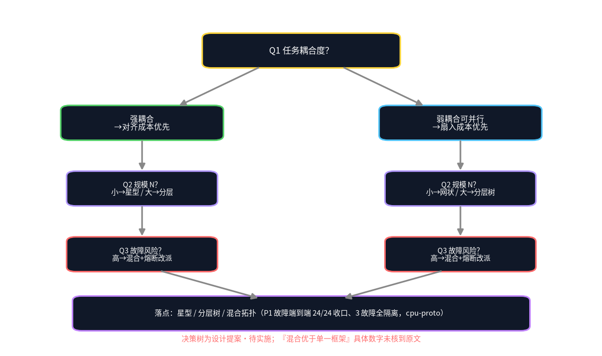

*Figure 2 Three-question decision tree—first judge coupling (strong/weak), then scale (small/large), finally fault risk (high/low), landing on star/layered/mesh/hybrid. Conceptual schematic, not measured data.*

This paper calibrates P1's "select topology" to a three-question decision tree (Figure 2):

**Question one: task coupling?**

- **Strong coupling** (needing frequent mutual alignment, single source of truth, one person deciding) → star or centralized. Reason: strongly coupled tasks' bottleneck is "alignment cost," not fan-in; star's center precisely serves as source of truth.
- **Weak coupling, parallelizable** (subtasks independent, results aggregable) → layered tree or mesh. Reason: weakly coupled tasks' bottleneck is fan-in, layered trees press fan-in to constant.

**Question two: scale N?**

- **Small N** (single digits to tens) → star sufficient. Reason: P1 proves fan-in explosion only fatal at large N; at small N star fan-in low, alignment fast, layered over-engineered.
- **Large N** (hundreds/thousands to million) → layered tree. Reason: P1's closed-form results (fan-in constant b+1, rounds 2·log_b N) precisely prepared for this interval.

**Question three: fault risk?**

- **High fault risk** (Byzantine presence, fault injection, needing circuit breaker reassignment) → **hybrid topology**: top Orchestrator (closing) + middle Handoff (relay) + bottom Swarm (local autonomy), with circuit breaker reassignment. Reason: P1's fault end-to-end (24 work orders, including 2 Byzantine QA, 3 fault specialists) precisely on this hybrid topology achieved 24/24 closing, all 3 fault nodes isolated.
- **Low fault risk** (clean environment, no Byzantine) → single topology sufficient.

Table 1 centrally compares the three questions' typical landings.

**Table 1 Topology selection decision table (by task conditions)**

| Coupling | Scale N | Fault risk | Recommended topology | Basis |
|---|---|---|---|---|
| strong | small | low | star | alignment cost first, no fan-in explosion |
| strong | large | low | star/layered hybrid | strong coupling but press fan-in, layered closing |
| weak | small | low | mesh/star both | fan-in already low, simplicity first |
| weak | large | low | layered tree | fan-in O(N)→constant, rounds log_b N (P1 cpu-proto) |
| any | any | high | hybrid topology + circuit breaker reassignment | P1 fault end-to-end 24/24 closing, 3 faults all isolated (cpu-proto) |

*Table 1 note: P1's fan-in/rounds numbers cpu-proto, single-seed pilot; topology-task strong correlation direction from MultiAgentBench (✅); hybrid orchestration over single framework's specific numbers not verified, this table not citing.*

---

## 4 Framework–Task Matching: Topology Is Logic, Framework Is Implementation

### 4.1 Why Separate These Two Things

A common error conflating "logical topology" and "implementation framework." In fact:

- **Topology** is logical structure—who talks to whom, fan-in size, critical path length. This is P1's measurement object.
- **Framework** is implementation carrier—whether you use LangGraph, CrewAI, or AutoGen to build this topology.

The same logical topology, implementation costs completely different on different frameworks: LangGraph flexible but requires hand-writing orchestration, CrewAI hierarchical roles convenient but low flexibility, AutoGen conversation free but no termination upper bound. **Hybrid frameworks' meaning is here**: using LangGraph for parts needing flexible orchestration, CrewAI for parts needing hierarchical roles, balancing.

### 4.2 Two-Dimension Check in Selection

Hence selection not one dimension (select topology), but two:

1. **Logical topology dimension**: using Section 3's decision tree to set star/layered/mesh/hybrid.
2. **Implementation framework dimension**: according to topology's "flexible vs hierarchical" needs, selecting or mixing frameworks. Needing highly flexible orchestration→toward LangGraph; needing ready hierarchical roles→toward CrewAI; needing free conversation exploration→AutoGen (but must add termination conditions yourself, else death loops).

This section's real contribution turning "framework selection" from "which framework is hot" into "which framework's default interaction mode matches my selected topology."

---

## 5 Dross / Failure Boundaries / Falsifiable Conditions

**Its dross and limitations:**

1. **Decision tree is prior, not measured optimum.** The three-question decision tree currently a **design proposal** induced from P1's closed-form results + MultiAgentBench's directional conclusions, not "the optimum tree learned after running all tasks." Its thresholds (how large N counts "large," how strong coupling counts "strong") currently unquantified, qualitative judgments.
2. **Hybrid orchestration numbers not trustworthy as fact.** "Hybrid over single" currently only industry practice direction, the specific 96.1%/−76.2%/14.5× not verified to original text. Do not take it as proven "hybrid always better."
3. **Topology–task matching is not static.** A task during execution may shift from weak to strong coupling (e.g. midway discovering subtasks mutually dependent). The decision tree is "selected before starting," not solving "dynamic topology adjustment during execution."
4. **P1's closed-form results are protocol-layer caliber.** It proves message fan-in and rounds, not wall-clock throughput, not real LLM task success. Directly taking "fan-in O(N)→O(log N)" as "task faster by O(log N)" is wrong—real LLM tasks' bottleneck may be model inference, not coordination messages.

**Falsifiable conditions:**

- **F1**: if in controlled comparison, the topology selected by the decision tree, relative to "uniformly layered" or "uniformly star," has no significant advantage in end-to-end task success, then the decision tree's "match by task" is redundant complexity, should fall back to default topology.
- **F2**: if MultiAgentBench-style multi-topology comparisons repeatedly show "some topology stably optimal on most tasks," then the premise "no universal topology" weakened, the decision tree can simplify.
- **F3**: if hybrid frameworks (LangGraph×CrewAI-style) in measurement due to "two frameworks' integration overhead" instead underperform single frameworks, then "hybrid balancing" overpraised, should shrink to "single framework + manually added termination conditions."

---

## 6 Conclusion and Honest Boundaries

P1 proved "layered trees better in coordination complexity," P30 calibrates it to the "**select topology by task conditions**" decision tree: first judge coupling, then scale, finally fault risk. It also introduces the "framework–task matching" dimension—logical topology and implementation framework decided separately, hybrid frameworks "using one implementation cost to trade for another capability."

This paper honestly marks: decision tree a design proposal · pending implementation; hybrid orchestration over single framework's specific numbers not verified to original text; P1's fan-in/rounds protocol-layer cpu-proto caliber, not equal to real task throughput. UDOS does not claim "select topology = select strongest topology," but claims "**first see task coupling and scale clearly, then decide whether to pay layered's cost for fan-in.**" This is P30's increment to v7.6.0.

---

## References

**External dialogue objects (existence verified online 2026-09-21; numbers per ledger actual values)**

1. Zhu et al. (2025). MultiAgentBench: Evaluating the Collaboration and Competition of LLM agents. ACL 2025, 2025.acl-long.421 (✅: systematically comparing star/chain/tree/graph topologies and group discussion/cognitive planning; "graph structure best" exact ranking not verbatim hit, this paper only says "multi-topology comparison, topology strongly correlates with task").
2. Wu, Q., Bansal, G., Zhang, J., et al. (2023). AutoGen: Enabling Next-Gen LLM Applications via Multi-Agent Conversation. arXiv:2308.08155 (✅: classic conversational framework; its "conversations without termination prone to death loops, cost inflating with rounds" selection cautionary material).
3. Hybrid LangGraph × CrewAI (⚠️: hybrid orchestration direction genuinely exists; IEEE Access document number 11481053's "CREW-WILDFIRE/96.1%/−76.2%/14.5×" not located to original text, this paper only takes "hybrid balancing" direction, specific numbers to verify).
4. HieraMAS (intra-node LLM mixing + inter-node topology joint optimization, direction real, specific numbers not verified).

**UDOS paper volume**

5. UDOS v7.5.0: P1 "Million-Scale Extrapolation of Layered Hybrid Topology Coordination Complexity" (star center fan-in million tier about 20,971,520, layered tree b+1=9, 2·log_b N about 14 rounds, fault end-to-end 24/24 closing, all cpu-proto single seed).
6. UDOS v7.6.0: P17 "Least Privilege Orchestration" (after topology selected, winners only execute within scope), P23 "Project-Level Five-Dimensional Evaluation" (topology selection quality measured by project-level metrics), P34 "Literature Evidence Ledger."

---

## Evidence Discipline and Reproduction Notes

- This paper is **design calibration**, no new UDOS measurements; decision tree a design proposal · pending implementation, thresholds (N, coupling) currently qualitative, quantification slot `[RESULT NEEDED]`.
- Hybrid LangGraph×CrewAI's "96.1%/−76.2%/14.5×" not verified to original text, this paper fixes no percentages, only takes "hybrid balancing" direction.
- P1's fan-in/rounds cpu-proto, single-seed pilot, protocol-layer caliber, not equal to real LLM task wall-clock throughput; MultiAgentBench "graph best" exact ranking not verbatim hit, expressed as "topology strongly correlates with task."
- The decision tree does not solve "dynamic topology adjustment during execution"; its F1–F3 criteria constitute falsifiable exit rules.


---

<p align="center"></p>

# P35 Production-Grade Multi-Agent Engineering Architecture: A Five-Layer Stack, a Six-Form Morphology Spectrum, a Harnessed Production SOP, and a Ten-Class Component Field Specification

> Supplemental volume P35 · consolidating the multi-agent ecosystem, which by 2025–2026 had differentiated into a five-layer industrial stack, into one constructible engineering blueprint · UDOS Reasoning Engine v7.7.1 · Fang Wenxin · 2026-09-21
>
> **First said clearly in one sentence**: today's "multi-agent" is long no longer one model, but a vertically integrated industry chain from **model substrate → protocols → development/enterprise platforms → products → C-end forms**; this paper uses the **five-layer stack** to position what each layer sells, uses the **six-form×nine-dimension matrix** to distinguish six Agent forms, uses the **production SOP of 8 stages × 5 human-review gates + 1 red-team gate + 1 version gate** to write "how to build a launchable Agent" as a pipeline, then uses the **ten-class component field specification tables** to turn each layer's abstraction into configurable fields. **The full text repeatedly declares: all new architectures and fields are design proposals · to be implemented; external numbers uniformly marked per ledger three states (existence verified / paper·company self-report not independently reviewed / no evidence found), not endorsing vendors, not fabricating benchmarks.**
>
> **Evidence caliber (declared only once in full text)**: this paper is an industry architecture **specification and positioning** document, **containing no new UDOS measured numbers**. The existence of external industry facts and paper claims was item-by-item verified on 2026-09-21 per `EVIDENCE_LEDGER_v771.md`; among them MCP 2026-07-28 stateless core revision, A2A v1.0 Signed Agent Card, AAIF establishment and A2A merge timeline, Volcano Engine product matrix, Microsoft/OpenAI dual SDK Handoff standardization, marked ✅ [existence verified]; Warp-Cortex concurrency/VRAM/capacity, Anthropic R&D automation share, IDC market share, GPT-5.3-Codex self-reference statements, marked 🟡 [paper/company disclosure · not independently reviewed] or [via media retelling · original not pulled]; any unverified capability numbers uniformly marked `[CITATION NEEDED]`. All layering, matrices, SOP gates, field specifications proposed by this paper are **design proposals · to be implemented**, not written as landed measurements. Verification date 2026-09-21.

---

## Abstract

The 2026 multi-agent industry has already left the single-dimensional stage of "taking one large model to chat," differentiated into a **five-layer vertically integrated stack**: L1 model substrate, L2 protocol layer (MCP / A2A / SAEP), L3 development and enterprise platforms, L4 product layer, L5 C-end forms. This paper's task is not to repeat once more "Agents are cool," but to **engineer-wise take apart** this stack: ① using one "five-layer responsibilities × key products × inter-layer interfaces" table to pin the industry chain on the chart; ② using the nested relationship "sub-agent ⊂ Agent ⊂ super Agent legion" and the L0–L5 autonomy ladder (modeled on SAE J3016 / Epoch AI AL0–AL5) to place coordinates for each form; ③ using one "six forms × nine dimensions" matrix to list at once the genealogy from Chatbot to super Agent legion, and point out three key leaps (SOP→goal, A2A catalysis, memory architecture catalysis); ④ writing the process of building a launchable Agent as an 8-stage × 4-role swimlane SOP, with 5 human-review gates + 1 red-team gate + 1 version gate, emphasizing stage 5 acceptance "mechanically decidable," not relying on subjective scoring; ⑤ consolidating the whole abstraction into ten-class component field specification tables (Agent / MCP tools / A2A communication / TransferBundle / circuit breaker / BFT-lite committee / internal market settlement / governance audit / evidence grading / model selection). The full text's all numbers marked per ledger three states, all new architectures marked "design proposal · to be implemented," and at the end gives dross, failure boundaries and falsifiability conditions.

**Keywords**: multi-agent engineering; five-layer stack; MCP/A2A/SAEP; autonomy ladder L0–L5; form genealogy; production SOP; human-review gates; component field specifications; design proposals; evidence three states

---

## Structured Abstract (background problem → method/argument → evidence → contribution)

- **Background problem**: in the market the word "Agent" is overused for everything from chatbots to million-Agent legions, causing selection to conflate "can it be autonomous," "does it need human review," "who manages it"; lacking one construction drawing that layers the industry chain, spectra the forms, stages the production process.
- **Core argument**: multi-agent is an engineering stack **vertically integrating five layers**, different forms only different slices of this stack on the three axes "autonomy × collaboration × governance"; the key to building production-grade Agents is not smarter models, but the three engineering things **protocol standardization + gated production + componentized configuration**.
- **Evidence threads**: protocol side anchored on MCP 2026-07-28 stateless core revision, A2A v1.0 Signed Agent Card, AAIF unified governance (✅ verified); industry side corroborated by Volcano Engine four-layer product matrix, dual SDK standardization of Handoff/Agent-as-Tool (✅ verified); frontier numbers cited downgraded per three states for Warp-Cortex (single-author preprint self-report), Anthropic R&D automation index (company disclosure), IDC share (media retelling).
- **Contribution**: one five-layer stack interface table; one L0–L5 autonomy ladder and concept nesting chart; one six-form×nine-dimension matrix; one 8-stage SOP and gate entry/exit table; ten-class component field specification tables; and a set of falsifiable failure boundaries.

---

## 1 Why This Industry Drawing Is Needed

In 2024 saying "Agent," default meant "one large model chat box that can call tools"; by 2026, the word has been stretched into a continuous spectrum from **C-end small assistants** to **590-Agent national-level policy simulation** (MegaAgent, ACL 2025 Findings, ✅ existence verified). The cost of word overuse is engineering decision distortion: some deploy full zero-trust RBAC on a "read-only Q&A Chatbot," others let a "goal-driven autonomous Agent" run in a bare container with no fault recovery strategy.

This paper's position: **multi-agent is not one product, but an industry chain**. To explain it clearly needs four things—layering (what each layer sells, how to connect), spectra (where six forms differ), flow (how many steps in the pipeline to build one, where to set gates), fragment (consolidating abstraction into configurable fields). The following five sections correspond to five hard deliverables, delivered item by item.

> **Chapter summary**: production-grade multi-agent's first-principle problem is not "how strong the model," but "how this stack layers, how forms spectrum, how production gates, how components configure." The following five sections are the answers to these four questions.

---

## 2 Deliverable One: Five-Layer Vertically Integrated Layered Architecture

First the full picture.

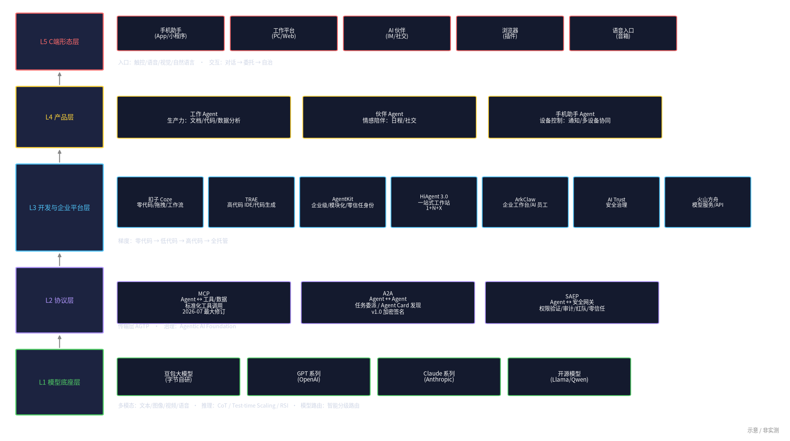

*Figure 1 Five-layer vertically integrated architecture schematic: model substrate→protocols→development enterprise platforms→products→C-end forms. Concept schematic, not measured.*

Five layers bottom-up, each layer providing to the upper layer "a stable interface shielding lower-layer details," inter-layer connected via standardized protocols/interfaces, not welded via private SDKs.

- **L1 model substrate**: provides "intelligence itself." Representatives Doubao large model (ByteDance self-developed), GPT series (OpenAI), Claude series (Anthropic), open-source models (Llama / Qwen). Capability axes cover multimodal (text/image/video/voice), reasoning (CoT / Test-time Scaling / RSI) and **intelligence grading routing**—routing tickets of different difficulty to models of different cost-performance, doing cost-capability tradeoffs.
- **L2 protocol layer**: solves "how Agents, and Agents and tools, speak." Three complementary protocols: **MCP** (Agent ↔ tools/data, standardized tool calls; its 2026-07-28 revision the "largest revision since protocol release," changed to stateless core, can round-robin load balance over standard HTTP, removed protocol-level session, ✅ verified); **A2A** (Agent ↔ Agent, task delegation / Agent Card discovery; v1.0 contains cryptographic **signed Agent Card**, ✅ verified); **SAEP** (Agent ↔ security gateway, permission verification / audit / red team / zero trust). Transport layer uses AGTP; governance belongs to the **Agentic AI Foundation (AAIF, Linux Foundation established 2025-12, A2A merged 2026-08-17, ✅ timeline correction verified)**. Core insight in one sentence: **MCP solves "how to call tools," A2A solves "how to collaborate," SAEP solves "how to be security-governed," the three complementary not mutually exclusive.**
- **L3 development and enterprise platforms**: encapsulate L1/L2 into "the workbench for building Agents." Representatives: Coze (zero code/drag/workflows), TRAE (high-code IDE/code generation), AgentKit (enterprise/modular/zero-trust identity/API asset toolization), HiAgent 3.0 (one-stop workstation/1+N+X/low-high-no-code hybrid), ArkClaw (enterprise workbench/AI employees/enterprise dedicated), AI Trust (security governance/model trustworthiness/Agent controllability/operations security), Volcano Ark (model services/one-stop API/model plaza). Product maturity distributed along the **zero code → low code → high code → fully managed** gradient (the above only describes public product positioning, not endorsing vendors).
- **L4 product layer**: consolidates platform-built Agents into three role types—work Agent (docs/code/data analysis), companion Agent (schedules/social/emotional), phone assistant Agent (notifications/device control/multi-device collaboration).
- **L5 C-end forms**: the entries users actually contact—phone assistants (App/mini program), work platforms (PC/Web), AI companions (IM/social), browsers (plugins), voice entries (smart speakers). Entries spread along four modalities **touch/voice/vision/natural language**, interaction evolves along three tiers **conversation → delegation → autonomy**.

**Table 2-1　Five-layer responsibilities × key products × inter-layer interfaces (design proposal · to be implemented)**

| Layer | Responsibility (what sold) | Key products/standards (public positioning) | Interface provided to upper layer | Downward dependency |
|---|---|---|---|---|
| L1 model substrate | Intelligence itself: multimodal, reasoning, graded routing | Doubao/GPT/Claude/Llama/Qwen | Unified reasoning API (with routing and cost-capability metadata) | Compute and training |
| L2 protocol layer | Tool calls / Agent collaboration / security governance | MCP (stateless core, 2026-07-28), A2A v1.0 (Signed Agent Card), SAEP, AGTP; governance AAIF | Standardized tool schema, Agent Card, audit interface | L1 reasoning capability |
| L3 development and enterprise platforms | Workbench and governance for building Agents | Coze / TRAE / AgentKit / HiAgent 3.0 / ArkClaw / AI Trust / Volcano Ark | Drag/IDE/SDK producing deployable Agents | L1+L2 |
| L4 product layer | Consolidating Agents into role products | Work Agent / companion Agent / phone assistant Agent | Scenario-facing finished Agents | L3 |
| L5 C-end forms | User reach entries | App/mini program, PC/Web, IM/social, browser plugins, smart speakers | Conversation→delegation→autonomy interaction surface | L4 |

> **Chapter summary**: the five-layer stack is a "layered decoupling" cognitive map—lower layer changes upper layer not rewritten (change model without touching protocol), protocols unified then platforms interchangeable. Note this is cognitive scaffolding, not physically strongly bound five layers; many products cross layers.

---

## 3 Deliverable Two: Concept Relationship Chart (Nested Containment and L0–L5 Autonomy Ladder)

First the nesting and ladder.

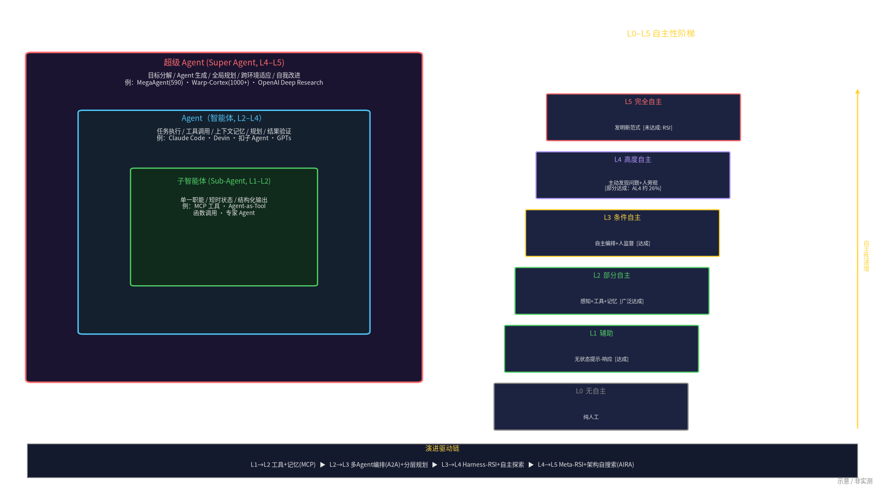

### 3.1 Three-Layer Nested Containment

"Sub-agent ⊂ Agent ⊂ super Agent (legion)" is a **size nesting** relationship, not three parallel species:

- **Sub-agent (L1–L2)**: the narrowest-capability execution unit, called via MCP tools / Agent-as-Tool / function calls / expert Agent forms, finishing work then returning the result.
- **Agent (L2–L4)**: an autonomous unit that can independently undertake a segment of tasks, e.g. Claude Code, Devin, Coze Agent, GPTs.
- **Super Agent (L4–L5)**: an orchestrator that can autonomously plan and schedule a large group of sub-Agents/Agents, e.g. MegaAgent (590 Agents, ✅ verified), Warp-Cortex 1000+ (**single-author preprint self-report, not independently reviewed**), OpenAI Deep Research.

### 3.2 L0–L5 Autonomy Ladder (modeled on SAE J3016; corresponding to Epoch AI AL0–AL5, adopted by Anthropic, ✅ verified)

| Level | Name | Criterion | Status | Representatives |
|---|---|---|---|---|
| L0 | No autonomy | Pure manual | — | Manual process |
| L1 | Assisted | Stateless prompt-response | ✅ achieved | ChatGPT / Doubao |
| L2 | Partial autonomy | Perception + tools + memory | ✅ broadly achieved | Tool-equipped Copilot |
| L3 | Conditional autonomy | Autonomous orchestration + human supervision | ✅ achieved | Software engineering Agent |
| L4 | High autonomy | Proactively finds problems + human observes | ⚠️ partially achieved | Anthropic discloses about 26% R&D "led" by Claude (AL4), >90% at least AL3, about 30,000 internal Agents concurrent (**company disclosure, not independently reviewed**) |
| L5 | Full autonomy | Invents new paradigms | ❌ not achieved | RSI research goal |

**Evolution driver chain**: L1→L2 via **tools+memory (MCP)**; L2→L3 via **multi-Agent orchestration (A2A) + layered planning**; L3→L4 via **Harness-RSI + autonomous exploration**; L4→L5 via **Meta-RSI + architecture self-search (AIRA)**. Today the whole industry's most honest coordinate: L3 achieved, L4 just touched the edge (and numbers all self-assessed), L5 still a research goal.

### 3.3 Two Or Primitives: Agent-as-Tool vs Handoff

On the question "how do multiple Agents collaborate," the industry has converged on two **simultaneously standardized** primitives (Microsoft Agent Framework / AutoGen and OpenAI Agents SDK, ✅ existence verified):

- **Agent-as-Tool**: function call / RPC style. Main Agent retains control, sub-Agent called like a function, after execution **returns result string**, main Agent decides next step.
- **Handoff**: responsibility **formally transferred**—like transferring a phone call/relay race, conversation ownership handed to receiver, **receiver directly faces the user**.

Selection criterion in one sentence: **"I coordinate, you help me compute" uses Agent-as-Tool; "this matter is now yours to manage" uses Handoff.** The former does not release control, the latter transfers control whole-organization, mismatch directly leads to "who on earth is responsible for the result" unclaimed.

> **Chapter summary**: first see clearly the size nesting of "sub/Agent/super," then step firmly on the "L0–L5" autonomy ladder, finally when orchestrating think clearly "whether control stays." Understanding these three things, multi-Agent design won't deviate from the start.

---

## 4 Deliverable Three: Six Forms × Nine Dimensions Matrix

First the matrix full picture.

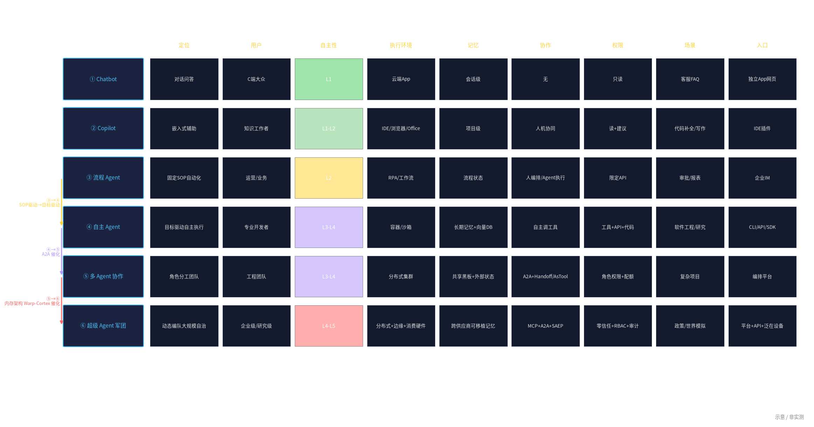

**Table 4-1　Six forms × nine dimensions genealogy matrix (design proposal · to be implemented)**

| Dimension | ①Chatbot | ②Copilot | ③Process Agent | ④Autonomous Agent | ⑤Multi-Agent collaboration | ⑥Super Agent legion |
|---|---|---|---|---|---|---|
| Positioning | Conversational Q&A assistant | Embedded workflow assist | Fixed SOP automation | Goal-driven autonomous execution | Role division team collaboration | Dynamic formation large-scale autonomy |
| Target users | C-end public | Knowledge workers | Operations/business people | Professional developers | Engineering teams | Enterprise/research level |
| Autonomy level | L1 | L1–L2 | L2 | L3–L4 | L3–L4 | L4–L5 |
| Execution environment | Cloud/App | IDE/browser/Office | RPA/workflow engine | Container/sandbox | Distributed clusters | Distributed+edge+consumer hardware |
| Memory | Session level | Project level | Process state | Long-term memory+vector DB | Shared blackboard+external state | Cross-vendor portable memory |
| Collaboration mode | None | Human-machine collaboration | Human orchestrates/Agent executes | Agent autonomously calls tools | A2A protocol+Handoff/AsTool | MCP+A2A+SAEP three-layer protocol stack |
| Permissions | Read-only conversation | Read+suggest | Limited API scope | Tools+API+code execution | Role permissions+resource quotas | Zero trust+RBAC+audit chain |
| Typical scenarios | Customer service/FAQ | Code completion/writing | Approvals/reports | Software engineering/research | Complex project management | Policy simulation/world simulation |
| Entry | Independent App/webpage | IDE plugin/browser extension | Enterprise IM/workflow interface | CLI/API/SDK | Orchestration platform/team kanban | Platform+API+devices ubiquitous |

### 4.1 Three Key Leaps

- **③→④: SOP driven → goal driven**. This is the **core leap**—the process Agent "executes a preset SOP," the autonomous Agent "given a goal, itself decomposes the task." The difference not in model size, but in "who decides next step": SOP is human-written fixed, goal is Agent itself decomposed.
- **④→⑤: catalyzed by the A2A protocol**. A single autonomous Agent can only itself call tools; with A2A this standardized inter-Agent conversation language, multiple Agents can delegate to and discover each other like a team, the multi-Agent collaboration form holds (A2A v1.0 verified).
- **⑤→⑥: catalyzed by memory architecture breakthrough**. To pull collaboration scale from dozens to hundreds-thousands, the bottleneck often not coordination algorithm but memory. Warp-Cortex self-reports pulling single-card concurrency from about 10 to 100+, single-card RTX 4090 only 2.2GB VRAM, theoretical capacity >1000 (**this number single-author preprint self-report, not independently reviewed; and its "98% context compression" not in abstract, this paper does not cite that ratio**). That is, ⑥ is not "pile a few more Agents," but the new form opened only after the memory wall is crossed.

> **Chapter summary**: six forms are a **genealogy**, not six mutually exclusive drawers—a product can grow from ① to ④. When selecting first ask "what autonomy L level, cross-Agent collaboration needed, how large scale," three questions settled, the matrix cells naturally framed.

---

## 5 Deliverable Four: Agent Production SOP Swimlane

First the swimlane full picture.

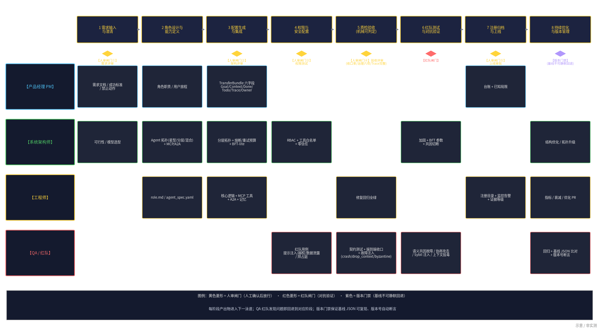

The SOP is **8 stages × 4 roles (PM / systems architect / engineer / QA red team)**, per stage with responsibilities, and gates at key points.

1. **Requirement input and clarification**: PM produces requirement doc/success criteria/prohibited action list; systems architect does feasibility and model selection judgment. ⚠️ **human-review gate ① requirement review**.
2. **Role design and capability definition**: PM defines role responsibilities/user journeys; architect defines Agent topology (star/layered/hybrid) and MCP/A2A selection; engineer produces `role.md` / `agent_spec.yaml` / model routing / tool set.
3. **Configuration generation and integration**: engineer implements core logic + MCP tools + A2A communication + memory system; architect defines layered topology + circuit breaker thresholds/retry budget/BFT-lite committee; PM aligns TransferBundle six fields (Goal/Context/Done/Todo/Trace/Owner). ⚠️ **human-review gate ② architecture review**.
4. **Permissions and security configuration**: architect configures RBAC + tool whitelist + zero-trust identity; red team designs prompt injection/over-privilege access/data leakage/Byzantine simulation cases. ⚠️ **human-review gate ③ permission tests**.
5. **Quality acceptance · mechanically decidable**: red team runs contract tests (Agent-as-Tool five error types / TransferBundle six-field validation / audit invariants) + end-to-end completion tests + fault injection (crash / drop_context / byzantine); engineer fixes, regression all green. ⚠️ **human-review gate ④ acceptance review**. **This stage acceptance "mechanically decidable"—not relying on subjective scoring, relying on script assertions.**
6. **Red-team testing and adversarial verification**: red team attacks semantic common-cause faults/deliberation attacks/Sybil injection/context poisoning; architect does hardening + BFT parameters + common-cause cutting. 🔴 **red-team gate**.
7. **Registration archiving and launch**: engineer registers platform catalog + monitoring alerts + evidence grade marking; PM builds ledger + records known limitations + marks unachieved gates. ⚠️ **human-review gate ⑤ launch approval**.
8. **Continuous optimization and version management**: engineer reports run metrics/performance decay/optimization PRs; QA does regression + baseline JSON comparison + version number assertions; architect does structural optimization/topology upgrade. 🔒 **version gate**.

**Table 5-1　Gate entry/exit conditions overview (design proposal · to be implemented)**

| Gate | Position | Type | Entry / exit conditions |
|---|---|---|---|
| ① Requirement review | stage1→2 | ⚠️ human review | Entry: goal mechanically decidable, prohibited action list complete |
| ② Architecture review | stage3→4 | ⚠️ human review | Exit: fan-in budget/round budget/fault recovery strategy in place |
| ③ Permission tests | stage4→5 | ⚠️ human review | Exit: Agent cannot execute any operation in "prohibited action list" |
| ④ Acceptance review | stage5→6 | ⚠️ human review | Exit: completion rate meets target, governance six all zero, Trace complete |
| 🔴 Red-team gate | stage6→7 | red team | Exit: no high-risk vulnerabilities, common-cause faults cuttable, Byzantine members cannot force-stop, ledger conservation not broken |
| ⑤ Launch approval | stage7 | ⚠️ human review | Exit: evidence grades correct, limitations declared, monitoring in place |
| 🔒 Version gate | stage8 continuous | version gate | Baseline metrics cannot silently regress, regression means gate failure, version number automatically asserted |

> **Chapter summary**: the whole SOP is **5 human-review gates + 1 red-team gate + 1 version gate**. Its design philosophy "clamp human review at mechanically decidable places"—stage 5 acceptance not relying on subjective scoring, this is the premise for it to scale and be reproducible. Gates not the more the better, too dense kills iteration speed (see Section 7 failure boundaries).

---

## 6 Deliverable Five: Ten-Class Component Field Specification Tables

The following are **UDOS design specifications · to be implemented**; example models (GPT-5.3/Codex, Claude, Kimi K3, Qwen3.8-Max, Doubao, DeepSeek-R1, Llama etc.) are **snapshots**, per platform actual model catalog; unverified capability/context numbers marked `[CITATION NEEDED]`, not fabricating benchmarks.

### Table 6-1　Agent Configuration (15 fields)

| Field name | Description | Required | Example | Configuration platform |
|---|---|---|---|---|
| agent_id | Unique identifier | yes | spec-kinematics-0 | all |
| name | Display name | yes | Kinematics expert | all |
| role | Role type | yes | specialist | all |
| domain | Domain | yes | kinematics | all |
| model_provider | Model provider | yes | volcengine | all |
| model_id | Model identifier | yes | doubao-pro-32k | all |
| system_prompt | System prompt | yes | You are a kinematics expert… | all |
| temperature | Generation temperature | no | 0.3 | all |
| max_tokens | Max output tokens | no | 4096 | all |
| tools | Available tool list | no | [mcp://calculator, mcp://solver] | AgentKit / TRAE |
| memory_config | Memory configuration | no | {type:vector, size:1024} | HiAgent / AgentKit |
| autonomy_level | Autonomy level | yes | L3 | HiAgent / AgentKit |
| guardrails | Safety guardrails | no | {intent_guard:true, tool_approval:true} | AI Trust |
| handoff_targets | Handoff targets | no | [qa-committee, orchestrator] | AgentKit / TRAE |
| evidence_grade | Evidence grade | yes | verified | all |

### Table 6-2　MCP Tool Configuration (8 fields)

| Field name | Description | Required | Example | Configuration platform |
|---|---|---|---|---|
| tool_id | Tool unique identifier | yes | mcp://database/query | all |
| name | Tool name | yes | SQL query tool | all |
| description | Function description | yes | Execute SQL query and return results | all |
| input_schema | Input parameter Schema | yes | {sql:string, timeout:int} | all |
| output_schema | Output Schema | yes | {rows:array, columns:array} | all |
| auth_type | Authentication type | yes | oauth2 | AgentKit / AI Trust |
| rate_limit | Rate limit config | no | 100/min | AgentKit |
| sandbox | Sandbox config | no | {network:false, fs:readonly} | AI Trust |

### Table 6-3　A2A Communication (6 fields)

| Field name | Description | Required | Example | Configuration platform |
|---|---|---|---|---|
| agent_card | Agent capability card | yes | {name, skills, endpoints} | all |
| endpoint | Communication endpoint | yes | https://api.example.com/a2a/ | all |
| auth_method | Authentication method | yes | mtls | AgentKit / AI Trust |
| protocol_version | Protocol version | yes | v1.0 | all |
| skills | Capability list | yes | [task_decompose, code_review] | all |
| signature | Cryptographic signature | yes | sha256:abc123… | AgentKit / AI Trust |

### Table 6-4　TransferBundle Handoff (6 fields)

| Field name | Description | Required | Example | Configuration platform |
|---|---|---|---|---|
| goal | Task goal | yes | Solve kinematics equations | all |
| context | Fact dictionary | yes | {domain:kinematics, units:SI} | all |
| done | Completed stages | yes | [triage, specialist] | all |
| todo | To-do stages | yes | [qa_acceptance] | all |
| trace | Event sequence numbers | yes | [1,5,12,18] | all |
| owner | Current responsible party | yes | spec-kinematics-0 | all |

### Table 6-5　Circuit Breaker Configuration (7 fields)

| Field name | Description | Required | Example | Configuration platform |
|---|---|---|---|---|
| breaker_id | Circuit breaker identifier | yes | breaker-kinematics-0 | AgentKit / HiAgent |
| min_requests | Minimum requests | yes | 2 | AgentKit / HiAgent |
| threshold | Error rate threshold | yes | 0.5 | AgentKit / HiAgent |
| cooldown_ticks | Cooldown period | yes | 3 | AgentKit / HiAgent |
| half_open_probes | Half-open probe count | no | 1 | AgentKit / HiAgent |
| group_isolation_ratio | Group isolation ratio | no | 0.5 | AgentKit / HiAgent |
| kill_switch_enabled | Global stop switch | yes | true | AI Trust |

### Table 6-6　BFT-lite Committee (6 fields)

| Field name | Description | Required | Example | Configuration platform |
|---|---|---|---|---|
| committee_id | Committee identifier | yes | qa-committee-v1 | HiAgent |
| n_voters | Member count | yes | 7 | HiAgent |
| f_byzantine | Tolerated Byzantine count | yes | 2 | HiAgent |
| quorum_size | Quorum size | yes | 5 | HiAgent |
| timeout_ticks | Timeout period | yes | 10 | HiAgent |
| equivocation_handling | Equivocation handling | yes | void_round | HiAgent |

### Table 6-7　Internal Market Settlement (5 fields)

| Field name | Description | Required | Example | Configuration platform |
|---|---|---|---|---|
| budget_total | Total budget | yes | 240 | HiAgent |
| reward_per_order | Reward per order | yes | 10 | HiAgent |
| slash_rate | Slash rate | yes | 1.0 | HiAgent |
| duplicate_policy | Duplicate labor policy | yes | deny_payment | HiAgent |
| conservation_check | Conservation check | yes | true | HiAgent |

### Table 6-8　Governance Audit (5 fields)

| Field name | Description | Required | Example | Configuration platform |
|---|---|---|---|---|
| audit_id | Audit identifier | yes | audit-run-001 | AI Trust |
| trace_ledger | Hash-chain Trace | yes | sha256_chain | AI Trust |
| failure_detectors | Failure detectors | yes | [state_loss, dup_work, no_closer] | AI Trust |
| owner_registry | Owner registry | yes | {order: stage→agent} | AI Trust |
| stop_condition | Stop condition | yes | {max_hops:20, done_predicate} | AI Trust |

### Table 6-9　Evidence Grading (5 fields)

| Field name | Description | Required | Example | Configuration platform |
|---|---|---|---|---|
| evidence_grade | Evidence grade | yes | cpu-proto | all |
| seed_count | Seed count | yes | 1 | all |
| reproducible | Reproducible | yes | true | all |
| source_json | Source JSON path | yes | reports7/matrix.json | all |
| ci_gate | CI gate | no | true | HiAgent / AI Trust |

### Table 6-10　Model Selection Decision Table (7 rows)

| Decision dimension | Recommended model | Applicable scenarios | Configuration platform |
|---|---|---|---|
| Complex reasoning / planning | GPT-5.3 / Claude Opus [self-report snapshot] | Task decomposition, strategy design | all |
| Code generation / review | GPT-5.3-Codex / DeepSeek-R1 [self-report snapshot] | Software engineering tasks | TRAE |
| Fast response / simple tasks | Doubao / Claude Haiku | Classification, extraction, formatting | Coze / AgentKit |
| Multimodal understanding | Doubao video generation 2.5 / GPT-4o | Image/video analysis | AgentKit |
| Long context | Claude (1M context) / Kimi K3 `[CITATION NEEDED]` | Long document analysis | HiAgent |
| Cost sensitive | DeepSeek / Qwen | Large-scale deployment | all |
| Privatized deployment | Open-source models (Llama / Qwen) | Data compliance requirements | HiAgent |

> Note: GPT-5.3-Codex additionally has OpenAI 2026-02-05 official statement "our first model that was **instrumental in creating itself**" (company disclosure, not independently reviewed), this paper only registers it as an early RSI signal, not expanding into selection basis.

Finally landing on one selection decision tree.

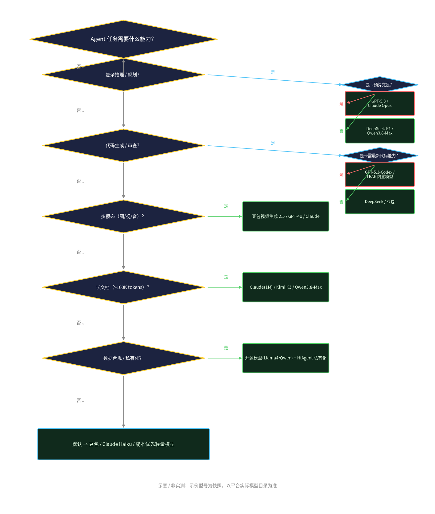

*Figure 5 Model selection decision tree: first branch by task difficulty/modality/context length/cost/compliance, landing on specific model families and configuration platforms. Concept schematic, not measured; model catalog updates with vendors.*

> **Chapter summary**: ten-class field sets consolidate all preceding abstractions (Agent, tools, collaboration, handoff, fault tolerance, consensus, settlement, audit, evidence, selection) into "cells fillable on configuration platforms." Fields uniformly **design proposals · to be implemented**; model columns are snapshots, unverified numbers like long context hang `[CITATION NEEDED]`, absolutely not fabricating benchmarks.

---

## 7 Dross, Failure Boundaries and Falsifiability Conditions

### 7.1 This Paper's Own Dross and Boundaries

- **Five-layer layering is cognitive scaffolding, not strong binding.** Real products often cross layers (one platform both produces Agents and directly reaches C-end); treating five layers as "physical layers that must be strictly isolated," draws charts detached from engineering reality.
- **Six forms are a genealogy, not mutually exclusive categories.** One system can smoothly grow from Chatbot to autonomous Agent; using it for an "either-or" classification table is misuse.
- **SOP gates too dense kill iteration speed.** 5 human-review gates + 1 red team + 1 version gate suits high-risk launch, but may make every change of an internal small tool run the full process; gate density should scale with risk level, not one-size-fits-all.
- **All new architectures/fields are design proposals · to be implemented.** Reading the "specification tables" as "already launched and measured," this paper's biggest misuse risk.
- **Industry numbers all carry discounts.** Warp-Cortex's 100 concurrency/2.2GB/>1000 is single-author preprint self-report, not independently reviewed (its "98% context compression" not in abstract, this paper not adopted); Anthropic's 26%/>90%/about 30,000 Agents is company disclosure, not independently reviewed; IDC's HiAgent 17.8% privatization / Coze 19.3% public cloud is report via media retelling, original not pulled. The above all do not constitute market endorsement.

### 7.2 Falsifiability Conditions

This paper's architecture claims should be overturned or corrected if the following occur:

- **F1 (layering fails)**: if future mainstream products long eat the whole market in "single-layer end-to-end" form, inter-layer protocols no one cross-layer reuses, then the five-layer stack degenerates to post-hoc description, should no longer serve as construction blueprint.
- **F2 (genealogy collapses)**: if some single product form is simultaneously optimal on all nine dimensions, smoothing the Chatbot-to-legion gap, then the six-form genealogy loses distinguishing meaning.
- **F3 (gate back-action)**: if measurements show gates drag delivery cycle to negative return, and cannot significantly reduce online incident rate, then the SOP should change to "sample review by risk level" rather than full gates.
- **F4 (protocols not complementary)**: if MCP/A2A/SAEP three in actual landing are swallowed by some single protocol, then the "three protocols complementary" judgment needs rewriting.
- **F5 (L4 misjudgment)**: if Anthropic's AL4 "led" caliber is substantially revised down by external independent review, then this paper's L4 "⚠️ partially achieved" optimism needs lowering.

---

## 8 Conclusion

Production-grade multi-agent competition has shifted from "whose model is smarter" to "whose stack is layered more clearly, forms seen more accurately, production gates harder, components configured more reproducibly." This paper takes this apart into five blocks: one **five-layer vertically integrated stack** (model substrate/protocols/platforms/products/C-end), one **L0–L5 autonomy ladder and sub⊂Agent⊂super nesting**, one **six forms × nine dimensions genealogy**, one **8-stage + 7-gate production SOP**, and one **ten-class component field specification**. MCP/A2A/SAEP three protocols complementary, Handoff and Agent-as-Tool two orchestration primitives, ⑤→⑥ relying on memory architecture rather than piling headcount—these are this paper's three engineering judgments most wanted to be remembered.

**This is a construction checklist with falsifiability conditions, not a delivered report card; all new architectures to be implemented, all external numbers carry three-state discounts.**

---

## References and Evidence Sources

**UDOS v7.7.1 supplemental volume (this series)**

1. Master layout: P33 "v7.6.0 Architecture Master: Eight Structural Change Specifications and Compatibility Paths" (this volume follows its logo header, structured abstract, tables and dross/falsifiability style).
2. Evidence ledger: `EVIDENCE_LEDGER_v771.md` (verified 2026-09-21, three-state caliber).

**Existence verified (✅)**

3. Anthropic / AAIF / MCP / A2A: MCP official blog "The 2026-07-28 Specification" (stateless core / standard HTTP load balancing); A2A official "A2A Protocol Ships v1.0" (Signed Agent Card); Linux Foundation AAIF announcement (established 2025-12) and "A2A Joins AAIF" (merged 2026-08-17).
4. Volcano Engine product matrix: AgentKit / HiAgent 3.0 / ArkClaw / TRAE / Coze (volcengine.com public product list, only describes public positioning).
5. Orchestration primitives: OpenAI Agents SDK and Microsoft AutoGen official docs distinction of Handoff vs Agent-as-Tool.
6. MegaAgent: *MegaAgent: A Large-Scale Autonomous LLM-based Multi-Agent System Without Predefined SOPs*, Findings of ACL 2025 (590-Agent national policy simulation).
7. Autonomy grading: Epoch AI AL0–AL5 automation grading officially adopted by Anthropic.

**Paper/company disclosure · not independently reviewed (🟡)**

8. Warp-Cortex, arXiv:2601.01298 (single-author preprint; 100 concurrency @ 2.2GB VRAM, theoretical >1000 self-reported; "98% context compression" not in abstract).
9. Anthropic "Measurements for understanding the pace of AI development inside frontier labs" (2026-09): about 26% R&D AL4 led, >90% at least AL3, about 30,000 internal Agents, company self-assessment, not independently reviewed.
10. OpenAI "Introducing GPT-5.3-Codex" (2026-02-05): "instrumental in creating itself," company self-statement.
11. IDC "China Agent Development Platform Market Share, 2025": HiAgent 17.8% privatization / Coze 19.3% public cloud, via media retelling, original not pulled.

---

## Evidence Discipline and Reproduction Notes

- This paper is an **industry architecture specification and positioning document**, no new experiments; all layering, matrices, SOP gates, ten-class fields are **design proposals · to be implemented**, prohibited from writing as landed measured returns.
- External facts marked per `EVIDENCE_LEDGER_v771.md` three states: ✅ existence verified / 🟡 paper or company disclosure · not independently reviewed / via media retelling · original not pulled; unverified capability numbers hang `[CITATION NEEDED]`, not fabricating benchmarks.
- Industry products only describe public positioning, not endorsing any vendor, not fabricating market share; model models are snapshots, per platform actual model catalog.
- This paper's falsifiability conditions F1–F5 for post-hoc scoring; five-layer stack as cognitive scaffolding, six forms as genealogy not mutually exclusive categories, SOP gate density should scale with risk, all three declared in Section 7.


---

<p align="center"></p>

# The 2026 Frontier Influence Ranking of Multi-Agent Systems and Recursive Self-Improvement: An Evidence-Verified Tally of 20 Papers and 10 Industry Milestones

**Working Title (EN):** *The 2026 Frontier Influence Ranking of Multi-Agent Systems and Recursive Self-Improvement: An Evidence-Verified Tally of 20 Papers and 10 Industry Milestones*

> Supplement volume P36 · upgrading `EVIDENCE_LEDGER_v771.md`'s 20 papers and 10 industry milestones into a dedicated **influence ranking** paper · UDOS Reasoning Engine v7.7.1 · Fang Wenxin · 2026-09-21
>
> **Evidence caliber (stated once for the whole paper)**: this paper is an **editorial influence ranking + evidence verification** paper, containing no new experiments, no new UDOS measured numbers, all external facts taking `EVIDENCE_LEDGER_v771.md` as the sole fact source. Verification base date **2026-09-21 (Asia/Shanghai, UTC+8)**, method for each clue using arXiv abs/html, ACL Anthology, Zenodo, TechRxiv, vendor official blogs/sites, industry media first-hand recheck; the list's titles, numbers, figures, institutional attributions all treated as "clues," not facts. Three-state legend: **✅ [existence verified]**—searchable, bibliographic record consistent with source or corrected; **🟡 [paper/report · not independently rechecked]**—existence confirmed, but specific numbers (accuracy/VRAM/concurrency/percentages/share) paper self-reported or company/third-party disclosed, unable to independently recompute; **⬛ [no evidence found/unable to independently confirm]**—unsearchable or numbers mismatched, **must not be written as fact**. All 🟡 numbers uniformly carry "self-reported / company disclosed / media retold" qualifiers.

---

## 0 One-Sentence Conclusion + Structured Abstract

**One sentence first**: in the 2026 multi-Agent and RSI frontier, what truly "lays foundations" is not the highest benchmark, but **the few papers rewriting the paradigm clearly** (MegaAgent's SOP-free autonomy, Warp-Cortex's consumer-grade million-Agent vision, The Last AI Built by Humans' RSI roadmap); but in this ranking **two are empty titles with no evidence** (P1, P17), and another batch of widely circulated numbers (85.5% consensus collapse, 98% context compression, 150+ supporting organizations, 17.8%/19.3% share) can only be used discounted as "self-reported/retold"—ranking is editorial judgment, not citation metrics, evidence strength another axis that must be overlaid.

**Structured Abstract (background problem → method/argument → evidence → contribution)**

- **Background problem**: multi-Agent and RSI circles produce large numbers of papers and vendor milestones yearly, "who is important" "who is real" mixed together; if ranked only by citations or heat, single-author thin preprints, news columns, company self-statements and formal peer-reviewed papers land on the same tier.
- **Method/argument**: this paper gives each material two independent scores—**influence tier** (foundational ★★★★★ / key driver ★★★★☆ / important supplement ★★★☆☆) and **evidence three-state** (✅/🟡/⬛). Influence is **editorial judgment**, evidence strength is **verifiable fact**, the two axes stated separately, not contaminating each other.
- **Evidence lines**: 20 papers + 10 industry milestones item by item through the ledger; ✅ about 60%, 🟡 concentrated in "exists but numbers self-reported/venue discrepancies," ⬛ concentrated in two sourceless empty titles.
- **Contribution**: one layered 20-paper ranking table, one 10-industry-milestone ranking table; MegaAgent "one paper not two" conflict resolution; no-evidence section; and a group of popular narratives **falsified by the frontier literature itself** (debate always more accurate, Scaling seamlessly extrapolates, RSI already happening).

---

## 1 Ranking Method: Two Axes Separated, Editorial Judgment ≠ Citation Metrics

This paper emphasizes three things:

1. **Influence tier is editorial judgment, not citation metrics.** Three tiers set by "how many subsequent works' default assumptions it rewrote," not by citations, downloads, media volume. ★★★★★=foundational (rewriting paradigm or proposing repeatedly citable coordinates); ★★★★☆=key driver (providing key evidence/tools/protocols on some main line); ★★★☆☆=important supplement (providing valuable qualifications or negative results on细分 problems).
2. **Evidence three-state overlaid on tiers, not changing tiers but limiting how to use.** A paper can be ★★★★★ foundational while 🟡 (numbers self-reported)—meaning its **paradigm claims citable**, but its **specific benchmarks only citable as self-reported**; a ⬛ paper however grandly described in clues, **must not be cited as fact**.
3. **Numbers uniformly carry source qualifiers.** "Self-reported"=paper authors measured themselves, no third-party reproduction; "company disclosed"=vendor official caliber; "media retold"=third-party reports passed through media, original not consulted. The three's evidence strength decreases in order.

> **Section summary**: do not read "ranked what" as "trust how much." Tier answers "is it important," three-state answers "can its numbers be used directly"—two sets of questions, this paper answers separately.

---

## 2 The 20-Paper Influence Ranking Table

The table below grouped by three tiers, within groups by P number. The **verification status** column directly determines how each item is cited; **core claim** only writes ledger-confirmed or corrected content, self-reported numbers marked in place.

**Table 1 20 papers · influence three tiers × evidence three states**

| Rank | Title (corrected) | Source and number | Core claim (with evidence qualification) | Verification status | UDOS dialogue paper |
|---|---|---|---|---|---|
| **Tier one ★★★★★ Foundational** ||||||
| P1 | *Toward Reliable Collective Intelligence in LLM-MAS* (survey: role differentiation/communication/shared memory) | Clue claims IEEE Xplore 2026-05; **two search rounds no such record** | This survey "exists on IEEE Xplore 2026-05"—**no evidence found**, only thematically adjacent surveys, no same-named literature | ⬛ | P36 (must disclose honestly) |
| P2 | *Warp-Cortex: An Asynchronous, Memory-Efficient Architecture for Million-Agent Cognitive Scaling on Consumer Hardware* | arXiv:2601.01298v1 (2026-01-03, single author Jorge L. Ruiz Williams, no institutional attribution) | Singleton Weight Sharing + Topological Synapse, O(1) weights / O(N·k) context, single RTX 4090 100 concurrent @2.2GB VRAM, theoretical >1000, Referential Injection—**all single-author self-reported**; "98% context compression no semantic loss" not in abstract | 🟡 | P0 / P14 |
| P3 | *MegaAgent: A Large-Scale Autonomous LLM-based Multi-Agent System Without Predefined SOPs* (early alias *…A Practical Framework…*) | ACL 2025 Findings, 2025.findings-acl.259, pp.4998–5036; arXiv:2408.09955 | Large-scale autonomous MAS without predefined SOPs, scaled to **590 Agents** national policy simulation, developed Gobang within 800 seconds—existence and bibliographic record verified, 590 number in abstract original | ✅ | P9 |
| **Tier two ★★★★☆ Key Driver** ||||||
| P4 | *The Last AI Built by Humans: Toward Genuine Recursive Self-Improvement* | arXiv:2609.11873v2 (v1 2026-09-10 / v2 2026-09-15) | RSI five-stage roadmap (execution→strategy→experience acquisition→environment adaptation→recursive meta-improvement) + Headroom-Closed Index (HCI) ruler | ✅ | P10 |
| P5 | *Is Recursive Self-Improvement Really Here?* | CACM **BLOG@CACM**, 2026-07-06, journalist Logan Kugler (**news column, not peer-reviewed**) | Distinguishing "tactical recursion vs strategic recursion," citing MIT CSAIL view: data collection and physical observability are RSI's fundamental bottleneck—the dichotomy and CSAIL view column retellings | ✅ (existence;细分 claims not independently rechecked) | P10 / P14 |
| P6 | *The Cost of Consensus: Isolated Self-Correction Prevails Over Unguided Homogeneous Multi-Agent Debate* | **arXiv:2605.00914** (venue correction: list's "ACM CAIS 2026-05" not verified) | Homogeneous debate costs 2.1–3.4× more tokens, isolated self-correction superior; "sycophantic compliance adoption rate 85.5%," "consensus collapse oracle gap 32.3pp" **not verified in public abstract**, self-reported | 🟡 | P0 / P36 |
| P7 | *AgentCollabBench: Diagnosing When Good Agents Make Bad Collaborators* | **arXiv:2605.08647v1** (2026-05-09; "ICML 2026" acceptance not verified) | 900 human-verified tasks (software engineering/DevOps/data engineering); "multi-Agent reliability essentially a structural problem" author's conclusive interpretation | 🟡 | P9 |
| P8 | *RSIAgent: Autonomous Exploration for Recursive Self-improvement in New Environments* | arXiv:2609.15364 (2026-09, Aether AI) | training-free multi-Agent, curriculum/actor/verifier three-role closed loop, broad-then-deep experience self-exploration; "surpasses GPT-6 Astra" vendor/media claim | ✅ (existence; benchmarks not independently rechecked) | P10 |
| P9 | *SCD v3.1: Structured Contextual Distillation — Deterministic External State Protocol* | Zenodo, DOI 10.5281/zenodo.17787619 | RFC 8785 JSON canonicalization, SHA-256 integrity chain, turn-based versioning, constitutional governance layer; "Gemini→Claude→Gemini cross-vendor state retention" **not verified in public excerpts** | 🟡 | P14 |
| P10 | *Adaptive Heterogeneous Multi-Agent Debate for Enhanced Educational and Factual Reasoning* | Springer system, **Scilit indexed** (formal volume/DOI page not located) | A-HMAD (diverse experts + dynamic routing + learned consensus) exists; "heterogeneous over homogeneous improves 4–6% accuracy" self-reported | ✅ (existence; 4–6% self-reported) | P9 |
| **Tier three ★★★☆☆ Important Supplement** ||||||
| P11 | *Recuris: Recursive Experiential–Working Memory Evolution for Long-Horizon Agent Harnesses* | arXiv:2608.24876v1 (2026-08-25) | Long-horizon memory recursive evolution; "improved 35 of 37 model-benchmark pairs," tau-bench GPT-5.6 Sol +17.8 / Claude Opus 5 87.9% all self-reported | 🟡 | P10 / P14 |
| P12 | *Phase Transition for Budgeted Multi-Agent Synergy* | arXiv:2601.17311v1 (2026-01) | Fixed-point analysis: deep b-ary tree's sharp amplification–collapse phase transition, scalar α_ρ deciding weak signals amplified or washed to random | ✅ | P9 / P14 |
| P13 | *When More Agents Hurt: Generalized Amdahl Bounds for Speculative Parallelism in Agentic Software Pipelines* | TechRxiv, DOI 10.36227/techrxiv.177220351.10957097/v1 (2026-02; do not confuse with same-named Google DeepMind blog) | Generalized Amdahl lower bound constrained by DAG critical path, beyond critical speculative width selection/merge and serial bottleneck reverse acceleration | ✅ | P0 / P14 |
| P14 | *Minority Sentinel: When to Overturn Majority Voting in Multi-Agent LLM Debates* | arXiv:2606.29270 (2026-06) | LightGBM meta-classifier identifying moments to overturn majority voting; "stable Flip Precision 81.2%, six-dataset Net Gain positive" self-reported | 🟡 | P9 / P14 |
| P15 | *Verification Capacity Saturation: Three Levers, One Default* | **AgentPatterns.ai** (2026-08-09, Addy Osmani, **industry blog/engineering experience, not peer-reviewed**) | Verification capacity sets quality ceiling; levers: reduce generation rate / WIP=1 / Little's Law | ✅ (existence; empirical claims) | P0 / P14 |
| P16 | *Portable Agent Memory: A Protocol for Provenance-Verified Memory Transfer Across Heterogeneous LLM Agents* | arXiv:2605.11032v1 (2026-05; title correction: **Provenance-Verified / Heterogeneous LLM Agents**, not "Cryptographically-Verified / Heterogeneous AI Agents") | M=(E,S,P,W,I) five-component memory + Merkle-DAG provenance + capability tokens + injection-resistant rehydration | ✅ | P14 |
| P17 | *The Reflexivity Boundary: Why Recursive Self-Improvement Requires External Stabilization* | Clue claims Zenodo; **two search rounds no such record** | "Closed single-observer systems cannot internally produce an L4 jump"—**no evidence found**, only thematically adjacent self-reference/RSI papers, no same-named entry | ⬛ | P36 (must disclose honestly) |
| P18 | *Stochasticity in Agentic Evaluations: Quantifying Inconsistency with Intraclass Correlation* | arXiv:2512.06710v1 (2025-12-07) | Using intraclass correlation (ICC) decomposing between-query / within-query variance, on GAIA, FRAMES giving ICC intervals | ✅ | P14 |
| P19 | *The Computational Boundary of Inference: Capability Internalization, Training, and the Turing Jump* | arXiv:2605.27381v1 (2026-05) | Limited internal self-modification kept within C(A), stabilizing revisions governed by jump A′ via relativized limit lemma | ✅ | P10 / P14 |
| P20 | *Governance by Construction for Generalist Agents* | **IBM Research / arXiv:2605.10555** (2026-05; venue correction: list's "ACM CAIS 2026-05" not verified) | Five structural checkpoints: Intent Guard / Playbook / Tool Guide / Tool Approvals / Output Formatter | ✅ | P14 |

> **Section summary**: among tier one's three papers, P3 is the only ✅ formal peer-reviewed hard foundation; P2's paradigm vision important but 🟡 (single-author thin preprint); P1 directly ⬛. Tier two mostly "tools/protocols/negative results," venues and numbers each discounted. Tier three's P17 also ⬛—**both empty titles land in "sounds grandest" positions, itself a signal: the more manifesto-like a title, the more it must be checked.**

---

## 3 The 10 Industry Milestones Influence Ranking Table

Industry milestones ranked not by "product usability," but by "whether it changed multi-Agent systems' default substrate or RSI's public narrative"; evidence axis likewise overlaid.

**Table 2 10 industry milestones · influence tier × evidence three states**

| Rank | Milestone (corrected) | Source and number | Core claim (with evidence qualification) | Verification status | UDOS dialogue paper |
|---|---|---|---|---|---|
| I1 | MCP 2026-07-28 largest revision + A2A v1.0 + same governance framework | MCP official blog "The 2026-07-28 Specification"; A2A official "A2A Protocol Ships v1.0"; Linux Foundation AAIF | stateless core, round-robin load balancing over ordinary HTTP, protocol-level sessions removed, A2A Signed Agent Card (cryptographic signatures) **true**; "150+ supporting organizations" not directly located (AAIF 2026-05 claims total membership about 190) | 🟡 (standard release/vendor disclosure) | P0 / P1 |
| I2 | OpenAI GPT-5.3-Codex "instrumental in creating itself" | OpenAI official "Introducing GPT-5.3-Codex" (2026-02-05) | Site verbatim "GPT-5.3-Codex is our first model that was instrumental in creating itself," House hearing testimony also retells—**company self-statement, not independent reproduction** | 🟡 (company disclosure) | P10 / P14 |
| I3 | Volcengine four-layer Agent product matrix | volcengine.com official product list | AgentKit, HiAgent 3.0, ArkClaw enterprise workbench, TRAE CN, Coze zero-code platform—five products genuinely exist; "four-layer matrix" editorial induction | ✅ | P1 |
| I4 | Warp-Cortex single-card 100 concurrent Agents (2.2GB VRAM) | arXiv:2601.01298 (same paper P2) | 100 concurrent @2.2GB single-author self-reported, no third-party reproduction | 🟡 (paper self-reported) | P1 / P14 |
| I5 | Anthropic R&D Automation Index | Anthropic official "Measurements for understanding the pace of AI development inside frontier labs" (2026-09-17/18) | About 26% own AI R&D reaches AL4 "leading," >90% at least AL3, about 30,000 internal Agents concurrent, at 2 months leading share <1%—**Anthropic self-assessment, no external independent verification** | 🟡 (company disclosure) | P10 |
| I6 | Handoff / Agent-as-Tool orchestration primitive standardization | OpenAI Agents SDK official docs; Microsoft AutoGen official docs | Handoff transfers conversation ownership, receiver faces user directly; Agent-as-Tool orchestrator retains control, sub-Agent returns strings—both official docs clearly distinguish | ✅ | P9 / P14 |
| I7 | Chinese Agent platform ecosystem mature (IDC caliber: Volcengine leading on both sides) | IDC "China Agent Development Platform Market Share, 2025" (2026-06-12), retold via Sina Finance/36Kr | 2025 private market about 1.75 billion yuan, Volcengine 17.8% private first, Coze 19.3% public cloud first—**media retelling, IDC original PDF not consulted** | 🟡 (third-party report/media retelling) | P1 |
| I8 | DeepSeek Harness / Cordis reversible plugin system | deepseek.com/harness, deepseekharness.dev; v0.1 developer preview 2026-08-13, MIT license | "Everything is a plugin," Cordis plugin kernel, MIT license, derived from Koishi ecosystem (about four years/4000+ plugins lineage claims, not itemized), dependency injection + revertible effects | ✅ | P0 / P14 |
| I9 | Epoch AI's AL0–AL5 automation grading adopted by industry | Anthropic official; media like Jiqizhixin | Anthropic official clearly adopts Epoch AI automation grading AL0→AL5, AL4=AI leading; Epoch AI an independent nonprofit | ✅ | P10 |
| I10 | Agentic AI Foundation (AAIF) established, MCP and A2A unified governance | Linux Foundation / AAIF official announcement | AAIF established by Linux Foundation **2025-12-09** (founding projects include MCP, goose, AGENTS.md); **A2A only merged 2026-08-17**—direction true, timeline must be corrected | ✅ | P0 / P1 |

> **Section summary**: industry's hardest substrate is **protocols and orchestration primitives** (I1's stateless MCP, I6's Handoff standardization, I8's reversible plugin kernel), softest narrative is **company self-reported RSI numbers** (I2, I5). Market share type (I7) uniformly read as retelling. Note I1 and I10 are two faces of the same governance line: protocol substrate ✅/🟡 true, but "150+ organizations" and "same governance" exact calibers discounted.

---

## 4 MegaAgent Conflict Resolution: Same Paper, Not Two

The v7.7.1 list and v7.6 ledger once seemed to describe two milestones—one called *…A Practical Framework…*, one *…Without Predefined SOPs…*. **Resolution: same paper, two versions of early preprint title and formal publication title.**

- **Number unique**: indeed **arXiv:2408.09955** (v1 submitted 2024-08-19, v2 2024-08-20, v3 2025-05-29). The list's number correct.
- **Title evolution**:
  - Early v1/v2 (2024-08): *MegaAgent: A Practical Framework for Autonomous Cooperation in Large-Scale LLM Agent Systems*.
  - v3 (2025-05-29) and ACL formal publication: *MegaAgent: A Large-Scale Autonomous LLM-based Multi-Agent System Without Predefined SOPs*.
- **Formal source**: Findings of ACL 2025, Anthology ID **2025.findings-acl.259**, **pp. 4998–5036**, Vienna, 2025-07, DOI 10.18653/v1/2025.findings-acl.259.
- **"590 Agent" attribution**: belongs to **this paper**. arXiv abstract and ACL abstract original both state "scaling up to **590 agents in a national policy simulation**." Whether paired with old or new title not wrong, but **uniformly cite formal title**.
- **UDOS citation caliber**: uniformly write *…Without Predefined SOPs* + ACL 2025 Findings source, parenthetically noting early alias *…A Practical Framework…*.

> **Section summary**: do not count MegaAgent as two literature items occupying two slots. It is tier one's only ✅ formal review hard foundation—the 590-Agent SOP-free autonomy fact corresponds only to this paper.

---

## 5 No-Evidence Section: Two Empty Titles + a Batch "Exists But Caliber Must Be Corrected"

### 5.1 Genuinely No Evidence (⬛, forbidden to cite as fact)

- **P1 *Toward Reliable Collective Intelligence in LLM-MAS***: list claims IEEE Xplore 2026-05. Two rounds of different keyword searches (including exact phrase and IEEE restriction) both missed—returned multiple thematically close LLM-MAS surveys (e.g. arXiv:2502.01714 etc.), **none same-named, nor IEEE Xplore 2026-05 record**. In writing only mark `[CITATION NEEDED]`.
- **P17 *The Reflexivity Boundary: Why Recursive Self-Improvement Requires External Stabilization***: list claims Zenodo. Two search rounds (Zenodo + L4 + single observer + external stabilization) both missed—returned thematically adjacent self-reference/RSI papers (e.g. arXiv:2607.04277 Self-Reference in LLMs), **none same-named**. Likewise only mark `[CITATION NEEDED]`.

### 5.2 Exists But Caliber Discrepant (not ⬛, but must write per corrected caliber)

| Item | List claim | Corrected actual |
|---|---|---|
| P6 venue / numbers | ACM CAIS 2026-05; 85.5%, 32.3pp | Actually **arXiv:2605.00914 preprint**; 85.5%/32.3pp not verified in public abstract, mark self-reported |
| P7 venue | ICML 2026 | Actually **arXiv:2605.08647**, "ICML 2026" no acceptance evidence found |
| P2 number | 98% context compression no semantic loss | Abstract only claims witness-complex sparsification preserves context manifold persistent homology features, **98% not appearing** |
| P20 venue | ACM CAIS 2026-05 | Actually **IBM Research / arXiv:2605.10555** |
| I1 number | 150+ supporting organizations | Not directly located; AAIF 2026-05 claims total membership about 190 |
| I7 number | 17.8% / 19.3% | IDC report **media retelling**, original PDF not consulted |

> **Section summary**: ⬛ only P1, P17 two papers, their "no evidence" itself part of the ranking conclusion—cannot place in foundational tier as fact because it sounds important. Remaining 🟡 items not false, they are "numbers not yet at directly citable strength," write per Table 1/Table 2 qualifiers.

---

## 6 Dross, Failure Boundaries and Falsifiable Conditions

This ranking not only tells readers "who is important," but also centrally marks **which popular narratives have been falsified by this batch of literature itself or must be qualified**.

- **"Multi-Agent debate necessarily more accurate"—falsified by P6.** P6's title itself *Isolated Self-Correction Prevails Over Unguided Homogeneous Multi-Agent Debate*: unguided homogeneous debate produces sycophantic compliance, consensus collapse, costs 2.1–3.4× more tokens instead inferior to isolated self-correction. Conclusion: debate should be "heterogeneous + guided" (see P10), not "more people stronger."
- **"Scaling Laws seamlessly extrapolate to multi-Agent"—falsified by P12, P13.** P12 proves budgeted multi-Agent synergy has a sharp amplification–collapse **phase transition** (past the critical point weak signals washed to random); P13 gives generalized **Amdahl lower bound** (DAG critical path serial bottleneck reverses acceleration past critical width). Conclusion: Agent count not more-is-better, no "mindless headcount" scaling curve.
- **"RSI already happening"—must distinguish P5's tactical vs strategic recursion.** P5 (news column caliber) suggests: what we currently see (I2 GPT-5.3-Codex self-statement, I5 Anthropic 26% AL4) mostly **tactical-level** AI participation in building/evaluating the next generation; P4's five-stage roadmap and P19's Turing Jump theory show genuine **strategic recursion (recursive meta-improvement)** not yet established. In citing RSI signals one must not write tactical recursion as strategic recursion achieved.
- **⬛ items must not be cited as fact.** P1, P17 even if placed in some tier, only mentionable in "to-be-verified literature" sense, their claims (LLM-MAS coordination survey, closed single observer cannot L4) uniformly mark `[CITATION NEEDED]`.
- **All 🟡 numbers attach falsifiable conditions**: 85.5%/32.3pp (P6), 98% (P2), 35/37 (P11), 81.2% (P14), 4–6% (P10), 26%/>90%/about 30,000 (I5), 17.8%/19.3% (I7)—if third-party reproduction or vendor originals after publication significantly differ from self-reported values, should change to ⬛ and correct this paper.

> **Section summary**: the frontier's most valuable thing is not "how many more points gained," but this batch's **negative results and boundaries**—debate has ceilings, headcount has phase transitions, RSI needs layering. Citing these as conclusions is more stable than citing any single benchmark.

---

## 7 References / Evidence Links

> The following links all genuinely located during `EVIDENCE_LEDGER_v771.md` verification; unverified ones uniformly not listed, not fabricated. DOI / arXiv numbers / pages per this table.

**Papers (P1–P20)**

1. P2 Warp-Cortex: https://arxiv.org/abs/2601.01298
2. P3 MegaAgent (formal version): https://aclanthology.org/2025.findings-acl.259/ ; early alias https://arxiv.org/abs/2408.09955
3. P4 The Last AI Built by Humans: https://arxiv.org/abs/2609.11873
4. P5 Is Recursive Self-Improvement Really Here? (BLOG@CACM): https://cacm.acm.org/
5. P6 The Cost of Consensus: https://arxiv.org/abs/2605.00914
6. P7 AgentCollabBench: https://arxiv.org/abs/2605.08647
7. P8 RSIAgent: https://arxiv.org/pdf/2609.15364
8. P9 SCD v3.1 (Zenodo): https://zenodo.org/records/17787619
9. P10 Adaptive Heterogeneous Multi-Agent Debate (Scilit): https://www.scilit.com/publications/cb34d8466c8b48837a98277cdde57aea
10. P11 Recuris: https://arxiv.org/abs/2608.24876
11. P12 Phase Transition for Budgeted Multi-Agent Synergy: https://arxiv.org/html/2601.17311v1
12. P13 Generalized Amdahl Bounds (TechRxiv / ESS Open Archive): https://essopenarchive.org/doi/full/10.36227/techrxiv.177220351.10957097/v1
13. P14 Minority Sentinel: https://arxiv.org/html/2606.29270
14. P15 Verification Capacity Saturation (AgentPatterns.ai): https://agentpatterns.ai/verification/verification-capacity-saturation/
15. P16 Portable Agent Memory: https://arxiv.org/html/2605.11032v1
16. P18 Stochasticity in Agentic Evaluations: https://arxiv.org/abs/2512.06710
17. P19 The Computational Boundary of Inference / Turing Jump: https://arxiv.org/html/2605.27381v1
18. P20 Governance by Construction (IBM Research): https://research.ibm.com/publications/governance-by-construction-for-generalist-agents
19. P1, P17: **no evidence, no evidence links** (see Section 5.1).

**Industry milestones (I1–I10)**

20. I1 MCP 2026-07-28: https://blog.modelcontextprotocol.io/posts/2026-07-28/ ; A2A v1.0: https://a2a-protocol.org/latest/announcing-1.0/
21. I2 GPT-5.3-Codex: https://openai.com/index/introducing-gpt-5-3-codex/
22. I3 Volcengine product matrix: https://www.volcengine.com/ ; https://www.volcengine.com/product/list
23. I4 Warp-Cortex single-card concurrency: https://arxiv.org/abs/2601.01298
24. I5 Anthropic R&D Automation Index: https://www.anthropic.com/institute/measuring-pace-of-ai-development ; https://www.anthropic.com/institute/recursive-self-improvement
25. I6 Handoff / Agent-as-Tool: https://openai.github.io/openai-agents-python/handoffs/ ; https://microsoft.github.io/autogen/stable/user-guide/core-user-guide/design-patterns/handoffs.html
26. I7 IDC caliber (media retelling): https://finance.sina.com.cn/roll/2026-06-17/doc-inictaet3901961.shtml ; https://finance.sina.com.cn/cj/2026-06-25/doc-inierayt7754685.shtml
27. I8 DeepSeek Harness / Cordis: https://www.deepseek.com/harness/en/ ; https://deepseekharness.dev/ ; https://cloud.tencent.com/developer/article/2727482
28. I9 Epoch AI AL0–AL5 adopted: https://www.anthropic.com/institute/measuring-pace-of-ai-development
29. I10 AAIF establishment and A2A merger: https://aaif.io/press/linux-foundation-announces-the-formation-of-the-agentic-ai-foundation-aaif-anchored-by-new-project-contributions-including-model-context-protocol-mcp-goose-and-agents-md/ ; https://aaif.io/blog/a2a-joins-aaif

---

## Evidence Discipline and Reproduction Notes

- This paper is an **editorial influence ranking + evidence verification** paper, no new experiments; all external facts take `EVIDENCE_LEDGER_v771.md` as the sole source, verification base date 2026-09-21.
- Influence tiers (★★★★★/★★★★☆/★★★☆☆) are **editorial judgment**, not citation metrics; three-state (✅/🟡/⬛) is **verifiable fact**, the two not replacing each other.
- 🟡 numbers uniformly used per "paper self-reported / company disclosed / media retelling"; ⬛ (P1, P17) uniformly `[CITATION NEEDED]`, not written as fact.
- MegaAgent uniformly cites formal title *…Without Predefined SOPs* + ACL 2025 Findings (2025.findings-acl.259, pp.4998–5036), not split into two.
- Before submission all 🟡 items should have full text/official originals opened item by item for secondary recheck; if reproduced values significantly differ from self-reported, change per Section 6 falsifiable conditions.


---

<p align="center"></p>

# Absorb and Beware: Patch-Level Amendment Specifications for the Existing UDOS Paper Corpus (P0–P34) — A v7.7.1 Revision Sheet, Not a Direct Rewrite

**Working Title (EN):** *Absorb and Beware: Patch-Level Amendment Specifications for the Existing UDOS Paper Corpus (P0–P34) — A v7.7.1 Revision Sheet, Not a Direct Rewrite*

> Supplement volume P37 · turning 2026 first-half external frontier into "supplementary paragraph specifications directly mergeable into the existing paper corpus" · UDOS v7.7.1 · Fang Wenxin · 2026-09-21
>
> **One sentence first**: this paper does not change one word of P0–P34, it only produces **7 "supplementary paragraph specifications"**—4 to absorb, 3 to beware; each written to the granularity "paste into which paper, insert at which section, attach which draft, cite which evidence, mark which status." All external numbers strictly follow three states (✅ existence verified / 🟡 paper self-reported · not independently rechecked / ⬛ no evidence found), all new architectures, new fields, new connections uniformly marked **design proposal · pending implementation**.
>
> **Evidence caliber (stated once for the whole paper)**: UDOS v7.7.1, 2026-09-21, Fang Wenxin. This volume is a **revision specification sheet, not directly changing old papers**; UDOS existing paper corpus is P0–P15 (v7.5.0) and P16–P34 (v7.6.0). External papers/standards/industry sources' existence and number three states **uniformly per `EVIDENCE_LEDGER_v771.md`**; all ledger 🟡 items, this paper only treats as "directional corroboration," not entering UDOS measured ledger's verified column, all ledger ⬛ items not cited. Verification date 2026-09-21.

---

## 1 One-Sentence Conclusion and Structured Abstract

**One-sentence conclusion**: the external frontier's correct action toward UDOS's existing paper corpus is not "overturn and rewrite," but **4 absorptions adding dimensions, 3 bewarenesses adding guardrails**—each hung back to the original paper as a "supplementary paragraph specification," by default not changing old-version semantics, merged item by item during the v7.7.x release window.

**Structured Abstract (background problem → method/argument → evidence → contribution)**:

- **Background problem**: UDOS existing paper corpus (P0–P15 v7.5.0, P16–P34 v7.6.0) has closed the main proposition "structural priors set capability ceilings"; but a batch of 2026 first-half external works (Warp-Cortex, AgentCollabBench, MCP/A2A, The Last AI Built by Humans, Cost of Consensus, Phase Transition for Budgeted Multi-Agent Synergy, Verification Capacity, CACM column) from seven directions—"memory complexity, collaboration topology, cross-platform handoff, RSI roadmap, homogeneous common-cause faults, budgeted saturation, verification ceiling, tactical/strategic recursion"—both filled dimensions our argument lacked and poked places our narrative might inflate. Directly changing old papers would break closed citation relationships and registered evidence grades.
- **Method/argument**: this paper adopts "**incremental patches**" rather than "rewrite" strategy—for each external finding, producing a five-element supplementary specification (target paper / insertion position / supplementary body draft / evidence citation / status mark), drafts concrete enough to paste directly; and for each giving "how by default not to break old-version semantics" compatibility notes and `[RESULT NEEDED]` pending measurement items.
- **Evidence**: 7 specifications' external sources all registered per `EVIDENCE_LEDGER_v771.md` three states—among them ✅ existence verified 4 (The Last AI Built by Humans, MCP/A2A, Phase Transition, Verification Capacity, CACM column all existence confirmed but细分 claims/numbers mostly retellings), 🟡 paper self-reported not independently rechecked 3 (Warp-Cortex, AgentCollabBench, Cost of Consensus); this paper endorses no vendor/paper.
- **Contribution**: seven paste-ready supplementary specifications hung back to P0/P1/P2/P9/P10/P14; a downgraded citation discipline "external conclusions only as directional hypotheses, not entering verified ledger"; and four falsifiable/rollback conditions for post-hoc judging whether these absorptions stand.

---

## 2 What This Paper Is: Supplementary Paragraph Specifications, Not Changing Old Papers

UDOS existing paper corpus divided into two generations:

- **v7.5.0 master**: P0–P15 ("Spatial Structure Itself Is Intelligence," "Million-Scale Extrapolation of Layered Hybrid Topology," "BFT-lite Stop Decision," "Quality Saturation Law," "TransferBundle," "The Convergence of RSI," etc.).
- **v7.6.0 master-outline volume**: P16–P34 (eight structural change specifications and compatibility paths, representative P33 master outline).

This paper **does not modify any of the above's body text**. It only produces one artifact—**supplementary paragraph specifications**. Each specification fixed with five elements:

1. **Target paper**: which old-volume paper this supplement should finally be pasted into (P0 / P1 / P2 / P9 / P10 / P14).
2. **Insertion position**: after which section/paragraph of that paper to insert (precise to section number or subsection name).
3. **Supplementary body draft**: a directly paste-ready Chinese body (this section a draft, not formal final).
4. **Evidence citation**: which external source to cite, and its three-state grade.
5. **Status mark**: uniformly marked **"suggestion · pending merge into v7.7.x"**, and marked "absorption item" or "bewareness item."

> Discipline restated: once an old volume closes, its internal citation relationships, evidence grades, figure numbers are stable assets. External new findings can only attach as "patch paragraphs," **must not retroactively change conclusions already drawn in old paragraphs**; if some patch conflicts with an old conclusion, should explicitly declare the conflict and pending review in the patch, rather than quietly overwriting.

---

## 3 Absorption Items (Four to Absorb into UDOS)

> The following four written per five elements. Each ending with "suggestion · pending merge into v7.7.x" status.

### Absorption ①: Merge into P1 Topology Extrapolation — Warp-Cortex's Memory Complexity Conclusion

**[Five elements]**

- **Target paper**: P1 "Million-Scale Extrapolation of Layered Hybrid Topology Coordination Complexity."
- **Insertion position**: in P1 Section 3 "Million-Scale Extrapolation Analysis," after the two paragraphs "fan-in complexity $O(N)\to O(\log N)$" and "round complexity," add a subsection "3.x Memory Complexity Dimension."
- **Supplementary body draft**:
  > *Supplementary dimension—memory complexity. P1's earlier argument for layered tree advantages concentrated on the two complexity axes fan-in and rounds. External work Warp-Cortex (arXiv:2601.01298, 🟡 single-author preprint, not independently rechecked) proposes two comparable structural conclusions: first **Singleton Weight Sharing**, all Agents sharing the same weights, pressing weight memory from $O(N\cdot L)$ linear in Agent count to approximately $O(1)$ weights; second **Topological Synapse**, using sparse topological connections to press context/synapse memory to $O(N\cdot k)$ ($k$ fan-out degree). This suggests: **layered trees' advantage over flat fully connected, besides fan-in $O(\log N)$ and round decline, should add a third axis—memory complexity**. Must emphasize: Warp-Cortex is a single-author, no-institutional-attribution extremely thin preprint, its "single RTX 4090, 100 concurrent only 2.2GB VRAM, theoretical capacity >1000" all self-reported, this paper only borrows its **structural claim** "memory is also an independent complexity axis," not adopting any specific VRAM/concurrency number; its abstract also does not contain "98% context compression no semantic loss," hence not citing that claim. (suggestion · pending merge into v7.7.x)*
- **Evidence citation**: Warp-Cortex, *An Asynchronous, Memory-Efficient Architecture for Million-Agent Cognitive Scaling on Consumer Hardware*, arXiv:2601.01298v1 (2026-01-03, single author Jorge L. Ruiz Williams). Three-state: 🟡 paper self-reported · not independently rechecked; and high-risk self-report, must **downgrade citation**—only cite structural claim, not performance numbers.
- **Status mark**: **Absorption ①｜suggestion · pending merge into v7.7.x**.

**Compatibility note**: P1's old body fan-in/rounds $O(\log N)$, $O(N)$ conclusions not one line changed; this item only appends "third complexity axis" comparison discussion after it, not replacing any verified extrapolation conclusion. `[RESULT NEEDED: in UDOS layered tree vs flat fully connected controlled comparison, actually measuring the two's weight memory and context memory scaling curves with Agent count N, verifying whether "memory complexity" is genuinely an independent third axis; if measurement not significant, this item downgrades to a side note.]`

---

### Absorption ②: Merge into P0b F5 Cross-Substrate Collapse — AgentCollabBench's "Collaboration Topology" Independent Substrate

**[Five elements]**

- **Target paper**: P0b "Structure Plus Scale, Everything Can Be Scaling Laws" F5 item "Cross-Domain Collapse Prediction."
- **Insertion position**: after P0b F5 body "structure sets curve shape" assertion, add a corroboration registration paragraph.
- **Supplementary body draft**:
  > *Corroboration registration—collaboration topology as independent substrate dimension. P0b F5's core assertion is "cross-domain collapse: structure sets curve shape, scale only sets height." External work AgentCollabBench (arXiv:2605.08647, 🟡; based on 900 human-verified tasks, covering software engineering/DevOps/data engineering) independently found: **multi-Agent system reliability is essentially a structural problem, simply enlarging the underlying model's intelligence cannot replace collaboration architecture design**. This forms cross-domain cross-validation with F5's "structure sets curve shape"—suggesting explicitly listing "collaboration topology (who connects to whom, how handoffs happen)" as an **independent substrate dimension** alongside "model scale": with collaboration topology fixed, enlarging the model only raises "height"; to change "curve shape," must change topology itself. Must note: this paper currently an arXiv preprint, "ICML 2026 acceptance" not first-hand verified, this paper only adopts its "900 human-verified tasks" and "reliability is structural" directional conclusions, not adopting any benchmark scores. (suggestion · pending merge into v7.7.x)*
- **Evidence citation**: AgentCollabBench, *Diagnosing When Good Agents Make Bad Collaborators*, arXiv:2605.08647v1 (2026-05-09). Three-state: 🟡 paper self-reported · not independently rechecked; "ICML 2026" not verified, cite as arXiv preprint.
- **Status mark**: **Absorption ②｜suggestion · pending merge into v7.7.x**.

**Compatibility note**: F5's old assertion "structure sets curve shape" unchanged; this item only explicitly writes "collaboration topology" dimension into the dimension list, and registers an external independent finding as corroboration, not changing F5's prediction caliber. `[RESULT NEEDED: inside UDOS doing "same model, different collaboration topology" comparison—fixing underlying model, only changing handoff topology, measuring whether task success curves undergo shape (not height) changes, to verify "collaboration topology is independent substrate."]`

---

### Absorption ③: Merge into P10 TransferBundle — MCP/A2A Standardization as External Extension Direction

**[Five elements]**

- **Target paper**: P10 "Measurability of TransferBundle Handoff Information Loss."
- **Insertion position**: in P10 final section "Discussion and Future Work," add an "external standardization connection direction."
- **Supplementary body draft**:
  > *Future extension—connecting with external handoff standards. UDOS's TransferBundle currently a self-developed six-field contract: Goal / Context / Done / Todo / Trace / Owner (v7.6.0 additionally adds scope field). In 2026 the industry saw two handoff-related standardization moves: first, **MCP** on 2026-07-28 released the "largest revision," changing to **stateless core**—removing protocol-level sessions, round-robin scalable on ordinary HTTP load balancing (✅ existence verified); second, **A2A** released v1.0, introducing **Signed Agent Card (cryptographically signed Agent business card)**, and on 2026-08-17 merged into Linux Foundation AAIF (✅ existence verified; "150+ supporting organizations" etc. specific numbers not verified, not cited). Accordingly suggesting: TransferBundle need not replace the self-developed six fields, but should plan an **external extension interface**—mapping the six fields' Owner/Scope to A2A's Signed Agent Card, aligning stateless handoff to MCP's stateless core, thereby achieving cross-platform Agent handoff information standardization and verifiability. This connection a **design proposal · pending implementation**, current UDOS still takes the internally developed six fields as standard. (suggestion · pending merge into v7.7.x)*
- **Evidence citation**: MCP official blog "The 2026-07-28 Specification"; A2A official "A2A Protocol Ships v1.0" (Signed Agent Card); AAIF official announcement (A2A joined 2026-08-17). Three-state: ✅ existence verified; specific ecosystem scale numbers (e.g. "150+ organizations") 🟡 not verified, not cited.
- **Status mark**: **Absorption ③｜suggestion · pending merge into v7.7.x**.

**Compatibility note**: P10's self-developed six fields (+v7.6.0 scope) unchanged, still default; external connection only a plan in the "future work" subsection, not introducing runtime branches, not breaking P10's existing 26 contract tests. `[RESULT NEEDED: designing and verifying TransferBundle six fields ↔ A2A Signed Agent Card field mapping table, testing once cross-platform handoff (UDOS Agent → external A2A Agent) information fidelity, confirming the mapping doesn't lose Trace/Owner semantics.]`

---

### Absorption ④: Merge into P14 Convergence Criterion — The Last AI Built by Humans' RSI Five-Stage Roadmap

**[Five elements]**

- **Target paper**: P14 "The Convergence of RSI" ("optimization object five-stage chain").
- **Insertion position**: P14 "optimization object five-stage chain" subsection, inserted as its upper-framework explanation.
- **Supplementary body draft**:
  > *Upper framework—RSI five-stage roadmap. P14 already has the "optimization object five-stage chain," and uses L2–L5 Harness-RSI to characterize self-improvement depth. External work The Last AI Built by Humans: Toward Genuine Recursive Self-Improvement (arXiv:2609.11873v2, ✅ existence verified) gives an alignable RSI five-stage roadmap: ① improve execution autonomy → ② improve strategy autonomy → ③ experience acquisition autonomy → ④ environment adaptation autonomy → ⑤ recursive meta-improvement. Suggesting mapping P14's L2–L5 Harness-RSI **to the roadmap's middle stages**—L2 (modify Harness/memory) ≈ stage ① execution autonomy transitioning to stage ② strategy autonomy; L3–L4 ≈ stage ③ experience acquisition, stage ④ environment adaptation; only genuine "successor re-entry closed loop, meta-layer improving improvement itself" corresponds to stage ⑤. This paper also proposes **HCI (Headroom-Closed Index)**, usable as a tool quantifying "how much headroom the current system still lacks to the next stage." This mapping an analysis framework borrowing, not changing P14's original L1–L5 level definitions. (suggestion · pending merge into v7.7.x)*
- **Evidence citation**: *The Last AI Built by Humans: Toward Genuine Recursive Self-Improvement*, arXiv:2609.11873v2 (v1 2026-09-10, v2 2026-09-15). Three-state: ✅ existence verified (five stages and HCI both confirmed in abstract).
- **Status mark**: **Absorption ④｜suggestion · pending merge into v7.7.x**.

**Compatibility note**: P14's original L1–L5 definitions and "none called L5" terminology discipline unchanged; this item only adds an external roadmap above it as "alignment coordinates," HCI introduced as optional quantification tool, by default not computed. `[RESULT NEEDED: using HCI to do one headroom measurement of UDOS's current Harness-RSI system, landing at which of five stages, and giving a list of "which headrooms to close to enter the next stage."]`

---

## 4 Bewareness Items (Three to Beware / Write into Threat Analysis)

> The following three likewise written per five elements; the difference being they are not "adding dimensions," but "adding guardrails"—preventing UDOS from stepping on pitfalls in external narratives.

### Bewareness ①: Merge into P2 Common-Cause Fault Threat — Cost of Consensus's Homogeneous QA

**[Five elements]**

- **Target paper**: P2 "BFT-lite for Multi-Agent Stop Decisions" "threat analysis / common-cause faults" subsection.
- **Insertion position**: in P2's common-mode failure case list, add a "homogeneous QA" case.
- **Supplementary body draft**:
  > *Newly registered common-cause fault case—homogeneous QA. P2's BFT-lite uses equal-weight $2f+1$ and view change to mechanistically avoid "minority obeying majority voted by the same bias," but threat analysis must still explicitly register a real common-cause fault: **homogeneous QA / homogeneous multi-Agent debate**. External work *The Cost of Consensus* (arXiv:2605.00914, 🟡; note it an arXiv preprint, not "ACM CAIS 2026-05") reports: in unguided homogeneous multi-Agent debate, there exists **sycophantic compliance** leading to modal adoption convergence, and homogeneous debate relative to isolated self-correction costs about 2.1–3.4× more tokens; its two specific numbers "modal adoption rate 85.5%," "consensus collapse oracle gap 32.3pp" **not verified in public abstract**, this paper only adopts the directional conclusion—"isolated self-correction beats unguided homogeneous debate." Must explicitly register: although BFT-lite in voting mechanism does not rely on homogenization, as long as a group of Agents share the same base, same prompt, same bias, their "independent" judgments on the same problem are actually **correlated**, still constituting a common-cause fault; UDOS's multi-Agent design must explicitly defend on "member heterogeneity," not only rely on BFT voting structure. (suggestion · pending merge into v7.7.x)*
- **Evidence citation**: *The Cost of Consensus: Isolated Self-Correction Prevails Over Unguided Homogeneous Multi-Agent Debate*, arXiv:2605.00914. Three-state: 🟡 paper self-reported · not independently rechecked; venue arXiv preprint; 85.5% / 32.3pp not verified in abstract, only cite direction (isolated self-correction wins, homogeneous debate costs 2.1–3.4× tokens).
- **Status mark**: **Bewareness ①｜suggestion · pending merge into v7.7.x**.

**Compatibility note**: P2's $2f+1$ quorum, view change, ten property tests all unchanged; this item only **adds one common-cause fault case registration** in threat analysis, and requires design docs explicitly state "whether members genuinely heterogeneous," not changing the voting algorithm itself. `[RESULT NEEDED: in UDOS fault injection framework adding a group of "homogeneous members" experiments—letting $2f+1$ members share the same base and bias, measuring voting results' consistent adoption rate of the same error, quantifying this common-cause fault's exposure.]`

---

### Bewareness ②: Merge into P9 Quality Saturation Law — Budgeted Saturation + Verification Capacity Ceiling

**[Five elements]**

- **Target paper**: P9 "Agent Legion Quality Saturation Law and Homogeneous Headcount Expansion Failure Boundary" saturation analysis subsection.
- **Insertion position**: after P9's "homogeneous copies saturate no matter how many added" ($\text{mse}(k)=a+b/k$) discussion, add a subsection "9.x Budgeted Saturation and Verification Capacity Ceiling."
- **Supplementary body draft**:
  > *Two new dimensions of the saturation law. P9 already used homogeneous copies to prove "adding people saturates" (cpu-proto). 2026 external works strengthened this bewareness from two directions: first, *Phase Transition for Budgeted Multi-Agent Synergy* (arXiv:2601.17311, ✅ existence verified) uses fixed-point analysis to prove, under **given budget/strong baseline**, multi-Agent synergy exhibits a sharp "amplification–collapse" phase transition—weak signals after a parameter scalar exceeds threshold not amplified into useful fixed points but washed to random, i.e. on strong baselines even **saturation or negative returns**. Second, industry experience article "Verification Capacity as the Agent Quality Ceiling" (AgentPatterns.ai, 2026-08-09, ✅ existence verified, engineering blog not peer-reviewed) proposes the **verification capacity ceiling**: when "generation (change arrival) speed faster than verification (cleanup) speed," per Little's Law queues pile, delivery quality degrades to the slowest verifier's speed in the chain; its default countermeasure **reduce generation rate / WIP=1**. Accordingly suggesting: P9's saturation analysis expands from "homogeneous headcount" one dimension to two—① budget/strong baseline dimension (adding people on strong baselines may negative-return); ② **verification capacity ceiling dimension** (however many people, as long as verification throughput cannot keep up, quality still stuck). This directly constrains UDOS: before expanding Agents, first ask whether verification throughput suffices. (suggestion · pending merge into v7.7.x)*
- **Evidence citation**: *Phase Transition for Budgeted Multi-Agent Synergy*, arXiv:2601.17311v1 (✅ existence verified, phase transition theory); AgentPatterns.ai "Verification Capacity Saturation: Three Levers, One Default" (2026-08-09, Addy Osmani; ✅ existence confirmed, 🟡 industry experience not peer-reviewed).
- **Status mark**: **Bewareness ②｜suggestion · pending merge into v7.7.x**.

**Compatibility note**: P9's old $\text{mse}(k)=a+b/k$ saturation curve and cpu-proto conclusion unchanged; this item only appends two "why saturated/when negative-return" explanatory dimensions after it, not replacing the registered saturation law. `[RESULT NEEDED: in UDOS separating "generation throughput" and "verification throughput" two knobs, doing WIP/generation rate scans, measuring whether quality is stuck on the verification side, and locating the Little's Law queue saturation point.]`

---

### Bewareness ③: Merge into P14 Against RSI Narrative Inflation — Tactical vs Strategic Recursion

**[Five elements]**

- **Target paper**: P14 "The Convergence of RSI" (narrative boundary / terminology discipline part).
- **Insertion position**: at P14's discussion of "whether RSI has arrived," add a concept distinction and narrative red line.
- **Supplementary body draft**:
  > *Narrative red line—distinguishing "development speed acceleration" from "architecture frontier breakthrough." To prevent RSI narrative inflation, P14 must separate two conflated concepts: **tactical recursion** (compressing development speed within the existing capability frontier—i.e. "using AI to make AI's own development pipeline faster") and **strategic recursion** (redefining "what is worth optimizing," breaking through the existing capability frontier itself). BLOG@CACM column (2026-07-06, journalist Logan Kugler, ✅ existence verified but a **news column, not peer-reviewed**) citing MIT CSAIL view points out: **data collection** (needing humans to identify the model's own blind spots) and **physical world observability** are RSI's two fundamental bottlenecks—meaning, even if development speed recursively compressed, as long as "what to optimize" and "where model blind spots are" still rely on human identification, the system stays in tactical recursion, not entering strategic recursion. Accordingly suggesting: P14 in citing any "AI self-improvement/self-creation" narrative (including vendor self-statements), must mark whether it belongs to **development speed acceleration** or **architecture frontier breakthrough**; the former engineering efficiency improvement, the latter approaching genuine RSI, the two not to be conflated. (suggestion · pending merge into v7.7.x)*
- **Evidence citation**: BLOG@CACM, *Is Recursive Self-Improvement Really Here?* (Logan Kugler, 2026-07-06). Three-state: ✅ existence verified, but news column not research paper; "tactical/strategic recursion" dichotomy and MIT CSAIL view column retellings, not rechecked from first-hand source.
- **Status mark**: **Bewareness ③｜suggestion · pending merge into v7.7.x**.

**Compatibility note**: P14's original L1–L5 levels and "none called L5" discipline unchanged; this item only adds a "narrative marking rule"—whenever citing external RSI claims, first applying "tactical vs strategic" labels, not changing existing level definitions. `[RESULT NEEDED: building an "RSI narrative location table," marking 2026 each self-statement (e.g. model self-report "instrumental in creating itself," R&D automation index) tactical/strategic one by one, counting the proportion genuinely touching strategic recursion, preventing narrative inflation.]`

---

## 5 Compatibility and Pending Items Master Table

**Table 1 Seven supplementary specifications quick reference (all "design proposal · pending implementation / suggestion · pending merge into v7.7.x")**

| # | Type | Target paper | Insertion position | External source (three-state) | Default compatibility (not breaking old semantics) | Pending measurement [RESULT NEEDED] |
|---|---|---|---|---|---|---|
| Absorption ① | absorb | P1 million extrapolation | Section 3 add "memory complexity" subsection | Warp-Cortex arXiv:2601.01298 (🟡 downgrade) | fan-in/rounds $O(\log N)$ conclusion unchanged, only append third-axis comparison | measure weight/context memory scaling with N |
| Absorption ② | absorb | P0b F5 cross-substrate collapse | after F5 assertion add corroboration | AgentCollabBench arXiv:2605.08647 (🟡) | "structure sets curve shape" unchanged, only list collaboration topology as independent dimension | same model change topology, measure whether curve shape changes |
| Absorption ③ | absorb | P10 TransferBundle | final section add external standardization direction | MCP 2026-07-28 / A2A v1.0 (✅ existence) | self-developed six fields default, connection only "future work" | six fields↔A2A Agent Card mapping fidelity |
| Absorption ④ | absorb | P14 convergence criterion | on five-stage chain add roadmap framework | The Last AI Built by Humans arXiv:2609.11873 (✅) | L1–L5 definitions unchanged, only align coordinates | use HCI to measure UDOS current stage headroom |
| Bewareness ① | beware | P2 common-cause fault | threat analysis add "homogeneous QA" case | Cost of Consensus arXiv:2605.00914 (🟡 direction) | $2f+1$/view change unchanged, only register case | homogeneous member fault injection consistent adoption rate |
| Bewareness ② | beware | P9 saturation law | saturation analysis add two dimensions | Phase Transition arXiv:2601.17311 (✅) + AgentPatterns.ai (✅🟡) | $\text{mse}(k)=a+b/k$ unchanged, only add explanatory dimensions | generation/verification throughput separation scan, locate queue saturation |
| Bewareness ③ | beware | P14 narrative boundary | add "tactical vs strategic" red line | BLOG@CACM 2026-07-06 (✅ column) | L1–L5 and "none L5" unchanged, only add marking rule | RSI narrative location table, count genuine strategic recursion proportion |

**Compatibility master principles (following v7.6.0 P33's three sentences, this item follows)**:

1. **Default is old version**: all seven supplements are "appended paragraphs/registered cases/marking rules," not replacing, not retroactively changing old-volume closed conclusions; not actively opening any new behavior, old-version semantics verbatim preserved.
2. **Switches explicit**: all runtime-involving items (e.g. HCI measurement, generation/verification throughput separation, homogeneous fault injection) are new optional experiment switches, default off, before opening not producing new attack surface.
3. **Old tests not regressing**: P2's ten property tests, P10's twenty-six contract tests in merging into v7.7.x fully regressed, ensuring patches don't break existing.

---

## 6 Dross, Failure Boundaries and Falsifiable Conditions

### 6.1 This Specification Sheet's Own Dross and Boundaries

- **External paper conclusions cannot directly serve as UDOS measured gains.** All seven are "directional corroboration/framework borrowing/threat registration," not one a number UDOS itself ran. Reading "Warp-Cortex presses to O(1) weights" as "UDOS already can run thousand Agents on one card" is this volume's biggest misuse.
- **Self-reported numbers only as directional hypotheses, not entering verified ledger.** Warp-Cortex (🟡 single-author extremely thin preprint), AgentCollabBench (🟡 preprint), Cost of Consensus (🟡, and 85.5%/32.3pp not verified in abstract) three, this paper uniformly only cites "structural claim/direction," **not citing specific performance numbers, not entering UDOS evidence ledger's verified column**.
- **Standards/columns' "existence ✅" does not equal "claims verified."** MCP/A2A, Phase Transition, AgentPatterns.ai, BLOG@CACM all existence confirmed; but "150+ organizations," "tactical/strategic recursion," "MIT CSAIL view" etc.细分 claims still retellings/industry experience, cannot cite as theorems.
- **Not endorsing vendors.** All vendor self-statements (e.g. "some model instrumental in creating itself," "R&D automation index") uniformly only as "narrative samples," marked by Bewareness ③'s location table, not written into UDOS capability conclusions.

### 6.2 Falsifiable / Rollback Conditions

- **F-A (Absorption ① falsifiable)**: if in UDOS controlled comparison, layered tree vs flat fully connected weight/context memory scaling **no significant difference**, then "memory complexity as independent third axis" downgrades to a side note, Absorption ① no longer counted in P1's main argument.
- **F-B (Absorption ① downgrade trigger)**: **if future Warp-Cortex fails third-party reproduction**, then Absorption ① immediately downgrades to "falsified direction," removing its structural claim from P1's supplementary paragraph, only retaining "this claim once existed, not reproduced" historical note.
- **F-C (Absorption ② falsifiable)**: if fixing underlying model, only changing collaboration topology, UDOS task success curves only undergo height changes, not shape changes, then "collaboration topology is independent substrate" doesn't hold, Absorption ② returns to "corroboration consistent with F5," no longer separately listed as a new dimension.
- **F-D (Bewareness ② boundary)**: if in UDOS measurement, after verification throughput maxed expanding Agents still no quality gain (i.e. bottleneck not on verification side), then "verification capacity ceiling" does not constitute a main constraint on UDOS, Bewareness ② downgrades to general engineering advice.

---

## 7 Conclusion

v7.7.1's correct posture toward the external frontier is "**paste patches, don't move old walls**": four absorptions (memory third axis, collaboration topology, cross-platform handoff, RSI five-stage roadmap) hung back to P1/P0b/P10/P14 respectively, adding dimensions the closed main propositions didn't cover then; three bewarenesses (homogeneous common-cause faults, budgeted saturation and verification ceiling, tactical/strategic recursion narrative inflation) hung back to P2/P9/P14 respectively, adding guardrails to already sufficient conclusions. All external numbers guard three states, all new connections marked "design proposal · pending implementation," all drafts marked "suggestion · pending merge into v7.7.x"—**this is a seven-segment paste-ready construction list, not an already delivered results report**; each segment's stay-or-go left to §6's falsifiable conditions and v7.7.x's measurements to score.

---

## References

**UDOS existing paper corpus (this series, not modified; evidence grades per each paper)**

1. v7.5.0 master: P0 "Spatial Structure Itself Is Intelligence," P0b "Structure Plus Scale, Everything Can Be Scaling Laws" (F5 cross-domain collapse), P1 "Million-Scale Extrapolation of Layered Hybrid Topology Coordination Complexity," P2 "BFT-lite for Multi-Agent Stop Decisions," P9 "Agent Legion Quality Saturation Law," P10 "Measurability of TransferBundle Handoff Information Loss," P14 "The Convergence of RSI."
2. v7.6.0 master-outline volume: P16–P34 (representative P33 "v7.6.0 Architecture Master Outline: Eight Structural Change Specifications and Compatibility Paths").

**External dialogue objects (three states per EVIDENCE_LEDGER_v771.md)**

3. Warp-Cortex. *An Asynchronous, Memory-Efficient Architecture for Million-Agent Cognitive Scaling on Consumer Hardware*. arXiv:2601.01298v1 (2026-01-03, single author). 🟡 self-reported · not independently rechecked, downgrade citation.
4. AgentCollabBench. *Diagnosing When Good Agents Make Bad Collaborators*. arXiv:2605.08647v1 (2026-05-09). 🟡 preprint, "ICML 2026" not verified.
5. MCP official blog "The 2026-07-28 Specification" (stateless core); A2A "A2A Protocol Ships v1.0" (Signed Agent Card); AAIF official announcement (A2A joined 2026-08-17). ✅ existence; ecosystem scale numbers not verified.
6. *The Last AI Built by Humans: Toward Genuine Recursive Self-Improvement*. arXiv:2609.11873v2. ✅ existence; RSI five stages + HCI.
7. *The Cost of Consensus: Isolated Self-Correction Prevails Over Unguided Homogeneous Multi-Agent Debate*. arXiv:2605.00914. 🟡 preprint; 85.5%/32.3pp not verified in abstract, only cite direction.
8. *Phase Transition for Budgeted Multi-Agent Synergy*. arXiv:2601.17311v1. ✅ existence; amplification–collapse phase transition.
9. AgentPatterns.ai. *Verification Capacity Saturation: Three Levers, One Default* (Addy Osmani, 2026-08-09). ✅ existence, 🟡 industry experience not peer-reviewed; Little's Law / WIP=1.
10. Kugler, L. BLOG@CACM, *Is Recursive Self-Improvement Really Here?* (2026-07-06). ✅ existence; news column not peer-reviewed, tactical/strategic recursion retelling.

---

## Evidence Discipline and Reproduction Notes

- This paper is a **revision specification sheet**, no new UDOS experiments; all seven are **design proposals · pending implementation**, gain slots `[RESULT NEEDED]`, forbidden to write as measured.
- External sources' existence, numbers, three-state grades uniformly per `EVIDENCE_LEDGER_v771.md` (verified 2026-09-21); 🟡 items only as directional corroboration, not entering verified ledger; ⬛ items (not cited in this volume) uniformly not written.
- This paper **does not modify any P0–P34 old paragraph**; the merge action occurs in the v7.7.x release window, at merge needing P2/P10 full regression.


---

<p align="center"></p>

# China's AI Classification: Institutional & Technical Design — A Multi-Dimensional AI Classification Governance Platform for Education

**Working Title (EN):** *China's AI Classification: Institutional & Technical Design — A Multi-Dimensional AI Classification Governance Platform for Education*

> P38 · Supplemental volume v7.7.7 · Twin Earth · Fang Wenxin · 2026-09-21
>
> **First said clearly in one sentence**: AI classification is not labeling models "good/bad," but doing dynamic authorization for **"who in what scenario, using AI of what capability, doing what task, supervised by whom, using how much quota, in what time window."** This paper translates China's top-down regulatory genealogy (PIPL → Minor Protection Regulations → Generative AI Measures → Labeling Measures + GB 45438 → Ministry of Education "classification and grading" policy) and international comparisons (EU AI Act four-level risk, COPPA, GDPR-K) into a deployable ten-dimension classification code, PDP/PEP decision functions, ten-layer system architecture, data model and API, stage strategy matrix, and gives the essence and dross of technology selection, failure boundaries and falsifiable predictions. **The full text contains no new experiments; all design proposals marked "design proposal · to be implemented," quota/duration numbers marked "strategy example · configurable," external regulations and tools all with official sources and three-state marking.**
>
> **Evidence caliber (declared only once in full text)**: Chinese regulations checked to gov.cn / npc.gov.cn / cac.gov.cn / moe.gov.cn / std/openstd.samr.gov.cn official originals, access date 2026-09-21; international systems checked to European Commission, FTC/Federal Register, ICO, NIST, OASIS official pages; technical components checked to CNCF, NVIDIA, Meta HF, Microsoft, BerriAI official docs and arXiv. Three states: ✅ verified (official original accessible) / 🟡 partially verified (existence confirmed but individual fields are guidance documents or second-hand retelling) / ⬛ no evidence found (marked [CITATION NEEDED]). UDOS's own measured numbers almost not cited in this paper; where cited all with verified/cpu-proto/unverified three-level marking.

---

## Abstract

After generative AI enters education scenarios, both "one-size-fits-all ban" and "borderless opening" are unsustainable: the former deprives students of the opportunity to learn AI literacy, the latter exposes minors to multiple risks of content safety, data privacy, over-reliance and academic integrity. China's regulatory system has given the institutional direction of "classification and grading"—the *Interim Measures for the Administration of Generative Artificial Intelligence Services* (Order No. 15 of seven departments, effective 2023-08-15) Article 3 explicitly "classified and graded supervision," in 2026-04 the Ministry of Education and five units' *"AI + Education" Action Plan* formally proposed "classify and grade to determine safety protection standards," the 2025 Steering Committee's *Guidelines for Generative AI Use by Primary and Secondary School Students* clearly "at primary school stage prohibit students from independently using open-ended content generation functions." But institutional direction does not equal executable technical solutions.

This paper's core contribution is translating institutional direction into engineering design: ① building a **ten-dimension classification code** (safety S0–S4, age A0–A5, content topic C0–C4, cognitive readiness L0–L5, intelligence I0–I5, content source G0–G4, version V0–V3, permission P0–P5, quota Q0–Q5, time T0–T4), where the user's original list items 3/6 were both named "content grading," this paper rules to split into "content topic/risk grading" and "content source/originality grading"; ② defining the **decision function** Decision=f(identity, age, role, school stage, cognitive readiness, scenario, task, content, requested I level, version, permission, quota, time, guardian consent, teacher supervision), outputting nine enumerations, denial must give educational alternatives; ③ designing a **ten-layer system architecture** (access→identity organization→classification policy center→content safety→model gateway→education orchestration→memory learning state→quota time→audit compliance→admin backend), adopting PDP/PEP separation and Policy as Code; ④ giving **data model, key APIs, stage strategy matrix and education orchestration mechanisms** (pre-task gate, Socratic hints, process evidence, AI usage declaration, teacher final assessment, exam lock); ⑤ establishing mapping with UDOS governance system (L0–L5 autonomy, evidence engineering rules first, TransferBundle least privilege, BFT-lite multi-person review, quality saturation law); ⑥ doing **essence and dross** critique of OPA/Casbin, Llama Guard/NeMo Guardrails/Presidio/LiteLLM, AI detection tools, age assurance technology; ⑦ giving **failure boundaries, falsifiability conditions and predictions**.

**Keywords**: AI classification; education governance; generative artificial intelligence; Policy as Code; PDP/PEP; minor protection; content labeling; progressive opening; human in loop; auditable

---

## Structured Abstract (background problem → method/argument → evidence → contribution)

- **Background problem**: after generative AI enters education scenarios, both "one-size-fits-all ban" and "borderless opening" are unsustainable; Chinese regulations have proposed "classification and grading" direction (Generative AI Measures Article 3, Ministry of Education 2026 Action Plan), but lacking translation from institution to executable technical solutions.
- **Method/argument**: reconstructing "classification" from a single age switch to a ten-dimension orthogonal dynamic authorization system, using PDP/PEP separation + Policy as Code to decouple policy from models, using the education orchestration layer to ensure "think yourself first, AI as hint coach, teacher retains final judgment."
- **Evidence threads**: (1) China's 14 regulations/policies checked to official originals (including Generative AI Measures Order No. 15 of seven departments, Minor Protection Regulations State Council Order No. 766, PIPL Article 31, Labeling Measures Guoxinban Tongzi [2025] No. 2 + GB 45438-2025, Ministry of Education 2026 "AI+Education" Action Plan); (2) international comparison checked to EU AI Act (Annex III education high risk, emotion recognition Art.5(1)(f) prohibited), COPPA 2025 revision, GDPR Art.8; (3) technical components checked to OPA/CNCF, NIST SP 800-162, Llama Guard 3, NeMo Guardrails, Presidio, LiteLLM, conformal prediction arXiv:2107.07511; (4) AI detection tool bias has peer-reviewed hard evidence Liang et al. 2023, *Patterns* 4(7) 100779.
- **Contribution**: ten-dimension classification code system, decision function and output enumerations, ten-layer system architecture, data model and API, stage strategy matrix, UDOS governance mapping, technology selection essence/dross critique, failure boundaries and falsifiable predictions.

---

## 1 Problem and Positioning: Classification Is Not Labeling AI, It Is Authorizing "Person–Scenario–Capability"

**One-sentence conclusion**: AI governance failure in education scenarios is essentially treating "can AI be used" as a Boolean switch, while what truly needs governance is the multi-dimensional constraint set "who, in what scenario, using what capability, doing what task, supervised by whom."

### 1.1 Both Extremes Are Unsustainable

Current education attitudes toward generative AI show two poles:

- **"One-size-fits-all ban"**: some schools/regions prohibit students from using any generative AI at school. Its cost is depriving students of the opportunity to learn AI literacy—while the 2024-12 Ministry of Education General Office *Notice on Strengthening AI Education in Primary and Secondary Schools* has clearly required advancing AI education by stage (lower primary perception experience, upper primary and junior high understanding and use, senior high project creation and advanced technology application), banning contradicts policy direction.
- **"Borderless opening"**: some platforms directly open full-function generative AI to minors, without age determination, content adaptation, time limits or process logging. This directly violates the *Minor Online Protection Regulations* (State Council Order No. 766, effective 2024-01-01) required "time management, permission management, consumption management," also violates Generative AI Measures Article 10 "prevent minors from over-reliance and addiction."

The feasible path between the two poles is **graded governance**—but "grading" is often simplified to "one-size-fits-all by age," which is equally insufficient.

### 1.2 Why Single Age Grading Is Insufficient

Single age grading has at least four blind spots:

1. **Same age, cognitive readiness varies greatly**: same 12 years old, some students can critically use AI, others still need full teacher proxy. Age is a threshold, not a capability proof.
2. **Same age, scenarios vary greatly**: using AI for Socratic hints in classwork is learning, using AI to generate answers in exams is cheating. Scenarios must be graded independently of age.
3. **Same age, task cognitive complexity varies greatly**: using AI to explain a concept (L1 understanding) and using AI to write a research paper (L5 creation) need completely different permissions and supervision.
4. **Same age, AI autonomy varies greatly**: using AI for retrieval Q&A (I1) and letting AI as a multi-agent autonomously execute tasks (I5) have completely different risk levels.

Therefore, this paper reconstructs "grading" as a **ten-dimension orthogonal dynamic authorization system**.

### 1.3 This Paper's Positioning and Boundaries

This paper is an **institutional + technical design paper**, not an empirical research paper. The question it answers: under China's current regulatory framework, how should an AI classification governance platform for education scenarios be designed? It does not claim to have implemented or verified the platform—all architectures, interfaces, strategy matrices are **design proposals · to be implemented**, marked [RESULT NEEDED].

This paper does not discuss: technical details of general AI safety alignment (RLHF, red-team training etc.), capability evaluation of specific models, empirical learning-effect studies in educational psychology. These are adjacent but independent topics.

> **Chapter summary**: AI classification's governance object is not AI itself, but the multi-dimensional combination "person–scenario–capability–task–supervision"; single age switch has four blind spots, needing a ten-dimension orthogonal system.

---

## 2 Institutional Basis: China's Regulatory Genealogy and International Comparison

**One-sentence conclusion**: China has formed a top-down regulatory genealogy "law (PIPL) → administrative regulation (Minor Protection Regulations) → departmental rules (Generative AI Measures/algorithm/deep synthesis/labeling/children provisions) → national standard (GB 45438) → education industry policy (Ministry of Education classification and grading)," "classification and grading" has risen from a regulatory principle in the cyberspace field to a formal policy expression in education; in international comparison the EU AI Act explicitly lists education admission/scoring/exam monitoring as high risk, emotion recognition directly prohibited, providing a risk-grading reference frame for China's solution.

### 2.1 China's Regulatory Genealogy (by legal force level)

**Table 1　China AI classification governance related regulatory policy genealogy (14 items, all checked to official sources, access date 2026-09-21)**

| Level | Regulation/policy name | Issuing body | Document/standard no. | Effective date | Core meaning for AI classification | Verification |
|---|---|---|---|---|---|---|
| Law | Personal Information Protection Law | NPC Standing Committee | President Order No. 91 | 2021-11-01 | Article 31: under 14 need guardian consent + special rules; Article 28 sensitive personal information | ✅ |
| Administrative regulation | Minor Online Protection Regulations | State Council | State Council Order No. 766 | 2024-01-01 | Requires time/permission/consumption management; anti-addiction/anti-bullying chapters; covers all under-18 | ✅ |
| Departmental rule | Interim Measures for Generative AI Services | Seven departments | Seven-department Order No. 15 | 2023-08-15 | **Article 3 "classified and graded supervision"**; Article 10 anti-addiction; Article 12 content labeling; Article 17 algorithm filing | ✅ |
| Departmental rule | Algorithm Recommendation Management Provisions | Four departments | Four-department Order No. 9 | 2022-03-01 | Article 24 algorithm filing; minor non-addiction mode; turn off algorithm recommendation option | ✅ |
| Departmental rule | Deep Synthesis Management Provisions | Three departments | Three-department Order No. 12 | 2023-01-10 | Deep synthesis content prominent labeling; classified graded filing | ✅ |
| Departmental rule | Children's Personal Information Online Protection Provisions | CAC | CAC Order No. 4 | 2019-10-01 | "Children" = under 14; guardian consent; dedicated personnel; keep records | ✅ |
| Departmental rule | AI-Generated Synthetic Content Labeling Measures | Four departments | Guoxinban Tongzi [2025] No. 2 | 2025-09-01 | **Explicit labels + implicit labels (metadata/watermark) mandatory**; conversational generation must prompt labels | ✅ |
| National standard | Cybersecurity Technology AI-Generated Synthetic Content Labeling Method | SAMR + SAC | **GB 45438-2025** | 2025-09-01 | Specifies explicit/implicit label technical methods; non-compliant cannot serve domestic public | ✅ |
| Normative document | Education Informatization 2.0 Action Plan | MOE | Jiaoji [2018] No. 6 | 2018-04 | Information literacy assessment, online learning space (policy source) | ✅ |
| Normative document | Notice on Strengthening AI Education in Primary and Secondary Schools | MOE General Office | [CITATION NEEDED] (doc no. not verbatim checked) | 2024-12 | By stage: lower primary perception→junior high understanding use→senior high project creation | 🟡 |
| Normative document | Opinions on Accelerating Education Digitalization | MOE and nine departments | [CITATION NEEDED] | 2025-04 | Implement algorithm and large model filing mechanisms; regulate AI entering campus | 🟡 |
| Normative document | "AI + Education" Action Plan | MOE and five units | [CITATION NEEDED] | 2026-04 | **Article (16) "classify and grade to determine safety protection standards"**; education large model safety review | 🟡 |
| Guidance document | Guidelines for Generative AI Use by Primary and Secondary Students (2025 edition) | MOE Basic Education Teaching Steering Committee | no order no. | 2025-05 | **"Primary stage prohibit students independently using open-ended content generation"**; junior high moderate exploration; senior high application | 🟡 |
| Analogical reference | Notice on Further Strict Management to Effectively Prevent Minors Addicted to Online Games | National Press and Publication Administration | Guoxin Chufa [2021] No. 14 | 2021-09-01 | Only borrows "age+time+real-name" institutional logic; **analogy not directly applicable to AI education** | ✅ |

*Table 1 note: seven departments = CAC, NDRC, MOE, MOST, MIIT, MPS, NRTA; four departments (algorithm recommendation) = CAC, MIIT, MPS, SAMR; three departments (deep synthesis) = CAC, MIIT, MPS; four departments (labeling measures) = CAC, MIIT, MPS, NRTA. Fact correction: algorithm recommendation provisions by four departments not seven.*

### 2.2 Three Institutional Main Lines of the Regulatory Genealogy

From Table 1 can extract three institutional main lines running through the genealogy, directly corresponding to this paper's technical design dimensions:

**Main line one: classified and graded supervision**—Generative AI Measures Article 3 establishes the "inclusive, prudent, classified and graded supervision" principle, MOE 2026 Action Plan lands it in education scenarios ("classify and grade to determine safety protection standards"). This is the direct legal source of this paper's "ten-dimension classification code."

**Main line two: layered minor protection**—PIPL Article 31 + children provisions set "under 14" as the hard threshold for guardian consent; Minor Protection Regulations extend protection scope to all under-18, requiring time/permission/consumption management. This means age grading cannot cut only at 14, but should cover the full A0–A5 and differentiate design (<14 strong guardian consent, 14–18 minor mode + school/parent informed).

**Main line three: content labeling and traceability**—deep synthesis provisions (2023) → labeling measures + GB 45438 (2025-09-01) form mandatory technical requirements of "explicit labels + implicit labels (metadata/digital watermark)." This is the technical legal source of this paper's "content source/originality grading G0–G4" and "process evidence" mechanisms.

### 2.3 International Comparison: EU AI Act Four-Level Risk and Education Positioning

**Table 2　EU AI Act four-level risk and education scenario comparison (checked to European Commission official pages, access date 2026-09-21)**

| Risk level | Definition points | Education scenario examples | Obligations |
|---|---|---|---|
| **Unacceptable risk** (Art.5) | Obvious threat to fundamental rights, directly prohibited | **Emotion recognition AI in education institutions/workplaces (Art.5(1)(f) explicitly prohibited)**; social scoring; biometric classification inferring protected attributes | Prohibited from market placement/use |
| **High risk** (Art.6+Annex III) | May significantly adversely affect health/safety or fundamental rights | **Annex III category 3 "education and vocational training"**: admission/enrollment screening, learning outcome assessment, education level determination, exam process behavior monitoring | Full lifecycle compliance: risk management, data governance, technical docs, record keeping, transparency and human supervision, robustness and cybersecurity, conformity assessment, CE mark, registration |
| **Limited risk** (Art.50 transparency) | Not prohibited or high risk, but must fulfill transparency obligations | General education chatbots, AI tutoring dialogue (not for scoring/admission); AI-generated education materials | Inform users they are interacting with AI; disclose AI-generated/manipulated content |
| **Minimal risk** | Vast majority of AI applications, no specific obligations | Classwork assist suggestions, personalized practice recommendations | No mandatory obligations; encourage self-regulation and AI literacy |

*Table 2 note: EU AI Act (Regulation (EU) 2024/1689) effective 2024-08-01; prohibition clauses and AI literacy obligations applicable from 2025-02-02; GPAI model obligations from 2025-08-02; **vast majority of high-risk obligations from 2026-08-02**.*

EU AI Act's three key implications for this paper:

1. **Education is not a single risk level**: AI for admission/scoring/exam monitoring is high risk, chatbots for class tutoring are limited risk—this corroborates this paper's "scenario independent grading" design.
2. **Emotion recognition in education scenarios directly prohibited**: Art.5(1)(f) explicitly prohibits using emotion recognition AI in education institutions and workplaces. This paper's "cognitive readiness L0–L5" must be strictly limited to "task cognitive complexity adaptation labels," **must not** move toward emotion recognition or mental state inference.
3. **High-risk obligations' core is "human supervision + record keeping"**: this fully aligns with this paper's "human in loop, explainable auditable" design principles.

### 2.4 Other International System Points

- **COPPA (US)**: children under 13 personal information must obtain verifiable parental consent (VPC); 2025-01-16 FTC passed final revision rules, adding knowledge-based authentication (KBA) and facial recognition (must human review) as VPC methods. Different age line from China PIPL Article 31 (<14), but institutional logic consistent—low-age strong guardian consent.
- **GDPR Art.8 (EU)**: digital service consent age default 16, member states may lower within 13–16 (UK 13, Germany 16, France 15, Austria/Italy/Spain 14, latter three second-hand academic mapping [CITATION NEEDED]). Cross-border deployment needs strictest or per-country adaptation.
- **Age Assurance (UK ICO)**: risk-graded age confidence—low risk can self-declare, high risk needs hard identifiers (government ID)/age estimation multi-factor. **Self-declared age easily bypassed**, facial age estimation has bias and privacy controversy for minors, different skin colors. Education scenarios should prioritize government digital identity or parent account verification, AI age estimation only as auxiliary signal.
- **FERPA (US)**: protects student education record privacy; whether inferential analysis AI vendors generate on their own servers without returning to school constitutes FERPA "education records," as of early 2025 DOE has no final clear interpretation 🟡.

> **Chapter summary**: China has formed a top-down "classification and grading" regulatory genealogy, three main lines (classified graded supervision, layered minor protection, content labeling traceability) directly correspond to technical design dimensions; EU AI Act proves education scenarios need grading by use (high risk/limited risk), emotion recognition directly prohibited, high-risk obligations core is human supervision + record keeping.

---

## 3 Ten-Dimension Classification Code

**One-sentence conclusion**: the ten-dimension classification code turns "grading" from vague policy slogan into computable, versionable, auditable engineering objects; where the user's original list items 3/6 were both named "content grading," this paper rules to split into "content topic/risk grading (C0–C4)" and "content source/originality grading (G0–G4)," avoiding policy engine conflicts.

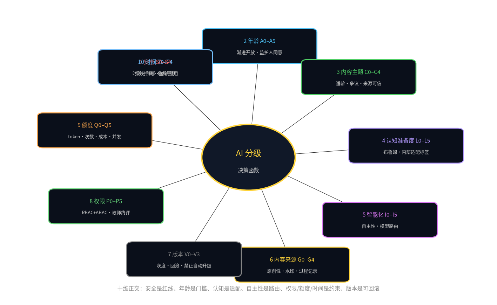

*Figure 1　Ten-dimension classification overview: Decision=f(identity, age, role, scenario, content, task, model, version, permission, quota, time, consent, supervision). Ten dimensions orthogonal: safety is red line, age is threshold, cognition is adaptation, autonomy is routing, permission/quota/time are constraints, version is rollback. (Concept schematic)*

### 3.1 Ten-Dimension Code Definition Master Table

**Table 3　Ten-dimension classification code definition and education mapping**

| # | Dimension | Code | Level definitions | Education mapping | Technical implementation |
|---|---|---|---|---|---|
| 1 | **Safety grading** | S0–S4 | S0 normal/S1 remind/S2 block/S3 high risk to human/S4 crisis intervention | Self-harm·violence·pornography·illegal·psychological crisis·privacy; S4 stops generation, to guardian/school psychologist | Multimodal moderation, classifiers, crisis intervention tickets |
| 2 | **Age grading** | A0–A5 | A0 preschool(0-5)/A1 lower primary(6-8)/A2 upper primary(9-11)/A3 junior high(12-14)/A4 senior high(15-18)/A5 university adult(18+) | Low-age default no free generation, teacher/parent proxy; senior high progressive opening | IAM, student status, guardian consent, age assertions |
| 3 | **Content topic/risk grading** | C0–C4 | C0 general/C1 subject child-appropriate/C2 controversial/C3 sensitive high risk/C4 adult professional | Labels include age-appropriateness, factuality, controversiality, source credibility; violence/porn/self-harm/privacy blocked or guided by level | Content labels, classifiers, knowledge base, RAG |
| 4 | **Cognitive readiness** | L0–L5 | L0 remember/L1 understand/L2 apply/L3 analyze/L4 evaluate/L5 create (Bloom taxonomy) | **User explicitly renamed "intelligence grading" to cognitive readiness**; only internal adaptation labels, prohibited from labeling/ranking/tracking/predicting future, appealable resettable | Task templates, stage assessment, dynamic update |
| 5 | **Intelligence/autonomy grading** | I0–I5 | I0 no AI/I1 retrieval/I2 template single-turn/I3 multi-turn dialogue/I4 tool proxy/I5 multi-agent autonomous | Low-age limited I0–I2, senior high controlled I3–I4 pilot, teachers I4–I5; echoes UDOS L0–L5, SAE J3016 | Model gateway, capability registration cards, tool whitelist |
| 6 | **Content source/originality grading** | G0–G4 | G0 human original/G1 AI-assisted/G2 AI-generated reviewed/G3 AI direct/G4 AI ghostwritten undeclared | Watermark + originality detection + process records; supports academic integrity and teaching evaluation | Digital watermark, originality detection, process evidence base |
| 7 | **Version grading** | V0–V3 | V0 experiment/V1 pilot/V2 stable default/V3 mandatory | Policy·model·label·SDK versions; canary/rollback/audit; education default stable version no auto upgrade | Version management, canary release, rollback mechanism |
| 8 | **Permission grading** | P0–P5 | P0 none/P1 read-only/P2 limited dialogue/P3 generation/P4 API/tools/P5 admin | Roles: student/parent/teacher/research/admin/regulator; **final_assessment evaluation right only teacher** | RBAC+ABAC, OPA/Casbin |
| 9 | **Quota grading** | Q0–Q5 | tokens/calls/duration/concurrency/cost/characters/images | Dynamic by age·stage·task·credit; low-age low quota, teachers higher | Quota center, rate limiting, metering |
| 10 | **Time grading** | T0–T4 | T0 disabled/T1 class supervised/T2 home time/T3 free time/T4 exam lock | Time window/continuous duration/daily cumulative/cooldown/night lock/class mode; exam mode global disable | Clock policy, scenario mode, screen time |

### 3.2 Ruling Note on Items 3/6 Naming Collision

In the user's original design material items 3 and 6 were both named "content grading," which would cause two same-name field conflicts in the policy engine. This paper rules as follows:

- **Item 3 = content topic/risk grading (C0–C4)**: answers "what this content is about, how high the risk, whether age-appropriate." It is the content safety and age-adaptation dimension.
- **Item 6 = content source/originality grading (G0–G4)**: answers "who wrote this content, how much AI participated, whether declared." It is the academic integrity and process traceability dimension, directly corresponding to Labeling Measures + GB 45438 explicit/implicit label requirements.

The "content presentation grading P0–P4 (plain text/image-text/multimodal/interactive/immersive)" proposed in another draft can serve as **alternative eleventh dimension**, but this paper does not include it in core ten—because presentation mode is more an interaction design choice than a governance decision dimension. If included, suggest naming "presentation modality grading M0–M4" to avoid confusion with C/G.

### 3.3 Three Key Distinctions

**Distinction one: safety grading (S) vs content topic grading (C)**. S is red line—S3/S4 directly block or to human, not discussing "whether age-appropriate"; C is adaptation—C2 controversial content in senior high can guide discussion, in primary blocked. S takes priority over C: any content first passes S red line, then does C adaptation.

**Distinction two: cognitive readiness (L) vs intelligence grading (I)**. L is how much cognitive capability the **task itself** needs (Bloom taxonomy), determining AI interaction mode (L0–L1 direct feedback, L2–L3 hints, L4–L5 debate/counter-view); I is how much autonomy **the AI is allowed**, determining model routing and tool permissions. The two orthogonal: an L5 (create) task can use I2 (template single-turn) AI for hints, an L1 (understand) task should not use I5 (multi-agent autonomous) AI to execute.

**Distinction three: age (A) vs cognitive readiness (L)**. Age is **legal and institutional threshold** (<14 needs guardian consent), cognitive readiness is **internal adaptation label**. Age cannot be skipped (legal hard constraint), cognitive readiness dynamically adjustable, appealable, resettable. **Strictly prohibited** from using cognitive readiness labels to rank, track or predict students' future—this is an ethical red line, also echoing EU AI Act strict constraints on education high-risk systems.

> **Chapter summary**: ten-dimension code turns grading into computable engineering objects; items 3/6 naming collision ruled to split into content topic (C) and content source (G); three key distinctions (S vs C, L vs I, A vs L) ensure dimension orthogonality, policy no conflicts.

---

## 4 Decision Function and PDP/PEP Architecture

**One-sentence conclusion**: classification decision core is a pure function Decision=f(input attributes)→output enumeration + constraints, adopting PDP (Policy Decision Point) and PEP (Policy Enforcement Point) separated architecture, policy decoupled from models, each decision explainable, versionable, auditable.

### 4.1 Decision Function Definition

$$\text{Decision} = f(\text{identity}, \text{age}, \text{role}, \text{school stage}, \text{cognitive readiness}, \text{scenario}, \text{task cognitive level}, \text{content safety/topic/source}, \text{requested I level}, \text{version}, \text{permission}, \text{quota}, \text{time}, \text{guardian consent}, \text{teacher supervision})$$

Inputs divided into four categories:

- **Subject attributes**: identity (userId), age (A), role, school stage, cognitive readiness (L), guardian consent status, teacher supervision status.
- **Scenario attributes**: scenario mode (class/homework/exam/home/project), device, location, network environment.
- **Resource attributes**: task type, task cognitive level (L), content safety level (S), content topic level (C), content source level (G), requested intelligence level (I).
- **Environment attributes**: version (V), permission (P), quota remaining (Q), time window (T), current clock.

### 4.2 Output Enumerations

**Table 4　Decision output enumerations and meanings**

| Enumeration                     | Meaning                                           | Typical trigger conditions                          |
|---|---|---|
| ALLOW                    | Allow, execute per default mode                           | All constraints satisfied                          |
| DENY                     | Deny, return educational alternative                           | Safety S3/S4, exam T4, low-age no permission, quota exhausted |
| ALLOW_WITH_GUARDRAILS    | Allow but with guardrails (mandatory citation/process record/no direct answer) | Junior high generated essays, senior high projects                |
| REQUIRE_SUPERVISION      | Execute after teacher/parent supervision                          | Low-age requests high I level, sensitive content C2/C3       |
| REQUIRE_VERIFICATION     | Output after citation/verification/fact check                     | Controversial content, senior high research tasks                |
| TEACHER_ONLY             | Only teacher usable, student side routes to teacher proxy               | Preschool/lower primary A0–A1 generative requests            |
| DOWNGRADE_CAPABILITY     | Downgrade to lower I level or more conservative model                    | Request I4 but policy only allows I2               |
| PROXY_TEACHER            | Teacher/parent proxy executes, student not directly interacting              | Low-age special needs                          |

**Key design: denial is not cold "prohibition"**. When decision is DENY, the system must return an **educational alternative**, e.g.: "At this stage first write an outline yourself for 10 minutes, then I can help check logic and wording." This is the essential difference between education scenarios and general content moderation—the purpose of moderation is not preventing learning, but guiding learning.

### 4.3 Decision Input/Output Example

**Input (JSON)**:

```json
{
  "subject": {
    "user_id": "u123", "role": "student", "age": 10, "grade": "Primary Grade 4",
    "guardian_consent": true,
    "readiness": {"knowledge": 0.4, "self_control": 0.5, "risk_understanding": 0.3}
  },
  "scene": {"mode": "homework", "teacher_supervised": false, "exam_mode": false},
  "task": {"type": "writing", "subject": "Chinese", "cognitive_level": "L2"},
  "content": {"safety_level": "S0", "topic_level": "C1", "source_level": "G2"},
  "model": {"requested_level": "I3"},
  "quota": {"daily_remaining": 8},
  "time": {"current_window": "T2", "used_minutes": 12}
}
```

**Output (JSON)**:

```json
{
  "decision_id": "d_001",
  "allow": true,
  "mode": "SOCRATIC_HINT",
  "model_level": "I2",
  "permissions": ["chat.limited", "rag.textbook"],
  "constraints": [
    "No direct full essay",
    "First submit own outline",
    "Must give citations",
    "Record modification process"
  ],
  "quota": {"max_tokens": 1200, "remaining_calls": 8},
  "time": {"max_minutes": 15, "cooldown_minutes": 30},
  "human_in_loop": "parent_notify_if_sensitive",
  "policy_version": "v2.3.1",
  "model_version": "edu-llm-v1.8-stable",
  "reasons": ["age_A2_default_I2", "writing_task_require_outline_first", "quota_sufficient"]
}
```

Note the output contains `policy_version`, `model_version`, `reasons`—this is the basis of explainability and auditability. Each decision can be traced to "which policy, which model version, why decided so."

### 4.4 PDP/PEP Separation Architecture

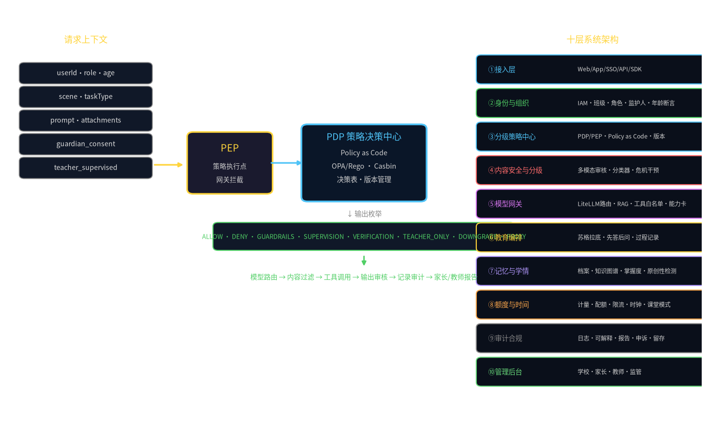

*Figure 2　Decision flow (PEP→PDP→output enumeration) and ten-layer system architecture. PEP deployed at gateway/client/LMS entry, responsible for intercepting requests and executing decisions; PDP independently deployed, responsible for policy evaluation, decoupled from business code. (Concept schematic)*

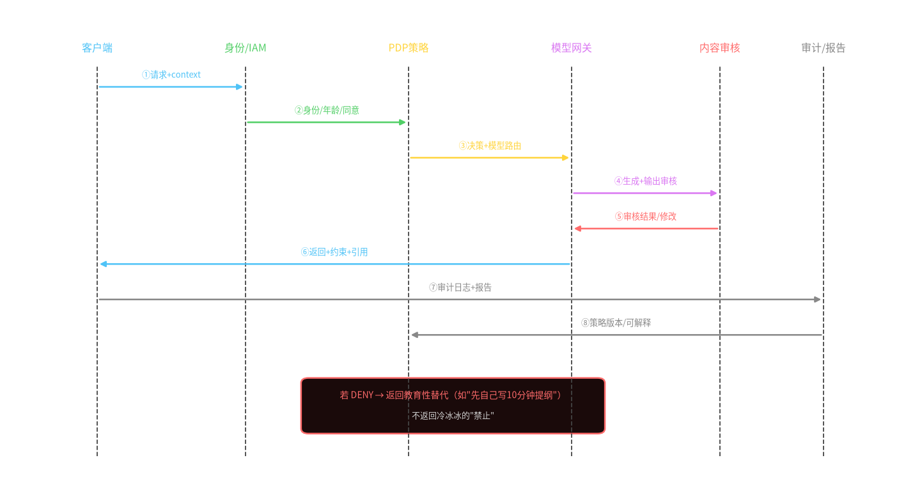

*Figure 5　Core decision sequence eight steps: client request→identity authentication and age assertion→PDP policy evaluation→model gateway routing and capability matching→content safety input moderation→education orchestration (Socratic/pre-task gate)→output moderation and audit metering→return decision and educational alternative. Bypass: memory and learning state asynchronously updated before/after request, not blocking main decision chain. (Concept schematic)*

- **PEP (Policy Enforcement Point)**: deployed at API gateway, client SDK, LMS plugin entry. Responsibilities: intercept all AI requests → collect context attributes → call PDP → execute decision (allow/deny/downgrade/add constraints) → record audit. PEP does not do policy judgment, only execution.
- **PDP (Policy Decision Point)**: independently deployed policy engine. Responsibilities: receive attributes → load policy version → evaluate → return decision. PDP stateless, horizontally scalable.
- **PAP (Policy Administration Point)**: admin backend, responsible for policy authoring, versioning, canary release, rollback.
- **PIP (Policy Information Point)**: provides attribute data sources (identity service, quota service, time service, learning state service).

This architecture references XACML (OASIS standard) PDP/PEP/PAP/PIP four-component separation, implemented in cloud-native scenarios with OPA/Rego or Casbin. **Policy decoupled from models** is the core principle—change model without changing education rules, change education rules without changing model.

### 4.5 Policy as Code

Classification policies written in declarative language (Rego or Casbin policy files), included in version control, supporting code review, testing, canary release, rollback. Example (Rego pseudocode):

```rego
# Lower primary (A1) student side default closes free generation
deny[msg] {
    input.subject.age <= 8
    input.subject.role == "student"
    input.model.requested_level >= "I3"
    msg := "Lower primary student side does not open free generation, please have teacher/parent proxy"
}

# Exam mode global disable
deny[msg] {
    input.scene.exam_mode == true
    msg := "Generative AI disabled in exam mode"
}

# Writing tasks must first submit outline
constraint[c] {
    input.task.type == "writing"
    input.subject.age <= 14
    c := "require_outline_first"
}
```

Policy files themselves have version numbers (V0–V3), each decision associated with policy version, supporting rollback to any historical version. This echoes UDOS evidence engineering's "version traceable" principle.

> **Chapter summary**: decision function is pure, inputs four attribute categories, outputs nine enumerations + constraints; PDP/PEP separation ensures policy decoupled from business/models; Policy as Code makes policies versionable, testable, rollbackable; denial must give educational alternatives.

---

## 5 Ten-Layer System Architecture

**One-sentence conclusion**: the ten-layer architecture progresses layer by layer from access to admin backend, core is "classification policy center" as decision brain, "model gateway" as capability routing, "education orchestration" as learning process guard, "audit compliance" as full-chain traceability; each layer single responsibility, clear interface, independently replaceable.

### 5.1 Ten-Layer Architecture Overview

**Table 5　Ten-layer system architecture definition**

| Layer | Name | Core responsibilities | Key components |
|---|---|---|---|
| ① | **Access layer** | Multi-end access, protocol conversion, traffic entry | Web/App, school SSO, API, browser plugins, education software SDK |
| ② | **Identity and organization layer** | Identity authentication, organization management, age assertion, guardian relationships | IAM (OIDC/SAML/Keycloak), organization/class/roles, guardians, age assertion service |
| ③ | **Classification policy center** | Policy decision, rule engine, version management | PDP/PEP, Policy as Code (OPA/Rego/Casbin), decision tables, canary/rollback |
| ④ | **Content safety and grading** | Input/output moderation, multimodal classification, crisis intervention | Multimodal moderation, classifiers (Llama Guard etc.), knowledge base, crisis intervention tickets |
| ⑤ | **Model gateway** | Model routing, prompt templates, RAG, tool calls, capability registration | LiteLLM routing, prompt templates, RAG whitelist knowledge base, tool whitelist, capability registration cards |
| ⑥ | **Education orchestration layer** | Task templates, Socratic guidance, answer-before-ask, process records | Task templates, SOCRATIC_HINT mode, pre-task gate, process evidence collection |
| ⑦ | **Memory and learning state layer** | Learning profiles, knowledge graph, mastery, cognitive load, originality detection | Learning profiles, knowledge graph, mastery models, cognitive load assessment, originality detection |
| ⑧ | **Quota and time layer** | Metering, quotas, rate limiting, clocks, class mode | Metering service, quota center, rate limiting, clock policy, class mode/exam mode |
| ⑨ | **Audit and compliance layer** | Logs, explainability, reports, appeals, data retention | Audit logs, decision explainability, parent/teacher reports, appeal channels, data retention/deletion |
| ⑩ | **Admin backend** | School/parent/teacher/regulator multi-view management | School admin, parent controls, teacher workbench, regulator reporting |

### 5.2 Core Data Flow

```
Client request
  → ① access layer (PEP intercept)
  → ② identity organization (authentication + age assertion + guardian consent)
  → ③ classification policy center (PDP evaluate → decision + constraints)
  → ⑤ model gateway (route to corresponding I-level model + prompt templates + RAG + tools)
  → ④ content safety (input moderation → generation → output moderation)
  → ⑥ education orchestration (Socratic mode/pre-task gate/process records)
  → ⑧ quota time (deduct quota/update duration)
  → ⑨ audit compliance (record decision+input+output+version → generate report)
  → return client (with decision_id + constraints + citations + audit)
```

Bypass: ⑦ memory and learning state asynchronously updated before/after request (mastery, cognitive load, originality), not blocking main decision chain.

### 5.3 Three Key Design Notes

**Design one: model gateway capability registration card**. Each model/tool/Agent has a "capability registration card," recording: intelligence level (I), supported content level (C), applicable minimum age (A), version (V), whether memory capable, whether network capable, whether can generate code/images/files, cost/token rate, known limitations. The model gateway selects models satisfying constraints per PDP decision—e.g. decision requires I2+C1+A2, gateway only routes to models satisfying these three conditions, not allowing "requested model is used." This is **capability routing** not simple API proxy.

**Design two: education orchestration layer "pre-task gate"**. This is the platform's most core education difference point. Before students call AI, they must first submit own thoughts, outline, draft or answer—the system verifies "student has attempted" (via text input, handwriting photo recognition, or teacher confirmation), then allows AI intervention. AI default enters SOCRATIC_HINT mode, only giving questions, clues, checkpoints, not direct answers. Senior high can open "counter-view mode," but must mark evidence and sources. This design directly echoes 2025 Steering Committee guidelines "primary prohibits independent open-ended generation" policy red line, also embodies the education philosophy "AI is hint coach, not ghostwriting tool."

**Design three: audit compliance layer "decision explainability"**. Each decision records: who (userId), when, what scenario, which model version, which policy version, input attribute snapshot, output decision, reasons, whether teacher-overridden, override reason. Parents/teachers/regulators can query full decision chain by decision_id. This echoes EU AI Act high-risk system "record keeping" obligations, also echoes UDOS evidence engineering's "three-layer consistency" principle.

### 5.4 Technology Selection

**Table 6　Technology selection recommendations (all checked to official docs, access date 2026-09-21)**

| Layer | Recommended components | Alternatives | Selection rationale | Limitations/notes |
|---|---|---|---|---|
| Policy engine | OPA/Rego | Casbin, Drools | CNCF graduated (2021-01-29), native PDP/PEP support, Rego strong expressiveness | Rego steep learning curve; policy correctness needs testing |
| Identity | Keycloak (OIDC/SAML) | Auth0, school SSO integration | Open source, federated identity support, common in education | Needs integration with education student status systems |
| Gateway | Kong/APISIX/Envoy | — | PEP deployment point, rate limiting, authentication | Gateway itself becomes focus point |
| Model gateway | LiteLLM | Self-developed routing | Unified 100+ providers (vendor caliber), cost tracking, fallback | Enterprise SSO paid version; tool call support inconsistent across providers |
| Content safety | Llama Guard 3 + NeMo Guardrails + Presidio | Guardrails AI, self-developed classifiers | Llama Guard S1–S13 classification, NeMo orchestration, Presidio PII masking | Chinese education sensitive words need self fine-tuning; cannot replace human review |
| Knowledge/vector | pgvector/Milvus | — | RAG whitelist textbook library | Needs regular textbook version updates |
| Events/workflow | Kafka/Temporal | — | Async audit, quota deduction, retries | Increases system complexity |
| Data storage | Postgres/Redis/ClickHouse | — | Structured data/cache/audit log analysis | Minor data needs encryption + regional residency |
| Observability | OpenTelemetry/ELK | — | Full-chain tracing, log aggregation | — |
| Deployment | K8s | Privatized/hybrid cloud | Regional data residency, elastic scaling | Education privatized deployment needs operations capability consideration |

> **Chapter summary**: ten-layer architecture single responsibility, clear interface; three key designs (capability registration card, pre-task gate, decision explainability) are education scenario core differences; technology selection prioritizes mature open-source components, but Chinese education sensitive words need self fine-tuning, AI detection tools cannot serve as sole judgment basis.

---

## 6 Data Model and Key APIs

**One-sentence conclusion**: data model designed around "decision traceability," core entities User, Policy, Decision, AuditLog, ProcessEvidence; API with `/v1/ai/query` as core entry, all requests carry context, all returns carry decision_id, ensuring end-to-end auditability.

### 6.1 Core Data Model

**Table 7　Core data entities and key fields**

| Entity | Key fields | Description |
|---|---|---|
| **User** | user_id, role, age, grade, org_id, class_id, status | Roles: student/parent/teacher/researcher/admin/regulator |
| **AgeProfile** | user_id, age_band (A0–A5), birth_date, age_assertion_method, guardian_verified | Age assertion methods: student status/parent account/government ID/self-declaration (low risk only) |
| **GuardianConsent** | consent_id, student_id, guardian_id, scope, granted_at, revoked_at, status | Revocable; scope limits data use |
| **Role/Permission** | role_id, permissions[], data_scope, final_assessment (bool) | final_assessment only teacher true |
| **Org/Class** | org_id, org_type (school/district), class_id, grade | Organization hierarchy |
| **Policy** | policy_id, name, description, version (V0–V3), status, code (Rego), created_by | Policy as code |
| **PolicyVersion** | version_id, policy_id, version_str, changelog, canary scope, created_at | Supports canary/rollback |
| **Resource/Content** | content_id, content_type, safety_level (S), topic_level (C), source_level (G), labels[], creator | Content labels |
| **ContentLabel** | label_id, content_id, label_type, value, confidence, label_version | Labels versioned |
| **Model** | model_id, name, provider, version, capability_level (I), cost_per_token, status | Model registration |
| **ModelCapability** | model_id, capability_card (json), min_age (A), max_content (C), tools[], limitations | Capability registration card |
| **Session** | session_id, user_id, scene, started_at, ended_at, duration, mode | Session |
| **Request** | request_id, session_id, prompt_hash, attachments_hash, task_type, cognitive_level (L), timestamp | Request (content hash, no original stored to protect privacy) |
| **Decision** | decision_id, request_id, policy_version, model_version, input_snapshot, output (json), reasons[], created_at | **Core traceable entity** |
| **Quota** | user_id, period, quota_type (token/calls/time/cost), limit, used, remaining | Quota |
| **TimeWindow** | user_id, date, window_type (T0–T4), allowed_hours, used_minutes, cooldown_until | Time |
| **AuditLog** | log_id, decision_id, actor, action, timestamp, metadata | Audit |
| **Consent** | consent_id, user_id, type, scope, granted_at, revoked_at | Consent management |
| **Guardian** | guardian_id, student_ids[], relationship, contact_verified | Guardian |
| **ClassroomMode** | class_id, mode (active/exam/locked), teacher_id, started_at, ended_at | Class/exam mode |
| **Assessment** | assessment_id, student_id, task_id, teacher_id, ai_assisted (bool), process_evidence_ids[], final_score, teacher_notes | **Teacher final assessment, AI no final evaluation** |
| **ProcessEvidence** | evidence_id, session_id, type (draft/outline/prompt/modification/citation), content_hash, timestamp, ai_usage_declaration | **Process evidence: draft history/prompts/modification trajectory/citations** |
| **TeacherOverride** | override_id, decision_id, teacher_id, original_decision, new_decision, reason, timestamp | Teacher can override but logged |

### 6.2 Key APIs

**Table 8　Key API definitions**

| Method | Path | Description | Key inputs | Key outputs |
|---|---|---|---|---|
| POST | `/v1/ai/query` | Core AI query entry | context (userId, role, age, scene, task, prompt, attachments, requested_I_level) | decision_id, allowed, mode, model, constraints, content, citations, hints, audit |
| POST | `/v1/policy/evaluate` | Policy evaluation (debug/audit) | input_attributes | decision, reasons, policy_version |
| POST | `/v1/content/classify` | Content classification | content_text/hash | safety_level (S), topic_level (C), source_level (G), labels |
| POST | `/v1/quota/check` | Quota check | userId, quota_type | remaining, limit |
| POST | `/v1/quota/consume` | Quota deduction | userId, quota_type, amount | new_remaining |
| POST | `/v1/time/check` | Time window check | userId, scene | allowed, current_window (T), remaining_minutes |
| POST | `/v1/audit/log` | Audit log write | decision_id, actor, action, metadata | log_id |
| POST | `/v1/guardian/consent` | Guardian consent grant/revoke | student_id, guardian_id, scope, action | consent_id, status |
| POST | `/v1/teacher/override` | Teacher override decision | decision_id, new_decision, reason | override_id |
| GET | `/v1/report/guardian/{student_id}` | Parent report | student_id, period | usage_summary, decisions, alerts, quota |
| GET | `/v1/audit/decision/{decision_id}` | Decision detail query | decision_id | full decision chain |

### 6.3 `/v1/ai/query` Contract

**Request must carry**: user identity, age, role, class, scenario (class/homework/exam/home/project), task type, whether teacher supervised, whether parent consented, requested model capability level, content attachment hash, privacy flags.

**Return must include**: decision ID, whether allowed, education mode (direct answer/SOCRATIC_HINT/clues only/deny with alternative), citation sources, quota and time constraints, audit ID.

**Design proposal · to be implemented** [RESULT NEEDED]: the above APIs are design proposals, not yet implemented. Actual implementation needs adding: authentication middleware, rate limiting, error code specs, WebSocket streaming response support, versioned API migration strategy.

> **Chapter summary**: data model designed around Decision core traceable entity, ProcessEvidence and TeacherOverride are education-specific entities; API with `/v1/ai/query` as core, all requests carry context, all returns carry decision_id; all design proposals · to be implemented.

---

## 7 Stage Strategy Matrix and Education Orchestration

**One-sentence conclusion**: the stage strategy matrix lands the ten-dimension code into each age band's specific permissions and constraints, numbers all strategy examples · configurable; the education orchestration layer via six mechanisms "pre-task gate, Socratic hints, process evidence, AI usage declaration, teacher final assessment, exam lock" ensures "AI is hint coach, not ghostwriting tool."

### 7.1 Stage Strategy Matrix

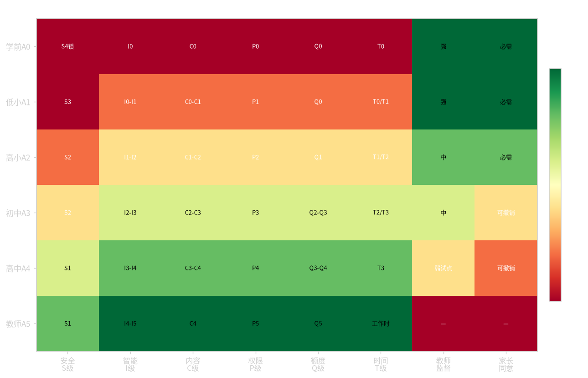

*Figure 3　Stage × dimension strategy matrix (strategy example · configurable, not measured; greener higher openness). Preschool/lower primary locked, upper primary controlled Q&A, junior high generation+citation+process, senior high open+critique+project, teachers full function but no final evaluation.*

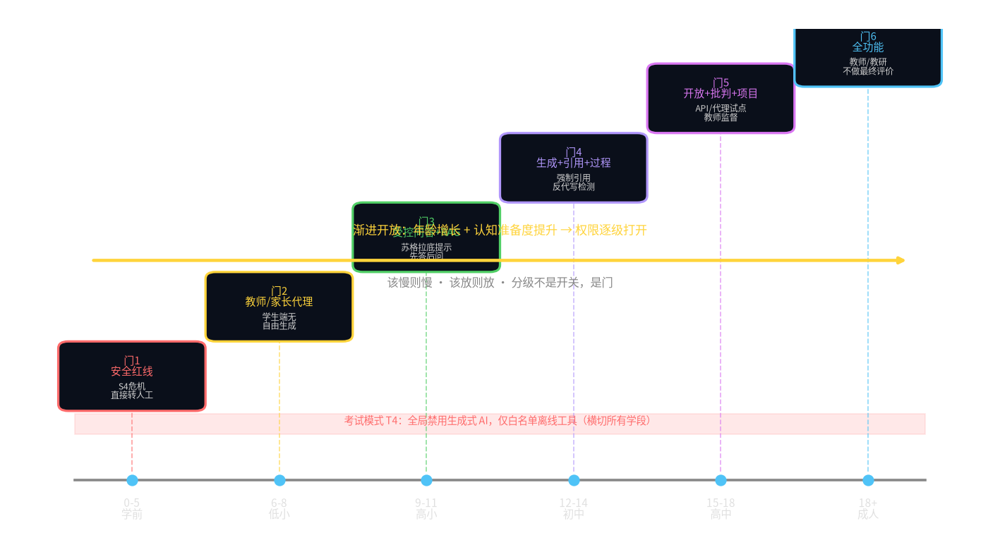

*Figure 4　Progressive gate opening six gates: age axis A0→A5, permissions from "safety red line/teacher proxy" opened level by level to "full function/audit." Each gate corresponds to a default strategy set, adjustable by teacher/parent/regulator within authorized scope, but cannot skip safety red line. "Classification is not a switch, it is gates: slow when slow needed, open when open needed." (Strategy example · configurable)*

**Table 9　Stage strategy matrix (all quota/duration numbers strategy examples · configurable, not measured)**

| Stage | Age | Default permissions | Intelligence level (I) | Typical mode | Quota/time (example) | Supervision |
|---|---|---|---|---|---|---|
| Preschool A0 | 0-5 | Student side no free generation | I0–I1 | Teacher/parent proxy, whitelist content, stories/literacy | Q0, T0/T1 | Strong |
| Lower primary A1 | 6-8 | Student side no free generation | I0–I1 | Teacher/parent proxy, whitelist Q&A | Q0, T0/T1 | Strong |
| Upper primary A2 | 9-11 | Limited Q&A + textbook RAG | I1–I2 | Socratic hints, answer-before-ask, hint cards | 10–20 calls/day, 15–20min | Parent consent |
| Junior high A3 | 12-14 | Can generate but mandatory citation + process records | I2–I3 | Debate, experiments, logic analysis, anti-ghostwriting detection | 30–50 calls/day, 30min | Teacher supervision |
| Senior high A4 | 15-18 | Open + critique + project + API teacher supervised pilot | I3–I4 | AI literacy, counter-view, verification, project creation | 80–200 calls/day, 60min | Teacher pilot, exam lock |
| Teacher A5 | 18+ | Full function but no final evaluation | I4–I5 | Lesson prep, question setting, grading assist, learning state analysis | Per organization quota | Audit |
| **Exam scenario** | any | **Global generative AI disable** | I0 | Only whitelist offline tools (calculator/dictionary) | Q0, T4 | Invigilation |

*Table 9 note: quota/duration numbers strategy examples · configurable, actual deployment should be adjusted by school/region per learning state, devices, network conditions, and verified through pilots. Low-age "no free generation" directly corresponds to 2025 Steering Committee guidelines "primary stage prohibit students independently using open-ended content generation functions."*

### 7.2 Education Orchestration Six Mechanisms

**Mechanism one: Pre-task Gate**. Before students call AI, they must first submit own thoughts, outline, draft or answer. The system verifies "student has attempted" (via text input, handwriting photo recognition, or teacher confirmation), then allows AI intervention. This is the technical implementation of "think yourself first"—AI cannot replace the thinking process, only provide feedback after thinking.

**Mechanism two: SOCRATIC_HINT**. Low-age default mode, AI does not directly give answers, only questions, clues, checkpoints. E.g. student asks "how to do this math problem," AI replies: "First think what operation this involves? What known conditions are there? What can the first step be?" Senior high can switch to "counter-view mode," AI gives opposing argument, but must mark evidence and sources.

**Mechanism three: Process Evidence**. The system saves draft history, prompt records, modification trajectory, AI dialogue summaries, citation sources. Each process evidence carries content_hash (no original stored to protect privacy) and timestamp. Teachers can view students' complete learning process—this has more education value than "whether final assignment AI-generated," also more reliable than AI detection scores.

**Mechanism four: AI Usage Declaration**. Assignments automatically carry metadata: which model used, which paragraph used AI, what prompts, AI participation level (G0–G4). This corresponds to Labeling Measures + GB 45438 explicit/implicit label requirements, also cultivates students' academic integrity awareness.

**Mechanism five: Teacher Final Assessment**. AI can assist grading, give feedback, analyze learning state, but **final_assessment permission only teacher**—AI cannot directly decide student evaluation. Teachers can override AI decisions (TeacherOverride), but must log (override reason, time). This is the core embodiment of "human in loop."

**Mechanism six: Exam Mode Lock**. Exam scenarios global T4/Q0/I0, disable generative AI, only allow whitelist offline tools (calculator, dictionary). Class mode switched by teacher one-click, exam mode time window configured by school admin. This is the technical guarantee of evaluation fairness.

### 7.3 Denial Educational Alternative Examples

| Scenario | System decision | Educational alternative reply |
|---|---|---|
| 8-year-old requests "help me write essay" | DENY + TEACHER_ONLY | "At this stage first write an outline yourself for 10 minutes, then you can have teacher or mom/dad take a look." |
| 10-year-old requests "give me answer directly" | ALLOW_WITH_GUARDRAILS + SOCRATIC_HINT | "First say what you think? What do you feel the first step should be? I can help check your thinking." |
| 14-year-old writes essay without submitting outline | DENY + pre-task gate | "Please first submit your essay outline (at least 3 points), after submission I can help refine logic and wording." |
| Any AI request during exam | DENY + T4 | "AI disabled in exam mode, please complete independently." |
| Senior high requests "help me write full paper" | ALLOW_WITH_GUARDRAILS + mandatory citation + process records | "I can help outline, find literature, check argument, but the paper needs you to write. Each AI-assisted paragraph auto-labeled." |

> **Chapter summary**: stage strategy matrix lands ten-dimension code into specific age bands, numbers all strategy examples · configurable; education orchestration six mechanisms (pre-task gate, Socratic hints, process evidence, AI usage declaration, teacher final assessment, exam lock) are the technical implementation of "AI is hint coach not ghostwriting tool"; denial must give educational alternatives.

---

## 8 Mapping with UDOS Governance System

**One-sentence conclusion**: this platform's ten-dimension classification and UDOS governance system are deeply isomorphic on five dimensions—I0–I5 align UDOS L0–L5 autonomy levels, Policy as Code aligns evidence engineering "rules before learning," TransferBundle least privilege aligns permission grading, BFT-lite multi-person review aligns teacher committee/human review gates, quality saturation law explains the governance ceiling of "generation scalable, teacher review not scalable."

### 8.1 Five-Fold Mapping

**Table 10　Five-fold mapping between this platform and UDOS governance system**

| Dimension | This platform design | UDOS counterpart | Mapping meaning |
|---|---|---|---|
| **Autonomy grading** | Intelligence I0–I5 (no AI→retrieval→template→dialogue→tool proxy→multi-agent autonomous) | UDOS L0–L5 autonomy levels; industry paper SOP gates | Education scenarios limit high autonomy (low-age I0–I2), consistent with UDOS "higher autonomy, higher governance cost" judgment |
| **Rules first** | Content safety/admission uses deterministic rules as base, learning classifiers as supplement | Evidence engineering H-CSC v2: deterministic lexical predicates AUROC 0.865–0.982 beat learning encoders 0.621–0.744 | Education safety red lines (self-harm/violence/illegal) must use deterministic rules, cannot rely on learning classifiers' probabilistic output |
| **Least privilege** | Permission grading P0–P5, RBAC+ABAC, final_assessment only teacher | TransferBundle scope least privilege field | Each AI interaction only grants minimum permissions needed for task, isomorphic with UDOS "handoff as contract" least privilege principle |
| **Multi-person review** | Teacher can override decisions, teacher committee reviews high-risk decisions, S4 crisis to human | BFT-lite three-level typed finality; review gates (5 human + 1 red team + 1 version) | High-risk/high-stakes decisions need multi-person review, single AI decision or single teacher decision both insufficient |
| **Governance ceiling** | Generation scalable, teacher review not scalable; AI handles standardized, teacher focuses individual differences | Quality saturation law (verification capacity ceiling: generation scalable, review not scalable, Little's Law/WIP=1) | Platform goal uses AI to scale "generation/feedback/analysis" capacity, freeing teachers from standardized work to focus individual judgment—but teacher review itself not scalable, this is governance hard ceiling |

### 8.2 Rules Before Learning: H-CSC Evidence Implications for This Platform

UDOS Paper 06 H-CSC v2's core evidence: **deterministic lexical predicates AUROC 0.865–0.982 beat learning semantic encoders 0.621–0.744** (correct caliber after author voluntarily withdrew v1 "honestly retained advantage" claim). This has direct implications for this platform's content safety design:

- **Safety red lines (S3/S4) use deterministic rules**: self-harm, violence, illegal, minor privacy etc. red-line content must use deterministic rules (keywords, regex, pattern matching), cannot rely on learning classifiers' probabilistic output. Deterministic rules' advantages explainable, auditable, zero hallucination—exactly what education scenarios most need.
- **Learning classifiers as supplement**: content topic grading (C0–C4), age-appropriateness judgment, controversial content identification etc. "gray" decisions can use learning classifiers assist, but must give confidence, low confidence to human.
- **Learning encoders' failure boundary**: learning classifiers under out-of-distribution input, adversarial prompts, multilingual mixing scenarios performance significantly drops (H-CSC evidence shows learning encoders AUROC only 0.621–0.744). Education students will try various bypasses (homophones, character splitting, multilingual), deterministic rules more robust.

### 8.3 Quality Saturation Law: Why Teacher Final Assessment Cannot Be Omitted

UDOS Paper 07 quality saturation law's core judgment: **generation capability scalable (add more models/more compute), but verification/review capability not scalable (teacher time hard constraint)**, expressed via Little's Law as WIP=1 review throughput has ceiling.

This means for this platform:

- **AI can scale "feedback capacity"**: auto-grade multiple choice, generate practice questions, analyze learning state data—these standardized work, AI can scale.
- **Teacher cannot scale "judgment capacity"**: students' final evaluation, personalized feedback, psychological care, ethical judgment—these need human teachers, AI cannot replace.
- **Platform goal not "replace teacher with AI," but "free teacher from standardized work with AI,"** letting teachers have more time for what AI cannot do. This is the economic basis of "AI provides information and efficiency, human retains judgment and responsibility."

> **Chapter summary**: this platform and UDOS governance system five-fold isomorphic (autonomy grading, rules first, least privilege, multi-person review, governance ceiling); H-CSC evidence proves safety red lines use deterministic rules, learning classifiers supplement; quality saturation law explains the economic reason teacher final assessment cannot be omitted.

---

## 9 Essence and Dross: Technology Selection Critique

**One-sentence conclusion**: not all "AI safety tools" suit education scenarios—LiteLLM/OPA/Presidio directly adoptable, Llama Guard/NeMo Guardrails need Chinese education scenario self fine-tuning, AI-generated content detection tools (GPTZero/Turnitin/ZeroGPT) have peer-reviewed evidence proving systematic misjudgment against non-English writers, absolutely cannot serve as sole academic discipline basis, age estimation AI has bias and privacy controversy, only auxiliary signal.

### 9.1 Essence: Components Suitable for Direct Adoption

**1. LiteLLM as LLM gateway layer**. Strips "which model, which key, how much cost, how to fallback when down" from business code. Education platforms can self-host without uploading student data to vendor telemetry; cost tracking and budget rate limiting highly valuable for school/region procurement. Limitations: enterprise SSO/SCIM paid version; different providers' tool call/streaming/JSON Schema support inconsistent (vendor caliber "140+ providers/1800+ models," mark vendor caliber when citing).

**2. Presidio for PII masking before student data leaves domain**. Before student chat/assignments sent to external large models, first identify names, student IDs, parent phones, school names etc. and replace with placeholders. This is the highest cost-performance layer in FERPA/COPPA/GDPR/PIPL compliance chain. Limitations: Chinese names, low-resource languages need self-training; masking ≠ anonymization (linkage attack risk); governance transition statement (2026 transition to data-privacy-stack) from third party, needs Microsoft official announcement confirmation [CITATION NEEDED].

**3. OPA/Rego or Casbin as policy layer**. Writing classification policies like "primary grades disable open chat, junior high only whitelist models, exam period prohibit generative AI" as code, PDP independently deployed, naturally aligned with EU AI Act high-risk obligations' needed "human supervision, record keeping" structure. OPA CNCF graduated (2021-01-29), Casbin multi-language support. Limitations: Rego steep learning curve; Casbin ABAC expressiveness weaker than OPA/Rego.

**4. XACML/NIST RBAC/ABAC as architectural terminology and benchmark**. No need to land full XACML (XML cumbersome, cloud-native mostly replaced by OPA), but citing ANSI/INCITS 359-2012 (RBAC) and NIST SP 800-162 (ABAC) can elevate "graded access control" from engineering slogan to standard language.

### 9.2 Components Needing Customization or Secondary Training

**5. Llama Guard 3 / NeMo Guardrails / Guardrails AI as content safety guardrails**. Llama Guard 3 covers S1–S13 total 13 safety risk categories (violent crimes, non-violent crimes, sex crimes, child sexual exploitation, defamation, professional advice, privacy, IP, indiscriminate weapons, hate, suicide/self-harm, sexual content, elections), but the taxonomy designed for **English adult safety scenarios**. Chinese education sensitive words (campus violence, minor inducement, exam leakage, beyond-syllabus content, value guidance) need self fine-tuning or self-written validators. Suggest using NeMo Guardrails as orchestration layer, Llama Guard 3 as one built-in risk signal, not sole judge. Limitations: rules can be bypassed via multi-turn dialogue; hallucination/fact checking relies on external scoring models.

**6. Conformal prediction for "low confidence auto downgrade"**. Technical principle reliable (distribution-free uncertainty quantification, split conformal uses calibration set quantiles to give prediction sets, providing finite-sample coverage guarantee, ref Angelopoulos & Bates 2021, arXiv:2107.07511), but LLM open-ended outputs have no unique correct labels. Suggest first piloting on multiple choice, knowledge point diagnosis, essay scoring etc. subtasks with clear answer sets, using split conformal to give "this AI answer confidence insufficient→to human/to more expensive model" fallback, not full scenario direct application. Limitations: relies on exchangeability assumption, coverage fails under data drift.

### 9.3 Dross: Known Failure Modes, Cannot Serve as Sole Judgment Basis

**7. AI-generated content detection (GPTZero / Turnitin / ZeroGPT)—systematic bias with peer-reviewed hard evidence**.

Liang, W., Yuksekgonul, M., Mao, Y., Wu, E., & Zou, J. (2023). "GPT detectors are biased against non-native English writers." ***Patterns*, 4(7), 100779.** PMID: 37521038.

Experiment: 7 mainstream GPT detectors × 91 non-native TOEFL essays from Chinese forum sources + 88 US Grade 8 essays from Hewlett Foundation ASAP dataset.

Conclusion: detectors systematically misjudge non-native English writing **as AI-generated**; near-perfect accuracy on US Grade 8 essays; simple prompt strategies both mitigate bias and can bypass detectors.

Meaning for education scenarios: **AI detection scores must not alone serve as academic misconduct discipline basis**. Credibility on Chinese writing lower (detectors mainly trained English). This platform at most treats detection scores as weak signal "suggest teacher review," and must combine triple evidence **human scoring, writing process logging (ProcessEvidence), student self-statement**. Third-party reports say Turnitin self-reports non-native misjudgment about 6–9%, native 1–4% (this number from Turnitin's own research second-hand retelling, before formal citation suggest checking Turnitin official report [CITATION NEEDED]); Vanderbilt University 2023-08, Curtin University 2026-01 successively stopped using Turnitin AI detection (institutional decisions, citable as governance cases).

**8. Facial age estimation / self-declared age gate—bypass and bias**. Self-declared age easily bypassed (students casually fill an adult age); facial age estimation has bias and privacy controversy for minors, different skin colors, glasses/mask scenarios (ICO 2025–2026 progress documents already require platforms "beyond self-declaration"). Education scenarios if need distinguishing 13/14/16, should prioritize **government digital identity or parent account verification**, AI age estimation only as auxiliary signal, and cannot serve as sole admission basis.

**9. "Open source = safe/compliant" intuition—open source ≠ compliance**. Open-source components (Presidio, NeMo Guardrails, Llama Guard) themselves ≠ compliance; model training data licenses, whether student data enters fine-tuning, cross-border transfer, log retention cycles still need explicit declaration at Policy as Code layer. Llama Guard community license requires complying with Meta Llama community license terms.

> **Chapter summary**: technology selection in three tiers—direct adoption (LiteLLM/OPA/Presidio), needs customization (Llama Guard Chinese fine-tuning/conformal pilot), cannot serve as sole basis (AI detection tools/age estimation AI); AI detection tools' systematic bias has Liang et al. 2023 peer-reviewed hard evidence, absolutely cannot serve as academic discipline sole basis.

---

## 10 Failure Boundaries, Falsifiability Conditions and Predictions

**One-sentence conclusion**: any classification governance platform has failure boundaries—private device bypass, third-party education software SDK integration, no absolute label standards, teacher burden, misjudgment/label bias, parent resource gap, policy fragmentation, over-blocking harms learning, cognitive readiness label ethical risk, formal compliance bypass; this chapter gives falsifiability conditions and specific predictions, before submission needs ≥30 seeds + 95% CI verification.

### 10.1 Failure Boundary List

**Table 11　Failure boundaries and impact levels**

| # | Failure mode | Impact level | Description | Mitigation |
|---|---|---|---|---|
| 1 | **Private device bypass** | high | Students use personal phones/home computers to access AI products not connected to policy center, platform completely unable to control | School network layer control + parent end linkage + AI literacy education (teach students "what scenario use what") |
| 2 | **Third-party education software SDK integration** | high | School-purchased education software embeds AI, if not connected to policy center becomes governance blind spot | SDK/API mandatory policy center connection as procurement admission condition; education large model safety review mechanism |
| 3 | **No absolute label standards** | medium | Content grading (C0–C4), cognitive readiness (L0–L5) label boundaries fuzzy, different annotators may disagree | Labels versioned + multi-person annotation + consistency monitoring + low confidence to human |
| 4 | **Teacher burden increase** | medium | Teachers need review AI decisions, view process evidence, handle appeals, may increase workload | AI prioritizes standardized work (multiple choice grading, practice generation), teachers only review high-risk/high-stakes decisions; quality saturation law |
| 5 | **Misjudgment/label bias** | medium | Content classifiers, cognitive readiness assessment may bias specific groups (non-native, special education needs students) | Regular fairness audit + appeal mechanism + teacher review + no labels for ranking/tracking |
| 6 | **Parent resource gap (digital divide)** | medium | High-education/high-income parents better understand and use platform parent controls, low-resource families may not effectively supervise | Parent end simplified design + school provides unified default policy + no parent participation as student evaluation basis |
| 7 | **Policy fragmentation** | medium | Different schools/regions/teachers set different policies, causing cross-school student experience inconsistent | Regional baseline policy + schools can fine-tune on baseline + policy version management + best practice sharing |
| 8 | **Over-blocking harms learning** | medium | Over-conservative policy (e.g. all-stage generative AI ban) deprives students of AI literacy opportunity, contradicts MOE policy | Progressive opening principle + regular effect evaluation + student/teacher feedback channels |
| 9 | **Cognitive readiness label ethical risk** | high | L0–L5 labels if used for ranking, tracking, predicting future, cause label stigma and self-fulfilling prophecy | **Only internal adaptation labels, prohibit external display/ranking/tracking/future prediction**; appealable resettable; EU AI Act high-risk constraints |
| 10 | **Formal compliance bypass** | medium | Students/teachers may via "first submit junk outline then pass pre-task gate" etc. formally satisfy process, substantively still rely on AI | Process evidence quality assessment + teacher spot check + AI usage declaration + academic integrity education |

### 10.2 Falsifiability Conditions

This platform's core design claims can be falsified via the following conditions:

1. **"Pre-task gate improves learning effect" falsifiable**: if A/B tests show student groups using pre-task gate **not outperform** (or underperform) control groups directly using AI on learning outcome tests, then this mechanism's education value is falsified. [RESULT NEEDED]
2. **"Ten-dimension grading superior to single age grading" falsifiable**: if comparison experiments show ten-dimension grading **not significantly superior** to simple age grading on user satisfaction, learning effect, safety incident rate, then ten-dimension complexity cost not worthwhile. [RESULT NEEDED]
3. **"Deterministic rules superior to learning classifiers for safety red lines" falsifiable**: if on education scenario real data, learning classifiers' AUROC **significantly higher** than deterministic rules (opposite H-CSC evidence), then rules-first design needs correction. [RESULT NEEDED]
4. **"Teacher final assessment cannot be omitted" falsifiable**: if AI auto evaluation on specific tasks (e.g. multiple choice grading) consistency with teacher evaluation **exceeds** inter-teacher consistency, then this task can be independently completed by AI, no teacher final assessment needed. [RESULT NEEDED]
5. **"Progressive opening superior to full opening/full ban" falsifiable**: if long-term tracking shows progressive opening group's AI literacy and academic performance **not superior** to full opening group, and safety incident rate **not lower** than full opening group, then progressive opening returns don't hold. [RESULT NEEDED]

### 10.3 Predictions

**Table 12　Verifiable predictions and scoring time points**

| # | Prediction | Scoring time | Verification method | Current status |
|---|---|---|---|---|
| P1 | Education AI classification platforms will before 2027 become standard in China primary/secondary informatization procurement (like current firewalls/online behavior management) | 2027-06 | MOE/provincial procurement catalog statistics | Prediction · to verify |
| P2 | "Primary prohibits independent open-ended generation" policy red line will in 2026–2027 be refined by more regions into executable technical standards | 2027-06 | Local education department document search | Prediction · to verify |
| P3 | AI-generated content detection tools will before 2027 be stopped by more universities (after Vanderbilt/Curtin), due to systematic bias evidence accumulation | 2027-12 | University announcements/media report statistics | Prediction · to verify |
| P4 | China will before 2027 issue education AI classification dedicated technical standards or industry norms (extending GB 45438 to education scenarios) | 2027-12 | SAC/MOE standard release | Prediction · to verify |
| P5 | Cognitive readiness label ethical controversy will before 2027 become public discussion topic, driving "prohibit using AI labels to track students" policy | 2028-06 | Media/policy document search | Prediction · to verify |
| P6 | This platform's pre-task gate in A/B tests will show learning effect improvement (effect size d>0.2) | 6 months after pilot | Randomized controlled experiment, ≥30 seeds + 95% CI | [RESULT NEEDED] |

*Table 12 note: P1–P5 trend predictions, P6 experiment prediction. All predictions are design proposal inferences, not yet verified. Before submission needs ≥30 seeds + 95% CI verification of experiment predictions.*

> **Chapter summary**: among ten failure boundaries, private device bypass and third-party SDK integration highest impact; five falsifiability conditions clarify when design claims need correction; six predictions (with scoring time) provide roadmap for subsequent verification. All experiment predictions marked [RESULT NEEDED].

---

## 11 Compliance Checklist and Landing Roadmap

**One-sentence conclusion**: the compliance checklist translates regulatory requirements into technical actions platform must implement, landing roadmap in five phases (standard labels→MVP→pilot schools→model gateway + education orchestration→scale assessment), each phase with clear deliverables and verification standards, all design proposals · to be implemented.

### 11.1 Compliance Checklist

**Table 13　Regulatory requirements → platform technical action mapping**

| Regulatory requirement | Source | Platform technical action | Implementation layer |
|---|---|---|---|
| Classified graded supervision | Generative AI Measures Article 3 | Ten-dimension classification code + PDP decision | ③ policy center |
| Prevent minor over-reliance addiction | Generative AI Measures Article 10 | Time grading T0–T4 + quota grading Q0–Q5 + cooldown mechanism | ⑧ quota time |
| Generated content labeling | Generative AI Measures Article 12 + labeling measures + GB 45438 | Explicit labels (AI usage declaration) + implicit labels (metadata/watermark) + content source grading G0–G4 | ④ content safety + ⑥ education orchestration |
| Algorithm filing | Generative AI Measures Article 17 + algorithm provisions Article 24 | Algorithm filing material preparation + policy version management | ③ policy center + ⑨ audit |
| Under-14 guardian consent | PIPL Article 31 + children provisions | Age assertion + guardian consent process + revocable + special rules | ② identity organization |
| Time/permission/consumption management | Minor Protection Regulations | Time grading + permission grading + quota grading + class/exam mode | ⑧+⑨ |
| Personal information minimum necessary | PIPL + Generative AI Measures Article 11 | Data minimization collection + PII masking (Presidio) + content hash no original | ②+④+⑦ |
| Complaint reporting mechanism | Generative AI Measures Article 15 | Appeal channel + teacher/parent review + decision queryable | ⑨ audit compliance |
| Primary prohibits independent open-ended generation | 2025 Steering Committee guidelines | A0–A1 student side no free generation + TEACHER_ONLY routing | ③ policy center |
| Classify grade to determine safety protection standards | 2026 MOE "AI+Education" Action Plan | Ten-dimension grading + safety grading S0–S4 + education large model safety review | Full platform |

### 11.2 Landing Roadmap

**Table 14　Five-phase landing roadmap (design proposal · to be implemented)**

| Phase | Name | Core deliverables | Verification standards | Estimated period |
|---|---|---|---|---|
| Phase 0 | Standards and labels | Ten-dimension code specs, content label system, model capability registration card templates, policy DSL specs | Label consistency ≥85% (multi-person annotation); policy files pass syntax check | 1–2 months |
| Phase 1 | MVP | Identity organization + policy center (PDP/PEP) + safety review + quota time + audit logs | Decision latency <200ms (p95); safety red line interception 100% (deterministic rules); audit log completeness 100% | 2–3 months |
| Phase 2 | Pilot schools | 1–2 pilot schools (upper primary + junior high), teacher/parent console, stage strategy matrix landing | Teacher satisfaction ≥7/10; safety incident rate <1/1000 requests; student AI literacy pre/post improvement | 3–6 months |
| Phase 3 | Model gateway + education orchestration | LiteLLM routing + RAG textbook library + Socratic mode + pre-task gate + process evidence + AI usage declaration | Pre-task gate completion ≥80%; process evidence completeness ≥90%; teacher final assessment coverage 100% | 3–6 months |
| Phase 4 | Scale assessment and regulator reporting | Multi-school/region rollout; fairness audit; effect evaluation; parent reports; regulator reports; falsifiable prediction verification | Fairness audit no significant group bias; falsifiability condition verification complete; regulator reports generated on time | 6–12 months |

*Table 14 note: all periods and verification standards design proposals · to be implemented [RESULT NEEDED]. Actual period depends on school cooperation, device conditions, teacher training progress.*

### 11.3 Minimum Viable Verification Path

If resources limited, suggest prioritizing the following three minimum experiments:

1. **Pre-task gate effect experiment**: in one junior high's two parallel classes (random assignment), one class uses pre-task gate + Socratic hints, one directly uses AI. After 6 weeks compare writing scores, AI reliance, student satisfaction. ≥30 seeds + 95% CI. [RESULT NEEDED]
2. **Deterministic rules vs learning classifiers safety red line comparison**: on education scenario real data (including student bypass attempt cases), compare deterministic rules and learning classifiers' AUROC, false positive rate, false negative rate. Verify whether H-CSC evidence holds in education scenarios. [RESULT NEEDED]
3. **Stage strategy matrix teacher acceptance survey**: distribute questionnaires to pilot school teachers, assess each stage strategy's rationality, operability, burden. Collect teacher revision suggestions, iterate strategy matrix. [RESULT NEEDED]

> **Chapter summary**: compliance checklist maps 10 regulatory requirements to specific technical actions and implementation layers; landing roadmap in five phases, each phase with deliverables and verification standards; minimum viable verification path prioritizes pre-task gate effect, rules vs learning classifiers, teacher acceptance three experiments. All design proposals · to be implemented.

---

## References

**Chinese regulations and policies (checked to official sources, access date 2026-09-21)**

1. NPC Standing Committee. PIPL [Z]. President Order No. 91, passed 2021-08-20, effective 2021-11-01. http://www.npc.gov.cn/npc/c2/c30834/202108/t20210820_313088.html
2. State Council. Minor Online Protection Regulations [Z]. State Council Order No. 766, published 2023-10, effective 2024-01-01. https://www.gov.cn/zhengce/zhengceku/202310/content_6911289.htm
3. CAC and seven departments. Interim Measures for Generative AI Services [Z]. Seven-department Order No. 15, published 2023-07-13, effective 2023-08-15. https://www.cac.gov.cn/2023-07/13/c_1690898327029107.htm
4. CAC and four departments. Algorithm Recommendation Management Provisions [Z]. Four-department Order No. 9, published 2021-12-31, effective 2022-03-01. https://www.gov.cn/zhengce/zhengceku/2022-01/04/content_5666429.htm
5. CAC and three departments. Deep Synthesis Management Provisions [Z]. Three-department Order No. 12, published 2022-12-11, effective 2023-01-10. https://www.gov.cn/gongbao/content/2023/content_5741257.htm
6. CAC. Children's Personal Information Online Protection Provisions [Z]. CAC Order No. 4, published 2019-08-22, effective 2019-10-01. https://www.gov.cn/zhengce/zhengceku/2019-08/22/content_5458118.htm
7. CAC and four departments. AI-Generated Synthetic Content Labeling Measures [Z]. Guoxinban Tongzi [2025] No. 2, published 2025-03-14, effective 2025-09-01. https://www.cac.gov.cn/2025-03/14/c_1743654684782215.htm
8. SAMR, SAC. Cybersecurity Technology AI-Generated Synthetic Content Labeling Method [S]. GB 45438-2025, published 2025-02-28, implemented 2025-09-01. https://openstd.samr.gov.cn/bzgk/std/newGbInfo?hcno=F32EA2A561F1886CD8D606513512D547
9. MOE. Education Informatization 2.0 Action Plan [Z]. Jiaoji [2018] No. 6, 2018-04-13. http://www.moe.gov.cn/srcsite/A16/s3342/201804/t20180425_334188.html
10. MOE General Office. Notice on Strengthening AI Education in Primary and Secondary Schools [Z]. 2024-12. http://www.moe.gov.cn/jyb_xwfb/gzdt_gzdt/s5987/202412/t20241202_1165500.html (doc no. [CITATION NEEDED])
11. MOE and nine departments. Opinions on Accelerating Education Digitalization [Z]. 2025-04. http://www.moe.gov.cn/srcsite/A01/s7048/202504/t20250416_1187476.html
12. MOE and five units. "AI + Education" Action Plan [Z]. 2026-04. http://www.moe.gov.cn/fbh/live/2026/77927/wj/ (five-unit full names and doc no. [CITATION NEEDED])
13. MOE Basic Education Teaching Steering Committee. Guidelines for Generative AI Use by Primary and Secondary Students (2025 edition) [Z]. 2025-05. (guidance document, no order no.)
14. National Press and Publication Administration. Notice on Further Strict Management to Prevent Online Game Addiction [Z]. Guoxin Chufa [2021] No. 14, 2021-08-30. (analogical reference, not directly applicable to AI education)

**International systems and technology (checked to official/authoritative sources, access date 2026-09-21)**

15. European Union. Regulation (EU) 2024/1689 (AI Act) [Z]. OJ published 2024-07-12, effective 2024-08-01. https://digital-strategy.ec.europa.eu/en/policies/regulatory-framework-ai
16. Federal Trade Commission. FTC Finalizes Changes to Children's Privacy Rule [EB/OL]. 2025-01-16. https://www.ftc.gov/news-events/news/press-releases/2025/01/ftc-finalizes-changes-childrens-privacy-rule-limiting-companies-ability-monetize-kids-data
17. ICO. Age Assurance for the Children's Code [EB/OL]. https://ico.org.uk/about-the-ico/what-we-do/information-commissioners-opinions/age-assurance-for-the-children-s-code/
18. UK Parliament. Online Safety Act 2023 [Z]. c.50, 2023. https://www.legislation.gov.uk/ukpga/2023/50/enacted
19. NIST. Guide to Attribute Based Access Control (ABAC) [S]. NIST SP 800-162, 2014 (updated 2019-02-25). https://nvlpubs.nist.gov/nistpubs/specialpublications/NIST.SP.800-162.pdf
20. INCITS. Role Based Access Control [S]. ANSI/INCITS 359-2012. https://csrc.nist.gov/Projects/Role-Based-Access-Control
21. OASIS. eXtensible Access Control Markup Language (XACML) [S]. https://docs.oasis-open.org/xacml/3.0/xacml-3.0-core-spec-os-en.html
22. CNCF. Open Policy Agent (OPA) [EB/OL]. https://www.openpolicyagent.org (CNCF graduated 2021-01-29)
23. Meta. Llama Guard 3 [EB/OL]. https://huggingface.co/meta-llama (S1–S13 classification)
24. NVIDIA. NeMo Guardrails [EB/OL]. https://docs.nvidia.com/nemo/guardrails/
25. Microsoft. Presidio [EB/OL]. https://microsoft.github.io/presidio/
26. BerriAI. LiteLLM [EB/OL]. https://docs.litellm.ai
27. Angelopoulos, A. N., & Bates, S. A Gentle Introduction to Conformal Prediction and Distribution-Free Uncertainty Quantification [J]. arXiv:2107.07511, 2021.
28. Liang, W., Yuksekgonul, M., Mao, Y., Wu, E., & Zou, J. GPT detectors are biased against non-native English writers [J]. Patterns, 4(7), 100779, 2023. PMID: 37521038.

**UDOS internal citations (same volume)**

29. UDOS v7.7.2 Paper 06. Consensus and Stop: BFT-lite three-level typed finality and rules first (H-CSC v2 withdrawal caliber: deterministic lexical predicates AUROC 0.865–0.982 beat learning encoders 0.621–0.744).
30. UDOS v7.7.2 Paper 07. Quality Diversity and Simulation Validity: quality saturation law (generation scalable, review not scalable, Little's Law/WIP=1).
31. UDOS v7.7.2 Paper 09. Handoff as Contract: TransferBundle least privilege and MCP/A2A interoperation.
32. UDOS v7.7.2 Paper 12. Production-Grade Engineering Architecture: five-layer stack, SOP gates, EPOB.
33. UDOS v7.7.2 Paper 13. Evidence Engineering and Research Methods: three-level evidence grading, three-state ledger, revision traceability.

---

## Evidence Ledger (EVIDENCE LEDGER v777 summary)

> Full evidence ledger see same directory `EVIDENCE_LEDGER_v777.md`. This summary lists three-state distribution and key fact corrections.

**Three-state distribution**: Chinese regulations 14 items—✅ verified 10, 🟡 partially verified 4 (2024 primary/secondary AI education notice doc no., 2026 "AI+Education" Action Plan five-unit full names and doc no., 2025 nine-department digitalization opinion doc no., 2025 Steering Committee guidelines no order no. as guidance document), ⬛ no evidence 0. International systems 7 items—✅ verified 5, 🟡 partially verified 1 (FERPA DOE official guidance), ⬛ no evidence 1 (Australia OSA first-hand text [CITATION NEEDED]). Technical components 11 items—✅ verified 8, 🟡 partially verified 3 (Guardrails AI GitHub link, Presidio governance transition, star count/version no. not real-time pulled).

**Key fact corrections**:
1. Algorithm Recommendation Management Provisions by **four departments** Order No. 9 (CAC, MIIT, MPS, SAMR), not seven.
2. AI-Generated Synthetic Content Labeling Measures by **four departments** (including NRTA), doc no. Guoxinban Tongzi [2025] No. 2, not CAC alone.
3. GB 45438-2025 and Labeling Measures same day (2025-09-01) effective, transition period 6 months.
4. EU AI Act education scenario emotion recognition by Art.5(1)(f) **directly prohibited**, not high risk.
5. AI detection tools' systematic bias against non-English writers has Liang et al. 2023 *Patterns* peer-reviewed hard evidence, not rumor.

**No-evidence disclosure**:
- Australia Online Safety Act 2021 first-hand text not retrieved this time [CITATION NEEDED].
- OPA/Casbin/Presidio/LiteLLM GitHub star counts and latest release version numbers not real-time pulled this time, formal draft needs supplement [CITATION NEEDED].
- DOE "Designing for Education with AI" (2024-07) official original PDF link not directly obtained this time [CITATION NEEDED].
- Turnitin self-reported misjudgment (non-native 6–9% vs native 1–4%) second-hand retelling, needs official report check [CITATION NEEDED].
- GDPR Art.8 member state consent age current values (FRA 2017 mapping older), before formal publication needs comparing each country DPA official site [CITATION NEEDED].

---

*This paper is UDOS supplemental volume v7.7.7 P38, independent supplemental volume, not merged into v7.7.2's 13-paper master volume. Full text contains no new experiments; all design proposals marked "design proposal · to be implemented," quota/duration numbers marked "strategy example · configurable," external regulations and tools all with official sources and three-state marking. Before submission needs ≥30 seeds + 95% CI verification of experiment predictions.*


---

<p align="center"></p>

# The Doubao Agent System: Five-Layer Architecture, Form Genealogy and Production SOP from Model Substrate to OS Agent

> **One-sentence conclusion**: in the two-plus years from 2024-05 to 2026-09, Doubao layer by layer encapsulated "large model capability" into a **L1 model substrate → L2 protocols → L3 development and enterprise platforms → L4 product layer → L5 C-end form** five-layer vertically integrated system, and with the three products "Doubao Work / Work Companion / phone assistant" occupied respectively the three autonomy tiers personal, team, system-level; but within the system the multi-Agent division mechanism, concurrency and context quotas, skill governance details still have 14 "to verify" items, success rate and function point numbers mostly official or media caliber, not independently reproducible.

---

## Abstract

This paper, based on ByteDance/Volcano Engine/Doubao official release materials, authoritative media reports and one internal architecture design specification sheet (containing three-state source marking), does one **structural anatomy** of the "Doubao Agent system" as of 2026-09-21. The full text does no vendor endorsement, only three things: (1) reorganizing products scattered across press conferences, releases, help centers into one comparable chart per the five-layer vertically integrated architecture; (2) separating the three conflated words "intelligent agent / Agent / super Agent," overlaying the L0–L5 autonomy ladder, marking Doubao each form's current tier; (3) organizing the spec sheet's ten component field categories, eight-stage SOP, four security gates into directly copyable PRD templates and acceptance checklists.

> **Evidence caliber note**: the full text follows the spec sheet's three-state iron rule—[official statement] means official releases/press conferences/official doc originals; [media says] means authoritative media or press conference retellings; [to verify] means no official original obtained, body must not write as fact. UDOS side numbers (used in lower paper comparison) additionally carry verified / cpu-proto / unverified three levels.

## Structured Abstract

- **Background and problem**: from 2025 second half, the four words "intelligent agent," "Agent," "super Agent," "OS Agent" conflated in Chinese tech media; Doubao, Coze, Feishu aily, TRAE, ArkClaw etc. products in 2026 underwent multiple organizational and brand integrations (2026-07-30 Feishu×Doubao organizational integration, 2026-08-24 Coze/TRAE merged into Doubao system), outsiders hard to see in one chart "who is at which layer, who serves whom, who calls whom."
- **Argument**: the Doubao system is not "a pile of Apps," but one **bottom-up reusable tech stack**—model substrate provides capability, protocol layer specifies interfaces, platform layer provides orchestration, product layer encapsulates scenarios, C-end form reaches users; five layers have clear dependency direction, Feishu side-hung as "context source."
- **Evidence**: five-layer architecture total 27 fact items (L1 models 10 + L2 protocols 4 + L3 platforms 7 + L4 products 3 + L5 C-end 3), six-form×nine-dimension matrix 54 cells, SOP 8 stages×4 roles+4 gates, ten component categories about 60 field rows; this independent online spot check 14 key facts, fully confirmed 11, partially confirmed 2, containing caliber corrections 2, **not one falsified**.
- **Contribution**: (1) one five-layer vertically integrated architecture chart and per-layer responsibility table; (2) three-word distinction+L0–L5 ladder+Agent-as-Tool vs Handoff graphic distinction; (3) six-form×nine-dimension native master table+heatmap overview; (4) eight-stage four-role swimlane chart+human review/red team/permission/canary four gates explicitly marked; (5) ten component field tables+four-question model selection decision tree.

---

## 1 Introduction: Why Redraw This Chart

2024-05-15 when Doubao large model first released, outsiders only saw "yet another domestic large model." Two years later, Doubao no longer a single App: below it hangs self-developed model families (2.0 / 2.1 Pro/Turbo / 1.5 deep thinking / UI-TARS / Seedance), in the middle run MCP/A2A/SAEP/Feishu CLI four protocol sets, middle layer has Coze/TRAE/AgentKit/HiAgent 3.0/ArkClaw/AI Trust six development and enterprise platforms, above has Doubao Work/Work Companion/phone assistant three products, at the very top also Doubao App Agent plaza, Feishu 8.0, partner vendor OS entries three C-end forms.

The question: **are these five layers placed parallel or with dependency direction? Are "intelligent agent," "Agent," "super Agent" actually one thing? An enterprise genuinely wanting to deploy an Agent for its team, starting from which step, stopping at which step, who signs?** This paper tries to answer these three questions clearly with one chart, one table, one SOP set.

> **Methodology statement**: this paper's all product names only describe public positioning, not endorsing vendors; all numbers and dates per spec sheet original values, online verification found caliber deviations separately marked, not rewriting spec sheet original values; not fabricating any DOI, concurrency count, context length.

**Chapter summary**: the Doubao system in 2026 already evolved from "one chat App" to "five-layer tech stack + three C-end forms," but public materials scattered across dozens of releases, needing one structural reorganization.

---

## 2 Five-Layer Vertically Integrated Architecture (Deliverable ①)

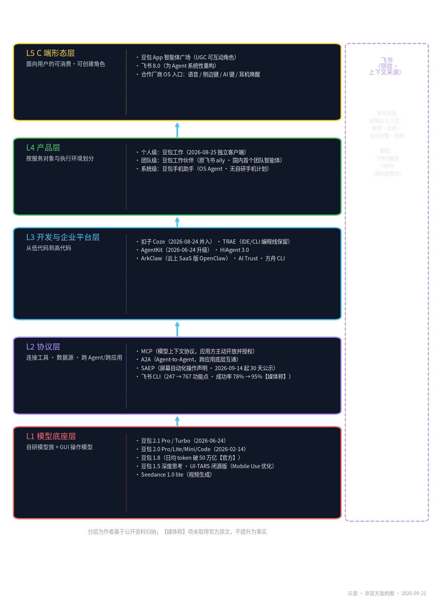

Five layers bottom-up: **L1 model substrate → L2 protocols → L3 development and enterprise platforms → L4 product layer → L5 C-end form**. Inter-layer arrows bottom-up, meaning "lower layer provides capability to upper layer." Feishu side-hung on the right as "work platform/context source," not an independent sixth layer.

### 2.1 L1 Model Substrate Layer: Self-Developed Model Family + GUI Operation Model

L1 is the whole system's capability origin. It is not a single model, but a **model family split by tier and modality**.

| Model / version | Date | Positioning | Three-state |
|---|---|---|---|
| Doubao large model first release (originally Skylark) | 2024-05-15 | ByteDance self-developed multimodal family first release, pro/lite general + voice/text-to-image total 9; Volcano Engine原动力 conference | official |
| Doubao-1.5-pro | 2025-01-22 | Brand new base model, declares not using other models' distillation data | official |
| Doubao 1.5 deep thinking + UI-TARS-1.5 open source | 2025-04-17 | Deep thinking/multimodal reasoning enhanced; UI-TARS-1.5 SOTA on 7 GUI benchmarks; same day pushes OS Agent plan | official/paper |
| Seedance 1.0 lite | 2025-05-13 | Video generation model; same day Doubao 1.5 visual deep thinking | official |
| Doubao 1.8 | 2025-12-18 | Multimodal understanding/generation/Agent capability into global first tier; daily tokens broke 5 trillion | official |
| Doubao 2.0 / Doubao-Seed-2.0 | 2026-02-14 | Pro/Lite/Mini three general Agent models + Code model; 2.0 Pro on Doubao "expert" mode | official |
| Doubao 2.1 Pro / Turbo | 2026-06-24 | Agent model for real-world productivity; Pro connected to pro version, Turbo for free quota experience; API side Turbo price about half Pro | official |
| UI-TARS (open-source version) | 2025-01 (arXiv:2501.12326) | Native GUI Agent, ByteDance Seed × Tsinghua; github.com/bytedance/UI-TARS | official/paper |
| UI-TARS (closed-source version) | 2025-12 (with tech preview) | Doubao phone assistant GUI operation substrate, optimized for Mobile Use, performance better than open-source version | media says |
| UI-TARS 2.0 | date to verify | Points out pure GUI limits, connects external file systems and sandbox platforms via SDK | media says/to verify |

> **API billing reference**: 2.1 Pro input 6 yuan / output 30 yuan per million Tokens; Turbo about half. [spec sheet original value, official not public concurrency/context length details]

### 2.2 L2 Protocol Layer: Connecting Tools, Data Sources, Cross-Agent

L2 solves "how the model connects to the external world." The Doubao system simultaneously took four protocol paths:

| Protocol | Full name / positioning | Role in Doubao system | Three-state |
|---|---|---|---|
| MCP | Model Context Protocol | Phone assistant second-generation integration, for AI connecting tools and data sources; **only integrated under premise application side actively opens MCP service and authorizes** | media says |
| A2A | Agent-to-Agent | Second-generation phone system AI and App built-in agents (Meituan/Alipay etc.) directly interoperate at bottom layer | media says |
| SAEP | Screen Automation Execution Protocol, screen automation operation declaration | **Launched by Doubao, from 2026-09-14 entering 30-day public notice period**; third-party apps autonomously declare allowing/refusing/limiting AI automated operations within this app; during notice period not consented means not operate, after period not refused means default open; with traceable operation logs | media says (protocol launched by Doubao, notice rules per 36Kr/Sohu/Fengmian News) |
| Feishu CLI | Feishu open command line interface (open sourced, MIT, 12 business domains) | From 2026 end-March open to Agents; function points 247 → 767; call success rate 78% → 95%; call speed overall +39% | media says (Xie Xin 2026-09-15 speech) |

> **SAEP's uniqueness**: while MCP/A2A both solve "how Agents connect," SAEP first wrote "what application side allows Agents to do on its interface" into a **declarative boundary protocol**. This is Doubao's first creation at the protocol layer, but the 30-day notice period not yet ended, third-party apps' actual integration rate and disputes still to observe.

### 2.3 L3 Development and Enterprise Platform Layer: From Low Code to High Code

L3 is the "Agent-making factory." It covers from low-code orchestration to high-code development, from C-end publishing to enterprise privatization full spectrum.

| Product | Positioning | Version / date | Three-state |
|---|---|---|---|
| Coze | Agent orchestration (low code), after orchestration publishable to Doubao/API | From 2026-08-24 overall merged into Doubao system | official/media |
| TRAE | Programming IDE / CLI / Work; TRAE Work, Coze and Doubao office capability integrated, **TRAE IDE/CLI retained as programming product line** | 2026-08-24 merged | official/media (ByteDance response confirmed) |
| AgentKit | Enterprise Agent development platform | 2026-06-24 upgraded | official |
| HiAgent 3.0 | Enterprise Agent platform | 2026-06-24 | official |
| ArkClaw | Cloud SaaS OpenClaw, out-of-box, 7×24, dedicated ECS; with Volcano Coding Plan Pro | 2026-03-09 launched (encyclopedia caliber; Volcano official version records first Ark-26.3.30 / 03-31) | official (existence) / media says (3-09 date) |
| AI Trust | Enterprise Agent security system | 2026-06-24 released together with ArkClaw enterprise workbench | official |
| Ark CLI | Volcano Ark command line access | 2026-06-24 released | official |

### 2.4 L4 Product Layer: Divided by Service Object and Execution Environment

L4 is the "Agent productization" layer—the same L1 model substrate encapsulated into three products facing different users, running in different execution environments.

| Product | Level positioning | Key facts | Three-state |
|---|---|---|---|
| Doubao Work | Personal level (personal productivity Agent) | 2026-08-25 formally released independent client; local+cloud PC dual mode, Windows virtual desktop, phone remote controlling computer; skill center over 200 skills/connectors; browser cross-software operation; delivers docs/sheets/PPT/webpages/images/videos; Doubao App / Doubao Work App / Feishu three entries data interoperable | official |
| Doubao Work Companion | Team level (team Agent) | **Domestic first team Agent**, originally Feishu aily renamed/upgraded; independent identity/permissions/memory, enterprise unified configuration; Feishu CLI 767 function points; team long-term memory "one person teaches, whole team can use" | official statement |
| Doubao phone assistant | System level (OS Agent) | Cooperates with phone vendors at OS layer; **ByteDance explicitly no self-developed phone plan**; UI-TARS closed-source substrate; system-level screenshot+event injection; sensitive operations (publish/delete/pay/logout) need human review or secondary confirmation | official statement |

> **Work Companion rename date correction**: Feishu aily official help center states "**from 2026 August 14, Feishu aily renamed 'Doubao Work Companion'**," from 2026-09-01 adds "proactive work" and bills; **2026-09-15** Feishu Future Infinite conference publicly released. Spec sheet records 2026-09-15 as release date, this paper records both dates.

> **Terminal pricing (public report caliber)**: Doubao pro version three tiers **68 / 200 / 500 yuan/month** (standard 68 connects 2.1 Pro, enhanced 200 = standard 4× quota, premium 500 = standard 10× quota; standard quota over 5× free version). First-generation nubia M153 **3499 yuan, stocked 30,000, first batch sold out**; second-generation Nubia NaviX Ultra **12GB+512GB official price 5999 yuan, after national subsidy 5499 starting**.

### 2.5 L5 C-End Form Layer: Consumable/Creatable Roles Facing Users

L5 is the layer users genuinely "see."

| Form | Positioning | Three-state |
|---|---|---|
| Doubao App "Agent" plaza | UGC interactive roles, creatable and consumable; public/private visibility | media says |
| Feishu 8.0 | Systematically reconstructed for Agents, fully opens data and tools to Agents; in group chats search name to pull Agent into group | official (press conference) |
| Partner vendor OS entry | System layer; voice/side key/dedicated AI key/headset wake | official/media |

### 2.6 Feishu Side-Hung Positioning (Separately Explained)

Feishu in this five-layer chart not the sixth layer, but **side-hung context source**: Doubao Work logs in via Feishu account, inheriting enterprise knowledge and work context within **permission scope** (group chat records, docs, meeting minutes, schedules), created content sediments back to Feishu; Doubao Work Companion natively runs within Feishu.

> Feishu CEO Xie Xin says "Feishu no longer only serves people, must also start serving Agents"—[media says / press conference retelling], not written official document original.

### 2.7 AI Cloud-Native Architecture

L3 enterprise platform's bottom is the "AI cloud-native architecture": GPU as core compute unit, models exposed as services to upper layers; Ark CLI, AgentKit, HiAgent 3.0, ArkClaw all run above this layer. This layer's specific GPU specs, single-machine concurrency, cold-start latency etc. engineering parameters, official not public details.

**Chapter summary**: the five-layer architecture not marketing talk, but the real dependency chain "lower layer provides capability to upper layer"—L1 produces models, L2 produces interfaces, L3 produces tools, L4 produces products, L5 produces user touchpoints; Feishu side-hung as "in-permission context," not an independent sixth layer.

---

## 3 Concept Relationships: Three-Word Distinction, Nested Containment and Autonomy Ladder (Deliverable ②)

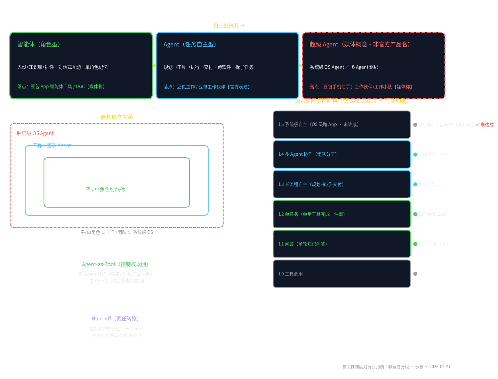

### 3.1 Three-Word Distinction: Intelligent Agent / Agent / Super Agent

Chinese tech circles in 2025–2026 used the three words almost as synonyms, but in the Doubao system they have clear tier differences:

1. **Intelligent agent (role type)**: persona+knowledge base+plugins, conversational interaction, single-role memory. Landing Doubao App Agent plaza/UGC [media says].
2. **Agent (task autonomous type)**: planning→tools→execution→delivery, cross-software, can split subtasks. Landing Doubao Work / Doubao Work Companion [official statement].
3. **Super Agent**: **not official product name**, media/industry umbrella term for "system-level OS Agent or multi-Agent organization." On the Doubao system corresponding to Doubao phone assistant, and Work Companion/work squad [media says].

> **This must be emphasized**: "super intelligent agent/super Agent" in Doubao official materials never appeared as a product name. This paper follows the "media concept" label, not writing it as Doubao's official product line.

### 3.2 Nested Containment Relationship

The three words not parallel, but **nested containment**:

```
sub/single-role intelligent agent  ⊂  work/team Agent  ⊂  system-level OS Agent
```

That is: one work Agent internally can contain multiple sub-Agents working in parallel; one OS Agent can simultaneously orchestrate multiple work/team Agents.

### 3.3 L0–L5 Autonomy Ladder (modeled on SAE J3016)

Borrowing autonomous driving SAE J3016's idea, dividing Agent autonomy also into six levels, marking Doubao each form's current tier:

| Level | Meaning | Doubao form landing |
|---|---|---|
| L0 tool call | Call a tool once, return result | — |
| L1 Q&A | Single-round knowledge Q&A | UGC plaza L1–L2 |
| L2 single task | Single-step tools complete one thing | Coze orchestration L2–L3 |
| L3 long-process autonomous | Planning-execution-delivery | Doubao Work L3 |
| L4 multi-Agent collaboration | Team formation division | Work Companion L3–L4 |
| L5 system-level autonomous | OS-level cross-App · not achieved | Phone assistant · target L5 (current tech preview) |

> **L5 not achieved**: Doubao phone assistant in official caliber still "tech preview," second generation the consumer version; cross-App free operation reliability, long-tail App compatibility, user trust in "what AI clicked itself," all still climbing. This paper not writing it as "L5 achieved."

### 3.4 Agent-as-Tool vs Handoff: Two Multi-Agent Collaboration Modes

These two concepts often conflated in Chinese materials, but engineering-wise two things:

- **Agent-as-Tool (control returns)**: main Agent dispatches one subtask to a sub-Agent (e.g. "collect," "analyze," "aggregate" three routes parallel), sub-Agent finishes returning result, **control always in main Agent's hands**, main Agent aggregates then decides next step. Doubao Work's "work squad" mainly this mode.
- **Handoff (responsibility transfer)**: control whole baton handed to next owner, must pass `validate` to change owner. UDOS side's TransferBundle six fields (Goal/Context/Done/Todo/Trace/Owner) + scope field designed for this mode (see lower paper comparison).

**Chapter summary**: intelligent agent/Agent/super Agent not synonyms, but autonomy tiers; nested containment+L0–L5 ladder can place Doubao six forms on one chart; Agent-as-Tool and Handoff are two essentially different multi-Agent collaboration contracts.

---

## 4 Six Forms × Nine Dimensions Matrix (Deliverable ③)

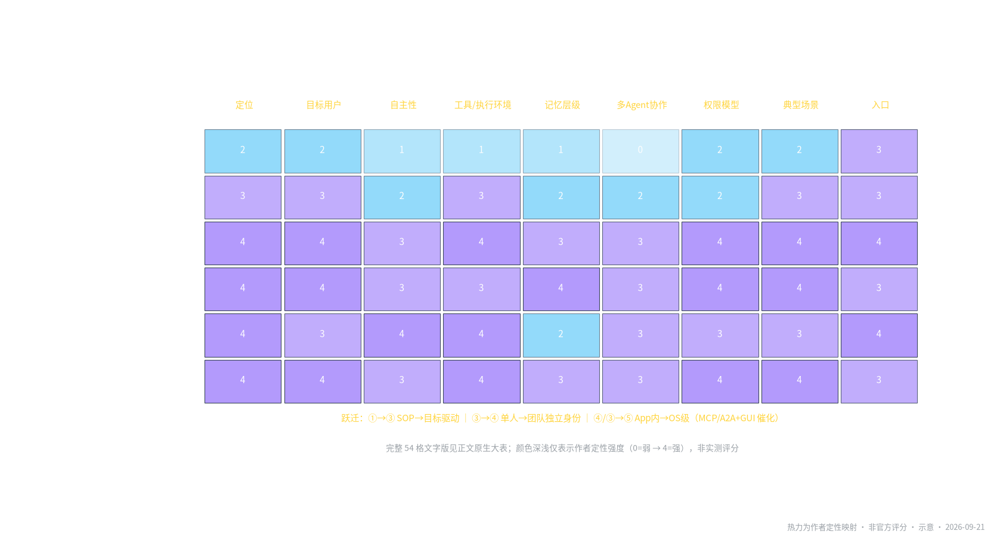

Splitting the Doubao system's six externally usable forms along nine dimensions, obtaining the below 6×9=54-cell native master table. This table is the index for later SOP selection and PRD templates.

| Form | Positioning | Target users | Autonomy | Tools and execution environment | Memory tier | Multi-Agent collaboration | Permission model | Typical scenarios | Entry |
|---|---|---|---|---|---|---|---|---|---|
| ① C-end UGC intelligent agent (plaza) | Interactive role/Agent plaza, creatable and consumable | General C-end users, UGC creators | L1–L2 | Name/avatar/persona/opening/voice/knowledge base/visibility; plugins and workflows published after Coze orchestration (config items to verify) | Single-role conversation memory | Itself single-role; multi-Agent orchestrated on Coze side | Creator self-sets visibility; plaza publishing must meet platform rules | Role play, emotional companionship, knowledge Q&A, skill dialogue | Doubao App "Agent" entry |
| ② Coze orchestrated Agent | Developer-facing Agent building/orchestration platform | Developers, app builders | L2–L3 | Persona/plugins/workflows/knowledge base/multi-Agent mode; database/cards/variables/triggers (part to verify) | Knowledge base+variables | Multi-Agent mode orchestration | Authorized per publishing channel; API independently callable | Building Agents publishable to Doubao, enterprise internal Agents | Coze orchestrated then published (Doubao/API etc.) |
| ③ Doubao Work | Doubao's brand new Agent product and brand for productivity scenarios | Personal knowledge workers, professional office people | L3 | Local+cloud PC dual mode; Windows virtual desktop, phone remote controlling computer; skill center 200+, connectors (DingTalk/Tianyancha etc. API Key authorization); browser cross-software operation; delivers docs/sheets/PPT/webpages/images/videos | Feishu account inherits enterprise knowledge and work context, creation sediments back to Feishu | Multi-specialty Agents form "work squad"; single task automatically splits multi-route sub-Agents parallel | Strictly inherits Feishu permission system; personal/enterprise data isolation; device access, quota control, encryption, audit full-chain protection | Writing proposals/minutes/reports/research, sheet analysis, cross-software operations, long/scheduled tasks | Doubao App / Doubao Work App / Feishu three entries interoperable |
| ④ Doubao Work Companion | Domestic first team Agent, originally Feishu aily renamed/upgraded | Enterprise/team all members, admin unified configuration | L3–L4 | Within Feishu writing docs/bitable/schedules/meetings/approvals; Feishu CLI opens 767 function points | Team long-term memory (group chat history+business docs), one person teaches whole team can use | Can connect third-party/self-built/professional Agent teams (details to verify) | Independent identity/permissions/memory; enterprise unified configuration capability and usage; follows Feishu identity system | Group message organization, meeting minutes, cross-group sync, approval/schedule/doc collaboration, team knowledge Q&A | Feishu App/desktop; admin creates and pulls into group (directed co-creation stage) |
| ⑤ Doubao phone assistant | AI assistant cooperating with phone vendors at OS layer; no self-developed phone plan | Smartphone users (partner vendor terminals) | L5 | UI-TARS closed-source substrate; system-level screenshot+event injection; MCP/A2A/SAEP; cross-App click/swipe | Optional memory, behavior personalization under user authorization | A2A interoperates with Meituan/Alipay etc. App built-in agents at bottom layer | System-level preinstalled app-level permissions; sensitive operations (publish/delete/logout/pay) need human review or secondary confirmation | Price compare and order, send messages, collect energy, ask about any screen content | Partner vendor system layer; voice/side key/dedicated AI key/headset wake |
| ⑥ Enterprise platform (AgentKit etc.) | Enterprise-facing Agent infrastructure and platforms, covering model to application full chain | Enterprise customers, enterprise developers | Per application defined | AgentKit/HiAgent 3.0/ArkClaw/AI Trust/Ark CLI; AI cloud-native architecture (GPU core) | Enterprise self-built knowledge base and data | Platform-level Agent orchestration | Enterprise tenant-level control; AI Trust security system | Intelligent customer service, sales analysis, R&D assistance, industry Agent showcase rooms | Volcano Ark/enterprise platform access |

### 4.1 Three Leaps Between Forms

The spec sheet归纳 form evolution as three leaps (**not official explicit text**, author reverse-inferred from product release timeline):

- **① → ③ from UGC to goal-driven**: UGC plaza's intelligent agent a "persona+plugins" conversation role; Doubao Work leaps to "planning→tools→execution→delivery" long-process autonomous Agent, can itself write proposals, do research, cross-software operate.
- **③ → ④ from single person to team independent identity**: Doubao Work borrows user's personal Feishu permissions; Work Companion has its own independent identity/permissions/memory, all members share one "team memory," "one person teaches whole team can use."
- **④/③ → ⑤ from in-App to OS-level**: Work Companion and Work still run in Apps; phone assistant leaps to OS-level cross-App operation, MCP/A2A + GUI event injection this leap's technical catalyst.
- **② → ① development to consumption pipeline**: Coze orchestrated Agents published to Doubao plaza, a "developer→C-end user" distribution pipeline.

**Chapter summary**: six forms not six parallel products, but six tiers on the same autonomy ladder; three leaps catalyzed respectively by SOP capability, team identity, OS-level GUI three things.

---

## 5 Production SOP: Eight Stages × Four Roles Swimlane (Deliverable ④)

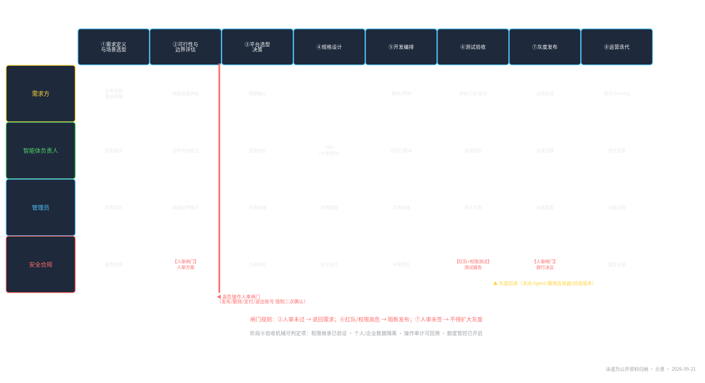

The SOP solves: **an enterprise genuinely wanting to deploy an Agent for its team, starting from which step, who signs, at which step must stop and wait human review?** The spec sheet splits this process into eight stages, four roles, four explicit gates.

### 5.1 Four Roles and Eight Stages

**Four roles**: requester / Agent owner / admin / security compliance.
**Eight stages**: ① requirement definition and scenario selection → ② feasibility and boundary assessment → ③ platform selection decision → ④ specification design → ⑤ development orchestration → ⑥ testing acceptance → ⑦ canary release → ⑧ operations iteration.

### 5.2 Per-Stage Input/Action/Output/Checklist

| Stage | Input | Key actions | Output | Checklist / gate | Responsible role |
|---|---|---|---|---|---|
| 1 Requirement definition and scenario selection | Business requirements, target users, expected effects | Judge task complexity, GUI needed, team collaboration, cost constraints; select among six forms | Scenario selection conclusion, user stories, requirement draft | Long-process autonomous? Cross-software? Team sharing needed? Sensitive operations involved? | Requester + Agent owner |
| 2 Feasibility and boundary assessment | Scenario selection conclusion | Assess tool/connector availability, data permission scope, compliance risk, model and quota cost | Feasibility report, boundary statement (what to do/not do), risk acceptance statement | Data within permission scope? Sensitive operation list complete? Model and quota suffice? | Agent owner + security compliance |
| 3 Platform selection decision | Feasibility report, decision tree | Per decision tree select: Doubao App/Coze/Doubao Work/Work Companion/AgentKit | Platform selection decision table, budget confirmation | Zero code or high code? Enterprise API integration needed? Independent identity and all-member sharing needed? | Agent owner + admin |
| 4 Specification design | Selection conclusion, PRD template | Per middle paper ten component field tables fill specifications item by item | One-page Agent PRD | Ten component categories all filled? Values evidence-grounded? To-verify items marked? | Agent owner |
| 5 Development orchestration | PRD specification | Configure persona/prompts/tools/workflows/knowledge base/memory/permissions | Runnable Agent version | Tool authorization complete? Knowledge base mounted? Permissions minimized? | Agent owner + admin |
| 6 Testing acceptance | Runnable version | Functional/boundary/**red-team adversarial**/permission tests | Test report, acceptance conclusion, acceptance signature | [human review gate] sensitive operations mandatory human review/secondary confirmation? [red team] privilege escalation/prompt injection/inducement operations pass? [permission tests] "if employees cannot see, Agents cannot obtain" verified? | Agent owner + security compliance |
| 7 Canary release | Accepted version | Small-scope directed co-creation/canary, monitor quota, error rate, anomalies | Canary observation records, canary daily report, release decision | Canary scope controllable? Anomaly rollback ready? Quota capped? Human review gate unsigned cannot expand canary | Admin + Agent owner |
| 8 Operations iteration | Canary/full run data | Feedback closed loop, optimize prompts/tools/knowledge base, update memory strategy | Iteration versions, operations review, review records | Feedback closed loop? Model upgrade regression tests? To-verify items against official originals? | Agent owner + requester |

### 5.3 Four Explicit Gates (Must Draw on Swimlane Chart)

1. **High-risk operation human review gate**: publish/delete content, logout, pay etc. high-risk operations mandatory human takeover or secondary confirmation; stage ② human review gate not passed returns requirement, stage ⑦ human review gate unsigned cannot expand canary.
2. **Red-team adversarial testing**: privilege escalation, prompt injection, high-risk operation inducement; stage ⑥ red team high-risk items block release.
3. **Permission test checkpoint**: verify "**what employees cannot see, Agents cannot obtain**"; cross-tenant/cross-group/over-scope access cases all green.
4. **Canary rollback**: canary list/switches ready, observation period and on-duty person clear; rollback = close Agent / remove connectors / retreat version.

### 5.4 Stage ⑥ Acceptance Mechanically Decidable Items

Not relying on human feeling, four items writable as assertions:

- Permission inheritance verified (if employees cannot see, Agents cannot obtain);
- Personal/enterprise data isolation configured;
- Operation audit connected and traceable;
- Quota control enabled.

### 5.5 One-Page PRD Template

| Field | Fill requirement |
|---|---|
| Name | External name / internal code |
| Positioning and target users | One sentence clearly for whom solving what problem |
| Selected form | Choose one of six forms (UGC/Coze/Doubao Work/Work Companion/phone assistant/enterprise platform) |
| Model and mode | Base model + run mode + reasoning mode |
| System prompt key points | Role, boundaries, prohibitions, output format |
| Tools and connectors and authorization | Which plugins/connectors, who provides API Key |
| Workflows and knowledge base | Multi-step orchestration nodes; which docs mounted |
| Memory strategy | Conversation memory / team long-term memory / behavior personalization / forgetting strategy |
| Multi-Agent collaboration | Single Agent / work squad / A2A interoperation |
| Permissions and high-risk operation list | Permission inheritance, human review/secondary confirmation items, enterprise unified configuration |
| Observable metrics | Operation audit, quota, success rate, red team results |
| Acceptance criteria | Stage ⑥ four mechanically decidable items + business cases |
| Canary plan and rollback | Canary scope, observation period, rollback operations |
| To-verify items | Which fields official not public, need follow-up |

**Chapter summary**: the SOP's core not "eight-step process," but four gates—human review, red team, permission tests, canary rollback—separating the risk between "AI autonomous" and "humans not fallback"; stage ⑥'s four mechanically decidable items make acceptance not rely on gut.

---

## 6 Ten Component Field Specifications (Deliverable ⑤)

These ten tables from the spec sheet middle paper, the complete list of "which fields configuring one Agent must fill." **Fields only added not deleted, "to verify" retained as-is**.

### 6.1 Component One: Identity and Persona

| Field name | Description | Required | Values or examples | Configuration platform |
|---|---|---|---|---|
| Name | External display name | yes | e.g. "industry research assistant," "announcement interpretation assistant" | App Agent / Coze |
| Avatar | Role visual identifier | no | Upload image | App Agent / Coze |
| Persona and role setting | Identity, tone, behavior rules | yes | "You are a rigorous financial report analyst, only answer based on given materials" | Coze / Doubao Work |
| Opening line | First conversation guidance | no | "I can help you interpret listed company announcements" | App Agent (to verify) |
| Voice | Voice broadcast timbre | no | Timbre selection (plaza config items to verify) | App Agent |
| Visibility | Public/team/private/specified scope | yes | Public plaza / private / specified scope | App Agent / Coze / Work Companion |
| Independent identity (team level) | Independent Agent identity区别于 "borrowing user permissions" | Team level required | Doubao Work Companion independent identity | Work Companion (Feishu admin configuration) |

### 6.2 Component Two: Model and Mode Selection

| Field name | Description | Required | Values or examples | Configuration platform |
|---|---|---|---|---|
| Model version | Selected base model | yes | Doubao 2.1 Pro / 2.1 Turbo / 2.0 (Pro/Lite/Mini) /1.5 deep thinking | Doubao Work / Coze / AgentKit |
| Run mode | Interaction / task mode | yes | Expert mode / office task (Turbo) / conversation | Doubao Work |
| Reasoning mode | Deep thinking or not | no | Deep thinking for complex reasoning | Doubao Work / Coze |
| Subscription tier | Pro version ladder | no | Standard 68 / enhanced 200 / premium 500 yuan/month (standard quota over 5× free; enhanced=standard 4×, premium=standard 10×) | Doubao Work (C-end subscription) |
| API unit price | Enterprise call billing | no | 2.1 Pro input 6 yuan / output 30 yuan per million Tokens; Turbo about half | AgentKit / Ark |
| GUI substrate | Selected when needing to operate system interfaces | as needed | UI-TARS closed-source version (Mobile Use optimized) | Phone assistant (vendor integration) |
| Context length/concurrency/quota | Long context and concurrency cap | no | Official not public details | — |

### 6.3 Component Three: System Instructions · Prompts

| Field name | Description | Required | Values or examples | Configuration platform |
|---|---|---|---|---|
| Role setting/system prompt | Identity and professional boundaries | yes | Containing goals, boundaries, prohibitions, output format | Coze / Doubao Work / AgentKit |
| Behavior rules | Must/must not do what | yes | State uncertainty, not fabricate numbers; not exceed user permission scope | Coze / Doubao Work |
| Tone style | Formal/affable/professional | no | Restrained, objective, point-wise output | Coze |
| Refusal and security boundaries | Sensitive/over-privilege problem handling | yes | Sensitive operations to human review | Work Companion / AgentKit |
| Output format | Structured delivery requirements | no | Docs/sheets/PPT/webpages, support "point where change where" | Doubao Work |
| Custom skills (prompt derived) | Conversation-generated or uploaded skills | no | Performance analysis, financial reports, de-AI-flavor etc. | Doubao Work (skill center) |

### 6.4 Component Four: Tools and Connectors

| Field name | Description | Required | Values or examples | Configuration platform |
|---|---|---|---|---|
| Plugins | Extending tool call capability | no | Search, code, image, calculator etc. | Coze (Plugin) |
| Connectors | Connect external apps, need API Key authorization | as needed | DingTalk, Tianyancha etc.; user provides Key authorization | Doubao Work (connectors) |
| Browser/cross-software operation | Web and local software operation | as needed | Fill forms, compare materials, use professional software to process data | Doubao Work |
| Execution environment | Runtime environment selection | yes | Local computer / cloud PC / Windows virtual desktop / phone remote | Doubao Work |
| MCP tool integration | Application-side opened MCP services | as needed | Only under premise application side actively opens and authorizes | Phone assistant (second generation) |
| Skill/connector scale | Listed quantity reference | reference | As of 2026-08-21 over 200 | Doubao Work |
| Tool governance/authorization method | Review/billing/interface specs | no/required | Official not public details; minimal authorization per tool requirements | — / AgentKit |

### 6.5 Component Five: Workflows and Skills

| Field name | Description | Required | Values or examples | Configuration platform |
|---|---|---|---|---|
| Workflow | Multi-step task orchestration | as needed | Collect→analyze→aggregate report (nodes串联) | Coze (Workflow) / Doubao Work |
| Built-in skills | Skill center prebuilt capabilities | no | PPT, financial reports, announcement interpretation, short drama creation, ecommerce selection, medical literature search, code review etc. (200+) | Doubao Work (skill center) |
| Custom skills | Upload or conversation-generated skills | no | Customized per team scenarios | Doubao Work |
| Triggers | Scheduled/event triggered | no | Daily stock sentiment briefing; scheduled group message organization (official mechanism to verify) | Coze / Work Companion |
| Variables/cards | Runtime parameters and interaction cards | no | Variable passing / card interaction (official mechanism to verify) | Coze |

### 6.6 Component Six: Knowledge Base and Data

| Field name | Description | Required | Values or examples | Configuration platform |
|---|---|---|---|---|
| Knowledge base | Connect docs as knowledge sources | as needed | Enterprise/personal doc upload and retrieval | Coze / Doubao Work / Work Companion |
| Database | Structured data read/write | no | Structured storage (official mechanism to verify) | Coze |
| Feishu enterprise knowledge inheritance | In-permission-scope context | Team level | Group chat records, docs, meeting minutes, schedules; creation sediments back to Feishu | Doubao Work / Work Companion |
| Data isolation | Personal and enterprise data boundary | yes | Personal data and enterprise data isolated (official caliber) | Doubao Work |
| Data retention strategy | Cloud PC/session data retention | no | Official not public details | — |

### 6.7 Component Seven: Memory

| Field name | Description | Required | Values or examples | Configuration platform |
|---|---|---|---|---|
| Conversation memory | Single-role/single-session context | yes | Single-role conversation memory | App Agent |
| Team long-term memory | Team-level sediment | Team level | Group chat history + business docs; one person teaches whole team can use | Work Companion / Doubao Work |
| Behavior personalization memory | Common behavior under authorization | no | Personalized through common behavior under user authorization | Phone assistant |
| Memory cleanup/forgetting strategy | Forgetting/clearing policy | no | Enterprise control | Work Companion / AgentKit |
| Cross-Agent long-term memory | Shared memory across multiple Agents | no | Not C-end UGC main capability | — |

### 6.8 Component Eight: Task Planning and Multi-Agent Collaboration

| Field name | Description | Required | Values or examples | Configuration platform |
|---|---|---|---|---|
| Task decomposition | Autonomously decompose per goal | Long process required | Data collect/analyze/aggregate three-route parallel sub-Agents | Doubao Work |
| Work squad | Multi-specialty Agent division | as needed | Multiple specialty Agents team formation collaboration | Doubao Work |
| Team formation/multi-Agent mode | Connect external/self-built Agents | as needed | Research-output-check, main Agent aggregation (official explicit text to verify) | Coze / Work Companion |
| A2A interoperation | Cross-application Agent bottom-layer interoperation | as needed | Interoperate with Meituan/Alipay etc. App built-in agents | Phone assistant (second generation) |
| Long-time running | Long process/scheduled tasks | no | Cloud PC long-time running; scheduled long-term tasks | Doubao Work |

### 6.9 Component Nine: Permissions · Security · Compliance

| Field name | Description | Required | Values or examples | Configuration platform |
|---|---|---|---|---|
| Permission inheritance | Follow existing identity system | yes | Strictly inherits Feishu permissions; content employees cannot see Agents cannot obtain | Doubao Work / Work Companion |
| Device and access control | End-to-end protection | yes | Device access, permission settings, quota control, data encryption, operation audit | Doubao Work (official caliber) |
| Human review/secondary confirmation gate | High-risk operation human takeover | High risk required | Publish/delete content, logout, pay etc. need human takeover or secondary confirmation | Phone assistant / all forms |
| Enterprise unified configuration | Team-level capability and usage | Team level required | Admin unified configuration permissions, capability, usage | Work Companion |
| Independent identity | Team Agent independent identity | optional | Enterprise unified configuration independent identity/permissions/memory | Work Companion |
| Security product system | Enterprise Agent security | Enterprise level | AI Trust enterprise Agent security system | AgentKit / ArkClaw |
| Qualifications and white papers | Compliance certification | no | Domestic first batch office Agent capability and cloud benchmark dual certification; AI privacy and security white paper | Doubao Work / phone assistant |
| SAEP declaration | Third-party app operation boundaries | System level | App autonomously declares allowing/refusing/limiting AI automated operations (30-day notice) | Phone assistant (ecosystem side) |

### 6.10 Component Ten: Observability and Evaluation

| Field name | Description | Required | Values or examples | Configuration platform |
|---|---|---|---|---|
| Operation audit | Full-chain operation trace | Enterprise level required | Operation audit (field details to verify) | Work Companion / AgentKit |
| Quota control | Usage and quotas | yes | Quota control; pro version per tier multiples | Doubao Work / AgentKit |
| Call success rate | Tool/interface stability | no | Feishu CLI call success rate 78% → 95% | Feishu CLI (baseline) / Work Companion |
| Red-team adversarial testing | Pre-launch adversarial evaluation | High risk required | Privilege escalation/injection/high-risk operation inducement tests | AgentKit / self-built |
| Permission tests | Over-privilege access verification | Enterprise level required | Verify "if employees cannot see, Agents cannot obtain" | Work Companion / AgentKit |
| Canary strategy | Release scope | optional | Directed co-creation/small-scope canary (Work Companion as of 2026-09-18 still in directed co-creation stage) | Work Companion / AgentKit |

### 6.11 Model and Mode Selection Decision Tree

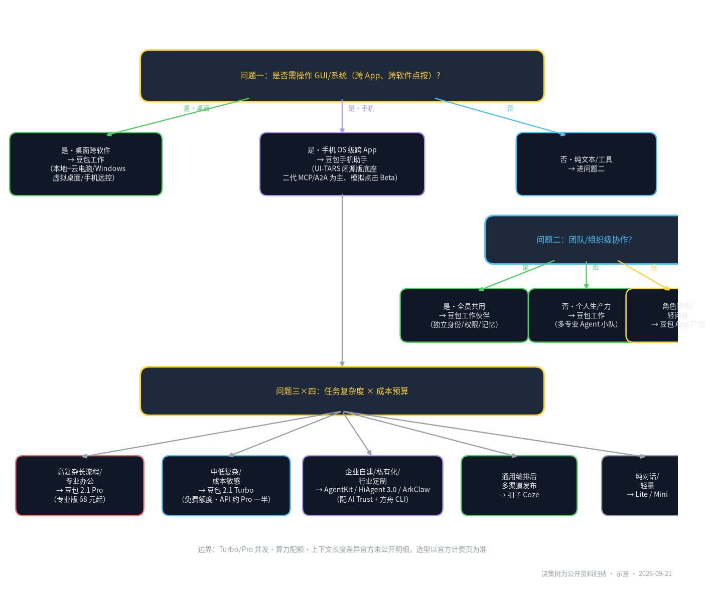

Decision tree four questions:

1. **Need to operate GUI/system?** Cross-desktop/software → Doubao Work; phone OS-level cross-App → Doubao phone assistant; pure text/tools → to question two.
2. **Team/organization-level collaboration?** All members share → Doubao Work Companion; personal productivity → Doubao Work; role companionship/light Q&A → Doubao App Agent plaza.
3. **Task complexity × cost**: high complexity long process professional office → 2.1 Pro (68 yuan starting); medium-low complexity/cost sensitive → 2.1 Turbo (free quota, API about half Pro); enterprise self-built/privatization/industry customization → AgentKit/HiAgent 3.0/ArkClaw; general orchestration multi-channel publishing → Coze; pure conversation/lightweight → Lite/Mini.

> **Boundary note**: Turbo/Pro concurrency, compute quota, context length differences official not public details, selection per official billing page.

**Chapter summary**: ten component categories ≈ one Agent's "configuration surface"; filling these ten tables, the one-page PRD written; decision tree four questions make "which product/which model" from gut to askable-answerable.

---

## 7 Tech Stack Timeline and UI-TARS End-to-End Principle

### 7.1 Tech Stack Version Timeline (2024-05 to 2026-09)

| Date | Event | Three-state |
|---|---|---|
| 2024-05-15 | Doubao large model (Skylark) first release, 9 models | official |
| 2025-01-22 | Doubao-1.5-pro released; UI-TARS paper arXiv:2501.12326 submitted | official/paper |
| 2025-04-17 | Doubao 1.5 deep thinking + UI-TARS-1.5 open source; OS Agent plan released | official |
| 2025-05-13 | Seedance 1.0 lite video generation | official |
| 2025-12-01 | First-generation nubia M153 sale, 3499 yuan, stocked 30,000 first batch sold out | official/media |
| 2025-12-18 | Doubao 1.8 released, daily tokens broke 5 trillion | official |
| 2026-02-14 | Doubao 2.0 (Pro/Lite/Mini/Code) released | official |
| 2026-03-09 | ArkClaw cloud SaaS OpenClaw launched (encyclopedia caliber) | official/media |
| 2026-06-24 | Doubao 2.1 Pro/Turbo + AgentKit upgrade + HiAgent 3.0 + AI Trust + Ark CLI; Doubao pro version online (68/200/500) | official |
| 2026-07-30 | Feishu product team+Doubao product team merged into new Doubao product team (Zhao Qi responsible) | official/media |
| 2026-08-14 | Feishu aily renamed Doubao Work Companion (official help center) | official |
| 2026-08-21 | Doubao Work skill center listed over 200 skills and connectors | official/media |
| 2026-08-24 | Coze, TRAE Work overall merged into Doubao system; TRAE IDE/CLI retained programming line | official response/media says |
| 2026-08-25 | Doubao Work independent client formally released | official |
| 2026-09-01 | Doubao Work Companion adds "proactive work" and bills | official |
| 2026-09-14 | Doubao phone assistant consumer version released; SAEP enters 30-day notice period | media says (Doubao launched) |
| 2026-09-15 | Feishu Future Infinite conference: Work Companion publicly released, Feishu 8.0 released, Xie Xin "Feishu also serves Agents" | official/press conference retelling |

### 7.2 UI-TARS GUI Agent End-to-End Principle

UI-TARS is Doubao phone assistant's GUI operation substrate. Its end-to-end closed loop five steps:

1. **Screenshot perception**: system-level screenshot obtains current screen pixels;
2. **Reasoning decomposition**: model splits "help me order a coffee on Meituan" into "open Meituan→search coffee shop→select item→order→pay";
3. **Element localization**: on screenshot localize element coordinates to click/swipe;
4. **Event injection**: via Android `WindowManagerService` / `inject_events` inject click/swipe events;
5. **Reflective correction**: after operation screenshot again, judge whether expected interface reached, if not retry.

> **Key boundary**: `inject_events` type system-level event injection capability **only open to vendor preinstalled apps**—also why Doubao explicitly "no self-developed phone plan," choosing to cooperate with Nubia etc. vendors at OS layer. Ordinary third-party Apps cannot obtain this permission, also the problem SAEP declarative boundaries solve: application side itself declares which operations allowed, which refused.
>
> **UI-TARS 2.0 direction** (media says/to verify): points out pure GUI screenshot perception limits (slow, fragile, unstable), starts connecting external file systems and sandbox platforms via SDK, taking "half GUI half API" route.

**Chapter summary**: in the two-plus year timeline, Doubao went from "producing models" to "producing OS Agents"; UI-TARS's five-step closed loop is the GUI Agent general paradigm, but system-level event injection permission boundaries determine it must take vendor cooperation route, not make its own phone.

---

## 8 Glossary

| Term | This paper's usage |
|---|---|
| Intelligent agent (Agent) | Doubao official uniformly uses "Agent"; Chinese "intelligent agent" its translation |
| Super Agent | **Not official product name**, media umbrella for "system-level OS Agent / multi-Agent organization" |
| OS Agent | Operating system-level AI assistant, can cross-App screenshot+inject events |
| MCP | Model Context Protocol |
| A2A | Agent-to-Agent |
| SAEP | Screen Automation Execution Protocol (launched by Doubao) |
| UGC | User-generated content, here Doubao App Agent plaza user-built agents |
| RAG | Retrieval-augmented generation, knowledge base mounting general practice |
| Human review gate | High-risk operations mandatory human takeover or secondary confirmation |
| Red team tests | Actively attack tested Agent with privilege escalation/prompt injection/inducement |
| Agent-as-Tool | Sub-Agent finishes work returning control to main Agent |
| Handoff | Responsibility whole baton transferred to next owner, validate passed to change |
| Three states | [official statement][media says][to verify] evidence grading |

---

## 9 Failure Boundaries and Falsifiability

### 9.1 This Paper's Failure Boundaries

1. **Timestamp**: this paper based on public materials as of 2026-09-21. The Doubao system iterates fast monthly (2026-06-24, 07-30, 08-24, 08-25, 09-14, 09-15 all big nodes), this paper's conclusions may stale after 1–2 months.
2. **Three states not upgraded**: all numbers and dates marked [media says][to verify], this paper not writing them as official facts; spec sheet self-listed 14 "to verify" retained as-is (including "super Agent" product name, Turbo/Pro concurrency and context length, skill governance details, cloud PC specs and data retention, Work Companion multi-Agent division mechanism, permission model details, UI-TARS 2.0 date, Tan-Dai dichotomy original words, Coze merge original URL, Volcano Engine docs, Ark annual Token call volume, UGC plaza config items, Coze complete component matrix, Work Companion full timeline).
3. **Not constituting procurement advice**: this paper only technical anatomy, not recommending anyone's commercial decisions.
4. **Qualitative judgments overturnable**: Figure 3 heat matrix, Figure 2 autonomy landings, inter-form leap descriptions, all author's qualitative induction based on public materials, not official scores, not measured.

### 9.2 Five Falsifiable Predictions

1. **If Doubao in 2026 Q4 releases Work Companion multi-Agent division white paper** (explicitly writing how "research-output-check" splits, how main Agent aggregates), then this paper Section 6.8 "official explicit text to verify" should upgrade to [official statement].
2. **If Doubao publicly releases Turbo/Pro concurrency and context length**, then this paper Section 6.2 "official not public details" should be replaced with specific numbers.
3. **If after SAEP 30-day notice period ends, head Apps (Meituan/Alipay/WeChat) publicly declare integrating or refusing SAEP**, then this paper Section 2.2 "actual integration rate to observe" should update to fact.
4. **If Doubao phone assistant in some 2027 release removes the "tech preview" label, publishes cross-App task success rate**, then this paper Figure 2 "L5 not achieved" should reassess.
5. **If Volcano Engine publicly releases ArkClaw 3-09 launch official version records** (currently first version Ark-26.3.30/03-31), then this paper ArkClaw date three-state should upgrade from "official existence+media says date."

---

## 10 References (Excerpt)

> The following representative entries of this paper's fact sources, complete ledger see scratch/fact ledger_v773.md.

1. Economic Information Daily. Doubao large model first release. 2024-05-15. jjckb.cn/2024-05/15/c_1310774888.htm
2. ByteDance Seed × Tsinghua. UI-TARS: Pioneering Automated GUI Interaction with Native Agents. arXiv:2501.12326. 2025-01-22.
3. Guangming Web. Doubao 1.5 deep thinking and UI-TARS-1.5 open source. 2025-04-17.
4. CNR. Doubao large model enters 2.0 stage. 2026-02-14.
5. China Science and Technology Network/Jingbao News/The Paper. Doubao 2.1 Pro/Turbo and pro version online. 2026-06-24.
6. Jingbao News/The Paper. Feishu×Doubao organizational integration. 2026-07-30.
7. 36Kr/Chao News. Coze, TRAE merged into Doubao system. 2026-08-24.
8. Guangming Web Economy. Doubao Work independent client released. 2026-08-25.
9. Guangming Web IT. Doubao Work skill center over 200. 2026-08-21.
10. 36Kr/Sohu/Fengmian News. Doubao phone assistant consumer version and SAEP 30-day notice. 2026-09-14.
11. China Daily/iheima. Feishu Future Infinite conference: Work Companion publicly released, Feishu 8.0. 2026-09-15.
12. 36Kr. Xie Xin speech: Feishu CLI 247→767, success rate 78%→95%, speed+39%. 2026-09-15.
13. Jiemian/ZOL. First-generation nubia M153 sale and stocking. 2025-12.
14. 36Kr/Sina. Nubia NaviX Ultra pricing. 2026-09.
15. aily.feishu.cn official help center. Feishu aily renamed Doubao Work Companion. 2026-08-14.

---

*Upper paper ends. The lower paper "The Doubao System and the UDOS Reasoning Engine: A Technical Comparison of Industrial Productization and a Falsifiable Governance Substrate" will horizontally compare this paper's Doubao status with UDOS's BFT-lite / TransferBundle / quality saturation law.*


---

<p align="center"></p>

# The Doubao System and the UDOS Reasoning Engine: A Technical Comparison of Industrial Productization and a Falsifiable Governance Substrate

> **One-sentence conclusion**: Doubao is a **mature commercial Agent system already running on real users and real workloads**, strong in end-to-end engineering, protocol ecosystem and commercial closed loop, weak in "numbers not independently reproducible, multi-Agent division of labor not documented, lacking formalized governance"; UDOS is a **falsifiable governance substrate still at the CPU prototype stage**, strong in Byzantine fault tolerance, handoff contracts, quality saturation law and three-level evidence discipline, weak in having no product, no real LLM long chains, no edge-side or commercial landing. **The two are fundamentally not at the same maturity—this comparison is not about who wins, but about what the "industrial productization" and "research falsifiability" routes each do thoroughly, and what each lacks.**

> Evidence caliber: Doubao side strictly guards three states—[official statement] (official release/press conference/official docs), [media says] (authoritative media or press conference retelling), [to verify] (no official original obtained, not treated as fact); UDOS side strictly guards three evidence levels—**verified** (deterministic property tests/passed CI), **cpu-proto** (CPU prototype single-seed pilot point estimate, rerunnable in `reports7/*.json`), **unverified** (design proposal/direction). All single-seed results uniformly marked "pilot point estimate."

---

## Abstract

This paper places the commercial Agent system of Doubao (ByteDance) and the author's self-developed UDOS Reasoning Engine on the same comparison table, doing one **fair, evidence-grounded, neither hyped nor disparaged** technical contrast. Doubao represents the "industrial productization" route: a five-layer vertically integrated system from model substrate (Doubao 2.1 Pro/Turbo, UI-TARS GUI substrate), protocol layer (MCP/A2A/SAEP), development and enterprise platforms (Coze/TRAE/AgentKit/HiAgent/ArkClaw/AI Trust), product layer (Doubao Work/Work Companion/phone assistant) to C-end form, already possessing an independent client, phone remote control, OS-level event injection, Feishu permission inheritance and subscription billing. UDOS represents the "research falsifiability" route: with a BFT-lite committee (n≥3f+1), TransferBundle six-field handoff contract, quality saturation law mse=a+b/k, closed-market conservation and three-level evidence system, making multi-Agent organization governance into testable, falsifiable formalized propositions, but currently stopping at CPU prototype, single seed, no real LLM long-chain stage.

This paper's core contribution is a **16-dimension item-by-item comparison master table** (each dimension giving four columns "Doubao status · three states / UDOS status · three evidence levels / who is superior / basis"), plus a bidirectional mutual-learning list and 5 falsifiable predictions. The conclusion: the two should learn from each other rather than replace each other—Doubao's red-team and permission-test engineering can precisely absorb UDOS's BFT-lite, scope least privilege and evidence-grading gates; UDOS's theoretical framework can precisely absorb Doubao's SAEP declarative boundaries, Feishu permission inheritance model and productization launch SOP.

## Structured Abstract

- **Background**: in 2026 February Doubao entered the 2.0 stage, June released 2.1 Pro/Turbo, August 25 released the independent "Doubao Work" client, September 15 released Work Companion and Feishu 8.0, a five-layer system covering models to OS Agents has formed. Meanwhile, the UDOS Reasoning Engine on CPU prototypes has sedimented a group of formalized propositions about "how multi-Agents are governed." The two have never been placed together for comparison, this paper first does this.
- **Argument**: industrial productization and falsifiable governance are two **complementary rather than competing** technical routes; maturity not comparable, but in governance rigor UDOS harder, in product thickness Doubao more solid.
- **Evidence**: Doubao side from two official/media specification sheets + this independent online spot check of 14 items (fully confirmed 11, partially confirmed 2, caliber corrected 2, not one falsified); UDOS side from master papers P16–P28 and `reports7/*.json`, all numbers carrying three evidence levels, single seed marked "pilot point estimate."
- **Contribution**: ① 16-dimension comparison master table; ② bidirectional mutual-learning list; ③ 5 falsifiable predictions and scoring time points; ④ one radar chart, one positioning matrix, one mutual-learning roadmap (all qualitative schematic · not measured).

---

## I. Comparison Framework and One-Sentence Conclusion

Placing the two systems on the same chart, first must see clearly they are **fundamentally not in the same maturity quadrant**. Horizontal axis "maturity/real workload and productization," vertical axis "abstraction/formalization and falsifiability." Doubao's all product landings in the lower right—commercial, engineering-leaning; UDOS in the upper left—research prototype, high abstraction. The upper-right ideal intersection quadrant "falsifiable governance × scaled product," **currently occupied by no one.**

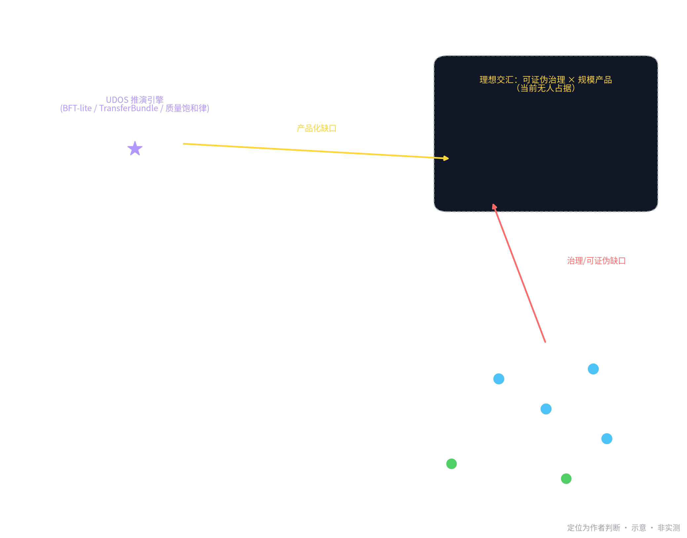

This positioning determines the comparison's nature:

- **Not a win-loss question.** Doubao has no obligation to do Byzantine fault tolerance on CPU prototypes, UDOS no obligation to do phone remote control.
- **It is a gap question.** Doubao going from lower right to upper right, lacking "governance/falsifiability"; UDOS going from upper left to upper right, lacking "productization." Two arrows point to the same blank quadrant.
- **It is a mutual-learning question.** Whoever first thickens their own side's engineering/theory, then fills the other side's gap, first occupies the ideal intersection.

> **Chapter summary**: Doubao = industrial productization mature commercial Agent system; UDOS = research falsifiable governance substrate (CPU prototype stage). The comparison's ruler is "governance and falsifiability," not market share, not benchmarks.

---

## II. Sixteen-Dimension Item-by-Item Comparison (Core Master Table)

The table below is the full text's backbone. Each dimension gives four columns: **Doubao status (three-state marked)**, **UDOS status (three evidence levels)**, **who superior**, **basis**. "Who superior" only judged on the same comparable dimension; dimensions with different goals marked "not directly comparable."

| # | Dimension | Doubao status (three states) | UDOS status (three evidence levels) | Who superior | Basis |
|---|---|---|---|---|---|
| 1 | Positioning and goals | Commercial Agent product family facing C-end and enterprise (personal productivity/team/OS-level/enterprise platform), goal real productivity delivery and commercial monetization [official statement] | Research "falsifiable governance substrate," goal making multi-Agent organization governance into testable, falsifiable formalized propositions [unverified · design proposal mainly] | Not directly comparable: commercial delivery Doubao superior, theoretical falsifiability UDOS superior | Doubao five-layer product form; UDOS P16–P28 |
| 2 | Maturity stage | Scaled commercial/productization: independent client released, phone assistant tech preview, subscription billing 68/200/500 yuan/month [official statement] | CPU prototype/single-seed pilot; most v7.6.0 architecture design proposal · pending implementation [cpu-proto + unverified] | Doubao | 2026-08-25 Doubao Work release; reports7 |
| 3 | Scale and real workload | Real users and real workloads: Doubao 1.8 daily tokens broke 5 trillion [official]; nubia M153 stocked 30,000 units, first batch sold out [media says · caliber corrected to "stocked" not "sold"]; Feishu CLI 767 function points [media says] | No product users; CPU prototype under 24 work orders, 7-person QA committee (2 Byzantine counter-voters) simulation accepted correctly [cpu-proto · single seed] | Doubao | Official release; P26; reports7 |
| 4 | Model and GUI capability | Self-developed model family: Doubao 2.1 Pro/Turbo (2026-06-24), 2.0 Pro/Lite/Mini/Code (2026-02-14); UI-TARS closed-source version (Mobile Use optimized) GUI substrate [official/media says]; open-source version arXiv:2501.12326 [paper · verified] | No real LLM long chain; CPU prototype small synthetic model (params 967796, torch 2.14.0+cpu) [cpu-proto] | Doubao (model and GUI combat) | UI-TARS paper; reports7/v7_verification.json |
| 5 | Protocols and interoperability | MCP/A2A follow-up integration; **SAEP Screen Automation operation declarative protocol is Doubao's first creation**, from 2026-09-14 30-day public notice [media says · protocol launched by Doubao]; Feishu CLI open-source MIT, 12 business domains [media says/press conference retelling] | Own TransferBundle handoff contract (six fields+scope), not connected to MCP/A2A etc. industrial protocols [six fields verified, scope design proposal] | Doubao (ecosystem interoperability); UDOS (own contract formalization) | 36Kr report; P17 |
| 6 | Multi-Agent orchestration | Work "work squad" multi-specialty Agents, single task split into multi-route sub-Agents in parallel [official statement]; but the division mechanism (research-output-check, main Agent aggregation) **official explicit text to verify** [to verify] | BFT-lite committee n≥3f+1, quorum q=2f+1; under n=7,f=2 (q=5) 10 deterministic property tests held [10 tests verified, 24 work orders end-to-end cpu-proto · single seed] | Doubao (product landing); UDOS (division correctness more formalized) | Ledger component eight; P16/P26 |
| 7 | Permission and security model | Strictly inherits Feishu permission system "what employees cannot see, Agents cannot obtain"; personal/enterprise data isolation; AI Trust enterprise security system [official caliber]; sensitive operations human review/secondary confirmation [official statement] | scope least privilege "what caller cannot do" by mechanical structure (s∉scope→scope_violation), three invariants (monotonic shrink/over-boundary reject/re-authorization must pass validate) [target verified, current design proposal] | Doubao (landed enterprise permission inheritance); UDOS (least privilege formalization harder) | Ledger component nine; P17 |
| 8 | Fault tolerance and Byzantine governance | No BFT/Byzantine fault tolerance public design; red-team adversarial testing (privilege escalation/prompt injection/inducement) pre-launch engineering gate [official/spec sheet]; no common-cause fault cutoff | BFT-lite: n≥3f+1, same-round equivocation whole round discarded, over-f silence returns NO_QUORUM triggering view change [10 deterministic property tests verified] | UDOS | Ledger component ten; P16/P26 |
| 9 | Handoff contract | Agent-as-Tool (sub-Agents parallel then main Agent reclaims control) present in product; Handoff responsibility transfer no formal contract field specification [to verify] | TransferBundle six fields Goal/Context/Done/Todo/Trace/Owner + scope, 26 tests verified [six fields verified, scope design proposal] | UDOS (formalized handoff contract) | P17 |
| 10 | Quality saturation and diversity handling | No quality saturation governance public design; success rate/function points official or media caliber, no "diversity-quality" relationship formalization [media says/to verify] | Ensemble saturation law mse(k)=a+b/k: measured a=0.009252, b=-4.23×10⁻⁵, k>2 flattens; equal-weight including one bad expert worsens MSE from about 0.0092 to 0.2131 (about 23×); core conclusion: quality first variable is independent information source count D, not headcount N [k≤2 verified, k>2 cpu-proto · single seed] | UDOS | P20/P9 |
| 11 | Settlement and market | Real commercial closed loop: pro subscription 68/200/500, API billing (2.1 Pro input 6 yuan/output 30 yuan per million tokens), terminal sales (M153 3499, NaviX Ultra after national subsidy 5499 starting) [official/media says]; no internal Agent market conservation design | Closed internal market conservation balance_sum=total_paid−slashed, total_paid≤total_budget, 10 unit tests verified; open market VCG-style design proposal [closed verified, open design proposal] | Doubao (real commercial closed loop); UDOS (settlement conservation invariant) | Ledger; P25 |
| 12 | Evidence and reproducibility | Success rate/function points/skill counts etc. official releases or media retellings, **not independently reproducible**; spec sheet itself lists 14 "to verify" items [official/media says/to verify three states] | Conclusions graded by verified/cpu-proto/cpu-proxy/unverified; cpu-proto numbers in reports7/*.json rerunnable; single seed uniformly marked "pilot point estimate," before submission must add ≥30 seeds + 95% CI [system itself] | UDOS (evidence discipline) | Ledger part five; v7.5.0 P12 |
| 13 | Openness | UI-TARS open source (github.com/bytedance/UI-TARS, arXiv:2501.12326) [official/paper]; Feishu CLI open-source MIT; product itself closed source | CPU prototype code and reports7 internally rerunnable; not externally open sourced [cpu-proto] | Tie: Doubao has real open-source model and CLI; UDOS has rerunnable prototype but not publicly released | arXiv; reports7 |
| 14 | Data flywheel and memory | Single-role conversation memory + team long-term memory (one person teaches, whole team can use) + behavior personalization memory under user authorization [official statement]; data flywheel relies on real user usage | No real user data flywheel; memory structured Trace, retained along handoff chain [design] | Doubao (real data flywheel) | Ledger component seven; P17 |
| 15 | Edge-side and cloud infrastructure | Cloud PC/Windows virtual desktop/phone remote control; system-level screenshot+event injection (WindowManagerService/inject_events only vendor preinstalled); AI cloud-native (GPU core) [official/media says]; partner vendor OS-layer preinstallation (nubia/Nubia NaviX Ultra) | Pure CPU prototype; Warp-Cortex singleton weight sharing presses memory complexity O(N·L)→O(1)+O(N·k) (paper reports: single 4090 about 100 concurrent, 2.2GB VRAM) [paper reports/cpu-proto] | Doubao (end-to-end edge engineering) | Ledger; P28/P22 |
| 16 | Governance philosophy | Engineering governance: human review gates/red teams/permission tests/canary rollback, relying on process and human checks; fast-iterating commercial system | Formalized governance: structural changes must carry test assertions, missing assertions mechanically rejected, evidence-grading gates, relying on structure and invariants [design proposal · pending implementation] | Different philosophies, each has strengths | Ledger SOP; P19 |

Compressing these 16 dimensions into one radar chart (8 representative dimensions, qualitative scoring 0–5), the shape immediately clear: Doubao bulges on the first 5 axes (product/engineering/protocol/permission/commerce), UDOS bulges on the last 3 axes (falsifiability/BFT/rerunnable).

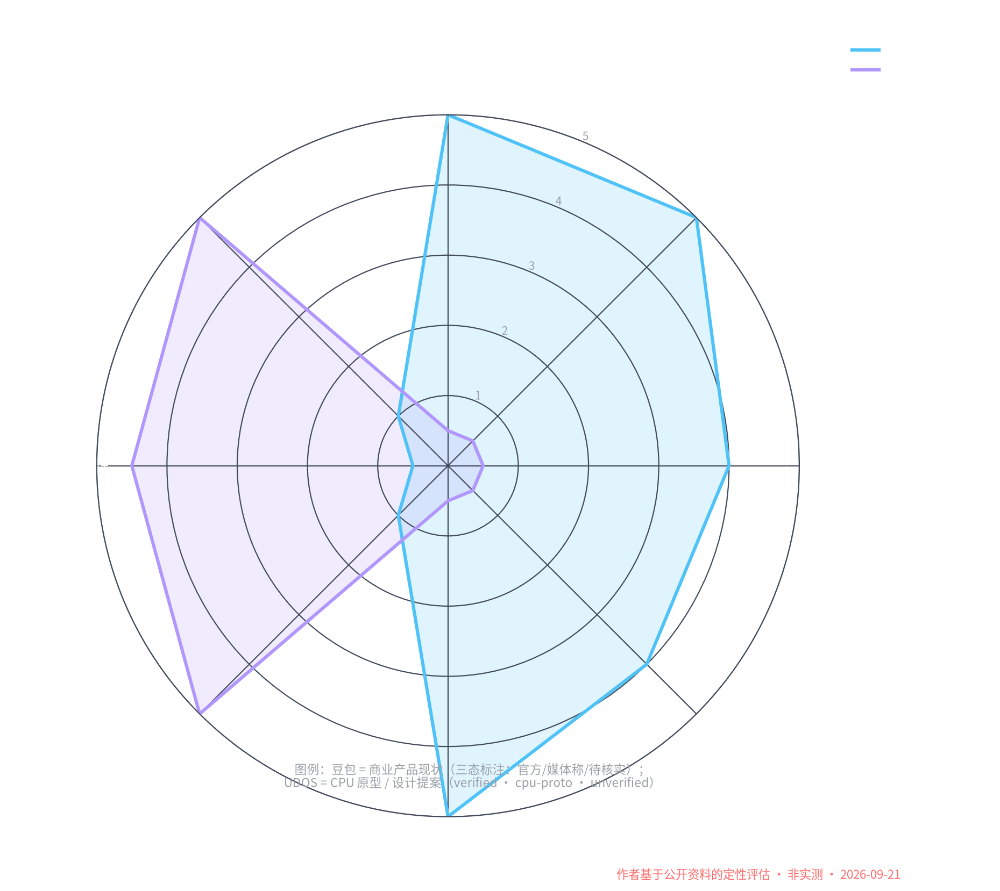

> **Chapter summary**: among 16 dimensions, Doubao clearly superior on 6 dimensions "scale workload, model GUI, protocol ecosystem, commercial closed loop, data flywheel, edge engineering"; UDOS clearly superior on 4 dimensions "Byzantine governance, handoff contract, quality saturation, evidence reproducibility"; remaining dimensions each have merits or different goals not comparable. The radar chart's two bulge directions precisely what the two routes each do thoroughly.

---

## III. The Doubao System's Advantages: The Real Thickness of Industrial Productization

Doubao's advantage is not some benchmark, but **a whole engineering chain from model to OS already running through on real users**.

1. **Real product and user scale.** Doubao 1.8 official caliber daily tokens broke 5 trillion [official]; Doubao Work 2026-08-25 released independent client, pro 68/200/500 yuan/month three-tier subscription online [official]; phone assistant first-generation nubia M153 stocked 30,000, first batch sold out [media says]. This is what UDOS entirely lacks.
2. **End-to-end engineering.** Local+cloud PC dual mode, Windows virtual desktop, phone remote controlling computer, system-level screenshot+event injection—from "helping you write documents" all the way to "clicking the screen for you." This GUI operation chain (screenshot perception→reasoning decomposition→element localization→event injection→reflective correction) is genuinely landed hard engineering.
3. **Protocol ecosystem.** Besides MCP/A2A follow-up integration, **SAEP (Screen Automation declarative protocol) is Doubao's first creation**: third-party apps autonomously declare allowing/refusing/limiting AI automated operations within this app, from 2026-09-14 30-day public notice, with traceable operation logs [media says]. This is a declarative design about "AI operation boundaries," intent one level higher than "can it click."
4. **Feishu permission inheritance and data isolation.** Doubao Work logs in via Feishu account, inheriting enterprise context within **permission scope** (group chats/docs/meeting minutes/schedules), and strictly guards "what employees cannot see, Agents cannot obtain"; personal/enterprise data isolation [official caliber]. This is enterprise Agent's hardest foundation.
5. **Skill connector ecosystem and model family iteration speed.** Skill center over 200 skills/connectors [official/media]; model family from 2024-05 first release to 2026-06's 2.1 Pro/Turbo, iteration rhythm quarterly; Coze/TRAE/AgentKit/HiAgent/ArkClaw/AI Trust fill the whole low-code to high-code development chain.
6. **Commercial closed loop.** Subscription, API billing, terminal sales three lines parallel, already self-sustaining.

> **Chapter summary**: Doubao's moat is "real"—real users, real workloads, real payment, real edge. It proves how far a commercial Agent system can go.

---

## IV. The Doubao System's Shortcomings and Black Box: Falsifiability Absent

Shortcomings must be written evidence-grounded, not blackening. Problems concentrated in "**numbers spoken out, but others cannot reproduce; division spoken about, but not written in black and white; governance relies on process, but no formalized fallback**."

1. **Key numbers official or media caliber, not independently reproducible.** Feishu CLI success rate 78%→95%, function points 247→767, skills over 200, daily tokens 5 trillion—these are releases/press conferences/media retellings [media says], outsiders cannot obtain test sets, cannot reproduce. The spec sheet itself also lists **14 "to verify" items** (e.g. Turbo/Pro concurrency and context length differences not public, skill review mechanism not public, etc.).
2. **Multi-Agent division mechanism not officially documented.** "Work squad," "research-output-check, main Agent aggregation" currently product narrative [to verify], no public white paper explaining clearly how sub-Agents divide labor, avoid duplicate work, converge conflicts.
3. **No BFT/common-cause fault cutoff.** When multiple Agents work simultaneously, if all share the same upstream error (common-cause fault), Doubao system's public materials have no "whole round discard/change view" type fault-tolerant design; its security relies on **red-team adversarial testing + human review gates + permission tests** engineering gates, "pre-launch checks," not "runtime fault tolerance."
4. **No quality saturation governance, no settlement conservation.** No formalized conclusions like "after adding the kth expert marginal returns decline, even equal-weight including a bad expert worsens quality 23×"; how many people multi-Agent invests, whether over-saturated, relies on experience not laws.
5. **No evidence-grading gates.** Conclusions not divided verified/cpu-proto/unverified, single-seed results not automatically marked "pilot point estimate," readers cannot see at a glance which number stands.

> **Chapter summary**: Doubao's black box is not "hiding bad things," but "**good numbers lack a reproducible evidence skeleton**." Its red-team and permission-test engineering done solidly, but lacks the layer sedimenting these engineering into formalized propositions.

---

## V. The UDOS Reasoning Engine's Advantages: A Falsifiable Governance Substrate

UDOS's value precisely in the layer Doubao lacks—making "how multi-Agents governed" into **testable, falsifiable** propositions. The following numbers all carry three evidence levels, not exaggerated.

1. **Falsifiable propositions and three evidence levels.** All conclusions speak graded by verified/cpu-proto/cpu-proxy/unverified; single-seed results uniformly marked "pilot point estimate," before submission must add ≥30 seeds + 95% CI. This is a discipline letting readers judge "how hard this conclusion is."
2. **BFT-lite Byzantine fault tolerance.** Committee **n ≥ 3f+1**, quorum **q = 2f+1**; same-round equivocation whole round discarded; over-f silence returns NO_QUORUM triggering view change. Under n=7, f=2 (q=5), **10 deterministic property tests** hold "honest supermajority stops/Byzantine cannot force-stop/silence transitions view"; 7-person QA committee under 2 Byzantine counter-voter members accepted all 24 work orders correctly. **10 tests verified; 24 work orders end-to-end cpu-proto (single seed)**.
3. **TransferBundle handoff contract.** Handoff package six fields Goal/Context/Done/Todo/Trace/Owner, 26 tests verified; v7.6.0 adds seventh field scope (stages current owner allowed to operate), advance automatically shrinks, handoff re-authorizes, over-boundary rejects (scope_violation). **Six fields verified; scope design proposal · pending implementation**.
4. **Quality saturation law.** Ensemble saturation law **mse(k) = a + b/k**; CPU prototype measured a=0.009252, b=-4.23×10⁻⁵, after k>2 flattens; equal-weight including one bad expert worsens MSE from about 0.0092 to **0.2131 (about 23×)**. Core conclusion: quality first variable is independent information source count D, not headcount N. **k≤2 verified, k>2 cpu-proto (single seed)**.
5. **Topology and memory complexity.** Layered trees press each node fan-in to constant 9, communication rounds to 14 (cpu-proto); Warp-Cortex singleton weight sharing presses memory complexity from O(N·L) to O(1)+O(N·k).
6. **Market conservation and review gates.** Closed internal market conservation balance_sum = total_paid − slashed, total_paid ≤ total_budget, 10 unit tests verified; before structural change merge mandatory "independent contract test assertions + key regression all green + CHANGELOG marking" three-piece set, missing assertions mechanically rejected (design proposal).

> **Chapter summary**: UDOS splits "how multi-Agent organizations governed" into a group of test-runnable, falsifiable propositions. Its numbers not pretty but hard—because each number followed by evidence grade and rerun path.

---

## VI. The UDOS Reasoning Engine's Shortcomings: The Research Prototype's Ceiling

Honestly, UDOS currently is **not a usable product**. Shortcomings likewise must be written clearly, not deified.

1. **CPU prototype / single seed / no real LLM long chain.** All cpu-proto numbers run on CPU, single seed, using 96,000-parameter-class synthetic models, not connected to real large models' long-chain reasoning. The 23× worsening, k>2 flattening conclusions currently all "pilot point estimates."
2. **No product users, no real workloads.** Not one real user using, much less real traffic, real enterprise permission scenarios; 24 work orders simulated work orders, not online incidents.
3. **No GUI/edge-side/permission system.** No cloud PC, no phone remote control, no OS-level event injection, nor a ready enterprise identity permission system like Feishu to inherit.
4. **No protocol ecosystem and commercial landing.** Not connected to MCP/A2A/SAEP, no subscription billing, no customers.
5. **Most new architecture still design proposals.** Three-level typed finality, scope field, review gates, open market VCG—these v7.6.0 new things overwhelmingly marked `[RESULT NEEDED]`, no measured gains yet.

> **Chapter summary**: UDOS's ceiling is "not yet entered the real world." Its proposed propositions good, but to reproduce on real LLMs, real users, real workloads, only then counts.

---

## VII. Bidirectional Mutual-Learning List

This is the full text's most practical table: what Doubao can borrow from UDOS, what UDOS can borrow from Doubao. Both directions not "copying," but "connecting the piece the other side already thought clearly to their own engineering/theory."

| Direction | Learn what | Land on own existing capability | Expected gain |
|---|---|---|---|
| Doubao ← UDOS | **BFT-lite committee stop** | Upgrading "work squad" multi-sub-Agent stop/convergence from main Agent self-awareness to n≥3f+1 majority decision, same-round errors whole round discarded | Common-cause faults no longer wrong all the way |
| Doubao ← UDOS | **scope least privilege** | Upgrading "if employees cannot see, Agents cannot obtain" from permission test cases to mechanical invariants (over-boundary reject, not silently pass) | Least privilege relies on structure not human review |
| Doubao ← UDOS | **Evidence-grading gates** | Marking release-style success/function points per verified/cpu-proto/unverified, single seed automatically marked "pilot point estimate" | Key numbers reproducible, traceable |
| Doubao ← UDOS | **Quality saturation law** | Using mse=a+b/k to guide "how many sub-Agents a task should dispatch, when to stop adding people" | Avoid multi-Agent over-saturation instead degrading quality |
| Doubao ← UDOS | **Review gates** | Engineering red-team/permission tests: before structural changes (schema/contract field changes) merge mandatory test assertions, missing assertions mechanically rejected | Launch gate from "human feels okay" to "tests green only" |
| UDOS ← Doubao | **SAEP declarative operation boundaries** | Making "whether AI can operate some external app" into a third-party declarable, traceable protocol layer, not hardcoded | From simulation toward real application ecosystem |
| UDOS ← Doubao | **Feishu permission inheritance model** | Enterprise Agent not starting another permission system, directly inheriting existing identity system and data isolation boundaries | Enterprise landing permission foundation |
| UDOS ← Doubao | **Cloud PC/edge engineering** | Filling GUI operations (screenshot→localization→injection) and cloud phone/virtual desktop execution environment | From text Agent toward able to operate systems |
| UDOS ← Doubao | **Skill review and canary rollback** | Pre-launch red-team adversarial + directed co-creation canary + one-click rollback (close Agent/remove connector/retreat version) | Research systems also safely iterate |
| UDOS ← Doubao | **Productization launch SOP** | Borrowing eight-stage×four-role SOP to release, canary, operate research prototypes at engineering rhythm | From prototype toward usable product |

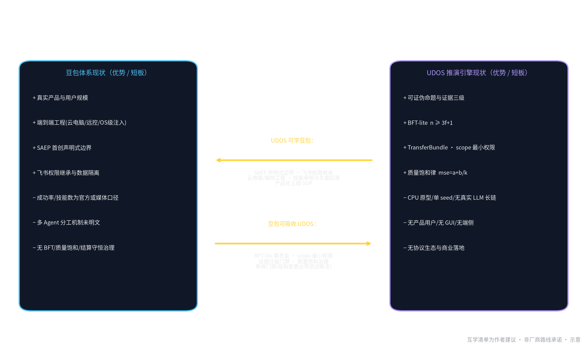

> **Chapter summary**: the "governance skeleton" Doubao lacks is precisely UDOS's ready one; the "product flesh" UDOS lacks is precisely Doubao's ready one. The ideal intersection quadrant not imagined—it is what this mutual-learning table looks like after landing.

---

## VIII. Five Falsifiable Predictions

The following 5 all written in "overturnable by future facts" form, scoring time uniformly **2027-09-21** (one year after this paper's publication).

| # | Prediction | If holds (which of this paper's judgments falsified) | If not holds (maintain this paper's judgment) | Scoring time |
|---|---|---|---|---|
| 1 | Doubao will publicly release multi-Agent division (research-output-check/main Agent aggregation) mechanism white paper and reproducible success rate | Then the "multi-Agent division mechanism not officially documented" shortcoming falsified, Doubao catches up to UDOS's formalized clarity in this dimension | Still no white paper—maintain "division not documented" judgment | 2027-09-21 |
| 2 | Doubao will introduce BFT-lite-style committee stop/common-cause fault cutoff and publicly test | Then its fault tolerance upgrades from "red-team engineering" to "formalized fault tolerance," dimension 8 advantage changes hands | Still relies on human review gates, no formalized fault tolerance—maintain | 2027-09-21 |
| 3 | UDOS will on real LLM long chains (≥3 real models, ≥30 seeds, 95% CI) reproduce BFT-lite stop correctness and quality saturation law mse=a+b/k | Then cpu-proto single-point estimate upgrades to verified, research value genuinely lands, "prototype limitation" shortcoming partially falsified | Still stops at CPU synthetic models—maintain "CPU prototype/single seed" judgment | 2027-09-21 |
| 4 | Doubao will make "if employees cannot see, Agents cannot obtain" permission inheritance public as reproducible formalized assertions/test suites (rather than official caliber) | Then its reproducibility shortcoming improves, evidence discipline catches up to UDOS | Still only official caliber, no test suites—maintain | 2027-09-21 |
| 5 | By scoring time, an ideal intersection system "falsifiable governance × scaled product" will appear (both reaching Doubao-level real workload and carrying UDOS-level evidence-grading gates) | Then this comparison framework positioning matrix's "upper right occupied by no one" judgment overturned | Still occupied by no one—maintain two systems in two quadrants judgment | 2027-09-21 |

> **Chapter summary**: a comparison paper's value is not in saying who is strong now, but in **writing propositions testable by the future**. Looking back at these 5 one year later, whichever overturned, one more point of understanding than now.

---

## IX. Failure Boundaries

1. **Material cutoff**: this comparison based on public materials and two spec sheets as of **2026-09-21**; after this any Doubao or UDOS updates may make conclusions stale.
2. **Doubao iterates extremely fast**: Doubao a fast-iterating commercial system, versions, pricing, function points change weekly/monthly, this paper's numbers (68/200/500, 767, 78%→95%, 200+, 2026-08-25 etc.) only represent that time's caliber, not current or future.
3. **UDOS mostly single-seed pilots**: UDOS side numbers mostly cpu-proto single-seed pilot point estimates, no multi-seed and 95% CI, extrapolation cautious; most v7.6.0 new architecture design proposal · pending implementation.
4. **Qualitative scoring not measured**: radar chart and positioning matrix landings author's **qualitative assessment** based on public materials, not either side's measured benchmarks or official scores.
5. **Not constituting procurement advice**: this paper technical contrast and research notes, not constituting procurement, investment or selection advice for any product; Doubao product names only describe public positioning, not endorsing vendors.

---

## References

1. Doubao Agent system "Architecture and Design Specification Sheet" (light-rendered version, 14 tables, user-uploaded attachment, 2026-09).
2. "Doubao Agent / Intelligent Agent / Super Intelligent Agent—Architecture and System · Design Specification Sheet · SOP" (user-uploaded attachment, containing three-state source marking, 2026-09).
3. ByteDance Seed & Tsinghua. *UI-TARS: Pioneering Automated GUI Interaction with Native Agents*. arXiv:2501.12326, 2025-01-22. https://arxiv.org/abs/2501.12326
4. Economic Information Daily: Doubao large model (Skylark) first release, 2024-05-15. jjckb.cn/2024-05/15/c_1310774888.htm
5. CNR: Doubao large model enters 2.0 stage (Pro/Lite/Mini+Code), 2026-02-14. tech.cnr.cn
6. China Science and Technology Network/Jingbao News/The Paper: Doubao pro version online, connected to 2.1 Pro/Turbo, 2026-06-24.
7. Guangming Web: Doubao Work independent client released, 2026-08-25; skills and connectors over 200, 2026-08-21. economy.gmw.cn / it.gmw.cn
8. 36Kr: SAEP Screen Automation declarative protocol 30-day public notice, 2026-09-14; Xie Xin on Feishu CLI 247→767 / 78%→95% / speed +39%, 2026-09-15.
9. China Daily/aily official help center: Feishu aily renamed "Doubao Work Companion" (renamed 2026-08-14, 2026-09-15 conference release), "domestic first team Agent."
10. Jiemian/ZOL: first-generation nubia M153 3499 yuan, stocked 30,000, first batch sold out, 2025-12-01.
11. 36Kr/Sina: Nubia NaviX Ultra official price 5999 yuan, after national subsidy 5499 starting, 2026-09.
12. UDOS Reasoning Engine master papers P16–P28 and `reports7/*.json` (BFT-lite stop decision, TransferBundle, quality saturation law, topology complexity, market conservation, three evidence levels), v7.5.0/v7.6.0/v7.7.x read-only retelling.

---

*UDOS v7.7.3 · Doubao two papers · lower paper (comparison paper) · 2026-09-21*


---
